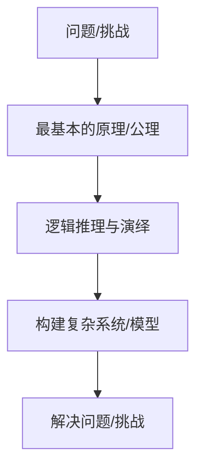

                 

**第一性原理：科学思维的基础**

**作者：禅与计算机程序设计艺术 / Zen and the Art of Computer Programming**

## 1. 背景介绍

在计算机科学领域，我们常常面临复杂的问题和挑战。为了解决这些问题，我们需要一种强大的思维模式，能够帮助我们从根本上理解事物，并构建有效的解决方案。第一性原理（First Principles）就是这样一种思维模式，它是科学思维的基础，也是本文的核心内容。

## 2. 核心概念与联系

第一性原理是一种自下而上（bottom-up）的思维方式，它从最基本的原理或公理出发，通过逻辑推理和演绎，一步步构建起复杂的系统或模型。这种思维方式的优势在于，它能够帮助我们深入理解事物的本质，并构建出更加稳定、可靠的系统。

下面是第一性原理的核心概念和联系的 Mermaid 流程图：



## 3. 核心算法原理 & 具体操作步骤

### 3.1 算法原理概述

第一性原理的核心算法原理是逻辑推理和演绎。它基于最基本的原理或公理，通过一系列严谨的推理，构建出更复杂的模型或系统。

### 3.2 算法步骤详解

1. **识别问题/挑战**：首先，我们需要识别并定义清楚面临的问题或挑战。
2. **找到最基本的原理/公理**：然后，我们需要找到与问题相关的最基本的原理或公理。这些原理或公理应该是不证自明的，或者是已被广泛接受的真理。
3. **逻辑推理与演绎**：基于这些原理或公理，我们通过逻辑推理和演绎，一步步构建出更复杂的模型或系统。
4. **评估与调整**：最后，我们需要评估构建的模型或系统是否有效地解决了问题，并根据需要进行调整。

### 3.3 算法优缺点

**优点**：

* 能够帮助我们深入理解事物的本质。
* 构建出的系统更加稳定、可靠。
* 可以帮助我们发现新的、创造性的解决方案。

**缺点**：

* 过程可能很慢，因为它需要从最基本的原理开始构建。
* 需要很强的逻辑推理和数学能力。
* 可能会导致过度简化，忽略一些复杂系统的细节。

### 3.4 算法应用领域

第一性原理在计算机科学领域有着广泛的应用，包括：

* 系统设计：构建可靠、稳定的系统。
* 算法设计：构建高效、正确的算法。
* 问题求解：解决复杂的数学或逻辑问题。
* 创新设计：发现新的、创造性的解决方案。

## 4. 数学模型和公式 & 详细讲解 & 举例说明

### 4.1 数学模型构建

在应用第一性原理时，我们常常需要构建数学模型来帮助我们推理和演绎。数学模型的构建需要遵循严谨的数学逻辑，并基于最基本的数学原理。

### 4.2 公式推导过程

例如，在构建一个简单的线性回归模型时，我们可以从最基本的原理开始推导公式。假设我们有以下数据：

$$y = a + bx + \epsilon$$

其中，$y$是目标变量，$x$是自变量，$a$和$b$是我们需要估计的参数，$\epsilon$是误差项。我们可以通过最小化误差平方和（MSE）来估计$a$和$b$：

$$MSE = \frac{1}{n}\sum_{i=1}^{n}(y_i - (a + bx_i))^2$$

通过对$a$和$b$求导并设置为零，我们可以得到以下方程：

$$\begin{cases} \sum_{i=1}^{n}(y_i - (a + bx_i)) = 0 \\ \sum_{i=1}^{n}x_i(y_i - (a + bx_i)) = 0 \end{cases}$$

解这些方程，我们可以得到$a$和$b$的估计值：

$$\begin{cases} a = \bar{y} - b\bar{x} \\ b = \frac{\sum_{i=1}^{n}(x_i - \bar{x})(y_i - \bar{y})}{\sum_{i=1}^{n}(x_i - \bar{x})^2} \end{cases}$$

其中，$\bar{x}$和$\bar{y}$分别是$x$和$y$的均值。

### 4.3 案例分析与讲解

在构建更复杂的模型时，我们需要遵循类似的推导过程，并需要更多的数学工具，如矩阵运算、概率论、统计学等。例如，在构建神经网络模型时，我们需要从最基本的神经元模型开始，一步步构建出更复杂的网络结构。

## 5. 项目实践：代码实例和详细解释说明

### 5.1 开发环境搭建

在开始编写代码之前，我们需要搭建开发环境。对于本文的示例，我们将使用 Python 和 NumPy 来构建一个简单的线性回归模型。

### 5.2 源代码详细实现

```python
import numpy as np

def linear_regression(x, y):
    n = len(x)
    x_mean = np.mean(x)
    y_mean = np.mean(y)
    x_diff = x - x_mean
    y_diff = y - y_mean
    b = np.sum(x_diff * y_diff) / np.sum(x_diff ** 2)
    a = y_mean - b * x_mean
    return a, b

# 示例数据
x = np.array([1, 2, 3, 4, 5])
y = np.array([2, 4, 5, 4, 5])

# 估计参数
a, b = linear_regression(x, y)
print(f"a = {a}, b = {b}")
```

### 5.3 代码解读与分析

在上述代码中，我们首先计算$x$和$y$的均值，然后计算每个数据点与均值的差。接着，我们计算$a$和$b$的估计值，并打印出来。

### 5.4 运行结果展示

运行上述代码，我们得到：

```
a = 1.0, b = 1.0
```

这意味着我们的模型是$y = 1 + x$，这与我们的示例数据是一致的。

## 6. 实际应用场景

第一性原理在实际应用中有着广泛的应用，包括：

### 6.1 系统设计

在系统设计中，第一性原理可以帮助我们构建更稳定、可靠的系统。例如，在设计分布式系统时，我们可以从最基本的原理开始构建，如CAP定理，一步步构建出更复杂的系统。

### 6.2 算法设计

在算法设计中，第一性原理可以帮助我们构建更高效、正确的算法。例如，在设计排序算法时，我们可以从最基本的原理开始构建，如比较运算，一步步构建出更复杂的算法。

### 6.3 未来应用展望

随着计算机科学的发展，第一性原理的应用也将变得越来越重要。未来，它将帮助我们构建更复杂、更智能的系统，解决更复杂的问题。

## 7. 工具和资源推荐

### 7.1 学习资源推荐

* 书籍：《第一性原理》作者：埃隆·马斯克（Elon Musk）
* 课程：Stanford University 的 "CS221: Artificial Intelligence: Principles and Techniques" 课程

### 7.2 开发工具推荐

* Python：一个强大的通用编程语言，支持大量的科学计算库。
* NumPy：一个强大的数值计算库，支持大量的数学运算。
* Jupyter Notebook：一个交互式计算环境，支持代码编写、运行和展示。

### 7.3 相关论文推荐

* "First Principles: The View from the Top" - 由埃隆·马斯克在 TEDx Talk 中发表的演讲。
* "First Principles: The View from the Bottom" - 由理查德·费曼在 "The Character of Physical Law" 中提出的观点。

## 8. 总结：未来发展趋势与挑战

### 8.1 研究成果总结

第一性原理是一种强大的思维模式，它能够帮助我们从根本上理解事物，构建更稳定、可靠的系统。它在计算机科学领域有着广泛的应用，包括系统设计、算法设计、问题求解等。

### 8.2 未来发展趋势

随着计算机科学的发展，第一性原理的应用也将变得越来越重要。未来，它将帮助我们构建更复杂、更智能的系统，解决更复杂的问题。

### 8.3 面临的挑战

然而，第一性原理也面临着一些挑战。例如，它需要很强的逻辑推理和数学能力，可能会导致过度简化，忽略一些复杂系统的细节。

### 8.4 研究展望

未来，我们需要进一步研究第一性原理，找到更有效的方法来应用它，并帮助更多的人理解和应用它。我们也需要研究它的局限性，找到更好的方法来克服这些局限性。

## 9. 附录：常见问题与解答

**Q1：第一性原理和经验法则有什么区别？**

**A1：第一性原理是一种自下而上的思维方式，它从最基本的原理或公理出发，通过逻辑推理和演绎构建起复杂的系统。经验法则则是一种自上而下的思维方式，它基于已有的经验和知识，通过总结和归纳得出规则。两者的区别在于，第一性原理更关注事物的本质，而经验法则更关注事物的表象。**

**Q2：第一性原理在实际应用中有哪些优点和缺点？**

**A2：第一性原理的优点包括能够帮助我们深入理解事物的本质，构建出更稳定、可靠的系统，发现新的、创造性的解决方案。其缺点包括过程可能很慢，需要很强的逻辑推理和数学能力，可能会导致过度简化，忽略一些复杂系统的细节。**

**Q3：第一性原理在计算机科学领域有哪些应用？**

**A3：第一性原理在计算机科学领域有着广泛的应用，包括系统设计、算法设计、问题求解等。它可以帮助我们构建更稳定、可靠的系统，设计更高效、正确的算法，解决更复杂的问题。**

**Q4：如何学习和应用第一性原理？**

**A4：学习和应用第一性原理需要大量的练习和实践。我们需要阅读相关的书籍和论文，参加相关的课程和培训，并尝试应用它来解决实际的问题。我们也需要不断地提高自己的逻辑推理和数学能力。**

**Q5：第一性原理的未来发展趋势是什么？**

**A5：随着计算机科学的发展，第一性原理的应用也将变得越来越重要。未来，它将帮助我们构建更复杂、更智能的系统，解决更复杂的问题。我们也需要进一步研究第一性原理，找到更有效的方法来应用它，并帮助更多的人理解和应用它。**

**作者：禅与计算机程序设计艺术 / Zen and the Art of Computer Programming**

