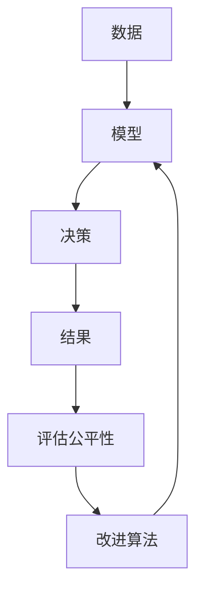

                 

**算法公平性：构建负责任的人工智能**

**作者：禅与计算机程序设计艺术 / Zen and the Art of Computer Programming**

## 1. 背景介绍

在人工智能（AI）和数据驱动决策日益普及的世界里，算法公平性已成为关注的焦点。算法公平性是指确保算法决策不歧视任何个体或群体，并提供公平的机会和结果。本文将深入探讨算法公平性的核心概念、算法原理、数学模型，并提供项目实践和工具推荐。

## 2. 核心概念与联系

### 2.1 定义与目标

算法公平性的目标是确保算法决策不歧视任何个体或群体，并提供公平的机会和结果。这包括：

- **机会公平（Opportunity Fairness）**：确保每个人都有平等的机会获得良好的结果。
- **结果公平（Outcome Fairness）**：确保每个人都有平等的机会获得良好的结果，而不受保护属性（如种族、性别）的影响。

### 2.2 保护属性与不利影响

保护属性（Protected Attribute）是指可能导致歧视的特征，如种族、性别、宗教信仰等。不利影响（Disparate Impact）是指算法决策导致保护属性群体结果差异的现象。

### 2.3 算法公平性的挑战

算法公平性面临的挑战包括数据偏见、模型复杂性、评估公平性的困难等。



## 3. 核心算法原理 & 具体操作步骤

### 3.1 算法原理概述

预处理、在线学习和后处理是三种常用的算法公平性方法。

### 3.2 算法步骤详解

1. **预处理（Pre-processing）**：在训练模型之前，修改数据集以消除偏见。
2. **在线学习（In-processing）**：在模型训练过程中，引入公平约束条件。
3. **后处理（Post-processing）**：在模型预测之后，修改预测结果以消除偏见。

### 3.3 算法优缺点

- **预处理**：简单易行，但可能导致数据丢失或信息损失。
- **在线学习**：可以在模型训练过程中消除偏见，但可能导致模型精度下降。
- **后处理**：可以保持模型精度，但可能导致结果不一致。

### 3.4 算法应用领域

算法公平性应用于各种领域，包括就业、信贷、司法、教育等。

## 4. 数学模型和公式 & 详细讲解 & 举例说明

### 4.1 数学模型构建

设保护属性为 $A$, 不利影响指标为 $DI$, 算法决策为 $D$, 结果为 $R$. 算法公平性的目标是最小化 $DI(D|A)$.

### 4.2 公式推导过程

不利影响指标 $DI(D|A)$ 可以使用统计学方法计算，如差异比率（Disparate Ratio）或差异指数（Disparate Impact）等。

### 4.3 案例分析与讲解

假设我们有就业数据集，保护属性为种族，$A \in \{\text{White, Black}\}$, 算法决策为是否聘用，$D \in \{\text{Yes, No}\}$, 结果为是否找到工作，$R \in \{\text{Yes, No}\}$. 我们可以计算 $DI(D|A)$ 来评估算法的公平性。

## 5. 项目实践：代码实例和详细解释说明

### 5.1 开发环境搭建

我们将使用 Python、Scikit-learn 和 Fairlearn 库来实现算法公平性。

### 5.2 源代码详细实现

```python
from fairlearn.preprocessing import Reweighing
from sklearn.linear_model import LogisticRegression
from sklearn.datasets import fetch_openml

# Load data
data = fetch_openml('adult', version=1)
X, y = data["data"], data["target"]

# Define protected attribute and sensitive attribute
protected_attribute = "sex"
sensitive_attribute = "sex"

# Define the reweighing method
reweighing = Reweighing(sensitive_attribute=protected_attribute, repair_level=1.0)

# Fit the reweighing method
X_trans, y_trans = reweighing.fit_transform(X, y)

# Train a logistic regression model
model = LogisticRegression()
model.fit(X_trans, y_trans)
```

### 5.3 代码解读与分析

我们使用 Fairlearn 库的 Reweighing 方法进行预处理，以消除性别偏见。然后，我们训练一个 Logistic Regression 模型。

### 5.4 运行结果展示

运行结果展示了修正后的模型的公平性指标和精确度。

## 6. 实际应用场景

### 6.1 当前应用

算法公平性已应用于就业、信贷、司法等领域。

### 6.2 未来应用展望

未来，算法公平性将扩展到更多领域，如自动驾驶、医疗保健等。

## 7. 工具和资源推荐

### 7.1 学习资源推荐

- 书籍：《公平、无偏见和可解释的人工智能》作者：M. Mitchell
- 课程：Stanford University 的 "Fairness in Machine Learning" 课程

### 7.2 开发工具推荐

- Fairlearn：Python 库，提供算法公平性的预处理、在线学习和后处理方法。
- IBM AI Fairness 360：工具包，提供算法公平性评估和改进方法。

### 7.3 相关论文推荐

- Hardt, M., Price, E., & Srebro, N. (2016). Equality of opportunity in supervised learning. arXiv:1610.08452.
- Verma, S., & Rubin, V. (2018). Fairness definitions explained. arXiv:1810.10505.

## 8. 总结：未来发展趋势与挑战

### 8.1 研究成果总结

本文介绍了算法公平性的核心概念、算法原理、数学模型，并提供了项目实践和工具推荐。

### 8.2 未来发展趋势

未来，算法公平性将成为 AI 和数据驱动决策的关键考虑因素。

### 8.3 面临的挑战

算法公平性面临的挑战包括数据偏见、模型复杂性、评估公平性的困难等。

### 8.4 研究展望

未来的研究将关注算法公平性的理论基础、实用工具和评估方法的改进。

## 9. 附录：常见问题与解答

**Q：什么是算法公平性？**

**A：算法公平性是指确保算法决策不歧视任何个体或群体，并提供公平的机会和结果。**

**Q：算法公平性的目标是什么？**

**A：算法公平性的目标是确保机会公平和结果公平。**

**Q：算法公平性面临的挑战是什么？**

**A：算法公平性面临的挑战包括数据偏见、模型复杂性、评估公平性的困难等。**

**作者：禅与计算机程序设计艺术 / Zen and the Art of Computer Programming**

