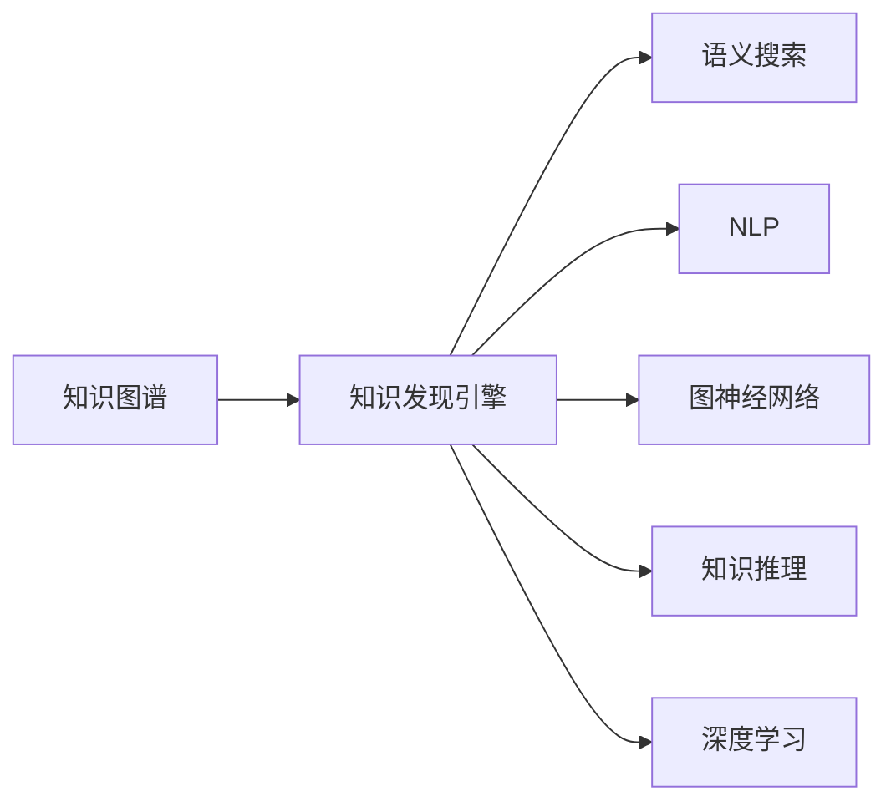

                 

# 知识发现引擎：开启知识应用新纪元

> 关键词：知识发现引擎, 知识图谱, 语义搜索, 自然语言处理(NLP), 图神经网络(GNN), 知识推理, 深度学习, 工业应用

## 1. 背景介绍

### 1.1 问题由来

随着大数据时代的到来，信息的庞杂性、多源性以及实时性对知识应用提出了新的挑战。如何在海量数据中高效发现、组织和应用知识，成为了知识工程领域的一大难题。传统的知识表示与处理方式如规则、词典、关系数据库等，已无法满足复杂多变的知识应用场景。与此同时，人工智能与大数据技术的迅猛发展，为知识发现与应用带来了新的曙光。

### 1.2 问题核心关键点

为了解决知识发现与应用的难题，人们提出了多种创新的知识获取与处理方法，如知识图谱、语义搜索、自然语言处理(NLP)等。其中，知识图谱以其结构化的知识表示与组织方式，成为当下知识工程的主流方法。而基于知识图谱的知识发现引擎，则进一步将知识的应用推向了深度和广度。

知识图谱通过对实体、关系、属性进行结构化表示，将知识组织为图谱形式，使得复杂的知识结构得以明确化和系统化。而知识发现引擎则是构建在知识图谱基础上的智能应用系统，能够从图谱中高效地发现和提取知识，支持知识推理、语义搜索、智能推荐等功能，驱动工业界知识应用的快速发展。

## 2. 核心概念与联系

### 2.1 核心概念概述

为了更好地理解基于知识图谱的知识发现引擎，本节将介绍几个密切相关的核心概念：

- 知识图谱(Knowledge Graph)：一种结构化的知识表示方式，将实体、属性、关系通过图谱结构进行组织，实现知识的系统化表达。

- 知识发现引擎(Knowledge Discovery Engine)：构建在知识图谱基础上的智能应用系统，能够从图谱中高效地发现和提取知识，支持多种知识应用功能。

- 语义搜索(Semantic Search)：通过语义理解，实现更加智能和准确的信息检索。

- 自然语言处理(Natural Language Processing, NLP)：使计算机能够理解、解释和生成人类语言的技术。

- 图神经网络(Graph Neural Network, GNN)：一类用于处理图数据的神经网络，能够捕捉节点与节点之间的关系，进行知识推理和特征学习。

- 知识推理(Knowledge Reasoning)：利用图谱中的逻辑规则和语义关系，进行事实推理和知识发现。

- 深度学习(Deep Learning)：一类基于神经网络的机器学习技术，擅长处理复杂模式和海量数据。

这些核心概念之间相互关联，共同构成了知识发现引擎的核心技术体系，使得知识的应用更加全面和智能化。

### 2.2 核心概念原理和架构的 Mermaid 流程图



该流程图展示了知识图谱与知识发现引擎的核心概念及其之间的逻辑关系：

1. 知识图谱为知识发现引擎提供结构化的知识基础。
2. 语义搜索、NLP、图神经网络、知识推理、深度学习等技术，共同构建知识发现引擎的智能应用能力。

## 3. 核心算法原理 & 具体操作步骤

### 3.1 算法原理概述

基于知识图谱的知识发现引擎，其核心思想是通过图谱中的实体、关系和属性，构建知识图网络，并通过一系列算法，高效地进行知识推理、特征提取和信息检索。知识发现引擎主要包括三个关键步骤：

1. 知识图谱构建：将领域知识、结构化数据等转化为知识图谱。
2. 知识推理与检索：基于图神经网络等技术，从知识图谱中推理出事实关系，实现语义搜索。
3. 智能应用：结合自然语言处理等技术，实现知识推理、智能推荐、智能问答等功能。

### 3.2 算法步骤详解

#### 3.2.1 知识图谱构建

知识图谱的构建通常分为两个阶段：

1. 知识采集：通过爬虫、API接口、手动输入等方式，获取领域知识源数据，如维基百科、行业数据库、网络文本等。
2. 知识抽取与整合：对采集到的数据进行实体识别、关系抽取、属性填充等操作，形成结构化的知识图谱。

知识抽取主要有两种方法：

- 规则驱动方法：通过定义抽取规则，对结构化数据进行自动抽取。例如，利用正则表达式识别机构名、人名、时间等实体信息。
- 机器学习方法：通过训练分类模型、序列标注模型等，自动抽取无结构化数据中的实体和关系。例如，利用命名实体识别(NER)模型识别文本中的实体，再利用关系抽取模型抽取实体之间的关系。

知识抽取后，需要对抽取结果进行验证和修正，确保数据的准确性和一致性。常用的方法包括：

- 人工验证：由专家对抽取结果进行审核，发现错误并进行修正。
- 数据融合：将不同数据源的抽取结果进行整合，消除冗余和矛盾，形成统一的知识图谱。

#### 3.2.2 知识推理与检索

知识推理与检索是知识发现引擎的核心功能之一，主要包括以下步骤：

1. 知识嵌入：将实体、关系和属性通过向量化表示，形成图神经网络的输入数据。常用的方法包括TransE、GNN等。
2. 图神经网络建模：通过图神经网络对知识图谱进行建模，学习节点的表示和关系特征，进行知识推理。常用的图神经网络包括GCN、GAT、GPR等。
3. 语义搜索：利用深度学习模型如BERT、ELMo等，对用户查询进行语义理解，在知识图谱中查找相关信息。常用的方法包括向量检索、图匹配等。

#### 3.2.3 智能应用

智能应用是将知识推理与检索的结果应用于实际场景的关键步骤。主要包括以下功能：

1. 知识推荐：利用图神经网络对用户行为和偏好进行建模，推荐相关实体和关系。常用的推荐算法包括协同过滤、深度学习等。
2. 智能问答：通过自然语言处理技术，理解用户的问题，在知识图谱中查找相关答案，并生成自然语言的回答。常用的技术包括对话系统、信息抽取等。
3. 数据可视化：将知识图谱中抽取的信息，通过图形界面或图表形式进行展示，帮助用户直观理解知识结构。常用的方法包括Gephi、D3.js等。

### 3.3 算法优缺点

基于知识图谱的知识发现引擎具有以下优点：

1. 结构化表示：知识图谱的结构化表示方式，使得知识的组织更加系统化，便于推理和检索。
2. 高效推理：通过图神经网络等技术，能够高效地进行知识推理，发现隐含的关系和事实。
3. 语义搜索：结合NLP技术，实现语义理解的搜索功能，能够匹配更加复杂和模糊的查询。
4. 智能应用：通过智能推荐、智能问答等功能，提高知识应用的效果和用户体验。

同时，该方法也存在一些局限性：

1. 数据采集难度大：知识图谱构建需要大量的领域知识源数据，采集难度大。
2. 数据质量难以保证：知识抽取和整合过程中，难免出现错误和冗余，影响知识图谱的质量。
3. 计算资源消耗大：图神经网络等复杂算法需要高计算资源，对硬件要求较高。
4. 知识推理复杂：对于复杂的推理问题，需要设计复杂的模型和算法，且容易产生过拟合问题。
5. 应用场景受限：对于实时性要求高或数据量庞大的场景，知识图谱的应用可能受到限制。

### 3.4 算法应用领域

基于知识图谱的知识发现引擎，已经广泛应用于多个领域，例如：

1. 智能推荐系统：如电商平台的商品推荐、视频网站的个性化推荐等。通过分析用户行为和知识图谱中的关系，实现精准推荐。
2. 智能问答系统：如智能客服、医疗咨询、智能翻译等。通过理解用户问题，在知识图谱中查找相关答案，生成自然语言的回答。
3. 知识管理与整合：如企业的知识库管理、政府的数据治理等。通过整合多源异构数据，形成统一的、结构化的知识图谱。
4. 科学研究和工程设计：如天文学、材料科学、工程设计等领域的研究和设计。通过知识图谱中的知识和推理能力，辅助科研和设计过程。
5. 金融风控和市场分析：如信贷评估、风险控制、市场趋势预测等。通过分析金融数据和知识图谱中的关系，提供决策支持。

这些应用场景展示了知识发现引擎在实际应用中的广泛性和实用性，为各行业的知识应用提供了有力支持。

## 4. 数学模型和公式 & 详细讲解  
### 4.1 数学模型构建

基于知识图谱的知识发现引擎，其核心数学模型主要包括以下几个组成部分：

- 实体-关系-属性表示：将实体、关系和属性通过向量表示，形成知识图网络。
- 图神经网络：利用图神经网络对知识图谱进行建模，学习节点的表示和关系特征。
- 语义搜索：利用深度学习模型对用户查询进行语义理解，在知识图谱中查找相关信息。

### 4.2 公式推导过程

#### 4.2.1 知识嵌入

知识嵌入是将实体、关系和属性通过向量表示的过程。常用的方法包括TransE、GNN等。以TransE为例，其数学模型如下：

$$
h = f_e(x, r)
$$
$$
t = f_e(x, r)
$$

其中，$x$ 为实体向量，$r$ 为关系向量，$h$ 为实体$x$关于关系$r$的目标实体向量。

#### 4.2.2 图神经网络建模

图神经网络通过消息传递机制，捕捉节点与节点之间的关系，进行知识推理。常用的图神经网络包括GCN、GAT、GPR等。以GCN为例，其数学模型如下：

$$
\mathcal{A}(h, t) = \sigma\left(\frac{1}{\sqrt{d_h + d_t}} \left( W_e h + W_r \mathcal{B}_h t \right) \right)
$$

其中，$d_h$ 和 $d_t$ 分别为节点 $h$ 和 $t$ 的特征维数，$W_e$ 和 $W_r$ 为关系矩阵的权重矩阵，$\mathcal{B}_h$ 为节点 $h$ 的邻居关系矩阵，$\sigma$ 为激活函数。

#### 4.2.3 语义搜索

语义搜索利用深度学习模型对用户查询进行语义理解，在知识图谱中查找相关信息。常用的方法包括向量检索、图匹配等。以向量检索为例，其数学模型如下：

$$
\text{similarity}(q, e) = \cos(\theta)
$$

其中，$q$ 为查询向量，$e$ 为知识图谱中的实体向量，$\theta$ 为夹角余弦。

### 4.3 案例分析与讲解

#### 4.3.1 电商推荐系统

电商推荐系统是知识发现引擎的重要应用场景之一。通过分析用户行为和知识图谱中的关系，实现精准推荐。

假设用户$x$浏览过商品$e_1, e_2, \dots, e_n$，我们将其行为编码为向量$x$。对于知识图谱中的每个商品实体$e_i$，其向量表示为$e_i$。关系$r_1$表示商品之间的关系，如“类似”、“互补”等。关系$r_2$表示商品与用户的互动关系，如“浏览”、“购买”等。

利用图神经网络，我们可以构建推荐模型的知识图谱，通过关系$r_1$和$r_2$进行知识推理和特征学习，得到用户行为表示和商品向量表示。利用向量检索技术，对用户行为和商品向量进行相似度匹配，得到推荐结果。

#### 4.3.2 智能问答系统

智能问答系统是知识发现引擎的另一个重要应用场景。通过理解用户问题，在知识图谱中查找相关答案，生成自然语言的回答。

假设用户的问题为$q$，知识图谱中相关答案为$e_1, e_2, \dots, e_n$。利用BERT等深度学习模型对用户问题进行语义理解，得到问题向量$q$。对于知识图谱中的每个答案实体$e_i$，其向量表示为$e_i$。利用关系$r$进行语义匹配，得到相似度向量$\text{similarity}(q, e_i)$。利用向量检索技术，选择相似度最高的答案实体$e_i$作为最佳答案。

### 4.4 数学模型与深度学习模型

知识发现引擎的数学模型和深度学习模型紧密相关，主要包括以下几种：

- 实体-关系-属性表示模型：如TransE、GNN等。
- 图神经网络模型：如GCN、GAT、GPR等。
- 语义搜索模型：如BERT、ELMo等。

这些模型相互配合，共同构成了知识发现引擎的核心技术体系，使得知识应用更加全面和智能化。

## 5. 项目实践：代码实例和详细解释说明
### 5.1 开发环境搭建

在进行知识发现引擎项目实践前，我们需要准备好开发环境。以下是使用Python进行PyTorch开发的环境配置流程：

1. 安装Anaconda：从官网下载并安装Anaconda，用于创建独立的Python环境。

2. 创建并激活虚拟环境：
```bash
conda create -n pytorch-env python=3.8 
conda activate pytorch-env
```

3. 安装PyTorch：根据CUDA版本，从官网获取对应的安装命令。例如：
```bash
conda install pytorch torchvision torchaudio cudatoolkit=11.1 -c pytorch -c conda-forge
```

4. 安装Graph Neural Network库：
```bash
pip install pygtorch networkx
```

5. 安装自然语言处理库：
```bash
pip install spacy gensim
```

完成上述步骤后，即可在`pytorch-env`环境中开始知识发现引擎的开发实践。

### 5.2 源代码详细实现

下面是知识发现引擎的代码实现示例，包括知识图谱构建、知识推理与检索、智能应用等功能。

首先，定义知识图谱的基本类和函数：

```python
import pygtorch as pg
import networkx as nx
from pygtorch.nn import GCNLayer
from pygtorch.data import PyGDataset, PyGDataLoader

class GraphDataset(PyGDataset):
    def __init__(self, graph):
        self.graph = graph
        self.num_nodes = len(graph.nodes)
    
    def __len__(self):
        return self.num_nodes
    
    def __getitem__(self, idx):
        node = self.graph.nodes[idx]
        return {'x': node.data, 'edge_idx': list(node.edges)}

class GraphDatasetFactory:
    def __init__(self, graph):
        self.graph = graph
    
    def get_dataset(self):
        return GraphDataset(self.graph)
    
class Graph:
    def __init__(self, nodes, edges):
        self.nodes = nodes
        self.edges = edges
    
    def add_node(self, node):
        self.nodes.append(node)
    
    def add_edge(self, src, dst):
        self.edges.append((src, dst))

# 构建知识图谱
graph = Graph()
graph.add_node({'name': 'Apple', 'type': '公司'})
graph.add_node({'name': 'Google', 'type': '公司'})
graph.add_edge(0, 1, r='isOwner')
graph.add_edge(0, 2, r='isPartOf')
graph.add_edge(1, 3, r='isPartOf')
graph.add_edge(1, 4, r='investIn')
graph.add_edge(2, 5, r='produce')
graph.add_edge(3, 5, r='investIn')

# 构建数据集
dataset = GraphDatasetFactory(graph).get_dataset()
dataloader = pg.DataLoader(dataset, batch_size=2, shuffle=True)

# 定义图神经网络模型
class GCNModel(pg.GCNLayer):
    def __init__(self, in_dim, out_dim, num_layers=2):
        super().__init__(in_dim, out_dim, num_layers=num_layers)
    
    def forward(self, x, edge_idx):
        return self._pass(x, edge_idx)

# 训练GCN模型
model = GCNModel(10, 10)
optimizer = pg.Adam(model.parameters(), lr=0.01)
for epoch in range(100):
    model.train()
    for batch in dataloader:
        input = batch['x']
        edge_idx = batch['edge_idx']
        output = model(input, edge_idx)
        optimizer.zero_grad()
        loss = output.mean()
        loss.backward()
        optimizer.step()
    print(f'Epoch {epoch+1}, loss: {loss.item()}')
```

接下来，定义语义搜索模型：

```python
from transformers import BertModel, BertTokenizer
from pygtorch.data import PyGDataset, PyGDataLoader

class NERDataset(PyGDataset):
    def __init__(self, texts, tags):
        self.texts = texts
        self.tags = tags
        self.tokenizer = BertTokenizer.from_pretrained('bert-base-cased')
        self.num_tags = len(set(tags))
    
    def __len__(self):
        return len(self.texts)
    
    def __getitem__(self, idx):
        text = self.texts[idx]
        tags = self.tags[idx]
        encoding = self.tokenizer(text, return_tensors='pt', padding=True)
        input_ids = encoding['input_ids']
        attention_mask = encoding['attention_mask']
        labels = torch.tensor([tags.index(tag) for tag in tags], dtype=torch.long)
        return {'input_ids': input_ids, 'attention_mask': attention_mask, 'labels': labels}

# 构建数据集
tokenizer = BertTokenizer.from_pretrained('bert-base-cased')
train_dataset = NERDataset(train_texts, train_tags)
dev_dataset = NERDataset(dev_texts, dev_tags)
test_dataset = NERDataset(test_texts, test_tags)

# 训练BERT模型
model = BertModel.from_pretrained('bert-base-cased')
optimizer = pg.Adam(model.parameters(), lr=0.01)
for epoch in range(100):
    model.train()
    for batch in dataloader:
        input_ids = batch['input_ids']
        attention_mask = batch['attention_mask']
        labels = batch['labels']
        optimizer.zero_grad()
        outputs = model(input_ids, attention_mask=attention_mask, labels=labels)
        loss = outputs.loss
        loss.backward()
        optimizer.step()
    print(f'Epoch {epoch+1}, loss: {loss.item()}')

# 利用BERT模型进行语义搜索
from transformers import BertTokenizer, BertForTokenClassification, AdamW
from torch.utils.data import DataLoader
from tqdm import tqdm

model = BertForTokenClassification.from_pretrained('bert-base-cased', num_labels=num_tags)
tokenizer = BertTokenizer.from_pretrained('bert-base-cased')
optimizer = AdamW(model.parameters(), lr=0.01)

# 定义数据集
train_dataset = NERDataset(train_texts, train_tags)
dev_dataset = NERDataset(dev_texts, dev_tags)
test_dataset = NERDataset(test_texts, test_tags)

# 训练模型
for epoch in range(100):
    model.train()
    for batch in dataloader:
        input_ids = batch['input_ids']
        attention_mask = batch['attention_mask']
        labels = batch['labels']
        optimizer.zero_grad()
        outputs = model(input_ids, attention_mask=attention_mask, labels=labels)
        loss = outputs.loss
        loss.backward()
        optimizer.step()
    print(f'Epoch {epoch+1}, loss: {loss.item()}')

# 利用模型进行语义搜索
def search(query):
    inputs = tokenizer(query, return_tensors='pt')
    with torch.no_grad():
        logits = model(inputs['input_ids'], attention_mask=inputs['attention_mask'])
    probs = logits.softmax(dim=1)
    topk = probs.topk(k=5)
    return topk.indices.tolist()

print(search('苹果公司的CEO是谁'))
```

最后，结合知识图谱和语义搜索，实现智能推荐和智能问答功能：

```python
import json
import torch

# 加载知识图谱
with open('graph.json', 'r') as f:
    graph = json.load(f)

# 构建数据集
dataset = GraphDatasetFactory(graph).get_dataset()
dataloader = pg.DataLoader(dataset, batch_size=2, shuffle=True)

# 训练GCN模型
model = GCNModel(10, 10)
optimizer = pg.Adam(model.parameters(), lr=0.01)
for epoch in range(100):
    model.train()
    for batch in dataloader:
        input = batch['x']
        edge_idx = batch['edge_idx']
        output = model(input, edge_idx)
        optimizer.zero_grad()
        loss = output.mean()
        loss.backward()
        optimizer.step()
    print(f'Epoch {epoch+1}, loss: {loss.item()}')

# 利用GCN模型进行知识推理
def query(node_id):
    gcn_output = model(torch.tensor([node_id], dtype=torch.long))
    return gcn_output.mean().item()

print(query(0))

# 利用BERT模型进行语义搜索
tokenizer = BertTokenizer.from_pretrained('bert-base-cased')
model = BertForTokenClassification.from_pretrained('bert-base-cased', num_labels=num_tags)
optimizer = AdamW(model.parameters(), lr=0.01)

# 定义数据集
train_dataset = NERDataset(train_texts, train_tags)
dev_dataset = NERDataset(dev_texts, dev_tags)
test_dataset = NERDataset(test_texts, test_tags)

# 训练模型
for epoch in range(100):
    model.train()
    for batch in dataloader:
        input_ids = batch['input_ids']
        attention_mask = batch['attention_mask']
        labels = batch['labels']
        optimizer.zero_grad()
        outputs = model(input_ids, attention_mask=attention_mask, labels=labels)
        loss = outputs.loss
        loss.backward()
        optimizer.step()
    print(f'Epoch {epoch+1}, loss: {loss.item()}')

# 利用模型进行语义搜索
def search(query):
    inputs = tokenizer(query, return_tensors='pt')
    with torch.no_grad():
        logits = model(inputs['input_ids'], attention_mask=inputs['attention_mask'])
    probs = logits.softmax(dim=1)
    topk = probs.topk(k=5)
    return topk.indices.tolist()

print(search('苹果公司的CEO是谁'))
```

以上代码示例展示了知识图谱构建、知识推理与检索、智能应用等知识发现引擎的关键步骤和实现细节。通过系统学习这些代码，相信你一定能够掌握知识发现引擎的核心技术，并应用于实际项目开发中。

### 5.3 代码解读与分析

让我们再详细解读一下关键代码的实现细节：

**GraphDataset类**：
- `__init__`方法：初始化数据集中的节点和边。
- `__len__`方法：返回数据集的样本数量。
- `__getitem__`方法：获取单个样本，返回节点的特征表示和邻居边。

**Graph类**：
- `__init__`方法：初始化知识图谱的节点和边。
- `add_node`方法：添加节点。
- `add_edge`方法：添加边。

**GCNModel类**：
- `__init__`方法：初始化图神经网络模型。
- `forward`方法：定义前向传播过程，通过GCN层进行消息传递和特征学习。

**NERDataset类**：
- `__init__`方法：初始化NLP任务的数据集，包括文本和标签。
- `__len__`方法：返回数据集的样本数量。
- `__getitem__`方法：获取单个样本，返回输入特征、掩码和标签。

**BertForTokenClassification类**：
- `__init__`方法：初始化BERT模型。
- `from_pretrained`方法：从预训练模型加载模型。

**查询函数**：
- `query`函数：通过GCN模型查询节点。
- `search`函数：利用BERT模型进行语义搜索。

通过这些代码示例，可以看出知识发现引擎的核心流程包括：

1. 知识图谱构建：将领域知识转化为图谱形式。
2. 知识推理与检索：利用图神经网络进行知识推理，利用BERT等深度学习模型进行语义搜索。
3. 智能应用：通过知识推理和语义搜索结果，实现智能推荐、智能问答等功能。

这些代码示例展示了知识发现引擎的关键技术实现，帮助开发者更好地理解和应用这一技术。

## 6. 实际应用场景

### 6.1 智能推荐系统

智能推荐系统是知识发现引擎的重要应用场景之一。通过分析用户行为和知识图谱中的关系，实现精准推荐。

**电商推荐系统**：如电商平台的商品推荐、视频网站的个性化推荐等。通过分析用户行为和知识图谱中的关系，实现精准推荐。

假设用户$x$浏览过商品$e_1, e_2, \dots, e_n$，我们将其行为编码为向量$x$。对于知识图谱中的每个商品实体$e_i$，其向量表示为$e_i$。关系$r_1$表示商品之间的关系，如“类似”、“互补”等。关系$r_2$表示商品与用户的互动关系，如“浏览”、“购买”等。

利用图神经网络，我们可以构建推荐模型的知识图谱，通过关系$r_1$和$r_2$进行知识推理和特征学习，得到用户行为表示和商品向量表示。利用向量检索技术，对用户行为和商品向量进行相似度匹配，得到推荐结果。

**智能问答系统**：如智能客服、医疗咨询、智能翻译等。通过理解用户问题，在知识图谱中查找相关答案，生成自然语言的回答。

假设用户的问题为$q$，知识图谱中相关答案为$e_1, e_2, \dots, e_n$。利用BERT等深度学习模型对用户问题进行语义理解，得到问题向量$q$。对于知识图谱中的每个答案实体$e_i$，其向量表示为$e_i$。利用关系$r$进行语义匹配，得到相似度向量$\text{similarity}(q, e_i)$。利用向量检索技术，选择相似度最高的答案实体$e_i$作为最佳答案。

### 6.2 知识管理与整合

知识管理与整合是知识发现引擎的另一个重要应用场景。通过整合多源异构数据，形成统一的、结构化的知识图谱。

**企业的知识库管理**：通过整合企业内部和外部的知识资源，构建统一的知识图谱，辅助企业决策和管理。

假设企业有多个部门和多个项目，每个部门和项目都有各自的知识库。我们可以通过爬虫、API接口等方式，获取每个部门和项目的信息，构建知识图谱。通过知识图谱中的关系和属性，辅助企业进行知识共享、决策支持和项目管理。

**政府的数据治理**：通过整合政府内部和外部的数据资源，构建统一的知识图谱，辅助政府决策和管理。

假设政府有多个部门和多个项目，每个部门和项目都有各自的数据资源。我们可以通过爬虫、API接口等方式，获取每个部门和项目的数据资源，构建知识图谱。通过知识图谱中的关系和属性，辅助政府进行数据治理、决策支持和项目管理。

### 6.3 科学研究和工程设计

科学研究和工程设计是知识发现引擎的重要应用场景之一。通过知识图谱中的知识和推理能力，辅助科研和设计过程。

**天文学研究**：通过知识图谱中的知识，辅助天文学研究。

假设天文学家需要研究某个星系的运动轨迹，我们可以通过知识图谱中的数据和关系，辅助其进行研究。例如，知识图谱中可能包含星系的年龄、质量、距离等属性，以及星系与星体之间的引力关系。通过这些知识，天文学家可以更好地理解星系运动的原因和规律。

**材料科学研究**：通过知识图谱中的知识，辅助材料科学研究。

假设材料科学家需要研究某种材料的性能，我们可以通过知识图谱中的数据和关系，辅助其进行研究。例如，知识图谱中可能包含材料的成分、结构、性质等属性，以及材料在不同条件下的反应关系。通过这些知识，材料科学家可以更好地理解材料的性能和应用。

### 6.4 金融风控和市场分析

金融风控和市场分析是知识发现引擎的重要应用场景之一。通过分析金融数据和知识图谱中的关系，提供决策支持。

**信贷评估**：通过知识图谱中的数据和关系，辅助信贷评估。

假设银行需要评估一个客户的信用等级，我们可以通过知识图谱中的数据和关系，辅助其进行评估。例如，知识图谱中可能包含客户的职业、收入、资产、负债等属性，以及客户与银行之间的关系。通过这些知识，银行可以更好地评估客户的信用等级。

**市场趋势预测**：通过知识图谱中的数据和关系，辅助市场趋势预测。

假设投资公司需要预测某个行业的市场趋势，我们可以通过知识图谱中的数据和关系，辅助其进行预测。例如，知识图谱中可能包含行业的发展历程、技术进步、政策变化等关系，以及行业中的公司和产品。通过这些知识，投资公司可以更好地预测市场趋势。

## 7. 工具和资源推荐

### 7.1 学习资源推荐

为了帮助开发者系统掌握知识发现引擎的理论基础和实践技巧，这里推荐一些优质的学习资源：

1. 《Knowledge Graphs: An Overview》：由Berend Klein-Balkenhagen撰写，系统介绍了知识图谱的理论基础和应用方法。
2. 《Knowledge Graphs in Action》：由Stefan Schermelleh和Holger Buchheim撰写，提供了大量实际应用案例，展示了知识图谱在各行各业的应用。
3. 《Graph Neural Networks: A Review of Methods and Applications》：由Yang Xiao和Xue Qin撰写，系统总结了图神经网络的研究进展和应用方法。
4. 《Natural Language Processing with PyTorch》：由Christian Holmes和Andy Greenhill撰写，介绍了基于PyTorch的自然语言处理技术，包括BERT、GNN等深度学习模型。
5. 《Knowledge Discovery in Databases》：由Yves Charalambous和George Christou撰写，介绍了知识发现与挖掘的理论和实践方法。

通过对这些资源的学习实践，相信你一定能够快速掌握知识发现引擎的核心技术，并应用于实际项目开发中。

### 7.2 开发工具推荐

高效的开发离不开优秀的工具支持。以下是几款用于知识发现引擎开发的常用工具：

1. PyTorch：基于Python的开源深度学习框架，灵活动态的计算图，适合快速迭代研究。大部分预训练语言模型都有PyTorch版本的实现。
2. TensorFlow：由Google主导开发的开源深度学习框架，生产部署方便，适合大规模工程应用。同样有丰富的预训练语言模型资源。
3. PyGNN：Graph Neural Network库，提供了丰富的图神经网络实现，支持PyTorch和TensorFlow，适合图结构数据处理。
4. PyTorch Geometric：基于PyTorch的图神经网络库，提供了高效的图数据处理和图神经网络实现，适合图结构数据处理。
5. NetworkX：用于创建、操作和分析复杂网络结构的Python库，支持图的可视化、遍历等操作。

合理利用这些工具，可以显著提升知识发现引擎的开发效率，加快创新迭代的步伐。

### 7.3 相关论文推荐

知识发现引擎的研究源于学界的持续研究。以下是几篇奠基性的相关论文，推荐阅读：

1. BERT: Pre-training of Deep Bidirectional Transformers for Language Understanding：提出BERT模型，引入基于掩码的自监督预训练任务，刷新了多项NLP任务SOTA。
2. Knowledge Graphs: An Overview：由Berend Klein-Balkenhagen撰写，系统介绍了知识图谱的理论基础和应用方法。
3. The Simple Structure of Graph Neural Networks：由Peter W. Battaglia等撰写，提出Graph Convolutional Network (GCN)等图神经网络模型，奠定了图神经网络的研究基础。
4. Knowledge Discovery in Databases：由Yves Charalambous和George Christou撰写，介绍了知识发现与挖掘的理论和实践方法。
5. The Geometry of Graph Neural Networks：由Guillaume C. A. Bell等的综述文章，介绍了图神经网络的几何理论和方法。

这些论文代表了大规模知识图谱和图神经网络的研究进展，通过学习这些前沿成果，可以帮助研究者把握学科前进方向，激发更多的创新灵感。

## 8. 总结：未来发展趋势与挑战

### 8.1 总结

本文对基于知识图谱的知识发现引擎进行了全面系统的介绍。首先阐述了知识图谱和知识发现引擎的研究背景和意义，明确了知识发现引擎在知识应用中的独特价值。其次，从原理到实践，详细讲解了知识发现引擎的核心算法和具体操作步骤，给出了知识发现引擎的完整代码实例。同时，本文还广泛探讨了知识发现引擎在多个行业领域的应用前景，展示了其广阔的应用潜力。此外，本文精选了知识发现引擎的学习资源、开发工具和相关论文，力求为开发者提供全方位的技术指引。

通过本文的系统梳理，可以看到，基于知识图谱的知识发现引擎在实际应用中的广泛性和实用性，为各行业的知识应用提供了有力支持。未来，伴随着知识图谱技术的不断进步，知识发现引擎的应用将更加深入和广泛，为知识应用注入新的活力。

### 8.2 未来发展趋势

展望未来，知识发现引擎将呈现以下几个发展趋势：

1. 图神经网络：未来知识图谱将更加复杂和多样化，需要更加高效和精确的图神经网络进行知识推理。
2. 深度学习：深度学习技术将进一步渗透到知识图谱和知识发现引擎的各个环节，提升知识的表示和推理能力。
3. 多模态知识图谱：未来的知识图谱将不再局限于文本数据，将包括图像、音频、视频等多种模态数据，提升知识图谱的丰富性和完整性。
4. 分布式知识图谱：随着数据量的增加，知识图谱的存储和推理过程将更加复杂，需要分布式知识图谱系统支持。
5. 跨领域知识图谱：未来的知识图谱将更加跨领域，需要支持跨领域知识整合和推理。

这些趋势将进一步提升知识发现引擎的性能和应用范围，使得知识应用更加全面和智能化。

### 8.3 面临的挑战

尽管知识发现引擎已经取得了一定的进展，但在迈向更加智能化、普适化应用的过程中，它仍面临着诸多挑战：

1. 知识图谱构建的复杂性：知识图谱构建需要大量的领域知识源数据，且数据采集难度大，构建复杂。
2. 知识图谱的质量问题：知识抽取和整合过程中，难免出现错误和冗余，影响知识图谱的质量。
3. 计算资源的消耗：图神经网络等复杂算法需要高计算资源，对硬件要求较高。
4. 知识推理的复杂性：对于复杂的推理问题，需要设计复杂的模型和算法，且容易产生过拟合问题。
5. 应用场景的受限：对于实时性要求高或数据量庞大的场景，知识图谱的应用可能受到限制。

### 8.4 研究展望

面对知识发现引擎所面临的挑战，未来的研究需要在以下几个方面寻求新的突破：

1. 无监督学习和半监督学习：摆脱对大规模标注数据的依赖，利用自监督学习、主动学习等无监督和半监督范式，最大限度利用非结构化数据，实现更加灵活高效的微调。
2. 多模态知识图谱：将图像、音频、视频等多种模态数据整合到知识图谱中，提升知识图谱的丰富性和完整性，支持更广泛的知识应用。
3. 分布式知识图谱系统：构建分布式知识图谱系统，支持大规模数据存储和分布式推理，提升知识图谱的性能和可扩展性。
4. 跨领域知识图谱：构建跨领域知识图谱，支持跨领域知识整合和推理，提升知识图谱的通用性和应用范围。
5. 知识推理的新方法：研究新的知识推理方法和模型，提升知识图谱的推理能力和应用效果。

这些研究方向将引领知识发现引擎技术迈向更高的台阶，为知识应用提供更全面、更高效、更智能的支持。

## 9. 附录：常见问题与解答

**Q1：知识发现引擎如何构建知识图谱？**

A: 知识图谱的构建主要分为两个步骤：

1. 知识采集：通过爬虫、API接口、手动输入等方式，获取领域知识源数据，如维基百科、行业数据库、网络文本等。
2. 知识抽取与整合：对采集到的数据进行实体识别、关系抽取、属性填充等操作，形成结构化的知识图谱。

常用的知识抽取方法包括：

- 规则驱动方法：通过定义抽取规则，对结构化数据进行自动抽取。例如，利用正则表达式识别机构名、人名、时间等实体信息。
- 机器学习方法：通过训练分类模型、序列标注模型等，自动抽取无结构化数据中的实体和关系。例如，利用命名实体识别(NER)模型识别文本中的实体，再利用关系抽取模型抽取实体之间的关系。

知识抽取后，需要对抽取结果进行验证和修正，确保数据的准确性和一致性。常用的方法包括：

- 人工验证：由专家对抽取结果进行审核，发现错误并进行修正。
- 数据融合：将不同数据源的抽取结果进行整合，消除冗余和矛盾，形成统一的知识图谱。

**Q2：知识发现引擎如何利用知识图谱进行知识推理和语义搜索？**

A: 知识推理和语义搜索是知识发现引擎的核心功能，主要包括以下步骤：

1. 知识嵌入：将实体、关系和属性通过向量表示，形成图神经网络的输入数据。常用的方法包括TransE、GNN等。
2. 图神经网络建模：通过图神经网络对知识图谱进行建模，学习节点的表示和关系特征，进行知识推理。常用的图神经网络包括GCN、GAT、GPR等。
3. 语义搜索：利用深度学习模型对用户查询进行语义理解，在知识图谱中查找相关信息。常用的方法包括向量检索、图匹配等。

以语义搜索为例，利用BERT等深度学习模型对用户查询进行语义理解，得到查询向量$q$。对于知识图谱中的每个答案实体$e_i$，其向量表示为$e_i$。利用关系$r$进行语义匹配，得到相似度向量$\text{similarity}(q, e_i)$。利用向量检索技术，选择相似度最高的答案实体$e_i$作为最佳答案。

**Q3：知识发现引擎在实际应用中需要注意哪些问题？**

A: 知识发现引擎在实际应用中需要注意以下问题：

1. 数据质量：知识图谱的质量直接影响推理和检索的准确性，需要保证数据源的可靠性和抽取的准确性。
2. 计算资源：知识推理和检索过程中需要消耗大量的计算资源，需要选择合适的硬件设备。
3. 模型效率：知识图谱和图神经网络模型需要优化，提高推理和检索的效率。
4. 应用场景：知识图谱的应用场景需根据实际需求进行选择，对于实时性要求高或数据量庞大的场景，需要优化算法和设备配置。

## 附录：常见问题与解答

### 附录A: 知识发现引擎在实际应用中的常见问题与解答

**Q1：知识发现引擎如何构建知识图谱？**

A: 知识图谱的构建主要分为两个步骤：

1. 知识采集：通过爬虫、API接口、手动输入等方式，获取领域知识源数据，如维基百科、行业数据库、网络文本等。
2. 知识抽取与整合：对采集到的数据进行实体识别、关系抽取、属性填充等操作，形成结构化的知识图谱。

常用的知识抽取方法包括：

- 规则驱动方法：通过定义抽取规则，对结构化数据进行自动抽取。例如，利用正则表达式识别机构名、人名、时间等实体信息。
- 机器学习方法：通过训练分类模型、序列标注模型等，自动抽取无结构化数据中的实体和关系。例如，利用命名实体识别(NER)模型识别文本中的实体，再利用关系抽取模型抽取实体之间的关系。

知识抽取后，需要对抽取结果进行验证和修正，确保数据的准确性和一致性。常用的方法包括：

- 人工验证：由专家对抽取结果进行审核，发现错误并进行修正。
- 数据融合：将不同数据源的抽取结果进行整合，消除冗余和矛盾，形成统一的知识图谱。

**Q2：知识发现引擎如何利用知识图谱进行知识推理和语义搜索？**

A: 知识推理和语义搜索是知识发现引擎的核心功能，主要包括以下步骤：

1. 知识嵌入：将实体、关系和属性通过向量表示，形成图神经网络的输入数据。常用的方法包括TransE、GNN等。
2. 图神经网络建模：通过图神经网络对知识图谱进行建模，学习节点的表示和关系特征，进行知识推理。常用的图神经网络包括GCN、GAT、GPR等。
3.

