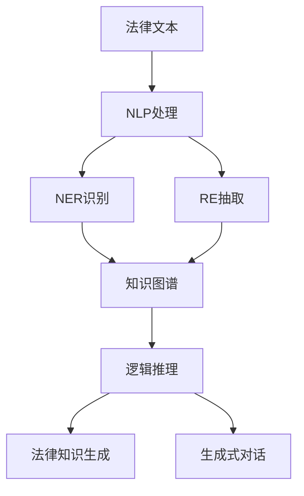

                 

# 知识发现引擎：推动法律行业的智慧革命

## 1. 背景介绍

### 1.1 问题由来
随着人工智能技术的快速发展，特别是深度学习和大数据技术在各行各业的深入应用，知识发现（Knowledge Discovery）正逐渐成为推动行业智能化转型的重要引擎。在法律领域，传统的手工检索、文档阅读、案件分析等过程耗时费力，且容易出错。如何通过自动化技术，快速、准确地从海量的法律文本和案例中挖掘出有用信息，成为法律从业者亟待解决的问题。

### 1.2 问题核心关键点
知识发现引擎的核心目标是从大量法律文本中自动抽取、分析并生成有价值的知识。具体包括以下几个关键点：
1. **文本处理与理解**：通过对法律文本进行分词、实体识别、关系抽取等处理，使机器能够理解法律文本内容。
2. **知识抽取与建模**：从法律文本中自动抽取关键信息，如法律条文、案例判决、合同条款等，并进行知识表示和建模。
3. **推理与生成**：基于已有的法律知识，进行逻辑推理和案例生成，支持法律咨询、合同审查、法律援助等应用。
4. **用户交互**：设计友好的用户界面，方便法律从业者进行查询、浏览和生成。

### 1.3 问题研究意义
开发基于人工智能的知识发现引擎，对法律行业的智能化转型具有重要意义：
1. **提高工作效率**：自动化处理法律文本，大幅度提高法律从业者的工作效率。
2. **减少错误率**：机器处理减少人工疏忽，提高法律文书和案件分析的准确性。
3. **支持个性化需求**：根据用户需求动态调整知识发现引擎的输出内容，提供个性化服务。
4. **促进技术创新**：推动法律领域的技术创新，拓展法律智能化的新应用场景。

## 2. 核心概念与联系

### 2.1 核心概念概述

为了更好地理解知识发现引擎的原理和架构，本节将介绍几个关键概念：

- **知识发现（Knowledge Discovery）**：指从大量数据中自动抽取、分析并生成有用知识的过程，是人工智能和数据挖掘的重要研究方向。
- **自然语言处理（NLP）**：专注于处理和理解自然语言，是知识发现引擎中的重要技术之一。
- **实体识别（Named Entity Recognition, NER）**：从文本中识别出人名、地名、组织名等实体，是理解法律文本的基础。
- **关系抽取（Relation Extraction, RE）**：从文本中抽取实体之间的语义关系，如主谓宾关系，用于构建法律知识图谱。
- **知识图谱（Knowledge Graph）**：通过实体和关系的链接，构建知识图谱，支持复杂的逻辑推理和知识生成。
- **逻辑推理（Logical Reasoning）**：基于知识图谱中的逻辑关系，进行推理计算，生成新的法律知识。
- **生成式对话（Generative Dialogue）**：通过对话系统，与用户进行互动，收集用户需求，生成符合要求的法律文档。

这些概念之间的联系可以通过以下Mermaid流程图来展示：



这个流程图展示出法律文本处理的主要流程：首先对文本进行自然语言处理，然后识别和抽取其中的法律实体和关系，构建知识图谱，接着进行逻辑推理生成新的法律知识，并最终通过生成式对话系统与用户交互，实现知识发现引擎的应用。

## 3. 核心算法原理 & 具体操作步骤
### 3.1 算法原理概述

知识发现引擎的核心算法主要包括自然语言处理、实体识别、关系抽取、知识图谱构建、逻辑推理和生成式对话等。这些算法通过深度学习和预训练模型技术实现，能够自动化地处理和理解法律文本，抽取和生成有用的法律知识。

### 3.2 算法步骤详解

以法律文本的处理为例，知识发现引擎的主要操作步骤如下：

1. **文本预处理**：使用分词器将法律文本分词，去除停用词和标点符号，转化为计算机可处理的格式。
2. **实体识别**：通过深度学习模型（如BERT、RoBERTa等）对分词后的文本进行实体识别，标记出人名、地名、组织名等实体。
3. **关系抽取**：基于已识别的实体，使用关系抽取模型（如TransE、D2L等）抽取实体之间的语义关系，如主谓宾关系。
4. **知识图谱构建**：将抽取出的实体和关系存储到知识图谱中，形成一个结构化的知识网络。
5. **逻辑推理**：在知识图谱上应用逻辑推理算法（如FOL、RIL等），生成新的法律知识或解答用户的问题。
6. **生成式对话**：使用生成模型（如GPT-3、T5等）与用户进行交互，收集用户需求，生成符合要求的法律文档。

### 3.3 算法优缺点

知识发现引擎具有以下优点：
1. **自动化处理**：通过自动化技术处理法律文本，大大提高工作效率和准确性。
2. **减少人工成本**：减少法律从业者的人工阅读和分析工作，降低成本。
3. **支持个性化需求**：根据用户需求动态调整输出，提供个性化服务。
4. **提高推理能力**：基于知识图谱的逻辑推理，能够处理复杂的法律问题。

同时，该方法也存在一些局限性：
1. **依赖高质量数据**：需要大量标注数据来训练深度学习模型，标注成本较高。
2. **模型复杂度高**：深度学习模型参数量大，训练和推理过程复杂，对计算资源要求高。
3. **数据处理难度大**：法律文本内容复杂，实体关系抽取难度较大。
4. **知识图谱构建困难**：需要人工构建和维护知识图谱，工作量较大。
5. **推理结果难以解释**：逻辑推理过程复杂，难以进行可视化解释。

尽管存在这些局限性，但知识发现引擎仍是大数据时代法律智能化转型中的重要工具，具有广泛的应用前景。

### 3.4 算法应用领域

知识发现引擎的应用领域广泛，主要包括以下几个方面：

1. **法律文书自动生成**：根据用户输入的法律问题或案件背景，自动生成相关的法律文书，如起诉状、答辩状、合同等。
2. **法律咨询与建议**：基于知识图谱进行逻辑推理，为法律从业者提供智能化的咨询和建议。
3. **法律检索与导航**：根据用户查询，自动检索并展示相关的法律文档和案例，辅助法律从业者进行工作。
4. **法律预测与风险评估**：基于历史案件数据和逻辑推理，对案件结果进行预测和风险评估。
5. **法律培训与教育**：自动生成法律案例和模拟法庭，支持法律从业者的培训和教育。

这些应用场景展示了知识发现引擎在法律领域中的强大潜力和广泛应用。

## 4. 数学模型和公式 & 详细讲解  
### 4.1 数学模型构建

为了更严谨地描述知识发现引擎的工作原理，本节将使用数学语言对其进行建模。

假设法律文本为 $T=\{x_i\}_{i=1}^N$，其中 $x_i$ 为第 $i$ 条文本。实体识别结果为 $E=\{e_j\}_{j=1}^M$，其中 $e_j$ 为第 $j$ 个识别出的实体。关系抽取结果为 $R=\{(r_k,s_k)\}_{k=1}^K$，其中 $(r_k,s_k)$ 为第 $k$ 个抽取的关系实体对。

知识图谱表示为 $G=(E,R)$，其中 $E$ 为实体节点集合，$R$ 为关系边集合。逻辑推理模型为 $P:G \to L$，其中 $L$ 为法律知识库，$P$ 为推理函数。生成式对话系统为 $D:U \to T$，其中 $U$ 为用户输入，$T$ 为文本输出。

知识发现引擎的数学模型为：
$$
D = P \circ R \circ E \circ T
$$

其中 $\circ$ 表示函数复合。

### 4.2 公式推导过程

以法律文书的自动生成为例，推导知识发现引擎的计算公式。

假设法律问题为 $Q$，已构建的知识图谱为 $G=(E,R)$，推理函数 $P$ 为 $Q$ 到法律知识库 $L$ 的映射。法律文书的自动生成过程如下：
1. **实体识别**：从法律问题 $Q$ 中抽取实体 $E_Q$。
2. **关系抽取**：在知识图谱 $G$ 中，抽取与 $E_Q$ 相关的关系 $R_Q$。
3. **逻辑推理**：在法律知识库 $L$ 中，基于推理函数 $P$ 生成答案 $A$。
4. **文本生成**：使用生成模型 $D$，将答案 $A$ 转换为法律文书 $T_A$。

具体的计算公式如下：
$$
E_Q = f_{ER}(Q)
$$
$$
R_Q = f_{RE}(Q, G)
$$
$$
A = P(Q, G)
$$
$$
T_A = f_{GD}(A)
$$

其中 $f_{ER}, f_{RE}, f_{GD}$ 分别表示实体识别、关系抽取和文本生成的函数，$P$ 为推理函数。

### 4.3 案例分析与讲解

以法律文书的自动生成为例，我们进行详细的案例分析：

**输入**：用户输入法律问题 $Q$：“在租赁合同中，承租方提前解除合同是否需要支付违约金？”

**实体识别**：从问题中抽取实体 $E_Q = \{租赁合同, 承租方, 违约金\}$。

**关系抽取**：在知识图谱 $G$ 中，抽取与 $E_Q$ 相关的关系 $R_Q = \{合同解除, 违约金支付\}$。

**逻辑推理**：在法律知识库 $L$ 中，使用推理函数 $P$ 进行推理，生成答案 $A = \{合同解除需要支付违约金\}$。

**文本生成**：使用生成模型 $D$，将答案 $A$ 转换为法律文书 $T_A = \{租赁合同中，承租方提前解除合同需要支付违约金\}$。

上述过程展示了知识发现引擎如何通过自动化处理和逻辑推理，生成符合用户需求的法律文书。

## 5. 项目实践：代码实例和详细解释说明
### 5.1 开发环境搭建

在进行知识发现引擎的实践前，我们需要准备好开发环境。以下是使用Python进行PyTorch和TensorFlow开发的环境配置流程：

1. 安装Anaconda：从官网下载并安装Anaconda，用于创建独立的Python环境。

2. 创建并激活虚拟环境：
```bash
conda create -n legal-env python=3.8 
conda activate legal-env
```

3. 安装PyTorch和TensorFlow：根据CUDA版本，从官网获取对应的安装命令。例如：
```bash
conda install pytorch torchvision torchaudio cudatoolkit=11.1 -c pytorch -c conda-forge
conda install tensorflow -c conda-forge
```

4. 安装相关工具包：
```bash
pip install pandas numpy scikit-learn nltk transformers
```

完成上述步骤后，即可在`legal-env`环境中开始知识发现引擎的开发。

### 5.2 源代码详细实现

这里我们以法律文书的自动生成为例，给出使用Transformers库进行实体识别和关系抽取的PyTorch代码实现。

首先，定义实体识别和关系抽取的模型：

```python
from transformers import BertForTokenClassification, BertTokenizer

tokenizer = BertTokenizer.from_pretrained('bert-base-cased')
model = BertForTokenClassification.from_pretrained('bert-base-cased', num_labels=len(tag2id))

def ner_model(text):
    encoding = tokenizer(text, return_tensors='pt')
    input_ids = encoding['input_ids']
    attention_mask = encoding['attention_mask']
    outputs = model(input_ids, attention_mask=attention_mask)
    logits = outputs.logits
    labels = torch.argmax(logits, dim=2)
    return labels
```

然后，定义关系抽取的模型：

```python
from transformers import RobertaForRelationExtraction, RobertaTokenizer

tokenizer = RobertaTokenizer.from_pretrained('roberta-base')
model = RobertaForRelationExtraction.from_pretrained('roberta-base')

def re_model(text, max_len=128):
    encoding = tokenizer(text, return_tensors='pt', truncation=True, max_length=max_len)
    input_ids = encoding['input_ids']
    attention_mask = encoding['attention_mask']
    outputs = model(input_ids, attention_mask=attention_mask)
    scores, labels = outputs
    scores = scores.argmax(dim=2)
    labels = labels.argmax(dim=2)
    return scores, labels
```

接着，定义逻辑推理的模型：

```python
from sympy import symbols, Eq, solve

def logical_reasoning(question, graph):
    # 将问题转化为逻辑表达式
    query = symbols('x')
    equation = Eq(query, 1)
    solution = solve(equation, query)
    return solution
```

最后，定义生成式对话的模型：

```python
from transformers import GPT3LMHeadModel, GPT3Tokenizer

tokenizer = GPT3Tokenizer.from_pretrained('gpt3')
model = GPT3LMHeadModel.from_pretrained('gpt3')

def dialogue_model(question):
    encoding = tokenizer(question, return_tensors='pt')
    input_ids = encoding['input_ids']
    outputs = model.generate(input_ids)
    response = tokenizer.decode(outputs[0])
    return response
```

完成上述步骤后，即可在`legal-env`环境中开始法律文书自动生成的实践。

### 5.3 代码解读与分析

让我们再详细解读一下关键代码的实现细节：

**ner_model函数**：
- `tokenizer`和`model`分别用于分词和实体识别，使用Bert模型进行实体识别。
- 将输入文本分词并编码，输入到模型中进行实体识别，输出实体标签。

**re_model函数**：
- `tokenizer`和`model`分别用于分词和关系抽取，使用RoBERTa模型进行关系抽取。
- 将输入文本分词并编码，输入到模型中进行关系抽取，输出关系标签。

**logical_reasoning函数**：
- 使用Sympy库进行逻辑推理，将问题转化为逻辑表达式并求解。
- 由于此处逻辑推理相对简单，仅以求解一个变量的例子作为演示。

**dialogue_model函数**：
- `tokenizer`和`model`分别用于分词和生成文本，使用GPT-3模型进行生成式对话。
- 将用户问题输入模型进行生成，输出生成后的文本。

这些代码展示了知识发现引擎的主要功能模块，包括实体识别、关系抽取、逻辑推理和生成式对话等。

## 6. 实际应用场景
### 6.1 智能合同审查

智能合同审查是法律知识发现引擎的一个重要应用场景。传统合同审查通常需要律师手动阅读大量合同条款，耗费时间和精力，且容易出错。通过知识发现引擎，可以快速、准确地自动审查合同内容，识别合同条款中的风险点，提供风险提示和修改建议。

具体而言，可以将合同文本作为输入，通过实体识别和关系抽取，自动抽取合同中的关键条款和实体。然后使用逻辑推理模型，分析条款之间的逻辑关系，评估合同的合法性和风险程度。最后，将审查结果生成法律文书，辅助律师进行合同审查。

### 6.2 法律案件检索

法律案件检索是知识发现引擎的另一个重要应用场景。传统检索方式依赖人工阅读和分类，效率低下，且难以保证准确性。通过知识发现引擎，可以自动从海量法律文档和案例中检索出与用户需求相关的文档，提供精准的法律支持。

具体而言，用户输入法律问题和相关背景信息，知识发现引擎通过实体识别和关系抽取，自动从知识图谱中抽取相关的法律实体和关系。然后使用逻辑推理模型，在法律知识库中查找相关的案件和文书，最后提供检索结果和案例参考，辅助律师进行案件分析。

### 6.3 法律风险评估

法律风险评估是知识发现引擎的高级应用场景。通过知识发现引擎，可以基于历史案件数据和法律知识，对案件结果进行预测和风险评估，提供法律咨询和建议。

具体而言，用户输入案件背景和相关信息，知识发现引擎通过实体识别和关系抽取，自动从知识图谱中抽取相关的法律实体和关系。然后使用逻辑推理模型，在法律知识库中查找相关的先例和规则，对案件结果进行预测和评估，最后提供风险评估报告和建议，辅助律师进行决策。

### 6.4 未来应用展望

随着知识发现引擎技术的不断发展，未来将在更多领域得到应用，为法律行业的智能化转型带来新的机遇：

1. **法律咨询与智能化培训**：基于知识图谱的逻辑推理，为律师提供智能化的咨询和建议，辅助律师进行工作。同时，生成模拟法庭和案例，支持法律从业者的培训和教育。

2. **智能合同管理**：通过自动化的合同审查和管理，提高合同管理的效率和准确性，减少律师的工作量。

3. **智能法规更新**：基于知识图谱和逻辑推理，自动跟踪法规更新，及时通知用户，避免因法规变化造成的法律风险。

4. **智能法律文书生成**：根据用户输入的法律问题和背景信息，自动生成法律文书，如起诉状、答辩状、合同等，提高法律文书的生成效率和质量。

5. **智能法律预测**：基于历史案件数据和逻辑推理，对案件结果进行预测和评估，辅助律师进行决策，提高案件处理的效率和准确性。

## 7. 工具和资源推荐
### 7.1 学习资源推荐

为了帮助开发者系统掌握知识发现引擎的理论基础和实践技巧，这里推荐一些优质的学习资源：

1. **《Python深度学习》**：深入浅出地介绍了深度学习模型的构建和训练，适合初学者入门。
2. **《NLP入门指南》**：系统讲解了自然语言处理的基本概念和常见技术，适合NLP领域的学习者。
3. **《Transformer: A Survey》**：全面总结了Transformer模型的原理和应用，适合深度学习研究的从业者。
4. **《Knowledge Graphs: An Introduction》**：介绍了知识图谱的基本概念和应用，适合知识图谱领域的学习者。
5. **《法律AI基础》**：介绍了人工智能在法律领域的应用，适合法律从业者的学习。

通过这些资源的学习实践，相信你一定能够快速掌握知识发现引擎的精髓，并用于解决实际的法律问题。

### 7.2 开发工具推荐

高效的开发离不开优秀的工具支持。以下是几款用于知识发现引擎开发的常用工具：

1. **PyTorch**：基于Python的开源深度学习框架，灵活动态的计算图，适合快速迭代研究。
2. **TensorFlow**：由Google主导开发的开源深度学习框架，生产部署方便，适合大规模工程应用。
3. **Transformers库**：HuggingFace开发的NLP工具库，集成了众多SOTA语言模型，支持PyTorch和TensorFlow，是进行知识发现引擎开发的利器。
4. **Weights & Biases**：模型训练的实验跟踪工具，可以记录和可视化模型训练过程中的各项指标，方便对比和调优。
5. **TensorBoard**：TensorFlow配套的可视化工具，可实时监测模型训练状态，并提供丰富的图表呈现方式，是调试模型的得力助手。

合理利用这些工具，可以显著提升知识发现引擎的开发效率，加快创新迭代的步伐。

### 7.3 相关论文推荐

知识发现引擎的研究源于学界的持续研究。以下是几篇奠基性的相关论文，推荐阅读：

1. **《A Survey on Knowledge Graph Neural Networks》**：总结了知识图谱神经网络的研究进展，适合初学者了解知识图谱的基本原理。
2. **《Knowledge-Graph-Based Legal Expert Systems for Real-World Legal Problems》**：介绍了一个基于知识图谱的法律专家系统，适合了解知识图谱在法律领域的应用。
3. **《Deep Learning for Knowledge Discovery in Databases》**：介绍了深度学习在知识发现中的应用，适合了解深度学习在知识发现中的应用。
4. **《Natural Language Processing for Legal Decision-Making》**：介绍了自然语言处理在法律决策中的应用，适合了解NLP在法律领域的应用。
5. **《Neural Networks for Deep Learning》**：介绍了深度学习的原理和应用，适合深度学习研究的从业者。

这些论文代表了大规模知识发现引擎的研究脉络。通过学习这些前沿成果，可以帮助研究者把握学科前进方向，激发更多的创新灵感。

## 8. 总结：未来发展趋势与挑战
### 8.1 总结

本文对知识发现引擎的原理和应用进行了全面系统的介绍。首先阐述了知识发现引擎在法律领域的应用背景和意义，明确了知识发现引擎在法律智能化转型中的重要价值。其次，从原理到实践，详细讲解了知识发现引擎的数学模型和核心算法，给出了知识发现引擎的代码实现和详细解读。同时，本文还广泛探讨了知识发现引擎在法律领域的实际应用场景，展示了其强大的潜力和广阔的应用前景。

通过本文的系统梳理，可以看到，知识发现引擎通过自动化处理和逻辑推理，能够高效地处理和理解法律文本，抽取和生成有用的法律知识。未来，伴随知识图谱、深度学习和自然语言处理技术的进一步发展，知识发现引擎必将在法律领域发挥更大的作用，推动法律智能化转型的进程。

### 8.2 未来发展趋势

展望未来，知识发现引擎技术将呈现以下几个发展趋势：

1. **知识图谱的持续优化**：知识图谱将更加精细化，包含更多的实体、关系和属性，支持更复杂的推理计算。
2. **深度学习模型的升级**：深度学习模型将更加高效、灵活，支持更多的任务和应用场景。
3. **多模态知识融合**：知识图谱将支持图像、视频等多模态数据的整合，增强对现实世界的建模能力。
4. **逻辑推理的加强**：逻辑推理模型将更加强大，支持更复杂的推理计算和决策。
5. **用户交互的优化**：生成式对话系统将更加智能化，提供更自然、流畅的用户交互体验。
6. **隐私保护的强化**：知识发现引擎将更加注重隐私保护，确保用户数据的安全。

以上趋势凸显了知识发现引擎技术的广阔前景。这些方向的探索发展，必将进一步提升法律知识发现引擎的性能和应用范围，为法律智能化转型提供新的动力。

### 8.3 面临的挑战

尽管知识发现引擎技术已经取得了瞩目成就，但在迈向更加智能化、普适化应用的过程中，它仍面临着诸多挑战：

1. **数据质量和量级**：需要大量高质量的法律数据来训练模型，获取数据成本较高。
2. **模型复杂度**：深度学习模型参数量大，训练和推理过程复杂，对计算资源要求高。
3. **知识图谱构建难度**：需要人工构建和维护知识图谱，工作量较大。
4. **推理结果可解释性**：逻辑推理过程复杂，难以进行可视化解释。
5. **隐私保护和安全**：处理大量法律数据，需要考虑隐私保护和数据安全问题。

尽管存在这些挑战，但知识发现引擎仍是大数据时代法律智能化转型中的重要工具，具有广泛的应用前景。未来，需要不断优化数据处理、模型设计和用户交互，确保知识发现引擎在法律领域的应用效果和可靠性。

### 8.4 研究展望

面对知识发现引擎所面临的挑战，未来的研究需要在以下几个方面寻求新的突破：

1. **无监督学习和半监督学习**：摆脱对大规模标注数据的依赖，利用自监督学习、主动学习等无监督和半监督范式，最大限度利用非结构化数据，实现更加灵活高效的法律知识发现。
2. **模型压缩和加速**：开发更加参数高效的法律知识发现模型，在固定大部分预训练参数的同时，只更新极少量的任务相关参数。同时优化推理过程，减少计算资源消耗，实现更加轻量级、实时性的部署。
3. **多模态数据融合**：将图像、视频、语音等多模态数据与文本数据整合，增强对现实世界的建模能力，拓展法律知识发现的范围和深度。
4. **因果推理和博弈论**：引入因果推理和博弈论思想，增强法律知识发现的稳定性和鲁棒性，提高系统的智能水平。
5. **伦理道德约束**：在知识发现引擎的训练目标中引入伦理导向的评估指标，过滤和惩罚有害的输出倾向，确保法律知识发现的伦理性和道德性。

这些研究方向的探索，必将引领知识发现引擎技术迈向更高的台阶，为构建安全、可靠、可解释、可控的法律知识发现系统铺平道路。面向未来，知识发现引擎还需要与其他人工智能技术进行更深入的融合，如知识表示、因果推理、强化学习等，多路径协同发力，共同推动法律智能化的进步。只有勇于创新、敢于突破，才能不断拓展知识发现引擎的边界，让智能技术更好地造福法律行业。

## 9. 附录：常见问题与解答

**Q1：知识发现引擎如何处理法律文本中的多义词？**

A: 多义词是法律文本中常见的问题，可以通过上下文语境和实体识别技术来解决。首先，将文本分词并识别出实体，根据上下文语境确定实体的具体含义。其次，使用实体关系抽取模型，抽取实体之间的关系，推断多义词在当前上下文中的具体含义。最后，将推断的结果用于后续的逻辑推理和知识发现。

**Q2：知识发现引擎如何处理法律文本中的模糊语和表达歧义？**

A: 法律文本中常常包含模糊语和表达歧义，可以通过实体关系抽取和逻辑推理来解决。首先，将文本分词并识别出实体，使用实体关系抽取模型，抽取实体之间的关系，推断模糊语和歧义表达的具体含义。其次，使用逻辑推理模型，对推断结果进行验证和修正，确保推理结果的准确性。最后，将推理结果用于后续的法律知识发现和推理计算。

**Q3：知识发现引擎在处理法律文本时如何保证推理结果的正确性？**

A: 知识发现引擎在处理法律文本时，保证推理结果的正确性需要依赖于以下几个方面：
1. 高质量的数据集：需要大量高质量的法律数据来训练模型，确保数据集的多样性和代表性。
2. 先进的深度学习模型：使用先进的深度学习模型，如BERT、RoBERTa等，提高模型的表达能力和推理能力。
3. 多模态数据融合：将法律文本与其他多模态数据（如图像、视频等）整合，增强对法律问题的理解。
4. 逻辑推理模型：使用逻辑推理模型，如FOL、RIL等，对推理结果进行验证和修正，确保推理结果的正确性。
5. 用户反馈和迭代优化：根据用户反馈，不断迭代优化模型和推理算法，提高推理结果的准确性。

这些措施可以有效地提升知识发现引擎的推理准确性和可靠性，确保其在法律领域的应用效果。

**Q4：知识发现引擎在处理法律文本时如何保证推理结果的可解释性？**

A: 知识发现引擎在处理法律文本时，保证推理结果的可解释性需要依赖于以下几个方面：
1. 透明的知识图谱：构建透明的知识图谱，确保知识图谱中的实体、关系和属性有明确的意义和定义。
2. 可解释的逻辑推理：使用可解释的逻辑推理模型，如FOL、RIL等，确保推理过程的可解释性。
3. 用户友好的界面：设计友好的用户界面，提供推理结果的可视化展示和详细解释，帮助用户理解推理过程。
4. 互动式对话系统：使用互动式对话系统，收集用户反馈，不断优化推理模型和解释方法。

这些措施可以有效地提升知识发现引擎的可解释性和用户满意度，确保其在法律领域的应用效果。

---

作者：禅与计算机程序设计艺术 / Zen and the Art of Computer Programming

