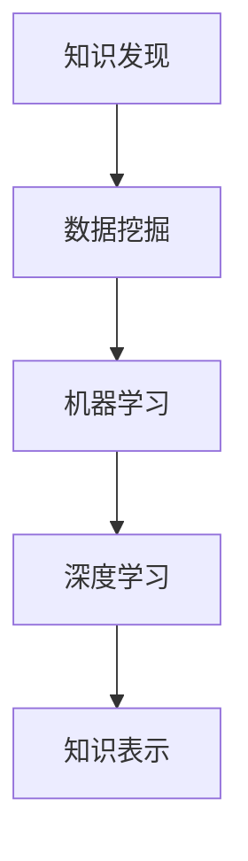

                 

# 知识发现引擎：推动科学研究突破边界

## 1. 背景介绍

### 1.1 问题由来
在科学研究领域，传统的数据分析方法已经难以应对日益增长的数据量和复杂度。科研人员往往需要通过大量重复性实验来验证假设，这不仅耗时耗力，且容易陷入局部最优，难以发现真正重要的关联。随着大数据、云计算、人工智能等技术的发展，知识发现引擎成为推动科学研究突破边界的新工具。

### 1.2 问题核心关键点
知识发现引擎，也称为数据挖掘引擎，是一个能自动分析数据，识别模式、关联和趋势的软件工具。其核心思想是通过算法和模型从大数据中提取知识，辅助科研人员提出新的研究假设和方向，加速科学研究进程。

#### 1.2.1 数据类型
知识发现引擎通常处理以下几种数据类型：

- **结构化数据**：如表格数据、关系数据库、CSV文件等，结构清晰，易于存储和查询。
- **半结构化数据**：如XML、JSON、配置文件等，包含一些结构化信息，但格式多样，难以直接处理。
- **非结构化数据**：如文本、图像、音频、视频等，没有固定的格式，需要借助AI技术进行处理。

#### 1.2.2 关键技术
知识发现引擎通常采用以下关键技术：

- **机器学习算法**：如分类、回归、聚类、关联规则挖掘等，用于发现数据中的模式和规律。
- **深度学习模型**：如卷积神经网络(CNN)、循环神经网络(RNN)、生成对抗网络(GAN)等，用于处理复杂的数据结构和特征提取。
- **数据可视化**：通过图表、图形等形式，直观展示数据中的关键信息，辅助科研人员理解结果。

#### 1.2.3 应用领域
知识发现引擎在科学研究中的应用领域广泛，包括生物信息学、药学、环境科学、经济学、医学等。通过从海量数据中提取知识，可以加速发现新的生物标志物、预测药物效果、分析环境变化、挖掘经济规律等，对科学研究具有重要意义。

## 2. 核心概念与联系

### 2.1 核心概念概述

为更好地理解知识发现引擎的工作原理和优化方向，本节将介绍几个密切相关的核心概念：

- **知识发现(Knowledge Discovery)**：从数据中提取有价值的信息和知识，辅助决策和研究。
- **数据挖掘(Data Mining)**：一种自动、智能化的数据处理方法，目的是发现数据中的规律和模式。
- **机器学习(Machine Learning)**：通过算法和模型自动从数据中学习规律，进而进行预测或分类。
- **深度学习(Deep Learning)**：一种特殊的机器学习方法，通过多层神经网络模型提取数据的高阶特征。
- **知识表示(Knowledge Representation)**：将知识转化为计算机可处理的形式，如本体、图谱等，便于知识发现和推理。

这些概念之间的逻辑关系可以通过以下Mermaid流程图来展示：



这个流程图展示了几者之间的核心联系：

1. 知识发现基于数据挖掘，数据挖掘使用机器学习和深度学习算法。
2. 深度学习作为机器学习的高级形式，能够处理复杂的数据结构。
3. 知识表示用于组织和管理提取的知识，便于后续的推理和使用。

这些概念共同构成了知识发现引擎的核心工作原理，使其能够高效、智能地从数据中提取知识和规律，辅助科学研究。

## 3. 核心算法原理 & 具体操作步骤

### 3.1 算法原理概述

知识发现引擎的核心算法原理，是通过机器学习或深度学习模型，从数据中自动提取特征和规律。其核心思想是将数据转化为模型输入，通过前向传播计算模型输出，再利用损失函数和优化算法，反向传播更新模型参数，最小化模型输出与真实标签之间的差异。

以分类任务为例，知识发现引擎的工作流程如下：

1. **数据准备**：收集数据，进行清洗和预处理。
2. **特征工程**：选择和提取数据特征，提高模型预测准确性。
3. **模型训练**：选择适当的模型，进行训练和优化，得到最终模型参数。
4. **模型评估**：在测试集上评估模型性能，选择合适的参数和模型结构。
5. **知识发现**：利用训练好的模型，从新数据中提取知识，辅助决策和研究。

### 3.2 算法步骤详解

以下，我们将详细介绍知识发现引擎的各个步骤：

#### 3.2.1 数据准备
数据准备是知识发现引擎的第一步，通常包括以下几个环节：

1. **数据收集**：从不同的数据源中收集数据，包括结构化、半结构化和非结构化数据。
2. **数据清洗**：去除重复、缺失和异常数据，确保数据的质量和完整性。
3. **数据预处理**：包括数据归一化、标准化、离散化等，便于后续处理。
4. **数据转换**：将数据转化为模型所需的格式，如转化为数值特征、创建特征交叉项等。

#### 3.2.2 特征工程
特征工程是知识发现引擎的重要环节，目的是提取和选择有意义的特征，提高模型的预测准确性。

1. **特征选择**：选择对目标变量有显著影响的特征，去除噪声和冗余特征。
2. **特征提取**：将原始数据转化为有意义的特征，如通过PCA、LDA等降维算法，减少数据维度。
3. **特征变换**：对特征进行转换，如对数值特征进行归一化处理，对文本特征进行TF-IDF转换等。
4. **特征组合**：通过特征组合或交叉，生成新的特征，提高模型表达能力。

#### 3.2.3 模型训练
模型训练是知识发现引擎的核心步骤，通过选择合适的模型和算法，自动从数据中提取规律和特征。

1. **模型选择**：根据任务类型和数据特征，选择合适的模型，如线性回归、决策树、随机森林、神经网络等。
2. **模型训练**：使用训练集数据，最小化损失函数，通过优化算法更新模型参数，如梯度下降、Adam等。
3. **模型评估**：在测试集上评估模型性能，选择合适的参数和模型结构，如交叉验证、网格搜索等。
4. **模型优化**：通过正则化、dropout等技术，防止模型过拟合，提高泛化能力。

#### 3.2.4 知识发现
知识发现是知识发现引擎的最终目标，通过利用训练好的模型，从新数据中提取知识，辅助科研人员进行决策和研究。

1. **特征预测**：使用训练好的模型，对新数据进行预测，生成特征。
2. **模式识别**：通过特征预测结果，识别数据中的模式和规律，如异常检测、聚类分析等。
3. **关联发现**：通过特征预测结果，发现数据中的关联和趋势，如关联规则挖掘、时间序列预测等。
4. **知识可视化**：将提取的知识转化为图表、图形等形式，直观展示数据中的关键信息，辅助科研人员理解结果。

### 3.3 算法优缺点

知识发现引擎具有以下优点：

1. **自动化**：自动从数据中提取知识和规律，减少人工干预，提高效率。
2. **智能化**：使用机器学习和深度学习算法，能够处理复杂数据，发现深层规律。
3. **可扩展性**：适用于各种数据类型和规模，灵活处理不同类型的数据。
4. **辅助决策**：辅助科研人员进行决策，发现潜在的关联和规律，提升研究效率。

同时，知识发现引擎也存在一些缺点：

1. **依赖数据质量**：依赖高质量、完整的数据，数据质量问题可能影响结果。
2. **模型选择困难**：不同模型适用于不同类型的数据和任务，选择合适的模型需要经验和判断。
3. **复杂度高**：处理复杂数据和特征工程时，算法复杂度高，计算成本高。
4. **解释性差**：黑盒模型难以解释内部工作机制，难以进行调试和优化。

尽管存在这些局限性，但知识发现引擎在大数据时代具有重要意义，能够显著提升科研效率和效果。未来，如何提高模型可解释性和泛化能力，将是知识发现引擎研究的重要方向。

### 3.4 算法应用领域

知识发现引擎在科学研究中的应用领域广泛，以下列举几个典型应用：

#### 3.4.1 生物信息学
生物信息学领域，知识发现引擎用于分析基因序列、蛋白质结构、药物代谢等数据，辅助发现新的生物标志物和药物靶点。通过分析基因表达数据，可以发现与疾病相关的基因和生物通路，加速新药研发进程。

#### 3.4.2 药学
药学领域，知识发现引擎用于分析药物化合物结构、代谢途径、疗效数据等，辅助发现新药物和优化现有药物。通过分析化合物结构和反应路径，可以预测药物效果和副作用，优化药物设计。

#### 3.4.3 环境科学
环境科学领域，知识发现引擎用于分析气象数据、污染数据、生态数据等，辅助发现环境变化趋势和潜在风险。通过分析污染数据，可以发现污染源和传播途径，制定污染防治策略。

#### 3.4.4 经济学
经济学领域，知识发现引擎用于分析经济数据、市场数据、政策数据等，辅助发现经济规律和预测市场变化。通过分析经济数据，可以发现经济周期和趋势，制定宏观经济政策。

#### 3.4.5 医学
医学领域，知识发现引擎用于分析病历数据、基因数据、影像数据等，辅助发现疾病特征和治疗方法。通过分析病历数据，可以发现疾病关联和病理机制，优化诊疗方案。

## 4. 数学模型和公式 & 详细讲解  
### 4.1 数学模型构建

知识发现引擎的数学模型通常基于以下基本假设：

1. 数据服从一定的概率分布，可以通过统计方法描述。
2. 数据中包含隐含的规律和特征，可以通过模型学习发现。
3. 模型的输出可以用于预测或分类，如二分类、多分类、回归等。

以线性回归模型为例，知识发现引擎的数学模型构建如下：

1. **输入**：输入数据 $x$，包含多个特征。
2. **输出**：模型输出 $y$，表示目标变量的预测值。
3. **参数**：模型参数 $\theta$，包括权重和偏置。
4. **损失函数**：目标变量和预测值之间的差异，如均方误差、交叉熵等。
5. **优化算法**：通过优化算法更新模型参数，如梯度下降、Adam等。

形式化地，线性回归模型的数学表达式如下：

$$
y = \theta^T x + b
$$

其中，$\theta$ 为模型参数，$x$ 为输入数据，$b$ 为偏置，$y$ 为目标变量的预测值。

### 4.2 公式推导过程

以线性回归模型为例，其公式推导过程如下：

1. **假设模型**：假设数据 $(x_i,y_i)$ 服从线性关系，即 $y = \theta^T x + b$。
2. **损失函数**：使用均方误差损失函数，即 $L(\theta) = \frac{1}{2N}\sum_{i=1}^N(y_i - \theta^T x_i - b)^2$。
3. **梯度计算**：计算损失函数对模型参数的梯度，即 $\frac{\partial L}{\partial \theta} = -\frac{1}{N}(X^TX)^{-1}X^Ty$。
4. **优化算法**：使用梯度下降算法，更新模型参数，即 $\theta \leftarrow \theta - \eta \frac{\partial L}{\partial \theta}$，其中 $\eta$ 为学习率。

通过以上公式推导，可以理解线性回归模型的基本工作原理和优化方法。

### 4.3 案例分析与讲解

以基因表达数据分析为例，知识发现引擎用于发现基因与疾病之间的关联。

1. **数据准备**：收集基因表达数据，包括基因序列、基因表达量、临床信息等。
2. **特征工程**：选择和提取有意义的特征，如基因表达量、基因序列特征、临床指标等。
3. **模型训练**：使用线性回归模型，训练模型参数，最小化基因表达量与疾病之间的关系。
4. **模型评估**：在测试集上评估模型性能，选择合适的参数和模型结构。
5. **知识发现**：利用训练好的模型，发现与疾病相关的基因和表达模式，辅助疾病诊断和治疗。

## 5. 项目实践：代码实例和详细解释说明

### 5.1 开发环境搭建

在进行知识发现引擎的实践开发前，需要准备好开发环境。以下是使用Python进行Scikit-learn开发的环境配置流程：

1. 安装Anaconda：从官网下载并安装Anaconda，用于创建独立的Python环境。

2. 创建并激活虚拟环境：
```bash
conda create -n sklearn-env python=3.8 
conda activate sklearn-env
```

3. 安装Scikit-learn：
```bash
conda install scikit-learn
```

4. 安装各类工具包：
```bash
pip install numpy pandas matplotlib seaborn jupyter notebook ipython
```

完成上述步骤后，即可在`sklearn-env`环境中开始项目实践。

### 5.2 源代码详细实现

以下，我们将以线性回归模型为例，给出Scikit-learn库的代码实现。

```python
import numpy as np
from sklearn.linear_model import LinearRegression

# 生成模拟数据
x = np.random.randn(100, 3)
y = np.dot(x, [1, 2, 3]) + np.random.randn(100)

# 训练模型
model = LinearRegression()
model.fit(x, y)

# 预测和评估
y_pred = model.predict(x)
mse = np.mean((y_pred - y) ** 2)
print(f"Mean Squared Error: {mse:.3f}")
```

以上代码实现了线性回归模型的训练、预测和评估过程。Scikit-learn库提供了多种机器学习模型和工具，便于知识发现引擎的开发和应用。

### 5.3 代码解读与分析

让我们再详细解读一下关键代码的实现细节：

**数据生成**：
- 使用numpy生成100个样本数据，包含3个特征和一个目标变量。

**模型训练**：
- 使用scikit-learn的LinearRegression模型，训练模型参数。

**预测和评估**：
- 使用训练好的模型对新数据进行预测，并计算预测误差。

## 6. 实际应用场景

### 6.1 智能推荐系统

智能推荐系统是知识发现引擎的重要应用场景之一，通过分析用户行为数据，发现用户兴趣和偏好，推荐个性化内容。

在技术实现上，知识发现引擎可以用于分析用户点击、浏览、评分等行为数据，提取用户特征和行为模式。利用这些特征，构建用户-物品关联矩阵，使用协同过滤、矩阵分解等算法，推荐用户可能感兴趣的内容。

### 6.2 金融风险预测

金融领域，知识发现引擎用于分析交易数据、市场数据、公司财务数据等，预测金融市场趋势和风险。

在技术实现上，知识发现引擎可以用于分析股票价格、交易量、公司财务报表等数据，发现市场规律和趋势。利用这些规律，构建金融风险预测模型，预测股票涨跌、信用风险等，辅助投资决策。

### 6.3 市场营销

市场营销领域，知识发现引擎用于分析用户反馈、市场调研数据、社交媒体数据等，发现用户偏好和市场趋势。

在技术实现上，知识发现引擎可以用于分析用户评论、社交媒体帖子、市场调研问卷等数据，提取用户偏好和市场趋势。利用这些信息，制定市场推广策略，提升品牌影响力和销售额。

## 7. 工具和资源推荐

### 7.1 学习资源推荐

为了帮助开发者系统掌握知识发现引擎的理论基础和实践技巧，这里推荐一些优质的学习资源：

1. 《机器学习实战》书籍：由Parker书。详细介绍了机器学习的基本概念和实现方法，包括线性回归、分类、聚类等。

2. 《Python数据科学手册》书籍：由Jake书籍。全面介绍了Python在数据科学中的应用，包括数据预处理、特征工程、模型选择等。

3. Coursera《机器学习》课程：由Andrew Ng教授开设的著名机器学习课程，涵盖了机器学习的各种算法和实践技巧。

4. Kaggle数据科学竞赛平台：提供大量公开数据集和机器学习竞赛，帮助开发者实践和提升数据挖掘能力。

5. Google Colab在线Jupyter Notebook环境：谷歌推出的免费在线开发环境，提供GPU/TPU算力，便于开发者快速实验新模型。

通过对这些资源的学习实践，相信你一定能够快速掌握知识发现引擎的精髓，并用于解决实际的数据挖掘问题。

### 7.2 开发工具推荐

高效的开发离不开优秀的工具支持。以下是几款用于知识发现引擎开发的常用工具：

1. Scikit-learn：Python的机器学习库，提供各种算法和工具，包括线性回归、决策树、随机森林等。

2. TensorFlow：Google开发的深度学习框架，支持分布式计算和多种模型结构。

3. PyTorch：Facebook开发的深度学习框架，灵活、高效，支持动态计算图。

4. Weights & Biases：模型训练的实验跟踪工具，记录和可视化模型训练过程中的各项指标。

5. TensorBoard：TensorFlow配套的可视化工具，实时监测模型训练状态，并提供丰富的图表呈现方式。

6. Tableau：数据可视化工具，提供直观的图表和图形展示，便于数据分析和决策。

合理利用这些工具，可以显著提升知识发现引擎的开发效率，加快创新迭代的步伐。

### 7.3 相关论文推荐

知识发现引擎和数据挖掘技术的发展源于学界的持续研究。以下是几篇奠基性的相关论文，推荐阅读：

1. "A Survey of Data Mining and Statistical Learning Techniques and Algorithms"：总结了数据挖掘和统计学习的主要算法和技术。

2. "On the Shoulders of Giants: The History of Machine Learning"：介绍了机器学习的发展历程和主要算法。

3. "Deep Learning"：深度学习领域的经典教材，涵盖了深度学习的基本概念和实现方法。

4. "Knowledge Discovery in Databases: An Introduction"：介绍了知识发现的定义、方法和应用。

5. "Data Mining and Statistical Learning: Concepts and Techniques"：总结了数据挖掘和统计学习的主要概念和算法。

这些论文代表了大数据和人工智能技术的发展脉络。通过学习这些前沿成果，可以帮助研究者把握学科前进方向，激发更多的创新灵感。

## 8. 总结：未来发展趋势与挑战

### 8.1 总结

本文对知识发现引擎的工作原理和实践技巧进行了全面系统的介绍。首先，阐述了知识发现引擎在科学研究中的重要性和应用领域。其次，从原理到实践，详细讲解了知识发现引擎的核心算法和操作步骤，给出了知识发现引擎开发的完整代码实例。同时，本文还探讨了知识发现引擎在大数据时代的广泛应用，展示了其在多个领域的重要价值。最后，本文精选了知识发现引擎的学习资源和开发工具，力求为读者提供全方位的技术指引。

通过本文的系统梳理，可以看到，知识发现引擎在大数据时代具有重要意义，能够显著提升科研效率和效果。未来，伴随深度学习、数据挖掘技术的不断演进，知识发现引擎必将更加智能化、高效化，为科学研究带来新的突破。

### 8.2 未来发展趋势

展望未来，知识发现引擎将呈现以下几个发展趋势：

1. 自动化程度提升：随着自动机器学习、自适应学习等技术的发展，知识发现引擎将实现更加智能化、自动化的数据挖掘和分析。

2. 模型结构优化：通过模型融合、参数共享等技术，优化知识发现引擎的模型结构，提高模型性能和泛化能力。

3. 多模态数据挖掘：知识发现引擎将扩展到多模态数据处理，如文本、图像、音频等，实现更加全面、深入的数据分析。

4. 知识图谱构建：通过构建知识图谱，将知识进行结构化表示，便于后续的推理和使用。

5. 实时数据处理：随着实时数据流技术的成熟，知识发现引擎将具备实时数据处理能力，实现数据的动态分析。

以上趋势凸显了知识发现引擎的未来发展方向，这些方向的探索发展，将进一步提升数据挖掘的效率和效果，为科学研究带来新的突破。

### 8.3 面临的挑战

尽管知识发现引擎已经取得了显著进展，但在迈向更加智能化、普适化应用的过程中，它仍面临着诸多挑战：

1. 数据质量问题：依赖高质量、完整的数据，数据质量问题可能影响结果。

2. 模型选择困难：不同模型适用于不同类型的数据和任务，选择合适的模型需要经验和判断。

3. 计算资源限制：处理复杂数据和特征工程时，算法复杂度高，计算成本高。

4. 模型可解释性：黑盒模型难以解释内部工作机制，难以进行调试和优化。

5. 知识融合难度：将知识进行结构化表示，并与其他知识库结合，实现知识整合难度较大。

正视知识发现引擎面临的这些挑战，积极应对并寻求突破，将是其走向成熟的必由之路。相信随着学界和产业界的共同努力，这些挑战终将一一被克服，知识发现引擎必将在大数据时代发挥更大的作用。

### 8.4 研究展望

面对知识发现引擎所面临的种种挑战，未来的研究需要在以下几个方面寻求新的突破：

1. 提高模型可解释性：通过可视化、符号化等方法，增强知识发现引擎的可解释性和可理解性，帮助用户理解模型结果。

2. 改进特征工程方法：开发更加智能化的特征选择、特征提取和特征变换方法，提高特征工程效率和效果。

3. 引入更多先验知识：将符号化的先验知识，如知识图谱、逻辑规则等，与神经网络模型进行巧妙融合，引导知识发现引擎学习更准确、合理的知识表示。

4. 结合因果分析和博弈论工具：将因果分析方法引入知识发现引擎，识别出模型决策的关键特征，增强输出解释的因果性和逻辑性。借助博弈论工具刻画人机交互过程，主动探索并规避模型的脆弱点，提高系统稳定性。

5. 融合多种数据挖掘技术：结合聚类分析、关联规则挖掘、深度学习等技术，实现多维度的数据挖掘和知识发现。

这些研究方向将引领知识发现引擎技术迈向更高的台阶，为科学研究带来新的突破。面向未来，知识发现引擎需要与其他人工智能技术进行更深入的融合，共同推动大数据和人工智能技术的发展。

## 9. 附录：常见问题与解答

**Q1：知识发现引擎是否可以用于非结构化数据？**

A: 知识发现引擎主要用于结构化和半结构化数据，对非结构化数据的处理通常需要借助文本挖掘、图像识别、语音识别等技术。近年来，知识发现引擎开始向非结构化数据扩展，如使用深度学习模型处理图像、视频等数据。

**Q2：知识发现引擎是否可以用于实时数据？**

A: 知识发现引擎通常需要离线训练和离线预测，但也可以通过实时数据流技术，实现对实时数据的动态分析和挖掘。实时数据处理需要优化算法和硬件设施，如分布式计算、GPU加速等。

**Q3：知识发现引擎是否需要手动特征工程？**

A: 知识发现引擎通常需要进行手动特征工程，选择和提取有意义的特征，提高模型的预测准确性。但随着自动机器学习技术的发展，部分特征工程任务可以自动完成，减轻人工干预。

**Q4：知识发现引擎如何处理大规模数据？**

A: 知识发现引擎通常需要高计算能力和高内存空间，处理大规模数据时需要优化算法和硬件设施。如使用分布式计算、GPU加速、内存压缩等技术，减少计算成本和资源消耗。

**Q5：知识发现引擎是否可以用于跨领域数据挖掘？**

A: 知识发现引擎可以用于跨领域数据挖掘，通过领域融合技术和知识迁移技术，实现不同领域数据的协同分析。但需要注意领域之间的差异性，选择合适的特征和模型结构。

**Q6：知识发现引擎是否可以用于因果推理？**

A: 知识发现引擎可以用于因果推理，通过因果分析方法和因果模型，探索变量之间的因果关系，预测和干预结果。但需要结合领域知识和专家经验，避免因果关系的不确定性和错误推理。

---

作者：禅与计算机程序设计艺术 / Zen and the Art of Computer Programming

