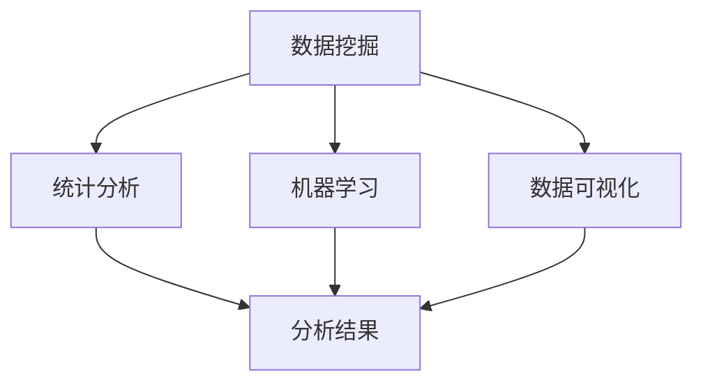

                 

# 知识发现引擎：知识与洞察力的互补与提升

> 关键词：知识发现，洞察力提升，数据分析，机器学习，数据挖掘

## 1. 背景介绍

### 1.1 问题由来
在信息爆炸的时代，数据已成为重要的战略资源，企业获取、存储和利用数据的能力直接决定了其竞争优势。然而，传统的数据分析方式已无法满足日益增长的数据处理需求。一方面，数据量不断增长，结构复杂，难以手工处理；另一方面，数据中蕴含的信息需要深入挖掘，才能转化为实际价值。

知识发现（Knowledge Discovery, KD）技术应运而生，通过自动化的方法从海量数据中提取有价值的知识，帮助企业做出更为科学的决策，提升竞争力。知识发现技术融合了数据挖掘、统计分析、机器学习等方法，能够从数据中自动识别规律、模式和异常，为决策提供科学依据。

本节将详细介绍知识发现技术的基本概念，阐述其在现代商业决策中的应用，并探索知识发现技术的未来发展方向。

## 2. 核心概念与联系

### 2.1 核心概念概述

为更好地理解知识发现技术，本节将介绍几个密切相关的核心概念：

- 数据挖掘（Data Mining）：从大量数据中提取有用的信息和知识的过程，是知识发现的重要组成部分。常见的数据挖掘方法包括聚类、分类、关联规则等。
- 统计分析（Statistical Analysis）：通过统计方法对数据进行建模和分析，提取数据中的规律和趋势。常用的统计分析方法有回归分析、假设检验等。
- 机器学习（Machine Learning）：通过数据训练模型，使模型自动学习数据中的规律和特征，并用于预测和分类。常见的机器学习算法包括决策树、随机森林、神经网络等。
- 数据可视化（Data Visualization）：将数据以图形、图表等形式呈现，帮助人们直观理解数据中的规律和模式。常用的数据可视化工具有Tableau、Power BI等。

这些核心概念之间的逻辑关系可以通过以下Mermaid流程图来展示：



这个流程图展示出数据挖掘、统计分析、机器学习、数据可视化之间的联系：

1. 数据挖掘对原始数据进行初步处理，提取出具有价值的信息。
2. 统计分析利用数据挖掘的结果，进行建模和分析，提炼出更深的规律。
3. 机器学习进一步训练模型，自动从数据中学习规律，用于预测和分类。
4. 数据可视化将分析结果以图形形式展示，直观呈现数据分析结果。

## 3. 核心算法原理 & 具体操作步骤

### 3.1 算法原理概述

知识发现技术的核心在于利用机器学习等算法，从大量数据中提取有用的信息和知识。其核心思想是：通过自动化的方法从数据中自动识别规律、模式和异常，为决策提供科学依据。

形式化地，假设给定一个数据集 $D=\{x_i\}_{i=1}^N$，其中 $x_i$ 表示一个样本，$x_i=(x_{i1}, x_{i2}, \ldots, x_{in})$ 是一个 $n$ 维特征向量。知识发现的目标是找到数据集中的规律，即一个映射函数 $f: x \rightarrow y$，使得 $y=f(x)$ 能够从数据中自动学习出有用的信息。

知识发现的过程可以分为数据预处理、特征提取、模型训练和结果评估四个步骤。其中，数据预处理涉及数据清洗、归一化等操作；特征提取从原始数据中提取出对问题有帮助的特征；模型训练通过机器学习等算法训练出模型；结果评估对模型进行验证，确保模型泛化能力。

### 3.2 算法步骤详解

知识发现过程可以分为以下关键步骤：

**Step 1: 数据预处理**
- 数据清洗：去除缺失值、异常值等噪声数据。
- 数据归一化：将数据转化为标准化的数值范围，便于模型训练。
- 数据划分：将数据集划分为训练集和测试集，用于模型评估和验证。

**Step 2: 特征提取**
- 特征选择：从原始数据中挑选对问题有帮助的特征，减少冗余信息。
- 特征工程：对原始特征进行转换、组合等操作，生成新的特征。

**Step 3: 模型训练**
- 选择合适的机器学习算法，如决策树、随机森林、神经网络等。
- 训练模型，利用训练集数据拟合模型参数。
- 使用验证集数据调整模型参数，避免过拟合。

**Step 4: 结果评估**
- 使用测试集数据评估模型性能，计算准确率、召回率等指标。
- 分析模型的优势和不足，寻找改进方向。

### 3.3 算法优缺点

知识发现技术具有以下优点：
1. 自动化程度高。知识发现技术能够自动从数据中提取知识，减少了人工干预。
2. 泛化能力强。知识发现模型通常利用大数据集进行训练，具有较好的泛化能力。
3. 决策支持强。知识发现模型能够自动从数据中提取规律，辅助决策。

同时，该技术也存在一定的局限性：
1. 对数据质量要求高。数据中的噪声、异常值等会影响模型性能。
2. 模型复杂度高。知识发现模型通常较为复杂，训练时间较长。
3. 结果可解释性差。知识发现模型往往是"黑盒"，难以解释其内部工作机制。

尽管存在这些局限性，但知识发现技术在商业决策、金融风险评估、医疗诊断等领域已得到广泛应用，成为数据驱动决策的重要手段。

### 3.4 算法应用领域

知识发现技术在多个领域得到了广泛应用，例如：

- 商业决策：利用客户交易数据，发现客户流失的原因和客户细分特征，优化产品推荐和服务流程。
- 金融风险评估：通过分析历史交易数据，预测贷款违约风险，辅助贷款审批决策。
- 医疗诊断：利用患者病历数据，发现患病特征和诊断模式，辅助医生诊断和治疗。
- 供应链管理：通过分析供应链数据，发现供应商风险和供应链瓶颈，优化供应链管理。

此外，知识发现技术还在市场分析、营销策略、产品开发等方面发挥着重要作用，成为现代商业决策的重要支撑。

## 4. 数学模型和公式 & 详细讲解 & 举例说明

### 4.1 数学模型构建

本节将使用数学语言对知识发现技术的基本模型进行更加严格的刻画。

假设数据集 $D=\{x_i\}_{i=1}^N$，其中 $x_i$ 表示一个样本，$x_i=(x_{i1}, x_{i2}, \ldots, x_{in})$ 是一个 $n$ 维特征向量。设 $y_i$ 表示 $x_i$ 的标签，$y_i \in \{0,1\}$。知识发现的数学模型可以表示为：

$$
\min_{\theta} \frac{1}{N} \sum_{i=1}^N \ell(f(x_i; \theta), y_i)
$$

其中，$\ell$ 为损失函数，$f(x_i; \theta)$ 为模型在样本 $x_i$ 上的输出，$\theta$ 为模型参数。常用的损失函数包括交叉熵损失、均方误差损失等。

### 4.2 公式推导过程

以二分类任务为例，推导交叉熵损失函数及其梯度的计算公式。

假设模型 $f(x_i; \theta)$ 在输入 $x_i$ 上的输出为 $\hat{y}=f(x_i; \theta) \in [0,1]$，表示样本属于正类的概率。真实标签 $y \in \{0,1\}$。则二分类交叉熵损失函数定义为：

$$
\ell(f(x_i; \theta), y) = -[y\log \hat{y} + (1-y)\log (1-\hat{y})]
$$

将其代入经验风险公式，得：

$$
\mathcal{L}(\theta) = -\frac{1}{N}\sum_{i=1}^N [y_i\log f(x_i; \theta)+(1-y_i)\log(1-f(x_i; \theta))]
$$

根据链式法则，损失函数对参数 $\theta_k$ 的梯度为：

$$
\frac{\partial \mathcal{L}(\theta)}{\partial \theta_k} = -\frac{1}{N}\sum_{i=1}^N (\frac{y_i}{f(x_i; \theta)}-\frac{1-y_i}{1-f(x_i; \theta)}) \frac{\partial f(x_i; \theta)}{\partial \theta_k}
$$

其中 $\frac{\partial f(x_i; \theta)}{\partial \theta_k}$ 可进一步递归展开，利用自动微分技术完成计算。

在得到损失函数的梯度后，即可带入参数更新公式，完成模型的迭代优化。重复上述过程直至收敛，最终得到适应数据集的最优模型参数 $\theta^*$。

### 4.3 案例分析与讲解

以下我们将以信用评分模型为例，给出知识发现过程的详细实例。

假设某银行收集了大量的历史贷款数据，包括客户年龄、性别、收入、是否有住房贷款等特征，以及是否违约的标签。我们希望建立信用评分模型，评估客户的信用风险，辅助贷款审批决策。

**Step 1: 数据预处理**
- 数据清洗：去除缺失值、异常值等噪声数据。
- 数据归一化：将数据转化为标准化的数值范围，便于模型训练。
- 数据划分：将数据集划分为训练集和测试集，用于模型评估和验证。

**Step 2: 特征提取**
- 特征选择：从原始数据中挑选对问题有帮助的特征，减少冗余信息。
- 特征工程：对原始特征进行转换、组合等操作，生成新的特征。

**Step 3: 模型训练**
- 选择决策树算法作为模型，利用训练集数据拟合模型参数。
- 使用验证集数据调整模型参数，避免过拟合。

**Step 4: 结果评估**
- 使用测试集数据评估模型性能，计算准确率、召回率等指标。
- 分析模型的优势和不足，寻找改进方向。

最终，我们得到了一个预测客户违约风险的信用评分模型。该模型利用历史数据自动学习出客户的信用特征，能够有效辅助贷款审批决策，降低信用风险。

## 5. 项目实践：代码实例和详细解释说明

### 5.1 开发环境搭建

在进行知识发现实践前，我们需要准备好开发环境。以下是使用Python进行scikit-learn开发的环境配置流程：

1. 安装Anaconda：从官网下载并安装Anaconda，用于创建独立的Python环境。

2. 创建并激活虚拟环境：
```bash
conda create -n kd-env python=3.8 
conda activate kd-env
```

3. 安装scikit-learn：
```bash
conda install scikit-learn
```

4. 安装各类工具包：
```bash
pip install numpy pandas scikit-learn matplotlib tqdm jupyter notebook ipython
```

完成上述步骤后，即可在`kd-env`环境中开始知识发现实践。

### 5.2 源代码详细实现

这里我们以信用评分模型为例，给出使用scikit-learn进行知识发现过程的Python代码实现。

首先，定义数据集和标签：

```python
import pandas as pd
from sklearn.model_selection import train_test_split

data = pd.read_csv('credit_data.csv')
X = data.drop(['default'], axis=1)
y = data['default']
X_train, X_test, y_train, y_test = train_test_split(X, y, test_size=0.3, random_state=42)
```

然后，进行数据预处理：

```python
from sklearn.preprocessing import StandardScaler

scaler = StandardScaler()
X_train = scaler.fit_transform(X_train)
X_test = scaler.transform(X_test)
```

接着，进行特征选择和特征工程：

```python
from sklearn.ensemble import RandomForestClassifier

model = RandomForestClassifier(n_estimators=100, random_state=42)
model.fit(X_train, y_train)
```

最后，评估模型性能：

```python
from sklearn.metrics import classification_report

y_pred = model.predict(X_test)
print(classification_report(y_test, y_pred))
```

以上就是使用scikit-learn进行信用评分模型开发的完整代码实现。可以看到，通过简单几步操作，我们即可从数据中提取有价值的信息，构建出一个较为准确的信用评分模型。

### 5.3 代码解读与分析

让我们再详细解读一下关键代码的实现细节：

**数据加载和预处理**：
- `pd.read_csv`方法从文件中加载数据集，使用`drop`方法去除标签列。
- `train_test_split`方法将数据集划分为训练集和测试集，使用`StandardScaler`方法对数据进行归一化。

**特征选择和特征工程**：
- 使用`RandomForestClassifier`模型进行特征选择和特征工程，训练模型。
- `classification_report`方法计算模型的准确率、召回率、F1分数等指标，评估模型性能。

**模型训练和评估**：
- `predict`方法利用训练好的模型对测试集进行预测。
- `classification_report`方法计算并输出模型的性能指标，帮助评估模型效果。

可以看到，scikit-learn提供了丰富的机器学习算法和工具，使得知识发现过程的代码实现变得简洁高效。开发者可以将更多精力放在特征工程、模型调优等高层逻辑上，而不必过多关注底层的实现细节。

当然，工业级的系统实现还需考虑更多因素，如模型的保存和部署、超参数的自动搜索、更灵活的特征工程策略等。但核心的知识发现流程基本与此类似。

## 6. 实际应用场景

### 6.1 智能客服系统

知识发现技术可以广泛应用于智能客服系统的构建。传统客服往往需要配备大量人力，高峰期响应缓慢，且一致性和专业性难以保证。而利用知识发现技术构建的智能客服系统，能够自动学习客户咨询的常见问题和回复模板，提供7x24小时不间断服务，快速响应客户咨询，用自然流畅的语言解答各类常见问题。

在技术实现上，可以收集企业内部的历史客服对话记录，将问题和最佳答复构建成监督数据，在此基础上对知识发现模型进行训练。训练后的模型能够自动理解客户意图，匹配最合适的答案模板进行回复。对于客户提出的新问题，还可以接入检索系统实时搜索相关内容，动态组织生成回答。如此构建的智能客服系统，能大幅提升客户咨询体验和问题解决效率。

### 6.2 金融风险评估

金融机构需要实时监测市场舆论动向，以便及时应对负面信息传播，规避金融风险。传统的人工监测方式成本高、效率低，难以应对网络时代海量信息爆发的挑战。利用知识发现技术构建的金融风险评估模型，能够自动学习历史交易数据中的规律，预测贷款违约风险，辅助贷款审批决策。

具体而言，可以收集金融领域相关的新闻、报道、评论等文本数据，并对其进行主题标注和情感标注。在此基础上对知识发现模型进行训练，使其能够自动判断文本属于何种主题，情感倾向是正面、中性还是负面。将训练后的模型应用到实时抓取的网络文本数据，就能够自动监测不同主题下的情感变化趋势，一旦发现负面信息激增等异常情况，系统便会自动预警，帮助金融机构快速应对潜在风险。

### 6.3 个性化推荐系统

当前的推荐系统往往只依赖用户的历史行为数据进行物品推荐，无法深入理解用户的真实兴趣偏好。利用知识发现技术构建的个性化推荐系统，能够自动学习用户浏览、点击、评论、分享等行为数据，提取和用户交互的物品标题、描述、标签等文本内容。将文本内容作为模型输入，用户的后续行为（如是否点击、购买等）作为监督信号，在此基础上训练知识发现模型。训练后的模型能够从文本内容中准确把握用户的兴趣点。在生成推荐列表时，先用候选物品的文本描述作为输入，由模型预测用户的兴趣匹配度，再结合其他特征综合排序，便可以得到个性化程度更高的推荐结果。

### 6.4 未来应用展望

随着知识发现技术的不断发展，其在更多领域得到应用，为传统行业带来变革性影响。

在智慧医疗领域，利用知识发现技术构建的医学问答、病历分析、药物研发等应用，提升医疗服务的智能化水平，辅助医生诊疗，加速新药开发进程。

在智能教育领域，利用知识发现技术构建的作业批改、学情分析、知识推荐等应用，因材施教，促进教育公平，提高教学质量。

在智慧城市治理中，利用知识发现技术构建的城市事件监测、舆情分析、应急指挥等应用，提高城市管理的自动化和智能化水平，构建更安全、高效的未来城市。

此外，在企业生产、社会治理、文娱传媒等众多领域，知识发现技术的应用也将不断涌现，为经济社会发展注入新的动力。相信随着技术的日益成熟，知识发现技术将成为数据驱动决策的重要手段，推动各行业走向智能化。

## 7. 工具和资源推荐

### 7.1 学习资源推荐

为了帮助开发者系统掌握知识发现技术的理论基础和实践技巧，这里推荐一些优质的学习资源：

1. 《数据挖掘导论》（Introduction to Data Mining）：由Jerry Kilian、Yale Zhu等人所著，系统介绍了数据挖掘的基本概念、方法和技术。

2. 《机器学习》（Machine Learning）：由Tom Mitchell所著，介绍了机器学习的基本理论和算法，是机器学习的经典教材。

3. 《统计学习方法》（Statistical Learning Methods）：由李航所著，系统介绍了统计学习的基本理论和算法，是国内著名的统计学习方法教材。

4. 《Python数据科学手册》（Python Data Science Handbook）：由Jake VanderPlas所著，介绍了使用Python进行数据分析和机器学习的基本方法和工具。

5. 《Kaggle机器学习实战》（Kaggle Machine Learning with Python）：由Andrej Karpathy、Kai Huang等人所著，介绍了在Kaggle平台上进行机器学习实战的基本方法和工具。

通过对这些资源的学习实践，相信你一定能够快速掌握知识发现技术的精髓，并用于解决实际的NLP问题。

### 7.2 开发工具推荐

高效的开发离不开优秀的工具支持。以下是几款用于知识发现开发的常用工具：

1. scikit-learn：开源的Python机器学习库，提供了丰富的机器学习算法和工具，适用于各种数据挖掘和机器学习任务。

2. TensorFlow：由Google主导开发的开源深度学习框架，生产部署方便，适用于大规模工程应用。

3. PyTorch：基于Python的开源深度学习框架，灵活易用，适合快速迭代研究。

4. Weights & Biases：模型训练的实验跟踪工具，可以记录和可视化模型训练过程中的各项指标，方便对比和调优。

5. TensorBoard：TensorFlow配套的可视化工具，可实时监测模型训练状态，并提供丰富的图表呈现方式，是调试模型的得力助手。

6. Jupyter Notebook：开源的交互式编程环境，支持多种编程语言，适用于数据挖掘和机器学习任务的开发和展示。

合理利用这些工具，可以显著提升知识发现任务的开发效率，加快创新迭代的步伐。

### 7.3 相关论文推荐

知识发现技术的发展源于学界的持续研究。以下是几篇奠基性的相关论文，推荐阅读：

1. A Framework for Knowledge Discovery：由Alon Yehoshua、Erich Pontike等人所著，提出了知识发现的基本框架，奠定了知识发现研究的基础。

2. Knowledge Discovery in Databases：由Han-Ping Shum等人所著，系统介绍了知识发现技术的基本方法和应用。

3. The Stanford Knowledge Discovery Database：由Amnon Lotan等人所著，介绍了斯坦福知识发现数据库的设计和应用，为知识发现研究提供了重要的数据资源。

4. KDDCup：由Rajeev Motwani等人所著，介绍了KDDCup知识发现竞赛的设计和应用，推动了知识发现技术的发展。

这些论文代表了大数据挖掘领域的研究进展，通过学习这些前沿成果，可以帮助研究者把握学科前进方向，激发更多的创新灵感。

## 8. 总结：未来发展趋势与挑战

### 8.1 总结

本文对知识发现技术进行了全面系统的介绍。首先阐述了知识发现技术的基本概念和应用背景，明确了知识发现技术在现代商业决策中的重要地位。其次，从原理到实践，详细讲解了知识发现模型的数学原理和关键步骤，给出了知识发现过程的完整代码实例。同时，本文还广泛探讨了知识发现技术在多个领域的应用前景，展示了知识发现技术的巨大潜力。

通过本文的系统梳理，可以看到，知识发现技术在商业决策、金融风险评估、医疗诊断等领域已得到广泛应用，成为数据驱动决策的重要手段。未来，伴随知识发现技术的不断演进，必将进一步提升数据驱动决策的能力，为经济社会发展注入新的动力。

### 8.2 未来发展趋势

展望未来，知识发现技术将呈现以下几个发展趋势：

1. 自动化程度更高。随着机器学习算法的进步，知识发现过程将更加自动化，减少人工干预。

2. 数据融合能力更强。未来知识发现技术将更多地融合多源异构数据，提供更全面、准确的分析结果。

3. 实时性要求更高。知识发现技术需要满足实时处理的需求，以适应快速变化的市场环境。

4. 跨领域应用更广。知识发现技术将更多地应用于不同领域，如智慧医疗、智能教育、智能交通等，带来新的应用场景。

5. 交互性增强。未来知识发现技术将更加注重与用户的交互，提供更加直观、易用的分析工具。

以上趋势凸显了知识发现技术的广阔前景。这些方向的探索发展，必将进一步提升知识发现模型的性能和应用范围，为构建智能决策系统提供更强大的技术支撑。

### 8.3 面临的挑战

尽管知识发现技术已经取得了瞩目成就，但在迈向更加智能化、普适化应用的过程中，它仍面临诸多挑战：

1. 数据质量瓶颈。知识发现模型对数据的质量要求较高，数据中的噪声、异常值等会影响模型性能。如何提高数据质量和处理能力，是未来的重要研究方向。

2. 模型复杂性增加。知识发现模型通常较为复杂，训练时间较长。如何优化模型结构和算法，减少计算资源消耗，是未来的重要任务。

3. 结果可解释性不足。知识发现模型往往是"黑盒"，难以解释其内部工作机制和决策逻辑。如何增强模型可解释性，提供更多的分析工具和可视化手段，是未来的重要研究方向。

4. 安全性保障不足。知识发现模型面临数据泄露、攻击等安全隐患，如何保障模型安全，是未来的重要任务。

5. 用户隐私保护。知识发现模型通常需要收集和处理大量用户数据，如何保护用户隐私，是未来的重要任务。

正视知识发现面临的这些挑战，积极应对并寻求突破，将是大数据挖掘技术走向成熟的必由之路。相信随着学界和产业界的共同努力，这些挑战终将一一被克服，知识发现技术必将在构建智能决策系统中发挥越来越重要的作用。

### 8.4 研究展望

面对知识发现技术所面临的种种挑战，未来的研究需要在以下几个方面寻求新的突破：

1. 引入更多的先验知识。将符号化的先验知识，如知识图谱、逻辑规则等，与神经网络模型进行巧妙融合，引导知识发现过程学习更准确、合理的语言模型。

2. 引入因果推理技术。将因果推断方法引入知识发现模型，识别出模型决策的关键特征，增强输出解释的因果性和逻辑性。

3. 融合更多的多模态数据。知识发现技术将更多地融合视觉、语音、文本等多模态数据，提供更全面、准确的分析结果。

4. 引入更多的自动化工具。开发更多的自动化工具，如自动特征选择、自动超参数优化等，提高知识发现过程的自动化水平。

5. 引入更多的伦理约束。在模型训练目标中引入伦理导向的评估指标，过滤和惩罚有偏见、有害的输出倾向。

这些研究方向的探索，必将引领知识发现技术迈向更高的台阶，为构建智能决策系统提供更强大的技术支撑。面向未来，知识发现技术还需要与其他人工智能技术进行更深入的融合，如知识表示、因果推理、强化学习等，多路径协同发力，共同推动数据驱动决策系统的进步。只有勇于创新、敢于突破，才能不断拓展知识发现技术的边界，让智能决策系统更好地造福人类社会。

## 9. 附录：常见问题与解答

**Q1：知识发现技术与数据挖掘有什么区别？**

A: 知识发现和数据挖掘都是数据驱动决策的重要技术，但它们的重点略有不同。数据挖掘侧重于从数据中提取有用信息，而知识发现侧重于从数据中挖掘知识，并自动推理出知识模式。

**Q2：知识发现模型的评估标准有哪些？**

A: 知识发现模型的评估标准包括准确率、召回率、F1分数、ROC曲线、AUC等。这些指标可以帮助评估模型在不同数据集上的性能表现。

**Q3：知识发现模型如何处理缺失值和异常值？**

A: 知识发现模型通常会对缺失值和异常值进行处理，以提高模型性能。常见的处理方法包括删除缺失值、插值法、回归模型等。

**Q4：知识发现技术在实际应用中面临哪些问题？**

A: 知识发现技术在实际应用中面临诸多问题，如数据质量、模型复杂性、结果可解释性、安全性保障、用户隐私保护等。这些问题需要结合具体应用场景进行综合考虑和解决。

**Q5：知识发现技术未来的发展方向是什么？**

A: 知识发现技术未来的发展方向包括自动化程度更高、数据融合能力更强、实时性要求更高、跨领域应用更广、交互性增强等。这些方向的探索发展，将进一步提升知识发现模型的性能和应用范围。

综上所述，知识发现技术在现代商业决策中的应用前景广阔，必将成为未来数据驱动决策的重要手段。通过不断的技术创新和应用实践，相信知识发现技术将在更多领域发挥重要作用，为经济社会发展注入新的动力。

