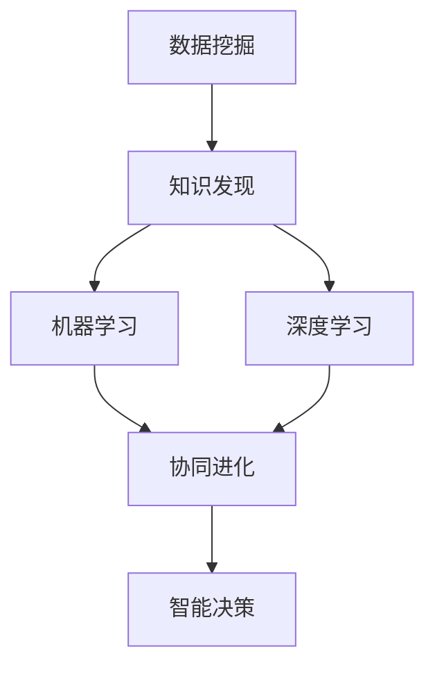

                 

# 知识发现引擎：知识与洞察力的协同进化

> 关键词：知识发现,数据挖掘,机器学习,深度学习,协同进化,智能决策

## 1. 背景介绍

### 1.1 问题由来
在信息爆炸的时代，如何从海量的数据中发现有价值的信息和知识，一直是信息处理领域的核心问题。传统的数据库和信息检索技术，往往只能进行简单的文本匹配和检索，难以发现隐藏在数据背后的深层规律和关系。数据挖掘（Data Mining）和知识发现（Knowledge Discovery）技术的诞生，使得我们能够借助机器学习和深度学习的力量，从数据中自动发现模式、规律和关系，为决策制定提供坚实的依据。

在学术界和工业界，知识发现引擎（Knowledge Discovery Engine）被广泛应用于各种领域，如医疗、金融、零售、社交媒体等，以提升决策的智能化水平。知识发现引擎结合了数据挖掘、机器学习、深度学习等多项技术，通过挖掘数据中的深层知识和洞察力，为决策者提供更加精准、可靠的预测和建议，从而帮助其在复杂多变的环境中做出更为科学的决策。

### 1.2 问题核心关键点
知识发现引擎的核心目标是通过自动化分析数据，发现有价值的模式和知识，辅助决策制定。其关键点包括：
- 自动化数据预处理：对原始数据进行清洗、归一化、特征提取等预处理操作，使其适合进行后续的模型训练和分析。
- 数据特征提取与建模：利用统计分析、机器学习、深度学习等方法，从原始数据中提取出关键特征，并进行模型训练，构建起有意义的知识图谱或模型。
- 知识表示与推理：将提取的知识表示为机器可理解的形式，并通过推理机制将知识串联起来，形成知识网络。
- 实时分析和预测：对新数据进行实时分析，并结合现有知识进行预测和推荐，辅助决策制定。

知识发现引擎的研究重点在于如何高效、准确地从数据中发现有价值的模式和知识，并在此基础上进行知识表示和推理，以辅助决策。本文将系统介绍知识发现引擎的核心概念、技术原理及应用实践，旨在为读者提供全面、深入的技术见解。

## 2. 核心概念与联系

### 2.1 核心概念概述

为更好地理解知识发现引擎的工作原理，本节将介绍几个关键概念：

- 数据挖掘(Data Mining)：从大量数据中发现有价值的模式和知识，是知识发现引擎的基础。
- 知识发现(Knowledge Discovery)：在数据挖掘的基础上，结合人类专家的领域知识，提取出对实际问题有指导意义的知识。
- 机器学习(Machine Learning)：通过训练数据集，使机器能够学习到数据中的模式和规律，并应用于新数据。
- 深度学习(Deep Learning)：利用神经网络等深度结构，从大量数据中学习到高层次的特征表示。
- 协同进化(Co-evolution)：知识发现引擎通过不断学习新数据，更新模型，实现知识的动态更新和进化。
- 智能决策(Intelligent Decision Making)：基于发现的知识和洞察力，辅助决策制定，提高决策的准确性和效率。

这些概念之间的逻辑关系可以通过以下Mermaid流程图来展示：



这个流程图展示了知识发现引擎的工作流程：

1. 从原始数据中挖掘出有意义的模式和知识。
2. 结合专家知识，构建起对实际问题有指导意义的知识图谱或模型。
3. 利用机器学习和深度学习技术，不断学习和更新知识。
4. 结合发现的知识和洞察力，辅助决策制定。

## 3. 核心算法原理 & 具体操作步骤
### 3.1 算法原理概述

知识发现引擎的核心算法原理包括数据预处理、特征提取与建模、知识表示与推理、智能决策等步骤。以下是各步骤的详细解释：

### 3.2 算法步骤详解

#### 3.2.1 数据预处理
数据预处理是知识发现引擎的第一步，其目标是对原始数据进行清洗、归一化、特征提取等预处理操作，使其适合进行后续的模型训练和分析。

1. **数据清洗**：识别并去除数据中的噪声和异常值，确保数据的准确性和一致性。
2. **数据归一化**：将数据转化为标准化的格式，便于模型训练和分析。
3. **特征提取**：从原始数据中提取出关键特征，包括统计特征、文本特征、时间特征等。

#### 3.2.2 特征提取与建模
在数据预处理的基础上，知识发现引擎需要利用统计分析、机器学习、深度学习等方法，从原始数据中提取出关键特征，并进行模型训练，构建起有意义的知识图谱或模型。

1. **统计分析**：利用统计学方法，从数据中提取均值、方差、相关系数等统计特征。
2. **机器学习建模**：使用决策树、随机森林、支持向量机等算法，构建起有意义的模型。
3. **深度学习建模**：利用神经网络等深度结构，从大量数据中学习到高层次的特征表示。

#### 3.2.3 知识表示与推理
知识发现引擎需要将提取的知识表示为机器可理解的形式，并通过推理机制将知识串联起来，形成知识网络。

1. **知识表示**：将提取的知识表示为知识图谱、向量空间、符号表示等形式。
2. **知识推理**：利用规则、逻辑、概率等机制，将知识串联起来，形成知识网络，支持自动推理和预测。

#### 3.2.4 智能决策
基于发现的知识和洞察力，知识发现引擎辅助决策制定，提高决策的准确性和效率。

1. **预测与推荐**：利用模型对新数据进行预测和推荐，辅助决策制定。
2. **情景分析**：结合当前环境和历史数据，进行情景分析，提供多种决策方案。
3. **智能优化**：利用优化算法，在多个方案中选择最优方案。

### 3.3 算法优缺点

知识发现引擎具有以下优点：
- 自动化数据预处理：自动化的数据清洗、归一化和特征提取，减少了人工干预，提高了数据处理的效率和准确性。
- 高层次特征提取：利用深度学习等技术，从原始数据中提取出高层次的特征表示，提升了模型的性能。
- 知识动态更新：通过不断学习新数据，知识发现引擎能够实现知识的动态更新和进化，提高了模型的时效性。
- 智能辅助决策：基于发现的知识和洞察力，辅助决策制定，提高了决策的准确性和效率。

同时，知识发现引擎也存在以下局限性：
- 数据质量依赖：知识发现引擎的效果很大程度上依赖于数据的质量和完整性，数据偏差可能导致模型失效。
- 复杂性高：构建知识发现引擎需要涉及数据预处理、特征提取、建模、推理等多个环节，技术难度较大。
- 模型可解释性差：部分深度学习模型（如神经网络）的黑盒特性，使得其难以解释决策过程。
- 计算资源消耗大：构建和训练知识发现引擎需要大量的计算资源和时间，对硬件要求较高。

尽管存在这些局限性，知识发现引擎凭借其在数据挖掘和智能决策方面的强大能力，已经成为信息处理和决策支持的重要工具。

### 3.4 算法应用领域

知识发现引擎在多个领域得到了广泛应用，包括但不限于：

- **金融领域**：用于风险评估、投资分析、欺诈检测等任务，帮助金融机构在复杂多变的环境中进行精准决策。
- **医疗领域**：用于疾病诊断、治疗方案推荐、药物研发等任务，辅助医生进行高效、准确的医疗决策。
- **零售领域**：用于销售预测、库存管理、顾客行为分析等任务，提升零售业的运营效率和客户满意度。
- **社交媒体**：用于舆情分析、用户行为分析、广告推荐等任务，帮助企业更好地理解市场和用户需求。
- **能源领域**：用于能源需求预测、设备维护、资源优化等任务，提高能源行业的运营效率和安全性。

随着大数据和深度学习技术的发展，知识发现引擎的应用场景将不断扩展，成为各行各业数字化转型的重要工具。

## 4. 数学模型和公式 & 详细讲解 & 举例说明
### 4.1 数学模型构建

本节将使用数学语言对知识发现引擎的工作原理进行更加严格的刻画。

设原始数据集为 $D=\{x_i\}_{i=1}^N$，其中 $x_i$ 为输入向量，$y_i$ 为输出向量（目标变量）。知识发现引擎的目标是构建一个模型 $M$，使其能够从输入数据中学习到模式和规律，并应用于新数据。

### 4.2 公式推导过程

我们以线性回归模型为例，推导其在知识发现引擎中的应用。

线性回归模型的目标是找到一条线性关系，使得模型对输入数据的预测尽可能接近真实值。假设模型为 $M(x) = \theta_0 + \theta_1 x_1 + \theta_2 x_2 + \cdots + \theta_n x_n$，其中 $\theta_0, \theta_1, \theta_2, \cdots, \theta_n$ 为模型参数。模型在数据集 $D$ 上的经验风险定义为：

$$
\mathcal{L}(\theta) = \frac{1}{N} \sum_{i=1}^N (y_i - M(x_i))^2
$$

其中 $(y_i - M(x_i))^2$ 为残差平方，表示模型预测值与真实值之间的差异。

通过最小化损失函数，我们可以得到模型参数的最优解：

$$
\theta^* = \mathop{\arg\min}_{\theta} \mathcal{L}(\theta)
$$

常用的求解方法包括梯度下降法、正规方程法等。这里以梯度下降法为例，求解过程如下：

1. 初始化模型参数 $\theta_0, \theta_1, \theta_2, \cdots, \theta_n$。
2. 对于每个数据点 $(x_i, y_i)$，计算模型预测值 $M(x_i)$ 与真实值 $y_i$ 的误差 $\epsilon_i = y_i - M(x_i)$。
3. 计算误差对模型参数的梯度 $\frac{\partial \mathcal{L}(\theta)}{\partial \theta_j}$，其中 $j = 0, 1, 2, \cdots, n$。
4. 根据梯度下降法，更新模型参数 $\theta_j \leftarrow \theta_j - \eta \frac{\partial \mathcal{L}(\theta)}{\partial \theta_j}$，其中 $\eta$ 为学习率。
5. 重复步骤2-4，直至损失函数收敛或达到预设迭代次数。

通过上述过程，我们可以得到训练好的线性回归模型 $M(x)$，并将其应用于新数据 $x$ 的预测。

### 4.3 案例分析与讲解

以金融领域的信用评分为例，说明知识发现引擎的实际应用。

金融公司需要对申请贷款的用户进行信用评分，以评估其还款能力和信用风险。原始数据包括用户的个人信息、收入、负债、信用历史等，目标变量为用户的信用评分（1-100分）。

通过数据预处理，我们得到标准化的数据集 $D=\{x_i, y_i\}_{i=1}^N$，其中 $x_i$ 为输入向量，$y_i$ 为输出向量。利用线性回归模型，我们构建起信用评分预测模型 $M(x)$。模型在数据集 $D$ 上的损失函数为：

$$
\mathcal{L}(\theta) = \frac{1}{N} \sum_{i=1}^N (y_i - M(x_i))^2
$$

通过最小化损失函数，我们可以得到最优的模型参数 $\theta^*$，构建起信用评分预测模型 $M(x)$。将新用户的数据输入模型，即可得到其信用评分预测结果，辅助金融机构做出贷款决策。

## 5. 项目实践：代码实例和详细解释说明
### 5.1 开发环境搭建

在进行知识发现引擎的开发和实践前，我们需要准备好开发环境。以下是使用Python进行Scikit-learn开发的开发环境配置流程：

1. 安装Anaconda：从官网下载并安装Anaconda，用于创建独立的Python环境。

2. 创建并激活虚拟环境：
```bash
conda create -n sklearn-env python=3.8 
conda activate sklearn-env
```

3. 安装Scikit-learn：
```bash
conda install scikit-learn
```

4. 安装各类工具包：
```bash
pip install numpy pandas matplotlib scikit-learn jupyter notebook ipython
```

完成上述步骤后，即可在`sklearn-env`环境中开始开发实践。

### 5.2 源代码详细实现

这里我们以线性回归模型为例，给出使用Scikit-learn进行数据挖掘和知识发现的Python代码实现。

```python
from sklearn.datasets import load_boston
from sklearn.model_selection import train_test_split
from sklearn.linear_model import LinearRegression
from sklearn.metrics import mean_squared_error

# 加载波士顿房价数据集
boston = load_boston()
X = boston.data
y = boston.target

# 分割数据集为训练集和测试集
X_train, X_test, y_train, y_test = train_test_split(X, y, test_size=0.2, random_state=42)

# 训练线性回归模型
reg = LinearRegression()
reg.fit(X_train, y_train)

# 预测测试集
y_pred = reg.predict(X_test)

# 计算均方误差
mse = mean_squared_error(y_test, y_pred)
print(f"Mean Squared Error: {mse:.2f}")
```

### 5.3 代码解读与分析

让我们再详细解读一下关键代码的实现细节：

**load_boston函数**：
- 用于加载Boston Housing数据集，其中包含波士顿地区的房价数据。

**train_test_split函数**：
- 用于将数据集分割为训练集和测试集，方便进行模型训练和评估。

**LinearRegression类**：
- 定义线性回归模型，继承自sklearn.linear_model模块。

**fit函数**：
- 在训练集上训练模型，通过最小化损失函数学习最优参数。

**predict函数**：
- 在测试集上进行预测，返回模型的预测结果。

**mean_squared_error函数**：
- 计算模型预测结果与真实结果之间的均方误差。

在上述代码中，我们首先加载了波士顿房价数据集，然后将其分割为训练集和测试集。接着，使用线性回归模型对训练集进行拟合，并计算模型在测试集上的均方误差。通过均方误差指标，我们可以评估模型的预测效果，并进行进一步的优化。

## 6. 实际应用场景
### 6.1 金融风险管理

在金融领域，知识发现引擎被广泛应用于风险评估和管理。通过分析历史贷款数据，知识发现引擎可以自动识别出高风险客户，预测违约概率，帮助金融机构提前采取风险控制措施。

具体而言，可以构建一个线性回归模型，以用户的收入、负债、信用历史等特征为输入，以信用评分或违约概率为目标变量，进行模型训练和预测。在评估新客户时，将客户的个人信息输入模型，即可得到其信用评分或违约概率，辅助金融机构做出信贷决策。

### 6.2 医疗疾病诊断

在医疗领域，知识发现引擎被应用于疾病诊断和预测。通过分析患者的症状、实验室检查结果等数据，知识发现引擎可以自动识别出可能存在的疾病，并给出相应的诊断和治疗建议。

具体而言，可以构建一个决策树模型，以患者的症状、年龄、性别、实验室检查结果等特征为输入，以疾病为目标变量，进行模型训练和预测。在评估新患者时，将患者的症状和检查结果输入模型，即可得到其可能患有的疾病，辅助医生进行诊断和治疗。

### 6.3 零售推荐系统

在零售领域，知识发现引擎被应用于推荐系统。通过分析用户的购买历史、浏览记录等数据，知识发现引擎可以自动识别出用户可能感兴趣的商品，并进行个性化推荐。

具体而言，可以构建一个协同过滤推荐系统，以用户的购买历史、浏览记录等特征为输入，以推荐商品为目标变量，进行模型训练和预测。在推荐新商品时，将用户的浏览记录输入模型，即可得到其可能感兴趣的商品，提升用户满意度和销售额。

### 6.4 未来应用展望

随着大数据和深度学习技术的发展，知识发现引擎的应用场景将不断扩展，成为各行各业数字化转型的重要工具。

在智慧医疗领域，知识发现引擎可以用于患者治疗方案推荐、疾病预测、药物研发等任务，辅助医生进行高效、准确的医疗决策。

在智能教育领域，知识发现引擎可以用于学生学习行为分析、课程推荐、智能辅导等任务，帮助教育机构提升教学效果和学生学习体验。

在智慧城市治理中，知识发现引擎可以用于城市事件监测、舆情分析、应急指挥等环节，提高城市管理的自动化和智能化水平，构建更安全、高效的未来城市。

此外，在企业生产、社会治理、文娱传媒等众多领域，知识发现引擎也将不断涌现，为传统行业数字化转型升级提供新的技术路径。相信随着技术的日益成熟，知识发现引擎必将在构建人机协同的智能时代中扮演越来越重要的角色。

## 7. 工具和资源推荐
### 7.1 学习资源推荐

为了帮助开发者系统掌握知识发现引擎的理论基础和实践技巧，这里推荐一些优质的学习资源：

1. 《机器学习实战》：周志华教授著，系统介绍了机器学习的基本概念和常用算法，适合入门学习。
2. 《统计学习方法》：李航教授著，详细讲解了统计学习的基础理论和算法，是统计学习的经典教材。
3. 《Python数据科学手册》：Jake VanderPlas著，全面介绍了Python在数据科学中的应用，包括数据预处理、特征工程、模型训练等。
4. 《深度学习》：Ian Goodfellow著，详细讲解了深度学习的基础理论和应用，是深度学习的经典教材。
5. Kaggle平台：全球最大的数据科学竞赛平台，提供了丰富的数据集和挑战，适合实践学习。

通过对这些资源的学习实践，相信你一定能够快速掌握知识发现引擎的精髓，并用于解决实际的业务问题。

### 7.2 开发工具推荐

高效的开发离不开优秀的工具支持。以下是几款用于知识发现引擎开发的常用工具：

1. Python：开源的编程语言，拥有丰富的科学计算和数据分析库，是知识发现引擎开发的主流语言。
2. Scikit-learn：基于Python的开源机器学习库，提供了丰富的算法和工具，适合快速原型开发。
3. TensorFlow：由Google主导开发的深度学习框架，支持多种深度学习算法，适合大规模工程应用。
4. PyTorch：由Facebook开发的深度学习框架，灵活易用，适合快速迭代研究。
5. Weights & Biases：模型训练的实验跟踪工具，可以记录和可视化模型训练过程中的各项指标，方便对比和调优。

合理利用这些工具，可以显著提升知识发现引擎的开发效率，加快创新迭代的步伐。

### 7.3 相关论文推荐

知识发现引擎的研究源于学界的持续研究。以下是几篇奠基性的相关论文，推荐阅读：

1. KDD Cup 2012 Challenge: Clustering Customers for Customer-Driven Business Strategy：展示了大规模客户数据分析和聚类应用的挑战和解决方案。
2. Association Rules in Databases: An Introduction：详细讲解了关联规则挖掘的原理和应用，是数据挖掘的经典论文。
3. Deep Learning：由Ian Goodfellow等著，全面介绍了深度学习的基础理论和应用，是深度学习的经典教材。
4. Mining of Massive Datasets：展示了大数据挖掘和分析的最新进展，是数据挖掘的权威著作。

这些论文代表了大数据和深度学习技术的发展脉络。通过学习这些前沿成果，可以帮助研究者把握学科前进方向，激发更多的创新灵感。

## 8. 总结：未来发展趋势与挑战

### 8.1 总结

本文对知识发现引擎的核心概念、技术原理及应用实践进行了全面系统的介绍。首先阐述了知识发现引擎在数据挖掘和智能决策中的重要作用，明确了知识发现引擎在数据预处理、特征提取、建模、推理、智能决策等各个环节的工作流程。其次，从原理到实践，详细讲解了知识发现引擎的数学模型和实际应用案例，给出了知识发现引擎的代码实例和详细解读。同时，本文还广泛探讨了知识发现引擎在金融、医疗、零售等多个领域的应用前景，展示了知识发现引擎的广阔应用空间。

通过本文的系统梳理，可以看到，知识发现引擎正在成为各行各业数字化转型的重要工具，极大地提升了决策的智能化水平。未来的知识发现引擎将在更加智能化、普适化的道路上不断前行，为构建人机协同的智能时代做出重要贡献。

### 8.2 未来发展趋势

展望未来，知识发现引擎将呈现以下几个发展趋势：

1. 深度学习模型的普及：深度学习技术在知识发现引擎中的应用将越来越广泛，特别是在特征提取和建模环节，将带来更高的性能和更好的泛化能力。
2. 跨领域数据融合：知识发现引擎将能够跨领域融合多种数据源，提高模型的全面性和可靠性。
3. 实时数据处理：知识发现引擎将支持实时数据处理和分析，提升决策的时效性和动态性。
4. 智能优化算法：知识发现引擎将结合智能优化算法，提高模型的决策效率和效果。
5. 可解释性和透明性：知识发现引擎将更加注重模型的可解释性和透明性，帮助用户理解模型的决策过程。

以上趋势凸显了知识发现引擎的发展方向，这些方向的探索发展，必将进一步提升知识发现引擎的性能和应用范围，为构建人机协同的智能时代做出更大的贡献。

### 8.3 面临的挑战

尽管知识发现引擎已经取得了一定的成果，但在迈向更加智能化、普适化应用的过程中，它仍面临着诸多挑战：

1. 数据质量和数据量：知识发现引擎的效果很大程度上依赖于数据的质量和数量，数据偏差可能导致模型失效。
2. 模型复杂性和可解释性：部分深度学习模型的复杂性和黑盒特性，使得其难以解释决策过程。
3. 计算资源消耗：构建和训练知识发现引擎需要大量的计算资源和时间，对硬件要求较高。
4. 多领域知识整合：知识发现引擎需要将不同领域的知识进行整合，形成更加全面、准确的信息模型。

尽管存在这些挑战，知识发现引擎在数据挖掘和智能决策方面的强大能力，使其成为各行各业数字化转型的重要工具。

### 8.4 研究展望

面对知识发现引擎所面临的种种挑战，未来的研究需要在以下几个方面寻求新的突破：

1. 数据质量增强：通过数据清洗、数据增强、数据合成等方法，提高数据的质量和多样性，增强模型的泛化能力。
2. 模型可解释性改进：利用可解释性模型（如规则、符号表示等），提高模型的可解释性和透明性，帮助用户理解模型的决策过程。
3. 高效计算加速：结合分布式计算、模型压缩等技术，提高知识发现引擎的计算效率，优化资源消耗。
4. 跨领域知识整合：通过知识图谱、符号表示等方法，将不同领域的知识进行整合，形成更加全面、准确的信息模型。
5. 实时数据处理：结合流式处理、分布式计算等技术，支持实时数据处理和分析，提升决策的时效性和动态性。

这些研究方向的探索，必将引领知识发现引擎技术迈向更高的台阶，为构建人机协同的智能时代做出更大的贡献。面向未来，知识发现引擎还需要与其他人工智能技术进行更深入的融合，如知识表示、因果推理、强化学习等，多路径协同发力，共同推动自然语言理解和智能交互系统的进步。只有勇于创新、敢于突破，才能不断拓展知识发现引擎的边界，让智能技术更好地造福人类社会。

## 9. 附录：常见问题与解答

**Q1：知识发现引擎与数据挖掘、机器学习、深度学习的关系是什么？**

A: 知识发现引擎是数据挖掘、机器学习、深度学习的综合应用。数据挖掘技术用于从原始数据中发现有价值的模式和知识，机器学习技术用于构建有意义的模型，深度学习技术用于提取高层次的特征表示。通过这三个技术的综合应用，知识发现引擎能够从数据中发现有价值的模式和知识，辅助决策制定。

**Q2：如何选择合适的模型和算法？**

A: 选择合适的模型和算法需要根据具体任务和数据特点进行灵活选择。一般来说，可以尝试以下几种方法：
1. 数据预处理：对数据进行清洗、归一化和特征提取，选择合适的预处理方式。
2. 模型对比：通过交叉验证等方法，对比不同模型的性能和泛化能力。
3. 参数调优：通过网格搜索、随机搜索等方法，调整模型参数，找到最优的模型和参数组合。

**Q3：如何提高知识发现引擎的性能？**

A: 提高知识发现引擎的性能可以从以下几个方面入手：
1. 数据质量：确保数据的质量和多样性，减少数据偏差。
2. 特征工程：提取高质量的特征，提升模型的泛化能力。
3. 模型优化：选择最优的模型和算法，并进行参数调优。
4. 模型集成：结合多种模型，进行模型集成和融合，提升整体性能。
5. 实时数据处理：支持实时数据处理和分析，提升决策的时效性。

**Q4：知识发现引擎在落地应用时需要注意哪些问题？**

A: 在将知识发现引擎应用于实际业务时，需要注意以下问题：
1. 模型评估：在应用前，需要充分评估模型的性能和可靠性，确保其在实际业务中能够正常工作。
2. 模型监控：在应用过程中，需要实时监控模型的性能和状态，及时发现和解决问题。
3. 模型维护：需要定期维护和更新模型，确保其能够适应不断变化的数据和业务需求。
4. 用户教育：需要向用户解释模型的决策过程和结果，帮助用户理解和使用模型。

通过合理解决以上问题，可以确保知识发现引擎在实际业务中发挥最大的效能，提升决策的智能化水平。

---

作者：禅与计算机程序设计艺术 / Zen and the Art of Computer Programming

