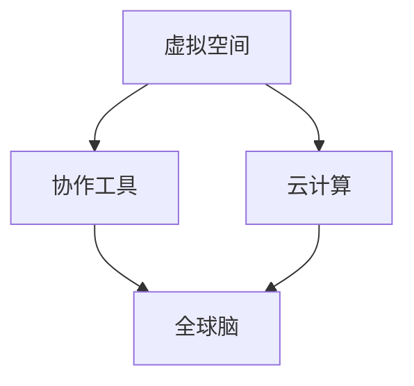

                 

**虚拟办公室设计:全球脑驱动的远程协作空间**

**作者：禅与计算机程序设计艺术 / Zen and the Art of Computer Programming**

## 1. 背景介绍

随着全球化和数字化的发展，远程协作已经成为企业的常态。虚拟办公室（Virtual Office）是一种基于云计算和通信技术的新型办公模式，它打破了时空的限制，为全球协作提供了可能。本文将深入探讨虚拟办公室的设计原理，并提供实践指南和工具推荐。

## 2. 核心概念与联系

### 2.1 核心概念

- **虚拟空间（Virtual Space）**：一个数字化的、可以交互的工作环境。
- **协作工具（Collaboration Tools）**：用于沟通、协作和共享的软件和服务。
- **云计算（Cloud Computing）**：为虚拟办公室提供基础设施和服务的技术。
- **全球脑（Global Brain）**：一个分布式的、智慧的协作网络。

### 2.2 核心概念联系



## 3. 核心算法原理 & 具体操作步骤

### 3.1 算法原理概述

虚拟办公室的核心是协作算法，它管理用户之间的交互和资源共享。常用的协作算法包括版本控制（如Git）、冲突解决算法（如二阶段锁定协议）和实时通信协议（如WebSocket）。

### 3.2 算法步骤详解

以版本控制算法为例：

1. **本地修改**：用户在本地修改文件。
2. **提交**：用户将本地修改提交到本地仓库。
3. **推送**：用户将本地仓库推送到远程仓库。
4. **合并**：其他用户从远程仓库拉取最新版本，并与本地仓库合并。
5. **冲突解决**：如果合并产生冲突，用户需要解决冲突并重新提交。

### 3.3 算法优缺点

- **优点**：版本控制算法允许多个用户同时修改文件，并跟踪文件的变更历史。
- **缺点**：版本控制算法可能会导致冲突，需要用户解决。

### 3.4 算法应用领域

版本控制算法广泛应用于软件开发、文档编辑和设计等领域。冲突解决算法和实时通信协议则广泛应用于实时协作和通信领域。

## 4. 数学模型和公式 & 详细讲解 & 举例说明

### 4.1 数学模型构建

虚拟办公室的数学模型可以表示为一个有向图（Directed Graph），其中节点表示用户，边表示通信连接。

### 4.2 公式推导过程

假设有n个用户，每个用户与其他用户的通信连接概率为p。则通信连接的期望值为：

$$E = n \times (n - 1) \times p$$

### 4.3 案例分析与讲解

例如，一个100人的团队，每个人与其他人通信的概率为0.5。则通信连接的期望值为：

$$E = 100 \times 99 \times 0.5 = 4950$$

## 5. 项目实践：代码实例和详细解释说明

### 5.1 开发环境搭建

本示例使用Node.js和Express.js搭建一个简单的协作平台。

### 5.2 源代码详细实现

```javascript
const express = require('express');
const app = express();
const server = require('http').Server(app);
const io = require('socket.io')(server);

app.use(express.static('public'));

io.on('connection', (socket) => {
  console.log('a user connected');

  socket.on('disconnect', () => {
    console.log('user disconnected');
  });

  socket.on('chat message', (msg) => {
    io.emit('chat message', msg);
  });
});

server.listen(3000, () => {
  console.log('listening on *:3000');
});
```

### 5.3 代码解读与分析

该代码使用Express.js搭建了一个简单的Web服务器，并使用Socket.IO实现了实时通信。

### 5.4 运行结果展示

运行该代码后，用户可以通过Web浏览器访问该服务器，并进行实时聊天。

## 6. 实际应用场景

### 6.1 当前应用

虚拟办公室已经广泛应用于远程工作、在线会议、协同编辑等领域。

### 6.2 未来应用展望

未来，虚拟办公室将更加智能化，它将利用人工智能技术提供个性化的协作建议，并自动化地管理资源和任务。

## 7. 工具和资源推荐

### 7.1 学习资源推荐

- **书籍**："协作软件设计"（"Designing Software for Cooperative Work"）
- **在线课程**：Coursera的"协作技术"课程

### 7.2 开发工具推荐

- **协作平台**：Slack、Microsoft Teams、Google Workspace
- **版本控制**：Git、Mercurial
- **实时通信**：Socket.IO、WebSocket

### 7.3 相关论文推荐

- "协作软件设计的挑战"（"Challenges in the Design of Cooperative Software"）
- "虚拟办公室的未来"（"The Future of Virtual Offices"）

## 8. 总结：未来发展趋势与挑战

### 8.1 研究成果总结

虚拟办公室的设计和实现已经取得了显著的进展，但仍然面临着挑战。

### 8.2 未来发展趋势

未来，虚拟办公室将更加智能化、个性化和无缝化。

### 8.3 面临的挑战

- **安全性**：如何保护用户的隐私和数据安全。
- **可用性**：如何确保虚拟办公室的高可用性和可靠性。
- **用户体验**：如何提供更好的用户体验，提高用户的满意度。

### 8.4 研究展望

未来的研究将聚焦于人工智能在虚拟办公室中的应用，以及如何提供更好的用户体验。

## 9. 附录：常见问题与解答

**Q：虚拟办公室和远程办公有什么区别？**

**A：虚拟办公室是一种基于云计算和通信技术的新型办公模式，它提供了一个数字化的、可以交互的工作环境。远程办公则是指员工在非办公室地点工作，但不一定使用虚拟办公室提供的工具和服务。**

**Q：虚拟办公室的优缺点是什么？**

**A：虚拟办公室的优点包括提高了灵活性和效率，降低了成本，但缺点包括可能会导致孤立感，需要员工自律和自觉。**

**Q：如何设计一个好的虚拟办公室？**

**A：设计一个好的虚拟办公室需要考虑用户体验，安全性，可用性，以及个性化需求。**

**作者：禅与计算机程序设计艺术 / Zen and the Art of Computer Programming**

