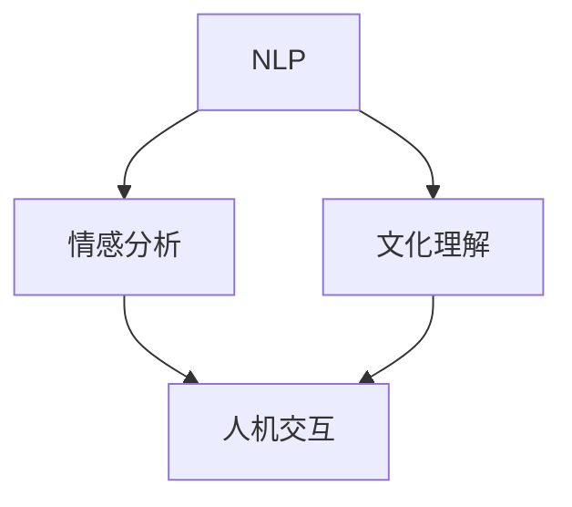

                 

**虚拟外交学院院长：AI时代的跨文化交流培训专家**

> 关键词：人工智能、跨文化交流、虚拟外交、自然语言处理、情感分析、文化理解、人机交互

## 1. 背景介绍

在全球化的今天，跨文化交流已成为一种必需，而人工智能（AI）的发展为跨文化交流提供了新的可能。虚拟外交学院院长的角色就是要培训AI系统，使其能够理解和适应不同的文化，从而实现有效的跨文化交流。本文将介绍虚拟外交学院院长的任务、核心概念、算法原理、数学模型、项目实践，以及未来发展趋势。

## 2. 核心概念与联系

虚拟外交学院院长的核心任务是培训AI系统，使其能够理解和适应不同的文化。这涉及到自然语言处理（NLP）、情感分析、文化理解和人机交互等领域。下图是这些概念的关系：



## 3. 核心算法原理 & 具体操作步骤

### 3.1 算法原理概述

培训AI系统理解和适应文化的核心算法是基于机器学习的跨语言、跨文化情感分析。该算法包括数据预处理、特征提取、模型训练和评估等步骤。

### 3.2 算法步骤详解

1. **数据预处理**：收集跨文化的文本数据，并进行清洗、标记和分词。
2. **特征提取**：使用TF-IDF、Word2Vec或BERT等方法提取文本特征。
3. **模型训练**：使用支持向量机（SVM）、神经网络或 трансformer模型等方法训练情感分析模型。
4. **评估**：使用准确率、精确度、召回率和F1分数等指标评估模型性能。

### 3.3 算法优缺点

**优点**：该算法可以学习和理解跨文化的情感表达，从而提高AI系统的交流能力。

**缺点**：该算法需要大量的跨文化数据，且模型的泛化能力有待提高。

### 3.4 算法应用领域

该算法可以应用于虚拟外交、跨文化翻译、跨文化营销和跨文化客户服务等领域。

## 4. 数学模型和公式 & 详细讲解 & 举例说明

### 4.1 数学模型构建

设文本数据集为$D = {(x_1, y_1), (x_2, y_2),..., (x_n, y_n)}$, 其中$x_i$是文本特征，$y_i$是情感标签。我们的目标是学习一个函数$f: X \rightarrow Y$, 使得$f(x_i) \approx y_i$.

### 4.2 公式推导过程

使用支持向量机（SVM）作为分类器，其目标函数为：

$$\min_{w, b} \frac{1}{2}w^T w + C \sum_{i=1}^{n} \xi_i$$

subject to:

$$y_i(w^T x_i + b) \geq 1 - \xi_i, \xi_i \geq 0, i = 1,..., n$$

其中，$w$是权重向量，$b$是偏置项，$C$是惩罚参数，$\xi_i$是松弛变量。

### 4.3 案例分析与讲解

例如，在跨文化情感分析任务中，我们可以收集来自不同文化的文本数据，并使用SVM模型训练情感分析器。在测试时，我们可以输入一段文本，并预测其情感标签。

## 5. 项目实践：代码实例和详细解释说明

### 5.1 开发环境搭建

我们将使用Python和scikit-learn库实现跨文化情感分析。首先，安装必要的库：

```bash
pip install numpy pandas sklearn nltk
```

### 5.2 源代码详细实现

```python
import numpy as np
import pandas as pd
from sklearn.feature_extraction.text import TfidfVectorizer
from sklearn.svm import SVC
from sklearn.model_selection import train_test_split
from sklearn.metrics import accuracy_score

# Load data
data = pd.read_csv('cultural_data.csv')

# Preprocess data
data['text'] = data['text'].str.lower().str.replace('[^a-zA-Z]','')

# Feature extraction
vectorizer = TfidfVectorizer()
X = vectorizer.fit_transform(data['text'])
y = data['sentiment']

# Split data into training and testing sets
X_train, X_test, y_train, y_test = train_test_split(X, y, test_size=0.2, random_state=42)

# Train SVM model
model = SVC(kernel='linear')
model.fit(X_train, y_train)

# Evaluate model
y_pred = model.predict(X_test)
print("Accuracy:", accuracy_score(y_test, y_pred))
```

### 5.3 代码解读与分析

该代码实现了跨文化情感分析的数据预处理、特征提取、模型训练和评估。它使用TF-IDF向量化方法提取文本特征，并使用线性SVM模型训练情感分析器。

### 5.4 运行结果展示

运行该代码后，您将看到模型的准确率。

## 6. 实际应用场景

### 6.1 当前应用

虚拟外交学院院长的角色目前正在被应用于跨文化客户服务、跨文化营销和跨文化翻译等领域。

### 6.2 未来应用展望

未来，虚拟外交学院院长的角色将会扩展到虚拟外交、跨文化协商和跨文化合作等领域。AI系统将能够理解和适应不同文化的规范和习俗，从而实现更有效的跨文化交流。

## 7. 工具和资源推荐

### 7.1 学习资源推荐

- "Cross-Cultural Communication in the Age of AI" (Book by Richard D. Lewis)
- "Emotion in Cross-Cultural Perspective" (Book by James A. Russell)
- "Natural Language Processing with Python" (Book by Steven Bird, Ewan Klein, and Edward Loper)

### 7.2 开发工具推荐

- Python (Programming Language)
- scikit-learn (Machine Learning Library)
- NLTK (Natural Language Toolkit)
- TensorFlow or PyTorch (Deep Learning Libraries)

### 7.3 相关论文推荐

- "Cross-Cultural Sentiment Analysis: A Survey" (IEEE Access, 2020)
- "A Multilingual Sentiment Analysis Dataset for Cross-Cultural Studies" (arXiv:2003.05056)

## 8. 总结：未来发展趋势与挑战

### 8.1 研究成果总结

本文介绍了虚拟外交学院院长的角色，并提出了基于机器学习的跨语言、跨文化情感分析算法。该算法可以学习和理解跨文化的情感表达，从而提高AI系统的交流能力。

### 8.2 未来发展趋势

未来，虚拟外交学院院长的角色将会扩展到更多领域，AI系统将会更好地理解和适应不同文化的规范和习俗。

### 8.3 面临的挑战

虚拟外交学院院长的角色面临的挑战包括数据稀缺、模型泛化能力有待提高，以及跨文化理解的复杂性。

### 8.4 研究展望

未来的研究将会关注大规模跨文化数据的收集和标记，模型泛化能力的提高，以及跨文化理解的深入研究。

## 9. 附录：常见问题与解答

**Q：虚拟外交学院院长的角色是否会取代人类外交官？**

**A：**虚拟外交学院院长的角色不会取代人类外交官，而是会与其合作，帮助其更好地理解和适应不同文化。

**Q：跨文化情感分析的挑战是什么？**

**A：**跨文化情感分析的挑战包括数据稀缺、模型泛化能力有待提高，以及跨文化理解的复杂性。

**Q：虚拟外交学院院长的角色如何应用于跨文化翻译？**

**A：**虚拟外交学院院长的角色可以应用于跨文化翻译，帮助翻译软件更好地理解和适应不同文化的语言习俗。

---

作者：禅与计算机程序设计艺术 / Zen and the Art of Computer Programming

