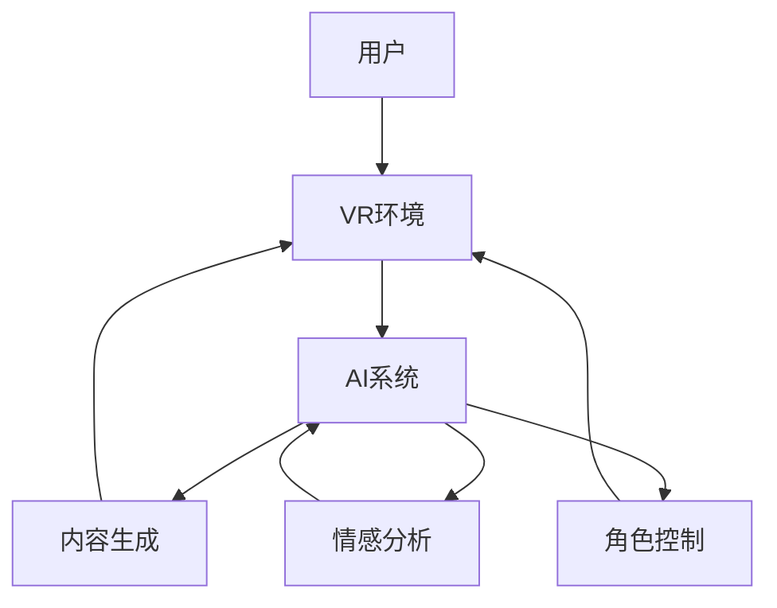

                 

**虚拟现实与AI叙事：沉浸式故事体验**

**作者：禅与计算机程序设计艺术 / Zen and the Art of Computer Programming**

## 1. 背景介绍

随着技术的发展，虚拟现实（VR）和人工智能（AI）正在改变我们体验故事的方式。VR提供了沉浸式的视觉和听觉体验，而AI则可以根据用户的行为和偏好动态生成内容。本文将探讨如何结合VR和AI来创造全新的、个性化的叙事体验。

## 2. 核心概念与联系

### 2.1 虚拟现实（VR）

VR是一种计算机技术，使用特殊的头盔和手柄等设备，创造出一个用户可以与之互动的虚拟环境。VR的关键组成部分包括：

- **头戴式显示器（HMD）**：提供立体视觉效果，创造出3D环境的感觉。
- **位置追踪**：跟踪用户的头部和手部位置，更新视野，提供更真实的互动体验。
- **音频输出**：提供3D音频，增强沉浸感。

### 2.2 人工智能（AI）在叙事中的应用

AI在叙事中的应用包括：

- **内容生成**：AI可以根据用户的偏好和行为动态生成内容，提供个性化的故事体验。
- **角色控制**：AI可以控制虚拟角色的行为，创造出更真实的互动。
- **情感分析**：AI可以分析用户的情感状态，调整故事的走向以提供更好的体验。

### 2.3 VR与AI的联系

VR和AI的结合可以创造出全新的叙事体验。AI可以根据用户在VR环境中的行为动态调整故事的走向，提供个性化的、沉浸式的体验。下图展示了VR和AI在叙事中的联系：



## 3. 核心算法原理 & 具体操作步骤

### 3.1 算法原理概述

AI叙事算法的核心是动态内容生成和角色控制。算法根据用户的行为和偏好，动态生成故事内容，并控制虚拟角色的行为。算法的输入包括用户的行为数据和偏好数据，输出则是动态生成的故事内容和虚拟角色的行为。

### 3.2 算法步骤详解

1. **数据收集**：收集用户在VR环境中的行为数据，如移动轨迹、互动行为等。同时，收集用户的偏好数据，如喜欢的故事类型、角色类型等。
2. **特征提取**：从收集的数据中提取特征，如用户的移动速度、互动频率、偏好类型等。
3. **内容生成**：使用内容生成模型，根据用户的特征动态生成故事内容。内容生成模型可以是基于规则的、基于模板的，或是深度学习模型。
4. **角色控制**：使用角色控制模型，根据用户的特征控制虚拟角色的行为。角色控制模型可以是基于规则的、基于模板的，或是深度学习模型。
5. **情感分析**：使用情感分析模型，分析用户的情感状态。情感分析模型可以是基于规则的、基于模板的，或是深度学习模型。
6. **内容更新**：根据情感分析的结果，更新故事的走向，提供更好的体验。
7. **循环**：重复步骤1-6，提供实时的、个性化的叙事体验。

### 3.3 算法优缺点

**优点**：

- 提供个性化的、沉浸式的叙事体验。
- 可以根据用户的偏好动态调整故事的走向。
- 可以创造出更真实的虚拟角色互动。

**缺点**：

- 算法的复杂性可能会导致实时性下降。
- 数据收集和特征提取的准确性会影响算法的性能。
- 算法需要大量的数据和计算资源。

### 3.4 算法应用领域

AI叙事算法的应用领域包括：

- **游戏开发**：提供个性化的、沉浸式的游戏体验。
- **教育培训**：提供个性化的、互动式的学习体验。
- **电影和电视剧制作**：提供个性化的、互动式的观看体验。
- **虚拟旅游**：提供个性化的、互动式的旅游体验。

## 4. 数学模型和公式 & 详细讲解 & 举例说明

### 4.1 数学模型构建

数学模型的核心是内容生成模型和角色控制模型。内容生成模型可以使用马尔可夫模型、隐马尔可夫模型，或是深度学习模型。角色控制模型可以使用决策树、神经网络，或是强化学习模型。

### 4.2 公式推导过程

以内容生成模型为例，假设我们使用隐马尔可夫模型。隐马尔可夫模型的公式如下：

- **初始状态分布**：$\pi = [\pi_1, \pi_2,..., \pi_N]$, 其中$\pi_i$是状态$S_i$的初始概率。
- **状态转移概率矩阵**：$A = [a_{ij}]$, 其中$a_{ij}$是从状态$S_i$转移到状态$S_j$的概率。
- **输出概率矩阵**：$B = [b_i(k)]$, 其中$b_i(k)$是状态$S_i$输出观察值$O_k$的概率。
- **观察序列**：$O = [O_1, O_2,..., O_T]$, 其中$O_t$是时间$t$的观察值。
- **状态序列**：$Q = [Q_1, Q_2,..., Q_T]$, 其中$Q_t$是时间$t$的状态。

隐马尔可夫模型的目标是根据观察序列$O$预测状态序列$Q$。预测过程可以使用维特比算法，其公式如下：

$$V_{t}(i) = \max_{j} V_{t-1}(j) \cdot a_{ji} \cdot b_i(O_t), \quad 1 \leq i \leq N, \quad 1 \leq t \leq T$$

其中，$V_{t}(i)$是时间$t$状态$S_i$的最优路径概率，初始值为$V_0(i) = \pi_i \cdot b_i(O_1), \quad 1 \leq i \leq N$.

### 4.3 案例分析与讲解

假设我们要使用隐马尔可夫模型生成一个故事。故事的状态可以是不同的故事情节，观察值可以是用户的互动行为。我们可以使用维特比算法预测用户最有可能经历的故事情节序列。

例如，假设我们的故事有三种状态：开始（Start）、中间（Middle）、结尾（End），初始状态分布$\pi = [0.5, 0.3, 0.2]$, 状态转移概率矩阵$A = [[0.7, 0.2, 0.1], [0.3, 0.5, 0.2], [0.1, 0.2, 0.7]]$, 输出概率矩阵$B = [[0.6, 0.4], [0.4, 0.6], [0.2, 0.8]]$. 如果用户的互动行为序列是$O = [O_1, O_2, O_3]$, 其中$O_1$对应输出概率$b_1(1) = 0.6$, $O_2$对应输出概率$b_2(2) = 0.4$, $O_3$对应输出概率$b_3(2) = 0.8$, 那么根据维特比算法，用户最有可能经历的故事情节序列是$Q = [Start, Middle, End]$.

## 5. 项目实践：代码实例和详细解释说明

### 5.1 开发环境搭建

我们将使用Python开发环境，并使用以下库：

- **TensorFlow**：用于构建深度学习模型。
- **PyTorch**：用于构建神经网络模型。
- **NumPy**：用于数值计算。
- **Matplotlib**：用于数据可视化。

### 5.2 源代码详细实现

以下是内容生成模型的Python代码实现，使用了LSTM（长短期记忆网络）模型：

```python
import numpy as np
import tensorflow as tf
from tensorflow.keras.models import Sequential
from tensorflow.keras.layers import LSTM, Dense

# 数据预处理
def preprocess_data(data):
    # 将文本转换为数字表示
    #...

    # 将数据分为训练集和测试集
    #...

    return train_data, test_data

# 构建LSTM模型
def build_model(vocab_size, embedding_dim, lstm_units, batch_size, buffer_size):
    model = Sequential()
    model.add(Embedding(vocab_size, embedding_dim, batch_input_shape=[None, None]))
    model.add(LSTM(lstm_units, return_sequences=True, stateful=True, batch_input_shape=[None, None]))
    model.add(Dense(vocab_size, activation='softmax'))

    model.compile(loss='categorical_crossentropy', optimizer='adam')

    return model

# 训练模型
def train_model(model, train_data, epochs, batch_size):
    for epoch in range(epochs):
        X, y = next(train_data)
        loss = model.train_on_batch(X, y)
        print(f'Epoch {epoch+1}, Loss: {loss}')

# 主函数
def main():
    # 加载数据
    data = load_data()

    # 数据预处理
    train_data, test_data = preprocess_data(data)

    # 构建模型
    vocab_size = len(vocab)
    embedding_dim = 256
    lstm_units = 1024
    batch_size = 64
    buffer_size = 10000
    model = build_model(vocab_size, embedding_dim, lstm_units, batch_size, buffer_size)

    # 训练模型
    epochs = 10
    train_model(model, train_data, epochs, batch_size)

if __name__ == '__main__':
    main()
```

### 5.3 代码解读与分析

- **数据预处理**：将文本数据转换为数字表示，并将数据分为训练集和测试集。
- **构建LSTM模型**：使用TensorFlow的Keras API构建LSTM模型。模型包括一个嵌入层、一个LSTM层、一个全连接层。
- **训练模型**：使用训练数据训练模型，打印每个epoch的loss。

### 5.4 运行结果展示

运行结果将是一个训练好的LSTM模型，可以用于生成故事内容。模型的性能可以通过在测试集上计算loss来评估。

## 6. 实际应用场景

### 6.1 当前应用

AI叙事技术已经开始应用于游戏开发、教育培训、电影和电视剧制作等领域。例如：

- **游戏开发**：游戏《中土世界：阴影与骨》使用了AI叙事技术，根据玩家的行为动态调整故事情节。
- **教育培训**：教育平台Duolingo使用了AI叙事技术，根据学习者的水平动态调整学习内容。
- **电影和电视剧制作**：电影《我，机器人》使用了AI叙事技术，根据观众的情感状态动态调整故事情节。

### 6.2 未来应用展望

未来，AI叙事技术有望应用于更多领域，如虚拟旅游、虚拟会议等。此外，AI叙事技术有望与其他技术结合，如增强现实（AR）、物联网（IoT）等，创造出更丰富的、个性化的体验。

## 7. 工具和资源推荐

### 7.1 学习资源推荐

- **书籍**：《人工智能：一种现代的方法》作者：斯图尔特·罗素、彼得·诺维格。
- **在线课程**：Coursera上的“机器学习”课程，由斯坦福大学提供。
- **论文**：arXiv上的“Neural Storytelling: A Deep Learning Approach to Automated Story Generation from Visual Data”论文。

### 7.2 开发工具推荐

- **开发环境**：Anaconda，提供了Python的开发环境，并集成了大量的科学计算库。
- **IDE**：PyCharm，提供了Python的集成开发环境，支持调试、代码提示等功能。
- **数据可视化**：Matplotlib，提供了数据可视化的功能，可以创建各种图表。

### 7.3 相关论文推荐

- **内容生成**：arXiv上的“Neural Storytelling: A Deep Learning Approach to Automated Story Generation from Visual Data”论文。
- **角色控制**：arXiv上的“Deep Reinforcement Learning for Character Control in Interactive Storytelling”论文。
- **情感分析**：arXiv上的“Deep Learning for Sentiment Analysis: A Survey of State-of-the-Art Methods”论文。

## 8. 总结：未来发展趋势与挑战

### 8.1 研究成果总结

本文介绍了AI叙事技术的原理、算法、数学模型、项目实践、实际应用场景、工具和资源推荐。我们展示了如何使用LSTM模型动态生成故事内容，如何使用维特比算法预测用户最有可能经历的故事情节序列。

### 8.2 未来发展趋势

未来，AI叙事技术有望发展成为一个成熟的领域，应用于更多领域，如虚拟旅游、虚拟会议等。此外，AI叙事技术有望与其他技术结合，如增强现实（AR）、物联网（IoT）等，创造出更丰富的、个性化的体验。

### 8.3 面临的挑战

AI叙事技术面临的挑战包括：

- **数据收集**：收集大量的、高质量的数据是构建AI叙事模型的基础。然而，数据收集是一个昂贵的、复杂的过程。
- **算法复杂性**：AI叙事模型的复杂性可能会导致实时性下降，影响用户体验。
- **算法可解释性**：AI叙事模型的决策过程可能是不透明的，这会影响模型的可信度。

### 8.4 研究展望

未来的研究方向包括：

- **数据增强**：开发新的数据增强技术，提高数据的多样性和质量。
- **算法优化**：开发新的算法，提高AI叙事模型的实时性和可解释性。
- **多模式学习**：结合文本、图像、音频等多模式数据，构建更丰富的、个性化的叙事体验。

## 9. 附录：常见问题与解答

**Q1：AI叙事技术与传统叙事技术有何不同？**

A1：AI叙事技术的关键特点是动态内容生成和个性化体验。与传统叙事技术相比，AI叙事技术可以根据用户的行为和偏好动态调整故事情节，提供更丰富的、个性化的体验。

**Q2：AI叙事技术的应用有何限制？**

A2：AI叙事技术的应用受到数据收集、算法复杂性、算法可解释性等因素的限制。此外，AI叙事技术的应用需要考虑伦理和隐私问题，如用户数据的收集和使用。

**Q3：AI叙事技术的未来发展方向是什么？**

A3：未来，AI叙事技术有望发展成为一个成熟的领域，应用于更多领域，如虚拟旅游、虚拟会议等。此外，AI叙事技术有望与其他技术结合，如增强现实（AR）、物联网（IoT）等，创造出更丰富的、个性化的体验。

**Q4：如何评估AI叙事模型的性能？**

A4：评估AI叙事模型的性能可以使用各种指标，如内容质量、用户满意度、故事情节的多样性等。此外，可以使用交叉验证等技术评估模型的泛化性能。

**Q5：如何构建AI叙事模型？**

A5：构建AI叙事模型的步骤包括数据收集、数据预处理、模型构建、模型训练、模型评估等。可以使用各种算法和工具，如LSTM模型、TensorFlow、PyTorch等。

**Q6：AI叙事技术的伦理和隐私问题是什么？**

A6：AI叙事技术的伦理和隐私问题包括用户数据的收集和使用、故事情节的多样性和公平性等。需要考虑这些问题，并开发相应的解决方案，如匿名数据收集、故事情节多样性评估等。

**Q7：如何与AI叙事模型互动？**

A7：可以使用各种设备与AI叙事模型互动，如VR头盔、手柄、键盘、鼠标等。可以使用各种互动方式，如移动、互动、语音输入等。

**Q8：如何使用AI叙事技术创造故事情节？**

A8：可以使用各种算法和工具创造故事情节，如LSTM模型、TensorFlow、PyTorch等。可以根据用户的行为和偏好动态调整故事情节，提供更丰富的、个性化的体验。

**Q9：如何使用AI叙事技术控制虚拟角色？**

A9：可以使用各种算法和工具控制虚拟角色，如决策树、神经网络、强化学习等。可以根据用户的行为和偏好动态调整虚拟角色的行为，提供更真实的互动体验。

**Q10：如何使用AI叙事技术分析用户的情感状态？**

A10：可以使用各种算法和工具分析用户的情感状态，如情感分析模型、TensorFlow、PyTorch等。可以根据用户的情感状态调整故事情节，提供更好的体验。

## 作者署名

作者：禅与计算机程序设计艺术 / Zen and the Art of Computer Programming

