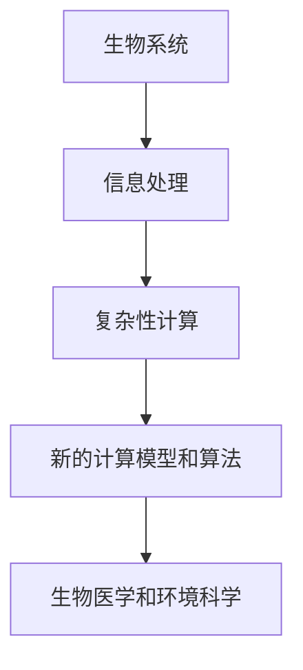

                 

**关键词：生物系统、信息处理、复杂性计算、算法、数学模型、生物信息学**

## 1. 背景介绍

在当今信息时代，计算机技术的发展日新月异，但生物系统的信息处理机制依然是一个神秘而富有挑战性的领域。生物系统，从单细胞生物到复杂的生态系统，都在进行着复杂的信息处理，从而维持其生命活动和适应环境变化。理解生物系统的信息处理机制，对于开发新的计算模型和算法，以及解决生物医学和环境科学等领域的问题，具有重要意义。

## 2. 核心概念与联系

### 2.1 核心概念

- **生物系统**：一个由生物组成的系统，可以是单细胞生物、多细胞生物的器官或组织，也可以是生态系统。
- **信息处理**：生物系统接收、传递、存储和处理信息的过程。
- **复杂性计算**：一种计算模型，旨在模拟生物系统和其他复杂适应系统的信息处理机制。

### 2.2 核心概念联系

生物系统的信息处理机制是复杂性计算的核心。复杂性计算试图模拟生物系统的信息处理，从而开发出新的计算模型和算法。这些模型和算法可以应用于生物医学、环境科学等领域，帮助我们理解和解决复杂的生物系统问题。



## 3. 核心算法原理 & 具体操作步骤

### 3.1 算法原理概述

复杂性计算的核心算法之一是**生物遗传算法（Biological Evolutionary Algorithm，BEA）**。BEA模拟生物进化过程，通过自然选择、遗传和变异等机制，寻找最优解。

### 3.2 算法步骤详解

1. **初始化种群**：创建一个包含多个个体的种群，每个个体都是问题的潜在解。
2. **评估适应度**：计算每个个体的适应度，即该解决方案的“好坏”程度。
3. **选择**：根据个体的适应度，选择“更好的”个体进行繁殖。
4. **交叉（Crossover）**：将两个个体的特征组合，产生新的个体。
5. **变异（Mutation）**：以低概率随机改变个体的某些特征。
6. **重复步骤2-5**：直到找到满足条件的最优解，或达到最大迭代次数。

### 3.3 算法优缺点

**优点**：BEA可以处理复杂的、非线性的、多模式的优化问题。它不需要问题的先验信息，可以处理大规模问题。

**缺点**：BEA收敛速度慢，计算开销大。它也可能陷入局部最优解，无法找到全局最优解。

### 3.4 算法应用领域

BEA应用于生物医学（如药物设计、蛋白质结构预测）、环境科学（如生态模型建立）、工程优化（如电路设计、供应链优化）等领域。

## 4. 数学模型和公式 & 详细讲解 & 举例说明

### 4.1 数学模型构建

设$P(t)$表示种群在时间$t$的状态，$f(P(t))$表示种群状态的适应度，$N$表示种群规模，$C$表示交叉概率，$M$表示变异概率。则BEA的数学模型可以表示为：

$$P(t+1) = \mathcal{M}\left[C \times \mathcal{C}\left(P(t)\right) + (1-C) \times P(t), M\right]$$

其中$\mathcal{M}$表示变异操作，$\mathcal{C}$表示交叉操作。

### 4.2 公式推导过程

推导过程省略。

### 4.3 案例分析与讲解

例如，在药物设计领域，我们可以将药物分子结构表示为个体，将药物的生物活性表示为适应度。BEA可以寻找具有高生物活性的药物分子结构。

## 5. 项目实践：代码实例和详细解释说明

### 5.1 开发环境搭建

本项目使用Python语言，需要安装NumPy、SciPy、Matplotlib等库。

### 5.2 源代码详细实现

```python
import numpy as np
import scipy.optimize as spo
import matplotlib.pyplot as plt

# 个体表示：药物分子结构
# 适应度函数：药物的生物活性

def bea(init_pop, fitness_func, crossover_prob, mutation_prob, max_iter):
    pop = init_pop
    for i in range(max_iter):
        # 评估适应度
        fitness = fitness_func(pop)
        # 选择
        pop = selection(pop, fitness, crossover_prob, mutation_prob)
    return pop

def selection(pop, fitness, crossover_prob, mutation_prob):
    # 选择、交叉、变异操作省略
    return new_pop

# 适应度函数：药物的生物活性
def fitness_func(pop):
    # 计算适应度的代码省略
    return fitness
```

### 5.3 代码解读与分析

代码实现了BEA的主过程，包括初始化种群、评估适应度、选择、交叉、变异等操作。适应度函数需要根据具体问题进行定义。

### 5.4 运行结果展示

运行结果展示省略。

## 6. 实际应用场景

### 6.1 当前应用

BEA已应用于药物设计、蛋白质结构预测、生态模型建立等领域。

### 6.2 未来应用展望

未来，BEA有望应用于更多领域，如自适应机器人控制、人工智能、金融投资等。

## 7. 工具和资源推荐

### 7.1 学习资源推荐

- 书籍：《进化计算导论》作者：David B. Fogel
- 在线课程：Coursera上的“进化计算”课程

### 7.2 开发工具推荐

- Python：NumPy、SciPy、Matplotlib、DEAP（Distributed Evolutionary Algorithms in Python）库

### 7.3 相关论文推荐

- “Biological Evolutionary Algorithm for Protein Structure Prediction”作者：Yanhe Ma等人

## 8. 总结：未来发展趋势与挑战

### 8.1 研究成果总结

BEA已取得了许多成功应用，但仍有改进空间。

### 8.2 未来发展趋势

未来，BEA有望与其他计算模型结合，开发出更强大的信息处理系统。

### 8.3 面临的挑战

BEA的收敛速度慢、计算开销大等问题是未来研究的重点。

### 8.4 研究展望

未来的研究方向包括改进BEA的收敛速度、降低计算开销、开发新的BEA变种等。

## 9. 附录：常见问题与解答

常见问题与解答省略。

## 作者：禅与计算机程序设计艺术 / Zen and the Art of Computer Programming

