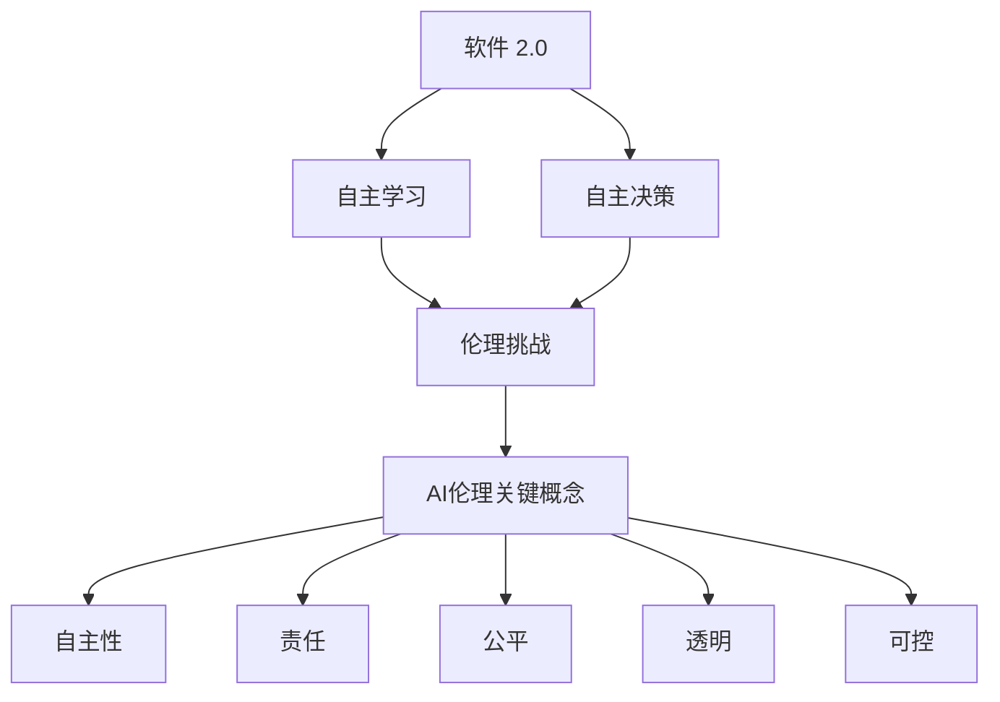

                 

**软件 2.0 的伦理规范：人工智能的责任**

**作者：禅与计算机程序设计艺术 / Zen and the Art of Computer Programming**

## 1. 背景介绍

随着人工智能（AI）的迅速发展，它已经渗透到我们的日常生活中，从搜索引擎到自动驾驶汽车，再到医疗诊断。然而，AI的发展也带来了伦理挑战，我们需要思考并回答一些关键问题：AI应该如何对待人类？它应该遵循什么样的道德准则？谁应该对AI的行为负责？

本文旨在探讨软件 2.0（指具有自主学习和决策能力的软件）的伦理规范，重点关注人工智能的责任。我们将从核心概念开始，然后深入探讨算法原理、数学模型，并提供项目实践和实际应用场景。最后，我们将总结未来发展趋势和挑战，并提供工具和资源推荐。

## 2. 核心概念与联系

### 2.1 AI伦理的关键概念

- **自主性（Autonomy）**：AI系统能够在没有人类干预的情况下做出决策和行动。
- **责任（Responsibility）**：AI系统的行为后果应该由谁来承担？
- **公平（Fairness）**：AI系统应该公平地对待所有个体，避免偏见和歧视。
- **透明（Transparency）**：AI系统的决策过程应该是可理解和可解释的。
- **可控（Controllability）**：人类应该能够控制和监督AI系统的行为。

### 2.2 AI伦理与软件 2.0 的联系

软件 2.0 具有自主学习和决策能力，这使得它面临着与AI相同的伦理挑战。我们需要确保软件 2.0 遵循上述关键概念，以保护人类的利益和尊严。



## 3. 核心算法原理 & 具体操作步骤

### 3.1 算法原理概述

软件 2.0 通常基于机器学习算法，如决策树、神经网络等。这些算法可以从数据中学习模式，并用于预测或决策。然而，这些算法也可能导致偏见和不公平，因此需要进行调整和监督。

### 3.2 算法步骤详解

1. **数据收集**：收集与问题相关的数据。
2. **数据预处理**：清洗和转换数据，以便于机器学习算法使用。
3. **模型选择**：选择适合问题的机器学习算法。
4. **模型训练**：使用训练数据调整模型参数，以最小化预测误差。
5. **模型评估**：使用测试数据评估模型性能。
6. **部署**：将模型部署到生产环境中，用于预测或决策。
7. **监督和调整**：监控模型行为，并根据需要调整模型参数。

### 3.3 算法优缺点

**优点**：自主学习和决策能力，可以从数据中学习复杂模式。

**缺点**：可能导致偏见和不公平，决策过程可能不透明。

### 3.4 算法应用领域

软件 2.0 可以应用于各种领域，从自动驾驶汽车到医疗诊断，再到金融风险评估。然而，伦理考虑在每个领域都至关重要。

## 4. 数学模型和公式 & 详细讲解 & 举例说明

### 4.1 数学模型构建

机器学习算法通常基于统计模型构建。例如，线性回归模型假设输入特征与输出目标之间存在线性关系。

### 4.2 公式推导过程

给定输入特征矩阵 $X$ 和输出目标向量 $y$，线性回归模型的目标是找到权重向量 $w$ 使得 $Xw$ 尽可能接近 $y$. 这可以通过最小化误差平方和来实现：

$$J(w) = \frac{1}{2} ||Xw - y||^2$$

### 4.3 案例分析与讲解

例如，在预测房价的问题中，$X$ 可以是房屋的面积、卧室数量等特征，$y$ 是房屋的价格。通过最小化 $J(w)$，我们可以找到权重向量 $w$ 使得 $Xw$ 尽可能接近 $y$，从而预测房屋的价格。

## 5. 项目实践：代码实例和详细解释说明

### 5.1 开发环境搭建

我们将使用 Python 和 Scikit-learn 库来实现线性回归模型。您需要安装 Python 和 Scikit-learn，并导入必要的库：

```python
import numpy as np
from sklearn.linear_model import LinearRegression
```

### 5.2 源代码详细实现

```python
# 假设我们有以下数据
X = np.array([[1], [2], [3], [4], [5]])
y = np.array([2, 4, 6, 8, 10])

# 创建线性回归模型
model = LinearRegression()

# 训练模型
model.fit(X, y)

# 预测新数据
X_new = np.array([[6], [7], [8]])
y_new = model.predict(X_new)
```

### 5.3 代码解读与分析

我们首先导入必要的库，然后定义输入特征矩阵 $X$ 和输出目标向量 $y$. 我们创建一个线性回归模型，并使用 `fit()` 方法训练模型。最后，我们使用 `predict()` 方法预测新数据的目标值。

### 5.4 运行结果展示

运行上述代码后，`y_new` 将包含新数据的预测目标值。例如，如果 $X\_new = [[6], [7], [8]]$，则 `y_new` 将是 `[12, 14, 16]`.

## 6. 实际应用场景

### 6.1 伦理挑战

在实际应用中，软件 2.0 面临着伦理挑战。例如，自动驾驶汽车必须在生命和财产之间做出决策，而金融风险评估系统可能会导致歧视。

### 6.2 伦理解决方案

解决这些挑战需要多方合作，包括政府、企业和学术界。一些解决方案包括：

- **伦理审查**：在部署软件 2.0 之前，对其进行伦理审查。
- **可解释性**：开发可解释的模型，以便人类可以理解其决策过程。
- **多样性**：确保开发团队和数据集具有多样性，以减少偏见和歧视。

### 6.3 未来应用展望

未来，软件 2.0 将继续渗透到各个领域，从医疗保健到城市基础设施。然而，伦理考虑将变得越来越重要，我们需要确保软件 2.0 遵循伦理规范，以保护人类的利益和尊严。

## 7. 工具和资源推荐

### 7.1 学习资源推荐

- **书籍**："Artificial Intelligence: A Modern Approach" by Stuart Russell and Peter Norvig
- **在线课程**：Coursera 的 "Machine Learning" 课程

### 7.2 开发工具推荐

- **编程语言**：Python
- **机器学习库**：Scikit-learn, TensorFlow, PyTorch

### 7.3 相关论文推荐

- "Ethical Implications of Autonomous Systems: A Survey" by B. M. Christian and J. D. Baier
- "Fairness Definitions and Their Politics" by S. Barocas, A. Kleinberg, and M. Raghavan

## 8. 总结：未来发展趋势与挑战

### 8.1 研究成果总结

本文探讨了软件 2.0 的伦理规范，重点关注人工智能的责任。我们从核心概念开始，然后深入探讨算法原理、数学模型，并提供项目实践和实际应用场景。

### 8.2 未来发展趋势

未来，软件 2.0 将继续发展，并渗透到更多领域。然而，伦理考虑将变得越来越重要，我们需要开发新的算法和工具来确保软件 2.0 遵循伦理规范。

### 8.3 面临的挑战

软件 2.0 面临的挑战包括偏见和歧视、决策过程的不透明性，以及确定责任的困难。

### 8.4 研究展望

未来的研究应该关注开发新的算法和工具，以确保软件 2.0 遵循伦理规范。此外，需要进行更多的跨学科合作，以便从不同角度审视这些挑战。

## 9. 附录：常见问题与解答

**Q：软件 2.0 与传统软件有何不同？**

**A**：软件 2.0 具有自主学习和决策能力，而传统软件需要人类明确指定所有决策。

**Q：谁应该对软件 2.0 的行为负责？**

**A**：这取决于具体情况。在某些情况下，开发人员或所有者可能需要承担责任，而在其他情况下，软件 2.0 本身可能需要承担部分或全部责任。

**Q：如何确保软件 2.0 的决策过程是透明的？**

**A**：开发可解释的模型，并记录决策过程可以帮助提高透明度。

**Q：软件 2.0 可能导致偏见和歧视吗？**

**A**：是的，如果开发团队或数据集具有偏见，软件 2.0 可能会导致偏见和歧视。需要采取措施来减少这些风险。

**作者：禅与计算机程序设计艺术 / Zen and the Art of Computer Programming**

