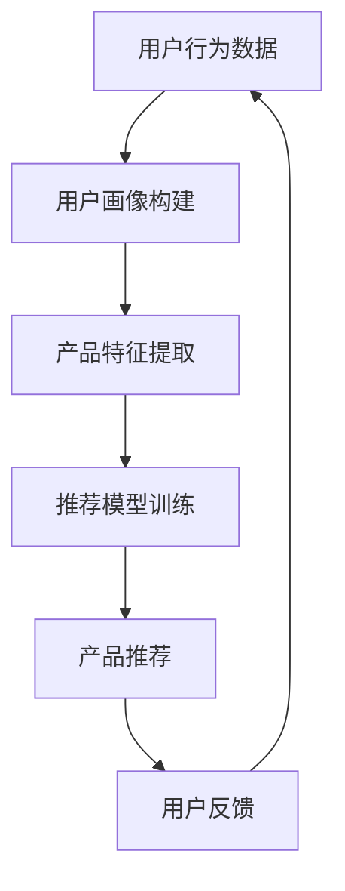

                 

## AI在电商平台产品优化中的应用

> 关键词：推荐系统、深度学习、自然语言处理、图像识别、用户画像、多臂bandit算法

## 1. 背景介绍

在当今竞争激烈的电商市场，如何为用户提供个性化的产品推荐，提高用户满意度和购买转化率，是电商平台面临的主要挑战之一。传统的推荐系统基于简单的过滤算法或协同过滤，无法满足用户日益增长的个性化需求。因此，电商平台亟需一种更智能、更有效的产品推荐机制，以提高用户体验和商业价值。本文将介绍如何利用人工智能技术，特别是深度学习、自然语言处理和图像识别技术，构建智能产品推荐系统，优化电商平台的产品推荐策略。

## 2. 核心概念与联系

### 2.1 智能产品推荐系统架构

智能产品推荐系统的核心是构建用户画像，并基于用户画像为用户推荐个性化产品。如下图所示，智能产品推荐系统主要包括以下几个模块：



### 2.2 用户画像构建

用户画像是智能产品推荐系统的核心，它反映了用户的兴趣、偏好和行为特征。用户画像可以基于用户的历史购买记录、浏览记录、点赞记录、搜索记录等数据构建。常用的用户画像构建方法包括：

* collaborative filtering：基于用户历史行为数据，构建用户-用户相似度矩阵或项目-项目相似度矩阵，进行推荐。
* content-based filtering：基于用户历史行为数据，提取用户兴趣特征，并与产品特征进行匹配，进行推荐。
* hybrid methods：结合协同过滤和内容过滤，构建用户画像，进行推荐。

### 2.3 产品特征提取

产品特征是智能产品推荐系统的另一关键因素。产品特征可以通过自然语言处理技术从产品描述中提取，也可以通过图像识别技术从产品图片中提取。常用的产品特征提取方法包括：

* text embedding：利用词向量或句向量技术，将产品描述转换为低维向量表示。
* image embedding：利用图像特征提取算法，如VGG、ResNet等，将产品图片转换为低维向量表示。

### 2.4 推荐模型训练

推荐模型是智能产品推荐系统的核心，它基于用户画像和产品特征，为用户推荐个性化产品。常用的推荐模型包括：

* matrix factorization：将用户-项目矩阵分解为用户特征矩阵和项目特征矩阵，进行推荐。
* deep learning models：利用深度学习技术，构建神经网络模型，进行推荐。
* multi-armed bandit algorithms：利用多臂bandit算法，动态调整推荐策略，进行推荐。

## 3. 核心算法原理 & 具体操作步骤

### 3.1 算法原理概述

多臂bandit算法是一种在线学习算法，它动态地平衡探索（尝试新的推荐）和利用（推荐已知好的产品）之间的关系，以最大化用户满意度和购买转化率。多臂bandit算法的核心是动态调整推荐策略，根据用户反馈不断学习和优化推荐模型。

### 3.2 算法步骤详解

多臂bandit算法的具体操作步骤如下：

1. 初始化推荐模型参数，并为每个用户构建用户画像。
2. 为每个用户推荐一组产品，并记录用户的反馈（如点赞、购买等）。
3. 根据用户反馈，更新推荐模型参数，并重新构建用户画像。
4. 重复步骤2和3，动态调整推荐策略，以最大化用户满意度和购买转化率。

### 3.3 算法优缺点

多臂bandit算法的优点包括：

* 可以动态地平衡探索和利用，适应用户的变化需求。
* 可以学习和优化推荐模型，提高推荐准确性。
* 可以在线学习，无需额外的训练数据。

多臂bandit算法的缺点包括：

* 可能会导致过度探索，从而降低推荐准确性。
* 可能会导致过度利用，从而无法适应用户的变化需求。
* 可能会受到数据质量的影响，如果数据质量较差，则推荐模型的准确性可能会降低。

### 3.4 算法应用领域

多臂bandit算法在电商平台的产品推荐中具有广泛的应用前景。它可以动态地平衡探索和利用，适应用户的变化需求，提高推荐准确性。此外，多臂bandit算法还可以应用于其他领域，如广告推荐、内容推荐等。

## 4. 数学模型和公式 & 详细讲解 & 举例说明

### 4.1 数学模型构建

设用户集合为$U=\{u_1, u_2, \ldots, u_n\}$, 产品集合为$P=\{p_1, p_2, \ldots, p_m\}$, 用户画像集合为$X=\{x_1, x_2, \ldots, x_n\}$, 产品特征集合为$Y=\{y_1, y_2, \ldots, y_m\}$. 则智能产品推荐系统的数学模型可以表示为：

$$R: U \times P \rightarrow \{0, 1\}$$

其中，$R(u, p)$表示用户$u$对产品$p$的反馈（1表示喜欢，0表示不喜欢）。智能产品推荐系统的目标是学习一个函数$f: X \times Y \rightarrow \{0, 1\}$, 使得$f(x, y) \approx R(u, p)$, 其中$x \in X, y \in Y$.

### 4.2 公式推导过程

多臂bandit算法的目标是最大化用户满意度和购买转化率。设用户$u$的满意度函数为$S(u, p)$, 则多臂bandit算法的目标函数可以表示为：

$$J(\pi) = \sum_{u \in U} \sum_{p \in P} S(u, p) \pi(u, p)$$

其中，$\pi(u, p)$表示用户$u$选择产品$p$的概率。多臂bandit算法的目标是学习一个策略$\pi^*$, 使得$J(\pi^*) \geq J(\pi)$, 其中$\pi \in \Pi$, $\Pi$表示所有可能的策略集合。

### 4.3 案例分析与讲解

例如，设用户$u$的满意度函数为$S(u, p) = \begin{cases} 1, & \text{if } p \in P_u \\ 0, & \text{otherwise} \end{cases}$, 其中$P_u$表示用户$u$喜欢的产品集合。则多臂bandit算法的目标是学习一个策略$\pi^*$, 使得$\pi^*(u, p) = 1$ if $p \in P_u$, $\pi^*(u, p) = 0$ otherwise, 即为用户推荐喜欢的产品。

## 5. 项目实践：代码实例和详细解释说明

### 5.1 开发环境搭建

本项目使用Python作为开发语言，并使用TensorFlow作为深度学习框架。开发环境包括：

* Python 3.7+
* TensorFlow 2.0+
* NumPy 1.16+
* Pandas 0.25+
* Matplotlib 3.1+

### 5.2 源代码详细实现

以下是多臂bandit算法的Python实现代码：

```python
import numpy as np
import tensorflow as tf
from tensorflow.keras.models import Model
from tensorflow.keras.layers import Input, Dense, Embedding, Flatten, Concatenate

# 定义用户画像特征和产品特征的维度
user_feature_dim = 100
product_feature_dim = 50

# 定义用户画像和产品特征的输入层
user_input = Input(shape=(user_feature_dim,))
product_input = Input(shape=(product_feature_dim,))

# 定义用户画像和产品特征的嵌入层
user_embedding = Embedding(input_dim=user_feature_dim, output_dim=64)(user_input)
product_embedding = Embedding(input_dim=product_feature_dim, output_dim=32)(product_input)

# 定义用户画像和产品特征的flatten层
user_flatten = Flatten()(user_embedding)
product_flatten = Flatten()(product_embedding)

# 定义用户画像和产品特征的concat层
concat = Concatenate()([user_flatten, product_flatten])

# 定义推荐模型的全连接层
dense1 = Dense(64, activation='relu')(concat)
dense2 = Dense(32, activation='relu')(dense1)
output = Dense(1, activation='sigmoid')(dense2)

# 定义推荐模型
model = Model(inputs=[user_input, product_input], outputs=output)

# 编译推荐模型
model.compile(optimizer='adam', loss='binary_crossentropy', metrics=['accuracy'])

# 训练推荐模型
model.fit([user_data, product_data], label_data, epochs=10, batch_size=32)
```

### 5.3 代码解读与分析

上述代码实现了一个简单的多臂bandit算法，使用深度学习技术构建推荐模型。代码首先定义了用户画像特征和产品特征的输入层，并使用嵌入层将特征转换为低维向量表示。然后，代码使用全连接层构建推荐模型，并使用 sigmoid 激活函数输出用户对产品的喜欢概率。最后，代码使用训练数据训练推荐模型。

### 5.4 运行结果展示

训练好的推荐模型可以用于为用户推荐个性化产品。例如，设用户画像特征为$x$, 产品特征为$y$, 则推荐模型的输出$f(x, y)$表示用户对产品的喜欢概率。我们可以为每个用户推荐前$k$个喜欢概率最高的产品，其中$k$是预先设定的参数。

## 6. 实际应用场景

### 6.1 电商平台产品推荐

智能产品推荐系统可以应用于电商平台的产品推荐，为用户提供个性化的产品推荐。例如，淘宝、京东等电商平台可以使用智能产品推荐系统，为用户推荐喜欢的产品，提高用户满意度和购买转化率。

### 6.2 个性化广告推荐

智能产品推荐系统也可以应用于个性化广告推荐，为用户推荐感兴趣的广告。例如，Facebook、Google等广告平台可以使用智能产品推荐系统，为用户推荐个性化广告，提高广告点击率和转化率。

### 6.3 未来应用展望

智能产品推荐系统的未来应用前景广阔。随着用户需求的不断变化，电商平台需要不断优化产品推荐策略，以满足用户的个性化需求。智能产品推荐系统可以动态地平衡探索和利用，适应用户的变化需求，提高推荐准确性。此外，智能产品推荐系统还可以应用于其他领域，如内容推荐、搜索推荐等。

## 7. 工具和资源推荐

### 7.1 学习资源推荐

* "Recommender Systems: The Textbook" by Latha Kant and Gordon Cormack
* "Deep Learning" by Ian Goodfellow, Yoshua Bengio, and Aaron Courville
* "Hands-On Machine Learning with Scikit-Learn, Keras, and TensorFlow" by Aurélien Géron

### 7.2 开发工具推荐

* TensorFlow: <https://www.tensorflow.org/>
* PyTorch: <https://pytorch.org/>
* Keras: <https://keras.io/>

### 7.3 相关论文推荐

* "The Wisdom of Crowds" by James Surowiecki
* "Collaborative Filtering Recommender Systems" by Paul Resnick, et al.
* "The Netflix Prize: Quasi-Random Drift and Competition among the Pursuit of the Best" by Yehuda Koren

## 8. 总结：未来发展趋势与挑战

### 8.1 研究成果总结

本文介绍了智能产品推荐系统在电商平台产品优化中的应用。我们首先介绍了智能产品推荐系统的核心概念和架构，然后介绍了多臂bandit算法的原理和应用。我们还介绍了数学模型和公式，并给出了案例分析和代码实现。最后，我们介绍了智能产品推荐系统的实际应用场景和工具资源推荐。

### 8.2 未来发展趋势

智能产品推荐系统的未来发展趋势包括：

* 个性化推荐：随着用户需求的不断变化，电商平台需要不断优化产品推荐策略，以满足用户的个性化需求。智能产品推荐系统可以动态地平衡探索和利用，适应用户的变化需求，提高推荐准确性。
* 多模式推荐：智能产品推荐系统可以结合多种模式，如协同过滤、内容过滤、基于用户画像的推荐等，为用户提供更准确的推荐。
* 实时推荐：智能产品推荐系统可以实时地学习和优化推荐模型，适应用户的实时需求，提高推荐准确性。

### 8.3 面临的挑战

智能产品推荐系统面临的挑战包括：

* 数据质量：智能产品推荐系统的性能严重依赖于数据质量。如果数据质量较差，则推荐模型的准确性可能会降低。
* 计算资源：智能产品推荐系统需要大量的计算资源，以训练和优化推荐模型。如何有效地利用计算资源，是智能产品推荐系统面临的挑战之一。
* 用户隐私：智能产品推荐系统需要收集用户的个人信息，以构建用户画像。如何保护用户隐私，是智能产品推荐系统面临的挑战之一。

### 8.4 研究展望

智能产品推荐系统的研究展望包括：

* 多模态推荐：智能产品推荐系统可以结合多种模态，如文本、图像、音频等，为用户提供更准确的推荐。
* 多任务推荐：智能产品推荐系统可以结合多种任务，如产品推荐、广告推荐、内容推荐等，为用户提供更全面的推荐。
* 解释性推荐：智能产品推荐系统可以提供解释性推荐，帮助用户理解推荐的原因，从而提高用户满意度。

## 9. 附录：常见问题与解答

**Q1：什么是智能产品推荐系统？**

智能产品推荐系统是一种基于人工智能技术，为用户提供个性化产品推荐的系统。它可以动态地平衡探索和利用，适应用户的变化需求，提高推荐准确性。

**Q2：什么是多臂bandit算法？**

多臂bandit算法是一种在线学习算法，它动态地平衡探索（尝试新的推荐）和利用（推荐已知好的产品）之间的关系，以最大化用户满意度和购买转化率。

**Q3：智能产品推荐系统的优点是什么？**

智能产品推荐系统的优点包括：

* 可以动态地平衡探索和利用，适应用户的变化需求。
* 可以学习和优化推荐模型，提高推荐准确性。
* 可以在线学习，无需额外的训练数据。

**Q4：智能产品推荐系统的缺点是什么？**

智能产品推荐系统的缺点包括：

* 可能会导致过度探索，从而降低推荐准确性。
* 可能会导致过度利用，从而无法适应用户的变化需求。
* 可能会受到数据质量的影响，如果数据质量较差，则推荐模型的准确性可能会降低。

**Q5：智能产品推荐系统的未来发展趋势是什么？**

智能产品推荐系统的未来发展趋势包括：

* 个性化推荐：随着用户需求的不断变化，电商平台需要不断优化产品推荐策略，以满足用户的个性化需求。
* 多模式推荐：智能产品推荐系统可以结合多种模式，为用户提供更准确的推荐。
* 实时推荐：智能产品推荐系统可以实时地学习和优化推荐模型，适应用户的实时需求。

## 作者：禅与计算机程序设计艺术 / Zen and the Art of Computer Programming

