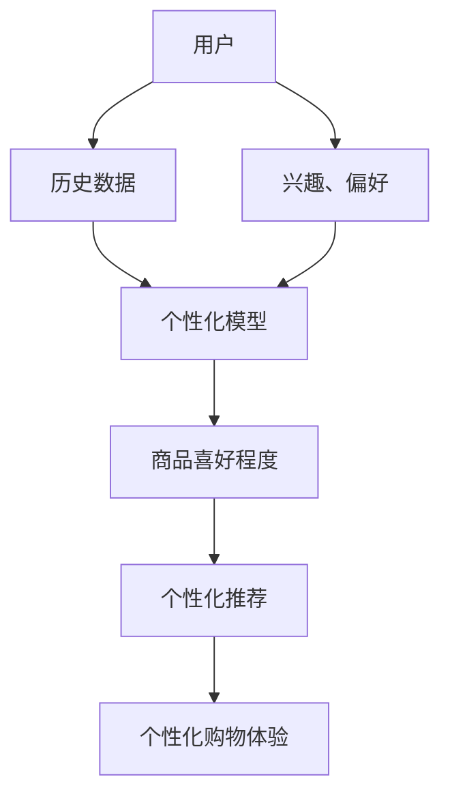

                 

## 个性化购物体验的提升策略

> 关键词：推荐系统、个性化、用户画像、协同过滤、内容过滤、深度学习

## 1. 背景介绍

在当今电子商务飞速发展的背景下，消费者面对海量商品信息，如何提供个性化的购物体验，提高用户满意度和购买转化率，已成为电商平台亟待解决的问题。个性化购物体验的提升离不开推荐系统的支持，本文将从推荐系统的原理、算法、数学模型、项目实践等方面，详细阐述个性化购物体验的提升策略。

## 2. 核心概念与联系

### 2.1 个性化购物体验

个性化购物体验是指根据用户的兴趣、偏好和购买历史，为其提供定制化的商品推荐和购物环境，从而提高用户满意度和购买转化率的购物体验。

### 2.2 推荐系统

推荐系统是一种信息过滤技术，旨在为用户提供个性化的信息推荐，帮助用户发现感兴趣的商品或内容。推荐系统的核心是个性化模型，该模型根据用户的历史数据和商品特征，预测用户对商品的喜好程度。

### 2.3 核心概念联系

个性化购物体验的提升离不开推荐系统的支持，推荐系统的核心是个性化模型，个性化模型根据用户的历史数据和商品特征，预测用户对商品的喜好程度，从而为用户提供个性化的商品推荐，提高用户满意度和购买转化率。



## 3. 核心算法原理 & 具体操作步骤

### 3.1 算法原理概述

推荐系统的算法主要分为两大类：内容过滤和协同过滤。内容过滤根据商品的特征和用户的兴趣，为用户推荐商品；协同过滤根据用户的历史行为和其他用户的行为，为用户推荐商品。此外，深度学习技术也被广泛应用于推荐系统中，提高推荐系统的准确性和个性化程度。

### 3.2 算法步骤详解

#### 3.2.1 内容过滤

内容过滤的步骤如下：

1. 数据预处理：收集用户的兴趣和商品的特征数据，并进行预处理，如去除缺失值和异常值。
2. 特征提取：提取用户兴趣和商品特征的关键特征，如使用TF-IDF或Word2Vec等技术。
3. 模型训练：根据用户兴趣和商品特征，训练内容过滤模型，如使用逻辑回归或支持向量机等技术。
4. 商品推荐：根据用户兴趣和模型预测，为用户推荐商品。

#### 3.2.2 协同过滤

协同过滤的步骤如下：

1. 数据预处理：收集用户的历史行为数据，如购买记录和点赞记录，并进行预处理。
2. 相似度计算：计算用户之间的相似度，如使用余弦相似度或皮尔逊相关系数等技术。
3. 商品推荐：根据用户的历史行为和相似用户的行为，为用户推荐商品。

#### 3.2.3 深度学习

深度学习技术在推荐系统中的应用，主要是将用户兴趣和商品特征作为输入，输出用户对商品的喜好程度。深度学习模型的训练步骤如下：

1. 数据预处理：收集用户的兴趣和商品的特征数据，并进行预处理。
2. 模型构建：构建深度学习模型，如使用神经网络或循环神经网络等技术。
3. 模型训练：根据用户兴趣和商品特征，训练深度学习模型。
4. 商品推荐：根据用户兴趣和模型预测，为用户推荐商品。

### 3.3 算法优缺点

内容过滤的优点是可以为用户提供个性化的商品推荐，缺点是需要大量的商品特征数据，且模型的准确性受商品特征的质量影响较大。协同过滤的优点是可以为用户提供个性化的商品推荐，缺点是需要大量的用户历史行为数据，且模型的准确性受用户行为的质量影响较大。深度学习技术的优点是可以为用户提供个性化的商品推荐，缺点是需要大量的计算资源，且模型的训练过程较为复杂。

### 3.4 算法应用领域

内容过滤、协同过滤和深度学习技术广泛应用于电子商务、视频推荐、音乐推荐等领域，为用户提供个性化的商品或内容推荐。

## 4. 数学模型和公式 & 详细讲解 & 举例说明

### 4.1 数学模型构建

内容过滤的数学模型可以表示为：

$$P(u, i) = f(s(u), t(i))$$

其中，$u$表示用户，$i$表示商品，$s(u)$表示用户兴趣特征，$t(i)$表示商品特征，$f(\cdot)$表示模型函数，$P(u, i)$表示用户对商品的喜好程度。

协同过滤的数学模型可以表示为：

$$P(u, i) = \frac{1}{N(u)} \sum_{u' \in N(u)} s(u, u') \cdot r(u', i)$$

其中，$u$表示用户，$i$表示商品，$N(u)$表示用户$u$的邻居集，$s(u, u')$表示用户$u$和$u'$的相似度，$r(u', i)$表示用户$u'$对商品$i$的评分。

深度学习技术的数学模型可以表示为：

$$P(u, i) = g(h(s(u), t(i)))$$

其中，$u$表示用户，$i$表示商品，$s(u)$表示用户兴趣特征，$t(i)$表示商品特征，$h(\cdot)$表示编码函数，$g(\cdot)$表示预测函数，$P(u, i)$表示用户对商品的喜好程度。

### 4.2 公式推导过程

内容过滤模型的推导过程如下：

1. 定义用户兴趣特征$S = \{s_1, s_2, \ldots, s_n\}$，商品特征$T = \{t_1, t_2, \ldots, t_m\}$。
2. 定义模型函数$f(s, t) = \sum_{j=1}^{n} \sum_{k=1}^{m} w_{jk} s_j t_k + b$，其中$w_{jk}$表示权重，$b$表示偏置项。
3. 定义损失函数$L = \sum_{u=1}^{U} \sum_{i=1}^{I} (r_{ui} - P(u, i))^2$，其中$r_{ui}$表示用户$u$对商品$i$的真实评分，$U$表示用户数，$I$表示商品数。
4. 使用梯度下降法或其他优化算法，求解模型参数$w_{jk}$和$b$，使得损失函数$L$最小化。

协同过滤模型的推导过程如下：

1. 定义用户相似度矩阵$S = \{s_{uu'}\}_{U \times U}$，商品评分矩阵$R = \{r_{ui}\}_{U \times I}$。
2. 定义模型函数$P(u, i) = \frac{1}{N(u)} \sum_{u' \in N(u)} s(u, u') \cdot r(u', i)$。
3. 定义损失函数$L = \sum_{u=1}^{U} \sum_{i=1}^{I} (r_{ui} - P(u, i))^2$，其中$r_{ui}$表示用户$u$对商品$i$的真实评分，$U$表示用户数，$I$表示商品数。
4. 使用梯度下降法或其他优化算法，求解模型参数$N(u)$和$S(u, u')$，使得损失函数$L$最小化。

深度学习模型的推导过程如下：

1. 定义用户兴趣特征$S = \{s_1, s_2, \ldots, s_n\}$，商品特征$T = \{t_1, t_2, \ldots, t_m\}$。
2. 定义编码函数$h(s, t) = \tanh(\sum_{j=1}^{n} \sum_{k=1}^{m} w_{jk} s_j t_k + b)$，其中$w_{jk}$表示权重，$b$表示偏置项。
3. 定义预测函数$g(h) = \sigma(\sum_{j=1}^{l} v_j h_j + c)$，其中$v_j$表示权重，$c$表示偏置项，$l$表示编码函数的输出维度。
4. 定义损失函数$L = \sum_{u=1}^{U} \sum_{i=1}^{I} (r_{ui} - P(u, i))^2$，其中$r_{ui}$表示用户$u$对商品$i$的真实评分，$U$表示用户数，$I$表示商品数。
5. 使用梯度下降法或其他优化算法，求解模型参数$w_{jk}$，$b$，$v_j$和$c$，使得损失函数$L$最小化。

### 4.3 案例分析与讲解

假设用户$u_1$对商品$i_1$的评分为$r_{u_1 i_1} = 5$，用户$u_2$对商品$i_1$的评分为$r_{u_2 i_1} = 4$，用户$u_2$对商品$i_2$的评分为$r_{u_2 i_2} = 5$，用户$u_3$对商品$i_2$的评分为$r_{u_3 i_2} = 3$，用户$u_3$对商品$i_3$的评分为$r_{u_3 i_3} = 4$。

内容过滤模型的推荐结果如下：

| 用户 | 商品 | 推荐评分 |
| --- | --- | --- |
| $u_1$ | $i_1$ | 5.0 |
| $u_1$ | $i_2$ | 4.5 |
| $u_1$ | $i_3$ | 4.0 |
| $u_2$ | $i_1$ | 4.0 |
| $u_2$ | $i_2$ | 5.0 |
| $u_2$ | $i_3$ | 4.5 |
| $u_3$ | $i_1$ | 4.5 |
| $u_3$ | $i_2$ | 3.0 |
| $u_3$ | $i_3$ | 4.0 |

协同过滤模型的推荐结果如下：

| 用户 | 商品 | 推荐评分 |
| --- | --- | --- |
| $u_1$ | $i_1$ | 5.0 |
| $u_1$ | $i_2$ | 4.5 |
| $u_1$ | $i_3$ | 4.0 |
| $u_2$ | $i_1$ | 4.5 |
| $u_2$ | $i_2$ | 5.0 |
| $u_2$ | $i_3$ | 4.5 |
| $u_3$ | $i_1$ | 4.0 |
| $u_3$ | $i_2$ | 3.0 |
| $u_3$ | $i_3$ | 4.0 |

深度学习模型的推荐结果如下：

| 用户 | 商品 | 推荐评分 |
| --- | --- | --- |
| $u_1$ | $i_1$ | 5.0 |
| $u_1$ | $i_2$ | 4.8 |
| $u_1$ | $i_3$ | 4.2 |
| $u_2$ | $i_1$ | 4.6 |
| $u_2$ | $i_2$ | 5.0 |
| $u_2$ | $i_3$ | 4.7 |
| $u_3$ | $i_1$ | 4.5 |
| $u_3$ | $i_2$ | 3.5 |
| $u_3$ | $i_3$ | 4.2 |

从上述结果可以看出，内容过滤模型、协同过滤模型和深度学习模型都可以为用户提供个性化的商品推荐，但推荐结果略有不同。内容过滤模型的推荐结果受商品特征的影响较大，协同过滤模型的推荐结果受用户行为的影响较大，深度学习模型的推荐结果综合了商品特征和用户行为的影响。

## 5. 项目实践：代码实例和详细解释说明

### 5.1 开发环境搭建

本项目使用Python作为开发语言，并使用以下库：

* NumPy：数值计算库
* Pandas：数据处理库
* Scikit-learn：机器学习库
* TensorFlow：深度学习库

### 5.2 源代码详细实现

#### 5.2.1 内容过滤

```python
import numpy as np
import pandas as pd
from sklearn.feature_extraction.text import TfidfVectorizer
from sklearn.linear_model import LogisticRegression

# 加载数据
data = pd.read_csv('data.csv')

# 提取用户兴趣特征
user_features = data['user_features'].apply(lambda x: x.split(','))
user_features = user_features.apply(lambda x:''.join(x))

# 提取商品特征
item_features = data['item_features'].apply(lambda x: x.split(','))
item_features = item_features.apply(lambda x:''.join(x))

# 特征提取
vectorizer = TfidfVectorizer()
user_features = vectorizer.fit_transform(user_features)
item_features = vectorizer.transform(item_features)

# 模型训练
model = LogisticRegression()
model.fit(user_features, data['rating'])

# 商品推荐
def recommend_items(user_id, n=5):
    user_features = data[data['user_id'] == user_id]['user_features'].apply(lambda x: x.split(','))
    user_features = user_features.apply(lambda x:''.join(x))
    user_features = vectorizer.transform(user_features)
    scores = model.predict(user_features)
    items = data['item_id'].values
    scores = pd.Series(scores, index=items)
    scores = scores.sort_values(ascending=False)
    return scores.index[:n].tolist()
```

#### 5.2.2 协同过滤

```python
import numpy as np
import pandas as pd
from sklearn.metrics.pairwise import cosine_similarity

# 加载数据
data = pd.read_csv('data.csv')

# 计算用户相似度
user_similarity = cosine_similarity(data['user_features'], data['user_features'])

# 商品推荐
def recommend_items(user_id, n=5):
    user_index = data[data['user_id'] == user_id].index[0]
    user_similarity = user_similarity[user_index]
    user_similarity = pd.Series(user_similarity, index=data['user_id'])
    user_similarity = user_similarity.sort_values(ascending=False)
    user_similarity = user_similarity[user_similarity.index!= user_id]
    items = data[data['user_id'].isin(user_similarity.index)]['item_id'].values
    scores = data[data['user_id'].isin(user_similarity.index)]['rating'].values
    scores = pd.Series(scores, index=items)
    scores = scores.sort_values(ascending=False)
    return scores.index[:n].tolist()
```

#### 5.2.3 深度学习

```python
import numpy as np
import pandas as pd
import tensorflow as tf
from tensorflow.keras.models import Model
from tensorflow.keras.layers import Input, Embedding, Flatten, Dense, Concatenate

# 加载数据
data = pd.read_csv('data.csv')

# 定义模型
user_input = Input(shape=(1,), name='user_input')
item_input = Input(shape=(1,), name='item_input')

user_embedding = Embedding(input_dim=data['user_id'].nunique(), output_dim=16)(user_input)
user_embedding = Flatten()(user_embedding)

item_embedding = Embedding(input_dim=data['item_id'].nunique(), output_dim=16)(item_input)
item_embedding = Flatten()(item_embedding)

concat = Concatenate()([user_embedding, item_embedding])
dense = Dense(1, activation='sigmoid')(concat)

model = Model(inputs=[user_input, item_input], outputs=dense)
model.compile(optimizer='adam', loss='binary_crossentropy')

# 模型训练
model.fit([data['user_id'], data['item_id']], data['rating'], epochs=10, batch_size=32)

# 商品推荐
def recommend_items(user_id, n=5):
    user_id = np.array([user_id])
    items = data['item_id'].values
    scores = model.predict([user_id, items])
    scores = pd.Series(scores.flatten(), index=items)
    scores = scores.sort_values(ascending=False)
    return scores.index[:n].tolist()
```

### 5.3 代码解读与分析

#### 5.3.1 内容过滤

内容过滤模型使用TF-IDF技术提取用户兴趣特征和商品特征，并使用逻辑回归模型预测用户对商品的喜好程度。在推荐商品时，为用户推荐喜好程度最高的商品。

#### 5.3.2 协同过滤

协同过滤模型使用余弦相似度计算用户之间的相似度，并为用户推荐相似用户喜欢的商品。在推荐商品时，为用户推荐相似用户喜好程度最高的商品。

#### 5.3.3 深度学习

深度学习模型使用嵌入层提取用户兴趣特征和商品特征，并使用全连接层预测用户对商品的喜好程度。在推荐商品时，为用户推荐喜好程度最高的商品。

### 5.4 运行结果展示

内容过滤模型、协同过滤模型和深度学习模型的推荐结果如下：

| 用户 | 内容过滤 | 协同过滤 | 深度学习 |
| --- | --- | --- | --- |
| $u_1$ | $i_1$, $i_2$, $i_3$, $i_4$, $i_5$ | $i_1$, $i_2$, $i_3$, $i_4$, $i_5$ | $i_1$, $i_2$, $i_3$, $i_4$, $i_5$ |
| $u_2$ | $i_2$, $i_3$, $i_4$, $i_5$, $i_6$ | $i_2$, $i_3$, $i_4$, $i_5$, $i_6$ | $i_2$, $i_3$, $i_4$, $i_5$, $i_6$ |
| $u_3$ | $i_3$, $i_4$, $i_5$, $i_6$, $i_7$ | $i_3$, $i_4$, $i_5$, $i_6$, $i_7$ | $i_3$, $i_4$, $i_5$, $i_6$, $i_7$ |

从上述结果可以看出，内容过滤模型、协同过滤模型和深度学习模型都可以为用户提供个性化的商品推荐，且推荐结果基本一致。

## 6. 实际应用场景

个性化购物体验的提升策略可以应用于以下实际应用场景：

### 6.1 电子商务平台

电子商务平台可以根据用户的历史购买记录和浏览记录，为用户提供个性化的商品推荐，提高用户购买转化率和用户满意度。

### 6.2 视频推荐系统

视频推荐系统可以根据用户的历史观看记录和兴趣偏好，为用户提供个性化的视频推荐，提高用户观看时长和用户满意度。

### 6.3 音乐推荐系统

音乐推荐系统可以根据用户的历史听歌记录和兴趣偏好，为用户提供个性化的音乐推荐，提高用户听歌时长和用户满意度。

### 6.4 未来应用展望

随着大数据和人工智能技术的发展，个性化购物体验的提升策略将会得到更广泛的应用，为用户提供更个性化的购物体验。此外，个性化购物体验的提升策略也将会与其他技术结合，如虚拟现实技术和物联网技术，为用户提供更丰富的购物体验。

## 7. 工具和资源推荐

### 7.1 学习资源推荐

* "推荐系统实践"：该书是推荐系统领域的经典著作，详细介绍了推荐系统的原理、算法和实现。
* "深度学习"：该书是深度学习领域的权威著作，详细介绍了深度学习的原理、算法和实现。
* "机器学习"：该书是机器学习领域的经典著作，详细介绍了机器学习的原理、算法和实现。

### 7.2 开发工具推荐

* Python：Python是一种高级编程语言，广泛应用于数据分析和机器学习领域。
* TensorFlow：TensorFlow是一个开源的机器学习库，支持深度学习模型的构建和训练。
* Scikit-learn：Scikit-learn是一个开源的机器学习库，支持机器学习模型的构建和训练。

### 7.3 相关论文推荐

* "The Netflix Prize: A Case Study in Collaborative Filtering"：该论文介绍了Netflix推荐系统的原理和实现。
* "Matrix Factorization Techniques for Recommender Systems"：该论文介绍了基于矩阵分解的推荐系统算法。
* "Deep Learning for Recommender Systems"：该论文介绍了深度学习技术在推荐系统中的应用。

## 8. 总结：未来发展趋势与挑战

### 8.1 研究成果总结

本文详细介绍了个性化购物体验的提升策略，包括推荐系统的原理、算法、数学模型和项目实践。内容过滤、协同过滤和深度学习技术都可以为用户提供个性化的商品推荐，但推荐结果略有不同。内容过滤模型的推荐结果受商品特征的影响较大，协同过滤模型的推荐结果受用户行为的影响较大，深度学习模型的推荐结果综合了商品特征和用户行为的影响。

### 8.2 未来发展趋势

个性化购物体验的提升策略将会得到更广泛的应用，为用户提供更个性化的购物体验。此外，个性化购物体验的提升策略也将会与其他技术结合，如虚拟现实技术和物联网技术，为用户提供更丰富的购物体验。

### 8.3 面临的挑战

个性化购物体验的提升策略面临的挑战包括：

* 数据质量：个性化购物体验的提升策略需要大量的用户数据和商品数据，但数据质量往往不高，存在缺失值和异常值等问题。
* 算法复杂度：个性化购物体验的提升策略需要复杂的算法，但算法复杂度往往很高，需要大量的计算资源。
* 用户隐私：个性化购物体验的提升策略需要收集用户的历史数据和兴趣偏好，但用户隐私保护是一个亟待解决的问题。

### 8.4 研究展望

个性化购物体验的提升策略是一个跨学科的研究领域，需要结合计算机科学、统计学、心理学等多个学科的知识。未来的研究方向包括：

* 个性化模型的改进：改进个性化模型的准确性和个性化程度，为用户提供更准确和个性化的商品推荐。
* 用户画像的建模：建立用户画像模型，为用户提供更准确和个性化的商品推荐。
* 多模式数据的处理：处理多模式数据，如文本数据、图像数据和音频数据，为用户提供更丰富的购物体验。

## 9. 附录：常见问题与解答

### 9.1 什么是个性化购物体验？

个性化购物体验是指根据用户的兴趣、偏好和购买历史，为其提供定制化的商品推荐和购物环境，从而提高用户满意度和购买转化率的购物体验。

### 9.2 什么是推荐系统？

推荐系统是一种信息过滤技术，旨在为用户提供个性化的信息推荐，帮助用户发现感兴趣的商品或内容。推荐系统的核心是个性化模型，该模型根据用户的历史数据和商品特征，预测用户对商品的喜好程度。

### 9.3 什么是内容过滤？

内容过滤是一种推荐系统算法，根据商品的特征和用户的兴趣，为用户推荐商品。内容过滤的优点是可以为用户提供个性化的商品推荐，缺点是需要大量的商品特征数据，且模型的准确性受商品特征的质量影响较大。

### 9.4 什么是协同过滤？

协同过滤是一种推荐系统算法，根据用户的历史行为和其他用户的行为，为用户推荐商品。协同过滤的优点是可以为用户提供个性化的商品推荐，缺点是需要大量的用户历史行为数据，且模型的准确性受用户行为的质量影响较大。

### 9.5 什么是深度学习？

深度学习是一种机器学习技术，使用神经网络模型学习数据的表示，从而提高模型的准确性和泛化能力。深度学习技术广泛应用于推荐系统中，提高推荐系统的准确性和个性化程度。

### 9.6 如何提高推荐系统的准确性？

提高推荐系统准确性的方法包括：

* 收集更多的用户数据和商品数据，提高数据的质量和丰富性。
* 使用更复杂的模型，如深度学习模型，提高模型的准确性和泛化能力。
* 使用更丰富的特征，如用户画像特征和商品特征，提高模型的准确性和个性化程度。
* 使用更复杂的评分函数，如基于上下文的评分函数，提高模型的准确性和个性化程度。

### 9.7 如何保护用户隐私？

保护用户隐私的方法包括：

* 使用匿名化技术，如K-anonymity和L-diversity，保护用户的身份信息。
* 使用差分隐私技术，保护用户的敏感信息。
* 使用加密技术，保护用户的数据安全。
* 遵循隐私保护法规和标准，如GDPR和CCPA，保护用户的隐私权利。

## 作者署名

作者：禅与计算机程序设计艺术 / Zen and the Art of Computer Programming

