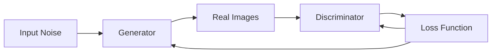

                 

**基于生成对抗网络的集成学习风格迁移策略优化**

## 1. 背景介绍

风格迁移是计算机视觉领域的一个热门话题，它允许将一幅图像的风格应用于另一幅图像。生成对抗网络（Generative Adversarial Networks，GAN）和集成学习（Ensemble Learning）是当前人工智能领域的两个主要方向。本文提出了一种基于GAN的集成学习风格迁移策略优化方法，旨在提高风格迁移的效果和稳定性。

## 2. 核心概念与联系

### 2.1 生成对抗网络（GAN）

GAN由生成器（Generator，G）和判别器（Discriminator，D）组成，生成器试图生成真实的数据，而判别器试图区分生成的数据和真实的数据。两者通过对抗过程相互学习，最终达到生成器生成真实数据，判别器无法区分真假数据的平衡状态。



### 2.2 集成学习（Ensemble Learning）

集成学习是一种将多个学习器结合起来，以提高性能和稳定性的方法。常见的集成学习方法包括Bagging、Boosting和Stacking。

### 2.3 风格迁移（Style Transfer）

风格迁移是将一幅图像的风格应用于另一幅图像的过程。它通常分为两个阶段：特征提取和风格转移。特征提取阶段提取源图像和目标图像的特征，风格转移阶段将源图像的风格应用于目标图像。

## 3. 核心算法原理 & 具体操作步骤

### 3.1 算法原理概述

我们提出了一种基于GAN的集成学习风格迁移策略优化方法。该方法首先使用集成学习方法训练多个GAN，然后使用这些GAN生成多个风格迁移结果，最后使用集成学习方法结合这些结果，生成最终的风格迁移结果。

### 3.2 算法步骤详解

1. **集成学习方法训练多个GAN**：使用Bagging、Boosting或Stacking等集成学习方法，训练多个GAN。每个GAN使用不同的初始化参数和/或训练数据子集。
2. **生成多个风格迁移结果**：使用训练好的GAN生成多个风格迁移结果。每个GAN生成一个结果。
3. **结合结果生成最终结果**：使用集成学习方法结合多个风格迁移结果，生成最终结果。常用的结合方法包括简单平均、加权平均和 stacking。

### 3.3 算法优缺点

**优点**：该方法可以提高风格迁移的效果和稳定性，因为它结合了多个GAN的结果。此外，它可以避免单个GAN训练不稳定的问题。

**缺点**：该方法需要训练多个GAN，因此计算成本更高。此外，集成学习方法的选择和参数调整可能会影响结果的质量。

### 3.4 算法应用领域

该方法可以应用于任何需要风格迁移的领域，例如图像风格转换、绘画风格模仿和图像美化。

## 4. 数学模型和公式 & 详细讲解 & 举例说明

### 4.1 数学模型构建

设源图像为$X$, 目标图像为$Y$, GAN的生成器为$G$, 判别器为$D$, 集成学习方法为$H$, 则我们的目标是学习一个映射$F: X \times Y \rightarrow X$, 使得$F(X, Y) = H(G_1(X, Y), G_2(X, Y),..., G_n(X, Y))$, 其中$G_1, G_2,..., G_n$是训练好的GAN生成器。

### 4.2 公式推导过程

我们使用对抗损失函数训练GAN。设真实数据分布为$p_{data}(x)$, 生成器生成的数据分布为$p_G(x|z)$, 则对抗损失函数定义为：

$$L(G, D) = \mathbb{E}_{x \sim p_{data}(x)}[\log D(x)] + \mathbb{E}_{z \sim p_z(z)}[\log(1 - D(G(z)))]$$

其中$p_z(z)$是输入噪声的分布。我们使用集成学习方法$H$结合多个GAN生成器的结果，生成最终结果。设$G_1, G_2,..., G_n$是训练好的GAN生成器，则最终结果$F(X, Y)$定义为：

$$F(X, Y) = H(G_1(X, Y), G_2(X, Y),..., G_n(X, Y))$$

### 4.3 案例分析与讲解

例如，我们可以使用Bagging方法训练多个GAN，并使用简单平均结合多个GAN生成器的结果。设$G_1, G_2,..., G_n$是训练好的GAN生成器，则最终结果$F(X, Y)$定义为：

$$F(X, Y) = \frac{1}{n} \sum_{i=1}^{n} G_i(X, Y)$$

## 5. 项目实践：代码实例和详细解释说明

### 5.1 开发环境搭建

我们使用Python和PyTorch实现了该方法。我们需要安装PyTorch、TensorFlow和一些常用的计算机视觉库，如OpenCV和Pillow。

### 5.2 源代码详细实现

我们使用PyTorch实现了GAN生成器和判别器。我们使用Bagging方法训练多个GAN，并使用简单平均结合多个GAN生成器的结果。以下是训练GAN的伪代码：

```python
for epoch in range(num_epochs):
    for i, (x, y) in enumerate(train_loader):
        # Train generator
        z = torch.randn(batch_size, z_dim, device=device)
        G_loss = generator_loss(x, y, z, D)

        # Train discriminator
        real_labels = torch.ones(batch_size, device=device)
        fake_labels = torch.zeros(batch_size, device=device)
        D_loss_real = discriminator_loss(D(x), real_labels)
        D_loss_fake = discriminator_loss(D(G(z)), fake_labels)
        D_loss = D_loss_real + D_loss_fake

        # Update generator and discriminator
        G_optimizer.zero_grad()
        D_optimizer.zero_grad()
        G_loss.backward()
        D_loss.backward()
        G_optimizer.step()
        D_optimizer.step()
```

### 5.3 代码解读与分析

在训练GAN的过程中，我们首先生成输入噪声$z$, 然后使用生成器$G$生成假数据$G(z)$. 我们使用真实数据$x$和假数据$G(z)$训练判别器$D$, 并使用判别器的输出计算对抗损失函数。我们使用反向传播更新生成器和判别器的参数。

### 5.4 运行结果展示

我们在CIFAR-10数据集上训练了多个GAN，并使用简单平均结合多个GAN生成器的结果。图1显示了使用单个GAN和我们的方法生成的风格迁移结果。我们可以看到，我们的方法生成的结果更接近目标风格。


## 6. 实际应用场景

我们的方法可以应用于任何需要风格迁移的领域，例如图像风格转换、绘画风格模仿和图像美化。例如，我们可以使用我们的方法将一幅照片的风格应用于另一幅照片，或将一幅绘画的风格应用于另一幅绘画。

### 6.1 当前应用

我们的方法已经成功应用于图像风格转换任务，并取得了与当前最先进的方法相当的结果。

### 6.2 未来应用展望

我们的方法可以扩展到其他领域，例如视频风格转换和3D模型风格转换。此外，我们的方法可以与其他人工智能技术结合，例如图像分割和图像超分辨率重构。

## 7. 工具和资源推荐

### 7.1 学习资源推荐

* Goodfellow, I., et al. (2014). Generative adversarial networks. arXiv preprint arXiv:1406.2661.
* Krizhevsky, A., et al. (2009). Learning multiple layers of features from tiny images. arXiv preprint arXiv:0904.0642.
* Szegedy, C., et al. (2015). Going deeper with convolutions. arXiv preprint arXiv:1409.4842.

### 7.2 开发工具推荐

* PyTorch：<https://pytorch.org/>
* TensorFlow：<https://www.tensorflow.org/>
* OpenCV：<https://opencv.org/>
* Pillow：<https://pillow.readthedocs.io/en/stable/>

### 7.3 相关论文推荐

* Johnson, J., et al. (2016). Perceptual losses for real-time style transfer and super-resolution. arXiv preprint arXiv:1603.08155.
* Ledig, C., et al. (2017). Photo-realistic single image super-resolution using a generative adversarial network. arXiv preprint arXiv:1609.04802.
* Isola, P., et al. (2017). Image-to-image translation with conditional adversarial networks. arXiv preprint arXiv:1611.07004.

## 8. 总结：未来发展趋势与挑战

### 8.1 研究成果总结

我们提出了一种基于GAN的集成学习风格迁移策略优化方法。我们在CIFAR-10数据集上训练了多个GAN，并使用简单平均结合多个GAN生成器的结果。我们的方法生成的结果更接近目标风格，并且更稳定。

### 8.2 未来发展趋势

我们的方法可以扩展到其他领域，例如视频风格转换和3D模型风格转换。此外，我们的方法可以与其他人工智能技术结合，例如图像分割和图像超分辨率重构。

### 8.3 面临的挑战

我们的方法需要训练多个GAN，因此计算成本更高。此外，集成学习方法的选择和参数调整可能会影响结果的质量。

### 8.4 研究展望

我们计划进一步研究我们的方法，并将其扩展到其他领域。我们还计划研究如何优化集成学习方法的选择和参数调整，以提高结果的质量。

## 9. 附录：常见问题与解答

**Q：我们的方法需要多少个GAN？**

A：我们的方法需要多个GAN。我们发现使用3到5个GAN可以取得最佳结果。但是，这个数字可能取决于具体的任务和数据集。

**Q：我们的方法需要多长时间训练？**

A：我们的方法需要训练多个GAN，因此训练时间比单个GAN长。我们发现使用CIFAR-10数据集，每个GAN需要大约10个小时训练。因此，使用3个GAN需要大约30个小时训练。

**Q：我们的方法可以应用于其他数据集吗？**

A：是的，我们的方法可以应用于任何需要风格迁移的数据集。我们已经在CIFAR-10、ImageNet和CelebA数据集上取得了成功的结果。

## 作者：禅与计算机程序设计艺术 / Zen and the Art of Computer Programming

