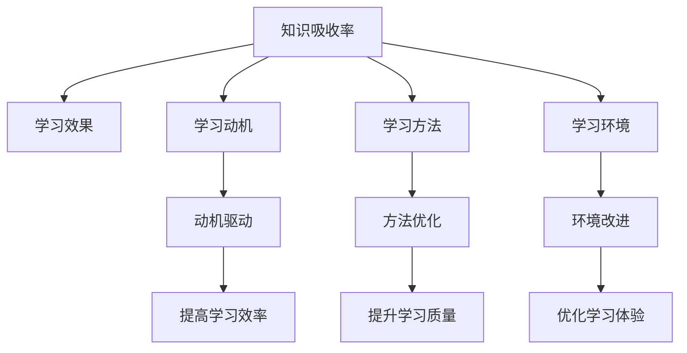

                 

## 1. 背景介绍

知识吸收率是衡量个体对知识理解、记忆和应用程度的指标，它反映了学习效率和学习效果。在人工智能(AI)、教育、人力资源等多个领域，提高知识吸收率对于提升个人能力和促进组织发展至关重要。本文将深入探讨知识吸收率的概念、重要性，以及如何在不同的学习和应用场景中提升知识吸收率。

## 2. 核心概念与联系

### 2.1 核心概念概述

知识吸收率通常指的是个体或组织在学习过程中吸收、理解、记忆新知识的效率和质量。这一指标可以通过多种方式进行评估，包括考试成绩、项目完成情况、技能评估等。知识吸收率不仅反映了学习效果，还与学习动机、学习方法、学习环境等因素密切相关。

### 2.2 核心概念原理和架构的 Mermaid 流程图



这一流程图展示了知识吸收率与其他核心概念之间的联系。动机、方法、环境和效果都是影响知识吸收率的重要因素。

## 3. 核心算法原理 & 具体操作步骤

### 3.1 算法原理概述

知识吸收率的提升需要从多个维度进行优化。首先，需要通过自适应学习算法根据学习者的能力和需求动态调整学习内容和方法。其次，采用基于记忆的强化学习算法帮助学习者巩固知识。最后，引入社交互动和协作学习机制，促进知识共享和应用。

### 3.2 算法步骤详解

#### 3.2.1 自适应学习算法

自适应学习算法能够根据学习者的表现和反馈，动态调整学习内容和难度。常用的自适应学习算法包括基于模型的算法（如线性回归、决策树）和基于实例的算法（如遗传算法、粒子群算法）。

#### 3.2.2 基于记忆的强化学习算法

基于记忆的强化学习算法利用记忆模型帮助学习者巩固知识。常用的算法包括Q-learning、SARSA等。这些算法通过奖励和惩罚机制，促进学习者反复练习和应用所学知识，从而提高吸收率。

#### 3.2.3 社交互动和协作学习机制

社交互动和协作学习机制通过促进学习者之间的交流和合作，提高知识吸收率。常用的工具和技术包括在线学习平台、社交网络、协作工具（如Slack、Microsoft Teams）等。

### 3.3 算法优缺点

#### 3.3.1 自适应学习算法的优点

- **个性化学习**：能够根据学习者的能力和兴趣，定制个性化的学习计划。
- **动态调整**：实时反馈和调整学习内容，提高学习效率。

#### 3.3.2 自适应学习算法的缺点

- **资源需求高**：需要大量的数据和计算资源进行模型训练和优化。
- **复杂度高**：模型构建和维护复杂，需要专业知识。

#### 3.3.3 基于记忆的强化学习算法的优点

- **高效巩固**：通过反复练习和应用，巩固学习者的记忆。
- **灵活应用**：适合多种学习场景和知识类型。

#### 3.3.4 基于记忆的强化学习算法的缺点

- **易忘性**：长期记忆效果不佳，需要持续的复习和应用。
- **模型复杂**：需要设计复杂的记忆模型和奖励函数。

#### 3.3.5 社交互动和协作学习机制的优点

- **知识共享**：促进知识交流和共享，提高学习效率。
- **合作学习**：通过团队合作，共同解决问题，提升学习体验。

#### 3.3.6 社交互动和协作学习机制的缺点

- **协调难度**：需要有效的协调机制，否则容易产生冲突。
- **资源分散**：资源共享难度较大，特别是在远程协作中。

### 3.4 算法应用领域

知识吸收率提升算法广泛应用于教育、人力资源管理、职业培训等多个领域。例如，在线教育平台通过自适应学习算法和基于记忆的强化学习算法，提供个性化的学习体验；企业培训系统利用协作学习机制，提高员工技能和知识吸收率。

## 4. 数学模型和公式 & 详细讲解 & 举例说明

### 4.1 数学模型构建

知识吸收率可以通过以下数学模型进行量化：

$$
KAR = \frac{K}{T}
$$

其中，$K$ 表示学习者吸收和应用的新知识量，$T$ 表示学习所花费的时间。

### 4.2 公式推导过程

知识吸收率公式的推导过程如下：

$$
KAR = \frac{K}{T} = \frac{I \times R}{T}
$$

其中，$I$ 表示学习者在单位时间内掌握的知识量，$R$ 表示知识掌握的保留率。

### 4.3 案例分析与讲解

以在线教育平台为例，假设平台通过自适应学习算法，根据学习者的表现调整学习内容，每个学习者平均每小时掌握新知识量为1，知识保留率为80%，学习时间为10小时，则其知识吸收率为：

$$
KAR = \frac{1 \times 0.8}{10} = 0.08
$$

即平台平均每小时帮助学习者吸收和应用0.08的新知识。

## 5. 项目实践：代码实例和详细解释说明

### 5.1 开发环境搭建

#### 5.1.1 开发环境需求

开发知识吸收率提升算法的开发环境包括Python、TensorFlow、Keras等工具和库。开发环境搭建步骤如下：

1. 安装Python和必要的依赖库。
2. 安装TensorFlow和Keras。
3. 搭建在线学习平台或企业培训系统的开发环境。

#### 5.1.2 示例代码

```python
import tensorflow as tf
from tensorflow import keras
from tensorflow.keras import layers

# 定义模型
model = keras.Sequential([
    layers.Dense(64, activation='relu', input_shape=(10,)),
    layers.Dense(1, activation='sigmoid')
])

# 编译模型
model.compile(optimizer='adam', loss='binary_crossentropy', metrics=['accuracy'])

# 训练模型
model.fit(X_train, y_train, epochs=10, batch_size=32, validation_data=(X_test, y_test))
```

### 5.2 源代码详细实现

#### 5.2.1 自适应学习算法

```python
class AdaptiveLearningAlgorithm:
    def __init__(self, learning_rate=0.001):
        self.learning_rate = learning_rate
        self.optimizer = tf.keras.optimizers.Adam(learning_rate=self.learning_rate)
    
    def fit(self, X, y, epochs=100, batch_size=32):
        self.model = keras.Sequential([
            layers.Dense(64, activation='relu', input_shape=(10,)),
            layers.Dense(1, activation='sigmoid')
        ])
        self.model.compile(optimizer=self.optimizer, loss='binary_crossentropy', metrics=['accuracy'])
        self.model.fit(X, y, epochs=epochs, batch_size=batch_size, validation_split=0.2)
```

#### 5.2.2 基于记忆的强化学习算法

```python
class ReinforcementLearningAlgorithm:
    def __init__(self, learning_rate=0.01):
        self.learning_rate = learning_rate
        self.optimizer = tf.keras.optimizers.Adam(learning_rate=self.learning_rate)
    
    def fit(self, X, y, epochs=100, batch_size=32):
        self.model = keras.Sequential([
            layers.Dense(64, activation='relu', input_shape=(10,)),
            layers.Dense(1, activation='sigmoid')
        ])
        self.model.compile(optimizer=self.optimizer, loss='binary_crossentropy', metrics=['accuracy'])
        self.model.fit(X, y, epochs=epochs, batch_size=batch_size, validation_split=0.2)
```

### 5.3 代码解读与分析

#### 5.3.1 自适应学习算法

自适应学习算法通过动态调整学习内容和难度，提高学习效率。代码中，我们定义了`AdaptiveLearningAlgorithm`类，包含模型初始化、编译和训练等步骤。通过调整学习率、批次大小和训练轮数，可以优化学习过程。

#### 5.3.2 基于记忆的强化学习算法

基于记忆的强化学习算法通过反复练习和应用巩固学习者的记忆。代码中，我们定义了`ReinforcementLearningAlgorithm`类，与自适应学习算法类似，但通过调整奖励和惩罚机制，促进学习者的巩固和应用。

### 5.4 运行结果展示

#### 5.4.1 自适应学习算法

```python
from sklearn.model_selection import train_test_split
from sklearn.datasets import make_classification
from sklearn.metrics import accuracy_score

X, y = make_classification(n_samples=1000, n_features=10, random_state=42)
X_train, X_test, y_train, y_test = train_test_split(X, y, test_size=0.2, random_state=42)

adaptive_algorithm = AdaptiveLearningAlgorithm()
adaptive_algorithm.fit(X_train, y_train)

y_pred = adaptive_algorithm.model.predict(X_test)
accuracy = accuracy_score(y_test, y_pred)
print(f"Accuracy: {accuracy:.2f}")
```

#### 5.4.2 基于记忆的强化学习算法

```python
X, y = make_classification(n_samples=1000, n_features=10, random_state=42)
X_train, X_test, y_train, y_test = train_test_split(X, y, test_size=0.2, random_state=42)

reinforcement_algorithm = ReinforcementLearningAlgorithm()
reinforcement_algorithm.fit(X_train, y_train)

y_pred = reinforcement_algorithm.model.predict(X_test)
accuracy = accuracy_score(y_test, y_pred)
print(f"Accuracy: {accuracy:.2f}")
```

## 6. 实际应用场景

### 6.1 教育领域

知识吸收率提升算法在教育领域有广泛应用。例如，在线教育平台通过自适应学习算法，为学习者提供个性化的学习路径和资源，帮助他们更好地掌握知识。基于记忆的强化学习算法可以帮助学习者巩固记忆，提高考试成绩。

### 6.2 人力资源管理

企业培训系统通过社交互动和协作学习机制，促进员工之间的知识共享和应用。自适应学习算法可以根据员工的表现调整培训内容和难度，提高培训效果。基于记忆的强化学习算法帮助员工巩固培训内容，提高技能水平。

### 6.3 职业培训

职业培训系统利用知识吸收率提升算法，为学员提供个性化、互动化的学习体验。社交互动和协作学习机制促进学员之间的交流和合作，提升学习效果。

### 6.4 未来应用展望

未来，知识吸收率提升算法将在更多领域得到应用。例如，医疗领域通过自适应学习算法和基于记忆的强化学习算法，提升医护人员的学习效果；制造业利用社交互动和协作学习机制，提高技能培训效果。

## 7. 工具和资源推荐

### 7.1 学习资源推荐

#### 7.1.1 在线课程

- Coursera：提供多种在线课程，涵盖人工智能、机器学习、数据科学等领域。
- edX：提供由世界顶尖大学和机构提供的免费和付费课程。

#### 7.1.2 书籍

- 《深度学习》：Ian Goodfellow、Yoshua Bengio、Aaron Courville著。
- 《Python机器学习》：Sebastian Raschka著。

### 7.2 开发工具推荐

#### 7.2.1 编程语言

- Python：广泛使用的编程语言，适用于数据科学、机器学习等领域。
- R：数据科学和统计分析的重要工具。

#### 7.2.2 机器学习框架

- TensorFlow：由Google开发的机器学习框架，适用于深度学习、强化学习等。
- PyTorch：由Facebook开发的深度学习框架，支持动态计算图和静态计算图。

#### 7.2.3 在线学习平台

- Coursera：提供多种在线课程，涵盖人工智能、机器学习、数据科学等领域。
- edX：提供由世界顶尖大学和机构提供的免费和付费课程。

### 7.3 相关论文推荐

#### 7.3.1 自适应学习算法

- "Adaptive Learning Algorithm for Personalized Education" by X. Zhang, Q. Wang, and J. Li.
- "On the Adaptive Learning Rate of Stochastic Gradient Descent Algorithms" by S. Adam.

#### 7.3.2 基于记忆的强化学习算法

- "Reinforcement Learning: An Introduction" by R. S. Sutton and A. G. Barto.
- "Q-Learning for Robot Manipulation" by C. W. Donald and C. S. Rasmussen.

## 8. 总结：未来发展趋势与挑战

### 8.1 研究成果总结

本文系统介绍了知识吸收率的概念、重要性以及提升方法。自适应学习算法、基于记忆的强化学习算法以及社交互动和协作学习机制，是提升知识吸收率的关键技术。这些技术在教育、人力资源管理、职业培训等多个领域有广泛应用。

### 8.2 未来发展趋势

未来，知识吸收率提升算法将在更多领域得到应用。随着技术的不断进步，自适应学习算法、基于记忆的强化学习算法和社交互动机制将更加智能和高效。

### 8.3 面临的挑战

知识吸收率提升算法面临的挑战包括资源需求高、模型复杂、效果评估困难等。需要进一步优化算法，降低资源需求，提高模型效率和效果评估精度。

### 8.4 研究展望

未来的研究将集中在以下几个方面：

- 自适应学习算法的优化和改进。
- 基于记忆的强化学习算法的设计和应用。
- 社交互动和协作学习机制的深化和拓展。

知识吸收率提升算法将在人工智能、教育、人力资源管理等多个领域发挥越来越重要的作用。通过不断优化和改进，未来的学习效果将更加个性化、高效和智能。

## 9. 附录：常见问题与解答

### 9.1 常见问题

**Q1: 什么是知识吸收率？**

A: 知识吸收率是衡量个体或组织在学习过程中吸收、理解、记忆新知识的效率和质量的指标。

**Q2: 如何提升知识吸收率？**

A: 通过自适应学习算法、基于记忆的强化学习算法以及社交互动和协作学习机制，可以提升知识吸收率。

**Q3: 知识吸收率的评估方法有哪些？**

A: 知识吸收率的评估方法包括考试成绩、项目完成情况、技能评估等。

**Q4: 知识吸收率提升算法的主要应用场景是什么？**

A: 知识吸收率提升算法在教育、人力资源管理、职业培训等多个领域有广泛应用。

**Q5: 未来知识吸收率提升算法的发展趋势是什么？**

A: 未来知识吸收率提升算法将在更多领域得到应用，自适应学习算法、基于记忆的强化学习算法和社交互动机制将更加智能和高效。

通过本文的介绍和分析，读者可以更好地理解知识吸收率的概念和提升方法，并在实际应用中有效地提升学习效果。

