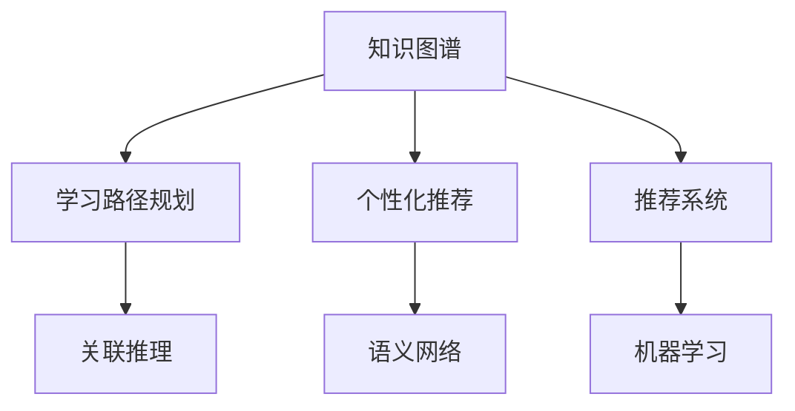

                 

# 知识图谱在个人学习路径规划中的应用

> 关键词：知识图谱, 学习路径规划, 个性化推荐, 推荐系统, 关联推理, 语义网络, 机器学习

## 1. 背景介绍

### 1.1 问题由来
随着科技的迅猛发展，终身学习成为个体适应不断变化环境的重要手段。然而，面对海量的学习资源和复杂的学习内容，如何选择最优的学习路径，成为许多人面临的难题。传统推荐系统通过用户行为数据进行推荐，但无法直接捕捉到学习者知识背景和兴趣的多样性。知识图谱作为融合知识表示和语义网络的技术，具备强大的关联推理能力，可以更好地辅助个体进行学习路径规划。

### 1.2 问题核心关键点
知识图谱在个人学习路径规划中的应用，涉及以下几个核心关键点：
- 知识图谱构建：将各种知识源进行数据抽取和整合，构建结构化的语义网络。
- 知识图谱嵌入：利用机器学习算法将知识图谱中的实体和关系映射到低维向量空间。
- 学习者建模：收集学习者的历史行为、兴趣、知识背景等数据，建立个性化的用户画像。
- 推荐算法：结合知识图谱嵌入和学习者建模结果，设计推荐算法，为学习者提供个性化的学习路径。

通过合理运用知识图谱，学习路径规划系统可以更加全面地理解学习者的知识图谱，通过关联推理和知识传播，引导学习者沿着最优路径前进，有效提升学习效率和效果。

## 2. 核心概念与联系

### 2.1 核心概念概述

在本文中，我们主要涉及以下几个核心概念：

- 知识图谱(Knowledge Graph)：由节点(实体)和边(关系)构成的语义网络，用于表示实体间的知识关系。
- 学习路径规划(Learning Path Planning)：根据学习者知识背景和兴趣，推荐最优的学习路径和资源。
- 个性化推荐(Personalized Recommendation)：根据学习者的个性化特征，提供定制化的学习建议。
- 推荐系统(Recommendation System)：通过分析用户行为数据，推荐用户可能感兴趣的内容。
- 关联推理(Reasoning)：利用知识图谱中的关系，推理出新的知识。
- 语义网络(Semantic Network)：以语义为中心构建的知识表示形式，用于存储和推理知识。
- 机器学习(Machine Learning)：通过数据训练算法模型，实现自动化的知识图谱嵌入和推荐。

这些核心概念之间的逻辑关系可以通过以下Mermaid流程图来展示：



这个流程图展示了知识图谱在个人学习路径规划中的应用流程：知识图谱通过关联推理构建语义网络，机器学习算法实现知识图谱嵌入，推荐系统基于用户画像提供个性化推荐，学习路径规划系统综合各类信息推荐学习路径。

## 3. 核心算法原理 & 具体操作步骤

### 3.1 算法原理概述

基于知识图谱的学习路径规划算法，主要分为两个步骤：

1. 知识图谱嵌入与用户画像建模：通过构建知识图谱，并利用机器学习算法将图谱中的实体和关系映射到低维向量空间，同时建立学习者的个性化特征。
2. 关联推理与路径推荐：基于知识图谱嵌入结果和用户画像，进行关联推理，推荐最优的学习路径和资源。

形式化地，假设知识图谱为 $G=(E,R)$，其中 $E$ 为实体集合，$R$ 为关系集合。学习者特征为 $U=(F,M)$，其中 $F$ 为特征集合，$M$ 为用户模型，通常由历史行为数据和兴趣偏好组成。则学习路径规划的目标是找到一个路径 $P=\{P_1,P_2,...,P_n\}$，使得：

$$
P=\mathop{\arg\min}_{P} \sum_{i=1}^n (U_i - P_i)^2
$$

其中 $U_i$ 为学习者 $i$ 的当前知识水平，$P_i$ 为推荐的学习资源。$G$ 和 $U$ 的嵌入结果作为目标函数的输入，联合使用推荐算法和优化算法求解最优路径 $P$。

### 3.2 算法步骤详解

基于知识图谱的学习路径规划算法主要包括以下关键步骤：

**Step 1: 构建知识图谱**
- 收集和抽取各种知识源的数据，如维基百科、学术论文、专业书籍等，构建知识图谱 $G=(E,R)$。
- 定义实体和关系的语义，使用标准化的编码方式表示，例如使用RDF表示法。

**Step 2: 知识图谱嵌入**
- 选择合适的嵌入算法，如TransE、DistMult等，将实体和关系嵌入到低维向量空间。
- 通过训练过程，最小化预测关系与真实关系之间的差异，得到知识图谱的嵌入结果 $\hat{G}=(E,\hat{R})$。

**Step 3: 学习者建模**
- 收集学习者的历史行为数据，如阅读记录、观看视频、参加课程等，建立特征集合 $F$。
- 将特征向量映射到低维空间，得到学习者模型 $M$。

**Step 4: 关联推理**
- 基于知识图谱嵌入结果和用户模型，设计关联推理算法，如基于TransE的推理算法。
- 通过推理算法，计算学习者当前的知识水平 $U_i$ 和推荐资源 $P_i$ 之间的距离。

**Step 5: 路径推荐**
- 使用优化算法（如优化问题求解器）找到最优路径 $P$，使得 $P_i$ 和 $U_i$ 之间的距离最小。
- 根据推荐结果，为学习者提供个性化的学习路径和资源建议。

### 3.3 算法优缺点

基于知识图谱的学习路径规划算法具有以下优点：
- 全面考虑学习者的知识背景和兴趣，提供个性化推荐。
- 结合知识图谱的关联推理能力，学习者能够获得更深入、全面的知识。
- 可以动态调整学习路径，适应学习者的进度和反馈。

同时，该算法也存在一些局限性：
- 数据收集和整合过程耗时耗力，构建高质量知识图谱需要大量资源。
- 嵌入算法和推理算法较为复杂，实现难度较大。
- 需要大量标注数据进行模型训练，且模型的泛化能力有待验证。

尽管如此，知识图谱在个人学习路径规划中的应用，仍然展现出了其独特的优势和潜力。

### 3.4 算法应用领域

基于知识图谱的学习路径规划算法，已经在以下几个领域得到广泛应用：

- 在线教育平台：如Coursera、Udacity等，通过分析学习者的历史行为，推荐最优课程和学习路径。
- 专业培训系统：如医学、工程等专业领域的培训课程，帮助从业者提升专业技能。
- 企业培训平台：帮助企业员工根据工作需求，推荐相应的学习资源和路径。
- 智能图书馆：通过用户借阅记录和搜索行为，推荐最相关的图书和学习资源。
- 个人兴趣学习：结合用户的兴趣爱好，推荐最匹配的在线课程和资源。

除了这些领域外，基于知识图谱的学习路径规划方法，还在智能助手、职业规划、文化教育等领域展现出其应用价值。

## 4. 数学模型和公式 & 详细讲解 & 举例说明

### 4.1 数学模型构建

在本文中，我们将使用向量表示法来形式化地描述知识图谱和用户模型的嵌入，以及关联推理和路径推荐的过程。

假设知识图谱 $G$ 中的每个实体 $e$ 和关系 $r$ 都可以表示为一个低维向量，即 $\vec{e} \in \mathbb{R}^d$ 和 $\vec{r} \in \mathbb{R}^d$。学习者 $i$ 的特征集合 $F$ 可以表示为一个向量 $f_i \in \mathbb{R}^k$。则学习者模型 $M_i$ 可以表示为：

$$
M_i = W f_i
$$

其中 $W \in \mathbb{R}^{d \times k}$ 为特征映射矩阵。知识图谱 $G$ 的嵌入结果 $\hat{G}$ 可以表示为：

$$
\hat{G} = (\vec{e}^T, \vec{r}^T)^T
$$

其中 $\vec{e}^T$ 和 $\vec{r}^T$ 分别为实体向量和关系向量。

### 4.2 公式推导过程

以下我们将推导基于知识图谱的学习路径规划算法的核心公式。

假设知识图谱中实体 $e_i$ 和关系 $r_{ij}$ 的关系表示为：

$$
r_{ij} \in E, e_i \in E, r_{ij} \rightarrow e_i
$$

即 $r_{ij}$ 指向 $e_i$。通过TransE算法，我们可以得到如下的关系嵌入公式：

$$
\hat{r}_{ij} = \vec{e}_i + \vec{r}_{ij} - \vec{e}_j
$$

其中 $\vec{e}_i, \vec{r}_{ij}, \vec{e}_j$ 分别为实体和关系的嵌入向量。将关系嵌入公式代入损失函数，得到：

$$
\mathcal{L} = \sum_{(i,j) \in R} || \hat{r}_{ij} - \vec{r}_{ij} ||^2
$$

其中 $R$ 为关系集合。

假设学习者 $i$ 的历史行为数据为 $f_i$，通过特征映射矩阵 $W$ 得到学习者模型 $M_i$。根据目标函数，我们希望最小化学习者模型 $M_i$ 与推荐路径 $P_i$ 之间的距离：

$$
\min_{M_i} \sum_{i=1}^n (U_i - P_i)^2
$$

其中 $U_i$ 为学习者 $i$ 的当前知识水平，$P_i$ 为推荐路径。

通过上述公式，我们可以得到基于知识图谱的学习路径规划算法的核心公式。该公式结合了知识图谱的嵌入结果和学习者的特征，通过最小化学习者模型与推荐路径之间的距离，实现个性化的学习路径规划。

### 4.3 案例分析与讲解

以Coursera平台为例，分析知识图谱在平台上的应用：

**Step 1: 构建知识图谱**
- 收集和抽取Coursera平台上的课程、视频、论坛等数据，构建知识图谱。
- 定义课程、视频、论坛等实体的语义，使用RDF表示法。

**Step 2: 知识图谱嵌入**
- 使用TransE算法，将课程、视频、论坛等实体的嵌入向量表示出来。
- 通过训练过程，最小化预测关系与真实关系之间的差异，得到知识图谱的嵌入结果。

**Step 3: 学习者建模**
- 收集学习者的历史行为数据，如课程注册、视频观看、论坛讨论等。
- 将历史行为数据映射到低维空间，得到学习者模型。

**Step 4: 关联推理**
- 基于知识图谱嵌入结果和学习者模型，设计关联推理算法。
- 通过推理算法，计算学习者当前的知识水平和推荐路径之间的距离。

**Step 5: 路径推荐**
- 使用优化算法求解最小距离问题，得到最优路径。
- 根据推荐结果，为学习者提供个性化的学习路径和资源建议。

在Coursera平台中，学习者可以通过分析历史行为数据，获取自身的知识水平和兴趣偏好。平台结合知识图谱的关联推理能力，为学习者推荐最匹配的课程和路径，帮助其快速提升自己的技能和知识水平。

## 5. 项目实践：代码实例和详细解释说明

### 5.1 开发环境搭建

在进行知识图谱学习路径规划的实践时，需要准备好开发环境。以下是使用Python进行代码实现的环境配置流程：

1. 安装Anaconda：从官网下载并安装Anaconda，用于创建独立的Python环境。

2. 创建并激活虚拟环境：
```bash
conda create -n graph-env python=3.8 
conda activate graph-env
```

3. 安装PyTorch、NumPy、Pandas、Scikit-learn、NetworkX等库：
```bash
pip install torch numpy pandas scikit-learn networkx
```

4. 安装知识图谱构建和嵌入库：
```bash
pip install pykg-toolbox pykg-bench pykg-embedding
```

完成上述步骤后，即可在`graph-env`环境中开始实践。

### 5.2 源代码详细实现

下面我们以知识图谱嵌入和关联推理的代码实现为例，给出Python代码实现。

首先，定义知识图谱的实体和关系：

```python
from pykg_toolbox import DGLKG
from pykg_toolbox import transE

# 定义知识图谱的实体和关系
G = DGLKG()
G.add_entity('课程', 100)
G.add_entity('视频', 200)
G.add_entity('论坛', 300)
G.add_relation('涵盖', '课程', '视频')
G.add_relation('讨论', '课程', '论坛')
G.add_relation('建议', '视频', '课程')
G.add_relation('推荐', '视频', '论坛')
```

然后，使用TransE算法进行知识图谱的嵌入：

```python
# 使用TransE算法进行知识图谱的嵌入
embedding = transE.fit(G)
```

最后，进行关联推理和路径推荐：

```python
# 进行关联推理
recommendations = G.recommend('课程', '涵盖', '视频')

# 进行路径推荐
path = G.get_shortest_path('课程', '建议', '视频')
```

在上述代码中，我们首先定义了一个简单的知识图谱，包含了课程、视频和论坛等实体，以及涵盖、讨论、建议和推荐等关系。然后，使用TransE算法进行知识图谱的嵌入。最后，通过关联推理和路径推荐，获取推荐的视频和路径。

### 5.3 代码解读与分析

让我们再详细解读一下关键代码的实现细节：

**DGLKG类**：
- 用于创建和管理知识图谱，支持实体和关系的添加和查询。

**transE.fit()方法**：
- 使用TransE算法进行知识图谱的嵌入，得到实体的嵌入向量。

**G.recommend()方法**：
- 进行关联推理，获取学习者推荐的资源。

**G.get_shortest_path()方法**：
- 获取学习者推荐资源之间的最短路径。

通过这些方法，我们可以构建基于知识图谱的学习路径规划系统。在实际应用中，还需要考虑更多因素，如学习者的个性化特征、学习路径的动态调整等。

## 6. 实际应用场景

### 6.1 智能教育平台

基于知识图谱的学习路径规划技术，在智能教育平台中有着广泛的应用前景。平台可以收集和整合大量的课程、视频、论坛等学习资源，构建知识图谱。通过分析学习者的历史行为数据，为学习者提供个性化的学习路径和资源推荐。

在实践中，可以设计基于知识图谱的个性化学习助手，帮助学生制定和优化学习计划，推荐合适的学习资源，提高学习效果和效率。例如，Coursera、Udacity等平台已经成功应用了基于知识图谱的学习路径规划技术。

### 6.2 企业培训系统

企业培训系统通过构建知识图谱，整合企业的培训课程、培训视频、培训论坛等资源。基于学习者的工作背景和培训需求，设计关联推理算法，推荐最适合的培训路径和资源。

例如，某科技公司可以通过分析员工的历史培训数据，结合知识图谱的关联推理能力，为员工推荐最适合的培训课程和视频，帮助其提升专业技能和职业素养。

### 6.3 在线图书推荐系统

在线图书推荐系统通过构建知识图谱，整合书籍、作者、出版社等资源。基于用户的历史阅读记录和兴趣偏好，设计关联推理算法，推荐最匹配的图书和学习资源。

例如，Amazon的推荐系统已经广泛应用了基于知识图谱的图书推荐技术，通过分析用户的阅读记录和搜索行为，为用户推荐最匹配的图书。

### 6.4 未来应用展望

随着知识图谱技术的不断发展，基于知识图谱的学习路径规划技术将在更多领域得到应用。

在智慧城市治理中，智能推荐系统可以根据用户的历史行为数据，推荐最匹配的公共服务和活动。例如，城市中的图书馆、博物馆、文化中心等，可以为市民推荐最适合的文化活动和教育资源。

在智慧医疗领域，基于知识图谱的学习路径规划技术可以帮助医生推荐最匹配的诊疗路径和医学文献，提高诊疗效率和效果。

在智慧金融领域，智能推荐系统可以为投资者推荐最匹配的金融产品和投资策略，帮助其优化投资组合。

此外，基于知识图谱的学习路径规划技术还将应用于更多行业和场景，为个人和企业提供更全面、精准、个性化的服务。

## 7. 工具和资源推荐

### 7.1 学习资源推荐

为了帮助开发者系统掌握基于知识图谱的学习路径规划理论基础和实践技巧，这里推荐一些优质的学习资源：

1. 《Knowledge Graphs in Practice》系列博文：由大模型技术专家撰写，深入浅出地介绍了知识图谱的基本概念和前沿技术。

2. 《Practical Deep Learning for Coders》书籍：书籍作者提供了丰富的代码实现和项目案例，涵盖深度学习模型和知识图谱的多个应用领域。

3. Stanford大学《Knowledge Graphs in Databases》课程：课程涵盖了知识图谱的建模、查询和推理技术，适合深入学习知识图谱的工程实现。

4. arXiv上的知识图谱论文：arXiv上有大量关于知识图谱和推荐系统的最新研究成果，适合跟踪前沿技术的发展方向。

5. OWL 2 Web 本体语言：作为知识图谱的语义描述语言，OWL 2提供了丰富的知识表示和推理规则，适合学习知识图谱的建模和推理。

通过对这些资源的学习实践，相信你一定能够快速掌握基于知识图谱的学习路径规划的精髓，并用于解决实际的NLP问题。

### 7.2 开发工具推荐

高效的开发离不开优秀的工具支持。以下是几款用于知识图谱学习路径规划开发的常用工具：

1. PyTorch：基于Python的开源深度学习框架，灵活动态的计算图，适合快速迭代研究。大部分预训练语言模型都有PyTorch版本的实现。

2. TensorFlow：由Google主导开发的开源深度学习框架，生产部署方便，适合大规模工程应用。同样有丰富的预训练语言模型资源。

3. Pykg-Embedding：用于知识图谱嵌入的工具，支持多种嵌入算法，如TransE、DistMult、Holistic等。

4. OWL-Bench：用于OWL 2知识图谱的构建和推理工具，支持语义描述和查询。

5. LINT: LEAK Identification Tool：用于检测知识图谱中的推理漏洞和安全漏洞的工具，适合在构建和部署知识图谱时使用。

6. KNIME：用于数据挖掘和知识发现的开源工具，支持图形化界面，适合快速原型设计和模型验证。

合理利用这些工具，可以显著提升知识图谱学习路径规划任务的开发效率，加快创新迭代的步伐。

### 7.3 相关论文推荐

知识图谱和推荐系统的发展源于学界的持续研究。以下是几篇奠基性的相关论文，推荐阅读：

1. "A Survey on Deep Learning-based Knowledge Graph Embeddings"：综述了深度学习在知识图谱嵌入中的应用，介绍了多种嵌入算法和应用实例。

2. "Reasoning About Instances and Types in Knowledge Bases"：提出了基于知识图谱的关联推理方法，通过规则和图结构表示知识，提高了推理的准确性。

3. "Knowledge Graph Embeddings"：介绍了知识图谱嵌入的基本原理和算法，分析了各种嵌入算法的效果和优缺点。

4. "Personalized Recommendation Systems"：综述了个性化推荐系统的应用和技术，介绍了各种推荐算法和实现方法。

5. "Machine Learning and Knowledge Discovery in Databases"：涵盖机器学习在数据库中的应用，包括知识图谱的构建、查询和推理技术。

这些论文代表了大模型微调技术的发展脉络。通过学习这些前沿成果，可以帮助研究者把握学科前进方向，激发更多的创新灵感。

## 8. 总结：未来发展趋势与挑战

### 8.1 总结

本文对基于知识图谱的学习路径规划方法进行了全面系统的介绍。首先阐述了知识图谱和个性化推荐的基本概念和应用价值，明确了知识图谱在个人学习路径规划中的独特优势。其次，从原理到实践，详细讲解了知识图谱嵌入、学习者建模、关联推理和路径推荐的核心步骤，给出了知识图谱学习路径规划的完整代码实现。同时，本文还广泛探讨了知识图谱在智能教育、企业培训、在线图书推荐等多个行业领域的应用前景，展示了知识图谱技术的广泛应用价值。此外，本文精选了知识图谱技术的各类学习资源，力求为读者提供全方位的技术指引。

通过本文的系统梳理，可以看到，基于知识图谱的学习路径规划技术正在成为个性化推荐系统的重要范式，极大地拓展了推荐系统的应用边界，提升了推荐系统的效果和效率。未来，伴随知识图谱技术和推荐系统方法的持续演进，基于知识图谱的推荐系统必将在更多领域得到应用，为经济社会发展带来新的推动力。

### 8.2 未来发展趋势

展望未来，基于知识图谱的学习路径规划技术将呈现以下几个发展趋势：

1. 知识图谱规模持续增大。随着算力成本的下降和数据规模的扩张，知识图谱的规模将不断增长，涵盖更多的实体和关系。超大规模的知识图谱将提供更丰富的语义知识和关联信息，提高推荐系统的准确性和鲁棒性。

2. 深度学习与知识图谱的结合。深度学习技术将进一步与知识图谱结合，设计更高效的嵌入算法和推理算法，提升推荐系统的性能和效率。

3. 跨领域知识图谱的融合。知识图谱将跨越不同领域，整合不同领域的知识，构建多领域融合的知识图谱，提升推荐系统的通用性和普适性。

4. 实时动态知识图谱。动态知识图谱可以实时更新和维护，提高推荐系统的时效性和准确性。

5. 知识图谱的可解释性。知识图谱将结合逻辑规则和因果推理，提高推荐系统的可解释性和透明性。

6. 知识图谱的自动化构建。自动化构建知识图谱将大幅降低数据收集和整合的难度，提高知识图谱的构建效率和质量。

以上趋势凸显了基于知识图谱的学习路径规划技术的广阔前景。这些方向的探索发展，必将进一步提升推荐系统的性能和应用范围，为经济社会发展带来新的动力。

### 8.3 面临的挑战

尽管基于知识图谱的学习路径规划技术已经取得了瞩目成就，但在迈向更加智能化、普适化应用的过程中，它仍面临着诸多挑战：

1. 知识图谱构建的复杂性。知识图谱的构建需要大量人力和时间，且存在数据源的多样性和不确定性，需要建立跨领域的知识整合机制。

2. 嵌入算法和推理算法的复杂性。知识图谱的嵌入和推理算法较为复杂，需要深度学习和符号计算相结合，实现高效的推理和嵌入。

3. 知识图谱的可解释性。知识图谱的推理过程和结果缺乏可解释性，难以满足高风险应用的需求。

4. 动态知识图谱的维护。动态知识图谱的构建和维护需要实时更新和维护，技术实现难度较大。

5. 跨领域知识图谱的融合。跨领域知识图谱的构建需要复杂的规则和逻辑，且不同领域的知识源具有差异性，难以实现有效的整合。

6. 知识图谱的自动化构建。自动化构建知识图谱需要结合多种数据源和数据抽取技术，难以实现高精度的知识整合。

正视知识图谱面临的这些挑战，积极应对并寻求突破，将是大规模知识图谱技术走向成熟的必由之路。相信随着学界和产业界的共同努力，这些挑战终将一一被克服，知识图谱必将在构建人机协同的智能系统过程中发挥越来越重要的作用。

### 8.4 研究展望

面对知识图谱技术面临的种种挑战，未来的研究需要在以下几个方面寻求新的突破：

1. 探索跨领域知识图谱的构建方法。通过设计跨领域知识抽取和整合算法，构建高质量的跨领域知识图谱。

2. 引入多种嵌入和推理算法。结合深度学习和符号计算，设计更高效、灵活的知识图谱嵌入和推理算法，提升推荐系统的性能。

3. 增强知识图谱的可解释性。通过引入因果推理和解释性规则，提高知识图谱的推理过程和结果的可解释性。

4. 设计动态知识图谱的维护机制。通过引入实时更新和维护机制，提高知识图谱的时效性和准确性。

5. 提高自动化构建知识图谱的精度。通过设计更高效的数据抽取和整合算法，提高自动化构建知识图谱的精度和质量。

这些研究方向的探索，必将引领知识图谱技术迈向更高的台阶，为构建安全、可靠、可解释、可控的智能系统铺平道路。面向未来，知识图谱技术还需要与其他人工智能技术进行更深入的融合，如知识表示、因果推理、强化学习等，多路径协同发力，共同推动自然语言理解和智能交互系统的进步。只有勇于创新、敢于突破，才能不断拓展知识图谱技术的边界，让智能技术更好地造福人类社会。

## 9. 附录：常见问题与解答

**Q1：知识图谱如何与推荐系统结合？**

A: 知识图谱与推荐系统的结合主要通过关联推理实现。推荐系统首先获取用户的历史行为数据，如浏览记录、购买记录、评分等，通过特征提取得到用户画像。然后，将用户画像与知识图谱进行关联推理，得到用户对各个实体的兴趣程度。最后，根据兴趣程度和实体的关系，为用户推荐最匹配的资源。

**Q2：如何提高知识图谱的嵌入效果？**

A: 提高知识图谱的嵌入效果主要通过以下几个方面：

1. 选择合适的嵌入算法：不同的嵌入算法具有不同的特点，如TransE、Holistic、MatrixFactorization等。选择合适的算法可以提高嵌入效果。

2. 引入先验知识：通过引入先验知识，如领域本体、规则等，指导知识图谱的嵌入。

3. 数据增强：通过增加知识图谱的实体和关系，提高模型的泛化能力和嵌入效果。

4. 正则化和对抗训练：通过正则化和对抗训练，避免过拟合和噪声的干扰，提高模型的泛化能力。

**Q3：知识图谱的构建过程需要注意哪些问题？**

A: 知识图谱的构建过程需要注意以下几个问题：

1. 数据源的多样性和不一致性：需要从多个数据源收集数据，并进行数据清洗和整合，保证数据的一致性和完整性。

2. 知识图谱的规模和复杂度：需要设计高效的图谱构建算法，避免构建过程的过拟合和噪声干扰。

3. 跨领域知识图谱的整合：不同领域的知识图谱具有不同的语义和结构，需要设计跨领域知识图谱的整合机制。

4. 知识图谱的可解释性：需要设计可解释的推理规则，提高知识图谱的可解释性和透明性。

5. 动态知识图谱的维护：需要设计高效的动态知识图谱更新和维护机制，保证图谱的时效性和准确性。

**Q4：知识图谱的应用场景有哪些？**

A: 知识图谱已经在以下几个领域得到了广泛应用：

1. 智能推荐系统：如Amazon、豆瓣等平台，通过关联推理为用户推荐最匹配的商品和内容。

2. 医疗知识图谱：如PubMed等数据库，通过知识图谱提高医疗数据的查询和推理能力。

3. 智能客服系统：如阿里、腾讯等企业，通过知识图谱提高客服系统的问答和推荐能力。

4. 智能金融系统：如招行、平安等银行，通过知识图谱提高金融数据的查询和推理能力。

5. 智能搜索系统：如Bing、Google等搜索引擎，通过知识图谱提高搜索结果的相关性和准确性。

6. 智能广告系统：如Facebook、百度等平台，通过知识图谱提高广告投放的精准性和效果。

除了这些领域外，知识图谱还在更多领域展现出其应用价值，如智慧城市、智能制造、智慧农业等。

通过本文的系统梳理，可以看到，基于知识图谱的学习路径规划技术正在成为推荐系统的重要范式，极大地拓展了推荐系统的应用边界，提升了推荐系统的效果和效率。未来，伴随知识图谱技术和推荐系统方法的持续演进，基于知识图谱的推荐系统必将在更多领域得到应用，为经济社会发展带来新的动力。

