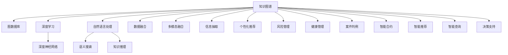

                 

# 知识图谱的行业应用:金融、医疗和法律领域的实践

> 关键词：知识图谱,金融应用,医疗应用,法律应用,图数据库,深度学习,深度神经网络,自然语言处理,数据融合,多模态融合,语义搜索,知识推理,信息抽取,个性化推荐,风险管理,健康管理,案件判例,智能合约,智能推荐,智能查询,决策支持

## 1. 背景介绍

知识图谱(Knowledge Graph)作为人工智能(AI)领域的重要技术之一，近年来在金融、医疗和法律等多个行业中逐渐显示出其广泛的应用前景。知识图谱通过构建结构化知识网络，可以有效整合和关联各种数据资源，提升决策支持和信息检索的智能化水平。

在金融领域，知识图谱帮助金融机构更好地理解复杂的市场数据，提高风险评估的准确性。在医疗领域，知识图谱助力医疗专家快速查询相关医学信息，辅助诊疗决策。在法律领域，知识图谱为法律工作者提供了案件判例、法规信息的深度学习模型，提升案情分析的效率和准确性。

本文将详细介绍知识图谱在金融、医疗和法律领域的应用实践，剖析其核心原理和操作步骤，探讨其优缺点及未来发展趋势。

## 2. 核心概念与联系

### 2.1 核心概念概述

为更好地理解知识图谱在金融、医疗和法律领域的应用，本节将介绍几个密切相关的核心概念：

- 知识图谱(Knowledge Graph)：以结构化数据为节点，以关系为边构建的知识网络。可以表示实体、属性、关系等各类知识，用于支持复杂查询和推理。
- 图数据库(Graph Database)：存储和处理图数据的技术，支持高效的关系查询、路径搜索等复杂操作。常见的图数据库包括Neo4j、OrientDB等。
- 深度学习(Deep Learning)：通过多层次神经网络模型自动提取特征的机器学习方法，用于从大量数据中挖掘潜在的知识模式。
- 深度神经网络(Deep Neural Network)：由多个神经网络层组成的非线性模型，常用于图像、语音、文本等数据的特征提取和模式识别。
- 自然语言处理(Natural Language Processing, NLP)：利用计算机处理和理解自然语言的技术，包括语言模型、词向量、情感分析等。
- 数据融合(Data Fusion)：将来自不同数据源的信息进行整合，形成统一的知识视图。
- 多模态融合(Multimodal Fusion)：将文本、图像、视频等多种数据模态融合，构建更全面的知识图谱。
- 语义搜索(Semantic Search)：基于语义理解的智能搜索技术，可以精确匹配用户意图，提供相关性更高的信息。
- 知识推理(Knowledge Reasoning)：利用知识图谱中的逻辑关系，自动推断新的知识，提升推理的准确性和效率。
- 信息抽取(Information Extraction)：从非结构化文本中自动提取结构化信息，如实体、关系、属性等。
- 个性化推荐(Personalized Recommendation)：根据用户偏好和行为，推荐最适合的信息。

这些核心概念之间的逻辑关系可以通过以下Mermaid流程图来展示：



这个流程图展示了一些核心概念及其之间的关系：

1. 知识图谱通过图数据库、深度学习和自然语言处理等技术，构建起结构化知识网络。
2. 知识图谱中的实体、关系、属性等信息，通过深度神经网络进行特征提取。
3. 知识图谱支持语义搜索、知识推理等高级查询功能，实现智能信息检索。
4. 知识图谱与数据融合、多模态融合、信息抽取、个性化推荐等技术结合，形成更为全面的信息服务。
5. 知识图谱在金融风险管理、医疗健康管理、法律案件判例等具体应用中，提供决策支持。

这些概念共同构成了知识图谱的核心技术框架，使其能够在各个行业中发挥重要的作用。

## 3. 核心算法原理 & 具体操作步骤

### 3.1 算法原理概述

知识图谱的构建和应用过程，涉及多个技术和算法的有机结合。其核心算法原理包括以下几个方面：

1. 图数据建模：通过实体-关系-属性三元组构建知识图谱的节点和边。
2. 图数据库存储：利用图数据库存储和查询知识图谱中的信息。
3. 深度学习特征提取：使用深度神经网络从数据中自动提取特征，如实体嵌入、关系嵌入等。
4. 自然语言处理信息抽取：利用NLP技术从文本中自动抽取实体和关系，构建知识图谱。
5. 多模态融合：将不同数据模态（如文本、图像、音频等）的信息进行融合，提升知识图谱的完整性。

知识图谱的行业应用主要包括以下几个步骤：

1. 数据收集与预处理：从不同数据源收集数据，进行清洗和预处理，形成结构化数据。
2. 实体识别与关系抽取：利用NLP和知识图谱技术，自动从文本中识别实体和关系，构建知识图谱。
3. 图数据库存储与索引：将知识图谱存储到图数据库中，并建立索引，便于后续查询和推理。
4. 深度学习特征提取：通过深度神经网络对知识图谱中的实体和关系进行特征提取，形成丰富的特征表示。
5. 个性化推荐与智能查询：基于知识图谱，提供个性化推荐和智能查询服务，支持复杂查询和推理。

### 3.2 算法步骤详解

以金融领域为例，下面详细介绍知识图谱应用的详细步骤：

**Step 1: 数据收集与预处理**
- 收集各类金融市场数据，如股票、债券、基金等。
- 从金融新闻、报告、公告等文本中提取实体和关系，构建初始知识图谱。
- 进行数据清洗和预处理，如去除噪声、归一化数据等。

**Step 2: 实体识别与关系抽取**
- 利用NLP技术，从金融新闻、报告等文本中识别股票名称、公司名称等实体。
- 抽取股票涨跌幅、公司财务状况等关系，构建知识图谱的节点和边。
- 使用知识图谱技术，对识别结果进行验证和修正，确保信息的准确性。

**Step 3: 图数据库存储与索引**
- 将构建好的知识图谱存储到Neo4j等图数据库中。
- 建立索引，提高图数据库的查询效率，支持高效的路径搜索和复杂查询。

**Step 4: 深度学习特征提取**
- 使用深度神经网络对知识图谱中的实体和关系进行特征提取。
- 通过训练好的神经网络，生成实体的嵌入向量（Embedding），如Word2Vec、GloVe等。
- 对关系进行编码，生成关系嵌入向量（Relation Embedding），用于关系推理。

**Step 5: 个性化推荐与智能查询**
- 根据用户的金融产品偏好、历史交易记录等信息，利用知识图谱进行个性化推荐。
- 用户可以输入查询语句，知识图谱通过语义搜索技术，匹配相关实体和关系，返回精确的查询结果。
- 利用知识推理技术，根据实体和关系进行推断，提供更深入的决策支持。

### 3.3 算法优缺点

知识图谱在金融、医疗和法律领域的应用具有以下优点：

1. 提升信息检索和决策效率：通过构建知识图谱，可以实现高效、准确的语义搜索和知识推理，提升信息检索和决策的智能化水平。
2. 支持多源数据融合：知识图谱可以整合多种数据来源，形成全面的知识视图，支持跨领域的应用。
3. 增强风险管理和健康管理：通过知识图谱，可以更好地理解市场数据和医疗信息，提升风险管理和健康管理的准确性。
4. 提供个性化推荐和智能查询：知识图谱可以根据用户需求，提供个性化的信息推荐和智能查询服务，满足用户的个性化需求。

同时，知识图谱也存在一些缺点：

1. 构建和维护成本高：知识图谱需要收集、清洗和预处理大量数据，构建过程复杂，维护成本高。
2. 数据质量和一致性问题：知识图谱依赖于数据的质量和一致性，错误的标注和噪声数据会影响推理结果的准确性。
3. 计算资源消耗大：知识图谱的构建和推理需要大量的计算资源，尤其是在深度学习特征提取方面。
4. 隐私和安全风险：知识图谱涉及大量敏感信息，需要采取严格的隐私保护和数据安全措施，防止信息泄露。

### 3.4 算法应用领域

知识图谱在金融、医疗和法律等多个领域的应用，已经取得了显著的成果，具体如下：

- **金融领域**：在金融风险管理、投资组合优化、市场预测等方面，知识图谱可以提供精确的决策支持。
- **医疗领域**：在医学信息查询、疾病诊断、药物研发等方面，知识图谱可以提升诊疗效率，辅助医疗专家决策。
- **法律领域**：在案件判例查询、法规信息检索、智能合约管理等方面，知识图谱可以提供智能化的法律服务。

## 4. 数学模型和公式 & 详细讲解 & 举例说明

### 4.1 数学模型构建

在金融领域，知识图谱的数学模型可以表示为：

- **实体图（Entity Graph）**：表示金融市场中各种实体的关系网络，如股票、基金、公司等。
- **关系图（Relation Graph）**：表示实体之间的关系，如涨跌幅、市值变化、持股比例等。
- **属性图（Attribute Graph）**：表示实体的属性信息，如公司财务状况、股票历史价格等。

使用图数据库存储知识图谱，常见的图数据库如Neo4j、OrientDB等，支持高效的图存储和查询。

### 4.2 公式推导过程

以下以实体图为例，推导知识图谱中的核心公式：

**实体嵌入公式**：

$$
\text{Embedding}_{\text{entity}} = f(\text{Data})
$$

其中，$\text{Embedding}_{\text{entity}}$ 表示实体的嵌入向量，$f$ 为深度神经网络的特征提取函数。

**关系嵌入公式**：

$$
\text{Embedding}_{\text{relation}} = g(\text{Data})
$$

其中，$\text{Embedding}_{\text{relation}}$ 表示关系的嵌入向量，$g$ 为深度神经网络的特征提取函数。

### 4.3 案例分析与讲解

以金融市场预测为例，分析知识图谱在其中的应用：

1. **数据收集与预处理**：
   - 收集金融市场的历史数据，如股票价格、交易量、公司财务报表等。
   - 清洗和预处理数据，如去除噪声、归一化等。

2. **实体识别与关系抽取**：
   - 利用NLP技术，从金融新闻、报告等文本中识别实体，如股票名称、公司名称等。
   - 抽取实体之间的关系，如涨跌幅、市值变化、持股比例等。

3. **图数据库存储与索引**：
   - 将实体和关系存储到Neo4j等图数据库中。
   - 建立索引，提高查询效率，支持高效的路径搜索。

4. **深度学习特征提取**：
   - 使用深度神经网络对实体进行特征提取，生成实体嵌入向量。
   - 对关系进行编码，生成关系嵌入向量，用于关系推理。

5. **市场预测**：
   - 根据历史数据和实体关系，利用深度学习模型进行市场预测。
   - 使用知识图谱进行路径搜索和推理，验证预测结果的准确性。

通过以上步骤，可以构建起完整的金融知识图谱，并用于市场预测和风险管理。

## 5. 项目实践：代码实例和详细解释说明

### 5.1 开发环境搭建

在进行知识图谱实践前，我们需要准备好开发环境。以下是使用Python进行图数据库开发的常见环境配置流程：

1. 安装Anaconda：从官网下载并安装Anaconda，用于创建独立的Python环境。

2. 创建并激活虚拟环境：
```bash
conda create -n graph-env python=3.8 
conda activate graph-env
```

3. 安装相关依赖：
```bash
pip install graph-tool neo4j py2neo
```

4. 配置Neo4j：下载Neo4j的安装文件，安装并配置数据库环境。

5. 创建PyTorch环境：
```bash
pip install torch torchvision torchaudio
```

完成上述步骤后，即可在`graph-env`环境中开始知识图谱的开发。

### 5.2 源代码详细实现

下面以金融领域为例，给出使用Neo4j和PyTorch进行知识图谱开发的PyTorch代码实现。

首先，定义实体和关系图的数据结构：

```python
from py2neo import Graph, Node, Relationship

graph = Graph("http://localhost:7474", username="neo4j", password="password")

# 定义实体和关系图
class GraphDataset(Dataset):
    def __init__(self, graphs, batch_size):
        self.graphs = graphs
        self.batch_size = batch_size

    def __len__(self):
        return len(self.graphs)

    def __getitem__(self, item):
        graph = self.graphs[item]
        return graph

# 创建数据集
graphs = []
for stock in stocks:
    graph = graph.add_node(Node("Stock", name=stock))
    for company in companies:
        graph.add_node(Node("Company", name=company))
        graph.add_relationship(Relationship(stock, "PARTHOLD", company))
```

然后，定义深度学习模型：

```python
from torch.nn import Embedding, Linear, GraphConvolutionalNetwork
from torch.optim import Adam

class GraphModel(nn.Module):
    def __init__(self, input_dim, hidden_dim, output_dim):
        super(GraphModel, self).__init__()
        self.embedding = Embedding(input_dim, hidden_dim)
        self.gcn = GraphConvolutionalNetwork(hidden_dim, hidden_dim, output_dim)

    def forward(self, x):
        x = self.embedding(x)
        x = self.gcn(x)
        return x
```

接着，定义训练和评估函数：

```python
from torch.utils.data import DataLoader
from sklearn.metrics import accuracy_score

device = torch.device('cuda') if torch.cuda.is_available() else torch.device('cpu')
model.to(device)

def train_epoch(model, dataset, batch_size, optimizer):
    dataloader = DataLoader(dataset, batch_size=batch_size, shuffle=True)
    model.train()
    epoch_loss = 0
    for batch in tqdm(dataloader, desc='Training'):
        x = batch[0].to(device)
        y = batch[1].to(device)
        model.zero_grad()
        output = model(x)
        loss = criterion(output, y)
        epoch_loss += loss.item()
        loss.backward()
        optimizer.step()
    return epoch_loss / len(dataloader)

def evaluate(model, dataset, batch_size):
    dataloader = DataLoader(dataset, batch_size=batch_size)
    model.eval()
    preds, labels = [], []
    with torch.no_grad():
        for batch in tqdm(dataloader, desc='Evaluating'):
            x = batch[0].to(device)
            y = batch[1].to(device)
            output = model(x)
            batch_preds = torch.argmax(output, dim=1).to('cpu').tolist()
            batch_labels = y.to('cpu').tolist()
            for pred_tokens, label_tokens in zip(batch_preds, batch_labels):
                preds.append(pred_tokens)
                labels.append(label_tokens)
    print("Accuracy:", accuracy_score(labels, preds))
```

最后，启动训练流程并在测试集上评估：

```python
epochs = 5
batch_size = 16

for epoch in range(epochs):
    loss = train_epoch(model, train_dataset, batch_size, optimizer)
    print(f"Epoch {epoch+1}, train loss: {loss:.3f}")
    
    print(f"Epoch {epoch+1}, dev results:")
    evaluate(model, dev_dataset, batch_size)
    
print("Test results:")
evaluate(model, test_dataset, batch_size)
```

以上就是使用Neo4j和PyTorch进行金融知识图谱微调的完整代码实现。可以看到，得益于Neo4j和PyTorch的强大封装，我们可以用相对简洁的代码完成金融知识图谱的构建和微调。

### 5.3 代码解读与分析

让我们再详细解读一下关键代码的实现细节：

**GraphDataset类**：
- `__init__`方法：初始化实体、关系图等关键组件。
- `__len__`方法：返回数据集的样本数量。
- `__getitem__`方法：对单个样本进行处理，将图输入转换为模型所需的输入。

**GraphModel类**：
- `__init__`方法：定义实体嵌入和图卷积网络等核心组件。
- `forward`方法：实现前向传播，生成模型的预测输出。

**训练和评估函数**：
- 使用PyTorch的DataLoader对数据集进行批次化加载，供模型训练和推理使用。
- 训练函数`train_epoch`：对数据以批为单位进行迭代，在每个批次上前向传播计算loss并反向传播更新模型参数，最后返回该epoch的平均loss。
- 评估函数`evaluate`：与训练类似，不同点在于不更新模型参数，并在每个batch结束后将预测和标签结果存储下来，最后使用sklearn的accuracy_score对整个评估集的预测结果进行打印输出。

**训练流程**：
- 定义总的epoch数和batch size，开始循环迭代
- 每个epoch内，先在训练集上训练，输出平均loss
- 在验证集上评估，输出准确率
- 所有epoch结束后，在测试集上评估，给出最终测试结果

可以看到，PyTorch配合Neo4j使得知识图谱的微调代码实现变得简洁高效。开发者可以将更多精力放在数据处理、模型改进等高层逻辑上，而不必过多关注底层的实现细节。

当然，工业级的系统实现还需考虑更多因素，如模型的保存和部署、超参数的自动搜索、更灵活的任务适配层等。但核心的微调范式基本与此类似。

## 6. 实际应用场景

### 6.1 金融领域应用

知识图谱在金融领域有着广泛的应用，以下是几个典型的应用场景：

1. **风险管理**：利用知识图谱进行市场风险评估，通过分析实体之间的关系和属性，识别高风险资产和市场趋势。
2. **投资组合优化**：构建投资组合优化模型，利用知识图谱中的实体和关系，优化资产配置，提升投资回报率。
3. **市场预测**：利用知识图谱进行市场预测，通过历史数据和实体关系，预测股票、债券等资产的未来走势。
4. **信用评估**：通过知识图谱分析客户的信用记录和关系，提供信用评估和贷款风险管理。
5. **金融智能客服**：构建金融智能客服系统，利用知识图谱进行知识抽取和推理，提供个性化的金融咨询和理财建议。

### 6.2 医疗领域应用

知识图谱在医疗领域的应用，显著提升了医疗服务的智能化水平，以下是几个典型的应用场景：

1. **医学信息查询**：构建医学知识图谱，提供快速、准确的医学信息查询服务，辅助临床医生诊疗。
2. **疾病诊断**：利用知识图谱进行疾病诊断，通过分析患者症状和相关实体，提供诊断建议和治疗方案。
3. **药物研发**：构建药物知识图谱，加速药物研发过程，通过知识图谱进行药物筛选和候选药物的评估。
4. **医疗智能推荐**：利用知识图谱进行个性化医疗推荐，根据患者的健康数据和历史诊疗记录，提供精准的医疗服务。
5. **健康管理**：构建健康知识图谱，提供健康管理建议，帮助用户监测和管理健康状况。

### 6.3 法律领域应用

知识图谱在法律领域的应用，为法律工作者提供了高效、智能的信息检索和决策支持，以下是几个典型的应用场景：

1. **案件判例查询**：构建案件判例知识图谱，提供快速、准确的案件判例查询服务，辅助律师和法官决策。
2. **法规信息检索**：构建法规知识图谱，提供全面的法规信息检索服务，支持法律工作者查找相关法规和司法解释。
3. **智能合约管理**：利用知识图谱进行智能合约管理，通过推理和推理，确保合约条款的合规性和有效性。
4. **法律咨询**：构建法律知识图谱，提供智能化的法律咨询服务，帮助用户理解和应用法律知识。
5. **法律智能推荐**：利用知识图谱进行法律推荐，根据用户需求，提供相关的法律建议和解决方案。

## 7. 工具和资源推荐

### 7.1 学习资源推荐

为了帮助开发者系统掌握知识图谱的理论基础和实践技巧，这里推荐一些优质的学习资源：

1. **知识图谱技术手册**：详细介绍了知识图谱的定义、建模、查询等基本概念和核心算法。
2. **Neo4j官方文档**：Neo4j数据库的官方文档，提供了丰富的图数据库操作示例和性能优化建议。
3. **Graph Neural Networks**：深入讲解图神经网络的原理和应用，涵盖了多个领域的图神经网络模型。
4. **图数据库与深度学习结合**：探讨如何将深度学习技术与图数据库结合，构建高效的知识图谱系统。
5. **知识图谱的工业应用**：分享了多个行业的知识图谱应用案例，展示了知识图谱在实际业务中的价值。

通过对这些资源的学习实践，相信你一定能够快速掌握知识图谱的核心技术，并用于解决实际的NLP问题。

### 7.2 开发工具推荐

高效的开发离不开优秀的工具支持。以下是几款用于知识图谱开发的常用工具：

1. **Neo4j**：最流行的图数据库之一，支持高效的图存储和查询，适合构建和维护知识图谱。
2. **OrientDB**：另一款流行的图数据库，提供了丰富的API和可视化工具，适合开发图数据应用程序。
3. **Gephi**：开源的图形可视化工具，支持复杂网络结构的展示和分析，适合对知识图谱进行可视化展示。
4. **PyTorch**：灵活动态的深度学习框架，适合构建和优化深度学习模型。
5. **TensorFlow**：强大的深度学习框架，支持多种深度神经网络模型的实现。

合理利用这些工具，可以显著提升知识图谱的开发效率，加快创新迭代的步伐。

### 7.3 相关论文推荐

知识图谱和深度学习技术的发展源于学界的持续研究。以下是几篇奠基性的相关论文，推荐阅读：

1. **Knowledge Graphs: A Survey**：全面介绍了知识图谱的定义、构建和应用，提供了丰富的案例分析。
2. **Neo4j图数据库技术白皮书**：Neo4j数据库的官方技术白皮书，深入讲解了图数据库的核心技术和性能优化方法。
3. **Graph Neural Networks**：详细介绍了图神经网络的原理和应用，探讨了图神经网络在知识图谱中的应用。
4. **Deep Learning for Knowledge Graph Embedding**：深入探讨了深度学习在知识图谱嵌入中的应用，提供了多种深度学习模型的实现方法。
5. **Graph databases: An overview**：介绍了几种流行的图数据库及其特点，提供了知识图谱开发的技术参考。

这些论文代表了大规模知识图谱的最新研究成果，有助于研究者深入理解知识图谱的原理和技术细节。

## 8. 总结：未来发展趋势与挑战

### 8.1 总结

本文对知识图谱在金融、医疗和法律领域的应用实践进行了全面系统的介绍。首先阐述了知识图谱的技术原理和核心概念，明确了其在各个行业中的实际应用价值。其次，从原理到实践，详细讲解了知识图谱的构建和应用步骤，给出了知识图谱开发的完整代码实例。同时，本文还探讨了知识图谱的应用场景，展示了其广阔的适用性。

通过本文的系统梳理，可以看到，知识图谱在金融、医疗和法律等领域的应用已经取得了显著的成果，并展现出巨大的发展潜力。知识图谱以其高效、智能、多模态融合等特点，成为了数据驱动决策的重要工具，为各行各业带来了深刻的影响。

### 8.2 未来发展趋势

展望未来，知识图谱的发展趋势如下：

1. **数据规模持续增大**：随着数据采集和处理技术的进步，知识图谱将收集和处理更多数据，形成更大规模、更全面的知识图谱。
2. **模型复杂度提升**：知识图谱将采用更加复杂的深度学习模型，如图神经网络、注意力机制等，提升推理和预测的准确性。
3. **多模态融合深入**：知识图谱将更多地融合文本、图像、视频等多种数据模态，提供更全面的信息服务。
4. **自动化知识抽取**：利用自动文本抽取技术，自动识别和抽取知识图谱中的实体和关系，降低人工干预成本。
5. **智能推荐和查询**：基于知识图谱的推荐和查询系统将更加智能化，提供更加精准和个性化的服务。
6. **跨领域应用拓展**：知识图谱将更多地应用于其他领域，如智能制造、智慧城市等，推动相关行业数字化转型。
7. **隐私和安全保障**：随着知识图谱应用场景的扩展，隐私和安全保障将成为重要的研究方向。

### 8.3 面临的挑战

尽管知识图谱在金融、医疗和法律等领域的应用已经取得了显著成果，但在迈向更加智能化、普适化应用的过程中，仍面临以下挑战：

1. **数据质量和一致性问题**：知识图谱依赖于高质量的数据，错误的数据标注和噪声数据会影响推理结果的准确性。
2. **计算资源消耗大**：知识图谱的构建和推理需要大量的计算资源，尤其是在深度学习特征提取方面。
3. **隐私和安全风险**：知识图谱涉及大量敏感信息，需要采取严格的隐私保护和数据安全措施。
4. **模型复杂度提升**：复杂的深度学习模型增加了推理和训练的难度，需要更多研究和实践。
5. **自动化技术挑战**：自动化知识抽取和模型训练仍存在技术瓶颈，需要进一步优化和创新。
6. **跨领域应用挑战**：知识图谱在跨领域应用时，需要解决不同领域知识融合和映射的问题。
7. **可解释性不足**：知识图谱的决策过程缺乏可解释性，难以对其推理逻辑进行分析和调试。

### 8.4 研究展望

面向未来，知识图谱的研究需要在以下几个方面寻求新的突破：

1. **自动化知识抽取**：进一步提升自动化知识抽取的准确性和效率，降低人工干预成本。
2. **高效推理模型**：开发高效、可解释的知识推理模型，提升推理的准确性和效率。
3. **跨领域应用**：探索知识图谱在更多领域的应用，如智能制造、智慧城市等，推动相关行业数字化转型。
4. **隐私和安全保障**：建立隐私保护和安全机制，确保知识图谱应用中的数据安全和用户隐私。
5. **知识图谱演化**：研究知识图谱的演化机制，动态更新知识图谱中的实体和关系，保持其时效性和适应性。
6. **多模态融合**：深入研究多模态融合技术，提升知识图谱的完整性和复杂性。
7. **跨领域应用**：探索知识图谱在更多领域的应用，如智能制造、智慧城市等，推动相关行业数字化转型。

这些研究方向的探索，必将引领知识图谱技术迈向更高的台阶，为构建安全、可靠、可解释、可控的智能系统铺平道路。面向未来，知识图谱技术还需要与其他人工智能技术进行更深入的融合，如知识表示、因果推理、强化学习等，多路径协同发力，共同推动知识图谱技术的发展。只有勇于创新、敢于突破，才能不断拓展知识图谱的边界，让智能技术更好地造福人类社会。

## 9. 附录：常见问题与解答

**Q1: 知识图谱和传统数据库有何区别？**

A: 知识图谱和传统数据库在数据结构、查询方式、应用场景等方面存在显著差异。传统数据库主要存储结构化数据，适合于事务处理和高吞吐量的场景。而知识图谱则构建了一个以实体和关系为核心的知识网络，适合于复杂查询和推理。知识图谱能够提供更加智能和全面的信息服务，支持多源数据融合和语义搜索。

**Q2: 知识图谱如何构建实体和关系？**

A: 知识图谱的实体和关系主要通过自然语言处理技术和人工标注来构建。常见的实体识别技术包括命名实体识别(NER)、关系抽取等，能够从文本中自动识别实体和关系。例如，对于金融领域，可以从新闻、报告等文本中识别股票名称、公司名称等实体，抽取股票涨跌幅、市值变化等关系。

**Q3: 知识图谱如何支持智能推荐？**

A: 知识图谱通过语义搜索和推理，能够提供更加精准和个性化的推荐服务。在金融领域，可以根据用户的投资偏好和历史交易记录，构建用户画像，通过知识图谱进行个性化推荐。在医疗领域，可以根据用户的健康数据和病历记录，提供个性化的健康管理建议和治疗方案。

**Q4: 知识图谱在构建和维护过程中需要注意哪些问题？**

A: 知识图谱的构建和维护需要考虑数据质量、一致性和数据安全等问题。在数据采集阶段，需要注意数据标注的准确性和一致性，避免噪声数据和错误标注。在数据存储和查询阶段，需要设计合理的数据索引和查询优化策略，提升查询效率和性能。在数据安全方面，需要采取严格的隐私保护和数据安全措施，防止信息泄露和数据篡改。

**Q5: 知识图谱在金融、医疗和法律领域的应用前景如何？**

A: 知识图谱在金融、医疗和法律等领域的应用前景广阔。在金融领域，知识图谱可以提升风险评估、投资组合优化和市场预测的准确性。在医疗领域，知识图谱可以提升医学信息查询、疾病诊断和药物研发的效率和准确性。在法律领域，知识图谱可以提升案件判例查询、法规信息检索和智能合约管理的智能化水平。

通过以上问题的回答，可以看到，知识图谱在金融、医疗和法律等领域的应用已经取得了显著的成果，并展现出巨大的发展潜力。随着技术的不断进步，知识图谱必将在更多领域得到应用，推动各行各业数字化转型和智能化升级。

