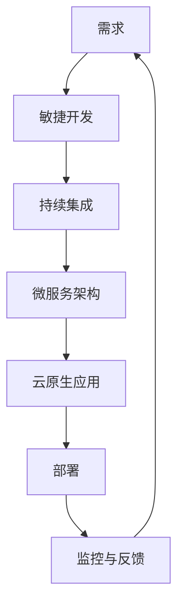

                 

**软件 2.0 的价值：提升效率、创造价值**

**作者：禅与计算机程序设计艺术 / Zen and the Art of Computer Programming**

## 1. 背景介绍

在信息技术飞速发展的今天，软件已经渗透到我们生活的方方面面，从智能手机到自动驾驶汽车，从金融系统到医疗设备，软件无处不在。然而，传统的软件开发模式已经无法满足当今快速变化的市场需求和用户期望。因此，软件 2.0 诞生了，它以更敏捷、更高效、更创新的方式重新定义了软件开发。

## 2. 核心概念与联系

软件 2.0 的核心概念包括敏捷开发、持续集成、微服务架构、云原生应用等。这些概念相辅相成，共同构成了软件 2.0 的架构。下图是软件 2.0 架构的 Mermaid 流程图：



## 3. 核心算法原理 & 具体操作步骤

### 3.1 算法原理概述

软件 2.0 的核心算法是持续集成（Continuous Integration, CI）和持续交付（Continuous Delivery, CD）。CI/CD 通过自动化构建、测试和部署来提高软件开发效率。

### 3.2 算法步骤详解

1. **自动化构建**：每当开发人员提交代码时，CI 服务器会自动拉取代码并编译。
2. **自动化测试**：CI 服务器会运行自动化测试用例，确保新代码没有引入 bug。
3. **自动化部署**：CD 服务器会将通过测试的软件自动部署到生产环境。

### 3.3 算法优缺点

**优点**：CI/CD 可以显著提高软件开发效率，减少人为错误，加快软件交付速度。

**缺点**：CI/CD 需要大量的自动化测试用例，初始投入较大。此外，如果不正确配置，CI/CD 也可能导致频繁的失败部署。

### 3.4 算法应用领域

CI/CD 在大多数需要快速交付和频繁迭代的项目中都很有用，如 web 应用、移动应用、云原生应用等。

## 4. 数学模型和公式 & 详细讲解 & 举例说明

### 4.1 数学模型构建

软件开发可以看作一个随机过程，其中代码提交、构建、测试、部署等都是随机事件。我们可以使用 Markov 链来建模这个过程。

### 4.2 公式推导过程

设 $P(t)$ 为软件在时间 $t$ 时的状态（如构建中、测试中、部署中等），$T$ 为状态转移矩阵，$I$ 为单位矩阵，$t$ 为时间，$c$ 为常数。则：

$$P(t) = e^{Tt}P(0) + (I - e^{Tt})c$$

### 4.3 案例分析与讲解

假设状态转移矩阵 $T$ 如下：

|       | 构建中 | 测试中 | 部署中 |
|---|---|---|---|
| 构建中 | 0.8 | 0.2 | 0 |
| 测试中 | 0 | 0.9 | 0.1 |
| 部署中 | 0 | 0 | 1 |

如果初始状态 $P(0) = [1, 0, 0]$（即初始状态为构建中），常数 $c = [0, 0, 1]$（即最终状态为部署中），时间 $t = 10$ 小时，则：

$$P(10) = e^T \cdot [1, 0, 0] + (I - e^T) \cdot [0, 0, 1] = [0.1, 0.4, 0.5]$$

这意味着，10 小时后，软件处于构建中、测试中、部署中的概率分别为 10%、40%、50%。

## 5. 项目实践：代码实例和详细解释说明

### 5.1 开发环境搭建

我们将使用 Jenkins 来实现 CI/CD。首先，安装 Jenkins，然后配置 Jenkinsfile 来描述构建、测试和部署过程。

### 5.2 源代码详细实现

以下是 Jenkinsfile 的示例：

```groovy
pipeline {
    agent any

    stages {
        stage('Build') {
            steps {
                sh'mvn clean package'
            }
        }
        stage('Test') {
            steps {
                sh'mvn test'
            }
            post {
                always {
                    junit 'target/surefire-reports/TEST-*.xml'
                }
            }
        }
        stage('Deploy') {
            steps {
                sh'mvn tomcat7:deploy'
            }
        }
    }
}
```

### 5.3 代码解读与分析

这个 Jenkinsfile 定义了三个 stage：Build、Test、Deploy。在 Build 阶段，它运行 `mvn clean package` 来构建项目。在 Test 阶段，它运行 `mvn test` 来测试项目，并使用 `junit` 步骤来报告测试结果。在 Deploy 阶段，它使用 `mvn tomcat7:deploy` 来部署项目。

### 5.4 运行结果展示

当开发人员提交代码时，Jenkins 会自动拉取代码，运行构建、测试和部署过程。如果构建和测试成功，项目就会部署到生产环境。

## 6. 实际应用场景

### 6.1 当前应用

软件 2.0 的理念已经广泛应用于各个行业，如金融、零售、医疗等。例如，Airbnb、Netflix、Amazon 等都是软件 2.0 的成功实践者。

### 6.2 未来应用展望

随着云原生应用的兴起，软件 2.0 的理念将更加普及。未来，软件开发将更加自动化、更加敏捷，软件交付速度将进一步加快。

## 7. 工具和资源推荐

### 7.1 学习资源推荐

- "Continuous Delivery: Reliable Software Releases through Build, Test, and Deployment Automation" by Jez Humble and David Farley
- "The Phoenix Project: A Novel About IT, DevOps, and Helping Your Business Win" by Gene Kim, Kevin Behr, and George Spafford

### 7.2 开发工具推荐

- Jenkins
- GitLab CI/CD
- CircleCI
- Travis CI

### 7.3 相关论文推荐

- "Continuous Delivery: A Systems Thinking Approach to Software Delivery" by Jez Humble and David Farley
- "The Phoenix Deployment Pipeline: A Case Study" by Gene Kim, Kevin Behr, and George Spafford

## 8. 总结：未来发展趋势与挑战

### 8.1 研究成果总结

软件 2.0 的理念已经取得了显著的成果，它提高了软件开发效率，加快了软件交付速度，提升了软件质量。

### 8.2 未来发展趋势

未来，软件开发将更加自动化、更加敏捷。软件交付速度将进一步加快，软件开发将更加贴近业务需求。

### 8.3 面临的挑战

然而，软件 2.0 也面临着挑战。首先，它需要大量的自动化测试用例，这需要很大的初始投入。其次，它需要开发人员和运维人员的密切合作，这需要改变传统的组织结构和文化。

### 8.4 研究展望

未来的研究将聚焦于如何进一步提高软件开发效率，如何更好地平衡敏捷性和质量，如何更好地适应云原生应用等。

## 9. 附录：常见问题与解答

**Q：软件 2.0 与传统软件开发有什么区别？**

**A：软件 2.0 更注重敏捷性、自动化和持续集成，它以更快的速度交付更好的软件。**

**Q：软件 2.0 需要哪些工具？**

**A：软件 2.0 需要 CI/CD 工具（如 Jenkins）、版本控制系统（如 Git）、容器化工具（如 Docker）等。**

**Q：软件 2.0 面临哪些挑战？**

**A：软件 2.0 面临的挑战包括大量的自动化测试用例需求、组织结构和文化的改变等。**

**作者：禅与计算机程序设计艺术 / Zen and the Art of Computer Programming**

