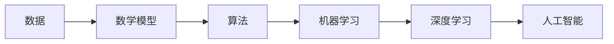

                 

人工智能、软件2.0、哲学、本质、算法、数学模型、项目实践、应用场景、工具资源、未来发展

## 1. 背景介绍

在信息技术飞速发展的今天，人工智能（AI）已经渗透到我们的日常生活和工作的方方面面。从搜索引擎到自动驾驶汽车，从智能手机到医疗诊断，AI无处不在。然而，在此之外，我们是否思考过AI的本质是什么？它是如何工作的？它的未来发展趋势是什么？本文将从哲学的角度出发，深入探讨人工智能的本质，并结合具体的算法和项目实践，为读者提供一个全面的理解。

## 2. 核心概念与联系

### 2.1 核心概念

在讨论人工智能的本质之前，我们需要先明确几个核心概念：

- **算法（Algorithm）**：一系列计算步骤的集合，用于解决特定的问题或执行特定的任务。
- **数学模型（Mathematical Model）**：用数学语言描述的系统或过程，用于理解和预测现实世界的行为。
- **机器学习（Machine Learning）**：一种人工智能的分支，它使得系统能够从数据中学习，不需要被明确编程。
- **深度学习（Deep Learning）**：一种机器学习的方法，它使用神经网络模型，模仿人类大脑的结构和功能。

### 2.2 核心概念联系

这些概念是如何联系在一起的呢？我们可以用下面的 Mermaid 流程图来表示：



在这个图中，数据是一切的起点。我们使用数学模型来描述和理解数据，然后使用算法来处理数据。机器学习和深度学习是人工智能的两个分支，它们使用特定的算法和数学模型来从数据中学习。

## 3. 核心算法原理 & 具体操作步骤

### 3.1 算法原理概述

人工智能的核心是算法。算法是一系列计算步骤的集合，用于解决特定的问题或执行特定的任务。在人工智能领域，最常用的算法是机器学习算法，它使得系统能够从数据中学习，不需要被明确编程。

### 3.2 算法步骤详解

机器学习算法的一般步骤如下：

1. **数据收集**：收集与问题相关的数据。
2. **数据预处理**：清洗和转换数据，使其适合于机器学习算法。
3. **特征选择**：选择最相关的特征（变量），忽略不相关的特征。
4. **模型选择**：选择合适的机器学习模型。
5. **模型训练**：使用训练数据（一部分数据）来训练模型。
6. **模型评估**：使用测试数据（另一部分数据）来评估模型的性能。
7. **模型优化**：根据评估结果，调整模型的参数，以提高模型的性能。
8. **预测**：使用训练好的模型来预测新数据的结果。

### 3.3 算法优缺点

机器学习算法有其优缺点。优点包括：

- **自动化**：机器学习算法可以自动从数据中学习，无需人工编程。
- **适应性**：机器学习算法可以适应新数据，不断改进其性能。
- **泛化能力**：机器学习算法可以在新数据上做出准确的预测。

缺点包括：

- **数据依赖**：机器学习算法需要大量的数据来训练，否则其性能会受到影响。
- **解释性**：机器学习算法通常是“黑盒”，很难解释其预测的原因。
- **计算资源**：机器学习算法通常需要大量的计算资源，才能训练和运行。

### 3.4 算法应用领域

机器学习算法有广泛的应用领域，包括：

- **图像识别**：用于识别图像中的物体，如人脸识别。
- **自然语言处理**：用于理解和生成人类语言，如机器翻译。
- **预测分析**：用于预测未来的结果，如股票价格预测。
- **推荐系统**：用于推荐用户感兴趣的内容，如电影推荐。

## 4. 数学模型和公式 & 详细讲解 & 举例说明

### 4.1 数学模型构建

数学模型是人工智能的基础。它用数学语言描述系统或过程，用于理解和预测现实世界的行为。例如，线性回归是一种简单的数学模型，用于预测连续变量的值。它的数学表达式为：

$$y = wx + b$$

其中，$y$是预测的结果，$x$是输入的特征，$w$是权重，$b$是偏置项。

### 4.2 公式推导过程

线性回归模型的权重和偏置项可以通过最小化平方误差来学习。平方误差的公式为：

$$E = \frac{1}{n}\sum_{i=1}^{n}(y_i - \hat{y}_i)^2$$

其中，$y_i$是真实的结果，$\hat{y}_i$是预测的结果，$n$是数据的数量。我们可以使用梯度下降算法来最小化这个误差。

### 4.3 案例分析与讲解

让我们以预测房价为例来说明线性回归模型的应用。我们有房屋的面积（平方米）和对应的房价（万美元）的数据。我们可以使用线性回归模型来预测房价。具体步骤如下：

1. **数据收集**：收集房屋面积和房价的数据。
2. **数据预处理**：将数据转换为适合于线性回归模型的形式。
3. **模型选择**：选择线性回归模型。
4. **模型训练**：使用梯度下降算法来学习权重和偏置项。
5. **模型评估**：使用测试数据来评估模型的性能。
6. **预测**：使用训练好的模型来预测新数据的房价。

## 5. 项目实践：代码实例和详细解释说明

### 5.1 开发环境搭建

要实现线性回归模型，我们需要安装 Python 和相关的库，如 NumPy、Pandas、Matplotlib 和 Scikit-learn。我们可以使用以下命令来安装这些库：

```bash
pip install numpy pandas matplotlib scikit-learn
```

### 5.2 源代码详细实现

以下是使用 Scikit-learn 实现线性回归模型的代码：

```python
from sklearn.linear_model import LinearRegression
from sklearn.model_selection import train_test_split
from sklearn.metrics import mean_squared_error
import numpy as np
import pandas as pd
import matplotlib.pyplot as plt

# 读取数据
data = pd.read_csv('housing.csv')

# 分割数据为特征和结果
X = data[['square_feet']]
y = data['price']

# 分割数据为训练集和测试集
X_train, X_test, y_train, y_test = train_test_split(X, y, test_size=0.2, random_state=42)

# 创建线性回归模型
model = LinearRegression()

# 训练模型
model.fit(X_train, y_train)

# 预测测试集的结果
y_pred = model.predict(X_test)

# 评估模型
mse = mean_squared_error(y_test, y_pred)
print('Mean Squared Error:', mse)

# 绘制预测结果
plt.scatter(X_test, y_test, color='black')
plt.plot(X_test, y_pred, color='blue', linewidth=2)
plt.show()
```

### 5.3 代码解读与分析

这段代码使用 Scikit-learn 的 `LinearRegression` 类来实现线性回归模型。它首先读取房屋面积和房价的数据，然后分割数据为训练集和测试集。它使用训练集来训练模型，然后使用测试集来评估模型的性能。最后，它绘制预测结果和真实结果的图表。

### 5.4 运行结果展示

运行这段代码后，我们会得到模型的均方误差（Mean Squared Error）和一个图表。图表显示了预测结果和真实结果的关系。如果模型的性能良好，预测结果应该接近真实结果。

## 6. 实际应用场景

### 6.1 当前应用

人工智能已经广泛应用于各个领域。例如，在医疗领域，人工智能可以帮助医生诊断疾病，预测病情发展。在金融领域，人工智能可以帮助银行预测客户的信用风险，优化投资组合。在交通领域，人工智能可以帮助自动驾驶汽车导航和避免碰撞。

### 6.2 未来应用展望

未来，人工智能的应用将会更加广泛。例如，在教育领域，人工智能可以个性化地定制学习计划，帮助学生提高学习效率。在环境领域，人工智能可以帮助监测和预测气候变化，优化资源利用。在艺术领域，人工智能可以创作音乐、绘画和文学作品。

## 7. 工具和资源推荐

### 7.1 学习资源推荐

- **书籍**：《机器学习》作者：Tom Mitchell、《深度学习》作者：Ian Goodfellow、Yoshua Bengio、Aaron Courville
- **在线课程**：Coursera、Udacity、edX
- **论坛**：Stack Overflow、Kaggle

### 7.2 开发工具推荐

- **编程语言**：Python、R
- **开发环境**：Jupyter Notebook、Anaconda
- **库和框架**：TensorFlow、PyTorch、Scikit-learn

### 7.3 相关论文推荐

- **机器学习**：《支持向量机》作者：Vladimir Vapnik、《随机森林》作者：Leo Breiman
- **深度学习**：《深度学习中的长短期记忆网络》作者：Sepp Hochreiter、Jürgen Schmidhuber、《生成对抗网络》作者：Ian Goodfellow、Jean Pouget-Abadie、Mehdi Mirza

## 8. 总结：未来发展趋势与挑战

### 8.1 研究成果总结

人工智能已经取得了巨大的成就，从图像识别到自然语言处理，从自动驾驶到医疗诊断，人工智能无处不在。然而，我们仍然面临着许多挑战。

### 8.2 未来发展趋势

未来，人工智能的发展趋势包括：

- **自监督学习**：自监督学习是一种新的机器学习方法，它可以从未标记的数据中学习，无需人工标注。
- **生成式模型**：生成式模型可以生成新的数据，如图像和文本。未来，生成式模型将会更加强大，可以创作音乐、绘画和文学作品。
- **可解释的人工智能**：当前的人工智能模型通常是“黑盒”，很难解释其预测的原因。未来，我们需要开发可解释的人工智能模型，以提高其可靠性和可信度。

### 8.3 面临的挑战

人工智能面临的挑战包括：

- **数据隐私**：人工智能需要大量的数据来训练，但这也带来了数据隐私的问题。未来，我们需要开发新的技术来保护数据隐私，同时又能够训练有效的人工智能模型。
- **算法偏见**：人工智能模型可能会受到训练数据的偏见影响，从而导致不公平的结果。未来，我们需要开发新的技术来检测和消除算法偏见。
- **计算资源**：人工智能模型通常需要大量的计算资源来训练和运行。未来，我们需要开发新的技术来优化计算资源的利用，以降低成本和提高效率。

### 8.4 研究展望

未来，人工智能的研究将会集中在以下几个方向：

- **多模式学习**：多模式学习是一种新的机器学习方法，它可以处理多种类型的数据，如文本、图像和音频。
- **强化学习**：强化学习是一种机器学习方法，它可以学习最优的行为策略，以最大化长期回报。未来，强化学习将会更加强大，可以应用于更复杂的任务。
- **人机协作**：人机协作是一种新的研究方向，它旨在开发新的技术，使人和机器能够协同工作，共同完成任务。

## 9. 附录：常见问题与解答

**Q1：什么是人工智能？**

A1：人工智能（AI）是指模拟人类智能行为的计算机程序。它包括机器学习、自然语言处理、计算机视觉和其他领域。

**Q2：人工智能是如何工作的？**

A2：人工智能是通过学习数据来工作的。它使用机器学习算法来从数据中学习，然后使用学习到的模型来预测新数据的结果。

**Q3：人工智能有哪些应用领域？**

A3：人工智能有广泛的应用领域，包括图像识别、自然语言处理、预测分析、推荐系统等。

**Q4：人工智能面临哪些挑战？**

A4：人工智能面临的挑战包括数据隐私、算法偏见和计算资源等。

**Q5：未来人工智能的发展趋势是什么？**

A5：未来人工智能的发展趋势包括自监督学习、生成式模型和可解释的人工智能等。

## 作者：禅与计算机程序设计艺术 / Zen and the Art of Computer Programming

