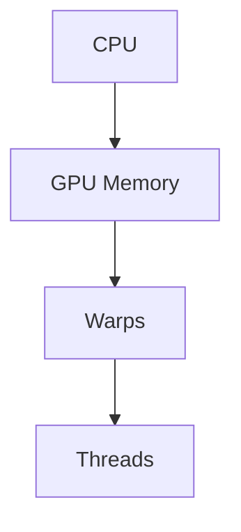

                 

**黄仁勋与NVIDIA的AI算力革命**

**作者：禅与计算机程序设计艺术 / Zen and the Art of Computer Programming**

## 1. 背景介绍

在当今的计算机领域，人工智能（AI）已经成为最具前途和影响力的技术之一。然而，AI的发展离不开强大的算力支撑。本文将聚焦于NVIDIA及其CEO黄仁勋在AI算力领域的革命性贡献，探讨他们如何通过不断创新的GPU技术和软件平台，推动了AI的发展。

## 2. 核心概念与联系

NVIDIA的CUDA（Compute Unified Device Architecture）平台是其GPU技术的核心，它允许程序员将通用计算任务分配给GPU，从而大大提高了并行处理能力。CUDA的架构如下图所示：



在CUDA中，GPU内存被划分为多个warp，每个warp包含多个线程。线程的并行执行是CUDA的关键特性，它允许GPU高效地处理大规模数据并行任务。

## 3. 核心算法原理 & 具体操作步骤

### 3.1 算法原理概述

NVIDIA的GPU技术在AI领域的应用主要体现在深度学习框架中。深度学习是一种机器学习方法，它模仿人脑的神经网络结构，通过多层神经元的连接和权重调整，实现对数据的学习和预测。

### 3.2 算法步骤详解

深度学习算法的训练过程通常包括以下步骤：

1. **前向传播（Forward Propagation）**：计算神经网络的输出，并计算损失函数。
2. **反向传播（Backward Propagation）**：计算每层神经元的梯度，以更新权重和偏置项。
3. **权重更新**：使用梯度下降法或其变种（如Adam）更新神经网络的权重和偏置项。

### 3.3 算法优缺点

深度学习算法的优点包括：

- **高准确性**：在图像、语音和自然语言处理等领域表现出色。
- **自动特征提取**：无需人工设计特征，网络可以自动学习。

其缺点包括：

- **计算资源需求高**：深度学习模型的训练需要大量的计算资源。
- **训练时间长**：深度学习模型的训练过程通常需要数小时甚至数天。

### 3.4 算法应用领域

深度学习在计算机视觉、自然语言处理、语音识别等领域有着广泛的应用。例如，自动驾驶汽车、语音助手和图像识别系统等都离不开深度学习技术。

## 4. 数学模型和公式 & 详细讲解 & 举例说明

### 4.1 数学模型构建

深度学习模型的数学基础是神经网络。一个简单的全连接神经网络可以表示为：

$$y = \sigma(wx + b)$$

其中，$x$是输入向量，$w$是权重向量，$b$是偏置项，$\sigma$是激活函数（如ReLU），$y$是输出。

### 4.2 公式推导过程

深度学习模型的训练过程涉及到梯度下降法。给定一个损失函数$L(y, \hat{y})$，我们的目标是最小化$L$关于权重$w$和偏置项$b$的值。梯度下降法更新规则为：

$$w := w - \eta \frac{\partial L}{\partial w}$$
$$b := b - \eta \frac{\partial L}{\partial b}$$

其中，$\eta$是学习率。

### 4.3 案例分析与讲解

例如，在图像分类任务中，我们可以使用一个全连接神经网络来预测图像的类别。给定一张图像的特征向量$x$和真实标签$y$，我们可以使用交叉熵损失函数：

$$L(y, \hat{y}) = -\sum_{i=1}^{C}y_i\log(\hat{y}_i)$$

其中，$C$是类别数，$\hat{y}$是模型的预测输出。通过梯度下降法更新权重$w$和偏置项$b$，我们可以最小化损失函数，从而提高模型的准确性。

## 5. 项目实践：代码实例和详细解释说明

### 5.1 开发环境搭建

要在NVIDIA GPU上训练深度学习模型，我们需要安装CUDA工具包和一个深度学习框架，如TensorFlow或PyTorch。以下是搭建开发环境的步骤：

1. 安装CUDA工具包：访问[官方网站](https://developer.nvidia.com/cuda-downloads)下载并安装CUDA。
2. 安装深度学习框架：使用pip安装TensorFlow或PyTorch。

### 5.2 源代码详细实现

以下是一个简单的全连接神经网络的TensorFlow实现：

```python
import tensorflow as tf

# 定义输入和输出维度
input_dim = 100
output_dim = 10

# 定义权重和偏置项
w = tf.Variable(tf.random.normal([input_dim, output_dim]))
b = tf.Variable(tf.zeros([output_dim]))

# 定义前向传播过程
def forward(x):
    return tf.matmul(x, w) + b

# 定义损失函数
def loss(y_true, y_pred):
    return tf.reduce_mean(tf.nn.softmax_cross_entropy_with_logits(y_true, y_pred))

# 定义梯度下降优化器
optimizer = tf.optimizers.SGD(learning_rate=0.01)

# 定义训练步骤
@tf.function
def train_step(x, y):
    with tf.GradientTape() as tape:
        y_pred = forward(x)
        loss_value = loss(y, y_pred)
    gradients = tape.gradient(loss_value, [w, b])
    optimizer.apply_gradients(zip(gradients, [w, b]))
    return loss_value
```

### 5.3 代码解读与分析

在上述代码中，我们首先定义了输入和输出维度，然后初始化权重和偏置项。我们定义了前向传播过程，损失函数和梯度下降优化器。最后，我们定义了一个训练步骤，在每个步骤中，我们计算梯度并更新权重和偏置项。

### 5.4 运行结果展示

在训练过程中，我们可以监控损失函数的值，并观察其如何随着训练步数的增加而减小。当损失函数收敛时，我们可以评估模型的准确性。

## 6. 实际应用场景

### 6.1 当前应用

NVIDIA的GPU技术已经广泛应用于各种AI领域，包括自动驾驶、医疗成像、语音识别和自然语言处理等。例如，Waymo使用NVIDIA的GPU来训练其自动驾驶系统，而DeepMind使用NVIDIA的GPU来训练其AlphaGo程序。

### 6.2 未来应用展望

未来，NVIDIA的GPU技术将继续推动AI的发展。随着深度学习模型的复杂性不断增加，对更强大的算力的需求也将不断增长。NVIDIA正在开发新一代GPU和软件平台，以满足这些需求。

## 7. 工具和资源推荐

### 7.1 学习资源推荐

- **书籍**：《深度学习》作者：Ian Goodfellow、Yoshua Bengio、Aaron Courville
- **在线课程**：Coursera上的“深度学习”专业化课程

### 7.2 开发工具推荐

- **TensorFlow**：一个流行的深度学习框架。
- **PyTorch**：另一个流行的深度学习框架，具有动态计算图和丰富的生态系统。

### 7.3 相关论文推荐

- **LeCun, Y., Bengio, Y., & Hinton, G. (2015). Deep learning.** Nature, 521(7553), 436-444.
- **Vaswani, A., et al. (2017). Attention is all you need.** Advances in neural information processing systems, 30.

## 8. 总结：未来发展趋势与挑战

### 8.1 研究成果总结

本文介绍了NVIDIA及其CEO黄仁勋在AI算力领域的革命性贡献。我们讨论了CUDA平台的核心概念，深度学习算法的原理和应用，并提供了一个简单的项目实践。

### 8.2 未来发展趋势

未来，AI算力的发展将继续受益于GPU技术的进步。我们将看到更强大的GPU和更智能的软件平台，从而推动AI在各个领域的应用。

### 8.3 面临的挑战

然而，AI算力的发展也面临着挑战。其中包括：

- **能源效率**：随着模型复杂性的增加，训练过程需要消耗大量能源。
- **算力瓶颈**：随着数据量和模型复杂性的增加，算力需求也在不断增长。

### 8.4 研究展望

未来的研究将关注于开发更高效的算法和硬件架构，以克服能源效率和算力瓶颈。此外，我们也将看到更多的研究关注于AI的可解释性和安全性。

## 9. 附录：常见问题与解答

**Q：NVIDIA的GPU技术如何与CPU技术相比？**

**A**：GPU技术优于CPU技术的地方在于其并行处理能力。GPU内部包含数千个核心，可以同时处理大量数据，从而大大提高了并行处理能力。相比之下，CPU内部只有几个核心，无法提供同样的并行处理能力。

**Q：深度学习算法的训练过程需要多久？**

**A**：深度学习算法的训练过程需要多久取决于模型的复杂性和数据量。通常，训练过程需要数小时甚至数天。然而，使用GPU技术可以大大缩短训练时间。

**Q：如何评估深度学习模型的性能？**

**A**：评估深度学习模型性能的常用指标包括准确性、精确度、召回率和F1分数。此外，我们还可以使用交叉验证技术来评估模型的泛化能力。

**Q：深度学习算法的优点是什么？**

**A**：深度学习算法的优点包括高准确性、自动特征提取和泛化能力。然而，其缺点包括计算资源需求高和训练时间长。

**Q：未来AI算力的发展方向是什么？**

**A**：未来AI算力的发展方向包括开发更高效的算法和硬件架构，以克服能源效率和算力瓶颈。此外，我们也将看到更多的研究关注于AI的可解释性和安全性。

**END**

