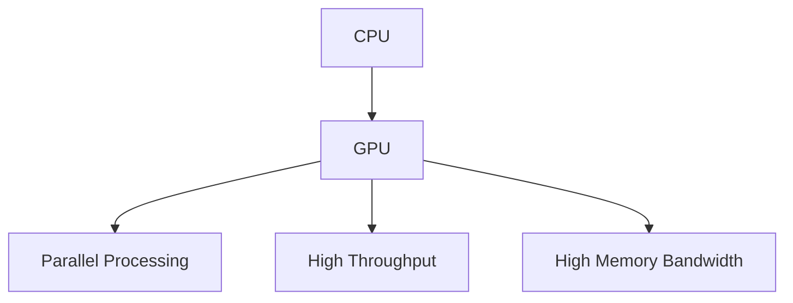

                 

**NVIDIA**, **GPU**, **CUDA**, **Parallel Computing**, **Deep Learning**, **AI**

## 1. 背景介绍

黄仁勋（Jen-Hsun Huang），生于1963年，是NVIDIA公司的创始人和CEO。他被誉为“GPU之父”，因为他领导NVIDIA开发了世界上第一款商用GPU（Graphics Processing Unit），从而改变了计算机图形学和人工智能的发展进程。本文将深入探讨黄仁勋的贡献，以及GPU在计算领域的核心作用。

## 2. 核心概念与联系

### 2.1 GPU的定义与作用

GPU是一种专门为图形渲染而设计的并行处理器。它具有大量的核心（或称为处理单元），每个核心都可以并行执行相同的任务。与CPU不同，GPU更擅长于大量数据的并行处理，这使其成为高性能计算和人工智能领域的关键组件。



### 2.2 CUDA：GPU编程接口

CUDA（Compute Unified Device Architecture）是NVIDIA开发的并行计算平台和编程模型，允许开发人员在GPU上执行通用计算任务。CUDA使得GPU不再只是图形处理单元，而是成为通用并行处理器。

## 3. 核心算法原理 & 具体操作步骤

### 3.1 算法原理概述

GPU上的并行计算是通过将任务分解为大量的数据并行线程来实现的。这些线程组织成网格和块，每个块包含多个线程，所有块组成网格。每个线程执行相同的指令，但操作不同的数据。

### 3.2 算法步骤详解

1. **数据分布**：将数据分布到GPU的全局内存中。
2. **线程配置**：配置线程网格和块，并为每个线程分配数据。
3. **执行核函数**：在GPU上执行核函数，该函数包含要并行执行的指令。
4. **同步与通信**：线程块内的线程同步，并通过共享内存进行通信。
5. **结果收集**：从GPU的全局内存中收集结果。

### 3.3 算法优缺点

**优点**：高吞吐量、高内存带宽、高并行性。

**缺点**：全局内存访问延迟高、功耗高、编程复杂性高。

### 3.4 算法应用领域

GPU加速的应用领域包括图形学、物理模拟、金融数值计算、人工智能和机器学习等。

## 4. 数学模型和公式 & 详细讲解 & 举例说明

### 4.1 数学模型构建

GPU上的并行计算可以表示为以下数学模型：

$$T_{total} = T_{setup} + T_{kernel} + T_{teardown}$$

其中，$T_{setup}$是数据传输和线程配置的时间，$T_{kernel}$是核函数执行的时间，$T_{teardown}$是结果收集的时间。

### 4.2 公式推导过程

GPU的性能可以通过以下公式估算：

$$P = \frac{W}{T_{kernel} + T_{setup} + T_{teardown}}$$

其中，$W$是要处理的总工作量，$T_{kernel}$，$T_{setup}$，$T_{teardown}$是上述模型中的时间。

### 4.3 案例分析与讲解

例如，假设要在GPU上执行一个简单的矢量加法操作。总工作量$W$为$N$个元素的向量，每个元素需要$T_{kernel}$时间单位处理。如果数据传输和线程配置需要$T_{setup}$时间单位，结果收集需要$T_{teardown}$时间单位，则总时间为：

$$T_{total} = T_{setup} + N \cdot T_{kernel} + T_{teardown}$$

## 5. 项目实践：代码实例和详细解释说明

### 5.1 开发环境搭建

要在NVIDIA GPU上执行CUDA代码，需要安装CUDA工具包，并配置开发环境。详细步骤请参考[NVIDIA官方文档](https://developer.nvidia.com/cuda-downloads)。

### 5.2 源代码详细实现

以下是一个简单的CUDA核函数，实现矢量加法操作：

```cuda
__global__ void vecAdd(const float* A, const float* B, float* C) {
    int idx = blockIdx.x * blockDim.x + threadIdx.x;
    C[idx] = A[idx] + B[idx];
}
```

### 5.3 代码解读与分析

`vecAdd`函数是一个CUDA核函数，它接受三个输入向量`A`，`B`和`C`，并将`A`和`B`的元素相加，结果存储在`C`中。`idx`是线程的全局索引，它由块索引`blockIdx.x`和线程索引`threadIdx.x`计算得出。

### 5.4 运行结果展示

在GPU上执行`vecAdd`函数，并验证结果与CPU上的实现一致。

## 6. 实际应用场景

### 6.1 图形学

GPU最初是为图形学而设计的，它可以高效地渲染复杂的3D场景。

### 6.2 深度学习

GPU在深度学习领域扮演着关键角色，因为它可以高效地执行矩阵乘法和其他并行可分解的操作。

### 6.3 未来应用展望

未来，GPU可能会继续扩展其作用，从量子计算到生物信息学，都有可能受益于GPU加速。

## 7. 工具和资源推荐

### 7.1 学习资源推荐

- [NVIDIA CUDA C Programming Guide](https://docs.nvidia.com/cuda/cuda-c-programming-guide/index.html)
- [Deep Learning with CUDA](https://developer.nvidia.com/rdp/machine-learning-cuda)

### 7.2 开发工具推荐

- [Visual Profiler](https://developer.nvidia.com/rdp/visual-profiler)
- [Nsight](https://developer.nvidia.com/nsight)

### 7.3 相关论文推荐

- [A Survey of General-Purpose GPU Computing](https://ieeexplore.ieee.org/document/4033244)
- [Deep Learning on GPUs: A Survey](https://arxiv.org/abs/1806.04068)

## 8. 总结：未来发展趋势与挑战

### 8.1 研究成果总结

GPU在高性能计算和人工智能领域取得了显著成就，但仍有改进空间。

### 8.2 未来发展趋势

未来，GPU可能会继续发展，以支持更复杂的应用，如量子计算和分子动力学。

### 8.3 面临的挑战

GPU面临的挑战包括功耗、编程复杂性和全局内存访问延迟。

### 8.4 研究展望

未来的研究可能会集中在GPU的能效、编程模型和内存体系结构等领域。

## 9. 附录：常见问题与解答

**Q：GPU和CPU有什么区别？**

**A：GPU更擅长于大量数据的并行处理，而CPU更擅长于串行处理和决策逻辑。**

**Q：如何学习CUDA编程？**

**A：NVIDIA提供了丰富的学习资源，包括在线文档和教程。此外，还有许多在线课程和书籍可以学习CUDA编程。**

**Q：GPU在人工智能领域的作用是什么？**

**A：GPU在人工智能领域的作用包括加速神经网络的训练和推理，以及支持大规模数据集的处理。**

## 作者：禅与计算机程序设计艺术 / Zen and the Art of Computer Programming

