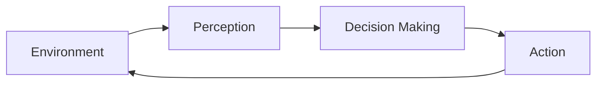

                 

## AI Agent技术发展的未来展望

> 关键词：强化学习、深度学习、多智能体系统、自适应控制、人工智能安全

## 1. 背景介绍

人工智能（AI）代理（Agent）是指能够感知环境并自主学习和决策以实现特定目标的软件系统。AI代理在各种领域，如自动驾驶、游戏、机器人控制和电力网络管理等，都发挥着关键作用。随着AI技术的不断发展，AI代理的能力和应用领域也在不断扩展。本文将探讨AI代理技术的未来发展趋势，包括强化学习的进展、多智能体系统的应用、自适应控制的突破和人工智能安全的挑战。

## 2. 核心概念与联系

### 2.1 AI代理的定义与架构

AI代理可以被定义为能够感知环境、学习和决策的智能系统。其架构通常包括感知、决策和行动三个主要组成部分。感知模块负责从环境中获取信息，决策模块根据感知到的信息和预设目标做出决策，行动模块则根据决策执行相应的动作。



### 2.2 AI代理与强化学习

强化学习（RL）是一种机器学习方法，它允许智能体在与环境交互的过程中学习最佳行为。AI代理通常使用强化学习算法来学习决策，以实现预设的目标。强化学习算法的核心是代理通过试错学习，从环境中获取反馈，并根据反馈调整其行为。

## 3. 核心算法原理 & 具体操作步骤

### 3.1 算法原理概述

强化学习算法的核心原理是代理通过试错学习，从环境中获取反馈，并根据反馈调整其行为。代理会接收环境的状态，根据当前状态选择一个动作，然后环境根据动作提供反馈，代理根据反馈更新其决策策略。

### 3.2 算法步骤详解

强化学习算法的步骤通常包括：

1. 初始化代理的决策策略。
2. 代理感知环境的当前状态。
3. 代理根据当前状态选择一个动作。
4. 环境根据动作提供反馈，通常是奖励或惩罚。
5. 代理根据反馈更新其决策策略。
6. 重复步骤2-5，直到代理学习到最佳决策策略。

### 3.3 算法优缺点

强化学习算法的优点包括能够学习最佳决策策略，适应动态环境，无需大量的标记数据。其缺点包括学习速度慢，容易陷入局部最优解，对环境的状态空间和动作空间要求高。

### 3.4 算法应用领域

强化学习算法在各种领域都有广泛应用，包括游戏（如AlphaGo）、机器人控制、自动驾驶、电力网络管理和资源配置等。

## 4. 数学模型和公式 & 详细讲解 & 举例说明

### 4.1 数学模型构建

强化学习的数学模型通常包括环境模型、代理模型和学习算法模型。环境模型描述环境的状态转移和奖励函数，代理模型描述代理的决策策略，学习算法模型描述代理如何更新其决策策略。

### 4.2 公式推导过程

强化学习的数学公式包括状态转移函数、奖励函数和值函数。状态转移函数描述环境在给定状态和动作下的下一个状态，奖励函数描述环境提供的反馈，值函数描述代理预期的累积奖励。

状态转移函数通常表示为：

$$P(s_{t+1} | s_t, a_t) = \text{Probability of next state given current state and action}$$

奖励函数通常表示为：

$$R(s_t, a_t) = \text{Reward given current state and action}$$

值函数通常表示为：

$$V^\pi(s) = \text{Expected cumulative reward given state and policy}$$

### 4.3 案例分析与讲解

例如，在自动驾驶领域，强化学习算法可以用于学习最佳驾驶策略。环境模型描述道路、其他车辆和交通信号等，代理模型描述自动驾驶系统的决策策略，学习算法模型描述自动驾驶系统如何根据反馈更新其决策策略。

## 5. 项目实践：代码实例和详细解释说明

### 5.1 开发环境搭建

要实现强化学习算法，需要安装Python、NumPy、TensorFlow或PyTorch等库。此外，还需要一个开发环境，如Jupyter Notebook或PyCharm。

### 5.2 源代码详细实现

以下是一个简单的强化学习算法（Q-Learning）的Python实现示例：

```python
import numpy as np

# Define the environment and the Q-table
env =...  # Define the environment
Q = np.zeros((env.observation_space.n, env.action_space.n))

# Define the learning parameters
alpha = 0.1  # Learning rate
gamma = 0.95  # Discount factor
epsilon = 0.1  # Exploration rate

# Define the Q-learning algorithm
for episode in range(episodes):
    state = env.reset()
    done = False
    while not done:
        if np.random.uniform(0, 1) < epsilon:
            action = env.action_space.sample()  # Explore: choose a random action
        else:
            action = np.argmax(Q[state])  # Exploit: choose the best action
        next_state, reward, done, _ = env.step(action)
        Q[state, action] = (1 - alpha) * Q[state, action] + alpha * (reward + gamma * np.max(Q[next_state]))
        state = next_state
```

### 5.3 代码解读与分析

该代码实现了Q-Learning算法，代理在环境中学习最佳决策策略。代理首先初始化Q-table，然后在环境中执行一系列动作，根据环境的反馈更新Q-table。代理使用epsilon-greedy策略选择动作，在探索和利用之间进行平衡。

### 5.4 运行结果展示

运行该代码后，代理会学习到最佳决策策略，并能够在环境中获得最大累积奖励。

## 6. 实际应用场景

### 6.1 多智能体系统

多智能体系统（MAS）是指由多个智能体组成的系统，每个智能体都有自己的目标和决策能力。AI代理在MAS中发挥着关键作用，每个智能体都是一个AI代理，它们协同工作以实现系统的目标。例如，在自动驾驶领域，每辆车都是一个AI代理，它们协同工作以实现交通流畅和安全。

### 6.2 自适应控制

AI代理可以用于实现自适应控制，代理能够学习环境的动态变化，并调整其决策策略以适应环境的变化。例如，在电力网络管理领域，AI代理可以学习电力需求的变化，并调整电力输送以实现最佳效率。

### 6.3 未来应用展望

未来，AI代理技术将继续发展，并扩展到更多领域。例如，AI代理将在物联网（IoT）领域发挥关键作用，为各种设备提供智能控制和决策能力。此外，AI代理还将在人工智能安全领域发挥关键作用，帮助保护人工智能系统免受攻击和滥用。

## 7. 工具和资源推荐

### 7.1 学习资源推荐

推荐阅读《强化学习：机器学习序列》一书，该书提供了强化学习的详细介绍和实现示例。此外，还可以参考斯坦福大学的强化学习在线课程。

### 7.2 开发工具推荐

推荐使用Python、NumPy、TensorFlow或PyTorch等库实现强化学习算法。此外，还可以使用Gym库构建环境，并使用Stable Baselines3库实现强化学习算法。

### 7.3 相关论文推荐

推荐阅读《Deep Reinforcement Learning Hands-On》一书，该书提供了深度强化学习的详细介绍和实现示例。此外，还可以参考《Mastering the Game of Go with Generalized AlphaGo Zero》等相关论文。

## 8. 总结：未来发展趋势与挑战

### 8.1 研究成果总结

本文介绍了AI代理技术的未来发展趋势，包括强化学习的进展、多智能体系统的应用、自适应控制的突破和人工智能安全的挑战。此外，还提供了强化学习算法的数学模型和实现示例。

### 8.2 未来发展趋势

未来，AI代理技术将继续发展，并扩展到更多领域。此外，深度强化学习、多智能体系统和自适应控制等领域也将取得重大突破。

### 8.3 面临的挑战

AI代理技术面临的挑战包括学习速度慢、容易陷入局部最优解、对环境的状态空间和动作空间要求高等。此外，人工智能安全也是一个关键挑战，需要开发新的技术来保护人工智能系统免受攻击和滥用。

### 8.4 研究展望

未来的研究将关注于提高强化学习算法的学习速度和泛化能力，开发新的多智能体系统和自适应控制技术，并开发新的安全技术来保护人工智能系统。

## 9. 附录：常见问题与解答

### 9.1 什么是AI代理？

AI代理是指能够感知环境并自主学习和决策以实现特定目标的软件系统。

### 9.2 强化学习是什么？

强化学习是一种机器学习方法，它允许智能体在与环境交互的过程中学习最佳行为。

### 9.3 多智能体系统是什么？

多智能体系统是指由多个智能体组成的系统，每个智能体都有自己的目标和决策能力。

### 9.4 自适应控制是什么？

自适应控制是指代理能够学习环境的动态变化，并调整其决策策略以适应环境的变化。

### 9.5 人工智能安全是什么？

人工智能安全是指保护人工智能系统免受攻击和滥用的技术。

## 作者：禅与计算机程序设计艺术 / Zen and the Art of Computer Programming

