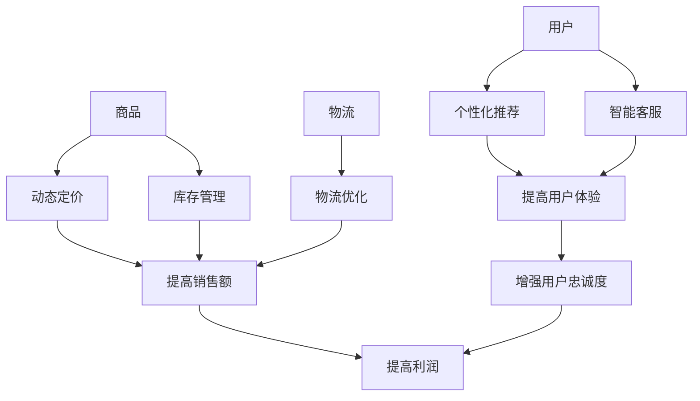

                 

**AI 如何改变用户的购物方式：技术变革与用户行为分析**

**作者：禅与计算机程序设计艺术 / Zen and the Art of Computer Programming**

## 1. 背景介绍

在当今数字化时代，电子商务已然成为主流，而人工智能（AI）正在重塑用户的购物方式。本文将深入探讨AI在电子商务中的应用，分析其如何改变用户的购物行为，并提供实践指南和工具推荐。

## 2. 核心概念与联系

### 2.1 AI在电子商务中的应用

AI在电子商务中的应用包括但不限于个性化推荐、智能客服、动态定价、库存管理和物流优化。这些应用都旨在提高用户体验，增强用户忠诚度，并最终提高销售额和利润。



### 2.2 用户行为分析

用户行为分析（User Behavior Analysis, UBA）是指通过分析用户在网站或应用程序上的行为数据，来理解用户需求和偏好的过程。AI技术在UBA中发挥着关键作用，帮助电子商务平台更好地理解和服务用户。

## 3. 核心算法原理 & 具体操作步骤

### 3.1 算法原理概述

本节将介绍两种常用的AI算法：协同过滤（Collaborative Filtering, CF）和深度学习（Deep Learning）在电子商务中的应用。

### 3.2 算法步骤详解

#### 3.2.1 协同过滤

1. **数据收集**：收集用户购买或浏览历史数据。
2. **相似度计算**：计算用户之间的相似度，通常使用余弦相似度或皮尔逊相关系数。
3. **推荐生成**：根据相似用户的行为，为目标用户生成商品推荐列表。

#### 3.2.2 深度学习

1. **数据预处理**：清洗和标准化数据，并将其转换为合适的格式。
2. **模型构建**：构建深度学习模型，如神经网络或循环神经网络。
3. **模型训练**：使用历史数据训练模型，优化模型参数。
4. **推荐生成**：使用训练好的模型，为目标用户生成商品推荐列表。

### 3.3 算法优缺点

| 算法 | 优点 | 缺点 |
| --- | --- | --- |
| 协同过滤 | 简单易行，无需理解商品特性 | 受数据规模限制，易出现冷启动问题 |
| 深度学习 | 可以学习复杂的商品特性，适应能力强 | 需要大量数据和计算资源，易出现过拟合 |

### 3.4 算法应用领域

两种算法都广泛应用于电子商务平台的个性化推荐系统。此外，深度学习还可用于图像识别（如商品图片搜索）和自然语言处理（如智能客服）。

## 4. 数学模型和公式 & 详细讲解 & 举例说明

### 4.1 数学模型构建

#### 4.1.1 余弦相似度

余弦相似度（Cosine Similarity）是一种常用的相似度度量方法，用于计算两个向量（用户或商品）之间的相似度。公式如下：

$$sim(u, v) = \frac{u \cdot v}{||u|| ||v||} = \frac{\sum_{i=1}^{n}u_iv_i}{\sqrt{\sum_{i=1}^{n}u_i^2}\sqrt{\sum_{i=1}^{n}v_i^2}}$$

其中，$u$和$v$分别是两个用户或商品的向量表示， $u_i$和$v_i$分别是向量$u$和$v$的第$i$个元素，$n$是向量维度。

#### 4.1.2 深度学习模型

深度学习模型通常由多层神经元组成，每层神经元都会对输入数据进行非线性变换。常用的深度学习模型包括全连接神经网络（FNN）、卷积神经网络（CNN）和循环神经网络（RNN）。

### 4.2 公式推导过程

#### 4.2.1 余弦相似度推导

余弦相似度的推导基于向量空间模型（Vector Space Model），将用户或商品表示为向量，并计算向量之间的夹角余弦值。余弦值越接近1，表示向量越相似。

#### 4.2.2 深度学习模型推导

深度学习模型的推导基于反向传播算法（Backpropagation），通过最小化损失函数来优化模型参数。常用的损失函数包括均方误差（MSE）和交叉熵（Cross-Entropy）。

### 4.3 案例分析与讲解

假设我们有以下用户购买历史数据：

| 用户 | 商品1 | 商品2 | 商品3 |
| --- | --- | --- | --- |
| 用户1 | 1 | 0 | 1 |
| 用户2 | 0 | 1 | 1 |
| 用户3 | 1 | 1 | 0 |

使用余弦相似度计算用户1和用户2的相似度：

$$sim(用户1, 用户2) = \frac{1 \times 0 + 0 \times 1 + 1 \times 1}{\sqrt{1^2 + 0^2 + 1^2} \sqrt{0^2 + 1^2 + 1^2}} = \frac{1}{\sqrt{2}} \approx 0.707$$

## 5. 项目实践：代码实例和详细解释说明

### 5.1 开发环境搭建

本项目使用Python语言，并依赖于NumPy、Pandas、Scikit-learn和TensorFlow等库。请确保已安装这些库，并创建一个新的Python项目。

### 5.2 源代码详细实现

#### 5.2.1 协同过滤实现

```python
import numpy as np
import pandas as pd
from sklearn.metrics.pairwise import cosine_similarity

# 假设我们有以下用户购买历史数据
data = {
    '用户': ['用户1', '用户2', '用户3'],
    '商品1': [1, 0, 1],
    '商品2': [0, 1, 1],
    '商品3': [1, 1, 0]
}
df = pd.DataFrame(data)

# 计算用户之间的余弦相似度
user_similarity = cosine_similarity(df.iloc[:, 1:], df.iloc[:, 1:])

# 为目标用户（用户1）生成商品推荐列表
target_user = '用户1'
recommendations = user_similarity[0].argsort()[:-2:-1]
print(f"为{target_user}推荐的商品：")
for i in recommendations:
    print(df.columns[i+1])
```

#### 5.2.2 深度学习实现

```python
import tensorflow as tf
from tensorflow.keras.models import Sequential
from tensorflow.keras.layers import Dense

# 假设我们有以下用户购买历史数据
data = {
    '用户': ['用户1', '用户2', '用户3'],
    '商品1': [1, 0, 1],
    '商品2': [0, 1, 1],
    '商品3': [1, 1, 0]
}
df = pd.DataFrame(data)

# 将数据转换为合适的格式
X = df.iloc[:, 1:].values
y = df['用户'].values

# 构建并训练深度学习模型
model = Sequential()
model.add(Dense(10, input_dim=3, activation='relu'))
model.add(Dense(1, activation='sigmoid'))
model.compile(loss='binary_crossentropy', optimizer='adam', metrics=['accuracy'])
model.fit(X, y, epochs=100, batch_size=10)

# 为目标用户（用户1）生成商品推荐列表
target_user = '用户1'
recommendations = model.predict(X[0].reshape(1, -1))[0]
print(f"为{target_user}推荐的商品：")
for i in range(len(recommendations)):
    if recommendations[i] > 0.5:
        print(df.columns[i+1])
```

### 5.3 代码解读与分析

本节提供了协同过滤和深度学习在电子商务中的简单实现。协同过滤使用余弦相似度计算用户之间的相似度，并为目标用户生成商品推荐列表。深度学习模型则使用全连接神经网络来预测用户是否会购买商品，并为目标用户生成商品推荐列表。

### 5.4 运行结果展示

运行上述代码，您将看到为目标用户（用户1）生成的商品推荐列表。请注意，这些推荐结果仅基于示例数据，在真实场景中，您需要使用更大规模和更丰富的数据集来训练模型。

## 6. 实际应用场景

### 6.1 个性化推荐系统

个性化推荐系统是AI在电子商务中最常见的应用之一。通过分析用户购买和浏览历史，为用户提供个性化商品推荐，可以提高用户体验和销售额。

### 6.2 智能客服

智能客服使用自然语言处理技术，为用户提供24/7在线客服支持。通过分析用户查询，智能客服可以提供准确和及时的响应，提高用户满意度。

### 6.3 动态定价

动态定价使用AI算法实时分析市场需求和竞争对手价格，为商品设置最佳价格。这可以帮助电子商务平台最大化利润和销售额。

### 6.4 未来应用展望

未来，AI在电子商务中的应用将更加广泛和深入。例如，AI可以用于预测库存需求，优化物流路线，甚至开发虚拟试穿和试用技术。

## 7. 工具和资源推荐

### 7.1 学习资源推荐

* "Recommender Systems: The Textbook" by Paul E. Jackson
* "Deep Learning" by Ian Goodfellow, Yoshua Bengio, and Aaron Courville
* "Hands-On Machine Learning with Scikit-Learn, Keras, and TensorFlow" by Aurélien Géron

### 7.2 开发工具推荐

* Python：一个强大的通用编程语言，广泛用于AI和数据分析。
* TensorFlow：一个流行的开源机器学习库，支持深度学习模型构建和训练。
* Scikit-learn：一个流行的开源机器学习库，支持各种传统机器学习算法。

### 7.3 相关论文推荐

* "The Wisdom of Crowds" by James Surowiecki
* "Amazon.com: Reinventing Customer Satisfaction" by John R. Hauser and Christian H. Werner
* "The Netflix Recommender System: Algorithms, Business Value, and Innovation" by Brent Smith, Simon Bradshaw, and Neil Hunt

## 8. 总结：未来发展趋势与挑战

### 8.1 研究成果总结

本文介绍了AI在电子商务中的应用，分析了其如何改变用户的购物方式，并提供了协同过滤和深度学习的实现示例。我们还讨论了AI在电子商务中的实际应用场景和未来发展趋势。

### 8.2 未来发展趋势

AI在电子商务中的应用将继续发展，未来趋势包括：

* 更智能的个性化推荐系统，可以学习用户的偏好变化和上下文信息。
* 更强大的自然语言处理技术，可以提供更准确和人性化的智能客服支持。
* 更先进的动态定价算法，可以实时适应市场需求和竞争对手价格。
* 更广泛的AI应用，如库存管理、物流优化和虚拟试穿试用技术。

### 8.3 面临的挑战

AI在电子商务中的应用也面临着挑战，包括：

* 数据隐私和安全问题，需要保护用户数据并防止数据滥用。
* 算法偏见和不公平问题，需要确保AI系统公平地对待所有用户。
* 算法解释性问题，需要开发可解释的AI算法，以帮助用户理解推荐结果。

### 8.4 研究展望

未来的研究将关注AI在电子商务中的更广泛和深入应用，包括：

* 发展更先进的AI算法，可以学习用户的上下文信息和偏好变化。
* 研究AI在电子商务中的道德和伦理问题，确保AI系统公平、透明和负责任。
* 研究AI在电子商务中的跨平台和跨渠道应用，如社交媒体和移动设备。

## 9. 附录：常见问题与解答

**Q1：AI在电子商务中的优势是什么？**

AI在电子商务中的优势包括：

* 提高用户体验：通过个性化推荐和智能客服，为用户提供更好的购物体验。
* 增强用户忠诚度：通过个性化推荐和动态定价，提高用户忠诚度和满意度。
* 提高销售额和利润：通过动态定价和库存管理，提高销售额和利润。

**Q2：AI在电子商务中的挑战是什么？**

AI在电子商务中的挑战包括：

* 数据隐私和安全问题：需要保护用户数据并防止数据滥用。
* 算法偏见和不公平问题：需要确保AI系统公平地对待所有用户。
* 算法解释性问题：需要开发可解释的AI算法，以帮助用户理解推荐结果。

**Q3：如何选择适合电子商务平台的AI算法？**

选择适合电子商务平台的AI算法需要考虑以下因素：

* 数据规模和质量：选择适合平台数据规模和质量的算法。
* 算法复杂性：选择易于实现和维护的算法。
* 算法性能：选择性能良好的算法，可以提供准确和高效的推荐结果。
* 算法解释性：选择可解释的算法，以帮助用户理解推荐结果。

**Q4：如何评估AI在电子商务中的性能？**

评估AI在电子商务中的性能需要使用以下指标：

* 准确性：评估推荐结果的准确性，如精确度、召回率和F1分数。
* 相关性：评估推荐结果的相关性，如余弦相似度和皮尔逊相关系数。
* 用户满意度：评估用户对推荐结果的满意度，如点击率和转化率。
* 销售额和利润：评估AI系统对销售额和利润的影响。

**Q5：如何确保AI在电子商务中的公平性？**

确保AI在电子商务中的公平性需要考虑以下因素：

* 数据收集和预处理：确保数据收集和预处理过程公平，不存在偏见。
* 算法选择和调优：选择和调优算法，以减少偏见和不公平。
* 算法监控和评估：监控和评估算法的性能，确保其公平地对待所有用户。
* 透明度和解释性：提供算法的透明度和解释性，以帮助用户理解推荐结果。

## 作者署名

作者：禅与计算机程序设计艺术 / Zen and the Art of Computer Programming

