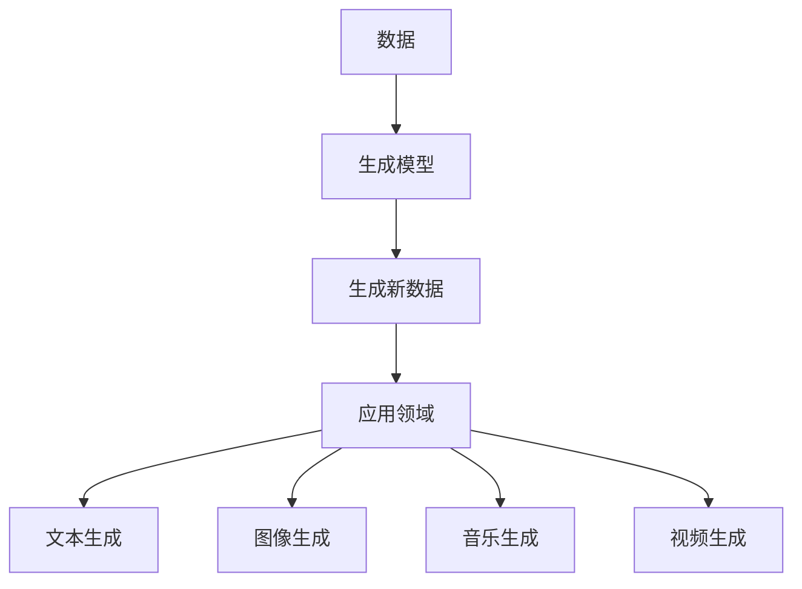

                 

**AIGC (Artificial Intelligence Generated Content)** 是当前人工智能领域的一个热门话题，它涉及使用人工智能技术生成各种形式的内容，如文本、图像、音乐和视频等。本文将深入探讨 AIGC 的原理，并提供代码实例进行讲解。

## 1. 背景介绍

AIGC 的概念起源于 2019 年，由 Google 的 DeepMind 团队提出。他们使用一种名为 Generative Pre-trained Transformer (GPT) 的模型，成功生成了人类难以区分的文本。自那时以来，AIGC 取得了显著进展，并已扩展到其他领域，如图像、音乐和视频生成。

## 2. 核心概念与联系

AIGC 的核心概念是**生成模型（Generative Models）**。生成模型旨在学习数据分布，并根据该分布生成新的数据。AIGC 使用各种生成模型，如变分自编码器 (VAE)、生成对抗网络 (GAN) 和transformer 等。

以下是 AIGC 的核心概念和联系的 Mermaid 流程图：



## 3. 核心算法原理 & 具体操作步骤

### 3.1 算法原理概述

AIGC 的核心算法是**transformer 模型**。transformer 模型使用自注意力机制 (Self-Attention) 来处理输入数据，并使用Transformer Encoder-Decoder 架构来生成新的数据。

### 3.2 算法步骤详解

1. **预训练（Pre-training）**：收集大量数据，并使用 transformer 模型对其进行预训练。
2. **微调（Fine-tuning）**：根据特定的应用领域，对预训练模型进行微调。
3. **生成（Generation）**：使用微调后的模型生成新的数据。

### 3.3 算法优缺点

**优点**：transformer 模型可以处理长序列数据，并可以在各种 AIGC 应用中取得出色的结果。

**缺点**：transformer 模型需要大量的计算资源，并且训练过程需要很长的时间。

### 3.4 算法应用领域

transformer 模型在文本生成、图像生成、音乐生成和视频生成等领域都有广泛的应用。

## 4. 数学模型和公式 & 详细讲解 & 举例说明

### 4.1 数学模型构建

transformer 模型的数学模型可以表示为：

$$P(x) = \prod_{i=1}^{n} P(x_i | x_{i-1},..., x_1)$$

其中，$x$ 是输入序列，$n$ 是序列长度，$P(x_i | x_{i-1},..., x_1)$ 是条件概率分布。

### 4.2 公式推导过程

transformer 模型使用自注意力机制来计算条件概率分布。自注意力机制的公式如下：

$$Attention(Q, K, V) = softmax(\frac{QK^T}{\sqrt{d_k}})V$$

其中，$Q$, $K$, $V$ 分别是查询、键和值，$d_k$ 是键的维度。

### 4.3 案例分析与讲解

例如，在文本生成任务中，输入序列 $x$ 是一段文本，$P(x)$ 是模型生成这段文本的概率。模型会依次生成每个单词，直到生成整个序列。

## 5. 项目实践：代码实例和详细解释说明

### 5.1 开发环境搭建

我们将使用 Python 和 PyTorch 来实现一个简单的文本生成模型。您需要安装以下软件包：

- Python 3.7+
- PyTorch 1.7+
- Transformers library

### 5.2 源代码详细实现

以下是一个简单的文本生成模型的实现代码：

```python
from transformers import GPT2LMHeadModel, GPT2Tokenizer

model = GPT2LMHeadModel.from_pretrained('gpt2')
tokenizer = GPT2Tokenizer.from_pretrained('gpt2')

def generate_text(prompt, max_length=50):
    input_ids = tokenizer.encode(prompt, return_tensors="pt")
    output = model.generate(input_ids, max_length=max_length, num_beams=5, early_stopping=True)
    return tokenizer.decode(output[0], skip_special_tokens=True)
```

### 5.3 代码解读与分析

我们使用 Hugging Face 的 Transformers library 来加载预训练的 GPT-2 模型。`generate_text` 函数接受一个提示（prompt）和最大长度（max_length）作为输入，并使用模型生成新的文本。

### 5.4 运行结果展示

以下是使用 `generate_text` 函数生成的文本示例：

```
输入： prompt = "Once upon a time"
输出： "Once upon a time, in a far-off land, there lived a young girl named Lily. She was not like the other girls in her village. She had a special gift, a gift that would change her life forever."
```

## 6. 实际应用场景

### 6.1 当前应用

AIGC 当前已在各种领域得到广泛应用，如文本生成、图像生成、音乐生成和视频生成等。

### 6.2 未来应用展望

未来，AIGC 可能会在数字艺术、虚拟现实和增强现实等领域得到更广泛的应用。此外，AIGC 还可能会帮助我们解决环境问题，如生成可持续的建筑设计和城市规划等。

## 7. 工具和资源推荐

### 7.1 学习资源推荐

- "Attention is All You Need" 论文：<https://arxiv.org/abs/1706.03762>
- Hugging Face Transformers library：<https://huggingface.co/transformers/>

### 7.2 开发工具推荐

- PyTorch：<https://pytorch.org/>
- TensorFlow：<https://www.tensorflow.org/>

### 7.3 相关论文推荐

- "Language Models are Few-Shot Learners"：<https://arxiv.org/abs/2005.14165>
- "DALL-E: Generating Images from Textual Descriptions"：<https://arxiv.org/abs/2102.00247>

## 8. 总结：未来发展趋势与挑战

### 8.1 研究成果总结

AIGC 已取得了显著的研究成果，并已在各种领域得到广泛应用。

### 8.2 未来发展趋势

未来，AIGC 可能会朝着更高效、更可控和更可解释的方向发展。

### 8.3 面临的挑战

AIGC 面临的挑战包括计算资源需求高、训练时间长、模型可解释性差等。

### 8.4 研究展望

未来的研究可能会集中在开发更高效的生成模型、提高模型可解释性和开发新的 AIGC 应用等方面。

## 9. 附录：常见问题与解答

**Q：AIGC 与传统机器学习有何不同？**

**A**：AIGC 旨在生成新的数据，而传统机器学习旨在预测或分类数据。

**Q：AIGC 面临哪些道德和伦理挑战？**

**A**：AIGC 面临的道德和伦理挑战包括生成的内容可能包含偏见、模型可能被滥用等。

**Q：如何评估 AIGC 模型的性能？**

**A**：评估 AIGC 模型性能的常用指标包括 Perplexity、BLEU、ROUGE 和 FID 等。

**作者：禅与计算机程序设计艺术 / Zen and the Art of Computer Programming**

