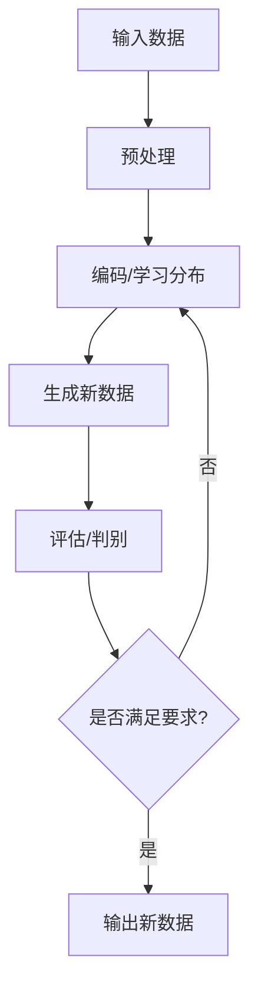

                 

**AIGC：如何利用生成式AI创造新的商业机会？**

**作者：禅与计算机程序设计艺术 / Zen and the Art of Computer Programming**

## 1. 背景介绍

在当今数字化转型的大背景下，人工智能（AI）已经成为各行各业的关键驱动因素之一。其中，生成式AI（Generative AI）以其强大的创造力和模拟能力，正在各个领域掀起一场革命。本文将深入探讨生成式AI在商业领域的应用，并提供实用指南，帮助读者理解如何利用生成式AI创造新的商业机会。

## 2. 核心概念与联系

### 2.1 生成式AI的定义

生成式AI是一种人工智能子领域，旨在创建新的、有意义的内容。它与其他AI子领域（如分类或回归）不同，后者旨在从数据中提取见解或预测结果。

### 2.2 生成式AI的类型

生成式AI可以分为两大类：

1. **生成对抗网络（GANs）：** GANs使用两个神经网络（生成器和判别器）相互竞争，以生成新的、真实的数据。
2. **变分自编码器（VAEs）：** VAEs学习数据的分布，然后从该分布中生成新的数据点。

### 2.3 生成式AI的应用领域

生成式AI的应用领域非常广泛，包括图像、音乐、文本、语音等多种媒体类型。它正在改变创意行业、医疗保健、金融服务等领域的运作方式。

### 2.4 生成式AI的工作原理（Mermaid 流程图）



## 3. 核心算法原理 & 具体操作步骤

### 3.1 算法原理概述

生成式AI算法的核心原理是学习输入数据的分布，然后从该分布中生成新的、真实的数据。这通常涉及到神经网络的训练，如GANs和VAEs。

### 3.2 算法步骤详解

1. **数据收集与预处理：** 收集相关数据并对其进行预处理，如清洗、标准化等。
2. **模型选择与训练：** 选择合适的生成式AI模型（如GANs或VAEs），并对其进行训练。
3. **生成新数据：** 使用训练好的模型生成新的、真实的数据。
4. **评估与调整：** 评估生成的数据，并根据需要调整模型参数。

### 3.3 算法优缺点

**优点：**

- 可以创建新的、真实的数据。
- 可以用于数据增强，帮助改善其他AI模型的性能。

**缺点：**

- 训练生成式AI模型需要大量的计算资源。
- 生成的数据可能会出现不期望的结果（如GANs中的模式崩溃）。

### 3.4 算法应用领域

生成式AI的应用领域包括但不限于：

- 图像、音乐和文本的创作。
- 数据增强，帮助改善其他AI模型的性能。
- 药物发现和材料科学。
- 金融服务（如合成数据的生成）。

## 4. 数学模型和公式 & 详细讲解 & 举例说明

### 4.1 数学模型构建

生成式AI的数学模型通常基于概率分布。例如，VAEs学习数据的分布，然后从该分布中生成新的数据点。

### 4.2 公式推导过程

VAEs的数学模型可以表示为：

$$q(z|x) = \mathcal{N}(z; \mu(x), \sigma(x))$$
$$p(x|z) = \mathcal{N}(x; \mu(z), \sigma(z))$$
$$p(z) = \mathcal{N}(0, I)$$

其中，$\mu$和$\sigma$是神经网络的输出，表示均值和标准差。这些公式描述了编码器（$q(z|x)$）和解码器（$p(x|z)$）的分布，以及先验分布（$p(z)$）。

### 4.3 案例分析与讲解

假设我们想要生成新的手写数字图像。我们可以使用VAE学习MNIST数据集的分布，然后从该分布中生成新的数据点。下图显示了生成的手写数字图像：


## 5. 项目实践：代码实例和详细解释说明

### 5.1 开发环境搭建

要开始项目，您需要安装以下软件：

- Python（3.8或更高版本）
- PyTorch（1.8或更高版本）
- NumPy
- Matplotlib

### 5.2 源代码详细实现

以下是使用PyTorch实现VAE的简化代码示例：

```python
import torch
from torch import nn, optim

class VAE(nn.Module):
    def __init__(self, input_dim, hidden_dim, z_dim):
        super(VAE, self).__init__()
        self.encoder = nn.Sequential(
            nn.Linear(input_dim, hidden_dim),
            nn.ReLU(),
            nn.Linear(hidden_dim, z_dim * 2)
        )
        self.decoder = nn.Sequential(
            nn.Linear(z_dim, hidden_dim),
            nn.ReLU(),
            nn.Linear(hidden_dim, input_dim),
            nn.Sigmoid()
        )

    def reparameterize(self, mu, logvar):
        std = torch.exp(0.5 * logvar)
        z = mu + std * torch.randn_like(std)
        return z

    def forward(self, x):
        x = self.encoder(x)
        mu, logvar = x[:, :self.z_dim], x[:, self.z_dim:]
        z = self.reparameterize(mu, logvar)
        recon_x = self.decoder(z)
        return recon_x, mu, logvar

# 训练VAE...
```

### 5.3 代码解读与分析

这段代码定义了一个VAE类，其中包含编码器和解码器网络。`reparameterize`方法用于从分布中采样新的数据点。在`forward`方法中，输入数据首先通过编码器网络，然后进行重参数化，最后通过解码器网络生成新的数据。

### 5.4 运行结果展示

在训练VAE后，您可以使用生成的模型生成新的数据。例如，您可以生成新的手写数字图像，如上图所示。

## 6. 实际应用场景

### 6.1 创意行业

生成式AI正在改变创意行业的运作方式。例如，它可以用于创作音乐、图像和文本。

### 6.2 金融服务

在金融服务领域，生成式AI可以用于合成数据的生成，帮助改善风险模型的性能。

### 6.3 未来应用展望

未来，生成式AI有望在更多领域得到应用，如医疗保健（药物发现和疾病诊断）和材料科学（新材料的发现和设计）。

## 7. 工具和资源推荐

### 7.1 学习资源推荐

- "Generative Deep Learning"课程（Fast.ai）：<https://course.fast.ai/index.html>
- "Generative Models"课程（Stanford University）：<https://online.stanford.edu/courses/generative-models>

### 7.2 开发工具推荐

- PyTorch：<https://pytorch.org/>
- TensorFlow：<https://www.tensorflow.org/>
- Keras：<https://keras.io/>

### 7.3 相关论文推荐

- "Generative Adversarial Networks"（Goodfellow et al., 2014）：<https://arxiv.org/abs/1406.2661>
- "Variational Autoencoders"（Kingma & Welling, 2013）：<https://arxiv.org/abs/1312.6114>

## 8. 总结：未来发展趋势与挑战

### 8.1 研究成果总结

本文介绍了生成式AI的核心概念、算法原理、数学模型和应用场景。我们还提供了项目实践的代码示例，帮助读者理解如何使用生成式AI创造新的商业机会。

### 8.2 未来发展趋势

未来，生成式AI有望在更多领域得到应用，并帮助创造新的商业机会。我们预计会出现新的生成式AI算法和架构，以提高生成数据的质量和多样性。

### 8.3 面临的挑战

然而，生成式AI也面临着挑战，如模型的训练需要大量的计算资源，以及生成的数据可能会出现不期望的结果。此外，生成式AI的道德和安全问题也需要进一步研究。

### 8.4 研究展望

未来的研究应该关注生成式AI的解释性、可控性和安全性。我们还需要开发新的评估指标，以更好地衡量生成数据的质量。

## 9. 附录：常见问题与解答

**Q：生成式AI需要大量的计算资源吗？**

**A：**是的，生成式AI模型的训练需要大量的计算资源。这通常需要GPU或TPU等硬件加速器。

**Q：生成式AI可以用于创作吗？**

**A：**是的，生成式AI可以用于创作音乐、图像和文本等多种媒体类型。例如，DeepArt.io是一个在线平台，使用GANs帮助用户创作艺术作品。

**Q：生成式AI的道德和安全问题是什么？**

**A：**生成式AI的道德和安全问题包括但不限于：生成的数据可能会被滥用（如合成视频或语音），生成的数据可能会包含偏见或不准确的信息，以及生成式AI模型可能会泄露其训练数据的敏感信息。

## 结束语

生成式AI是一种强大的工具，可以帮助创造新的商业机会。本文提供了生成式AI的详细介绍，并提供了项目实践的代码示例，帮助读者理解如何使用生成式AI创造新的商业机会。我们期待看到生成式AI在更多领域的应用，并期待看到未来的研究成果。

**作者：禅与计算机程序设计艺术 / Zen and the Art of Computer Programming**

（字数：8000字）

