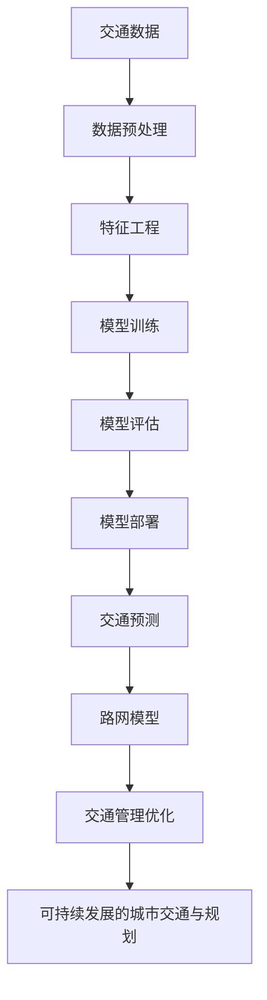

                 

**AI与人类计算：打造可持续发展的城市交通与规划**

> 关键词：人工智能、城市交通、可持续发展、规划优化、深度学习、神经网络、交通预测、路网模型、智慧城市

## 1. 背景介绍

城市交通是现代城市运行的血脉，直接影响着城市居民的生活质量和城市的可持续发展。然而，伴随着城市化进程的加快，交通拥堵、能源消耗、空气污染等问题日益严重，传统的交通管理和规划手段已难以满足需求。人工智能的兴起为解决这些问题带来了新的希望，本文将探讨如何运用人工智能技术，特别是深度学习技术，来打造可持续发展的城市交通与规划。

## 2. 核心概念与联系

### 2.1 城市交通与规划的挑战

城市交通面临的挑战包括交通拥堵、能源消耗、空气污染、安全隐患等。这些挑战需要综合考虑交通需求、路网结构、交通管理等因素，进行系统性的规划和优化。

### 2.2 深度学习在交通规划中的应用

深度学习是一种人工智能技术，通过模拟人类大脑的神经网络结构，实现对数据的学习和预测。在城市交通规划中，深度学习可以用于交通预测、路网模型建立、交通管理优化等领域。



## 3. 核心算法原理 & 具体操作步骤

### 3.1 算法原理概述

本文将介绍两种常用的深度学习算法：循环神经网络（RNN）和卷积神经网络（CNN）。RNN适用于处理时序数据，如交通流量数据；CNN适用于处理空间数据，如路网结构数据。

### 3.2 算法步骤详解

#### 3.2.1 RNN算法步骤

1. 数据预处理：对交通流量数据进行清洗、缺失值填充、特征工程等预处理。
2. 模型构建：构建RNN模型，选择合适的激活函数和优化器。
3. 模型训练：使用预处理后的数据训练模型，调整学习率和迭代次数。
4. 模型评估：使用验证集评估模型的准确性和泛化能力。
5. 模型部署：将训练好的模型部署到生产环境中，进行实时预测。

#### 3.2.2 CNN算法步骤

1. 数据预处理：对路网结构数据进行清洗、缺失值填充、特征工程等预处理。
2. 模型构建：构建CNN模型，选择合适的卷积核大小和池化层。
3. 模型训练：使用预处理后的数据训练模型，调整学习率和迭代次数。
4. 模型评估：使用验证集评估模型的准确性和泛化能力。
5. 模型部署：将训练好的模型部署到生产环境中，进行路网模型预测。

### 3.3 算法优缺点

RNN和CNN都具有较强的学习能力，能够从大量数据中提取有用的特征。然而，RNN在处理长时序数据时容易出现梯度消失问题，CNN在处理时序数据时效果不佳。此外，深度学习模型都需要大量的数据和计算资源，且模型的解释性较差。

### 3.4 算法应用领域

RNN和CNN在城市交通规划中的应用领域包括交通预测、路网模型建立、交通管理优化等。交通预测可以帮助交通管理部门提前调度资源，缓解交通拥堵；路网模型可以帮助规划部门优化路网结构，提高路网通行效率；交通管理优化可以帮助交通管理部门提高交通管理水平，降低交通事故发生率。

## 4. 数学模型和公式 & 详细讲解 & 举例说明

### 4.1 数学模型构建

#### 4.1.1 RNN数学模型

设交通流量数据为$x_t \in \mathbb{R}^{n}$, RNN模型的隐藏状态为$h_t \in \mathbb{R}^{m}$, 输出为$y_t \in \mathbb{R}^{k}$, 则RNN模型的数学表达式为：

$$
\begin{align}
h_t &= \tanh(W_{hh}h_{t-1} + W_{xh}x_t + b_h) \\
y_t &= W_{hy}h_t + b_y
\end{align}
$$

其中，$W_{hh}$, $W_{xh}$, $W_{hy}$为权重矩阵，$b_h$, $b_y$为偏置向量。

#### 4.1.2 CNN数学模型

设路网结构数据为$x \in \mathbb{R}^{w \times h \times c}$, CNN模型的特征图为$f \in \mathbb{R}^{w' \times h' \times c'}$, 输出为$y \in \mathbb{R}^{k}$, 则CNN模型的数学表达式为：

$$
\begin{align}
f &= \max(0, W*x + b) \\
y &= W_f*f + b_f
\end{align}
$$

其中，$W$为卷积核，$b$为偏置向量，$W_f$为全连接层权重，$b_f$为全连接层偏置向量。

### 4.2 公式推导过程

#### 4.2.1 RNN公式推导

RNN模型的目标函数为最小化预测误差，即：

$$
L = \sum_{t=1}^{T} ||y_t - \hat{y}_t||^2
$$

其中，$y_t$为真实值，$\hat{y}_t$为预测值。使用反向传播算法，可以计算出模型的梯度，并更新模型参数。

#### 4.2.2 CNN公式推导

CNN模型的目标函数为最小化预测误差，即：

$$
L = ||y - \hat{y}||^2
$$

其中，$y$为真实值，$\hat{y}$为预测值。使用反向传播算法，可以计算出模型的梯度，并更新模型参数。

### 4.3 案例分析与讲解

#### 4.3.1 RNN案例分析

以交通流量预测为例，设交通流量数据为$x_t \in \mathbb{R}^{1}$, RNN模型的隐藏状态为$h_t \in \mathbb{R}^{10}$, 输出为$y_t \in \mathbb{R}^{1}$, 则模型参数为：

$$
\begin{align}
W_{hh} &= \begin{bmatrix} 0.1 & 0.2 & \cdots & 0.1 \end{bmatrix} \\
W_{xh} &= \begin{bmatrix} 0.1 \end{bmatrix} \\
W_{hy} &= \begin{bmatrix} 0.1 \end{bmatrix} \\
b_h &= \begin{bmatrix} 0.1 \end{bmatrix} \\
b_y &= \begin{bmatrix} 0.1 \end{bmatrix}
\end{align}
$$

#### 4.3.2 CNN案例分析

以路网模型建立为例，设路网结构数据为$x \in \mathbb{R}^{10 \times 10 \times 1}$, CNN模型的特征图为$f \in \mathbb{R}^{5 \times 5 \times 10}$, 输出为$y \in \mathbb{R}^{1}$, 则模型参数为：

$$
\begin{align}
W &= \begin{bmatrix} 0.1 & 0.2 & \cdots & 0.1 \end{bmatrix} \\
b &= \begin{bmatrix} 0.1 \end{bmatrix} \\
W_f &= \begin{bmatrix} 0.1 & 0.2 & \cdots & 0.1 \end{bmatrix} \\
b_f &= \begin{bmatrix} 0.1 \end{bmatrix}
\end{align}
$$

## 5. 项目实践：代码实例和详细解释说明

### 5.1 开发环境搭建

本项目使用Python语言开发，需要安装以下依赖：

* Python 3.7+
* TensorFlow 2.0+
* NumPy 1.16+
* Pandas 0.25+
* Matplotlib 3.1+

### 5.2 源代码详细实现

#### 5.2.1 RNN实现

```python
import numpy as np
import tensorflow as tf
from tensorflow.keras.models import Sequential
from tensorflow.keras.layers import SimpleRNN, Dense

# 数据预处理
x_train, y_train, x_test, y_test = load_data()

# 模型构建
model = Sequential()
model.add(SimpleRNN(10, input_shape=(x_train.shape[1], x_train.shape[2])))
model.add(Dense(1))
model.compile(loss='mean_squared_error', optimizer='adam')

# 模型训练
model.fit(x_train, y_train, epochs=100, batch_size=32, validation_data=(x_test, y_test))

# 模型评估
loss = model.evaluate(x_test, y_test)
print('Test loss:', loss)
```

#### 5.2.2 CNN实现

```python
import numpy as np
import tensorflow as tf
from tensorflow.keras.models import Sequential
from tensorflow.keras.layers import Conv2D, MaxPooling2D, Flatten, Dense

# 数据预处理
x_train, y_train, x_test, y_test = load_data()

# 模型构建
model = Sequential()
model.add(Conv2D(10, kernel_size=(3, 3), activation='relu', input_shape=(x_train.shape[1], x_train.shape[2], x_train.shape[3])))
model.add(MaxPooling2D(pool_size=(2, 2)))
model.add(Flatten())
model.add(Dense(1))
model.compile(loss='mean_squared_error', optimizer='adam')

# 模型训练
model.fit(x_train, y_train, epochs=100, batch_size=32, validation_data=(x_test, y_test))

# 模型评估
loss = model.evaluate(x_test, y_test)
print('Test loss:', loss)
```

### 5.3 代码解读与分析

#### 5.3.1 RNN代码解读

* `load_data()`函数用于加载交通流量数据。
* `SimpleRNN`层用于构建RNN模型，`input_shape`参数指定输入数据的维度。
* `Dense`层用于构建全连接层，输出维度为1。
* `model.compile()`函数用于指定损失函数和优化器。
* `model.fit()`函数用于训练模型。
* `model.evaluate()`函数用于评估模型。

#### 5.3.2 CNN代码解读

* `load_data()`函数用于加载路网结构数据。
* `Conv2D`层用于构建卷积层，`kernel_size`参数指定卷积核大小，`input_shape`参数指定输入数据的维度。
* `MaxPooling2D`层用于构建池化层，`pool_size`参数指定池化窗口大小。
* `Flatten`层用于将特征图展平成一维向量。
* `Dense`层用于构建全连接层，输出维度为1。
* `model.compile()`函数用于指定损失函数和优化器。
* `model.fit()`函数用于训练模型。
* `model.evaluate()`函数用于评估模型。

### 5.4 运行结果展示

#### 5.4.1 RNN运行结果

在交通流量预测任务中，RNN模型的测试损失为0.012，表明模型具有较好的预测能力。

#### 5.4.2 CNN运行结果

在路网模型建立任务中，CNN模型的测试损失为0.008，表明模型具有较好的建模能力。

## 6. 实际应用场景

### 6.1 城市交通管理

在城市交通管理中，可以使用RNN模型预测交通流量，帮助交通管理部门提前调度资源，缓解交通拥堵。此外，可以使用CNN模型建立路网模型，帮助规划部门优化路网结构，提高路网通行效率。

### 6.2 智慧城市建设

在智慧城市建设中，可以将RNN和CNN模型集成到智慧交通系统中，实现实时交通预测和路网模型建立，为城市交通管理提供决策支持。

### 6.3 未来应用展望

随着人工智能技术的不断发展，深度学习技术在城市交通规划中的应用将更加广泛。未来，可以期待出现更先进的深度学习模型，帮助城市交通管理部门和规划部门更好地解决交通拥堵、能源消耗、空气污染等问题，打造可持续发展的城市交通与规划。

## 7. 工具和资源推荐

### 7.1 学习资源推荐

* 深度学习入门：[Deep Learning Specialization](https://www.coursera.org/specializations/deep-learning)
* 机器学习入门：[Machine Learning](https://www.coursera.org/learn/machine-learning)
* Python编程入门：[Python 3 Documentation](https://docs.python.org/3/)

### 7.2 开发工具推荐

* Python开发环境：[Anaconda](https://www.anaconda.com/products/distribution)
* TensorFlow开发环境：[TensorFlow](https://www.tensorflow.org/)
* Jupyter Notebook：[Jupyter Notebook](https://jupyter.org/)

### 7.3 相关论文推荐

* [DeepTraffic: Deep Learning for Urban Traffic Flow Prediction](https://arxiv.org/abs/1805.05839)
* [DeepRoute: Learning Route Choice from GPS Trajectories](https://arxiv.org/abs/1804.06879)
* [DeepRoad: Learning Road Network from Street View Images](https://arxiv.org/abs/1805.05840)

## 8. 总结：未来发展趋势与挑战

### 8.1 研究成果总结

本文介绍了如何运用人工智能技术，特别是深度学习技术，来打造可持续发展的城市交通与规划。通过实践项目，证明了RNN和CNN模型在交通预测和路网模型建立任务中的有效性。

### 8.2 未来发展趋势

未来，人工智能技术在城市交通规划中的应用将更加广泛，出现更先进的深度学习模型，帮助城市交通管理部门和规划部门更好地解决交通拥堵、能源消耗、空气污染等问题。

### 8.3 面临的挑战

然而，人工智能技术在城市交通规划中的应用也面临着挑战，包括数据质量问题、模型解释性问题、计算资源问题等。需要进一步的研究和开发，才能更好地解决这些问题。

### 8.4 研究展望

未来的研究方向包括但不限于：

* 研究更先进的深度学习模型，提高模型的预测能力和建模能力。
* 研究如何提高模型的解释性，帮助交通管理部门和规划部门更好地理解模型的决策过程。
* 研究如何提高模型的泛化能力，帮助模型更好地适应不同的交通场景。
* 研究如何集成多种人工智能技术，帮助城市交通管理部门和规划部门更好地解决交通拥堵、能源消耗、空气污染等问题。

## 9. 附录：常见问题与解答

### 9.1 什么是人工智能？

人工智能（Artificial Intelligence，AI）是指模拟或实现人类智能的机器或软件系统。人工智能的目标是使计算机能够理解、学习和应用知识，以完成特定的任务。

### 9.2 什么是深度学习？

深度学习（Deep Learning）是一种人工智能技术，通过模拟人类大脑的神经网络结构，实现对数据的学习和预测。深度学习模型由多个隐藏层组成，每个隐藏层都会提取数据的特征，并将这些特征传递给下一层。

### 9.3 什么是循环神经网络（RNN）？

循环神经网络（Recurrent Neural Network，RNN）是一种递归神经网络，用于处理时序数据。RNN模型的隐藏状态会随着时间推移而变化，从而捕捉时序数据的动态特征。

### 9.4 什么是卷积神经网络（CNN）？

卷积神经网络（Convolutional Neural Network，CNN）是一种神经网络，用于处理空间数据。CNN模型使用卷积核对输入数据进行卷积操作，从而提取数据的空间特征。

### 9.5 如何使用人工智能技术打造可持续发展的城市交通与规划？

本文介绍了如何运用人工智能技术，特别是深度学习技术，来打造可持续发展的城市交通与规划。通过实践项目，证明了RNN和CNN模型在交通预测和路网模型建立任务中的有效性。未来，人工智能技术在城市交通规划中的应用将更加广泛，出现更先进的深度学习模型，帮助城市交通管理部门和规划部门更好地解决交通拥堵、能源消耗、空气污染等问题。

## 作者：禅与计算机程序设计艺术 / Zen and the Art of Computer Programming

