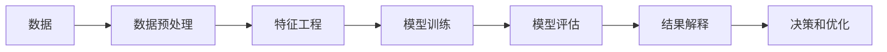

                 

# 知识挖掘：从海量数据中提炼价值洞察

## 1. 背景介绍

在数据驱动的今天，知识挖掘（Knowledge Mining）已成为各行各业获取价值洞察、提升决策效率的重要手段。从电商推荐、金融风控到医疗诊断、智能制造，通过从海量数据中提取有用信息，企业可以更好地理解市场动态、客户需求，优化产品设计和服务流程，从而在激烈竞争中脱颖而出。

知识挖掘技术涉及数据预处理、特征工程、模型训练、评估等多个环节。其核心在于利用机器学习算法，从大规模数据集中自动发现并提炼出有价值的模式、关联和知识。通过自动化和智能化的数据分析，知识挖掘能够辅助人类快速、精准地做出决策，推动业务创新和发展。

## 2. 核心概念与联系

### 2.1 核心概念概述

为更好地理解知识挖掘技术，我们首先需要了解几个核心概念：

- **数据挖掘**（Data Mining）：利用机器学习算法对大规模数据集进行模式发现和知识提取的过程。数据挖掘通常包括数据预处理、特征选择、模型训练、结果解释等多个步骤。
- **特征工程**（Feature Engineering）：数据预处理中的重要环节，通过选择合适的特征、构造新特征等手段，提升模型的预测能力和泛化性能。特征工程对于提高模型的准确性和效率至关重要。
- **机器学习**（Machine Learning）：一种通过数据驱动，自动构建和优化模型以实现预测和决策任务的算法体系。常用的机器学习算法包括决策树、随机森林、支持向量机、神经网络等。
- **模型评估**（Model Evaluation）：对训练好的模型进行验证和测试，评估其预测性能和泛化能力。常用的评估指标包括准确率、召回率、F1分数、ROC曲线等。
- **数据预处理**（Data Preprocessing）：对原始数据进行清洗、转换、归一化等处理，以便后续建模分析。数据预处理是保证模型性能的关键步骤。

这些概念之间通过数据流相互联系，构成了一个从数据输入到模型输出的完整流程。通过自动化和智能化的数据分析，知识挖掘技术能够帮助企业从数据中提炼出有价值的信息，指导业务决策和优化运营。

### 2.2 核心概念原理和架构的 Mermaid 流程图



该流程图展示了知识挖掘从数据输入到结果解释的完整流程：数据经过预处理和特征工程后，进入模型训练环节；训练好的模型在模型评估环节得到验证和测试；最终，通过结果解释环节，提炼出有价值的洞察，指导业务决策和优化运营。

## 3. 核心算法原理 & 具体操作步骤

### 3.1 算法原理概述

知识挖掘的核心算法原理主要包括：

- **监督学习**（Supervised Learning）：通过标注数据集，训练模型进行预测和分类任务。常用的算法有决策树、随机森林、支持向量机等。
- **无监督学习**（Unsupervised Learning）：利用未标注的数据集，通过聚类、降维等手段发现数据中的模式和结构。常用的算法有K-means聚类、主成分分析（PCA）等。
- **半监督学习**（Semi-supervised Learning）：结合少量标注数据和大量未标注数据，通过半监督算法提升模型性能。常用的算法有标签传播算法、Co-training等。
- **强化学习**（Reinforcement Learning）：通过与环境的交互，学习最优的决策策略。常用的算法有Q-learning、策略梯度等。

这些算法通过自动化的数据分析，从数据中提炼出有价值的模式和关联，辅助人类进行决策。

### 3.2 算法步骤详解

知识挖掘的整个流程可以分为数据准备、模型训练、结果解释和业务应用四个阶段：

**数据准备阶段**：
1. 数据收集：从不同的数据源收集需要的数据，如客户交易记录、社交媒体评论、传感器数据等。
2. 数据清洗：去除噪声、处理缺失值、纠正错误数据等。
3. 数据转换：进行数据标准化、归一化、编码等处理，以便后续建模分析。

**模型训练阶段**：
1. 特征选择：选择与预测任务相关的特征，并进行特征工程处理，如构造新特征、特征降维等。
2. 模型构建：选择合适的机器学习算法，并构建训练模型。
3. 模型训练：使用标注数据对模型进行训练，调整模型参数以提高预测准确性。

**结果解释阶段**：
1. 模型评估：使用测试集对训练好的模型进行验证和测试，评估模型性能。
2. 结果解释：通过可视化、统计分析等手段，将模型结果转化为可解释的业务洞察。

**业务应用阶段**：
1. 业务优化：将模型结果应用于实际的业务决策和优化中。
2. 持续监控：实时监控模型性能，并根据反馈进行模型调整和优化。

### 3.3 算法优缺点

知识挖掘算法的主要优点包括：

- **自动化程度高**：通过机器学习算法自动进行数据分析，减少了人工干预和数据处理的工作量。
- **泛化能力强**：模型能够在未见过的数据上进行预测和分类，具有较好的泛化性能。
- **发现复杂模式**：能够发现数据中的复杂关联和模式，辅助人类进行深入分析和决策。

但同时，这些算法也存在一些缺点：

- **数据质量依赖性强**：数据的质量直接影响模型的性能，需要投入大量时间和精力进行数据清洗和预处理。
- **模型复杂度高**：复杂的模型训练和调参工作量大，需要较长的周期和较高的技术门槛。
- **解释性不足**：部分机器学习模型（如深度学习模型）的黑盒特性使得结果难以解释，影响决策可信度。

### 3.4 算法应用领域

知识挖掘技术在多个领域都有广泛应用，例如：

- **电商推荐**：通过分析用户行为数据，预测用户偏好，提供个性化推荐。
- **金融风控**：利用交易数据进行信用评估、欺诈检测等，防范金融风险。
- **医疗诊断**：通过分析患者病历和检测数据，辅助医生进行疾病诊断和治疗方案选择。
- **智能制造**：通过分析生产数据，优化生产流程，提升生产效率和产品质量。
- **社交媒体分析**：通过分析社交媒体数据，了解用户情感和行为模式，进行舆情监测和品牌管理。

## 4. 数学模型和公式 & 详细讲解 & 举例说明

### 4.1 数学模型构建

知识挖掘的数学模型构建通常包括以下几个步骤：

1. **数据预处理**：将原始数据转换为模型可以处理的格式，如标准化、归一化、编码等。
2. **特征工程**：选择和构造特征，如构造新特征、特征降维等。
3. **模型训练**：选择适当的机器学习算法，并使用训练集对模型进行训练。
4. **模型评估**：使用测试集对训练好的模型进行验证和测试，评估模型性能。
5. **结果解释**：将模型结果转化为可解释的业务洞察。

### 4.2 公式推导过程

以**K-means聚类算法**为例，推导其核心公式和推导过程：

设输入数据集为 $\{ x_1, x_2, ..., x_n \}$，其中每个样本 $x_i = (x_{i1}, x_{i2}, ..., x_{id})$ 为 $d$ 维向量。聚类过程包括两个主要步骤：

1. 初始化聚类中心 $\mu_k = (mu_{k1}, mu_{k2}, ..., mu_{kd})$，其中 $k$ 为聚类数目。
2. 迭代更新聚类中心：对于每个样本 $x_i$，计算其到每个聚类中心的距离 $d_i$，并将其分配到距离最近的聚类中心。然后，更新每个聚类的中心为该类内所有样本的均值。

K-means聚类的数学公式如下：

$$
\min_{C=\{c_1, c_2, ..., c_k\},\mu_k} \sum_{i=1}^n \min_{c_j \in C} \|x_i - \mu_j\|^2
$$

其中 $c_j$ 为聚类中心，$\mu_j$ 为聚类中心 $\{c_j\}$ 中 $j$ 个元素的均值。

### 4.3 案例分析与讲解

以**电商推荐系统**为例，分析其知识挖掘的实施过程：

1. **数据准备**：收集用户行为数据，如浏览历史、购买记录、评分等。
2. **特征工程**：选择与用户行为相关的特征，并进行特征工程处理，如构造新特征、特征降维等。
3. **模型训练**：使用监督学习算法（如协同过滤、矩阵分解等）训练推荐模型。
4. **模型评估**：使用测试集对训练好的模型进行验证和测试，评估模型性能。
5. **结果解释**：将推荐结果转化为可解释的业务洞察，如推荐理由、相似用户等。

## 5. 项目实践：代码实例和详细解释说明

### 5.1 开发环境搭建

在进行知识挖掘项目开发前，需要先准备好开发环境。以下是使用Python进行Scikit-Learn开发的开发环境配置流程：

1. 安装Anaconda：从官网下载并安装Anaconda，用于创建独立的Python环境。
2. 创建并激活虚拟环境：
```bash
conda create -n sklearn-env python=3.7 
conda activate sklearn-env
```
3. 安装Scikit-Learn：
```bash
pip install scikit-learn
```
4. 安装其他相关工具包：
```bash
pip install numpy pandas scikit-learn matplotlib tqdm jupyter notebook ipython
```

完成上述步骤后，即可在`sklearn-env`环境中开始知识挖掘项目的开发。

### 5.2 源代码详细实现

这里以**K-means聚类算法**为例，给出使用Scikit-Learn库进行聚类算法的Python代码实现：

```python
from sklearn.cluster import KMeans
from sklearn.datasets import make_blobs
from sklearn.metrics import silhouette_score

# 生成随机数据集
X, y = make_blobs(n_samples=500, centers=4, random_state=0)

# 初始化K-means模型
kmeans = KMeans(n_clusters=4, random_state=0)

# 训练模型
kmeans.fit(X)

# 计算聚类结果的轮廓系数
silhouette_avg = silhouette_score(X, kmeans.labels_)
print('轮廓系数：', silhouette_avg)
```

在上述代码中，我们使用Scikit-Learn库的KMeans算法对生成数据集进行聚类。具体步骤包括：

1. 生成随机数据集，使用`make_blobs`函数生成4个类别的数据点。
2. 初始化K-means模型，设置聚类数目为4。
3. 训练模型，使用`fit`方法对数据集进行聚类。
4. 计算聚类结果的轮廓系数，使用`silhouette_score`函数评估聚类结果的性能。

### 5.3 代码解读与分析

代码中的关键部分如下：

**make_blobs函数**：用于生成随机簇状数据集，可用于测试聚类算法的效果。

**KMeans模型**：Scikit-Learn库提供的K-means聚类算法实现。通过设置`n_clusters`参数，指定聚类数目。

**fit方法**：训练模型，对数据集进行聚类。训练过程中，模型会根据数据点的距离和相似度计算聚类中心，并将数据点分配到最近的聚类中心。

**silhouette_score函数**：用于评估聚类结果的轮廓系数，值越高表示聚类效果越好。

## 6. 实际应用场景

### 6.1 智能客服系统

智能客服系统通过知识挖掘技术，从历史客服记录中提取有用的信息和模式，提高客户服务的自动化水平和效率。具体应用包括：

1. **问题分类**：通过分析历史客服记录，对常见问题进行分类和标签化，构建知识库。
2. **意图识别**：使用NLP技术提取用户问题的关键词和语义，识别用户的意图。
3. **自动回复**：根据用户的意图，从知识库中提取相关回答，并自动回复用户。

### 6.2 金融风控

金融风控通过知识挖掘技术，从大量交易数据中提取特征，进行信用评估和欺诈检测。具体应用包括：

1. **信用评分**：利用历史交易数据，构建信用评分模型，预测用户的信用风险。
2. **交易异常检测**：通过分析交易模式，检测异常交易行为，防范欺诈风险。
3. **风险预警**：根据实时交易数据，实时监控并预警潜在风险。

### 6.3 医疗诊断

医疗诊断通过知识挖掘技术，从患者病历和检测数据中提取有用的信息，辅助医生进行诊断和治疗方案选择。具体应用包括：

1. **疾病诊断**：利用患者的病历和检测数据，构建诊断模型，预测疾病类型。
2. **治疗方案选择**：根据诊断结果，从知识库中提取推荐的治疗方案。
3. **患者管理**：通过分析患者的治疗历史和疗效数据，优化治疗方案，提高治疗效果。

### 6.4 未来应用展望

未来，知识挖掘技术将在更多领域得到应用，为传统行业带来变革性影响。

在智慧医疗领域，基于知识挖掘的医疗诊断、病历分析、药物研发等应用将提升医疗服务的智能化水平，辅助医生诊疗，加速新药开发进程。

在智能教育领域，知识挖掘技术可应用于作业批改、学情分析、知识推荐等方面，因材施教，促进教育公平，提高教学质量。

在智慧城市治理中，知识挖掘技术可应用于城市事件监测、舆情分析、应急指挥等环节，提高城市管理的自动化和智能化水平，构建更安全、高效的未来城市。

此外，在企业生产、社会治理、文娱传媒等众多领域，知识挖掘技术也将不断涌现，为经济社会发展注入新的动力。

## 7. 工具和资源推荐

### 7.1 学习资源推荐

为了帮助开发者系统掌握知识挖掘的理论基础和实践技巧，这里推荐一些优质的学习资源：

1. 《机器学习实战》系列书籍：由著名机器学习专家撰写，通过实例和代码，详细讲解了机器学习算法的实现和应用。
2. Coursera《机器学习》课程：由斯坦福大学开设的知名课程，涵盖了机器学习的基础理论和经典算法。
3. Kaggle竞赛平台：提供大量数据集和竞赛任务，帮助学习者实践机器学习算法。
4. Scikit-Learn官方文档：Scikit-Learn库的官方文档，提供了丰富的算法实现和样例代码，是学习的必备资料。
5. K-means聚类算法论文：经典聚类算法K-means的详细论文，包括算法原理、实现和应用等方面的内容。

通过对这些资源的学习实践，相信你一定能够快速掌握知识挖掘的精髓，并用于解决实际的业务问题。

### 7.2 开发工具推荐

高效的开发离不开优秀的工具支持。以下是几款用于知识挖掘开发的常用工具：

1. Python：广泛用于数据科学和机器学习领域，具有丰富的数据处理和分析库。
2. Scikit-Learn：基于Python的机器学习库，提供了大量的经典算法实现。
3. TensorFlow：Google主导开发的深度学习框架，适合处理大规模数据集。
4. K-means聚类算法工具：K-means聚类算法的开源实现，适用于实际数据集聚类。
5. Weights & Biases：模型训练的实验跟踪工具，可以记录和可视化模型训练过程中的各项指标。

合理利用这些工具，可以显著提升知识挖掘任务的开发效率，加快创新迭代的步伐。

### 7.3 相关论文推荐

知识挖掘技术的发展源于学界的持续研究。以下是几篇奠基性的相关论文，推荐阅读：

1. K-means聚类算法论文：经典聚类算法K-means的详细论文，包括算法原理、实现和应用等方面的内容。
2. 随机森林论文：决策树算法的重要改进之一，在机器学习竞赛中表现优异。
3. 支持向量机论文：广泛应用于分类和回归问题的经典算法。
4. 协同过滤论文：电商推荐系统中常用的推荐算法，通过用户和物品的相似度进行推荐。
5. 深度学习在NLP中的应用论文：深度学习在自然语言处理领域的应用，包括机器翻译、情感分析、命名实体识别等。

这些论文代表了大数据挖掘技术的发展脉络。通过学习这些前沿成果，可以帮助研究者把握学科前进方向，激发更多的创新灵感。

## 8. 总结：未来发展趋势与挑战

### 8.1 研究成果总结

知识挖掘技术在机器学习、数据科学和人工智能领域取得了诸多研究成果，推动了各行各业的智能化发展。这些成果包括：

- 数据预处理技术：通过数据清洗和转换，提升了数据的质量和可用性。
- 特征工程方法：通过特征选择和构造，提高了模型的性能和泛化能力。
- 算法优化策略：通过优化算法参数和结构，提升了模型的训练效率和预测精度。
- 模型解释方法：通过模型解释技术，增强了模型的可解释性和可信度。

### 8.2 未来发展趋势

展望未来，知识挖掘技术将呈现以下几个发展趋势：

1. **自动化和智能化**：随着深度学习和大数据技术的发展，知识挖掘将逐步实现自动化和智能化，减少人工干预，提高分析效率。
2. **跨领域应用**：知识挖掘技术将逐步扩展到更多领域，如智慧城市、智能制造、健康医疗等，推动行业数字化转型。
3. **实时分析和预测**：通过实时数据处理和模型优化，知识挖掘将实现对动态数据的实时分析和预测，提升决策效率和业务响应速度。
4. **多模态融合**：知识挖掘将逐步融合多种数据模态，如图像、音频、文本等，构建多模态数据模型，提高模型的综合分析能力。
5. **分布式计算**：通过分布式计算技术，知识挖掘将支持大规模数据集的处理和分析，提升系统性能和可靠性。

### 8.3 面临的挑战

尽管知识挖掘技术取得了显著进展，但在迈向更加智能化、普适化应用的过程中，仍面临以下挑战：

1. **数据质量和多样性**：数据的质量和多样性直接影响知识挖掘的效果，如何有效获取和处理数据仍是一个重要问题。
2. **算法复杂性**：知识挖掘算法复杂度高，需要较高的技术门槛和计算资源，如何简化算法、提高计算效率，是一个亟待解决的问题。
3. **模型解释性**：部分知识挖掘算法（如深度学习）的黑盒特性，使得模型难以解释，影响决策可信度。
4. **隐私和安全**：数据隐私和安全问题日益严重，如何保护用户数据隐私，防止数据泄露和滥用，是一个重要课题。

### 8.4 研究展望

面向未来，知识挖掘技术需要在以下几个方向进行进一步研究：

1. **自动化知识发现**：通过自动化手段，实现知识发现和提取的智能化，减少人工干预。
2. **跨模态融合技术**：实现多模态数据模型的融合，提升模型的综合分析能力。
3. **模型解释方法**：通过可解释性增强技术，提升模型的可解释性和可信度。
4. **隐私保护技术**：研究隐私保护技术，确保数据隐私和安全。

通过不断探索和创新，知识挖掘技术将在更广泛的领域发挥作用，推动人工智能技术的普及和应用。

## 9. 附录：常见问题与解答

**Q1：如何选择合适的特征工程方法？**

A: 选择合适的特征工程方法需要考虑多个因素，包括数据类型、任务类型、模型复杂度等。一般而言，可以通过以下步骤：

1. 数据分析：通过可视化、统计分析等手段，了解数据的分布、趋势和特征。
2. 特征选择：选择与任务相关的特征，避免冗余和噪音。
3. 特征构造：根据任务需求，构造新的特征，如计算特征、组合特征等。
4. 特征降维：通过降维技术，减少特征数量，提升模型效率。

**Q2：知识挖掘模型的评估指标有哪些？**

A: 知识挖掘模型的评估指标包括：

1. 准确率（Accuracy）：模型正确预测的比例。
2. 召回率（Recall）：模型正确预测的正样本占实际正样本的比例。
3. F1分数（F1 Score）：准确率和召回率的调和平均，综合考虑了模型的准确性和召回性。
4. ROC曲线（ROC Curve）：以假正率（False Positive Rate）为横坐标，真正率（True Positive Rate）为纵坐标，绘制的曲线，用于评估二分类模型的性能。
5. AUC（Area Under Curve）：ROC曲线下的面积，用于评估二分类模型的整体性能。

**Q3：如何应对数据质量问题？**

A: 应对数据质量问题的方法包括：

1. 数据清洗：通过数据清洗技术，去除噪声、处理缺失值、纠正错误数据等。
2. 数据增强：通过数据增强技术，扩充训练集，提升模型的泛化性能。
3. 数据标注：通过人工标注数据，提升数据的质量和可用性。
4. 数据融合：通过数据融合技术，将多个数据源的信息整合，提升数据的多样性和质量。

通过这些方法，可以显著提升数据质量，保证知识挖掘模型的性能。

---

作者：禅与计算机程序设计艺术 / Zen and the Art of Computer Programming

