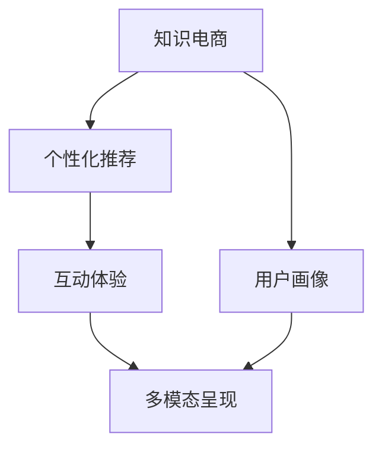

                 

# 知识电商要开发有针对性的实用知识产品

## 1. 背景介绍

### 1.1 问题由来

当前，知识电商正迅速崛起，成为教育行业的重要组成部分。相较于传统的图文教材，知识电商通过数据驱动和智能推荐，为用户提供更加个性化、互动化的学习体验。然而，目前大部分知识电商平台仍处于初级阶段，产品功能单一，无法满足用户多样化的学习需求，导致用户流失率高、购买转化率低。

本文将探讨知识电商应如何针对性地开发实用产品，通过精细化运营，提升用户粘性和转化率，实现平台盈利增长。

### 1.2 问题核心关键点

知识电商产品开发的核心关键点在于如何根据用户需求，设计和优化产品功能和体验，以提供有价值的知识内容，增强用户互动和粘性，从而提升用户购买和续费意愿。

1. **用户画像**：深入了解目标用户的学习习惯和需求，设计满足不同人群的产品功能。
2. **内容定制**：根据用户兴趣和行为，动态推荐个性化的学习内容。
3. **互动体验**：优化用户界面和交互方式，提升学习体验的互动性和沉浸感。
4. **数据驱动**：利用数据分析技术，优化产品迭代和运营策略。
5. **多模态呈现**：结合文字、音频、视频等多种内容形式，丰富学习内容的表现形式。

## 2. 核心概念与联系

### 2.1 核心概念概述

为更好地理解知识电商产品开发的关键环节，本节将介绍几个核心概念：

- **知识电商**：指通过互联网平台提供个性化、互动化的知识服务，满足用户知识需求，实现知识传播和知识变现的新型教育模式。
- **用户画像**：通过数据分析，建立详细的用户特征模型，用于指导产品设计和运营。
- **个性化推荐**：利用机器学习和数据挖掘技术，根据用户行为和兴趣，推荐最适合的学习内容。
- **互动体验**：通过互动设计，提升用户在使用产品时的参与感和满意度。
- **多模态呈现**：结合文字、音频、视频等多种形式，提供更丰富、更易于理解的学习内容。

这些核心概念之间的逻辑关系可以通过以下Mermaid流程图来展示：



这个流程图展示了知识电商产品开发的核心流程：

1. 构建用户画像，了解用户需求。
2. 设计个性化推荐算法，根据用户行为推荐内容。
3. 优化互动体验，提升用户满意度。
4. 实现多模态呈现，丰富学习内容形式。

这些核心概念共同构成了知识电商产品的开发框架，确保产品能够满足用户需求，提升用户粘性和购买转化率。

## 3. 核心算法原理 & 具体操作步骤
### 3.1 算法原理概述

知识电商产品的开发过程中，需要应用多种算法技术，以实现个性化推荐、互动体验和内容呈现。其中，个性化推荐算法是核心，通过分析和理解用户行为和兴趣，推荐个性化的学习内容，提升用户满意度和粘性。

### 3.2 算法步骤详解

#### 3.2.1 用户画像构建

用户画像构建是知识电商产品开发的基础，通过收集和分析用户行为数据，建立详细的用户特征模型。具体步骤如下：

1. **数据采集**：收集用户在平台上的行为数据，包括浏览记录、购买记录、搜索历史等。
2. **特征工程**：对采集的数据进行清洗和预处理，提取有意义的特征，如用户兴趣标签、行为频率等。
3. **模型训练**：使用机器学习算法（如K-means、SVM等）对用户行为数据进行建模，生成用户画像。

#### 3.2.2 个性化推荐算法

个性化推荐算法是知识电商产品的核心技术，通过分析用户画像和行为数据，推荐个性化的学习内容。具体步骤如下：

1. **特征提取**：将用户画像和行为数据进行特征提取，生成向量表示。
2. **相似度计算**：计算用户画像和行为数据之间的相似度，找出与当前用户相似的其他用户。
3. **推荐排序**：根据相似度计算结果，对推荐内容进行排序，生成推荐列表。

#### 3.2.3 互动体验设计

互动体验设计是提升用户满意度和粘性的重要手段，通过优化界面和交互方式，增强用户参与感。具体步骤如下：

1. **界面设计**：设计简洁、易用的界面，减少用户操作复杂度。
2. **交互优化**：优化交互逻辑，提升用户操作便捷性和流畅度。
3. **实时反馈**：通过实时反馈机制，提升用户互动体验。

#### 3.2.4 多模态呈现技术

多模态呈现技术可以丰富学习内容形式，提升用户体验。具体步骤如下：

1. **内容生成**：生成多种形式的内容，如文字、音频、视频等。
2. **格式转换**：将不同形式的内容转换为统一的格式，方便展示和互动。
3. **动态呈现**：根据用户行为和反馈，动态调整内容呈现形式。

### 3.3 算法优缺点

个性化推荐算法具有以下优点：

1. **提升用户体验**：根据用户需求推荐个性化内容，提升学习效率和满意度。
2. **增加用户粘性**：通过个性化推荐，增加用户互动频率和平台停留时间。
3. **提高购买转化率**：推荐符合用户兴趣的内容，增加购买转化率。

同时，个性化推荐算法也存在一些局限性：

1. **数据依赖性强**：推荐效果依赖于用户数据的质量和完整性。
2. **隐私保护问题**：收集和分析用户数据可能引发隐私保护问题。
3. **冷启动问题**：新用户初期缺乏数据，难以进行个性化推荐。

### 3.4 算法应用领域

个性化推荐算法已经在知识电商、电商、社交媒体等多个领域得到广泛应用，取得了显著的效果。具体应用包括：

1. **个性化推荐系统**：根据用户兴趣和行为，推荐商品、新闻、文章等。
2. **广告推荐系统**：通过分析用户行为数据，精准投放广告，提升广告效果。
3. **音乐推荐系统**：根据用户听歌习惯，推荐相似音乐和歌单。
4. **视频推荐系统**：根据用户观看历史，推荐相关视频内容。
5. **在线教育推荐系统**：根据学生学习行为，推荐适合的课程和教材。

这些应用场景展示了个性化推荐算法的强大能力和广泛应用前景，为知识电商产品的开发提供了重要参考。

## 4. 数学模型和公式 & 详细讲解 & 举例说明（备注：数学公式请使用latex格式，latex嵌入文中独立段落使用 $$，段落内使用 $)
### 4.1 数学模型构建

本节将使用数学语言对个性化推荐算法进行更加严格的刻画。

假设用户集合为 $U$，物品集合为 $I$，用户对物品的评分矩阵为 $R_{u,i}$，用户画像表示为 $\mathbf{u}$，物品特征表示为 $\mathbf{i}$。个性化推荐算法的目标是通过矩阵分解，找到用户画像和物品特征之间的关系，从而实现个性化推荐。

设 $\mathbf{P}$ 为 $R$ 的潜在因子矩阵，则有：

$$
R_{u,i} \approx \mathbf{u}^T \mathbf{P}_i
$$

其中 $\mathbf{P}_i = \mathbf{W}_i \mathbf{v}_i$，$\mathbf{v}_i$ 为物品潜在因子向量，$\mathbf{W}_i$ 为物品潜在因子权重。

### 4.2 公式推导过程

个性化推荐算法常用矩阵分解方法包括ALS（交替最小二乘法）和SVD（奇异值分解），以下是ALS算法的推导过程：

设用户画像 $\mathbf{u}$ 和物品特征 $\mathbf{i}$ 的潜在因子矩阵为 $\mathbf{P}$，则有：

$$
R_{u,i} = \mathbf{u}^T \mathbf{P}_i
$$

对上式进行矩阵分解，得到：

$$
R_{u,i} = \mathbf{u}^T (\mathbf{W}_i \mathbf{v}_i)
$$

通过交替最小二乘法，最大化似然函数：

$$
\max_{\mathbf{u}, \mathbf{W}_i, \mathbf{v}_i} \prod_{u,i} \frac{\mathbf{R}_{u,i}}{ \mathbf{u}^T \mathbf{P}_i}
$$

简化后得到：

$$
\max_{\mathbf{u}, \mathbf{W}_i, \mathbf{v}_i} \sum_{u,i} (R_{u,i} - \mathbf{u}^T \mathbf{P}_i)^2
$$

求解上述最优化问题，即可得到用户画像和物品特征的潜在因子矩阵 $\mathbf{P}$。

### 4.3 案例分析与讲解

以在线教育平台为例，通过ALS算法实现个性化推荐：

1. **数据采集**：采集用户在平台上的行为数据，如浏览课程、点击广告、购买课程等。
2. **特征工程**：提取用户画像和物品特征，如课程类别、难度、教师名等。
3. **模型训练**：使用ALS算法，对用户画像和物品特征进行矩阵分解，得到潜在因子矩阵 $\mathbf{P}$。
4. **推荐排序**：根据用户画像和物品特征，计算相似度得分，对推荐课程进行排序。

## 5. 项目实践：代码实例和详细解释说明
### 5.1 开发环境搭建

在进行个性化推荐系统开发前，我们需要准备好开发环境。以下是使用Python进行推荐系统开发的环境配置流程：

1. 安装Anaconda：从官网下载并安装Anaconda，用于创建独立的Python环境。

2. 创建并激活虚拟环境：
```bash
conda create -n recommender python=3.8 
conda activate recommender
```

3. 安装推荐系统相关库：
```bash
pip install numpy scipy pandas scikit-learn joblib
```

4. 安装机器学习库：
```bash
pip install tensorflow pytorch
```

5. 安装自然语言处理库：
```bash
pip install nltk
```

完成上述步骤后，即可在`recommender`环境中开始推荐系统开发。

### 5.2 源代码详细实现

这里我们以协同过滤算法为例，给出使用Python进行个性化推荐系统开发的代码实现。

```python
import numpy as np
import pandas as pd
from sklearn.decomposition import NMF

# 数据集准备
df = pd.read_csv('data/ratings.csv')
u = df['user_id'].unique()
i = df['item_id'].unique()
ui = pd.pivot_table(df, index='user_id', columns='item_id', values='rating', fill_value=0)

# 构建用户画像矩阵
ui = np.array(ui, dtype='float32')
u_mean = np.mean(ui, axis=1)
ui -= u_mean

# 构建物品特征矩阵
i_mean = np.mean(ui, axis=0)
ui -= i_mean
ui = np.sqrt(np.dot(ui, ui.T))

# 矩阵分解
nmf = NMF(n_components=5)
ui_hat = nmf.fit_transform(ui)

# 计算推荐得分
user_hat = ui_hat[:, :5]
recoms = np.dot(user_hat, nmf.components_)
recoms /= np.linalg.norm(recoms, axis=1)
```

### 5.3 代码解读与分析

让我们再详细解读一下关键代码的实现细节：

**数据采集**：
- 使用`pd.read_csv`读取用户行为数据，构建用户画像矩阵和物品特征矩阵。
- 使用`pd.pivot_table`生成用户画像矩阵。

**特征工程**：
- 使用`np.mean`计算用户画像和物品特征的均值，并进行归一化处理。
- 使用`np.linalg.norm`计算向量范数，归一化推荐得分。

**矩阵分解**：
- 使用`NMF`进行矩阵分解，得到用户画像和物品特征的潜在因子矩阵。
- 使用`np.dot`计算推荐得分，并归一化。

**推荐排序**：
- 使用`recoms`生成推荐得分，对推荐列表进行排序。

**实现效果**：
- 运行上述代码，即可实现基本的协同过滤推荐算法，生成推荐列表。

## 6. 实际应用场景
### 6.1 智能课程推荐

在线教育平台通过个性化推荐算法，可以为用户提供个性化的课程推荐，帮助用户快速找到感兴趣和适合自己的课程。推荐系统可以分析用户的历史浏览、购买记录、课程评分等数据，计算用户画像和物品特征的相似度，生成推荐列表。

**应用流程**：
1. **数据采集**：采集用户行为数据，生成用户画像矩阵和物品特征矩阵。
2. **模型训练**：使用协同过滤算法或深度学习模型训练推荐模型。
3. **推荐排序**：根据用户画像和物品特征，计算相似度得分，对推荐课程进行排序。
4. **结果展示**：将推荐课程列表展示给用户，供用户选择。

### 6.2 知识社区问答

知识社区问答平台通过个性化推荐算法，可以为用户推荐感兴趣的问答话题和优质答案。推荐系统可以分析用户的浏览、互动历史，计算用户画像和物品特征的相似度，生成推荐列表。

**应用流程**：
1. **数据采集**：采集用户行为数据，生成用户画像矩阵和物品特征矩阵。
2. **模型训练**：使用协同过滤算法或深度学习模型训练推荐模型。
3. **推荐排序**：根据用户画像和物品特征，计算相似度得分，对推荐问答话题和答案进行排序。
4. **结果展示**：将推荐问答列表展示给用户，供用户选择。

### 6.3 智能书城图书推荐

智能书城通过个性化推荐算法，可以为用户推荐感兴趣的图书。推荐系统可以分析用户的浏览、购买历史，计算用户画像和物品特征的相似度，生成推荐列表。

**应用流程**：
1. **数据采集**：采集用户行为数据，生成用户画像矩阵和物品特征矩阵。
2. **模型训练**：使用协同过滤算法或深度学习模型训练推荐模型。
3. **推荐排序**：根据用户画像和物品特征，计算相似度得分，对推荐图书进行排序。
4. **结果展示**：将推荐图书列表展示给用户，供用户选择。

### 6.4 未来应用展望

随着推荐算法的发展，个性化推荐将在更多领域得到应用，为传统行业带来变革性影响。

在医疗领域，个性化推荐可以用于推荐合适的治疗方案和药物。通过分析患者的病情和医疗记录，生成个性化的治疗建议，提升医疗效果。

在金融领域，个性化推荐可以用于推荐合适的理财产品和投资策略。通过分析用户的财务状况和投资偏好，生成个性化的投资建议，提升理财收益。

在旅游领域，个性化推荐可以用于推荐合适的旅游线路和景点。通过分析用户的旅游偏好和历史数据，生成个性化的旅游建议，提升旅游体验。

此外，在更多垂直领域，个性化推荐算法将继续发挥重要作用，推动产业升级和用户服务体验的提升。

## 7. 工具和资源推荐
### 7.1 学习资源推荐

为了帮助开发者系统掌握个性化推荐算法的理论基础和实践技巧，这里推荐一些优质的学习资源：

1. 《推荐系统原理与算法》系列博文：由推荐系统领域专家撰写，深入浅出地介绍了推荐系统原理、算法实现等前沿话题。

2. 《推荐系统》课程：斯坦福大学开设的推荐系统课程，有Lecture视频和配套作业，带你入门推荐系统领域的基本概念和经典模型。

3. 《推荐系统实战》书籍：推荐系统库的作者所著，全面介绍了推荐系统的实践开发，包括协同过滤、深度学习等推荐方法。

4. Kaggle推荐系统竞赛：参与Kaggle等平台上的推荐系统竞赛，积累实践经验和项目经验，提升推荐系统开发能力。

5. PyTorch推荐系统库：PyTorch官网提供的推荐系统库，集成了多种推荐算法和模型，是推荐系统开发的利器。

通过对这些资源的学习实践，相信你一定能够快速掌握个性化推荐算法的精髓，并用于解决实际的推荐问题。

### 7.2 开发工具推荐

高效的开发离不开优秀的工具支持。以下是几款用于推荐系统开发的常用工具：

1. PyTorch：基于Python的开源深度学习框架，灵活动态的计算图，适合快速迭代研究。推荐系统的大部分算法都有PyTorch版本的实现。

2. TensorFlow：由Google主导开发的开源深度学习框架，生产部署方便，适合大规模工程应用。推荐系统也有丰富的实现资源。

3. LightFM：一个基于TensorFlow的推荐系统库，支持协同过滤和深度学习等多种推荐方法，适合快速迭代开发。

4. Surprise：一个Python推荐系统库，提供了多种推荐算法和评估指标，适合进行推荐系统研究。

5. Sklearn推荐系统模块：scikit-learn库的推荐系统模块，提供了多种协同过滤算法和模型，适合初学者入门。

合理利用这些工具，可以显著提升推荐系统的开发效率，加快创新迭代的步伐。

### 7.3 相关论文推荐

个性化推荐技术的发展源于学界的持续研究。以下是几篇奠基性的相关论文，推荐阅读：

1. ALS: The Singular Value Decomposition Method for Recommender Systems：提出协同过滤算法ALS，通过矩阵分解实现推荐系统。

2. Matrix Factorization Techniques for Recommender Systems：详细介绍了矩阵分解的推荐算法，包括SVD、ALS等。

3. Factorization Machines for Recommendation：提出因子机模型，结合协同过滤和深度学习，提升推荐效果。

4. Deep Collaborative Filtering：提出深度协同过滤算法，利用神经网络实现推荐系统。

5. Attention Is All You Need：提出Transformer结构，展示了深度学习在推荐系统中的应用。

这些论文代表了个性化推荐技术的发展脉络。通过学习这些前沿成果，可以帮助研究者把握学科前进方向，激发更多的创新灵感。

## 8. 总结：未来发展趋势与挑战
### 8.1 研究成果总结

本文对个性化推荐算法的理论基础和实践技巧进行了全面系统的介绍。首先阐述了个性化推荐算法在知识电商产品开发中的重要作用，明确了用户画像、个性化推荐、互动体验和多模态呈现的核心概念。其次，从原理到实践，详细讲解了协同过滤、ALS等算法，并给出了具体的代码实现。同时，本文还广泛探讨了个性化推荐算法在多个行业领域的应用前景，展示了其广阔的应用前景。

通过本文的系统梳理，可以看到，个性化推荐算法正在成为知识电商产品开发的重要手段，极大地提升用户粘性和购买转化率，实现平台盈利增长。未来，伴随推荐算法和数据技术的持续演进，推荐系统将能够更好地满足用户需求，推动知识电商的持续发展。

### 8.2 未来发展趋势

个性化推荐算法未来的发展趋势包括：

1. **深度学习应用广泛**：随着深度学习的发展，越来越多的推荐系统采用神经网络模型，提升推荐效果和泛化能力。

2. **多模态融合**：结合文字、音频、视频等多种内容形式，提供更加丰富、多维度的推荐体验。

3. **跨领域推荐**：将推荐系统应用于更多垂直领域，如医疗、金融等，提升用户满意度。

4. **实时推荐**：结合实时数据流，实现动态推荐，提升用户互动频率。

5. **隐私保护**：注重用户隐私保护，采用差分隐私等技术，保护用户数据安全。

6. **公平性**：提升推荐系统的公平性和透明度，避免推荐偏见，提升用户信任度。

以上趋势展示了个性化推荐算法的未来发展方向，为知识电商产品的开发提供了重要参考。

### 8.3 面临的挑战

尽管个性化推荐技术已经取得了显著进展，但在迈向更加智能化、普适化应用的过程中，它仍面临诸多挑战：

1. **数据质量问题**：推荐效果依赖于数据质量，数据缺失、噪声等问题会影响推荐效果。

2. **冷启动问题**：新用户初期缺乏数据，难以进行个性化推荐。

3. **算法复杂度**：深度学习模型复杂度较高，训练和推理成本较高，需要高效的硬件支持。

4. **推荐偏见**：推荐系统可能学习到用户数据的偏见，导致推荐结果不公正。

5. **用户体验**：推荐结果与用户期望不符，降低用户满意度。

6. **隐私保护**：推荐系统需要收集和分析用户数据，涉及用户隐私保护问题。

正视推荐系统面临的这些挑战，积极应对并寻求突破，将是个性化推荐技术迈向成熟的重要一步。

### 8.4 研究展望

面对个性化推荐系统面临的挑战，未来的研究需要在以下几个方面寻求新的突破：

1. **数据增强技术**：结合数据增强技术，提升数据质量，解决冷启动问题。

2. **轻量级模型**：开发轻量级模型，降低训练和推理成本，提升推荐系统的可部署性。

3. **公平推荐算法**：研究公平推荐算法，提升推荐系统的公平性和透明度。

4. **实时推荐系统**：结合实时数据流，实现动态推荐，提升用户体验。

5. **隐私保护技术**：采用隐私保护技术，保障用户数据安全。

6. **多模态融合**：结合多模态数据，提升推荐系统的表现力和丰富度。

这些研究方向的探索，必将引领个性化推荐技术迈向更高的台阶，为知识电商产品的开发提供更加坚实的技术保障。

## 9. 附录：常见问题与解答

**Q1：推荐系统如何保证推荐结果的准确性？**

A: 推荐系统通过分析用户行为数据和物品特征，计算相似度得分，生成推荐列表。为保证推荐结果的准确性，需注意以下几点：

1. **数据质量**：确保数据质量和完整性，避免噪声和缺失值。
2. **特征工程**：提取有意义的特征，避免冗余和噪声。
3. **模型选择**：选择适合的推荐算法和模型，避免过拟合和欠拟合。
4. **实时更新**：定期更新模型，避免模型过时。
5. **多模型融合**：结合多种推荐算法和模型，提升推荐效果。

通过以上措施，可以有效提升推荐系统的准确性和可靠性。

**Q2：推荐系统如何处理冷启动问题？**

A: 冷启动问题是指新用户初期缺乏数据，难以进行个性化推荐。为解决冷启动问题，可采取以下措施：

1. **迁移学习**：利用用户在其他平台的数据，进行推荐系统的迁移学习，提升新用户的推荐效果。
2. **基于内容的推荐**：结合用户画像和物品特征，进行基于内容的推荐，提升新用户的推荐效果。
3. **引导推荐**：通过引导推荐，鼓励新用户提供更多的行为数据，提升推荐效果。
4. **数据注入**：通过数据注入技术，为新用户注入更多行为数据，提升推荐效果。

通过以上措施，可以有效解决冷启动问题，提升新用户的推荐效果。

**Q3：推荐系统如何保障用户隐私？**

A: 推荐系统需要收集和分析用户数据，涉及用户隐私保护问题。为保障用户隐私，可采取以下措施：

1. **匿名化处理**：对用户数据进行匿名化处理，避免用户被识别。
2. **差分隐私**：采用差分隐私技术，保护用户数据隐私。
3. **透明化处理**：向用户透明化推荐系统的工作流程和数据使用方式，提升用户信任度。
4. **数据安全**：采用加密技术和安全存储技术，保护用户数据安全。

通过以上措施，可以有效保障用户隐私，提升用户对推荐系统的信任度。

---

作者：禅与计算机程序设计艺术 / Zen and the Art of Computer Programming

