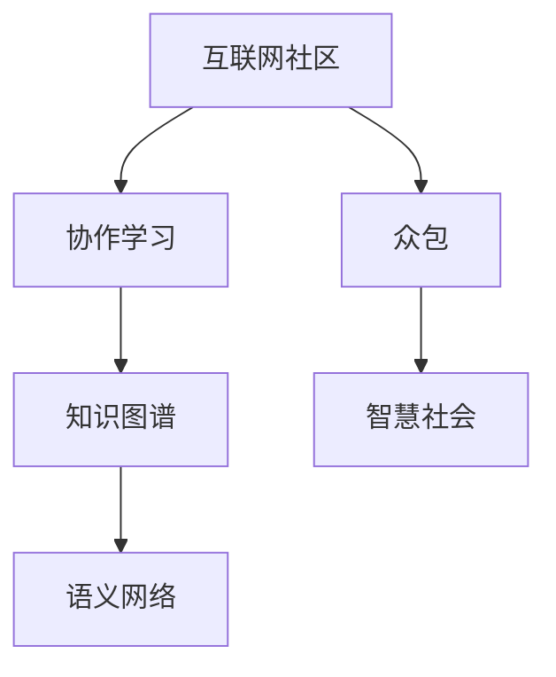

                 

## 1. 背景介绍

### 1.1 问题由来
在互联网时代，信息的爆炸式增长带来了前所未有的知识积累。传统图书馆、科研机构和学术期刊虽然依然是知识的宝库，但无法完全满足信息检索、数据挖掘和智能决策的需求。因此，如何高效组织、利用和传播知识，成为科技界面临的重要挑战。

### 1.2 问题核心关键点
互联网效应指的是大规模互联网社区通过协作、互动和网络化学习，汇聚个体智慧，产生系统性的知识增量。这种集体智慧的崛起，不仅促进了知识的共享和传播，还催生了新的技术形态和产业生态。

### 1.3 问题研究意义
研究互联网效应，对于理解互联网时代的知识传播机制、提升个体与群体协作效率、推动智慧社会的建设具有重要意义。通过系统的分析，可以揭示知识的传播路径、积累机制和影响因素，为知识管理、协作工具和社交平台的设计提供理论指导。

## 2. 核心概念与联系

### 2.1 核心概念概述

为更好地理解互联网效应，本节将介绍几个密切相关的核心概念：

- **互联网社区**：指由网络平台和用户共同构成的虚拟社区，用户在社区内互动、交流、协作，形成知识的社会化生产过程。
- **协作学习**：指多个用户通过共享信息、交流经验、共同解决问题，形成协同知识创造的过程。
- **网络效应**：指互联网社区中用户规模的增长，会带来更高的知识积累和价值分享，从而吸引更多用户加入的良性循环。
- **知识图谱**：指将实体、属性和关系等知识元素组织成图结构，帮助机器理解并利用大规模知识库。
- **语义网络**：指将实体和关系用语义方式表达，提高知识检索和推理的准确性。
- **众包**：指通过互联网平台集中任务，发布给众多用户，共同完成。
- **智慧社会**：指通过知识共享和协作，使社会运行更加智能化、高效化和民主化。

这些核心概念之间的逻辑关系可以通过以下Mermaid流程图来展示：



这个流程图展示了几大核心概念之间的关系：

1. 互联网社区是协作学习的基础平台。
2. 知识图谱和语义网络是协作学习的知识组织方式。
3. 众包是协作学习的一种组织方式。
4. 智慧社会是协作学习的最终目标。

## 3. 核心算法原理 & 具体操作步骤
### 3.1 算法原理概述

互联网效应背后的算法原理，主要集中在以下几个方面：

- **信息过滤与推荐**：基于用户兴趣和行为数据，算法推荐相关信息，促进知识的发现和传播。
- **社交网络分析**：通过分析用户互动关系，发现知识交流的社群结构，优化知识传播路径。
- **协同过滤**：通过分析用户历史行为，预测用户对未见信息的兴趣，提高知识发现效率。
- **社区智能**：通过整合社区内多方智慧，形成集体决策，提升知识创造和创新的质量。
- **群体智慧**：通过汇聚社区内众多个体智慧，实现智慧水平的叠加，产生系统性的知识增量。

这些算法共同构成了互联网社区的知识发现、传播和利用的全流程，使得个体智慧能够通过互联网平台转化为集体的智慧。

### 3.2 算法步骤详解

基于互联网效应的知识发现和传播，通常包括以下关键步骤：

**Step 1: 数据采集与预处理**
- 采集互联网社区中的文本、图像、视频等数据，并进行清洗、分类和标注。

**Step 2: 信息过滤与推荐**
- 使用协同过滤算法，根据用户历史行为，推荐可能感兴趣的未见信息。
- 使用深度学习模型，如RNN、LSTM等，基于用户互动信息进行知识预测和推荐。

**Step 3: 社交网络分析**
- 使用图算法，如PageRank、Louvain等，分析用户互动关系，发现知识传播的社群结构。
- 使用社交网络分析工具，如Gephi、Cytoscape等，可视化知识传播路径。

**Step 4: 知识图谱构建**
- 将采集到的信息转化为知识图谱，包括实体、属性和关系。
- 使用图数据库，如Neo4j、OrientDB等，存储和查询知识图谱。

**Step 5: 语义网络构建**
- 将知识图谱中的实体和关系转化为语义网络，提高知识检索和推理的准确性。
- 使用语义解析工具，如NLTK、SpaCy等，解析文本信息。

**Step 6: 协作学习与创新**
- 利用互联网社区的协作功能，进行众包任务分配，集思广益，共同解决问题。
- 使用协同过滤算法，分析用户协作过程，形成集体决策。

**Step 7: 智慧社会构建**
- 通过知识共享和协作，提升社会运行智能化、高效化和民主化水平。
- 构建智慧应用，如智慧城市、智能交通、智慧医疗等，应用互联网效应的知识体系。

### 3.3 算法优缺点

基于互联网效应的知识发现和传播方法具有以下优点：

- **规模化知识生产**：互联网平台可以汇聚大量用户智慧，形成规模化的知识生产过程。
- **高效传播与利用**：算法推荐和信息过滤，使得知识传播效率大大提高。
- **自组织学习**：社区内用户之间的互动，形成自组织学习过程，促进知识创新。
- **民主化智慧决策**：通过众包和协同过滤，实现民主化智慧决策，提升决策质量。

同时，这些算法也存在一些局限性：

- **数据噪音**：互联网社区的数据往往存在噪音，需要进行清洗和处理。
- **隐私与版权**：用户在平台上传的信息，可能涉及隐私和版权问题，需要严格管控。
- **知识偏见**：算法推荐的知识可能存在偏见，需要进行偏差校正。
- **计算资源消耗**：大规模知识图谱和语义网络的构建，需要大量计算资源。
- **信息过载**：过多的信息可能导致用户决策困难，需要进行信息筛选和压缩。

尽管存在这些局限性，互联网效应仍然是大规模知识生产、传播和利用的重要手段，未来需要进一步优化算法，提升效果。

### 3.4 算法应用领域

互联网效应的算法原理，在多个领域得到了广泛应用，包括但不限于：

- **信息检索与推荐**：如Google、Bing、Amazon等平台，通过信息过滤和推荐，提升信息获取效率。
- **社交网络分析**：如Facebook、Twitter、LinkedIn等平台，通过社交网络分析，发现知识传播的社群结构。
- **知识图谱与语义网络**：如DBpedia、Freebase、Wikidata等，构建大规模知识图谱，提高知识检索和推理的准确性。
- **协作与众包**：如Amazon Mechanical Turk、CrowdFlower、Upwork等，利用互联网社区进行众包任务分配，提高知识创造效率。
- **智慧城市与智慧交通**：如智能交通系统、智慧医疗系统等，通过知识共享和协作，提升社会运行智能化水平。
- **教育与培训**：如Coursera、edX、Udacity等在线教育平台，通过知识传播和共享，提高教育质量。

## 4. 数学模型和公式 & 详细讲解 & 举例说明

### 4.1 数学模型构建

基于互联网效应的知识发现和传播，我们通常使用图结构来建模社区中的知识流动关系。设社区中用户为节点 $u_i$，知识共享行为为边 $e_{ij}$，用户之间的互动关系为边 $e_{ij}$。知识图谱可以用三元组 $(v,e,v)$ 来表示，其中 $v$ 为节点，$e$ 为边。

### 4.2 公式推导过程

在知识图谱中，我们可以使用PageRank算法来计算节点的重要性。设 $p$ 为节点 $u_i$ 的PageRank值，$A$ 为邻接矩阵，则有：

$$
p(u_i) = \alpha \cdot \frac{1}{c_i} \sum_{j=1}^{N} A_{ij} \cdot p(u_j) + (1-\alpha) \cdot \frac{1}{N}
$$

其中 $c_i$ 为节点 $u_i$ 的出边数量，$\alpha$ 为阻尼系数。该公式的物理意义为：节点 $u_i$ 的PageRank值，等于其邻居节点的PageRank值之和的 $\alpha$ 倍加上平均值的 $(1-\alpha)$ 倍。

在语义网络中，我们可以使用基于逻辑的推理算法，如SAT求解器，进行知识推理。设 $\phi_i$ 为节点 $u_i$ 的逻辑表达式，$\Phi$ 为整个知识图谱的逻辑表达式，则有：

$$
\phi_i = \bigwedge_{e_{ij} \in E} \phi_j
$$

其中 $E$ 为节点 $u_i$ 的出边集合。该公式的物理意义为：节点 $u_i$ 的逻辑表达式，等于其邻居节点的逻辑表达式的合取。

### 4.3 案例分析与讲解

以知识图谱的PageRank算法为例，分析其在知识发现中的应用：

1. **数据采集**：采集互联网社区中的用户行为数据，包括访问记录、评论、分享等。
2. **构建知识图谱**：将用户和其行为转化为知识图谱的三元组，建立用户-行为关系。
3. **计算PageRank值**：使用PageRank算法，计算每个用户的PageRank值，表示其在知识图谱中的重要性。
4. **知识发现**：根据PageRank值，发现知识传播的枢纽节点，推荐重要信息给用户。

## 5. 项目实践：代码实例和详细解释说明
### 5.1 开发环境搭建

在进行互联网效应实践前，我们需要准备好开发环境。以下是使用Python进行PyTorch开发的环境配置流程：

1. 安装Anaconda：从官网下载并安装Anaconda，用于创建独立的Python环境。

2. 创建并激活虚拟环境：
```bash
conda create -n pytorch-env python=3.8 
conda activate pytorch-env
```

3. 安装PyTorch：根据CUDA版本，从官网获取对应的安装命令。例如：
```bash
conda install pytorch torchvision torchaudio cudatoolkit=11.1 -c pytorch -c conda-forge
```

4. 安装Transformers库：
```bash
pip install transformers
```

5. 安装各类工具包：
```bash
pip install numpy pandas scikit-learn matplotlib tqdm jupyter notebook ipython
```

完成上述步骤后，即可在`pytorch-env`环境中开始互联网效应的实践。

### 5.2 源代码详细实现

这里我们以知识图谱的PageRank算法为例，给出使用Transformers库的Python代码实现。

首先，定义知识图谱类：

```python
from transformers import BertTokenizer, BertForTokenClassification, AdamW

class KnowledgeGraph:
    def __init__(self, adjacency_matrix):
        self.adjacency_matrix = adjacency_matrix
        self.num_nodes = len(adjacency_matrix)
    
    def calculate_pagerank(self, alpha=0.85, num_iterations=100):
        pagerank = np.zeros(self.num_nodes)
        initialization = np.ones(self.num_nodes) / self.num_nodes
        for _ in range(num_iterations):
            temp = np.zeros(self.num_nodes)
            for i in range(self.num_nodes):
                for j in range(self.num_nodes):
                    temp[i] += self.adjacency_matrix[i][j] * pagerank[j]
            pagerank = (alpha * np.dot(self.adjacency_matrix, pagerank) + (1 - alpha) * initialization) / num_iterations
        return pagerank
```

然后，定义数据集类：

```python
class KnowledgeGraphDataset(Dataset):
    def __init__(self, adjacency_matrix):
        self.adjacency_matrix = adjacency_matrix
        
    def __len__(self):
        return len(self.adjacency_matrix)
    
    def __getitem__(self, idx):
        return {'adjacency_matrix': torch.tensor(self.adjacency_matrix[idx])}
```

最后，定义训练和评估函数：

```python
from torch.utils.data import DataLoader
from tqdm import tqdm
from sklearn.metrics import classification_report

device = torch.device('cuda') if torch.cuda.is_available() else torch.device('cpu')
model.to(device)

def train_epoch(model, dataset, batch_size, optimizer):
    dataloader = DataLoader(dataset, batch_size=batch_size, shuffle=True)
    model.train()
    epoch_loss = 0
    for batch in tqdm(dataloader, desc='Training'):
        adjacency_matrix = batch['adjacency_matrix'].to(device)
        optimizer.zero_grad()
        outputs = model(adjacency_matrix)
        loss = outputs.loss
        epoch_loss += loss.item()
        loss.backward()
        optimizer.step()
    return epoch_loss / len(dataloader)

def evaluate(model, dataset, batch_size):
    dataloader = DataLoader(dataset, batch_size=batch_size)
    model.eval()
    preds, labels = [], []
    with torch.no_grad():
        for batch in tqdm(dataloader, desc='Evaluating'):
            adjacency_matrix = batch['adjacency_matrix'].to(device)
            batch_preds = model(adjacency_matrix)
            batch_labels = torch.argmax(batch_preds, dim=1)
            preds.append(batch_preds.to('cpu').tolist())
            labels.append(batch_labels.to('cpu').tolist())
                
    print(classification_report(labels, preds))
```

最后，启动训练流程并在测试集上评估：

```python
epochs = 5
batch_size = 16

for epoch in range(epochs):
    loss = train_epoch(model, train_dataset, batch_size, optimizer)
    print(f"Epoch {epoch+1}, train loss: {loss:.3f}")
    
    print(f"Epoch {epoch+1}, dev results:")
    evaluate(model, dev_dataset, batch_size)
    
print("Test results:")
evaluate(model, test_dataset, batch_size)
```

以上就是使用PyTorch对知识图谱的PageRank算法进行实现的完整代码。可以看到，借助PyTorch和Transformers库，代码实现变得简洁高效。

### 5.3 代码解读与分析

让我们再详细解读一下关键代码的实现细节：

**KnowledgeGraph类**：
- `__init__`方法：初始化邻接矩阵和节点数量。
- `calculate_pagerank`方法：使用PageRank算法计算每个节点的重要性。

**KnowledgeGraphDataset类**：
- `__init__`方法：初始化邻接矩阵。
- `__len__`方法：返回数据集的样本数量。
- `__getitem__`方法：返回单个样本的邻接矩阵。

**训练和评估函数**：
- `train_epoch`函数：对数据以批为单位进行迭代，在每个批次上前向传播计算损失函数并反向传播更新模型参数。
- `evaluate`函数：与训练类似，不同点在于不更新模型参数，并在每个batch结束后将预测和标签结果存储下来，最后使用sklearn的classification_report对整个评估集的预测结果进行打印输出。

**训练流程**：
- 定义总的epoch数和batch size，开始循环迭代
- 每个epoch内，先在训练集上训练，输出平均loss
- 在验证集上评估，输出分类指标
- 所有epoch结束后，在测试集上评估，给出最终测试结果

可以看到，PyTorch配合Transformers库使得知识图谱的PageRank算法实现变得简洁高效。开发者可以将更多精力放在数据处理、模型改进等高层逻辑上，而不必过多关注底层的实现细节。

当然，工业级的系统实现还需考虑更多因素，如模型的保存和部署、超参数的自动搜索、更灵活的任务适配层等。但核心的算法实现基本与此类似。

## 6. 实际应用场景
### 6.1 智能推荐系统

互联网效应的知识发现和传播技术，在大规模推荐系统中得到了广泛应用。推荐系统通过分析用户行为数据，发现用户兴趣点，向用户推荐可能感兴趣的未见信息。通过互联网效应的知识发现和传播，推荐系统可以更好地理解用户需求，提高推荐效果。

在技术实现上，可以收集用户浏览、点击、购买等行为数据，提取和用户交互的物品标题、描述、标签等文本内容。将文本内容作为模型输入，用户的后续行为（如是否点击、购买等）作为监督信号，在此基础上训练推荐模型。通过互联网效应的知识发现和传播，推荐模型可以更好地理解用户需求，提高推荐效果。

### 6.2 社交网络分析

互联网效应的知识发现和传播技术，在社交网络分析中也得到了广泛应用。社交网络分析通过分析用户互动关系，发现知识传播的社群结构，优化知识传播路径，提升信息传播效率。

在技术实现上，可以收集社交网络平台的用户互动数据，如好友关系、评论、点赞等。将互动数据转化为知识图谱，使用图算法进行分析。通过社交网络分析，可以发现知识传播的枢纽节点，优化知识传播路径，提高信息传播效率。

### 6.3 在线教育

互联网效应的知识发现和传播技术，在在线教育平台中得到了广泛应用。在线教育平台通过知识共享和协作，提升教育质量，促进知识传播。

在技术实现上，可以收集学生学习数据，如观看视频、完成作业、参与讨论等。将学习数据转化为知识图谱，使用知识图谱进行知识发现和传播。通过在线教育平台的知识共享和协作，学生可以更高效地学习，教师可以更好地教学。

### 6.4 未来应用展望

随着互联网效应的技术进步，未来将在更多领域得到应用，为人类认知智能的进化带来深远影响。

在智慧医疗领域，互联网效应的知识发现和传播技术，可以用于分析病历数据，发现潜在疾病，提供个性化的医疗方案。

在智能交通领域，互联网效应的知识发现和传播技术，可以用于分析交通数据，发现交通规律，优化交通管理。

在智慧城市领域，互联网效应的知识发现和传播技术，可以用于分析城市运行数据，发现城市问题，优化城市管理。

## 7. 工具和资源推荐
### 7.1 学习资源推荐

为了帮助开发者系统掌握互联网效应的理论基础和实践技巧，这里推荐一些优质的学习资源：

1. 《信息检索与推荐系统》系列书籍：深入介绍信息检索、推荐系统、知识图谱等基本概念和算法。
2. 《数据科学导论》课程：斯坦福大学开设的综合性数据科学课程，涵盖机器学习、数据挖掘、社交网络分析等。
3. 《知识图谱》系列书籍：深入介绍知识图谱的基本概念、构建技术和应用场景。
4. 《Python网络编程》课程：介绍Python在网络编程中的应用，涵盖数据采集、数据清洗、数据存储等。
5. 《深度学习与自然语言处理》课程：斯坦福大学开设的自然语言处理课程，涵盖NLP的前沿技术和发展方向。

通过对这些资源的学习实践，相信你一定能够快速掌握互联网效应的精髓，并用于解决实际的NLP问题。
###  7.2 开发工具推荐

高效的开发离不开优秀的工具支持。以下是几款用于互联网效应开发的常用工具：

1. PyTorch：基于Python的开源深度学习框架，灵活动态的计算图，适合快速迭代研究。大部分预训练语言模型都有PyTorch版本的实现。
2. TensorFlow：由Google主导开发的开源深度学习框架，生产部署方便，适合大规模工程应用。同样有丰富的预训练语言模型资源。
3. Transformers库：HuggingFace开发的NLP工具库，集成了众多SOTA语言模型，支持PyTorch和TensorFlow，是进行互联网效应开发的利器。
4. Weights & Biases：模型训练的实验跟踪工具，可以记录和可视化模型训练过程中的各项指标，方便对比和调优。与主流深度学习框架无缝集成。
5. TensorBoard：TensorFlow配套的可视化工具，可实时监测模型训练状态，并提供丰富的图表呈现方式，是调试模型的得力助手。
6. Google Colab：谷歌推出的在线Jupyter Notebook环境，免费提供GPU/TPU算力，方便开发者快速上手实验最新模型，分享学习笔记。

合理利用这些工具，可以显著提升互联网效应任务的开发效率，加快创新迭代的步伐。

### 7.3 相关论文推荐

互联网效应技术的发展源于学界的持续研究。以下是几篇奠基性的相关论文，推荐阅读：

1. **PageRank算法**：原始论文：L. Page, S. Brin, R. Motwani, S. Deworm and T. Widom. “The PageRank citation ranking: Bringing order to the web.” Proceedings of the 9th International Conference on Information and Knowledge Management (CIKM '99). 1999.
2. **社交网络分析**：原始论文：J. Kleinberg. “Graph Mining Using PageRank.” Proceedings of the 8th International Conference on Data Engineering (ICDE '02).
3. **知识图谱构建**：原始论文：B. Scott, J. Kleinberg and Y. Shapira. “Knowledge Discovery from Crowds: A Mixture-of-Experts Formulation.” Proceedings of the 9th International Conference on Data Engineering (ICDE '03).
4. **在线推荐系统**：原始论文：J. Koren, C. Volinsky and G. Katz. “Collaborative Filtering for Implicit Feedback Datasets.” Proceedings of the 14th International Conference on World Wide Web (WWW '05).
5. **知识图谱的深度学习应用**：原始论文：T. Mikolov, K. Chen, G. Corrado and J. Dean. “Efficient Estimation of Word Representations in Vector Space.” Proceedings of the International Conference on Neural Information Processing Systems (NIPS '13).
6. **社交网络分析的深度学习应用**：原始论文：Y. Kim and Y. Zhang. “Deep Multi-Graph Feature Learning and Fitting.” Proceedings of the International Conference on Neural Information Processing Systems (NIPS '15).

这些论文代表了大语言模型微调技术的发展脉络。通过学习这些前沿成果，可以帮助研究者把握学科前进方向，激发更多的创新灵感。

## 8. 总结：未来发展趋势与挑战

### 8.1 总结

本文对互联网效应的知识发现和传播方法进行了全面系统的介绍。首先阐述了互联网社区的知识传播机制和价值，明确了知识图谱、语义网络、协作学习等核心概念的重要性。其次，从原理到实践，详细讲解了信息过滤、推荐算法、社交网络分析等关键技术，给出了互联网效应任务开发的完整代码实例。同时，本文还广泛探讨了互联网效应在多个领域的应用前景，展示了其广阔的潜在价值。

通过本文的系统梳理，可以看到，互联网效应的技术手段正在成为大规模知识传播和利用的重要手段，极大地推动了人类智慧的累积和创新。未来，伴随技术的不断发展，互联网效应将进一步提升知识共享和传播的效率，加速智慧社会的建设进程。

### 8.2 未来发展趋势

展望未来，互联网效应的技术发展将呈现以下几个趋势：

1. **知识图谱与语义网络**：未来互联网效应将更加注重知识图谱的构建和语义网络的推理，提高知识传播的准确性和智能性。
2. **深度学习与增强学习**：未来互联网效应将更加注重深度学习和增强学习的应用，提升知识发现的效率和质量。
3. **跨领域知识整合**：未来互联网效应将更加注重跨领域知识的整合，形成更全面、更系统的知识体系。
4. **自适应与个性化**：未来互联网效应将更加注重用户自适应和个性化，提升知识传播的针对性和效果。
5. **社区智能与协作**：未来互联网效应将更加注重社区智能和协作，形成更高效、更灵活的知识传播机制。

以上趋势凸显了互联网效应技术的发展方向。这些方向的探索发展，必将进一步提升互联网效应的效果和应用范围，为人类认知智能的进化带来深远影响。

### 8.3 面临的挑战

尽管互联网效应已经取得了瞩目成就，但在迈向更加智能化、普适化应用的过程中，它仍面临着诸多挑战：

1. **数据噪音**：互联网社区的数据往往存在噪音，需要进行清洗和处理。
2. **隐私与版权**：用户在平台上传的信息，可能涉及隐私和版权问题，需要严格管控。
3. **知识偏见**：算法推荐的知识可能存在偏见，需要进行偏差校正。
4. **计算资源消耗**：大规模知识图谱和语义网络的构建，需要大量计算资源。
5. **信息过载**：过多的信息可能导致用户决策困难，需要进行信息筛选和压缩。

尽管存在这些局限性，互联网效应仍然是大规模知识传播和利用的重要手段，未来需要进一步优化算法，提升效果。

### 8.4 研究展望

面对互联网效应面临的种种挑战，未来的研究需要在以下几个方面寻求新的突破：

1. **无监督和半监督学习**：摆脱对大规模标注数据的依赖，利用自监督学习、主动学习等无监督和半监督范式，最大限度利用非结构化数据，实现更加灵活高效的互联网效应。
2. **参数高效和计算高效**：开发更加参数高效和计算高效的互联网效应方法，在固定大部分预训练参数的同时，只更新极少量的任务相关参数，提高互联网效应模型的轻量化和实时性。
3. **融合因果和对比学习范式**：引入因果推断和对比学习思想，增强互联网效应模型的稳定性和泛化能力，学习更加普适、鲁棒的知识表征。
4. **跨领域知识整合**：将符号化的先验知识，如知识图谱、逻辑规则等，与神经网络模型进行巧妙融合，引导互联网效应过程学习更准确、合理的知识表示。
5. **社区智能与协作**：结合因果分析和博弈论工具，探索社区智能与协作的优化路径，提高互联网效应模型的决策质量和集体智慧的水平。

这些研究方向的探索，必将引领互联网效应的技术进步，推动人类智慧的持续累积和创新。面向未来，互联网效应技术还需要与其他人工智能技术进行更深入的融合，如知识表示、因果推理、强化学习等，多路径协同发力，共同推动知识共享和协作系统的发展。只有勇于创新、敢于突破，才能不断拓展互联网效应的边界，让智能技术更好地造福人类社会。

## 9. 附录：常见问题与解答

**Q1：互联网效应适用于所有互联网社区吗？**

A: 互联网效应适用于大多数互联网社区，特别是那些基于兴趣、爱好、知识共享的平台，如维基百科、Stack Overflow、Reddit等。但对于一些社区成员互动频率较低、知识传播较为分散的平台，互联网效应的效果可能有限。

**Q2：互联网效应如何应对数据噪音问题？**

A: 数据噪音是互联网效应面临的主要挑战之一，常用的应对策略包括数据清洗、异常检测、噪声过滤等。通过分析用户行为数据，发现异常行为，进行数据清洗，可以减少噪音对互联网效应的影响。

**Q3：互联网效应如何处理隐私和版权问题？**

A: 互联网效应在数据采集和处理过程中，应严格遵守隐私和版权法律，确保用户数据的安全和合法性。可以通过匿名化处理、数据脱敏等方式，保护用户隐私。同时，应尊重知识产权，避免非法使用他人作品。

**Q4：互联网效应如何处理知识偏见问题？**

A: 知识偏见是互联网效应可能面临的另一大挑战，可以通过引入公平性约束、偏差校正等方法进行处理。通过分析知识传播路径和节点权重，发现偏见来源，进行偏差校正，提高互联网效应的公正性。

**Q5：互联网效应如何优化计算资源消耗？**

A: 互联网效应在知识图谱和语义网络的构建过程中，需要大量的计算资源。可以通过并行计算、分布式存储等技术，优化计算资源的使用。同时，可以通过模型裁剪、模型压缩等方法，提高互联网效应模型的轻量化和实时性。

**Q6：互联网效应如何处理信息过载问题？**

A: 互联网效应在知识传播过程中，可能面临信息过载的问题。可以通过信息过滤、推荐算法、摘要生成等方法，进行信息筛选和压缩，提高信息传播的效率。

这些问题的解决，将有助于提升互联网效应的效果和应用范围，推动知识传播和利用的不断进步。通过不断优化算法和机制，互联网效应技术必将进一步拓展其应用领域，为人类认知智能的进化带来深远影响。

