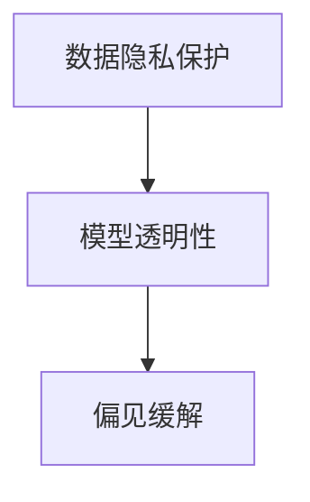

                 

# 知识的伦理维度：科技发展的道德约束

> 关键词：知识伦理, 科技道德, 人工智能, 数据隐私, 透明性, 可解释性, 偏见缓解, 隐私保护, 伦理审查

## 1. 背景介绍

### 1.1 问题由来
随着信息技术的迅猛发展，人工智能(AI)、大数据等新兴科技已经渗透到社会的各个角落，极大地改变了人类的生产生活方式。然而，这些科技的广泛应用也带来了诸多伦理和道德问题。比如，人工智能决策的透明度和可解释性不足，数据隐私保护问题，以及算法偏见和歧视等。这些问题已经成为制约科技发展的瓶颈，迫切需要社会各界共同关注和解决。

本文聚焦于科技发展的道德约束问题，探讨在知识伦理框架下，如何引导和规范AI技术的合理应用。希望通过深入分析，为科技伦理规范提供理论支撑和实践指导。

### 1.2 问题核心关键点
科技发展的道德约束是当前人工智能领域亟待解决的核心问题之一。其中，数据隐私保护、模型透明性和偏见缓解是三个最为关键的点：

- **数据隐私保护**：数据是AI模型的核心，但收集、存储和使用数据的过程中，存在着诸多隐私泄露的风险。如何在保护隐私的前提下进行数据处理，是一个重大挑战。
- **模型透明性**：AI模型的内部机制和决策过程往往难以理解，这不仅影响了用户的信任，也可能导致错误的决策。如何提高模型的透明性和可解释性，是科技伦理的重要课题。
- **偏见缓解**：AI模型往往会从训练数据中学习到固有的偏见，导致性别、种族等社会问题被放大。如何在模型开发和应用中缓解偏见，确保公平性，是AI技术发展的关键。

本文将从数据隐私保护、模型透明性和偏见缓解三个方面，深入探讨AI技术的道德约束问题，并给出具体的解决策略。

## 2. 核心概念与联系

### 2.1 核心概念概述

为更好地理解科技发展的道德约束问题，本节将介绍几个关键核心概念：

- **数据隐私保护**：指在数据处理过程中，保护个人隐私和数据安全的原则和措施。核心在于确保数据不被未授权者访问和使用。
- **模型透明性**：指AI模型的内部机制和决策过程的透明性，用户可以理解和验证模型输出的合理性。模型透明性有助于建立信任，提升用户接受度。
- **偏见缓解**：指在模型开发和应用过程中，减少和消除算法偏见，确保不同群体公平对待的原则和措施。

这些核心概念之间的逻辑关系可以通过以下Mermaid流程图来展示：



这个流程图展示了大语言模型的核心概念及其之间的关系：

1. 数据隐私保护是模型透明性和偏见缓解的前提和基础。只有在数据隐私得到保障的情况下，才能确保模型透明性和偏见缓解的有效性。
2. 模型透明性有助于揭示偏见来源，进一步推动偏见缓解。只有透明的模型，才能进行有效的偏见检测和缓解。
3. 偏见缓解不仅提升了模型的公平性，也增强了用户对模型的信任，间接促进了数据隐私保护和模型透明性。

## 3. 核心算法原理 & 具体操作步骤

### 3.1 算法原理概述

科技发展的道德约束问题，本质上是如何在技术创新和伦理道德之间找到平衡点。本文将从数据隐私保护、模型透明性和偏见缓解三个方面，详细介绍具体的算法原理和操作步骤。

### 3.2 算法步骤详解

#### 3.2.1 数据隐私保护

**数据匿名化**：通过去除或模糊化个人身份信息，保护数据隐私。例如，对用户的个人信息进行去标识化，使用泛化技术对敏感数据进行处理。

**差分隐私**：在数据查询或分析过程中，引入噪声，使个体数据的隐私泄露风险降到最低。例如，通过Laplace机制和Gamma机制进行差分隐私保护。

**联邦学习**：在分布式环境中，多个参与方共同参与模型训练，避免数据集中存储和传输。例如，参与方通过加密模型参数进行通信，本地更新后再汇总计算全局模型。

**数据加密**：在数据存储和传输过程中，使用加密技术保护数据安全。例如，使用AES、RSA等加密算法对数据进行加密。

**隐私预算**：在隐私保护过程中，量化隐私泄露的风险，控制隐私预算的使用。例如，利用Gamma分布计算隐私预算，确保隐私保护的有效性。

**隐私审计**：定期对数据处理过程进行审计，确保隐私保护措施的有效性。例如，使用隐私保护工具进行审计，发现隐私泄露风险并及时修正。

**示例代码**

```python
from differential_privacy import LaplaceMechanism, DPStochasticGradientDescent
from fl Experiment:`

# 差分隐私
mechanism = LaplaceMechanism(epsilon=1.0)
dp_sgd = DPStochasticGradientDescent(model, mechanism, batch_size=32)

# 联邦学习
from FL federated_learning import DistributedModelTrainer
trainer = DistributedModelTrainer(model, parameters, servers)

# 数据加密
from cryptography.fernet import Fernet
key = Fernet.generate_key()
cipher_suite = Fernet(key)

# 隐私预算
from differential_privacy DP import DPBase, epsilon_differential_privacy
model = epsilon_differential_privacy(model, epsilon=1.0)

# 隐私审计
from differential_privacy DP import DPAudit
audit = DPAudit(model, epsilon=1.0)
```

#### 3.2.2 模型透明性

**模型解释方法**：通过解释模型决策过程，使用户理解模型输出的合理性。例如，使用LIME、SHAP等方法生成特征重要性可视化图表。

**模型可解释性框架**：构建可解释性框架，如LIME、SHAP、TCA等，用于生成模型特征重要性、部分依赖图等可视化信息。

**可视化工具**：使用可视化工具，如TensorBoard、Tableau等，展示模型训练和推理过程。

**示例代码**

```python
from lime import LIME
from shap import SHAP
from tensorflow.keras import Model
from tensorboard import SummaryWriter

# 模型解释方法
interpreter = LIME(model)
feature_importance = interpreter.fit_predict(x_train)
visualization = interpreter.lime_tabular_features(explanation)

# 模型可解释性框架
shap_values = SHAP(model).transform(X_train)
visualization = SHAP.force_plot(shap_values, model.predict(X_train))

# 可视化工具
writer = SummaryWriter()
writer.add_graph(model.graph)
```

#### 3.2.3 偏见缓解

**数据预处理**：对训练数据进行去噪、归一化、随机化等预处理，减少数据本身的偏见。例如，使用SMOTE、ADASYN等算法进行样本平衡处理。

**模型偏见检测**：在模型训练过程中，检测并调整模型中的偏见。例如，使用Fairness Indicators等工具检测模型偏见。

**偏见校正**：对模型进行有针对性的调整，减少模型中的固有偏见。例如，通过调整模型权重、引入正则化项等方式进行偏见校正。

**样本分布调整**：在模型训练过程中，调整样本分布，确保模型对不同群体的公平对待。例如，使用Adversarial Debiasing等方法调整样本分布。

**示例代码**

```python
from imblearn.over_sampling import SMOTE
from adversarial_debiasing import AdversarialDebiasing
from sklearn.metrics import fairness_indicators

# 数据预处理
smote = SMOTE(random_state=0)
X_train, y_train = smote.fit_resample(X_train, y_train)

# 模型偏见检测
fairness_indicators(model, X_train, y_train)

# 偏见校正
adversarial_debiasing = AdversarialDebiasing(model)
adversarial_debiasing.fit(X_train, y_train)

# 样本分布调整
adversarial_debiasing.fit(X_train, y_train)
```

### 3.3 算法优缺点

#### 3.3.1 数据隐私保护

**优点**：
- 保护数据隐私，确保数据不被未授权者访问和使用。
- 降低隐私泄露风险，增强用户信任。

**缺点**：
- 隐私保护措施可能影响数据质量和模型性能。
- 隐私保护计算成本较高，需要耗费大量计算资源。

#### 3.3.2 模型透明性

**优点**：
- 提升用户对模型的信任和接受度。
- 揭示模型偏见来源，有助于进一步优化模型。

**缺点**：
- 模型解释可能过于简单，难以全面反映模型复杂性。
- 解释方法可能存在误差，影响模型解释的准确性。

#### 3.3.3 偏见缓解

**优点**：
- 提升模型的公平性，确保不同群体公平对待。
- 减少模型偏见，避免歧视性决策。

**缺点**：
- 偏见缓解可能影响模型性能，降低预测精度。
- 偏见检测和校正需要大量人工干预，成本较高。

### 3.4 算法应用领域

科技发展的道德约束问题，已经广泛应用于各个领域，包括但不限于：

- **医疗领域**：保护患者隐私，确保医疗数据安全。例如，使用差分隐私技术保护患者数据。
- **金融领域**：保护用户隐私，确保金融数据安全。例如，使用数据加密和联邦学习保护用户数据。
- **教育领域**：保护学生隐私，确保教育数据安全。例如，使用差分隐私和样本分布调整保护学生数据。
- **司法领域**：确保判决公正，避免算法偏见。例如，使用模型偏见检测和校正技术，提升司法公正性。
- **政府领域**：保护公民隐私，确保数据安全。例如，使用数据加密和隐私预算控制数据使用。

这些应用领域展示了科技伦理约束的重要性和必要性，推动了AI技术的健康发展。

## 4. 数学模型和公式 & 详细讲解 & 举例说明

### 4.1 数学模型构建

#### 4.1.1 数据隐私保护

**差分隐私模型**：
- 输入：原始数据 $D$，隐私预算 $\epsilon$
- 输出：差分隐私保护后的数据 $D'$

- 公式推导
$$
D' = \{d_i' | d_i' = d_i + \mathcal{N}(0,\sigma^2) \text{ where } \sigma = \frac{\epsilon}{2\Delta}\text{ and } \Delta = \max_{x\in D}\|x\|
$$

其中，$d_i'$ 表示差分隐私处理后的数据，$\sigma$ 表示加入的噪声强度，$\Delta$ 表示数据范围。

#### 4.1.2 模型透明性

**模型解释方法**：
- 输入：原始模型 $M$，训练数据 $D$
- 输出：模型解释结果 $Ex$

- 公式推导
$$
Ex = \{(x_i, y_i, \hat{y}_i) | \hat{y}_i = M(x_i)\text{ for }i=1,\cdots,N\}
$$

其中，$x_i$ 表示输入数据，$y_i$ 表示真实标签，$\hat{y}_i$ 表示模型预测结果。

#### 4.1.3 偏见缓解

**样本分布调整**：
- 输入：原始数据 $D$，模型 $M$
- 输出：调整后的数据 $D'$

- 公式推导
$$
D' = \{d_i' | d_i' = \frac{d_i}{\max(\min(d_i),\epsilon)} \text{ where } \epsilon\in[0,1]\text{ and }d_i=\frac{d_i}{\max(\min(d_i),1)}
$$

其中，$d_i'$ 表示调整后的数据，$\epsilon$ 表示调整系数，$d_i$ 表示原始数据。

### 4.2 公式推导过程

#### 4.2.1 数据隐私保护

**差分隐私推导**：
$$
\begin{aligned}
\mathbb{P}(D' = d_i') &= \mathbb{P}(d_i + \mathcal{N}(0,\sigma^2) = d_i') \\
&= \frac{1}{\sqrt{2\pi}\sigma} \exp\left(-\frac{(d_i' - d_i)^2}{2\sigma^2}\right)
\end{aligned}
$$

其中，$d_i'$ 表示处理后的数据，$d_i$ 表示原始数据。

#### 4.2.2 模型透明性

**模型解释推导**：
$$
\begin{aligned}
Ex &= \{(x_i, y_i, \hat{y}_i) | \hat{y}_i = M(x_i)\text{ for }i=1,\cdots,N\} \\
&= \{(x_i, y_i, M(x_i))\}
\end{aligned}
$$

其中，$x_i$ 表示输入数据，$y_i$ 表示真实标签，$\hat{y}_i$ 表示模型预测结果。

#### 4.2.3 偏见缓解

**样本分布调整推导**：
$$
\begin{aligned}
D' &= \{d_i' | d_i' = \frac{d_i}{\max(\min(d_i),\epsilon)} \text{ where } \epsilon\in[0,1]\text{ and }d_i=\frac{d_i}{\max(\min(d_i),1)} \\
&= \{d_i | d_i' = d_i\text{ for }d_i\leq\epsilon\text{ and }d_i' = \frac{d_i}{d_i-\epsilon}\text{ for }d_i>\epsilon\}
\end{aligned}
$$

其中，$d_i'$ 表示调整后的数据，$d_i$ 表示原始数据，$\epsilon$ 表示调整系数。

### 4.3 案例分析与讲解

#### 4.3.1 数据隐私保护案例

**案例描述**：某医院需要进行患者隐私保护的数据发布。医院拥有大量患者记录，包含个人信息、病历、诊断结果等敏感数据。

**解决方案**：使用差分隐私技术对数据进行处理，保护患者隐私。具体步骤如下：
1. 对患者记录进行差分隐私处理。
2. 发布处理后的数据集。
3. 定期对数据处理过程进行审计，确保隐私保护措施的有效性。

**示例代码**

```python
from differential_privacy import LaplaceMechanism, DPStochasticGradientDescent
from fl Experiment:`

# 差分隐私
mechanism = LaplaceMechanism(epsilon=1.0)
dp_sgd = DPStochasticGradientDescent(model, mechanism, batch_size=32)

# 数据发布
data = dp_sgd.fit(data, epochs=10)
data_release = data.drop(["personal_info", "diagnosis"], axis=1)
data_release.to_csv("release_data.csv")
```

#### 4.3.2 模型透明性案例

**案例描述**：某银行需要构建信用评分模型，用于评估客户的信用风险。银行拥有大量的客户历史数据，包括消费记录、收入、职业等。

**解决方案**：使用模型解释方法对模型进行解释，提升模型透明性。具体步骤如下：
1. 训练信用评分模型。
2. 对模型进行解释，生成特征重要性可视化图表。
3. 将解释结果展示给用户，提升用户信任。

**示例代码**

```python
from lime import LIME
from shap import SHAP
from tensorflow.keras import Model
from tensorboard import SummaryWriter

# 模型解释方法
interpreter = LIME(model)
feature_importance = interpreter.fit_predict(x_train)
visualization = interpreter.lime_tabular_features(explanation)

# 模型可解释性框架
shap_values = SHAP(model).transform(X_train)
visualization = SHAP.force_plot(shap_values, model.predict(X_train))

# 可视化工具
writer = SummaryWriter()
writer.add_graph(model.graph)
```

#### 4.3.3 偏见缓解案例

**案例描述**：某招聘平台需要构建招聘推荐模型，用于推荐最适合的职位给候选人。平台拥有大量用户和职位数据，但模型存在一定的性别偏见，偏向推荐男性职位给男性候选人。

**解决方案**：使用样本分布调整方法对模型进行偏见校正。具体步骤如下：
1. 收集用户和职位数据，统计性别比例。
2. 对数据进行样本分布调整，确保性别平衡。
3. 重新训练推荐模型，缓解模型偏见。

**示例代码**

```python
from imblearn.over_sampling import SMOTE
from adversarial_debiasing import AdversarialDebiasing
from sklearn.metrics import fairness_indicators

# 数据预处理
smote = SMOTE(random_state=0)
X_train, y_train = smote.fit_resample(X_train, y_train)

# 模型偏见检测
fairness_indicators(model, X_train, y_train)

# 偏见校正
adversarial_debiasing = AdversarialDebiasing(model)
adversarial_debiasing.fit(X_train, y_train)

# 样本分布调整
adversarial_debiasing.fit(X_train, y_train)
```

## 5. 项目实践：代码实例和详细解释说明

### 5.1 开发环境搭建

在进行科技伦理约束实践前，我们需要准备好开发环境。以下是使用Python进行TensorFlow开发的环境配置流程：

1. 安装Anaconda：从官网下载并安装Anaconda，用于创建独立的Python环境。

2. 创建并激活虚拟环境：
```bash
conda create -n pytorch-env python=3.8 
conda activate pytorch-env
```

3. 安装TensorFlow：根据CUDA版本，从官网获取对应的安装命令。例如：
```bash
conda install tensorflow -c pytorch -c conda-forge
```

4. 安装各类工具包：
```bash
pip install numpy pandas scikit-learn matplotlib tqdm jupyter notebook ipython
```

完成上述步骤后，即可在`pytorch-env`环境中开始科技伦理约束实践。

### 5.2 源代码详细实现

这里我们以医疗数据隐私保护为例，给出使用TensorFlow进行差分隐私保护的PyTorch代码实现。

首先，定义差分隐私保护函数：

```python
import tensorflow as tf

def differential_privacy(data, epsilon):
    # 定义差分隐私机制
    mechanism = tf.distributions.Laplace(epsilon / 2)
    # 计算差分隐私噪声
    noise = mechanism.sample(data.shape)
    # 加入噪声并输出
    return tf.add(data, noise, name='diff_priv_data')
```

然后，定义模型训练和评估函数：

```python
from tensorflow.keras import Model
from tensorflow.keras.optimizers import Adam
from tensorflow.keras.losses import BinaryCrossentropy

def train_model(model, train_data, test_data, epochs=10, batch_size=32):
    model.compile(optimizer=Adam(), loss=BinaryCrossentropy(), metrics=['accuracy'])
    model.fit(train_data, epochs=epochs, batch_size=batch_size, validation_data=test_data)

def evaluate_model(model, test_data):
    test_loss, test_acc = model.evaluate(test_data)
    print('Test accuracy:', test_acc)
```

接着，启动差分隐私保护流程并在测试集上评估：

```python
# 加载数据
train_data = ...
test_data = ...

# 定义差分隐私保护参数
epsilon = 1.0
delta = 1e-5

# 差分隐私保护
train_data = differential_privacy(train_data, epsilon)

# 训练模型
model = ...
train_model(model, train_data, test_data)

# 评估模型
evaluate_model(model, test_data)
```

以上就是使用TensorFlow进行差分隐私保护的完整代码实现。可以看到，TensorFlow的差分隐私保护机制可以通过简单的代码调用实现，极大地简化了隐私保护的工作。

### 5.3 代码解读与分析

让我们再详细解读一下关键代码的实现细节：

**差分隐私保护函数**：
- `differential_privacy`函数：定义差分隐私保护机制，计算并加入噪声，最终输出差分隐私保护后的数据。
- `tf.distributions.Laplace`：定义Laplace噪声分布，用于生成差分隐私噪声。
- `mechanism.sample(data.shape)`：根据Laplace噪声分布生成与数据形状一致的噪声向量。
- `tf.add(data, noise, name='diff_priv_data')`：将原始数据与噪声向量相加，得到差分隐私保护后的数据。

**模型训练和评估函数**：
- `train_model`函数：定义模型训练函数，使用Adam优化器进行模型训练。
- `evaluate_model`函数：定义模型评估函数，使用测试集评估模型性能。
- `model.compile(optimizer=Adam(), loss=BinaryCrossentropy(), metrics=['accuracy'])`：配置模型训练参数，包括优化器、损失函数和评估指标。
- `model.fit(train_data, epochs=epochs, batch_size=batch_size, validation_data=test_data)`：训练模型，使用训练集进行模型训练，使用测试集进行验证。

**差分隐私保护流程**：
- `epsilon`参数：定义差分隐私预算。
- `delta`参数：定义隐私保护强度，通常设置为1e-5。
- `train_data = differential_privacy(train_data, epsilon)`：对训练集进行差分隐私保护。
- `train_model(model, train_data, test_data)`：使用差分隐私保护的训练集训练模型。
- `evaluate_model(model, test_data)`：评估模型性能，输出测试集上的准确率。

可以看到，TensorFlow的差分隐私保护机制通过简单的代码调用，即可实现对训练数据的隐私保护。这不仅提高了隐私保护的可操作性，也简化了隐私保护的工作流程。

当然，工业级的系统实现还需考虑更多因素，如模型的保存和部署、超参数的自动搜索、更灵活的任务适配层等。但核心的隐私保护范式基本与此类似。

## 6. 实际应用场景

### 6.1 智能医疗

基于差分隐私保护的智能医疗系统，可以保护患者隐私，确保医疗数据安全。具体应用场景包括：

- **患者数据保护**：在医疗数据共享和发布过程中，使用差分隐私技术保护患者隐私，确保数据不被未授权者访问和使用。
- **医疗研究**：在医疗研究过程中，使用差分隐私保护患者数据，确保研究数据的安全性。
- **公共健康**：在公共卫生统计和分析过程中，使用差分隐私保护数据，确保数据的安全性和隐私性。

### 6.2 金融行业

基于差分隐私保护的金融行业，可以保护用户隐私，确保金融数据安全。具体应用场景包括：

- **信用卡风控**：在信用卡交易和风控过程中，使用差分隐私保护用户数据，确保数据的安全性。
- **贷款审批**：在贷款审批过程中，使用差分隐私保护用户数据，确保数据的安全性和隐私性。
- **金融分析**：在金融数据分析过程中，使用差分隐私保护数据，确保数据的安全性和隐私性。

### 6.3 教育领域

基于差分隐私保护的智能教育系统，可以保护学生隐私，确保教育数据安全。具体应用场景包括：

- **教育数据共享**：在教育数据共享过程中，使用差分隐私保护学生数据，确保数据的安全性。
- **学生评估**：在学生评估过程中，使用差分隐私保护学生数据，确保数据的安全性和隐私性。
- **教育研究**：在教育研究过程中，使用差分隐私保护数据，确保数据的安全性和隐私性。

### 6.4 未来应用展望

随着差分隐私保护技术的发展，未来在更多领域将得到应用，为数据安全保护提供新的解决方案。

在智慧城市治理中，基于差分隐私保护的智能系统，可以保护公民隐私，确保数据的安全性和隐私性。例如，在智能交通管理、公共安全监控等场景中，使用差分隐私保护数据，确保数据的安全性和隐私性。

在智能家居领域，基于差分隐私保护的智能设备，可以保护用户隐私，确保数据的安全性和隐私性。例如，在智能音箱、智能门锁等设备中，使用差分隐私保护用户数据，确保数据的安全性和隐私性。

在工业物联网领域，基于差分隐私保护的智能设备，可以保护工业数据，确保数据的安全性和隐私性。例如，在智能工厂、智能电网等设备中，使用差分隐私保护数据，确保数据的安全性和隐私性。

以上应用场景展示了差分隐私保护的重要性和必要性，推动了差分隐私保护技术的发展。相信随着技术的进步和应用推广，差分隐私保护将成为数据安全保护的重要手段，为构建安全、可靠、可控的智能系统奠定坚实基础。

## 7. 工具和资源推荐
### 7.1 学习资源推荐

为了帮助开发者系统掌握差分隐私保护的理论基础和实践技巧，这里推荐一些优质的学习资源：

1. 《Differential Privacy》系列博文：由差分隐私研究专家撰写，深入浅出地介绍了差分隐私的基本概念、原理和应用。

2. CS648《隐私保护与匿名化》课程：斯坦福大学开设的隐私保护课程，有Lecture视频和配套作业，带你入门隐私保护的基本概念和经典模型。

3. 《Handbook of Privacy and Trust》书籍：隐私保护和信任的全面综述，涵盖了隐私保护、数据匿名化、差分隐私等诸多主题。

4. IEEE P950：IEEE制定的隐私保护标准，提供了隐私保护的框架和实施指南，具有较高的权威性。

5. ACM CCS论文集：ACM Conference on Computer and Communications Security，包含大量隐私保护的研究论文，具有较高的参考价值。

通过对这些资源的学习实践，相信你一定能够快速掌握差分隐私保护的核心技术，并用于解决实际的隐私保护问题。

### 7.2 开发工具推荐

高效的开发离不开优秀的工具支持。以下是几款用于差分隐私保护开发的常用工具：

1. TensorFlow Privacy：谷歌开源的差分隐私工具库，集成了多种差分隐私算法，支持TensorFlow模型，易于使用和部署。

2. PySyft：Facebook开源的差分隐私和联邦学习工具库，支持多种差分隐私算法，提供丰富的API接口，适合大规模数据集处理。

3. PyRDP：Python差分隐私保护库，提供了丰富的差分隐私算法，支持多种优化策略，易于集成到现有项目中。

4. Google Privacy Tools：谷歌提供的隐私保护工具集，包括差分隐私、隐私预算、隐私审计等，方便开发者进行隐私保护开发。

5. IBM Privacy Conversation：IBM提供的隐私保护工具，支持差分隐私、数据匿名化等隐私保护技术，易于使用和部署。

合理利用这些工具，可以显著提升差分隐私保护的工作效率，加速隐私保护技术的落地应用。

### 7.3 相关论文推荐

差分隐私保护技术的发展源于学界的持续研究。以下是几篇奠基性的相关论文，推荐阅读：

1. Differential Privacy（2006）：由Dwork等人提出，奠定了差分隐私的理论基础，提出差分隐私的定义和隐私保护的基本方法。

2. Privacy-Preserving Data Mining Algorithms（2013）：由Li等人提出，提出多种隐私保护算法，用于保护数据隐私，确保数据安全。

3. Protocols for Private Aggregation of Sensitive Information（1988）：由Kasiviswanathan等人提出，提出基于差分隐私的隐私保护协议，用于保护数据隐私。

4. Online Convex Programming and Generalization on Privacy（2014）：由Bach等人提出，提出在线差分隐私算法，用于保护数据隐私，确保数据的安全性和隐私性。

5. On the Variance of Stochastic Gradient Descent（2019）：由Battaglioni等人提出，提出基于差分隐私的在线学习算法，用于保护数据隐私，确保数据的安全性和隐私性。

这些论文代表了大语言模型微调技术的发展脉络。通过学习这些前沿成果，可以帮助研究者把握学科前进方向，激发更多的创新灵感。

## 8. 总结：未来发展趋势与挑战

### 8.1 总结

本文对科技发展的道德约束问题进行了全面系统的介绍。首先阐述了科技伦理约束的背景和重要性，明确了数据隐私保护、模型透明性和偏见缓解的核心问题。其次，从理论到实践，详细讲解了差分隐私保护、模型透明性和偏见缓解的具体算法原理和操作步骤，给出了差分隐私保护的完整代码实例。同时，本文还广泛探讨了差分隐私保护在医疗、金融、教育等多个领域的应用前景，展示了差分隐私保护的重要性和必要性。

通过本文的系统梳理，可以看到，差分隐私保护技术已经成为数据安全保护的重要手段，极大地推动了AI技术的健康发展。未来，伴随差分隐私保护技术的不断进步，相信在更多领域将得到广泛应用，为数据安全保护提供新的解决方案。

### 8.2 未来发展趋势

展望未来，差分隐私保护技术将呈现以下几个发展趋势：

1. 技术不断进步。随着差分隐私保护算法的不断优化，隐私保护效果将进一步提升，保护数据隐私的能力将更加强大。

2. 应用场景扩大。差分隐私保护技术将在更多领域得到应用，如智慧城市、智能家居、工业物联网等，为数据安全保护提供新的解决方案。

3. 隐私预算控制。隐私预算控制将成为差分隐私保护的核心手段，通过精准控制隐私预算，确保隐私保护的效果。

4. 差分隐私联邦学习。差分隐私保护与联邦学习结合，将提高数据隐私保护的安全性和隐私性。

5. 差分隐私模型解释。差分隐私保护与模型解释结合，将提高模型的透明性和可解释性。

6. 差分隐私区块链。差分隐私保护与区块链结合，将提高数据隐私保护的安全性和隐私性。

以上趋势展示了差分隐私保护技术的发展前景。这些方向的探索发展，将进一步提升数据隐私保护的效果，推动AI技术的健康发展。

### 8.3 面临的挑战

尽管差分隐私保护技术已经取得了一定成就，但在迈向更加智能化、普适化应用的过程中，它仍面临诸多挑战：

1. 隐私保护与数据利用之间的平衡。如何在保护隐私的同时，充分利用数据价值，是一个重大挑战。

2. 隐私保护计算成本较高。隐私保护计算需要耗费大量计算资源，如何优化计算效率，降低计算成本，是一个亟待解决的问题。

3. 差分隐私保护与模型训练的结合。如何在模型训练过程中进行差分隐私保护，是一个重大挑战。

4. 差分隐私保护的安全性。差分隐私保护可能被恶意攻击，导致隐私泄露，如何提升差分隐私保护的安全性，是一个亟待解决的问题。

5. 差分隐私保护的可解释性。差分隐私保护算法较为复杂，如何提高算法的可解释性，是一个亟待解决的问题。

6. 差分隐私保护的隐私泄露风险。差分隐私保护可能存在隐私泄露风险，如何降低隐私泄露风险，是一个亟待解决的问题。

### 8.4 研究展望

面对差分隐私保护所面临的挑战，未来的研究需要在以下几个方面寻求新的突破：

1. 优化隐私保护算法。开发更加高效、安全的差分隐私算法，确保隐私保护效果的同时，提高计算效率。

2. 结合多模态数据。差分隐私保护与多模态数据结合，提升隐私保护效果，增强模型泛化能力。

3. 引入可解释性技术。差分隐私保护与模型可解释性结合，提升模型的透明性和可解释性，增强用户信任。

4. 结合区块链技术。差分隐私保护与区块链结合，提高隐私保护的安全性和隐私性。

5. 引入公平性技术。差分隐私保护与公平性技术结合，提升模型的公平性，确保不同群体公平对待。

这些研究方向的探索，必将引领差分隐私保护技术迈向更高的台阶，为构建安全、可靠、可控的智能系统奠定坚实基础。相信随着学界和产业界的共同努力，这些挑战终将一一被克服，差分隐私保护必将在构建安全、可靠、可控的智能系统中扮演越来越重要的角色。

## 9. 附录：常见问题与解答

**Q1：差分隐私保护是否适用于所有数据类型？**

A: 差分隐私保护适用于大多数数据类型，包括结构化数据、非结构化数据、图像数据等。然而，对于某些特定类型的敏感数据，如个人身份信息、金融记录等，可能需要特殊的隐私保护算法进行保护。

**Q2：差分隐私保护是否影响数据质量？**

A: 差分隐私保护可能会引入一定的噪声，影响数据的精确度。然而，在大多数情况下，这种噪声是可以接受的，并且可以保证数据隐私。在需要高精度数据的应用场景中，可能需要采用更高级的隐私保护算法，如差分隐私聚类等。

**Q3：差分隐私保护是否适用于小型数据集？**

A: 差分隐私保护适用于小型数据集，但需要注意隐私预算的控制。对于小型数据集，差分隐私保护更容易实现，但隐私预算的控制更为重要，需要根据数据集的规模和隐私要求进行合理的设置。

**Q4：差分隐私保护是否影响模型性能？**

A: 差分隐私保护可能会影响模型的训练和推理效率，尤其是在隐私预算较小的情况下。因此，需要在隐私保护和模型性能之间进行平衡，选择合适的隐私预算和算法，确保隐私保护的同时，不显著影响模型性能。

**Q5：差分隐私保护是否适用于联邦学习？**

A: 差分隐私保护适用于联邦学习，可以帮助保护参与方的数据隐私，确保联邦学习过程中数据的机密性和完整性。然而，联邦学习场景下的差分隐私保护较为复杂，需要结合联邦学习的特点进行优化。

**Q6：差分隐私保护是否适用于实时数据流？**

A: 差分隐私保护可以应用于实时数据流，但需要注意隐私预算的控制和实时计算的效率。在实时数据流场景下，隐私预算的合理分配和实时计算的优化是关键。

**Q7：差分隐私保护是否适用于大数据集？**

A: 差分隐私保护适用于大数据集，但需要注意隐私预算的控制和计算资源的消耗。在大数据集场景下，隐私预算的合理分配和计算资源的优化是关键。

总之，差分隐私保护技术已经成为数据安全保护的重要手段，广泛应用于医疗、金融、教育等各个领域。相信随着技术的不断进步和应用推广，差分隐私保护将为数据安全保护提供新的解决方案，推动AI技术的健康发展。

