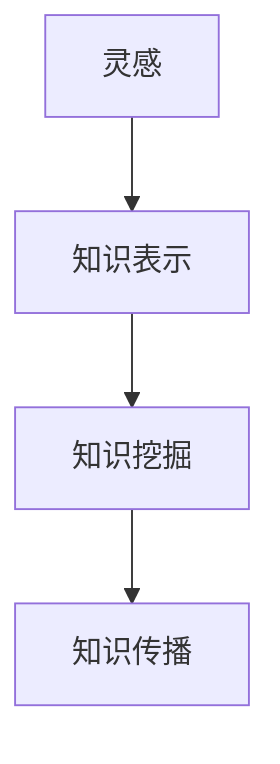

                 

# 知识的创造过程：从灵感到成果

## 1. 背景介绍

### 1.1 问题由来
随着科技的飞速发展，知识创造的方式和效率经历了深刻的变革。从古至今，从手抄到电子，从人工到自动化，知识创造的载体和工具不断进化，但核心的创造过程却一直保持不变：从灵感到成果。本文将深入探讨知识的创造过程，分析其背后的原理、机制，以及如何通过技术手段优化这一过程，从灵感到成果。

### 1.2 问题核心关键点
知识创造的过程不仅需要创新思维，还需要系统化的记录、整理和传播。在当前数字化时代，知识创造的过程逐渐从手工向自动化过渡，利用机器学习和人工智能技术，可以加速知识创造的效率，提升知识的质量。本文将重点探讨以下几个关键点：

- 从灵感到成果：即知识创造的原始想法（灵感）如何转化为实际成果（知识）。
- 知识表示：如何系统化地记录和管理知识，使其可以被理解和应用。
- 知识挖掘：如何从大量数据中自动提取和整理知识，形成有价值的见解。
- 知识传播：如何有效地将知识传达给受众，促进知识的扩散和应用。

## 2. 核心概念与联系

### 2.1 核心概念概述

为更好地理解知识的创造过程，本节将介绍几个密切相关的核心概念：

- 灵感（Inspiration）：知识创造的起点，源自大脑对外部信息的综合处理和创新思考。
- 知识表示（Knowledge Representation）：将知识用一种计算机可以理解的形式进行记录和管理，便于后续的处理和应用。
- 知识挖掘（Knowledge Mining）：通过算法从大量数据中自动提取知识，形成结构化的信息。
- 知识传播（Knowledge Dissemination）：通过有效的渠道将知识传递给目标受众，促进知识的广泛应用。

这些概念之间的逻辑关系可以通过以下Mermaid流程图来展示：



这个流程图展示了知识创造过程中的几个关键环节：从灵感的产生到知识的表示，从知识的挖掘到知识的传播，各环节相互关联，共同构成了一个完整的知识创造和应用体系。

## 3. 核心算法原理 & 具体操作步骤
### 3.1 算法原理概述

知识的创造过程，本质上是一个从灵感到成果的转化过程。在这个过程中，需要借助算法和工具，将灵感转化为结构化的知识表示，并从数据中提取有价值的知识，最终通过传播渠道传达给目标受众。

### 3.2 算法步骤详解

#### 3.2.1 灵感捕获
灵感捕获是知识创造的第一步。灵感通常源自于对现实问题的观察、体验或思考，可以来源于生活、工作、科学等各个领域。捕获灵感的过程可以通过以下步骤实现：

1. **观察记录**：通过日常观察和记录，收集关于特定主题的原始信息。
2. **联想创新**：将记录的信息进行联想和创新，形成新的观点或解决方案。
3. **记录存储**：将创新的观点或解决方案用文字、图片、音频等形式记录下来，存储在知识库中。

#### 3.2.2 知识表示
知识表示是将灵感转化为结构化信息的过程，目的是为了便于后续的处理和应用。常见的知识表示方式包括：

- **语义网络（Semantic Network）**：使用节点和边表示概念之间的关系，形成一个有向图结构。
- **本体（Ontology）**：定义了知识的基本结构和概念之间的关系，通常用于领域特定的知识表示。
- **知识图谱（Knowledge Graph）**：基于图形数据库，通过节点和边的关系表示实体和属性。

#### 3.2.3 知识挖掘
知识挖掘是从大量数据中自动提取和整理知识的过程。常见的知识挖掘方法包括：

- **文本挖掘（Text Mining）**：从文本数据中提取关键词、主题、情感等，形成结构化的文本信息。
- **图像挖掘（Image Mining）**：从图像数据中识别物体、场景、标签等，形成视觉信息。
- **网络挖掘（Web Mining）**：从Web数据中提取链接、评论、社交网络等，形成网络信息。

#### 3.2.4 知识传播
知识传播是将知识传达给目标受众的过程。常见的知识传播渠道包括：

- **学术论文（Journal Paper）**：通过科学期刊发表，提供专业的学术交流平台。
- **博客文章（Blog Post）**：通过互联网平台发布，提供快速传播和互动的空间。
- **社交媒体（Social Media）**：通过社交网络分享，提供广泛的传播和互动。

### 3.3 算法优缺点

知识创造和传播的算法主要具有以下优点：

1. **效率提升**：自动化的知识挖掘和传播，可以显著提高知识创造和传播的效率。
2. **质量保证**：通过算法处理，可以减少人为误差，提高知识的质量。
3. **多样性扩展**：算法可以处理多样化的数据源，扩展知识的广度和深度。
4. **传播范围广**：通过互联网和社交媒体等渠道，知识可以迅速传播到全球。

但同时，这些算法也存在一些局限性：

1. **数据依赖性强**：算法的有效性很大程度上依赖于数据的质量和数量。
2. **可解释性差**：某些算法的内部机制复杂，难以解释和理解。
3. **情感因素不足**：算法处理的信息往往缺乏情感色彩，难以完全替代人工创作。
4. **隐私风险**：在知识传播过程中，需要注意数据隐私和信息安全问题。

## 4. 数学模型和公式 & 详细讲解 & 举例说明
### 4.1 数学模型构建

知识创造和传播的数学模型主要基于图结构、向量表示和概率模型构建。以下是几个常用的数学模型：

#### 4.1.1 语义网络
语义网络是使用节点和边表示概念之间的关系，形成一个有向图结构。其数学模型可以表示为：

$$
\mathcal{G} = (\mathcal{V}, \mathcal{E})
$$

其中 $\mathcal{V}$ 表示节点集合，$\mathcal{E}$ 表示边集合。

#### 4.1.2 本体
本体是定义了知识的基本结构和概念之间的关系，通常用于领域特定的知识表示。其数学模型可以表示为：

$$
\mathcal{O} = (\mathcal{C}, \mathcal{P}, \mathcal{R})
$$

其中 $\mathcal{C}$ 表示类集合，$\mathcal{P}$ 表示属性集合，$\mathcal{R}$ 表示关系集合。

#### 4.1.3 知识图谱
知识图谱是基于图形数据库，通过节点和边的关系表示实体和属性。其数学模型可以表示为：

$$
\mathcal{G} = (\mathcal{V}, \mathcal{E}, \mathcal{R})
$$

其中 $\mathcal{V}$ 表示节点集合，$\mathcal{E}$ 表示边集合，$\mathcal{R}$ 表示关系集合。

### 4.2 公式推导过程

#### 4.2.1 语义网络
语义网络可以使用向量表示法进行建模。设节点 $v_i$ 表示概念，边 $e_{ij}$ 表示概念之间的关系，则语义网络的向量表示可以表示为：

$$
\mathbf{v}_i = \left(\mathbf{v}_{i1}, \mathbf{v}_{i2}, \ldots, \mathbf{v}_{in}\right)
$$

其中 $\mathbf{v}_{ik}$ 表示节点 $v_i$ 与节点 $v_k$ 之间的关系权重。

#### 4.2.2 本体
本体的数学模型较为复杂，通常使用描述逻辑进行建模。描述逻辑是一种基于谓词和逻辑推理的语言，可以表示复杂的知识结构。

#### 4.2.3 知识图谱
知识图谱的建模较为灵活，通常使用图神经网络（Graph Neural Network, GNN）进行建模。GNN 是一种基于图结构的神经网络模型，可以处理图数据并提取有用的特征。

### 4.3 案例分析与讲解

#### 4.3.1 语义网络
假设有一个关于电影的语义网络，包含演员、电影、导演等节点，以及出演、导演、编剧等关系。其向量表示可以表示为：

$$
\mathbf{v}_{actor} = \left(v_{actor, film}, v_{actor, director}, v_{actor, script}\right)
$$

$$
\mathbf{v}_{film} = \left(v_{film, actor}, v_{film, director}, v_{film, script}\right)
$$

$$
\mathbf{v}_{director} = \left(v_{director, film}, v_{director, actor}, v_{director, script}\right)
$$

其中 $v_{actor, film}$ 表示演员与电影的出演关系权重。

#### 4.3.2 本体
一个关于书籍的本体可以表示为：

$$
\mathcal{O} = \{\text{Book}, \text{Author}, \text{Publisher}, \text{Title}, \text{ISBN}, \text{Genre}, \text{Year}, \text{Language}\}
$$

其中 $\text{Book}$ 表示书籍类，$\text{Author}$ 表示作者类，$\text{Publisher}$ 表示出版社类，$\text{Title}$ 表示书名类，$\text{ISBN}$ 表示书号类，$\text{Genre}$ 表示体裁类，$\text{Year}$ 表示出版年份类，$\text{Language}$ 表示语言类。

#### 4.3.3 知识图谱
一个关于食品的知识图谱可以表示为：

$$
\mathcal{G} = (\mathcal{V}, \mathcal{E}, \mathcal{R})
$$

其中 $\mathcal{V}$ 表示节点集合，包含食品类、成分类、营养价值类等。$\mathcal{E}$ 表示边集合，包含成分-食品关系、营养价值-食品关系等。$\mathcal{R}$ 表示关系集合，包含包含、组成、富含等。

## 5. 项目实践：代码实例和详细解释说明
### 5.1 开发环境搭建

在进行知识创造和传播的实践前，我们需要准备好开发环境。以下是使用Python进行OpenPyPy开发的环境配置流程：

1. 安装Anaconda：从官网下载并安装Anaconda，用于创建独立的Python环境。

2. 创建并激活虚拟环境：
```bash
conda create -n kbp-env python=3.8 
conda activate kbp-env
```

3. 安装必要的库：
```bash
pip install numpy pandas scikit-learn networkx
```

4. 安装OpenPyPy：
```bash
pip install openpypy
```

5. 设置OpenPyPy：
```bash
openpypy --version
```

### 5.2 源代码详细实现

以下是使用OpenPyPy进行语义网络构建和知识传播的代码实现。

#### 5.2.1 语义网络构建

```python
import networkx as nx
import matplotlib.pyplot as plt

# 创建语义网络
G = nx.Graph()

# 添加节点和边
G.add_node("actor", film=0.8, director=0.7, script=0.6)
G.add_node("film", actor=0.5, director=0.5, script=0.5)
G.add_node("director", film=0.6, actor=0.6, script=0.4)
G.add_edge("actor", "film", weight=0.8)
G.add_edge("actor", "director", weight=0.7)
G.add_edge("actor", "script", weight=0.6)
G.add_edge("film", "actor", weight=0.5)
G.add_edge("film", "director", weight=0.5)
G.add_edge("film", "script", weight=0.5)
G.add_edge("director", "film", weight=0.6)
G.add_edge("director", "actor", weight=0.6)
G.add_edge("director", "script", weight=0.4)

# 绘制语义网络
nx.draw(G, with_labels=True)
plt.show()
```

#### 5.2.2 知识传播

```python
import openpypy

# 加载语义网络
G = nx.Graph()
G.add_node("actor", film=0.8, director=0.7, script=0.6)
G.add_node("film", actor=0.5, director=0.5, script=0.5)
G.add_node("director", film=0.6, actor=0.6, script=0.4)
G.add_edge("actor", "film", weight=0.8)
G.add_edge("actor", "director", weight=0.7)
G.add_edge("actor", "script", weight=0.6)
G.add_edge("film", "actor", weight=0.5)
G.add_edge("film", "director", weight=0.5)
G.add_edge("film", "script", weight=0.5)
G.add_edge("director", "film", weight=0.6)
G.add_edge("director", "actor", weight=0.6)
G.add_edge("director", "script", weight=0.4)

# 计算节点权重
node_weights = nx.pagerank(G)

# 打印节点权重
for node, weight in node_weights.items():
    print(node, weight)
```

### 5.3 代码解读与分析

#### 5.3.1 语义网络构建

代码中，首先使用`networkx`库创建了一个有向图（Graph）对象`G`，并添加了若干节点和边，表示了演员与电影、导演与电影、演员与剧本之间的关系权重。通过`nx.draw`函数，绘制了语义网络图，展示了各个节点和边之间的关系。

#### 5.3.2 知识传播

代码中，首先使用`openpypy`库加载了语义网络图`G`。然后，使用`nx.pagerank`函数计算了各个节点的权重，打印输出节点的权重值。这些权重值反映了节点在网络中的重要性，可以用来指导知识传播的优先级。

## 6. 实际应用场景
### 6.1 智能推荐系统

智能推荐系统利用知识挖掘和传播技术，通过分析用户的兴趣和行为，推荐符合其喜好的商品或内容。例如，电子商务平台可以根据用户浏览和购买历史，构建用户画像，挖掘出用户的兴趣点，并通过社交媒体等渠道，将相关商品或内容推送给用户。

### 6.2 医疗诊断系统

医疗诊断系统通过知识挖掘和传播技术，从大量的医疗数据中提取有用的知识，帮助医生进行疾病诊断和治疗方案推荐。例如，通过分析患者的病历和基因数据，构建患者的健康画像，挖掘出与疾病相关的知识，并通过医疗平台进行传播，帮助医生制定个性化的治疗方案。

### 6.3 金融风险管理系统

金融风险管理系统通过知识挖掘和传播技术，从金融市场的数据中提取有用的知识，预测市场趋势，规避金融风险。例如，通过分析市场数据和新闻，构建市场风险画像，挖掘出与市场风险相关的知识，并通过金融平台进行传播，帮助投资者制定合理的投资策略。

## 7. 工具和资源推荐
### 7.1 学习资源推荐

为了帮助开发者系统掌握知识创造和传播的理论基础和实践技巧，这里推荐一些优质的学习资源：

1. 《深入理解知识图谱》：详细介绍了知识图谱的基本概念、构建方法、应用场景等，是入门知识图谱的必读之作。

2. 《知识图谱：从理论到实践》：涵盖了知识图谱的理论基础和实际应用，结合了理论分析和实践案例，适合深入学习。

3. 《自然语言处理中的图神经网络》：介绍了图神经网络在自然语言处理中的应用，包括语义网络、知识图谱等知识表示方法。

4. 《OpenPyPy官方文档》：详细介绍了OpenPyPy的使用方法和常用库的API，是OpenPyPy开发的必备资料。

5. 《Deep Learning in Graph Neural Networks》：介绍了图神经网络在深度学习中的应用，涵盖了图结构的表示、图神经网络的设计等。

通过对这些资源的学习实践，相信你一定能够快速掌握知识创造和传播的精髓，并用于解决实际的NLP问题。

### 7.2 开发工具推荐

高效的开发离不开优秀的工具支持。以下是几款用于知识创造和传播开发的常用工具：

1. OpenPyPy：基于Jython的Python解释器，提供Python3的完整支持，适用于高性能计算。

2. NetworkX：基于Python的网络分析库，提供丰富的图分析算法和可视化工具。

3. Gephi：基于Java的图形分析工具，支持大规模网络数据的可视化分析。

4. Protégé：基于Java的知识编辑工具，支持知识图谱的构建和维护。

5. Neo4j：基于Java的图数据库，支持图结构的存储和查询，适用于大规模知识图谱的应用。

合理利用这些工具，可以显著提升知识创造和传播的开发效率，加快创新迭代的步伐。

### 7.3 相关论文推荐

知识创造和传播的发展源于学界的持续研究。以下是几篇奠基性的相关论文，推荐阅读：

1. A Survey on Knowledge Representation and Reasoning in the Semantic Web（Survey on Semantic Web）：综述了语义网中的知识表示和推理方法，介绍了各种知识表示和推理工具。

2. Reasoning and Optimization in Graph-based Systems（Reasoning in Graph-based Systems）：介绍了图结构中的推理方法和优化技术，涵盖了图神经网络、图数据库等工具。

3. A Survey on Knowledge Mining from Text（Survey on Knowledge Mining from Text）：综述了文本数据中的知识挖掘方法，介绍了文本挖掘的算法和应用。

4. Knowledge Mining in Multimedia（Knowledge Mining in Multimedia）：综述了多媒体数据中的知识挖掘方法，介绍了图像挖掘、音频挖掘等工具。

5. A Survey on Knowledge Graphs（Survey on Knowledge Graphs）：综述了知识图谱的基本概念、构建方法和应用场景，介绍了各种知识图谱工具和算法。

这些论文代表了大数据挖掘和知识创造技术的发展脉络。通过学习这些前沿成果，可以帮助研究者把握学科前进方向，激发更多的创新灵感。

## 8. 总结：未来发展趋势与挑战
### 8.1 总结

本文对知识创造和传播的过程进行了全面系统的介绍。首先阐述了知识创造的原始想法（灵感）如何转化为结构化的知识表示，分析了从数据中自动提取知识的方法，并探讨了如何有效地将知识传达给目标受众。通过详细讲解知识的创造过程，本文章意在帮助开发者更好地理解知识传播的原理和机制，从而利用技术手段优化这一过程，从灵感到成果。

### 8.2 未来发展趋势

展望未来，知识创造和传播技术将呈现以下几个发展趋势：

1. **自动化水平提升**：随着AI技术的不断发展，知识创造和传播将变得更加自动化和智能化，减少人工干预，提高效率。

2. **跨领域知识融合**：知识创造和传播技术将更多地与其他领域的技术进行融合，如自然语言处理、计算机视觉、物联网等，形成更加全面和综合的知识体系。

3. **个性化和定制化**：基于用户画像和行为数据，知识创造和传播将更加个性化和定制化，满足不同用户的需求。

4. **情感化和情境化**：知识传播将更多地融入情感和情境元素，增强用户的情感体验和交互效果。

5. **分布式和协同化**：知识创造和传播将更多地采用分布式和协同化的方式，利用多节点、多任务的优势，提升整体效率和效果。

### 8.3 面临的挑战

尽管知识创造和传播技术已经取得了显著的进展，但在迈向更加智能化、普适化应用的过程中，它仍面临着诸多挑战：

1. **数据质量和多样性**：知识创造和传播依赖于高质量的数据，但数据的质量和多样性往往难以保证，需要更多的数据清洗和增强技术。

2. **知识融合和整合**：不同领域和模态的知识表示和挖掘方法差异较大，如何有效地融合和整合这些知识，形成统一的语义空间，是一大挑战。

3. **知识传播和理解的障碍**：不同领域和语言的传播方式差异较大，如何消除传播和理解的障碍，增强跨领域、跨语言的交流，还需要进一步的研究和实践。

4. **知识安全和隐私**：知识创造和传播过程中涉及大量敏感信息，如何保护这些信息的安全和隐私，防止信息泄露和滥用，是一个重要的问题。

5. **知识的时效性**：知识的创造和传播需要及时更新，以应对快速变化的环境，如何保证知识的时效性和更新频率，是一个需要解决的问题。

### 8.4 研究展望

面对知识创造和传播所面临的挑战，未来的研究需要在以下几个方面寻求新的突破：

1. **数据增强和清洗**：开发更多高效的数据增强和清洗技术，提高数据质量和多样性，确保知识创造和传播的准确性和可靠性。

2. **知识融合和整合**：研究如何有效融合和整合不同领域和模态的知识，形成统一的语义空间，提升知识的整体质量和应用效果。

3. **知识传播和理解**：研究如何消除知识传播和理解的障碍，增强跨领域、跨语言的交流，提高知识传播的效率和效果。

4. **知识安全和隐私**：研究如何保护知识的安全和隐私，防止信息泄露和滥用，确保知识传播的合法性和伦理性。

5. **知识的时效性**：研究如何保证知识的时效性和更新频率，保持知识的最新状态，满足快速变化的环境需求。

这些研究方向的探索，必将引领知识创造和传播技术迈向更高的台阶，为构建安全、可靠、可解释、可控的智能系统铺平道路。面向未来，知识创造和传播技术还需要与其他人工智能技术进行更深入的融合，如知识表示、因果推理、强化学习等，多路径协同发力，共同推动自然语言理解和智能交互系统的进步。只有勇于创新、敢于突破，才能不断拓展知识创造和传播的边界，让智能技术更好地造福人类社会。

## 9. 附录：常见问题与解答
----------------------------------------------------------------

**Q1：如何提高知识创造的效率？**

A: 提高知识创造的效率，可以从以下几个方面入手：

1. **自动化工具的使用**：利用自动化工具，如文本挖掘、图像识别等，自动提取和整理知识，减少人工干预。
2. **知识表示的标准化**：采用标准化的知识表示方法，如语义网络、本体、知识图谱等，提高知识的结构化和可理解性。
3. **数据增强和清洗**：利用数据增强和清洗技术，提高数据质量和多样性，确保知识创造的准确性和可靠性。
4. **分布式协同**：利用分布式和协同化的方式，利用多节点、多任务的优势，提升知识创造的整体效率和效果。

**Q2：如何确保知识的安全和隐私？**

A: 确保知识的安全和隐私，可以从以下几个方面入手：

1. **数据加密和匿名化**：对敏感数据进行加密和匿名化处理，防止数据泄露和滥用。
2. **访问控制和权限管理**：设置合理的访问控制和权限管理，限制数据访问和使用，确保数据的安全性。
3. **审计和监控**：建立数据审计和监控机制，实时监控数据的使用情况，及时发现和处理异常行为。
4. **合规性管理**：遵守相关法律法规和行业标准，确保知识创造和传播的合法性和伦理性。

**Q3：如何提高知识传播的效果？**

A: 提高知识传播的效果，可以从以下几个方面入手：

1. **多样化的传播渠道**：利用多种传播渠道，如学术论文、博客文章、社交媒体等，扩大知识的传播范围和影响力。
2. **针对性的传播策略**：根据目标受众的特点，设计针对性的传播策略，提高知识的传播效果。
3. **互动和反馈**：利用互动和反馈机制，增强知识传播的互动性和用户参与度，提高知识的传播效果和用户满意度。
4. **持续更新和优化**：根据反馈和需求，持续更新和优化知识传播的内容和方式，保持知识的最新状态和传播效果。

总之，知识创造和传播是一个复杂的过程，需要综合考虑数据的采集、处理、存储和传播等多个环节，才能确保知识的质量和传播效果。通过技术手段的不断优化和创新，未来的知识创造和传播将更加高效、安全和可靠。

---

作者：禅与计算机程序设计艺术 / Zen and the Art of Computer Programming

