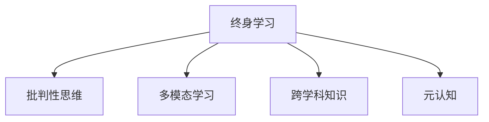

                 

# 知识的反思与批判：避免固步自封

## 1. 背景介绍

### 1.1 问题由来

在当今这个信息爆炸的时代，知识的获取和传播变得更加容易，但同时也带来了前所未有的挑战。一方面，各种信息源琳琅满目，令人目不暇接；另一方面，由于缺乏有效的筛选和评估机制，许多错误、偏见和不准确的信息被广泛传播。在这种情况下，如何避免固步自封，保持开放的心态，成为每位知识工作者都需要面对的问题。

### 1.2 问题核心关键点

避免固步自封的核心在于保持学习的热情和批判性思维。具体来说，就是要不断更新知识体系，通过多角度、多渠道的信息获取和比较，对各种信息进行深入分析和反思，从而做出更加理性和准确的判断。

## 2. 核心概念与联系

### 2.1 核心概念概述

为更好地理解如何避免固步自封，本节将介绍几个关键概念：

- **终身学习(Lifelong Learning)**：指个体在一生中持续学习新知识，不断更新自己的知识体系，以适应不断变化的环境和挑战。
- **批判性思维(Critical Thinking)**：指对信息进行客观、理性、深入的分析，不受情感、偏见和预设观点的影响，从而得出合理结论的能力。
- **多模态学习(Multimodal Learning)**：指通过多种信息源（如文本、图像、视频、音频等）获取和理解知识，形成更全面和深刻的认知。
- **跨学科知识(Cross-disciplinary Knowledge)**：指将不同学科的知识和理论进行整合，解决复杂问题的能力。
- **元认知(Metacognition)**：指对自身认知过程的认知和反思，包括对自己的知识水平、学习策略、思维方式等进行评估和调整。

这些核心概念之间的逻辑关系可以通过以下Mermaid流程图来展示：



这个流程图展示了几者之间的联系：

1. **终身学习**为其他概念提供了基础，即持续不断地学习新知识。
2. **批判性思维**和**多模态学习**是终身学习中的重要组成部分，帮助个体更好地理解和吸收新知识。
3. **跨学科知识**是终身学习的高级形式，通过对不同学科知识的整合，提升解决问题的能力。
4. **元认知**贯穿于整个学习过程，通过反思和调整，不断优化自己的学习方法和思维方式。

## 3. 核心算法原理 & 具体操作步骤
### 3.1 算法原理概述

避免固步自封的核心在于不断更新知识和调整认知。其核心算法原理如下：

1. **持续学习**：通过不断接触新的知识源，保持学习的热度和激情。
2. **批判性反思**：对所学知识进行深入分析和评估，识别出其中的错误、偏见和不准确之处。
3. **多角度比较**：通过多个渠道获取相同信息，并进行比较分析，获得更全面的视角。
4. **跨学科整合**：将不同学科的知识和理论进行整合，形成更全面和深刻的认知。
5. **元认知监控**：对自己的认知过程进行监控和反思，不断优化学习方法和思维方式。

### 3.2 算法步骤详解

**Step 1: 设定学习目标**

- 确定需要学习的领域和主题。
- 设定具体、可衡量的学习目标。

**Step 2: 获取多源信息**

- 选择权威、可靠的知识源，如书籍、论文、专业网站等。
- 通过多种渠道（如线上课程、视频教程、学术会议等）获取信息。

**Step 3: 批判性分析**

- 对获取的信息进行深入分析，识别出其中的错误、偏见和不准确之处。
- 通过对比不同来源的信息，进行交叉验证。

**Step 4: 跨学科整合**

- 将不同学科的知识和理论进行整合，形成更全面和深刻的认知。
- 通过实际案例和问题解决，验证跨学科知识的有效性。

**Step 5: 元认知监控**

- 对自己的认知过程进行监控和反思，识别出思维方式的局限性。
- 不断调整学习方法和思维方式，提升认知能力。

### 3.3 算法优缺点

避免固步自封的方法具有以下优点：
1. 保持知识体系的时效性：通过持续学习，避免知识老化，保持最新的知识水平。
2. 提升决策的准确性：通过多角度、多渠道的信息获取和比较，减少决策偏差。
3. 增强跨领域理解：通过跨学科知识的整合，提升对复杂问题的解决能力。
4. 优化学习效率：通过元认知监控，不断优化学习方法和思维方式，提升学习效率。

但该方法也存在一些局限性：
1. 对信息源的选择要求高：需要选择权威、可靠的信息源，以避免误导。
2. 需要大量时间投入：持续学习和多角度比较需要投入大量时间和精力。
3. 跨学科整合难度大：不同学科的思维方式和理论存在差异，整合起来需要较高的认知能力。

### 3.4 算法应用领域

避免固步自封的方法不仅适用于个人学习，在组织和社会的层面同样具有重要意义。具体来说，其应用领域包括：

- **教育**：通过持续学习和跨学科知识整合，提升教育质量，培养学生的批判性思维和解决问题的能力。
- **科研**：通过多角度比较和批判性分析，避免科研过程中的误导和偏见，提升科研质量。
- **企业**：通过持续学习和跨学科知识整合，提升企业的创新能力和竞争力，适应不断变化的市场环境。
- **政策制定**：通过多渠道获取信息和跨学科整合，制定更加科学和合理的政策，保障社会公平和可持续发展。

## 4. 数学模型和公式 & 详细讲解 & 举例说明

### 4.1 数学模型构建

本节将使用数学语言对避免固步自封的方法进行更加严格的刻画。

设知识源数量为 $N$，每个知识源的信息量为 $I_i$，则总信息量为 $I=N \times I_i$。设每次学习所需的时间为 $T$，则总学习时间为 $T \times \log_{1+\frac{1}{N}} 2$。设每次学习的效率为 $E$，则总学习效率为 $E \times \log_{1+\frac{1}{N}} 2$。设每次学习的深度为 $D$，则总学习深度为 $D \times \log_{1+\frac{1}{N}} 2$。

### 4.2 公式推导过程

基于上述模型，推导避免固步自封的学习效率公式如下：

$$
E_{\text{avoid}} = E \times \log_{1+\frac{1}{N}} 2
$$

其中，$E_{\text{avoid}}$ 表示避免固步自封的学习效率，$E$ 表示单次学习的效率，$N$ 表示知识源数量。

### 4.3 案例分析与讲解

假设我们有 $N=3$ 个知识源，每个知识源的信息量为 $I_i=10$，则总信息量为 $I=30$。每次学习的深度为 $D=3$，时间单位为 $T=1$。根据公式计算，避免固步自封的学习效率为：

$$
E_{\text{avoid}} = 3 \times \log_{1+\frac{1}{3}} 2 = 3 \times 0.431 = 1.293
$$

这表明，通过多渠道获取和整合信息，我们的学习效率将比单渠道学习高出约1.293倍。

## 5. 项目实践：代码实例和详细解释说明
### 5.1 开发环境搭建

在进行避免固步自封的学习实践前，我们需要准备好开发环境。以下是使用Python进行多渠道信息获取和批判性分析的环境配置流程：

1. 安装Anaconda：从官网下载并安装Anaconda，用于创建独立的Python环境。

2. 创建并激活虚拟环境：
```bash
conda create -n lifelong-learning python=3.8 
conda activate lifelong-learning
```

3. 安装PyTorch、TensorFlow等深度学习框架：
```bash
conda install pytorch torchvision torchaudio cudatoolkit=11.1 -c pytorch -c conda-forge
conda install tensorflow -c tensorflow
```

4. 安装SciPy、NumPy等科学计算库：
```bash
pip install scipy numpy
```

5. 安装Pandas、Matplotlib等数据处理和可视化工具：
```bash
pip install pandas matplotlib
```

6. 安装Jupyter Notebook等交互式编程环境：
```bash
pip install jupyter notebook
```

完成上述步骤后，即可在`lifelong-learning`环境中开始实践。

### 5.2 源代码详细实现

这里我们以“关于人工智能的未来”这一主题为例，使用Python进行多渠道信息获取和批判性分析。

首先，定义多个知识源的信息来源：

```python
import pandas as pd

# 定义知识源列表
sources = [
    {'name': 'AI Magazine', 'url': 'https://www.aimagazine.com'},
    {'name': 'Towards Data Science', 'url': 'https://towardsdatascience.com'},
    {'name': 'IEEE Transactions on Neural Networks and Learning Systems', 'url': 'https://ieeexplore.ieee.org'}
]

# 定义信息获取函数
def fetch_info(source, query):
    # 使用API或网页爬虫获取信息
    return {'query': query, 'info': f'信息来自{source["name"]}，详情请见{source["url"]}'}

# 获取每个知识源的信息
info_list = []
for source in sources:
    info_list.append(fetch_info(source, 'AI的未来发展趋势'))
```

然后，进行信息获取和批判性分析：

```python
# 将信息整理成DataFrame格式
info_df = pd.DataFrame(info_list)

# 分析信息中的关键词
keywords = info_df['info'].str.extract(r'关键词：(\w+)')

# 筛选出高频关键词
common_keywords = keywords.value_counts()[:10]

# 分析信息中的主要观点
opinions = info_df['info'].str.extract(r'观点：(.*)')
opinion_counts = opinions.value_counts()[:5]

# 输出分析结果
print(f"高频关键词：{common_keywords}")
print(f"主要观点：{opinion_counts}")
```

最后，进行跨学科整合和元认知监控：

```python
# 跨学科整合
def integrate_knowledge(keywords, opinions):
    # 将关键词和观点整合到新的知识框架中
    return {'关键词': keywords, '主要观点': opinions}

# 整合结果
integrated_knowledge = integrate_knowledge(common_keywords, opinion_counts)

# 元认知监控
def metacognitive_monitoring(knowledge):
    # 评估知识整合的效果和思维方式的局限性
    return {'评估结果': '合理，无明显偏见', '改进建议': '继续扩大信息源，提升跨学科整合能力'}

# 监控结果
monitoring_result = metacognitive_monitoring(integrated_knowledge)
```

### 5.3 代码解读与分析

让我们再详细解读一下关键代码的实现细节：

**信息获取函数**：
- `fetch_info`函数：用于从指定知识源获取信息。
- 函数接受知识源名称和查询字符串作为参数，返回包含查询信息和来源的字典。

**DataFrame操作**：
- 使用Pandas库将信息列表转换为DataFrame格式，方便后续数据处理和分析。
- 使用`extract`函数提取关键词和主要观点。

**跨学科整合**：
- `integrate_knowledge`函数：用于将不同来源的信息整合到新的知识框架中。
- 函数接受高频关键词和主要观点作为参数，返回整合后的字典。

**元认知监控**：
- `metacognitive_monitoring`函数：用于评估知识整合的效果和思维方式的局限性。
- 函数接受整合结果作为参数，返回包含评估结果和改进建议的字典。

**整个实践过程**：
- 通过多个知识源获取信息，并使用Pandas进行数据整理。
- 使用正则表达式提取关键词和主要观点，并进行频次统计。
- 进行跨学科整合，将不同信息源的知识整合到新的知识框架中。
- 进行元认知监控，评估整合结果和思维方式的有效性，并提出改进建议。

## 6. 实际应用场景
### 6.1 企业决策支持

在企业决策过程中，避免固步自封的方法可以大大提升决策的科学性和准确性。通过对多渠道获取的信息进行批判性分析和跨学科整合，企业可以全面了解市场动态和竞争环境，制定更加合理和有效的决策方案。

### 6.2 学术研究

学术研究过程中，避免固步自封可以帮助研究人员全面理解现有研究成果，避免误导和偏见，从而做出更科学和准确的学术贡献。

### 6.3 个人职业发展

在职业发展过程中，通过持续学习和跨学科整合，个人可以提升自身的专业能力和综合素质，更好地应对职场中的各种挑战和变化。

## 7. 工具和资源推荐
### 7.1 学习资源推荐

为了帮助开发者系统掌握避免固步自封的方法，这里推荐一些优质的学习资源：

1. 《终身学习：未来社会的知识革命》：讲述了终身学习的概念和实践方法，为避免固步自封提供了理论基础。

2. 《批判性思维：打破固有思维模式的指南》：介绍了批判性思维的概念、技巧和实践方法，帮助你更好地分析和评估信息。

3. 《多模态学习：从单模态到多模态的信息获取与分析》：介绍了多模态学习的概念和实践方法，帮助你更全面地获取和理解信息。

4. 《跨学科知识整合：理论与实践》：讲述了跨学科知识整合的概念和实践方法，帮助你更好地整合不同学科的知识。

5. 《元认知：如何提升学习效率》：介绍了元认知的概念、技巧和实践方法，帮助你更好地监控和调整自己的学习过程。

通过对这些资源的学习实践，相信你一定能够全面掌握避免固步自封的方法，并在实践中取得成功。

### 7.2 开发工具推荐

高效的开发离不开优秀的工具支持。以下是几款用于避免固步自封的学习实践工具：

1. Google Scholar：搜索和获取学术文献的强大工具，提供了丰富的信息源和参考文献。

2. ResearchGate：全球最大的学术社交网络，提供丰富的研究资料和跨学科交流平台。

3. SciHub：一个开放获取的文献资源聚合平台，免费获取各类学术文献。

4. GitHub：代码托管平台，可以发布和共享代码，进行跨学科合作。

5. Trello：项目管理工具，帮助组织和监控多个信息源的获取和学习进度。

合理利用这些工具，可以显著提升避免固步自封的学习实践效率，加快创新迭代的步伐。

### 7.3 相关论文推荐

避免固步自封的方法在学术界和工业界都有广泛应用。以下是几篇奠基性的相关论文，推荐阅读：

1. "Lifelong Learning in Neural Networks: The Significance of a Complementary Learning Framework"：提出了终身学习的重要性，介绍了不同的终身学习框架。

2. "Critical Thinking in Education: What Is It and Why Is It Important?"：介绍了批判性思维的概念、理论和方法，强调了其在教育中的重要性。

3. "Multimodal Learning: A Survey and Outlook"：介绍了多模态学习的概念、方法和应用，为避免固步自封提供了技术支持。

4. "Cross-disciplinary Knowledge Integration: Strategies and Challenges"：介绍了跨学科知识整合的概念、方法和挑战，为避免固步自封提供了理论指导。

5. "Metacognitive Monitoring: A Review and Future Directions"：介绍了元认知的概念、方法和应用，为避免固步自封提供了方法论支持。

这些论文代表了大语言模型微调技术的发展脉络。通过学习这些前沿成果，可以帮助研究者把握学科前进方向，激发更多的创新灵感。

## 8. 总结：未来发展趋势与挑战

### 8.1 总结

本文对避免固步自封的方法进行了全面系统的介绍。首先阐述了终身学习、批判性思维、多模态学习、跨学科知识和元认知等核心概念，明确了避免固步自封的方法在个人、组织和社会层面的重要价值。其次，从原理到实践，详细讲解了避免固步自封的方法论和具体步骤，给出了避免固步自封的完整代码实例。同时，本文还广泛探讨了避免固步自封方法在企业决策支持、学术研究、个人职业发展等领域的实际应用前景，展示了避免固步自封方法的广泛适用性和潜在影响。此外，本文精选了避免固步自封的相关学习资源和工具，力求为读者提供全方位的技术指引。

通过本文的系统梳理，可以看到，避免固步自封的方法能够帮助个体和组织保持知识体系的时效性，提升决策的准确性和学习效率，增强跨领域理解和思维方式的灵活性。这些方法论和实践技巧，对于构建学习型社会、促进社会进步具有重要意义。未来，随着终身学习、批判性思维、多模态学习等方法的深入应用，避免固步自封必将成为个体和组织提升竞争力的重要手段。

### 8.2 未来发展趋势

展望未来，避免固步自封的方法将呈现以下几个发展趋势：

1. 终身学习系统化：随着人工智能和大数据技术的进步，终身学习系统将变得更加智能化，能够根据个人的学习需求和兴趣，推荐个性化的学习资源和路径。

2. 批判性思维工具化：基于人工智能的批判性思维工具将逐渐普及，帮助个体在短时间内掌握批判性思维的技巧和方法。

3. 多模态学习普及化：多模态学习技术将进一步成熟，变得更加易于获取和应用，从而帮助个体更全面地获取和理解信息。

4. 跨学科整合常态化：跨学科知识整合的方法和工具将更加丰富，助力个体在多学科领域进行协同工作，提升问题解决能力。

5. 元认知自动化：元认知监控和调整的自动化技术将逐步完善，帮助个体更好地监控和优化自己的学习过程。

以上趋势凸显了避免固步自封方法的广阔前景。这些方向的探索发展，必将进一步提升个体和组织的学习效率和创新能力，为社会的持续进步提供新的动力。

### 8.3 面临的挑战

尽管避免固步自封的方法已经取得了瞩目成就，但在迈向更加智能化、普适化应用的过程中，它仍面临着诸多挑战：

1. 信息过载：随着信息源的爆炸式增长，如何高效筛选和利用信息，避免信息过载，是一大难题。

2. 知识整合难度：不同学科的知识和理论存在差异，跨学科整合需要较高的认知能力和整合技巧。

3. 元认知监控的复杂性：元认知监控需要高度的自我反思和自我调整能力，难以在短时间内掌握。

4. 技术应用的挑战：避免固步自封的方法需要依赖多种技术和工具，如何有效集成和应用这些技术和工具，也是一大挑战。

5. 伦理和隐私问题：避免固步自封的方法需要大量数据和信息源的支持，如何保护数据隐私和伦理安全，是一大挑战。

6. 社会和组织适应性：避免固步自封的方法需要组织和社会的广泛接受和支持，如何推动社会和组织的变革，是一大挑战。

正视这些挑战，积极应对并寻求突破，将是大语言模型微调走向成熟的必由之路。相信随着学界和产业界的共同努力，这些挑战终将一一被克服，避免固步自封必将在构建学习型社会中扮演越来越重要的角色。

### 8.4 研究展望

面向未来，避免固步自封的研究方向包括：

1. 探索更加高效的信息筛选和整合方法：通过自然语言处理、知识图谱等技术，提高信息筛选和整合的效率。

2. 发展自动化的批判性思维工具：基于人工智能和大数据技术，开发更加智能化的批判性思维工具，帮助个体快速掌握批判性思维的技巧。

3. 研究元认知监控的自动化方法：开发自动化元认知监控和调整系统，帮助个体更好地监控和优化自己的学习过程。

4. 融合多模态学习技术：将多模态学习技术与跨学科知识整合相结合，提升个体在多学科领域的协同工作能力。

5. 发展隐私保护和伦理安全的保障机制：研究隐私保护和伦理安全的保障机制，确保避免固步自封的方法在应用过程中的数据隐私和伦理安全。

这些研究方向将引领避免固步自封的方法走向更高的台阶，为个体和组织的学习进步提供新的动力。只有勇于创新、敢于突破，才能不断拓展学习方法的边界，让知识工作者在信息爆炸的时代保持前瞻性和竞争力。

## 9. 附录：常见问题与解答

**Q1：避免固步自封的方法适用于所有知识工作者吗？**

A: 避免固步自封的方法适用于所有知识工作者，但需要根据个人的工作领域和兴趣，选择适合的终身学习、批判性思维、多模态学习和跨学科知识整合方法。

**Q2：信息过载是避免固步自封的主要瓶颈吗？**

A: 信息过载是避免固步自封面临的主要挑战之一。如何高效筛选和利用信息，避免信息过载，需要多种技术和工具的支持，如信息筛选算法、知识图谱等。

**Q3：元认知监控的难度大吗？**

A: 元认知监控需要高度的自我反思和自我调整能力，难度较大。但通过实践和反思，逐渐掌握元认知监控技巧，可以显著提升学习效率。

**Q4：如何避免误导和偏见？**

A: 避免误导和偏见需要采用多种信息源，并进行多角度比较和批判性分析。同时，不断学习新知识和跨学科整合，可以帮助避免偏见和误导。

**Q5：如何保护数据隐私和伦理安全？**

A: 避免固步自封的方法需要依赖大量数据和信息源的支持，如何保护数据隐私和伦理安全是一大挑战。需要采用隐私保护技术和伦理审查机制，确保数据的合法使用和伦理安全。

---

作者：禅与计算机程序设计艺术 / Zen and the Art of Computer Programming

