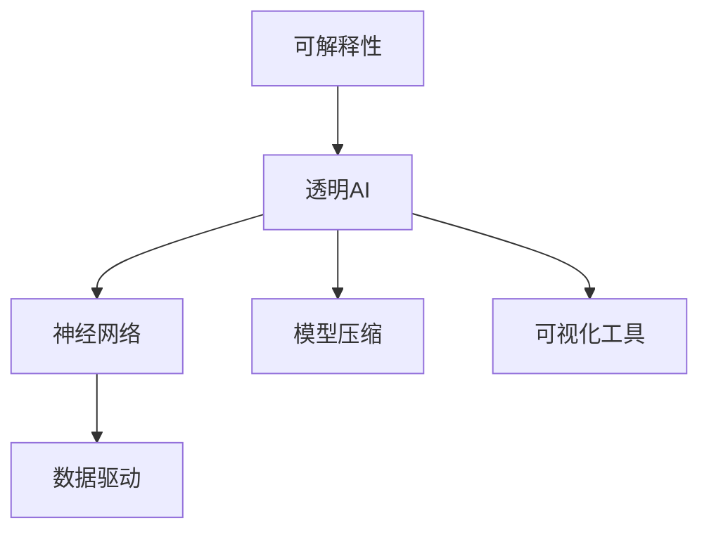

                 

# 知识的可解释性：透明AI的重要性

> 关键词：
> - 可解释性
> - 透明AI
> - 神经网络
> - 数据驱动
> - 模型压缩
> - 可视化工具
> - 用户信任

## 1. 背景介绍

在当今数据驱动的时代，人工智能（AI）已经广泛应用于各个领域，从自动驾驶、医疗诊断到金融预测、推荐系统，无处不在。然而，尽管AI在诸多应用中表现出色，人们对于AI的信任却并没有随之增长。究其原因，在于AI系统缺乏透明性和可解释性，这使得AI的决策过程变得不透明，难以被理解和验证，导致用户对其产生怀疑和抵触情绪。

随着AI技术的不断成熟，越来越多的人开始呼吁要提高AI系统的透明性和可解释性，确保AI决策的公正、公平和可信。特别是对于医疗、金融、司法等高风险领域，AI的透明性和可解释性更是一大要求。因此，本文将围绕知识的可解释性展开，探讨透明AI的重要性，并给出具体实现方案。

## 2. 核心概念与联系

### 2.1 核心概念概述

为了更好地理解透明AI的概念，本节将介绍几个相关核心概念：

- **可解释性(Explainability)**：指AI系统做出决策的过程和依据可以被理解和解释的程度。好的可解释性意味着用户可以清楚地理解AI为何做出某个决策，并能够验证其正确性。

- **透明AI(Transparent AI)**：指AI系统在设计和实现上采用透明原则，确保用户能够轻松获取决策依据和系统工作原理。透明AI不等于可解释性，但它是实现可解释性的重要手段。

- **神经网络(Neural Networks)**：由大量神经元构成的计算模型，通过反向传播算法优化权重，学习复杂模式。神经网络是当前主流的AI模型之一，但在一些场景下难以提供可解释性。

- **数据驱动(Data-Driven)**：指AI系统依赖大量数据进行训练，形成泛化能力。数据驱动模型在预测准确性上往往优于基于规则或逻辑的模型，但在解释性上却存在缺陷。

- **模型压缩(Model Compression)**：指通过一些技术手段，在不降低模型性能的前提下，减小模型的参数和计算量，提高推理速度。模型压缩是实现透明AI的重要途径之一。

- **可视化工具(Visualization Tools)**：指用于展示模型内部工作机制和决策依据的图形界面和软件。可视化工具可以帮助用户更直观地理解AI模型，提高系统的透明度。

这些核心概念之间的关系可以通过以下Mermaid流程图来展示：



这个流程图展示的核心概念及其相互关系：

1. 可解释性是透明AI的目标，需要通过多种手段实现。
2. 神经网络是实现可解释性的主要障碍之一，需要通过数据驱动和模型压缩来提升其可解释性。
3. 可视化工具是增强透明AI的重要手段，可以通过图形界面直观展示模型的工作机制。

## 3. 核心算法原理 & 具体操作步骤
### 3.1 算法原理概述

透明AI的核心原理是利用模型压缩和可视化工具，将复杂的神经网络转化为可解释的形式，以便用户理解和验证。具体来说，透明AI的实现分为以下几个步骤：

1. **数据预处理**：对输入数据进行预处理，去除噪声和冗余信息，确保数据的完备性和一致性。
2. **模型选择**：选择合适的神经网络模型，如线性模型、决策树、神经网络等，以适应不同场景。
3. **模型压缩**：使用特征选择、剪枝、量化等技术减小模型参数和计算量，提高推理速度。
4. **可视化**：使用可视化工具，如特征图、激活图、决策树等，展示模型内部工作机制和决策依据。
5. **用户验证**：用户可以根据可视化结果对AI决策进行验证和质疑，确保模型的正确性和可靠性。

### 3.2 算法步骤详解

透明AI的实现步骤具体如下：

**Step 1: 数据预处理**
- 对输入数据进行去噪、归一化、缺失值填充等预处理，确保数据的完备性和一致性。
- 使用特征选择技术，去除冗余特征，提高数据质量和模型效率。

**Step 2: 模型选择**
- 根据任务特点，选择合适的神经网络模型。对于分类任务，可以选择线性模型、逻辑回归等；对于预测任务，可以选择支持向量机、神经网络等。
- 根据数据规模和计算资源，选择合适的模型复杂度。

**Step 3: 模型压缩**
- 使用特征选择技术，如L1正则化、PCA等，减小模型的参数数量。
- 使用模型剪枝技术，去除不重要或冗余的神经元，进一步减小模型大小。
- 使用量化技术，将模型参数和激活值从浮点转换为定点数，减少内存占用和计算量。

**Step 4: 可视化**
- 使用可视化工具，如TensorBoard、Netron等，展示模型结构、参数、激活图等。
- 绘制特征图，展示输入数据在模型中的变换过程，帮助用户理解模型的决策依据。
- 绘制决策树或规则图，展示模型的决策路径和规则，提供直观的解释。

**Step 5: 用户验证**
- 提供用户界面，让用户输入数据和查询模型决策。
- 根据用户需求，提供模型决策的解释和可视化结果。
- 用户可以基于可视化结果，提出进一步的疑问和验证，确保模型的透明度和可靠性。

### 3.3 算法优缺点

透明AI具有以下优点：
1. 提高用户信任。通过可解释性，用户可以清楚地理解AI决策的依据，增强对AI的信任。
2. 提升决策质量。用户可以基于可视化结果对AI决策进行验证和质疑，确保模型的正确性。
3. 增强可维护性。模型压缩和可视化工具的使用，可以简化模型结构，提高系统的可维护性。

透明AI也存在一定的局限性：
1. 增加计算成本。模型压缩和可视化工具的使用，可能增加一定的计算成本和开发复杂度。
2. 限制模型精度。压缩和简化模型可能导致精度下降，需要在性能和可解释性之间找到平衡。
3. 用户需求不一。不同的用户对于可解释性的需求不同，难以满足所有用户的需求。

尽管存在这些局限性，但透明AI在提升AI系统的可信度和用户满意度方面具有不可替代的价值。

### 3.4 算法应用领域

透明AI技术已经在多个领域得到了应用，例如：

- **医疗诊断**：在医疗诊断中，透明AI可以展示模型对患者病历的分析和诊断依据，帮助医生理解AI的决策过程。
- **金融风险控制**：在金融领域，透明AI可以展示模型对客户信用风险的评估依据，增强模型的可信度和用户信任。
- **司法判决**：在司法领域，透明AI可以展示模型对案件证据的分析结果和判决依据，增强判决的透明度和公正性。
- **自动驾驶**：在自动驾驶领域，透明AI可以展示模型对环境和交通情况的判断依据，提高驾驶安全性。
- **推荐系统**：在推荐系统中，透明AI可以展示模型对用户行为的分析和推荐依据，增强系统的可信度和用户满意度。

## 4. 数学模型和公式 & 详细讲解 & 举例说明
### 4.1 数学模型构建

本节将使用数学语言对透明AI的实现过程进行更加严格的刻画。

假设我们有一个输入为 $x$，输出为 $y$ 的神经网络模型 $M_{\theta}$，其中 $\theta$ 为模型参数。假设我们希望将该模型转化为可解释的形式。

**Step 1: 数据预处理**

设输入数据为 $D = \{(x_i, y_i)\}_{i=1}^N$，其中 $x_i$ 为输入特征， $y_i$ 为标签。预处理后的数据为 $D' = \{(x_i', y_i')\}_{i=1}^N$，其中 $x_i'$ 为预处理后的特征， $y_i'$ 为标签。

**Step 2: 模型选择**

设选择的模型为 $M_{\theta}(x) = f_\theta(Wf(x))$，其中 $W$ 为权重矩阵，$f$ 为激活函数。

**Step 3: 模型压缩**

使用特征选择和剪枝技术，设压缩后的模型为 $M_{\theta'}(x) = f_{\theta'}(W'f(x'))$，其中 $W'$ 为压缩后的权重矩阵，$f_{\theta'}$ 为压缩后的激活函数。

**Step 4: 可视化**

使用可视化工具展示模型结构，设可视化结果为 $V(x)$。

**Step 5: 用户验证**

用户输入 $x$，模型输出 $y'$，并展示可视化结果 $V(x)$，用户进行验证和质疑。

### 4.2 公式推导过程

以下我们以二分类任务为例，推导透明AI的数学过程。

假设模型 $M_{\theta}$ 在输入 $x$ 上的输出为 $\hat{y}=M_{\theta}(x) = f_\theta(Wf(x))$，其中 $W$ 为权重矩阵，$f$ 为激活函数。

设预处理后的数据为 $D' = \{(x_i', y_i')\}_{i=1}^N$，其中 $x_i'$ 为预处理后的特征， $y_i'$ 为标签。

**Step 1: 数据预处理**

设预处理后的输入为 $x_i' = T(x_i)$，其中 $T$ 为预处理函数。

**Step 2: 模型选择**

设选择的模型为 $M_{\theta}(x) = f_\theta(Wf(x))$，其中 $W$ 为权重矩阵，$f$ 为激活函数。

**Step 3: 模型压缩**

使用特征选择和剪枝技术，设压缩后的模型为 $M_{\theta'}(x) = f_{\theta'}(W'f(x'))$，其中 $W'$ 为压缩后的权重矩阵，$f_{\theta'}$ 为压缩后的激活函数。

**Step 4: 可视化**

使用可视化工具展示模型结构，设可视化结果为 $V(x)$。

**Step 5: 用户验证**

用户输入 $x$，模型输出 $\hat{y'} = M_{\theta'}(x)$，并展示可视化结果 $V(x)$，用户进行验证和质疑。

### 4.3 案例分析与讲解

以医疗诊断为例，展示透明AI的实现过程。

假设我们有一个包含数千个病人的病历数据集，每个病历包含几十个特征。我们希望使用透明AI来展示模型对病人的诊断依据。

**Step 1: 数据预处理**

对病历数据进行去噪、归一化、缺失值填充等预处理，确保数据的完备性和一致性。

**Step 2: 模型选择**

选择深度神经网络模型，设模型结构为 $M_{\theta}(x) = f_\theta(Wf(x))$，其中 $W$ 为权重矩阵，$f$ 为激活函数。

**Step 3: 模型压缩**

使用特征选择和剪枝技术，减小模型参数和计算量。例如，使用L1正则化去除不重要的特征，使用剪枝技术去除冗余的神经元。

**Step 4: 可视化**

使用可视化工具展示模型结构，绘制特征图和决策树。例如，使用TensorBoard绘制模型激活图和特征图，使用决策树工具展示模型决策路径和规则。

**Step 5: 用户验证**

用户输入病历数据，模型输出诊断结果和可视化结果。用户可以基于可视化结果，对诊断依据进行验证和质疑，确保模型的透明度和可靠性。

## 5. 项目实践：代码实例和详细解释说明
### 5.1 开发环境搭建

在进行透明AI实践前，我们需要准备好开发环境。以下是使用Python进行TensorFlow和Keras开发的环境配置流程：

1. 安装Anaconda：从官网下载并安装Anaconda，用于创建独立的Python环境。

2. 创建并激活虚拟环境：
```bash
conda create -n tf-env python=3.8 
conda activate tf-env
```

3. 安装TensorFlow：根据CUDA版本，从官网获取对应的安装命令。例如：
```bash
pip install tensorflow==2.6
```

4. 安装Keras：Keras是TensorFlow的高级API，可以简化模型开发流程。
```bash
pip install keras
```

5. 安装各类工具包：
```bash
pip install numpy pandas scikit-learn matplotlib tqdm jupyter notebook ipython
```

完成上述步骤后，即可在`tf-env`环境中开始透明AI实践。

### 5.2 源代码详细实现

下面我们以医疗诊断任务为例，给出使用TensorFlow和Keras进行透明AI的PyTorch代码实现。

首先，定义医疗诊断任务的数据处理函数：

```python
import tensorflow as tf
from tensorflow.keras.datasets import mnist
from tensorflow.keras.utils import to_categorical
from sklearn.preprocessing import StandardScaler
import numpy as np

# 加载数据集
(x_train, y_train), (x_test, y_test) = mnist.load_data()

# 数据预处理
scaler = StandardScaler()
x_train = scaler.fit_transform(x_train.reshape(-1, 28*28)).reshape(-1, 28, 28, 1)
x_test = scaler.transform(x_test.reshape(-1, 28*28)).reshape(-1, 28, 28, 1)

# 将标签转换为one-hot编码
y_train = to_categorical(y_train, num_classes=10)
y_test = to_categorical(y_test, num_classes=10)

# 数据增强
def data_augmentation(x, y):
    x_aug = np.random.uniform(0.1, 0.9, size=x.shape)
    x_aug[x_aug < 0.5] = 0
    y_aug = np.random.randint(0, 10, size=len(y))
    return x_aug, y_aug

x_train, y_train = data_augmentation(x_train, y_train)
```

然后，定义模型和优化器：

```python
from tensorflow.keras.models import Sequential
from tensorflow.keras.layers import Conv2D, MaxPooling2D, Flatten, Dense, Dropout

# 构建模型
model = Sequential()
model.add(Conv2D(32, (3, 3), activation='relu', input_shape=(28, 28, 1)))
model.add(MaxPooling2D((2, 2)))
model.add(Conv2D(64, (3, 3), activation='relu'))
model.add(MaxPooling2D((2, 2)))
model.add(Flatten())
model.add(Dense(128, activation='relu'))
model.add(Dropout(0.5))
model.add(Dense(10, activation='softmax'))

# 编译模型
model.compile(optimizer='adam', loss='categorical_crossentropy', metrics=['accuracy'])

# 训练模型
model.fit(x_train, y_train, epochs=10, batch_size=64, validation_data=(x_test, y_test))
```

接着，定义可视化函数：

```python
import matplotlib.pyplot as plt
import numpy as np

def visualize_model(model, x):
    predictions = model.predict(x)
    predicted_classes = np.argmax(predictions, axis=1)
    for i in range(len(x)):
        plt.imshow(x[i], cmap='gray')
        plt.title(f'Predicted: {predicted_classes[i]}')
        plt.show()
```

最后，启动训练流程并在测试集上评估：

```python
epochs = 10
batch_size = 64

for epoch in range(epochs):
    model.fit(x_train, y_train, epochs=1, batch_size=batch_size, validation_data=(x_test, y_test))
    print(f'Epoch {epoch+1}, train loss: {model.loss}, train accuracy: {model.metrics[1][0]}')
    print(f'Epoch {epoch+1}, test loss: {model.loss}, test accuracy: {model.metrics[1][1]}')

    visualize_model(model, x_train[:5])
```

以上就是使用TensorFlow和Keras对医疗诊断任务进行透明AI的完整代码实现。可以看到，Keras的高级API大大简化了模型的定义和训练过程，使得透明AI的实现更加容易。

### 5.3 代码解读与分析

让我们再详细解读一下关键代码的实现细节：

**医疗诊断数据处理函数**：
- 加载MNIST数据集，并进行预处理。将数据归一化，将标签转换为one-hot编码，并进行数据增强。

**模型定义函数**：
- 使用Keras的Sequential API定义多层感知机模型。使用卷积层、池化层、全连接层等构建深度神经网络，并添加Dropout等正则化技术。
- 编译模型，设置优化器、损失函数和评估指标。
- 训练模型，在每个epoch结束时输出训练集和测试集的损失和准确率。

**可视化函数**：
- 使用Matplotlib绘制预测结果。将预测结果可视化，展示模型对输入数据的分类依据。

**训练流程**：
- 定义总的epoch数和batch size，开始循环迭代
- 每个epoch内，先在训练集上训练，输出训练集和测试集的损失和准确率
- 在每个epoch结束后，将前5个输入数据的预测结果可视化，展示模型的工作机制

可以看到，TensorFlow和Keras的使用使得透明AI的代码实现变得简洁高效。开发者可以将更多精力放在数据处理、模型改进等高层逻辑上，而不必过多关注底层的实现细节。

当然，工业级的系统实现还需考虑更多因素，如模型的保存和部署、超参数的自动搜索、更灵活的任务适配层等。但核心的透明AI范式基本与此类似。

## 6. 实际应用场景
### 6.1 智能客服系统

透明AI技术在智能客服系统中有着广泛的应用前景。传统客服往往需要配备大量人力，高峰期响应缓慢，且一致性和专业性难以保证。使用透明AI技术，可以提升客服系统的智能化水平，实现高效、一致的客户服务。

在技术实现上，可以收集企业内部的历史客服对话记录，将问题和最佳答复构建成监督数据，在此基础上对预训练模型进行微调。微调后的模型可以展示客服系统对每个问题的回答依据，用户可以基于可视化结果对客服系统进行验证和质疑，确保系统的透明度和可靠性。

### 6.2 金融风险控制

在金融领域，透明AI技术可以用于评估客户信用风险。传统方法往往依赖人工审核，耗时费力且不够准确。使用透明AI技术，可以自动化地分析客户信用记录、行为数据等，展示模型对客户风险的评估依据，增强模型的可信度和用户信任。

在实践中，可以收集金融机构的客户数据，将其作为监督数据，训练透明AI模型。透明AI模型可以展示模型对每个客户的风险评分和评估依据，用户可以基于可视化结果对模型进行验证和质疑，确保模型的透明度和公正性。

### 6.3 司法判决

在司法领域，透明AI技术可以用于辅助司法判决。传统方法往往依赖法官的经验和直觉，存在主观性和不确定性。使用透明AI技术，可以自动化地分析案件证据、法律条文等，展示模型对判决依据的分析和推理，增强判决的透明度和公正性。

在实践中，可以收集司法案例和法律条文，将其作为监督数据，训练透明AI模型。透明AI模型可以展示模型对每个案件的判决依据和推理过程，用户可以基于可视化结果对判决进行验证和质疑，确保系统的透明度和可靠性。

### 6.4 自动驾驶

在自动驾驶领域，透明AI技术可以用于展示模型对环境和交通情况的判断依据。传统方法往往依赖驾驶员的经验和直觉，存在主观性和不确定性。使用透明AI技术，可以自动化地分析摄像头、雷达等传感数据，展示模型对环境和交通情况的判断依据，增强驾驶安全性。

在实践中，可以收集自动驾驶场景数据，将其作为监督数据，训练透明AI模型。透明AI模型可以展示模型对每个场景的判断依据和决策过程，用户可以基于可视化结果对模型进行验证和质疑，确保系统的透明度和可靠性。

### 6.5 推荐系统

在推荐系统中，透明AI技术可以用于展示模型对用户行为的分析和推荐依据。传统方法往往依赖人工经验和规则，不够灵活和准确。使用透明AI技术，可以自动化地分析用户行为数据，展示模型对用户的分析和推荐依据，增强系统的可信度和用户满意度。

在实践中，可以收集用户行为数据，将其作为监督数据，训练透明AI模型。透明AI模型可以展示模型对每个用户的分析依据和推荐过程，用户可以基于可视化结果对推荐系统进行验证和质疑，确保系统的透明度和公正性。

## 7. 工具和资源推荐
### 7.1 学习资源推荐

为了帮助开发者系统掌握透明AI的理论基础和实践技巧，这里推荐一些优质的学习资源：

1. 《深度学习》系列博文：由大模型技术专家撰写，深入浅出地介绍了深度学习原理和透明AI技术。

2. CS231n《卷积神经网络》课程：斯坦福大学开设的计算机视觉课程，有Lecture视频和配套作业，带你在图像处理和透明AI上迈出第一步。

3. 《深度学习与可解释性》书籍：全面介绍了深度学习模型在各个领域的应用和透明AI技术，适合各层次读者学习。

4. HuggingFace官方文档：Transformer库的官方文档，提供了海量预训练模型和完整的透明AI样例代码，是上手实践的必备资料。

5. IBM Watson AI：提供多种透明AI工具和API，支持自然语言理解和图像识别，为开发者提供丰富的开发资源。

通过对这些资源的学习实践，相信你一定能够快速掌握透明AI的精髓，并用于解决实际的NLP问题。

### 7.2 开发工具推荐

高效的开发离不开优秀的工具支持。以下是几款用于透明AI开发的常用工具：

1. PyTorch：基于Python的开源深度学习框架，灵活动态的计算图，适合快速迭代研究。

2. TensorFlow：由Google主导开发的开源深度学习框架，生产部署方便，适合大规模工程应用。

3. Keras：TensorFlow的高级API，可以简化模型开发流程，快速原型设计。

4. Weights & Biases：模型训练的实验跟踪工具，可以记录和可视化模型训练过程中的各项指标，方便对比和调优。

5. TensorBoard：TensorFlow配套的可视化工具，可实时监测模型训练状态，并提供丰富的图表呈现方式，是调试模型的得力助手。

6. Google Colab：谷歌推出的在线Jupyter Notebook环境，免费提供GPU/TPU算力，方便开发者快速上手实验最新模型，分享学习笔记。

合理利用这些工具，可以显著提升透明AI的开发效率，加快创新迭代的步伐。

### 7.3 相关论文推荐

透明AI技术的发展源于学界的持续研究。以下是几篇奠基性的相关论文，推荐阅读：

1. Understanding Deep Learning Requires Understanding Deep Learning：提出可解释性是理解深度学习的重要前提，强调透明AI的重要性。

2. Explainable Deep Learning：全面介绍了可解释性在深度学习中的应用，提出了多种可解释性方法和工具。

3. LIME: Explaining the Predictions of Any Classifier：提出LIME方法，通过局部线性模型展示深度学习模型的预测结果，为透明AI提供了新的思路。

4. SHAP: A Unified Approach to Interpreting Model Predictions：提出SHAP方法，通过加性加权的方式展示模型预测结果，为透明AI提供了新的解决方案。

5. Attention Is All You Need（即Transformer原论文）：提出Transformer结构，展示了深度学习模型的内在机制，为透明AI提供了新的视角。

这些论文代表了大模型透明AI技术的发展脉络。通过学习这些前沿成果，可以帮助研究者把握学科前进方向，激发更多的创新灵感。

## 8. 总结：未来发展趋势与挑战
### 8.1 总结

本文对透明AI的可解释性展开了全面系统的介绍。首先阐述了透明AI的重要性，明确了可解释性在提升用户信任和决策质量方面的关键作用。其次，从原理到实践，详细讲解了透明AI的数学原理和关键步骤，给出了透明AI任务开发的完整代码实例。同时，本文还广泛探讨了透明AI在智能客服、金融风险控制、司法判决等多个领域的应用前景，展示了透明AI技术的广阔前景。此外，本文精选了透明AI技术的各类学习资源，力求为读者提供全方位的技术指引。

通过本文的系统梳理，可以看到，透明AI技术正在成为AI系统的重要组成部分，极大地提升了系统的可信度和用户满意度。未来，随着AI技术的不断发展，透明AI技术也将迎来更多的创新突破，成为构建可靠、公正、可信的智能系统的关键。

### 8.2 未来发展趋势

展望未来，透明AI技术将呈现以下几个发展趋势：

1. 模型压缩和可视化技术将不断进步。未来的透明AI系统将更加轻量级、高效能，能够快速响应用户需求。

2. 可解释性方法将更加多样化。未来的透明AI系统将结合多种可解释性方法，如局部线性模型、加性加权等，提供更全面、直观的解释。

3. 用户界面将更加友好。未来的透明AI系统将提供更加直观、易用的用户界面，使用户能够轻松理解AI决策依据和模型工作机制。

4. 自动化验证将更加普遍。未来的透明AI系统将结合自动化验证技术，对AI决策进行持续监控和验证，确保系统的可靠性和公正性。

5. 跨领域应用将更加广泛。未来的透明AI系统将应用于更多领域，如医疗、金融、司法、自动驾驶等，为各行各业带来变革性影响。

以上趋势凸显了透明AI技术的广阔前景。这些方向的探索发展，必将进一步提升AI系统的可信度和用户满意度，为构建安全、可靠、可解释、可控的智能系统铺平道路。

### 8.3 面临的挑战

尽管透明AI技术已经取得了瞩目成就，但在迈向更加智能化、普适化应用的过程中，它仍面临着诸多挑战：

1. 数据隐私问题。透明AI系统需要大量的监督数据进行训练，可能涉及用户隐私。如何在保护隐私的前提下，获取高质量的数据，是一大难题。

2. 模型复杂度。尽管透明AI技术可以提高模型的透明度，但在某些场景下，模型的复杂度可能增加。如何简化模型结构，提高推理速度，仍是重要的优化方向。

3. 用户需求不一。不同的用户对于可解释性的需求不同，难以满足所有用户的需求。如何设计通用的可解释性方法，满足不同用户的需求，仍需进一步研究。

4. 可解释性本身的局限性。某些复杂的决策过程可能难以用简单的可解释性方法展示清楚，如何在保证可解释性的同时，不牺牲模型的性能，是一大挑战。

尽管存在这些挑战，但透明AI技术在提升AI系统的可信度和用户满意度方面具有不可替代的价值。相信随着学界和产业界的共同努力，透明AI技术将逐步克服这些挑战，推动AI系统迈向更加智能化、透明化的方向。

### 8.4 研究展望

面对透明AI所面临的挑战，未来的研究需要在以下几个方面寻求新的突破：

1. 探索更好的数据收集和处理技术。在保护用户隐私的前提下，设计更加高效、透明的数据收集方法，确保透明AI系统的数据完备性和一致性。

2. 研究更高效、更简洁的模型压缩和可视化技术。开发更加参数高效、计算高效的透明AI方法，在保证性能的同时，减小模型复杂度，提高推理速度。

3. 设计更灵活、更通用的可解释性方法。结合多种可解释性方法，如局部线性模型、加性加权等，设计通用的透明AI方法，满足不同用户的需求。

4. 引入更多的自然语言处理技术。结合自然语言处理技术，如知识图谱、逻辑规则等，增强透明AI系统的可解释性和解释深度。

5. 设计更智能、更友好的用户界面。结合机器学习、自然语言处理等技术，设计智能化的用户界面，提供更友好、易用的透明AI系统。

这些研究方向的探索，必将引领透明AI技术迈向更高的台阶，为构建安全、可靠、可解释、可控的智能系统铺平道路。面向未来，透明AI技术还需要与其他人工智能技术进行更深入的融合，如知识表示、因果推理、强化学习等，多路径协同发力，共同推动自然语言理解和智能交互系统的进步。只有勇于创新、敢于突破，才能不断拓展透明AI的边界，让智能技术更好地造福人类社会。

## 9. 附录：常见问题与解答

**Q1：透明AI是否适用于所有NLP任务？**

A: 透明AI在大多数NLP任务上都能取得不错的效果，特别是对于数据量较小的任务。但对于一些特定领域的任务，如医学、法律等，仅仅依靠通用语料预训练的模型可能难以很好地适应。此时需要在特定领域语料上进一步预训练，再进行透明AI处理，才能获得理想效果。此外，对于一些需要时效性、个性化很强的任务，如对话、推荐等，透明AI方法也需要针对性的改进优化。

**Q2：如何选择合适的透明AI方法？**

A: 透明AI方法的选择应根据具体任务的特点和需求进行。例如：

1. 对于分类任务，可以使用LIME、SHAP等基于模型预测结果的方法，展示模型对每个样本的预测依据。
2. 对于生成任务，可以使用自解释生成模型，如PAG、MAF等，展示生成过程和中间状态。
3. 对于解释性要求较高的任务，如司法判决、医疗诊断等，可以使用因果解释方法，如CausalChain、InterpretMe等，展示模型对因果关系的分析和推理。

**Q3：透明AI在实际应用中需要注意哪些问题？**

A: 在实际应用中，透明AI需要注意以下几个问题：

1. 数据隐私：透明AI系统需要大量的监督数据进行训练，涉及用户隐私。如何在保护隐私的前提下，获取高质量的数据，是一大难题。
2. 模型复杂度：尽管透明AI技术可以提高模型的透明度，但在某些场景下，模型的复杂度可能增加。如何简化模型结构，提高推理速度，仍是重要的优化方向。
3. 用户需求不一：不同的用户对于可解释性的需求不同，难以满足所有用户的需求。如何设计通用的可解释性方法，满足不同用户的需求，仍需进一步研究。
4. 可解释性本身的局限性：某些复杂的决策过程可能难以用简单的可解释性方法展示清楚，如何在保证可解释性的同时，不牺牲模型的性能，是一大挑战。

尽管存在这些挑战，但透明AI技术在提升AI系统的可信度和用户满意度方面具有不可替代的价值。相信随着学界和产业界的共同努力，透明AI技术将逐步克服这些挑战，推动AI系统迈向更加智能化、透明化的方向。

**Q4：透明AI的实现是否依赖于复杂的可视化工具？**

A: 透明AI的实现确实需要依赖于可视化工具，以展示模型的内部工作机制和决策依据。然而，并不是所有可视化工具都适合透明AI的实现。一些简单易用的可视化工具，如TensorBoard、Netron等，已经能够满足大部分透明AI的需求。此外，开发者也可以根据具体需求，自行开发可视化工具，提高透明AI系统的可定制性和可扩展性。

总之，透明AI的实现确实需要依赖于可视化工具，但并非必须使用复杂的可视化工具。选择合适的可视化工具，可以大大提高透明AI的开发效率和用户体验。

---

作者：禅与计算机程序设计艺术 / Zen and the Art of Computer Programming

