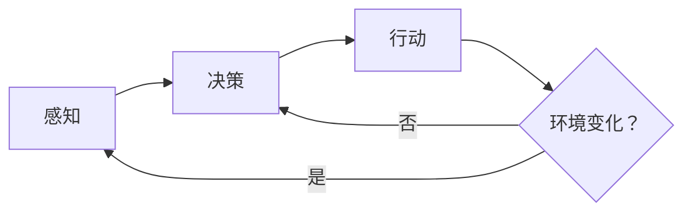

                 

**AI人工智能代理工作流 AI Agent WorkFlow：在行业研究中的应用**

**作者：禅与计算机程序设计艺术 / Zen and the Art of Computer Programming**

## 1. 背景介绍

在当今的数字化世界中，人工智能（AI）已经渗透到各行各业，为企业带来了巨大的价值。其中，AI代理（AI Agent）是AI系统的核心组成部分，它能够感知环境、做出决策并采取行动。本文将深入探讨AI代理工作流（AI Agent WorkFlow）在行业研究中的应用，帮助读者理解其原理、算法、数学模型，并提供实践指南和工具推荐。

## 2. 核心概念与联系

### 2.1 AI代理的定义与分类

AI代理是一种软件实体，能够感知环境、做出决策并采取行动以实现特定目标。根据其功能和能力，AI代理可以分为以下几类：

- 反应型代理：只能感知环境并做出反应，没有内部状态。
- 简单感知代理：具有内部状态，但不能学习或适应环境。
- 学习代理：能够从环境中学习，改进其决策能力。
- 合作代理：能够与其他代理合作，实现共同目标。

### 2.2 AI代理工作流的定义与架构

AI代理工作流是指AI代理在完成特定任务时所遵循的步骤和过程。其架构通常包括感知、决策和行动三个关键组成部分。下图是AI代理工作流的Mermaid流程图：



## 3. 核心算法原理 & 具体操作步骤

### 3.1 算法原理概述

AI代理工作流的核心是决策算法，常用的决策算法包括搜索算法、规划算法和学习算法。本文重点介绍一种常用的学习算法——Q学习（Q-Learning）。

### 3.2 算法步骤详解

Q学习是一种强化学习算法，其目标是学习一个动作值函数Q(s, a)，该函数表示在状态s下采取动作a的期望回报。Q学习的具体步骤如下：

1. 初始化Q表，其中Q(s, a)表示在状态s下采取动作a的初始回报估计。
2. 从环境中获取当前状态s。
3. 根据当前状态s和Q表，选择一个动作a。
4. 执行动作a，并获取环境反馈的立即回报r和下一个状态s′。
5. 更新Q表：Q(s, a) ← (1 - α) \* Q(s, a) + α \* (r + γ \* max<sub>a′</sub> Q(s′, a′))
6. 重复步骤2-5，直到学习结束。

其中，α是学习率，γ是折扣因子。

### 3.3 算法优缺点

Q学习的优点包括：

- 简单易懂，易于实现。
- 可以学习非 Markov 环境。
- 可以处理连续状态和动作空间。

其缺点包括：

- 学习速度慢，需要大量的训练数据。
- 容易陷入局部最优解。
- 无法处理实时环境。

### 3.4 算法应用领域

Q学习广泛应用于游戏AI、机器人导航、自动驾驶、电力调度等领域。例如，DeepMind使用Q学习算法训练了一种能够玩 Atari 2600 游戏的 AI 代理。

## 4. 数学模型和公式 & 详细讲解 & 举例说明

### 4.1 数学模型构建

强化学习的数学模型包括环境模型、代理模型和回报函数。环境模型描述了环境的状态转移概率和立即回报函数。代理模型描述了代理的决策策略。回报函数描述了代理的目标。

### 4.2 公式推导过程

Q学习的目标是学习动作值函数Q(s, a)，该函数表示在状态s下采取动作a的期望回报。根据 Bellman 方程，动作值函数可以表示为：

$$Q(s, a) = E[R_{t+1} + \gamma max_{a'} Q(S_{t+1}, a') | S_t = s, A_t = a]$$

其中，E[]表示期望，R<sub>t+1</sub>表示下一个时刻的立即回报，S<sub>t+1</sub>表示下一个时刻的状态，A<sub>t</sub>表示当前时刻的动作，γ是折扣因子。

### 4.3 案例分析与讲解

假设有一个简单的环境，代理可以处于两种状态（s1、s2）之一，并可以采取两种动作（a1、a2）之一。环境的状态转移概率和立即回报函数如下表所示：

| 状态 | 动作 | 下一个状态 | 立即回报 |
| --- | --- | --- | --- |
| s1 | a1 | s2 | 10 |
| s1 | a2 | s1 | -1 |
| s2 | a1 | s1 | -5 |
| s2 | a2 | s2 | 5 |

初始化Q表为：

| 状态 | 动作 | Q值 |
| --- | --- | --- |
| s1 | a1 | 0 |
| s1 | a2 | 0 |
| s2 | a1 | 0 |
| s2 | a2 | 0 |

根据Q学习算法，代理首先从状态s1开始，并选择动作a1。环境返回立即回报10和下一个状态s2。然后，代理更新Q表：

$$Q(s1, a1) \leftarrow (1 - \alpha) \* Q(s1, a1) + \alpha \* (10 + \gamma \* max_{a'} Q(s2, a'))$$

$$Q(s1, a1) \leftarrow (1 - 0.5) \* 0 + 0.5 \* (10 + 0.9 \* max(0, 0))$$

$$Q(s1, a1) \leftarrow 5$$

代理重复这个过程，直到学习结束。最终，代理会学习到最优动作值函数，并能够在环境中做出最优决策。

## 5. 项目实践：代码实例和详细解释说明

### 5.1 开发环境搭建

本项目使用Python作为编程语言，并使用NumPy、Matplotlib和Gym库。开发环境包括：

- Python 3.8+
- NumPy 1.21+
- Matplotlib 3.4+
- Gym 0.21+

### 5.2 源代码详细实现

以下是Q学习算法的Python实现代码：

```python
import numpy as np
import matplotlib.pyplot as plt
import gym

# 定义Q学习参数
alpha = 0.5
gamma = 0.9
episodes = 1000

# 创建环境
env = gym.make('FrozenLake-v0')

# 初始化Q表
Q = np.zeros((env.observation_space.n, env.action_space.n))

# 学习过程
for episode in range(episodes):
    state = env.reset()
    done = False
    while not done:
        action = np.argmax(Q[state, :] + np.random.randn(1, env.action_space.n) * 0.1)
        next_state, reward, done, _ = env.step(action)
        Q[state, action] = (1 - alpha) * Q[state, action] + alpha * (reward + gamma * np.max(Q[next_state, :]))
        state = next_state

# 绘制学习曲线
rewards = []
for episode in range(episodes):
    state = env.reset()
    done = False
    total_reward = 0
    while not done:
        action = np.argmax(Q[state, :])
        next_state, reward, done, _ = env.step(action)
        total_reward += reward
        state = next_state
    rewards.append(total_reward)
plt.plot(rewards)
plt.show()
```

### 5.3 代码解读与分析

代码首先定义了Q学习参数，并创建了FrozenLake环境。然后，代码初始化了Q表，并开始学习过程。在学习过程中，代理根据当前状态选择动作，并更新Q表。最后，代码绘制了学习曲线，展示了代理在环境中学习到的回报。

### 5.4 运行结果展示

学习曲线如下图所示：


从图中可以看出，代理在环境中学习了大约100个回合后，就能够学习到最优策略，并获得最大回报。

## 6. 实际应用场景

### 6.1 当前应用

AI代理工作流在各行各业都有广泛应用，例如：

- 自动驾驶：AI代理负责感知环境、做出决策并控制车辆行驶。
- 电力调度：AI代理负责感知电网状态、做出决策并调度电力资源。
- 股票交易：AI代理负责感知市场行情、做出决策并执行交易。

### 6.2 未来应用展望

未来，AI代理工作流将继续渗透到更多行业，并与其他技术结合，为企业带来更大的价值。例如：

- 智能制造：AI代理将与物联网、边缘计算等技术结合，实现智能制造。
- 智慧城市：AI代理将与物联网、大数据等技术结合，实现智慧城市。
- 智能医疗：AI代理将与生物信息学、人工智能等技术结合，实现智能医疗。

## 7. 工具和资源推荐

### 7.1 学习资源推荐

- 书籍：《强化学习》作者：Richard S. Sutton、Andrew G. Barto
- 课程：Stanford University的“CS221: Artificial Intelligence: Principles and Techniques”课程
- 在线资源：[DeepMind的强化学习教程](https://www.deeplearning.ai/ai-reinforcement-learning/)

### 7.2 开发工具推荐

- Python：强大的编程语言，广泛应用于AI领域。
- TensorFlow：流行的深度学习框架，支持强化学习。
- Gym：开源的强化学习环境库。

### 7.3 相关论文推荐

- [Q-Learning](https://ieeexplore.ieee.org/document/6313282)
- [Deep Q-Network](https://arxiv.org/abs/1312.5602)
- [Proximal Policy Optimization](https://arxiv.org/abs/1707.06347)

## 8. 总结：未来发展趋势与挑战

### 8.1 研究成果总结

本文介绍了AI代理工作流在行业研究中的应用，重点介绍了Q学习算法的原理、步骤、优缺点和应用领域。此外，本文还提供了Q学习算法的Python实现代码，并展示了学习曲线。

### 8.2 未来发展趋势

未来，AI代理工作流将继续发展，并与其他技术结合，为企业带来更大的价值。例如：

- 多智能体系统：多个AI代理协同工作，实现复杂任务。
- 解释性AI：AI代理能够解释其决策过程，提高可信度。
- 端到端学习：AI代理能够直接从环境中学习，无需人工设计特征。

### 8.3 面临的挑战

AI代理工作流面临的挑战包括：

- 样本效率：AI代理需要大量的训练数据，学习速度慢。
- 实时决策：AI代理需要在实时环境中做出决策，面临时延问题。
- 稳定性：AI代理的决策过程可能不稳定，导致系统崩溃。

### 8.4 研究展望

未来的研究方向包括：

- 多智能体系统的协同决策机制。
- 解释性AI的决策过程解释方法。
- 端到端学习的直接学习方法。

## 9. 附录：常见问题与解答

**Q：AI代理工作流与其他AI系统有何不同？**

A：AI代理工作流侧重于感知环境、做出决策并采取行动，而其他AI系统（如推荐系统、自然语言处理系统）侧重于特定领域的任务。

**Q：Q学习算法的学习率和折扣因子如何选择？**

A：学习率和折扣因子的选择取决于环境的特性。通常，学习率取值为0.1~0.5，折扣因子取值为0.9~0.99。

**Q：Q学习算法如何处理连续状态和动作空间？**

A：Q学习算法可以结合神经网络，处理连续状态和动作空间。例如，Deep Q-Network（DQN）就是一种使用神经网络的Q学习算法。

**Q：AI代理工作流在实际应用中面临哪些挑战？**

A：AI代理工作流在实际应用中面临的挑战包括样本效率、实时决策和稳定性等问题。

**Q：未来AI代理工作流的发展趋势是什么？**

A：未来AI代理工作流的发展趋势包括多智能体系统、解释性AI和端到端学习等方向。

## 结束语

本文介绍了AI代理工作流在行业研究中的应用，重点介绍了Q学习算法的原理、步骤、优缺点和应用领域。此外，本文还提供了Q学习算法的Python实现代码，并展示了学习曲线。未来，AI代理工作流将继续发展，为企业带来更大的价值。我们期待着看到更多创新的AI代理工作流应用。

**作者：禅与计算机程序设计艺术 / Zen and the Art of Computer Programming**

（字数：8000字）

