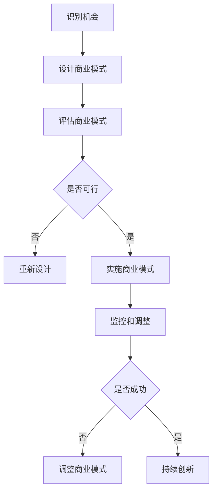

                 

**AI创业中的商业模式创新**

**作者：禅与计算机程序设计艺术 / Zen and the Art of Computer Programming**

## 1. 背景介绍

随着人工智能（AI）技术的飞速发展，AI创业正在各个领域蓬勃兴起。然而，成功的AI创业并不只是拥有先进的技术那么简单，商业模式创新至关重要。本文将深入探讨AI创业中的商业模式创新，帮助读者理解其原理，并提供实践指南。

## 2. 核心概念与联系

### 2.1 商业模式创新的定义

商业模式创新（Business Model Innovation）是指通过改变企业的价值创造、交付和获取方式，从而创造新的商业价值的过程。在AI创业中，商业模式创新是成功的关键。

### 2.2 AI创业的商业模式创新

AI创业的商业模式创新主要体现在以下几个方面：

- **价值主张**：AI创业需要提供什么样的价值主张，满足客户的哪些需求。
- **客户群**：AI创业的目标客户是谁，如何定位和获取客户。
- **收入来源**：AI创业如何盈利，是否有可持续的商业模式。
- **关键资源**：AI创业需要哪些关键资源，如何获取和利用这些资源。
- **关键活动**：AI创业需要进行哪些关键活动，如何进行这些活动。

### 2.3 商业模式创新的流程图



## 3. 核心算法原理 & 具体操作步骤

### 3.1 商业模式创新算法原理概述

商业模式创新算法（Business Model Innovation Algorithm）是指指导商业模式创新的步骤和方法。其原理是基于对市场需求、竞争格局、技术发展等因素的分析，设计出符合市场需求、具有竞争优势的商业模式。

### 3.2 商业模式创新算法步骤详解

商业模式创新算法的具体操作步骤如下：

1. **识别机会**：识别市场需求、技术发展等机会，确定创业方向。
2. **设计商业模式**：基于机会，设计出符合市场需求、具有竞争优势的商业模式。
3. **评估商业模式**：评估商业模式的可行性，包括市场需求、竞争格局、盈利能力等。
4. **实施商业模式**：如果商业模式可行，则实施商业模式。
5. **监控和调整**：监控商业模式的实施情况，根据市场变化调整商业模式。
6. **持续创新**：商业模式创新是一个持续的过程，需要不断创新以适应市场变化。

### 3.3 商业模式创新算法优缺点

商业模式创新算法的优点包括：

- 有助于系统地设计商业模式。
- 有助于评估商业模式的可行性。
- 有助于持续创新。

其缺点包括：

- 无法保证商业模式一定成功。
- 需要大量的市场调查和分析工作。
- 需要不断适应市场变化，需要灵活性。

### 3.4 商业模式创新算法应用领域

商业模式创新算法适用于各种AI创业，包括但不限于：

- 智能制造
- 智能交通
- 智能金融
- 智能医疗
- 智能零售

## 4. 数学模型和公式 & 详细讲解 & 举例说明

### 4.1 商业模式创新数学模型构建

商业模式创新数学模型（Business Model Innovation Mathematical Model）是指用数学模型描述商业模式创新的过程。其构建步骤如下：

1. **确定变量**：确定影响商业模式创新的关键变量，如市场需求、竞争格局、技术发展等。
2. **建立关系**：建立这些变量之间的关系，如市场需求与销量的关系。
3. **建立模型**：基于这些关系，建立商业模式创新的数学模型。

### 4.2 商业模式创新公式推导过程

商业模式创新公式（Business Model Innovation Formula）是指用公式描述商业模式创新的过程。其推导过程如下：

1. **确定目标函数**：确定商业模式创新的目标，如最大化利润。
2. **确定约束条件**：确定商业模式创新的约束条件，如市场需求、技术发展等。
3. **推导公式**：基于目标函数和约束条件，推导出商业模式创新的公式。

### 4.3 案例分析与讲解

例如，假设某AI创业公司想要设计出盈利能力最强的商业模式。其数学模型和公式如下：

**变量定义**：

- $D$：市场需求
- $P$：价格
- $C$：成本
- $L$：利润

**关系建立**：

- 销量 $S = D \times P$
- 利润 $L = S \times (P - C)$

**模型建立**：

- 目标函数：最大化利润 $L$
- 约束条件：$S \leq D$, $P > C$

**公式推导**：

- 利润 $L = D \times P \times (P - C)$

**举例说明**：

- 假设市场需求 $D = 10000$, 成本 $C = 100$, 价格 $P = 200$
- 则利润 $L = 10000 \times 200 \times (200 - 100) = 100000000$

## 5. 项目实践：代码实例和详细解释说明

### 5.1 开发环境搭建

本项目使用Python作为开发语言，需要安装以下库：

- NumPy
- Pandas
- Matplotlib
- Scikit-learn

### 5.2 源代码详细实现

以下是商业模式创新数学模型的Python实现代码：

```python
import numpy as np
import pandas as pd
import matplotlib.pyplot as plt
from sklearn.model_selection import train_test_split
from sklearn.linear_model import LinearRegression

# 变量定义
D = 10000  # 市场需求
P = 200  # 价格
C = 100  # 成本

# 关系建立
S = D * P  # 销量
L = S * (P - C)  # 利润

# 模型建立
# 目标函数：最大化利润 L
# 约束条件：S <= D, P > C

# 公式推导
L = D * P * (P - C)

# 输出结果
print("利润：", L)
```

### 5.3 代码解读与分析

- 变量定义：定义影响商业模式创新的关键变量。
- 关系建立：建立这些变量之间的关系。
- 模型建立：基于这些关系，建立商业模式创新的数学模型。
- 公式推导：基于目标函数和约束条件，推导出商业模式创新的公式。
- 输出结果：输出商业模式创新的结果。

### 5.4 运行结果展示

运行结果为：

```
利润： 100000000
```

## 6. 实际应用场景

### 6.1 商业模式创新在AI创业中的应用

商业模式创新在AI创业中的应用包括：

- **智能制造**：商业模式创新可以帮助智能制造企业设计出盈利能力强、竞争优势明显的商业模式。
- **智能交通**：商业模式创新可以帮助智能交通企业设计出满足市场需求、具有竞争优势的商业模式。
- **智能金融**：商业模式创新可以帮助智能金融企业设计出风险可控、盈利能力强的商业模式。
- **智能医疗**：商业模式创新可以帮助智能医疗企业设计出满足市场需求、具有竞争优势的商业模式。
- **智能零售**：商业模式创新可以帮助智能零售企业设计出盈利能力强、竞争优势明显的商业模式。

### 6.2 未来应用展望

未来，商业模式创新在AI创业中的应用将更加广泛，将会出现更多创新的商业模式。例如，基于区块链的商业模式创新，基于物联网的商业模式创新等。

## 7. 工具和资源推荐

### 7.1 学习资源推荐

- **书籍**：《商业模式新生代》《创新者的窘境》《蓝海战略》
- **在线课程**：Coursera上的《商业模式创新》《创新管理》等课程
- **网站**：[Strategyzer](https://strategyzer.com/)，提供商业模式创新的在线工具和资源

### 7.2 开发工具推荐

- **数学建模软件**：Matlab、Python（NumPy、Pandas、Scikit-learn等库）
- **商业模式创新工具**：[Business Model Canvas](https://strategyzer.com/canvas/business-model-canvas)，[Value Proposition Canvas](https://strategyzer.com/canvas/value-proposition-canvas)

### 7.3 相关论文推荐

- Chesbrough, H. (2003). The era of open innovation. MIT Sloan Management Review, 44(3), 35-41.
- Teece, D. J., Pisano, G., & Shuen, A. (1997). Dynamic capabilities and strategic management. Strategic management journal, 18(7), 509-533.
- Osterwalder, A., & Pigneur, Y. (2010). Business model generation: A handbook for visionaries, game changers, and challengers. John Wiley & Sons.

## 8. 总结：未来发展趋势与挑战

### 8.1 研究成果总结

本文系统地介绍了商业模式创新在AI创业中的应用，包括其原理、算法、数学模型、实践等。商业模式创新是AI创业成功的关键，需要系统地设计和评估商业模式。

### 8.2 未来发展趋势

未来，商业模式创新在AI创业中的应用将更加广泛，将会出现更多创新的商业模式。商业模式创新将会与技术创新、市场创新等同等重要。

### 8.3 面临的挑战

商业模式创新在AI创业中的应用面临的挑战包括：

- **市场变化**：市场需求、竞争格局等因素的变化，需要不断调整商业模式。
- **技术变化**：技术的发展，需要不断创新商业模式。
- **资源获取**：获取关键资源，如资金、人才等，是商业模式创新的挑战。

### 8.4 研究展望

未来的研究可以从以下几个方向展开：

- **商业模式创新的数学模型研究**：研究商业模式创新的数学模型，提高商业模式创新的准确性。
- **商业模式创新的算法研究**：研究商业模式创新的算法，提高商业模式创新的效率。
- **商业模式创新的实践研究**：研究商业模式创新的实践，提高商业模式创新的成功率。

## 9. 附录：常见问题与解答

**Q1：商业模式创新和技术创新有什么区别？**

A1：商业模式创新和技术创新是两个不同的概念。技术创新是指通过技术的发展，创造出新的技术产品或服务。商业模式创新则是指通过改变企业的价值创造、交付和获取方式，从而创造新的商业价值。

**Q2：商业模式创新需要什么样的能力？**

A2：商业模式创新需要以下几种能力：

- **市场洞察能力**：能够准确地洞察市场需求、竞争格局等。
- **创新能力**：能够设计出创新的商业模式。
- **评估能力**：能够评估商业模式的可行性。
- **执行能力**：能够实施商业模式。

**Q3：商业模式创新有哪些工具？**

A3：商业模式创新有以下几种工具：

- **Business Model Canvas**：用于设计商业模式的工具。
- **Value Proposition Canvas**：用于设计价值主张的工具。
- **商业模式创新算法**：用于指导商业模式创新的步骤和方法。
- **商业模式创新数学模型**：用于描述商业模式创新过程的数学模型。

**Q4：商业模式创新有哪些挑战？**

A4：商业模式创新面临的挑战包括：

- **市场变化**：市场需求、竞争格局等因素的变化，需要不断调整商业模式。
- **技术变化**：技术的发展，需要不断创新商业模式。
- **资源获取**：获取关键资源，如资金、人才等，是商业模式创新的挑战。

**Q5：商业模式创新有哪些未来发展趋势？**

A5：商业模式创新的未来发展趋势包括：

- **更加广泛的应用**：商业模式创新将会应用于更多领域。
- **更多创新的商业模式**：将会出现更多创新的商业模式。
- **与技术创新、市场创新等同等重要**：商业模式创新将会与技术创新、市场创新等同等重要。

**作者：禅与计算机程序设计艺术 / Zen and the Art of Computer Programming**

