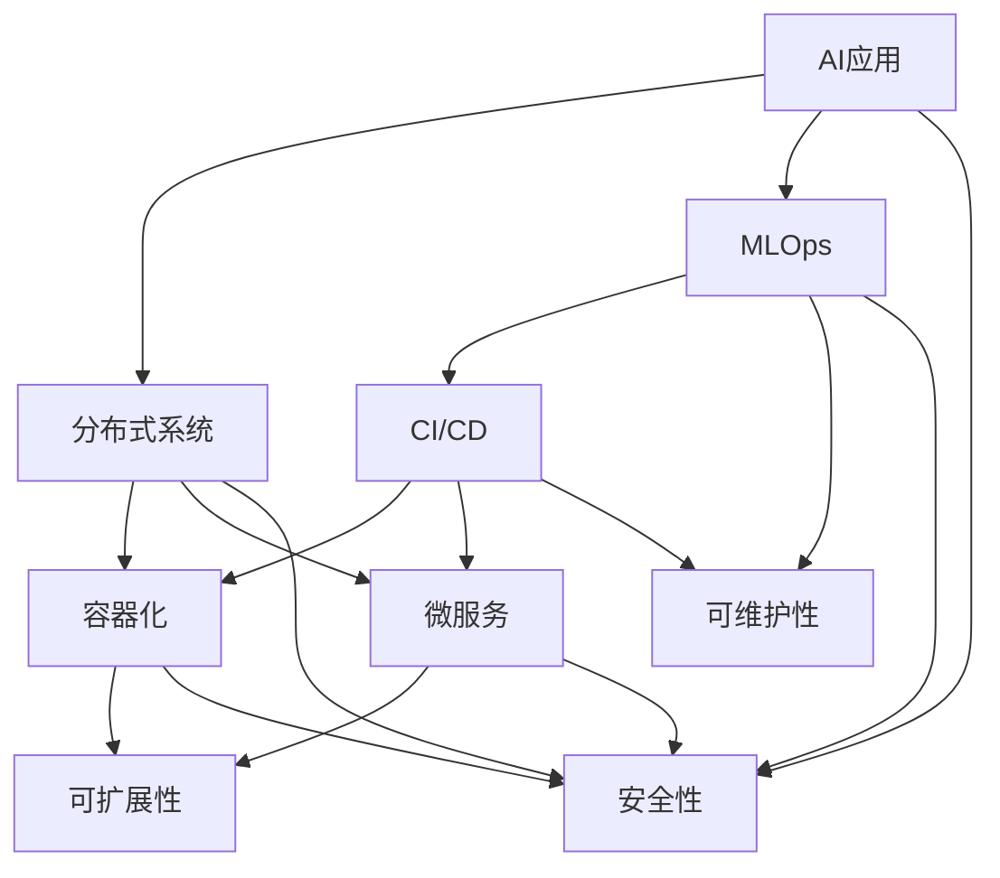

                 

**可扩展性、可维护性、安全性、AI创业公司、技术架构设计、分布式系统、容器化、微服务、CI/CD、MLOps**

## 1. 背景介绍

随着人工智能（AI）技术的飞速发展，越来越多的创业公司涌入AI领域，期望通过AI创新来获取市场优势。然而，这些公司面临着技术架构设计的挑战，以满足可扩展性、可维护性和安全性的需求。本文将深入探讨AI创业公司的技术架构设计，提供指导性建议，帮助读者设计出高效、可靠、安全的AI系统。

## 2. 核心概念与联系

### 2.1 关键概念

- **可扩展性（Scalability）**：系统能够在不中断服务的情况下，处理增加的工作量或负载。
- **可维护性（Maintainability）**：系统易于修改、修复和更新，以适应变化的需求。
- **安全性（Security）**：系统能够保护数据和资源免受未授权访问、滥用和故意或意外的破坏。
- **分布式系统（Distributed System）**：在多台计算机上运行的应用程序，这些计算机通过网络进行通信和协作。
- **容器化（Containerization）**：使用容器（如Docker）将应用程序与其依赖项一起打包，确保应用程序在任何环境中都能运行。
- **微服务（Microservices）**：将应用程序划分为小型、独立的服务，每个服务都有自己的数据库和业务逻辑。
- **CI/CD（Continuous Integration/Continuous Deployment）**：持续集成和持续部署，用于自动化软件构建、测试和部署。
- **MLOps（Machine Learning Operations）**：将机器学习模型的部署和管理与软件开发和运维最佳实践结合起来。

### 2.2 核心架构与联系（Mermaid流程图）



## 3. 核心算法原理 & 具体操作步骤

### 3.1 算法原理概述

AI创业公司的技术架构设计需要考虑到AI算法的特性，如训练和推理的计算需求、数据依赖关系和模型更新频率。本节将介绍一些常用的AI算法原理，如神经网络和深度学习。

### 3.2 算法步骤详解

1. **数据预处理**：收集、清洗和预处理数据，以便于算法学习。
2. **模型选择**：选择合适的AI算法，如神经网络、决策树或支持向量机等。
3. **模型训练**：使用预处理后的数据训练模型，调整模型参数以最小化预测误差。
4. **模型评估**：评估模型性能，使用指标如精确度、召回率和F1分数等。
5. **模型部署**：将训练好的模型部署到生产环境，以提供预测服务。
6. **模型监控和更新**：监控模型性能，并定期更新模型以适应新数据。

### 3.3 算法优缺点

**优点**：

- AI算法可以从数据中学习，无需显式编程。
- AI算法可以处理复杂的非线性关系和模式。
- AI算法在各种领域都有广泛的应用，如图像、语音和自然语言处理等。

**缺点**：

- AI算法需要大量的数据和计算资源。
- AI算法的性能和可解释性可能会受到限制。
- AI算法可能会受到过拟合、泛化和偏见等问题的影响。

### 3.4 算法应用领域

AI算法在各种领域都有广泛的应用，如：

- 图像和视频分析：物体检测、人脸识别、视频监控等。
- 语音和自然语言处理：语音识别、机器翻译、文本分类等。
- 推荐系统：个性化推荐、内容过滤等。
- 自动驾驶和机器人：路径规划、障碍物检测等。

## 4. 数学模型和公式 & 详细讲解 & 举例说明

### 4.1 数学模型构建

AI算法的数学模型通常基于统计学习理论和信息论。本节将介绍一些常用的数学模型，如线性回归和逻辑回归。

**线性回归**：假设目标变量$y$与输入变量$x$之间存在线性关系，可以使用线性回归模型进行建模：

$$y = wx + b + \epsilon$$

其中，$w$和$b$是模型参数，$\epsilon$是误差项。

**逻辑回归**：假设目标变量$y$是二进制的，可以使用逻辑回归模型进行建模：

$$P(y=1|x) = \sigma(wx + b)$$

其中，$\sigma$是sigmoid函数，用于将输出转换为概率。

### 4.2 公式推导过程

**线性回归参数估计**：使用最小二乘法估计线性回归模型的参数：

$$\hat{w}, \hat{b} = \arg\min_{w, b} \sum_{i=1}^{n} (y_i - (wx_i + b))^2$$

**逻辑回归参数估计**：使用梯度下降法估计逻辑回归模型的参数：

$$\hat{w}, \hat{b} = \arg\min_{w, b} \sum_{i=1}^{n} \left[ -y_i \log(\sigma(wx_i + b)) - (1 - y_i) \log(1 - \sigma(wx_i + b))\right]$$

### 4.3 案例分析与讲解

**线性回归案例**：假设我们想要预测房价与房屋面积的关系。我们可以使用线性回归模型进行建模，并使用最小二乘法估计模型参数。然后，我们可以使用模型预测房价，并评估模型性能。

**逻辑回归案例**：假设我们想要预测客户是否会购买产品。我们可以使用逻辑回归模型进行建模，并使用梯度下降法估计模型参数。然后，我们可以使用模型预测客户是否会购买产品，并评估模型性能。

## 5. 项目实践：代码实例和详细解释说明

### 5.1 开发环境搭建

AI创业公司的技术架构设计需要考虑到开发环境的搭建。本节将介绍如何搭建开发环境，使用Python和常用的AI库，如TensorFlow和PyTorch。

### 5.2 源代码详细实现

本节将提供一个简单的AI项目的源代码实现，如图像分类项目。项目将使用Convolutional Neural Network（CNN）进行图像分类，并使用TensorFlow实现。

```python
import tensorflow as tf
from tensorflow.keras import datasets, layers, models

# 加载数据集
(train_images, train_labels), (test_images, test_labels) = datasets.cifar10.load_data()

# 标准化数据
train_images, test_images = train_images / 255.0, test_images / 255.0

# 创建模型
model = models.Sequential()
model.add(layers.Conv2D(32, (3, 3), activation='relu', input_shape=(32, 32, 3)))
model.add(layers.MaxPooling2D((2, 2)))
model.add(layers.Conv2D(64, (3, 3), activation='relu'))
model.add(layers.MaxPooling2D((2, 2)))
model.add(layers.Conv2D(64, (3, 3), activation='relu'))

# 添加全连接层
model.add(layers.Flatten())
model.add(layers.Dense(64, activation='relu'))
model.add(layers.Dense(10))

# 编译模型
model.compile(optimizer='adam',
              loss=tf.keras.losses.SparseCategoricalCrossentropy(from_logits=True),
              metrics=['accuracy'])

# 训练模型
history = model.fit(train_images, train_labels, epochs=10,
                    validation_data=(test_images, test_labels))
```

### 5.3 代码解读与分析

本节将详细解读上述源代码，解释每个关键部分的作用。

- **数据加载**：使用TensorFlow内置的CIFAR-10数据集加载图像数据。
- **数据标准化**：将图像数据标准化为[0, 1]之间的值。
- **模型创建**：创建一个 Sequential 模型，并添加 Conv2D、MaxPooling2D 和 Dense 层。
- **编译模型**：使用 Adam 优化器和 SparseCategoricalCrossentropy 损失函数编译模型。
- **训练模型**：使用训练数据训练模型，并评估模型性能。

### 5.4 运行结果展示

运行上述源代码后，模型的训练和评估结果将被打印出来。我们可以看到模型的准确率和损失函数值，并评估模型性能。

## 6. 实际应用场景

### 6.1 可扩展性

AI创业公司需要考虑到系统的可扩展性，以满足不断增长的用户需求。本节将介绍一些提高可扩展性的方法，如分布式系统和水平扩展。

**分布式系统**：将系统分布在多台计算机上，以提高系统的可扩展性和可靠性。分布式系统需要考虑到数据一致性、故障恢复和通信协议等问题。

**水平扩展**：通过添加更多的计算资源（如CPU、GPU和内存）来扩展系统，以处理更大的工作负载。水平扩展需要考虑到资源调度和负载平衡等问题。

### 6.2 可维护性

AI创业公司需要考虑到系统的可维护性，以便于修改、修复和更新系统。本节将介绍一些提高可维护性的方法，如模块化设计和持续集成/持续部署（CI/CD）。

**模块化设计**：将系统分成小的、独立的模块，每个模块都有明确的职责和接口。模块化设计可以提高系统的可维护性和可测试性。

**CI/CD**：使用CI/CD流水线自动化软件构建、测试和部署。CI/CD可以提高系统的可维护性和可靠性，并加速软件交付。

### 6.3 安全性

AI创业公司需要考虑到系统的安全性，以保护数据和资源免受未授权访问、滥用和故意或意外的破坏。本节将介绍一些提高安全性的方法，如访问控制和加密。

**访问控制**：实施严格的访问控制策略，限制对系统和数据的访问。访问控制可以防止未授权访问和滥用。

**加密**：使用加密技术保护数据和通信，防止数据泄露和窃听。加密可以保护数据的机密性和完整性。

### 6.4 未来应用展望

AI技术正在快速发展，为AI创业公司带来了新的机遇和挑战。未来，AI创业公司需要考虑到新的技术和架构设计，如边缘计算、量子计算和自动机器学习（AutoML）。此外，AI创业公司需要关注道德和伦理问题，确保AI技术的负责任使用。

## 7. 工具和资源推荐

### 7.1 学习资源推荐

- **在线课程**： Coursera、Udacity、edX 等平台上的 AI 相关课程。
- **书籍**：《机器学习》作者：Tom Mitchell、《深度学习》作者：Ian Goodfellow、Yoshua Bengio 和 Aaron Courville、《统计学习方法》作者：Hastie、Tibshirani 和 Friedman。
- **博客和论坛**：KDnuggets、Towards Data Science、Stack Overflow 等。

### 7.2 开发工具推荐

- **编程语言**：Python、R、Julia。
- **AI库**：TensorFlow、PyTorch、Keras、Scikit-learn。
- **开发环境**：Jupyter Notebook、Google Colab、Anaconda。
- **集成开发环境（IDE）**：PyCharm、Visual Studio Code、JupyterLab。

### 7.3 相关论文推荐

- **AI架构设计**：[Large-Scale Deep Unsupervised Learning: A Survey](https://arxiv.org/abs/1905.09438)、[The Machine Learning Landscape: A Survey](https://arxiv.org/abs/1906.02250)。
- **AI安全**：[Differential Privacy for Machine Learning](https://arxiv.org/abs/1610.08452)、[Adversarial Machine Learning](https://arxiv.org/abs/1712.05526)。
- **AI伦理**：[The Ethics of Artificial Intelligence](https://arxiv.org/abs/1703.07243)、[Artificial Intelligence: A Guide for Thinking Humans](https://www.amazon.com/Artificial-Intelligence-Thinking-Humans/dp/0062409859)。

## 8. 总结：未来发展趋势与挑战

### 8.1 研究成果总结

本文介绍了AI创业公司的技术架构设计，重点关注可扩展性、可维护性和安全性。我们讨论了核心概念和算法原理，并提供了数学模型和公式的详细讲解。此外，我们还介绍了项目实践、实际应用场景、工具和资源推荐。

### 8.2 未来发展趋势

未来，AI技术将继续发展，为AI创业公司带来新的机遇和挑战。我们预计会看到以下发展趋势：

- **边缘计算**：将AI模型部署到边缘设备，以减少延迟和提高效率。
- **量子计算**：利用量子计算的优势加速AI模型训练和推理。
- **自动机器学习（AutoML）**：开发新的技术和工具，自动化机器学习模型的设计和优化。
- **AI伦理和道德**：关注AI技术的负责任使用，开发新的伦理和道德框架。

### 8.3 面临的挑战

AI创业公司面临着各种挑战，包括：

- **数据隐私和安全**：保护用户数据免受泄露和滥用。
- **模型解释性**：开发新的技术和工具，提高AI模型的可解释性。
- **模型偏见**：开发新的技术和工具，减少AI模型的偏见和歧视。
- **人才短缺**：吸引和留住具有AI技能的员工。

### 8.4 研究展望

未来的研究将关注以下领域：

- **AI架构设计**：开发新的架构设计和最佳实践，提高AI系统的可扩展性、可维护性和安全性。
- **AI安全**：开发新的技术和工具，保护AI系统免受攻击和滥用。
- **AI伦理和道德**：开发新的伦理和道德框架，指导AI技术的负责任使用。
- **AI与物联网（IoT）**：开发新的技术和工具，将AI与物联网集成，实现智能物联网。

## 9. 附录：常见问题与解答

**Q1：什么是AI创业公司的技术架构设计？**

A1：AI创业公司的技术架构设计是指设计和构建AI系统的过程，以满足可扩展性、可维护性和安全性的需求。

**Q2：为什么可扩展性、可维护性和安全性很重要？**

A2：可扩展性、可维护性和安全性是AI创业公司成功的关键因素。可扩展性确保系统能够处理增加的工作量或负载，可维护性确保系统易于修改、修复和更新，安全性确保系统能够保护数据和资源免受未授权访问、滥用和故意或意外的破坏。

**Q3：什么是分布式系统？**

A3：分布式系统是指在多台计算机上运行的应用程序，这些计算机通过网络进行通信和协作。分布式系统需要考虑到数据一致性、故障恢复和通信协议等问题。

**Q4：什么是容器化？**

A4：容器化是指使用容器（如Docker）将应用程序与其依赖项一起打包，确保应用程序在任何环境中都能运行。容器化可以提高系统的可移植性和可靠性。

**Q5：什么是微服务？**

A5：微服务是指将应用程序划分为小型、独立的服务，每个服务都有自己的数据库和业务逻辑。微服务可以提高系统的可维护性和可扩展性。

**Q6：什么是CI/CD？**

A6：CI/CD是指持续集成和持续部署，用于自动化软件构建、测试和部署。CI/CD可以提高系统的可维护性和可靠性，并加速软件交付。

**Q7：什么是MLOps？**

A7：MLOps是指将机器学习模型的部署和管理与软件开发和运维最佳实践结合起来。MLOps可以提高AI系统的可靠性和可维护性。

**Q8：什么是线性回归？**

A8：线性回归是指假设目标变量与输入变量之间存在线性关系的统计学习方法。线性回归可以用于预测连续值的目标变量。

**Q9：什么是逻辑回归？**

A9：逻辑回归是指假设目标变量是二进制的统计学习方法。逻辑回归可以用于预测二进制值的目标变量。

**Q10：什么是神经网络和深度学习？**

A10：神经网络和深度学习是指一种计算模型，受人类大脑的结构和功能启发。神经网络和深度学习可以用于解决各种复杂的问题，如图像和语音识别。

**Q11：什么是边缘计算？**

A11：边缘计算是指将AI模型部署到边缘设备，以减少延迟和提高效率。边缘计算可以用于实时处理和分析数据。

**Q12：什么是量子计算？**

A12：量子计算是指利用量子位（qubit）进行计算的计算模型。量子计算可以用于加速AI模型训练和推理。

**Q13：什么是自动机器学习（AutoML）？**

A13：自动机器学习（AutoML）是指开发新的技术和工具，自动化机器学习模型的设计和优化。AutoML可以提高AI系统的可靠性和可维护性。

**Q14：什么是AI伦理和道德？**

A14：AI伦理和道德是指关注AI技术的负责任使用，开发新的伦理和道德框架。AI伦理和道德可以确保AI技术的公平、透明和可解释。

**Q15：什么是物联网（IoT）？**

A15：物联网（IoT）是指将物理设备与互联网连接，以实现智能控制和自动化。物联网可以与AI集成，实现智能物联网。

## 作者：禅与计算机程序设计艺术 / Zen and the Art of Computer Programming

> 禅与计算机程序设计艺术是一本经典的计算机编程书籍，作者是唐·库茨（Donald E. Knuth）。本书提供了编程的哲学和美学，鼓励读者思考编程的本质和目标。本书是计算机程序设计领域的经典著作，受到广泛的赞誉和推荐。

