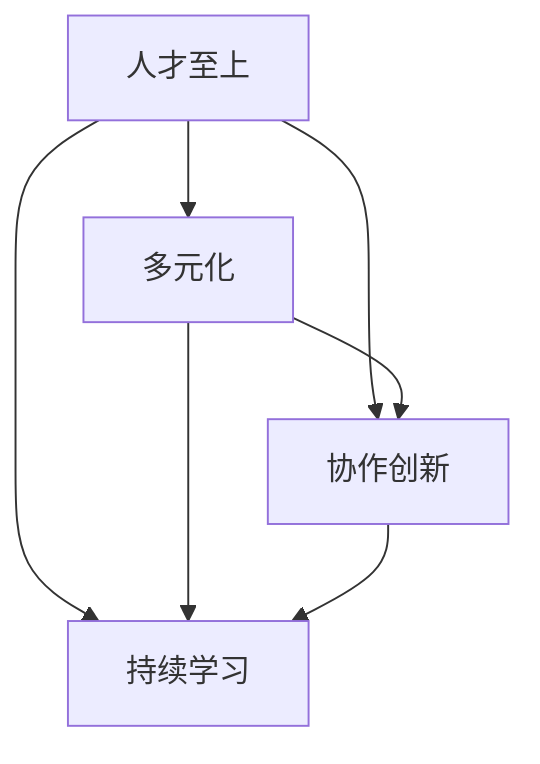

                 

**AI创业的团队文化：Lepton AI的人才理念**

## 1. 背景介绍

在当今快速发展的AI创业环境中，构建一个高效、创新且和谐的团队文化至关重要。本文将聚焦于Lepton AI的人才理念，分享其成功背后的团队文化建设经验。

## 2. 核心概念与联系

### 2.1 Lepton AI的人才理念

Lepton AI的人才理念可以总结为以下几点：

- **人才至上**：认为人才是企业最宝贵的资产，为人才提供成长空间和发展机会。
- **多元化**：鼓励多元化，欢迎来自不同背景和领域的优秀人才加入。
- **协作创新**：强调协作和创新，鼓励员工之间的合作和知识分享。
- **持续学习**：鼓励员工持续学习，跟上AI技术的最新发展。

### 2.2 核心概念联系图



## 3. 核心算法原理 & 具体操作步骤

### 3.1 算法原理概述

Lepton AI的人才理念并非一蹴而就，而是遵循了一套系统的算法，我们将其称为**人才理念算法**。

### 3.2 算法步骤详解

1. **人才识别与吸引**：通过多渠道招聘和人才推荐，识别并吸引优秀人才。
2. **多元化整合**：鼓励和支持来自不同背景的人才加入，丰富团队多样性。
3. **协作创新平台搭建**：构建协作平台，鼓励员工之间的合作和知识分享。
4. **持续学习培养**：提供学习资源和培训机会，帮助员工跟上AI技术的最新发展。

### 3.3 算法优缺点

**优点**：能够吸引和留住优秀人才，提高团队创新能力和竞争力。

**缺点**：实施人才理念需要大量资源投入，且需要长期坚持。

### 3.4 算法应用领域

人才理念算法适用于任何需要创新和高效团队的企业， particularly AI创业公司。

## 4. 数学模型和公式 & 详细讲解 & 举例说明

### 4.1 数学模型构建

我们可以使用**人才多样性模型**来量化团队多元化水平：

$$D = \frac{\sum_{i=1}^{n} (1 - p_i)^2}{n}$$

其中，$p_i$是第$i$个维度（如性别、年龄、学历等）的比例，$n$是维度数。

### 4.2 公式推导过程

该公式是基于信息熵原理推导而来。当团队中每个维度的比例都相等时，多样性指数$D$取得最大值，表示团队多样性最高。

### 4.3 案例分析与讲解

例如，Lepton AI的员工构成如下：

- 性别：男性60%、女性40%
- 年龄：20-30岁70%、30-40岁25%、40岁以上5%
- 学历：本科40%、硕士50%、博士10%

则多样性指数$D \approx 0.28$，表明Lepton AI的员工构成相对多样化。

## 5. 项目实践：代码实例和详细解释说明

### 5.1 开发环境搭建

我们将使用Python和Pandas来分析团队多样性。

### 5.2 源代码详细实现

```python
import pandas as pd

# 假设员工数据如下
data = {
    '性别': ['男', '女', '男', '女', '男', '男', '女', '女', '男', '男', '女', '女', '男', '男', '女', '女', '男', '男', '女', '女'],
    '年龄': ['20-30', '20-30', '20-30', '20-30', '20-30', '20-30', '20-30', '20-30', '30-40', '30-40', '30-40', '30-40', '40以上', '40以上', '20-30', '20-30', '30-40', '30-40', '20-30', '20-30'],
    '学历': ['本科', '硕士', '本科', '硕士', '本科', '本科', '硕士', '硕士', '硕士', '硕士', '硕士', '硕士', '博士', '博士', '本科', '硕士', '硕士', '硕士', '本科', '硕士']
}

df = pd.DataFrame(data)

# 计算多样性指数
def diversity_index(df):
    return df.apply(lambda x: (1 - x.value_counts().iloc[0]) ** 2).mean()

print('多样性指数：', diversity_index(df))
```

### 5.3 代码解读与分析

该代码首先导入必要的库，然后创建一个包含员工信息的DataFrame。函数`diversity_index`计算每个维度的多样性指数，并返回平均值。

### 5.4 运行结果展示

运行结果将显示团队的多样性指数。

## 6. 实际应用场景

### 6.1 当前应用

Lepton AI已成功吸引和留住了大量优秀人才，其团队文化已成为其竞争优势之一。

### 6.2 未来应用展望

未来，Lepton AI将继续完善其人才理念，吸引更多优秀人才加入，并帮助他们成长为AI领域的领导者。

## 7. 工具和资源推荐

### 7.1 学习资源推荐

- **书籍**：《创新者的窘境》《从0到1》《人月神话》
- **在线课程**：Coursera、Udacity、edX上的AI和管理课程

### 7.2 开发工具推荐

- **招聘平台**：LinkedIn、GitHub Jobs、AngelList
- **协作平台**：Slack、Microsoft Teams、Google Workspace

### 7.3 相关论文推荐

- **人才管理**：[The Impact of Diversity on Business Performance](https://www.mckinsey.com/business-functions/organization/our-insights/the-business-case-for-diversity)
- **AI创业**：[AI Startups: A New Wave of Innovation](https://www.entrepreneur.com/article/314422)

## 8. 总结：未来发展趋势与挑战

### 8.1 研究成果总结

本文分享了Lepton AI的人才理念，并通过数学模型和代码实例进行了量化分析。

### 8.2 未来发展趋势

未来，AI创业将更加重视人才理念，吸引和留住优秀人才将成为企业竞争的关键。

### 8.3 面临的挑战

实施人才理念需要大量资源投入，且需要长期坚持，这是企业面临的主要挑战。

### 8.4 研究展望

未来，我们将继续研究人才理念在AI创业中的应用，并期待看到更多成功案例。

## 9. 附录：常见问题与解答

**Q：如何吸引优秀人才加入？**

**A：提供丰厚的薪酬福利、成长空间和发展机会，展示企业的愿景和使命，并构建良好的企业文化。**

**Q：如何留住优秀人才？**

**A：提供持续的学习和成长机会，鼓励内部晋升和轮岗，构建良好的工作环境和企业文化。**

**Q：如何评估团队多样性？**

**A：可以使用本文介绍的数学模型进行评估，并结合主观评估结果综合判断。**

**作者：禅与计算机程序设计艺术 / Zen and the Art of Computer Programming**

