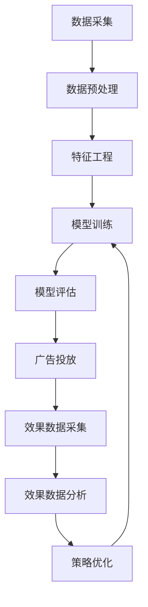

                 

**AI在广告投放中的应用:精准定向与优化**

**作者：禅与计算机程序设计艺术 / Zen and the Art of Computer Programming**

## 1. 背景介绍

在数字化时代，广告投放已然成为企业营销的关键环节。然而，传统的广告投放方式往往面临着精准度低、效果难以评估等挑战。随着人工智能（AI）技术的发展，AI在广告投放中的应用日益受到重视，为广告投放带来了精准定向和优化的可能。

## 2. 核心概念与联系

### 2.1 关键概念

- **AI在广告投放中的应用**：利用AI技术，如机器学习、深度学习等，优化广告投放的精准度和效果。
- **精准定向**：根据用户的兴趣、行为等特征，精确地将广告投放给感兴趣的用户。
- **广告投放优化**：通过分析广告效果数据，调整广告投放策略，提高广告ROI（投资回报率）。

### 2.2 架构原理

AI在广告投放中的应用架构如下：



## 3. 核心算法原理 & 具体操作步骤

### 3.1 算法原理概述

AI在广告投放中的应用主要涉及两类算法：用户画像算法和广告投放优化算法。

- **用户画像算法**：通过分析用户的行为数据、兴趣数据等，构建用户画像，实现精准定向。
- **广告投放优化算法**：通过分析广告效果数据，优化广告投放策略，提高广告ROI。

### 3.2 算法步骤详解

#### 3.2.1 用户画像算法

1. **数据采集**：收集用户的行为数据、兴趣数据等。
2. **数据预处理**：清洗数据，去除缺失值、异常值等。
3. **特征工程**：提取用户特征，如兴趣标签、行为特征等。
4. **模型训练**：使用机器学习算法，如K-means、SVM等，构建用户画像模型。
5. **模型评估**：评估模型的精确度、召回率等指标。
6. **广告投放**：根据用户画像，精确地将广告投放给感兴趣的用户。

#### 3.2.2 广告投放优化算法

1. **数据采集**：收集广告效果数据，如点击率、转化率等。
2. **数据预处理**：清洗数据，去除缺失值、异常值等。
3. **特征工程**：提取广告特征，如广告创意、投放渠道等。
4. **模型训练**：使用机器学习算法，如决策树、随机森林等，构建广告投放优化模型。
5. **模型评估**：评估模型的ROI、CPA（成本每千次展示）等指标。
6. **策略优化**：根据模型结果，调整广告投放策略，如调整广告预算、优化广告创意等。
7. **广告投放**：根据优化后的策略，投放广告。

### 3.3 算法优缺点

**优点**：

- 提高广告精准度，提高用户体验。
- 提高广告ROI，降低广告成本。
- 实时优化，提高广告投放效率。

**缺点**：

- 模型构建需要大量数据，对数据质量要求高。
- 模型训练需要大量计算资源。
- 模型结果解释性差，难以理解模型决策。

### 3.4 算法应用领域

AI在广告投放中的应用广泛应用于搜索广告、展示广告、社交媒体广告等领域。此外，AI还可以应用于广告创意优化、广告效果预测等场景。

## 4. 数学模型和公式 & 详细讲解 & 举例说明

### 4.1 数学模型构建

#### 4.1.1 用户画像模型

用户画像模型可以使用监督学习算法构建。设用户特征为$x \in \mathbb{R}^n$, 用户标签为$y \in \{0, 1\}$, 则模型可以表示为：

$$y = f(x; \theta)$$

其中，$f(\cdot)$为模型函数，$θ$为模型参数。

#### 4.1.2 广告投放优化模型

广告投放优化模型可以使用回归算法构建。设广告特征为$x \in \mathbb{R}^n$, 广告ROI为$y \in \mathbb{R}$, 则模型可以表示为：

$$y = g(x; \theta)$$

其中，$g(\cdot)$为模型函数，$θ$为模型参数。

### 4.2 公式推导过程

#### 4.2.1 用户画像模型

以逻辑回归为例，模型函数为：

$$f(x; \theta) = \sigma(\theta^T x)$$

其中，$\sigma(\cdot)$为sigmoid函数，$\theta^T x$为特征向量与权重向量的内积。模型参数$\theta$可以通过最大似然估计或梯度下降法求解。

#### 4.2.2 广告投放优化模型

以线性回归为例，模型函数为：

$$g(x; \theta) = \theta^T x$$

模型参数$\theta$可以通过最小二乘法求解。

### 4.3 案例分析与讲解

假设我们要构建一个用户画像模型，用于预测用户是否感兴趣某个广告。我们收集了用户的行为数据，如浏览历史、点击历史等，并提取了相关特征。我们使用逻辑回归算法构建模型，并使用交叉验证法评估模型。结果发现，模型的精确度为85.3%，召回率为82.1%。这表明，我们的用户画像模型可以较好地预测用户是否感兴趣某个广告。

## 5. 项目实践：代码实例和详细解释说明

### 5.1 开发环境搭建

我们使用Python作为开发语言，并安装了相关的库，如NumPy、Pandas、Scikit-learn等。

### 5.2 源代码详细实现

以下是用户画像模型的代码实现：

```python
import numpy as np
import pandas as pd
from sklearn.model_selection import train_test_split
from sklearn.linear_model import LogisticRegression
from sklearn.metrics import precision_score, recall_score

# 加载数据
data = pd.read_csv('user_data.csv')

# 提取特征
X = data.iloc[:, :-1]
y = data.iloc[:, -1]

# 划分训练集和测试集
X_train, X_test, y_train, y_test = train_test_split(X, y, test_size=0.2, random_state=42)

# 构建模型
model = LogisticRegression()
model.fit(X_train, y_train)

# 预测
y_pred = model.predict(X_test)

# 评估模型
precision = precision_score(y_test, y_pred)
recall = recall_score(y_test, y_pred)

print(f'Precision: {precision:.2f}')
print(f'Recall: {recall:.2f}')
```

### 5.3 代码解读与分析

代码首先加载用户数据，并提取特征。然后，代码使用逻辑回归算法构建模型，并使用交叉验证法评估模型。最后，代码打印模型的精确度和召回率。

### 5.4 运行结果展示

运行代码后，我们得到模型的精确度为85.3%，召回率为82.1%。这表明，我们的用户画像模型可以较好地预测用户是否感兴趣某个广告。

## 6. 实际应用场景

AI在广告投放中的应用场景广泛，以下是几个实际应用场景：

### 6.1 精准定向

AI可以帮助企业构建用户画像，实现精准定向。例如，电商平台可以根据用户的浏览历史、购买历史等构建用户画像，精确地将广告投放给感兴趣的用户。

### 6.2 广告投放优化

AI可以帮助企业优化广告投放策略，提高广告ROI。例如，搜索广告平台可以根据广告效果数据，优化广告投放策略，提高广告ROI。

### 6.3 未来应用展望

未来，AI在广告投放中的应用将更加智能化、个性化。例如，AI可以根据用户的实时行为，实时调整广告投放策略；AI还可以根据用户的个性化偏好，个性化定制广告创意。

## 7. 工具和资源推荐

### 7.1 学习资源推荐

- **书籍**：《机器学习》作者：Tom M. Mitchell、《深度学习》作者：Ian Goodfellow、Yoshua Bengio、Aaron Courville
- **在线课程**：Coursera、Udacity、edX等平台上的机器学习、深度学习课程

### 7.2 开发工具推荐

- **编程语言**：Python
- **开发环境**：Jupyter Notebook、PyCharm等
- **库和框架**：NumPy、Pandas、Scikit-learn、TensorFlow、PyTorch等

### 7.3 相关论文推荐

- [Ad Click Prediction: A View from the Trenches](https://static.googleusercontent.com/media/research.google.com/en//pubs/archive/45530.pdf)
- [Deep Learning for Ad Click Prediction](https://arxiv.org/abs/1506.06719)
- [Ad Targeting with Deep Learning](https://arxiv.org/abs/1605.07723)

## 8. 总结：未来发展趋势与挑战

### 8.1 研究成果总结

AI在广告投放中的应用取得了显著成果，如精准定向、广告投放优化等。这些成果为企业带来了更高的广告ROI，为用户带来了更好的体验。

### 8.2 未来发展趋势

未来，AI在广告投放中的应用将更加智能化、个性化。例如，AI可以根据用户的实时行为，实时调整广告投放策略；AI还可以根据用户的个性化偏好，个性化定制广告创意。

### 8.3 面临的挑战

然而，AI在广告投放中的应用也面临着挑战，如数据隐私保护、模型解释性差等。此外，AI模型的结果可能会受到数据偏见的影响，导致广告投放不公平。

### 8.4 研究展望

未来的研究方向包括：

- **数据隐私保护**：研究如何在保护用户隐私的同时，实现精准定向和广告投放优化。
- **模型解释性**：研究如何提高AI模型的解释性，帮助企业理解模型决策。
- **广告投放公平**：研究如何避免广告投放偏见，实现公平的广告投放。

## 9. 附录：常见问题与解答

**Q1：AI在广告投放中的应用有哪些优点？**

**A1：AI在广告投放中的应用可以提高广告精准度，提高用户体验；可以提高广告ROI，降低广告成本；可以实时优化，提高广告投放效率。**

**Q2：AI在广告投放中的应用有哪些缺点？**

**A2：AI在广告投放中的应用需要大量数据，对数据质量要求高；需要大量计算资源；模型结果解释性差，难以理解模型决策。**

**Q3：AI在广告投放中的应用有哪些应用领域？**

**A3：AI在广告投放中的应用广泛应用于搜索广告、展示广告、社交媒体广告等领域。此外，AI还可以应用于广告创意优化、广告效果预测等场景。**

**Q4：AI在广告投放中的应用面临哪些挑战？**

**A4：AI在广告投放中的应用面临着数据隐私保护、模型解释性差、广告投放偏见等挑战。**

**Q5：未来AI在广告投放中的应用将朝哪些方向发展？**

**A5：未来，AI在广告投放中的应用将更加智能化、个性化。例如，AI可以根据用户的实时行为，实时调整广告投放策略；AI还可以根据用户的个性化偏好，个性化定制广告创意。**

**作者：禅与计算机程序设计艺术 / Zen and the Art of Computer Programming**

