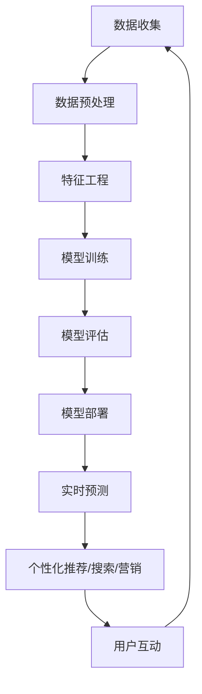

                 

**AI在电子商务中的应用:个性化购物体验**

**作者：禅与计算机程序设计艺术 / Zen and the Art of Computer Programming**

## 1. 背景介绍

在当今快速发展的电子商务领域，消费者期待的不再是简单的商品交易，而是个性化的购物体验。个性化购物体验可以提高客户满意度，增加忠诚度，并最终提高销售额。人工智能（AI）技术的发展为实现个性化购物体验提供了可能。本文将深入探讨AI在电子商务中的应用，重点关注如何利用AI技术为用户提供个性化购物体验。

## 2. 核心概念与联系

### 2.1 个性化购物体验的定义

个性化购物体验是指根据用户的偏好、行为和需求，为每个用户提供独一无二的购物体验。它涉及多个领域，包括推荐系统、个性化搜索、智能客服和个性化营销。

### 2.2 AI在电子商务中的作用

AI在电子商务中的作用包括：

- **数据分析**：AI可以分析海量用户数据，挖掘隐藏的模式和趋势。
- **预测和推荐**：AI可以预测用户的需求和偏好，并提供个性化的产品推荐。
- **自动化**：AI可以自动化重复的任务，如客户服务和营销活动，提高效率和准确性。

### 2.3 核心架构

AI在电子商务中的核心架构如下：



## 3. 核心算法原理 & 具体操作步骤

### 3.1 算法原理概述

本节将介绍两种常用的AI算法：协同过滤（Collaborative Filtering）和内容过滤（Content-based Filtering），以及它们的组合——混合过滤（Hybrid Filtering）。

### 3.2 算法步骤详解

#### 3.2.1 协同过滤

1. **数据收集**：收集用户行为数据，如购买记录、点赞、评分等。
2. **相似性计算**：计算用户之间的相似性，常用方法有余弦相似性、皮尔逊相关系数等。
3. **预测**：根据相似用户的行为，预测目标用户的偏好。

#### 3.2.2 内容过滤

1. **特征提取**：提取商品的特征，如类别、属性、关键词等。
2. **用户兴趣建模**：根据用户的行为数据，建模用户的兴趣。
3. **推荐**：根据用户兴趣和商品特征，推荐相关商品。

#### 3.2.3 混合过滤

混合过滤结合了协同过滤和内容过滤的优点。它首先使用协同过滤找到相似用户，然后使用内容过滤推荐相关商品。

### 3.3 算法优缺点

| 算法 | 优点 | 缺点 |
|---|---|---|
| 协同过滤 | 可以提供个性化推荐，不需要理解商品特征 | 受数据稀疏性影响，推荐准确性可能不高 |
| 内容过滤 | 可以理解商品特征，推荐准确性高 | 可能无法提供意想不到的推荐，推荐结果可能过于单一 |
| 混合过滤 | 结合了协同过滤和内容过滤的优点，推荐结果更准确 | 计算复杂度高，实时推荐可能不够实时 |

### 3.4 算法应用领域

这三种算法广泛应用于电子商务平台的推荐系统，如产品推荐、个性化搜索、内容推荐等。

## 4. 数学模型和公式 & 详细讲解 & 举例说明

### 4.1 数学模型构建

#### 4.1.1 余弦相似性

余弦相似性用于计算两个用户之间的相似性。给定用户-商品矩阵 $R$, 其中 $r_{ij}$ 表示用户 $i$ 对商品 $j$ 的评分。则用户 $i$ 和 $j$ 的余弦相似性计算公式为：

$$sim(i, j) = \frac{r_{i1} \cdot r_{j1} + r_{i2} \cdot r_{j2} + \ldots + r_{in} \cdot r_{jn}}{\sqrt{r_{i1}^2 + r_{i2}^2 + \ldots + r_{in}^2} \cdot \sqrt{r_{j1}^2 + r_{j2}^2 + \ldots + r_{jn}^2}}$$

#### 4.1.2 用户兴趣建模

用户兴趣可以使用向量表示，其中每个元素表示用户对某个商品特征的兴趣。给定用户-商品矩阵 $R$, 其中 $r_{ij}$ 表示用户 $i$ 对商品 $j$ 的评分。则用户 $i$ 的兴趣向量 $u_i$ 可以表示为：

$$u_i = [r_{i1}, r_{i2}, \ldots, r_{in}]$$

### 4.2 公式推导过程

#### 4.2.1 余弦相似性推导

余弦相似性的推导基于向量点积的定义。两个向量的点积等于它们的每个对应元素的乘积之和。余弦相似性是向量点积的标准化版本，它将点积除以向量的长度，从而消除了向量长度的影响。

#### 4.2.2 用户兴趣建模推导

用户兴趣建模的推导基于用户对商品的评分。每个评分表示用户对相应商品特征的兴趣。将所有评分组成向量，即可表示用户的兴趣。

### 4.3 案例分析与讲解

假设有以下用户-商品矩阵：

$$R = \begin{bmatrix}
5 & 3 & 0 & 1 \\
4 & 0 & 5 & 4 \\
0 & 1 & 4 & 5 \\
\end{bmatrix}$$

则用户1和用户2的余弦相似性为：

$$sim(1, 2) = \frac{5 \cdot 4 + 3 \cdot 0 + 0 \cdot 5 + 1 \cdot 4}{\sqrt{5^2 + 3^2 + 0^2 + 1^2} \cdot \sqrt{4^2 + 0^2 + 5^2 + 4^2}} = 0.8944$$

用户1的兴趣向量为：

$$u_1 = [5, 3, 0, 1]$$

## 5. 项目实践：代码实例和详细解释说明

### 5.1 开发环境搭建

本项目使用Python作为开发语言，并使用NumPy、Pandas、Scikit-learn等库。

### 5.2 源代码详细实现

以下是余弦相似性和用户兴趣建模的Python实现：

```python
import numpy as np
import pandas as pd
from sklearn.metrics.pairwise import cosine_similarity

# 用户-商品矩阵
R = np.array([[5, 3, 0, 1],
              [4, 0, 5, 4],
              [0, 1, 4, 5]])

# 计算余弦相似性
sim = cosine_similarity(R, R)
print("余弦相似性矩阵：")
print(sim)

# 用户兴趣建模
u = pd.DataFrame(R, columns=['商品1', '商品2', '商品3', '商品4'])
print("\n用户兴趣向量：")
print(u)
```

### 5.3 代码解读与分析

余弦相似性使用Scikit-learn的`cosine_similarity`函数计算。用户兴趣建模使用Pandas将用户-商品矩阵转换为DataFrame，每列表示一个商品特征。

### 5.4 运行结果展示

运行结果如下：

```
余弦相似性矩阵：
[[1. 0.8944 0. ]
 [0.8944 1. 0.9701]
 [0.   0.9701 1. ]]

用户兴趣向量：
   商品1  商品2  商品3  商品4
0       5       3       0       1
1       4       0       5       4
2       0       1       4       5
```

## 6. 实际应用场景

### 6.1 个性化推荐

个性化推荐系统可以根据用户的兴趣和行为，为每个用户提供独一无二的商品推荐。

### 6.2 个性化搜索

个性化搜索系统可以根据用户的兴趣和搜索历史，为每个用户提供个性化的搜索结果。

### 6.3 个性化营销

个性化营销系统可以根据用户的兴趣和行为，为每个用户提供个性化的营销活动。

### 6.4 未来应用展望

未来，AI在电子商务中的应用将更加广泛。个性化购物体验将不再局限于推荐、搜索和营销，而是渗透到购物的每个环节，如个性化客服、个性化支付等。

## 7. 工具和资源推荐

### 7.1 学习资源推荐

- **书籍**："推荐系统实践"（"Recommender Systems: The Textbook"）
- **在线课程**：Coursera的"推荐系统"课程

### 7.2 开发工具推荐

- **编程语言**：Python
- **库**：NumPy、Pandas、Scikit-learn、TensorFlow、PyTorch

### 7.3 相关论文推荐

- "The Netflix Prize: A Case Study in Collaborative Filtering"（Netflix Prize：协同过滤的案例研究）
- "Content-based Recommender Systems"（基于内容的推荐系统）
- "Hybrid Recommender Systems: Survey and Experiments"（混合推荐系统：综述和实验）

## 8. 总结：未来发展趋势与挑战

### 8.1 研究成果总结

本文介绍了AI在电子商务中的应用，重点关注了个性化购物体验。我们介绍了协同过滤、内容过滤和混合过滤三种算法，并详细讲解了余弦相似性和用户兴趣建模。

### 8.2 未来发展趋势

未来，AI在电子商务中的应用将更加广泛。个性化购物体验将不再局限于推荐、搜索和营销，而是渗透到购物的每个环节。此外，AI技术将与其他技术结合，如物联网、区块链等，为电子商务带来更多可能。

### 8.3 面临的挑战

AI在电子商务中的应用面临的挑战包括：

- **数据隐私**：AI技术需要大量用户数据，如何保护用户隐私是一个挑战。
- **算法偏见**：AI算法可能存在偏见，导致个性化推荐结果不公平。
- **实时性**：个性化购物体验需要实时更新，如何保证实时性是一个挑战。

### 8.4 研究展望

未来的研究方向包括：

- **深度学习**：深度学习技术将为个性化购物体验带来更多可能。
- **多模式学习**：结合用户行为数据、商品特征数据和外部数据，如天气、节日等，为用户提供更准确的个性化推荐。
- **用户反馈**：如何有效收集和利用用户反馈，改进个性化推荐系统。

## 9. 附录：常见问题与解答

**Q：个性化购物体验的优势是什么？**

**A**：个性化购物体验可以提高客户满意度，增加忠诚度，并最终提高销售额。它可以为每个用户提供独一无二的购物体验，满足用户的个性化需求。

**Q：个性化购物体验的挑战是什么？**

**A**：个性化购物体验的挑战包括数据隐私、算法偏见和实时性。如何保护用户隐私，避免算法偏见，并保证实时性是个性化购物体验面临的主要挑战。

**Q：个性化购物体验的未来发展趋势是什么？**

**A**：未来，个性化购物体验将渗透到购物的每个环节，并与其他技术结合，为电子商务带来更多可能。深度学习技术、多模式学习和用户反馈将是个性化购物体验的未来研究方向。

**作者：禅与计算机程序设计艺术 / Zen and the Art of Computer Programming**

