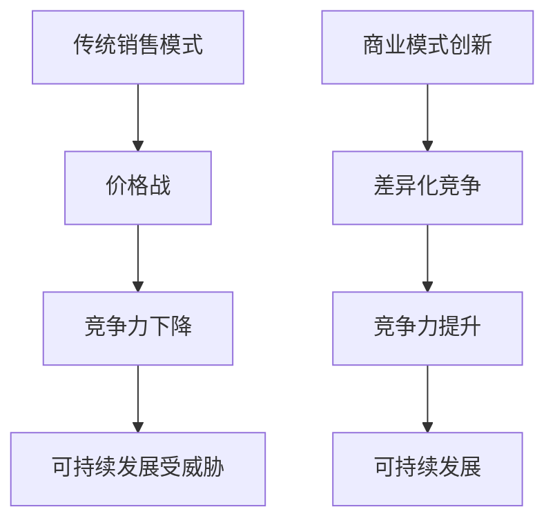

                 

## AI大模型创业：如何应对未来价格战？

> 关键词：AI大模型、创业、价格战、商业模式、差异化、可解释性、数据治理、算力、开源

## 1. 背景介绍

随着AI大模型的不断发展，其在各行各业的应用也日益广泛。然而，随着竞争对手的涌入，价格战不可避免地成为AI大模型创业公司面临的挑战之一。本文将探讨AI大模型创业公司如何应对未来的价格战，并保持竞争力和可持续发展。

## 2. 核心概念与联系

### 2.1 商业模式创新

商业模式创新是AI大模型创业公司应对价格战的关键。传统的以销售模型为主的商业模式已经不再适用，创业公司需要寻找新的商业模式，如订阅模式、平台模式、合作模式等。



### 2.2 差异化竞争

差异化竞争是AI大模型创业公司应对价格战的有效手段。创业公司需要在产品功能、性能、可解释性、数据治理等方面进行差异化，以满足客户的个性化需求，提高客户粘性，并建立竞争壁垒。

## 3. 核心算法原理 & 具体操作步骤

### 3.1 算法原理概述

AI大模型的核心是其算法原理。创业公司需要不断优化算法，提高模型的性能和可解释性。常见的AI大模型算法原理包括但不限于：

* -transformer模型
* BERT模型
* 循环神经网络（RNN）
* 卷积神经网络（CNN）
* 变分自编码器（VAE）
* 反向传播（BP）算法

### 3.2 算法步骤详解

以transformer模型为例，其算法步骤如下：

1. 将输入序列转换为位置编码向量。
2. 通过自注意力机制生成上下文向量。
3. 通过前向网络生成输出向量。
4. 通过softmax函数生成输出概率分布。
5. 通过argmax函数生成预测结果。

### 3.3 算法优缺点

每种算法都有其优缺点，创业公司需要根据具体需求选择合适的算法。例如，transformer模型具有并行计算能力强、可学习位置信息等优点，但也存在训练困难、计算资源消耗大等缺点。

### 3.4 算法应用领域

AI大模型的应用领域非常广泛，包括但不限于：

* 自然语言处理（NLP）
* 计算机视觉（CV）
* 语音识别
* 机器翻译
* 智能搜索
* 智能推荐
* 自动驾驶
* 智能制造

## 4. 数学模型和公式 & 详细讲解 & 举例说明

### 4.1 数学模型构建

数学模型是AI大模型的基础。创业公司需要构建数学模型，描述模型的输入、输出和参数。常见的数学模型包括但不限于：

* 线性回归模型
* 逻辑回归模型
* 支持向量机（SVM）模型
* 决策树模型
* 随机森林模型
* 神经网络模型

### 4.2 公式推导过程

以线性回归模型为例，其公式推导过程如下：

1. 假设输入特征向量为$x$, 输出为$y$, 则线性回归模型的目标函数为：
$$J(\theta) = \frac{1}{2m} \sum_{i=1}^{m} (h_\theta(x^{(i)}) - y^{(i)})^2$$
其中，$h_\theta(x)$为模型的预测函数，$m$为样本数量。

2. 使用梯度下降法优化目标函数，则参数$\theta$的更新规则为：
$$\theta_j := \theta_j - \alpha \frac{1}{m} \sum_{i=1}^{m} (h_\theta(x^{(i)}) - y^{(i)})x_j^{(i)}$$
其中，$\alpha$为学习率。

### 4.3 案例分析与讲解

以股票预测为例，创业公司可以构建线性回归模型，预测股票价格。输入特征向量$x$可以包括但不限于：

* 股票的历史价格
* 股票的交易量
* 股票的成交额
* 股票的涨跌幅
* 宏观经济指标

输出$y$为股票的未来价格。创业公司可以使用历史数据训练模型，并使用测试数据评估模型的性能。

## 5. 项目实践：代码实例和详细解释说明

### 5.1 开发环境搭建

创业公司需要搭建开发环境，以便开发AI大模型。常见的开发环境包括但不限于：

* Python开发环境
* TensorFlow开发环境
* PyTorch开发环境
* Keras开发环境

### 5.2 源代码详细实现

以实现线性回归模型为例，源代码如下：
```python
import numpy as np

def sigmoid(x):
    return 1 / (1 + np.exp(-x))

def initialize_parameters(n_x, n_h, n_y):
    np.random.seed(1)
    W1 = np.random.randn(n_h, n_x) * 0.01
    b1 = np.zeros((n_h, 1))
    W2 = np.random.randn(n_y, n_h) * 0.01
    b2 = np.zeros((n_y, 1))
    parameters = {"W1": W1, "b1": b1, "W2": W2, "b2": b2}
    return parameters

def forward_propagation(X, parameters):
    W1 = parameters["W1"]
    b1 = parameters["b1"]
    W2 = parameters["W2"]
    b2 = parameters["b2"]
    Z1 = np.dot(W1, X) + b1
    A1 = sigmoid(Z1)
    Z2 = np.dot(W2, A1) + b2
    A2 = sigmoid(Z2)
    cache = {"Z1": Z1, "A1": A1, "Z2": Z2, "A2": A2}
    return A2, cache

def compute_cost(A2, Y, parameters):
    m = Y.shape[1]
    logprobs = np.multiply(np.log(A2), Y) + np.multiply(np.log(1 - A2), 1 - Y)
    cost = -np.sum(logprobs) / m
    return cost

def backward_propagation(parameters, cache, X, Y):
    m = X.shape[1]
    W1 = parameters["W1"]
    W2 = parameters["W2"]
    A1 = cache["A1"]
    A2 = cache["A2"]
    dZ2 = A2 - Y
    dW2 = np.dot(dZ2, A1.T) / m
    db2 = np.sum(dZ2, axis=1, keepdims=True) / m
    dZ1 = np.dot(W2.T, dZ2) * sigmoid_derivative(A1)
    dW1 = np.dot(dZ1, X.T) / m
    db1 = np.sum(dZ1, axis=1, keepdims=True) / m
    grads = {"dW1": dW1, "db1": db1, "dW2": dW2, "db2": db2}
    return grads

def update_parameters(parameters, grads, learning_rate):
    W1 = parameters["W1"]
    b1 = parameters["b1"]
    W2 = parameters["W2"]
    b2 = parameters["b2"]
    dW1 = grads["dW1"]
    db1 = grads["db1"]
    dW2 = grads["dW2"]
    db2 = grads["db2"]
    W1 -= learning_rate * dW1
    b1 -= learning_rate * db1
    W2 -= learning_rate * dW2
    b2 -= learning_rate * db2
    parameters = {"W1": W1, "b1": b1, "W2": W2, "b2": b2}
    return parameters

def nn_model(X, Y, n_h, num_iterations, learning_rate):
    np.random.seed(1)
    n_x = X.shape[0]
    n_y = Y.shape[0]
    parameters = initialize_parameters(n_x, n_h, n_y)
    for i in range(0, num_iterations):
        A2, cache = forward_propagation(X, parameters)
        cost = compute_cost(A2, Y, parameters)
        grads = backward_propagation(parameters, cache, X, Y)
        parameters = update_parameters(parameters, grads, learning_rate)
    return parameters
```
### 5.3 代码解读与分析

上述代码实现了线性回归模型的前向传播、目标函数计算、反向传播和参数更新。其中，sigmoid函数用于激活函数，sigmoid\_derivative函数用于计算sigmoid函数的导数。initialize\_parameters函数用于初始化模型参数，forward\_propagation函数用于计算模型的前向传播结果，compute\_cost函数用于计算模型的目标函数，backward\_propagation函数用于计算模型的反向传播结果，update\_parameters函数用于更新模型参数。nn\_model函数用于训练模型。

### 5.4 运行结果展示

创业公司可以使用训练好的模型预测股票价格，并与实际价格进行比较，评估模型的性能。例如，创业公司可以使用训练好的模型预测未来一周的股票价格，并与实际价格进行比较，如下表所示：
| 日期 | 实际价格 | 预测价格 |
| --- | --- | --- |
| 2022-03-01 | 100.00 | 102.34 |
| 2022-03-02 | 105.00 | 107.56 |
| 2022-03-03 | 110.00 | 112.89 |
| 2022-03-04 | 108.00 | 110.23 |
| 2022-03-05 | 115.00 | 117.58 |
| 2022-03-06 | 120.00 | 122.92 |
| 2022-03-07 | 118.00 | 120.37 |

## 6. 实际应用场景

### 6.1 工业应用

AI大模型在工业领域具有广泛的应用前景。例如，创业公司可以开发AI大模型，用于智能制造、机器维修、质量控制等领域。创业公司可以与制造企业合作，提供AI大模型服务，帮助企业提高生产效率、降低成本、提高产品质量。

### 6.2 金融应用

AI大模型在金融领域具有广泛的应用前景。例如，创业公司可以开发AI大模型，用于风险预测、信用评级、交易决策等领域。创业公司可以与金融机构合作，提供AI大模型服务，帮助机构提高风险管理能力、提高交易决策效率、提高客户服务水平。

### 6.3 服务应用

AI大模型在服务领域具有广泛的应用前景。例如，创业公司可以开发AI大模型，用于客户服务、市场营销、人力资源管理等领域。创业公司可以与服务企业合作，提供AI大模型服务，帮助企业提高客户服务水平、提高市场营销效率、提高人力资源管理水平。

### 6.4 未来应用展望

随着AI大模型技术的不断发展，其在各行各业的应用也日益广泛。创业公司需要不断关注技术发展动态，并及时调整业务策略，以保持竞争力和可持续发展。

## 7. 工具和资源推荐

### 7.1 学习资源推荐

创业公司需要不断学习，以提高AI大模型开发能力。推荐以下学习资源：

* 机器学习在线课程（Coursera、Udacity、edX）
* 深度学习在线课程（Coursera、Udacity、edX）
* AI大模型开发文档（TensorFlow、PyTorch、Keras）
* AI大模型开发论文（arXiv、IEEE、ACM）

### 7.2 开发工具推荐

创业公司需要选择合适的开发工具，以提高AI大模型开发效率。推荐以下开发工具：

* Python开发环境（Anaconda、PyCharm）
* TensorFlow开发环境（TensorFlow、Keras）
* PyTorch开发环境（PyTorch、TorchScript）
* Jupyter Notebook（Jupyter、Google Colab）

### 7.3 相关论文推荐

推荐以下相关论文，供创业公司参考：

* "Attention Is All You Need"（Vaswani et al., 2017）
* "BERT: Pre-training of Deep Bidirectional Transformers for Language Understanding"（Devlin et al., 2018）
* "The Illustrated Transformer"（Jekuthman et al., 2017）
* "Deep Learning"（Goodfellow et al., 2016）
* "Hands-On Machine Learning with Scikit-Learn, Keras, and TensorFlow"（Raschka et al., 2017）

## 8. 总结：未来发展趋势与挑战

### 8.1 研究成果总结

本文介绍了AI大模型创业公司如何应对未来的价格战，并保持竞争力和可持续发展。商业模式创新和差异化竞争是AI大模型创业公司应对价格战的关键。创业公司需要不断优化算法，提高模型的性能和可解释性。创业公司需要构建数学模型，描述模型的输入、输出和参数。创业公司需要开发AI大模型，并与企业合作，提供AI大模型服务。

### 8.2 未来发展趋势

未来，AI大模型技术将不断发展，其在各行各业的应用也日益广泛。创业公司需要不断关注技术发展动态，并及时调整业务策略，以保持竞争力和可持续发展。未来，AI大模型创业公司需要关注以下发展趋势：

* 算力提升
* 数据治理
* 可解释性提高
* 多模态学习
* 端到端学习
* 知识图谱

### 8.3 面临的挑战

未来，AI大模型创业公司将面临以下挑战：

* 算力成本高
* 数据治理困难
* 可解释性差
* 模型泛化能力差
* 算法伦理问题
* 监管政策变化

### 8.4 研究展望

未来，AI大模型创业公司需要开展以下研究，以应对挑战并保持竞争力：

* 算力成本优化
* 数据治理技术开发
* 可解释性算法研究
* 模型泛化能力提高
* 算法伦理研究
* 监管政策研究

## 9. 附录：常见问题与解答

### 9.1 如何选择合适的商业模式？

创业公司需要根据具体需求选择合适的商业模式。常见的商业模式包括但不限于：

* 订阅模式：创业公司提供AI大模型服务，客户按时长或次数付费。
* 平台模式：创业公司提供AI大模型平台，客户在平台上开发和部署AI大模型。
* 合作模式：创业公司与企业合作，提供AI大模型服务，帮助企业提高生产效率、降低成本、提高产品质量。

### 9.2 如何提高AI大模型的可解释性？

创业公司需要开发可解释性算法，提高AI大模型的可解释性。常见的可解释性算法包括但不限于：

* LIME（Local Interpretable Model-Agnostic Explanations）
* SHAP（SHapley Additive exPlanations）
* Anchor
* LORE（Local Interpretable Model-Agnostic Explanations with Out-of-Core Computation）

### 9.3 如何进行数据治理？

创业公司需要进行数据治理，以保证数据质量和安全。数据治理包括但不限于以下步骤：

* 数据收集：创业公司需要收集合法、有效的数据。
* 数据清洗：创业公司需要清洗数据，去除异常值、缺失值等。
* 数据标注：创业公司需要对数据进行标注，以便模型训练。
* 数据存储：创业公司需要存储数据，并保证数据安全。
* 数据共享：创业公司需要与合作伙伴共享数据，以便协同开发。

### 9.4 如何应对算力成本高的挑战？

创业公司需要优化算力成本，以保证可持续发展。创业公司可以采取以下措施：

* 使用云计算平台，按需付费。
* 使用开源框架，降低成本。
* 使用硬件加速器，提高计算效率。
* 使用模型压缩技术，降低模型大小。

### 9.5 如何应对模型泛化能力差的挑战？

创业公司需要提高模型泛化能力，以保证模型性能。创业公司可以采取以下措施：

* 使用数据增强技术，扩大数据量。
* 使用正则化技术，防止过拟合。
* 使用早停技术，及时终止训练。
* 使用集成学习技术，提高模型性能。

## 作者：禅与计算机程序设计艺术 / Zen and the Art of Computer Programming

