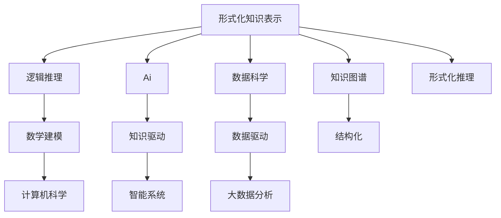

                 

# 知识的形式化：数学语言与逻辑表达

> 关键词：形式化知识表示、逻辑推理、数学建模、计算机科学、人工智能、数据科学、知识图谱、符号计算、模糊逻辑、逻辑形式化

## 1. 背景介绍

### 1.1 问题由来
在人类历史长河中，知识是人类文明进步的重要推动力。知识的传承和创新，不仅推动了科技的发展，也深刻影响了社会的进步。然而，知识的积累和传播依赖于人类语言，这种表达方式具有很强的模糊性和主观性，使得知识的传承和创新变得困难且效率低下。

### 1.2 问题核心关键点
为了解决这一问题，人们提出了知识的形式化方法，即通过抽象、符号化和逻辑表达，将人类语言中的知识提炼为结构化的形式化表达。这种形式化表达不仅具有精确性和客观性，而且可以支持计算机自动处理和推理，从而极大地提升了知识的存储、传播和应用效率。

### 1.3 问题研究意义
知识的形式化研究具有深远的理论和实践意义：

1. **精确性与客观性**：形式化表达能够精确地描述知识，避免了语言表达中的模糊性和主观性，使得知识的传播和应用更加可靠。
2. **可计算性**：形式化知识可以用于计算机自动处理和推理，极大提升了知识的处理效率。
3. **通用性**：形式化知识具有普遍适用性，可以应用于各种领域，如科学、工程、商业等，推动跨学科的融合和创新。
4. **人工智能**：形式化知识是人工智能和机器学习的重要基础，推动了知识驱动的智能系统的发展。
5. **数据科学**：形式化知识为数据科学提供了结构化的知识基础，提升了数据挖掘和分析的深度和广度。

## 2. 核心概念与联系

### 2.1 核心概念概述

在知识的形式化过程中，涉及多个关键概念：

- **形式化知识表示**：将人类语言中的知识提炼为结构化的符号表达式，使得知识可以被计算机理解和处理。
- **逻辑推理**：通过符号化表达和推理规则，对知识进行自动推理和推理验证。
- **数学建模**：将现实问题抽象为数学模型，通过数学工具和计算方法进行分析和求解。
- **计算机科学**：形式化知识的研究依赖于计算机科学的方法和技术，如编程语言、算法、数据结构等。
- **人工智能**：形式化知识为人工智能提供了知识基础，支持机器学习和知识推理。
- **数据科学**：形式化知识为数据科学提供了结构化的知识基础，支持数据挖掘、知识发现和数据建模。
- **知识图谱**：一种结构化的知识表示形式，通过节点和边结构化表达实体和关系。

这些核心概念之间的联系可以通过以下Mermaid流程图来展示：



这个流程图展示了几大核心概念之间的联系：

1. 形式化知识表示是逻辑推理、数学建模、计算机科学、人工智能、数据科学、知识图谱的基础。
2. 逻辑推理和数学建模是形式化知识表示的核心工具。
3. 计算机科学为形式化知识表示提供了实现手段。
4. 人工智能和数据科学分别从知识驱动和数据驱动的角度，应用形式化知识表示。
5. 知识图谱是形式化知识表示的一种具体实现形式。

## 3. 核心算法原理 & 具体操作步骤

### 3.1 算法原理概述

形式化知识表示的核心算法包括符号化、逻辑表达和推理验证。这些算法通过将知识表示为符号表达式，并通过逻辑规则进行推理，从而实现知识的形式化。

- **符号化**：将人类语言中的知识抽象为符号表达式，如谓词、个体、公理等。
- **逻辑表达**：通过逻辑规则，将符号表达式组合为逻辑表达式，如合取、析取、条件等。
- **推理验证**：通过逻辑推理规则，对逻辑表达式进行自动推理和验证，从而得出结论。

### 3.2 算法步骤详解

1. **知识抽取与符号化**：
   - 从文本、数据库、专家知识等来源中抽取知识，如实体、属性、关系等。
   - 将抽取的知识符号化为符号表达式，如使用谓词表示实体属性，使用关系表示实体间的联系。

2. **逻辑表达**：
   - 将符号表达式组合为逻辑表达式，如合取、析取、条件、全称量词、存在量词等。
   - 构建知识库，将逻辑表达式存储为知识库中的规则和事实。

3. **推理验证**：
   - 根据逻辑规则，对逻辑表达式进行推理，得出结论。
   - 验证推理结论的正确性，确保推理过程的正确性和可信赖性。

### 3.3 算法优缺点

形式化知识表示和推理具有以下优点：

1. **精确性与客观性**：形式化表达避免了语言表达中的模糊性和主观性，使得知识的表示和推理更加精确。
2. **通用性与普适性**：形式化表达可以应用于各种领域，如科学、工程、商业等。
3. **可计算性**：形式化推理可以用于计算机自动处理和推理，提升知识处理效率。

同时，形式化知识表示和推理也存在以下缺点：

1. **复杂性**：形式化表达和推理需要较高的数学和逻辑基础，对用户要求较高。
2. **灵活性不足**：形式化表达过于抽象，难以适应复杂多变的环境。
3. **可读性差**：形式化表达难以直观理解，需要专业知识和技能。

### 3.4 算法应用领域

形式化知识表示和推理在多个领域得到了广泛应用：

1. **人工智能**：形式化知识是知识驱动智能系统的基础，如专家系统、知识推理系统等。
2. **计算机科学**：形式化知识为编程语言、算法、数据结构等提供了基础。
3. **数据科学**：形式化知识为数据挖掘、知识发现、数据建模提供了结构化的知识基础。
4. **科学工程**：形式化知识为科学研究和工程设计提供了结构化的知识表达。
5. **商业管理**：形式化知识为商业决策、管理优化提供了结构化的知识基础。

## 4. 数学模型和公式 & 详细讲解 & 举例说明

### 4.1 数学模型构建

形式化知识表示和推理的核心数学模型包括谓词逻辑模型、命题逻辑模型和谓词演算模型。这些模型通过逻辑规则和推理算法，对知识进行形式化表示和推理。

### 4.2 公式推导过程

以谓词逻辑模型为例，我们以日常生活中的“购物”场景进行形式化描述：

1. **个体和谓词**：定义个体和谓词，如$P(x)$表示$x$在购物。
2. **合取和析取**：使用合取和析取逻辑，如$A(x)$表示$x$在超市购物，$B(x)$表示$x$在书店购物。
3. **条件与量词**：使用条件语句和量词，如$C(x)$表示$x$购买了商品，$\forall$表示对所有个体成立。

形式化表示为：

$$
P(x) \equiv A(x) \lor B(x)
$$

$$
C(x) \equiv \forall y [(P(x) \land y \in \text{购买商品}) \rightarrow (A(y) \lor B(y))]
$$

### 4.3 案例分析与讲解

我们以银行贷款审批系统为例，展示形式化知识表示和推理的应用。

1. **知识抽取与符号化**：
   - 从银行数据库中抽取个人信息、财务记录等数据，将其符号化为个体和谓词。
   - 将审批规则符号化为逻辑表达式，如$L(x)$表示$x$的贷款申请被审批。

2. **逻辑表达**：
   - 将审批规则组合为逻辑表达式，如$L(x) \equiv C(x) \land D(x)$，其中$C(x)$表示$x$的财务状况满足要求，$D(x)$表示$x$的信用记录良好。

3. **推理验证**：
   - 根据逻辑规则，对逻辑表达式进行推理，验证贷款审批的规则是否正确。
   - 验证推理过程是否满足所有已知的条件，确保审批过程的正确性。

## 5. 项目实践：代码实例和详细解释说明

### 5.1 开发环境搭建

在进行知识表示和推理的实践时，我们需要使用Python、Prolog等工具。以下是Python开发环境的搭建步骤：

1. **安装Python**：
   - 从官网下载并安装Python 3.x版本，建议安装Anaconda。
   - 创建虚拟环境，并激活虚拟环境：

     ```bash
     conda create -n prolog-env python=3.8 
     conda activate prolog-env
     ```

2. **安装Prolog**：
   - 使用Anaconda安装Prolog库，如`prolog`、`clpfd`等：

     ```bash
     conda install prolog clpfd
     ```

3. **安装必要的库**：
   - 安装`pyprolog`库，支持Python和Prolog交互：

     ```bash
     pip install pyprolog
     ```

### 5.2 源代码详细实现

以下是使用Python和Prolog进行形式化知识推理的代码实现，以银行贷款审批为例：

1. **定义谓词和个体**：

   ```python
   import pyprolog

   P = pyprolog.Name('P', 'individual')
   A = pyprolog.Name('A', 'individual')
   B = pyprolog.Name('B', 'individual')
   C = pyprolog.Name('C', 'individual')
   D = pyprolog.Name('D', 'individual')
   ```

2. **定义规则和逻辑表达式**：

   ```python
   pyprolog.add('P(X) :- A(X).')
   pyprolog.add('P(X) :- B(X).')
   pyprolog.add('C(X) :- P(X), Y in buys, A(Y).')
   pyprolog.add('C(X) :- P(X), Y in buys, B(Y).')
   pyprolog.add('L(X) :- C(X), D(X).')
   ```

3. **执行推理和验证**：

   ```python
   pyprolog.run('?- X in people, L(X).')
   ```

### 5.3 代码解读与分析

通过上述代码，我们可以看到：

- **定义谓词和个体**：使用`pyprolog.Name`定义了不同类型的个体和谓词，为知识表示提供了基础。
- **定义规则和逻辑表达式**：使用`pyprolog.add`定义了规则和逻辑表达式，支持知识推理。
- **执行推理和验证**：使用`pyprolog.run`执行推理，验证规则的正确性。

## 6. 实际应用场景

### 6.1 智能问答系统

智能问答系统通过形式化知识表示和推理，可以快速回答用户的问题，支持多轮对话和复杂的推理逻辑。

1. **知识抽取与符号化**：
   - 从问答库中抽取问题和答案，将其符号化为知识库中的事实。
   - 将推理规则符号化为逻辑表达式，如$Q(x)$表示$x$的问题已知答案。

2. **逻辑表达**：
   - 将推理规则组合为逻辑表达式，如$Q(x) \equiv A(x) \lor B(x)$，其中$A(x)$表示$x$的问题有明确的答案，$B(x)$表示$x$的问题需要进一步推理。

3. **推理验证**：
   - 根据逻辑规则，对逻辑表达式进行推理，得出结论。
   - 验证推理结论的正确性，确保问答系统的准确性。

### 6.2 专家系统

专家系统通过形式化知识表示和推理，提供专家级别的决策支持，广泛应用于医疗、金融、制造等领域。

1. **知识抽取与符号化**：
   - 从专家知识库中抽取知识和规则，将其符号化为知识库中的事实和规则。
   - 将专家经验符号化为逻辑表达式，如$E(x)$表示$x$的诊断结果。

2. **逻辑表达**：
   - 将专家经验组合为逻辑表达式，如$E(x) \equiv C(x) \lor D(x)$，其中$C(x)$表示$x$的诊断结果符合标准，$D(x)$表示$x$的诊断结果需要进一步验证。

3. **推理验证**：
   - 根据逻辑规则，对逻辑表达式进行推理，得出结论。
   - 验证推理结论的正确性，确保诊断结果的准确性。

### 6.3 知识图谱

知识图谱通过形式化知识表示和推理，构建结构化的知识网络，广泛应用于信息检索、推荐系统等领域。

1. **知识抽取与符号化**：
   - 从语料库中抽取实体和关系，将其符号化为知识库中的节点和边。
   - 将实体和关系符号化为个体和谓词，如$E(x)$表示$x$的实体，$R(x,y)$表示$x$与$y$的关系。

2. **逻辑表达**：
   - 将实体和关系组合为逻辑表达式，如$R(x,y) \equiv A(x,y) \lor B(x,y)$，其中$A(x,y)$表示$x$与$y$的关系符合标准，$B(x,y)$表示$x$与$y$的关系需要进一步验证。

3. **推理验证**：
   - 根据逻辑规则，对逻辑表达式进行推理，得出结论。
   - 验证推理结论的正确性，确保知识图谱的准确性。

## 7. 工具和资源推荐

### 7.1 学习资源推荐

为了帮助开发者系统掌握形式化知识表示和推理的理论基础和实践技巧，这里推荐一些优质的学习资源：

1. **《逻辑基础》**：
   - 由John Corcoran编写，介绍了形式逻辑的基本概念和推理规则。

2. **《知识与推理》**：
   - 由Richard M. Shiffrin编写，介绍了知识表示和推理的基本方法。

3. **《Prolog程序设计》**：
   - 由Russell Brewer编写，介绍了Prolog的基本语法和编程技巧。

4. **《形式化方法》**：
   - 由Joel B. Feinberg编写，介绍了形式化方法的基本概念和应用。

5. **《知识表示与推理》**：
   - 由Robin Leigh、Marjorie McKeown、Alan Mitchell编写，介绍了知识表示和推理的基本方法。

通过对这些资源的学习实践，相信你一定能够快速掌握形式化知识表示和推理的精髓，并用于解决实际的NLP问题。

### 7.2 开发工具推荐

为了实现形式化知识表示和推理，以下是几款常用的开发工具：

1. **Python**：
   - 使用Python和Prolog进行知识表示和推理，支持符号化表达和逻辑推理。
   - 支持多线程和分布式计算，适合大规模知识处理。

2. **Prolog**：
   - 使用Prolog进行知识表示和推理，支持逻辑表达和推理验证。
   - 支持多变量求解和约束求解，适合复杂逻辑问题的解决。

3. **Wolfram Alpha**：
   - 使用Wolfram Alpha进行符号计算和知识推理，支持数学表达和推理验证。
   - 支持多种数学工具和计算方法，适合科学研究和数据分析。

4. **Mathematica**：
   - 使用Mathematica进行符号计算和知识推理，支持数学表达和推理验证。
   - 支持多种数学工具和计算方法，适合科学研究和数据分析。

5. **Maple**：
   - 使用Maple进行符号计算和知识推理，支持数学表达和推理验证。
   - 支持多种数学工具和计算方法，适合科学研究和数据分析。

合理利用这些工具，可以显著提升知识表示和推理任务的开发效率，加快创新迭代的步伐。

### 7.3 相关论文推荐

形式化知识表示和推理的研究经历了长期的探索和发展，以下是几篇奠基性的相关论文，推荐阅读：

1. **《谓词逻辑基础》**：
   - Alfred North Whitehead、Bertrand Russell编写，介绍了谓词逻辑的基本概念和推理规则。

2. **《逻辑与计算》**：
   - Alan Sokal、RICO editors编写，介绍了形式逻辑的基本概念和推理规则。

3. **《知识表示与推理》**：
   - Ray V. P. Lauwerens、Yves Marengo编写，介绍了知识表示和推理的基本方法。

4. **《逻辑与认知》**：
   - Noam Chomsky编写，介绍了逻辑推理在认知科学中的应用。

5. **《知识图谱的构建与应用》**：
   - J. D. Ullman编写，介绍了知识图谱的构建和应用方法。

这些论文代表了大语言模型微调技术的发展脉络。通过学习这些前沿成果，可以帮助研究者把握学科前进方向，激发更多的创新灵感。

## 8. 总结：未来发展趋势与挑战

### 8.1 研究成果总结

形式化知识表示和推理的研究已经取得了诸多重要成果，但仍然面临许多挑战：

1. **复杂性与灵活性**：形式化表达过于复杂，难以适应复杂多变的环境。
2. **可读性与可理解性**：形式化表达难以直观理解，需要专业知识和技能。
3. **可扩展性与可维护性**：形式化表达难以扩展和维护，需要持续更新和优化。

### 8.2 未来发展趋势

展望未来，形式化知识表示和推理将呈现以下几个发展趋势：

1. **智能化与自动化**：形式化推理将更多地依赖于智能算法和自动化工具，提升推理的效率和准确性。
2. **跨领域应用**：形式化知识表示将更多地应用于跨领域场景，提升跨学科融合的能力。
3. **实时性与动态性**：形式化推理将更多地支持实时推理和动态调整，提升知识处理的时效性。
4. **可扩展性与可维护性**：形式化表达将更加灵活和可扩展，提升知识系统的维护性。

### 8.3 面临的挑战

尽管形式化知识表示和推理已经取得了重要进展，但在应用过程中仍面临许多挑战：

1. **数据与知识获取**：形式化表达需要大量高质量的数据和知识，获取和维护成本较高。
2. **知识融合与融合**：形式化知识表示需要支持多种知识源的融合，提升知识的整合能力。
3. **推理与验证**：形式化推理需要高效的推理验证方法，提升推理过程的准确性和可信赖性。

### 8.4 研究展望

面对形式化知识表示和推理所面临的挑战，未来的研究需要在以下几个方面寻求新的突破：

1. **知识获取与融合**：开发更多高效的知识获取和融合方法，支持大规模知识处理。
2. **推理与验证**：研究高效的推理验证方法，提升推理过程的准确性和可信赖性。
3. **智能化与自动化**：开发更多智能算法和自动化工具，提升推理的效率和准确性。
4. **跨领域应用**：探索形式化知识表示在跨领域场景中的应用，提升跨学科融合的能力。

这些研究方向的探索，必将引领形式化知识表示和推理技术迈向更高的台阶，为构建智能系统提供更加坚实的基础。

## 9. 附录：常见问题与解答

**Q1：如何提高形式化推理的效率？**

A: 形式化推理的效率取决于推理引擎的设计和优化。以下是一些提升推理效率的方法：

1. **优化推理算法**：选择高效的推理算法，如DPLL、SAT、SMT等。
2. **优化数据结构**：使用合适的数据结构，如Bitvector、SMT、Z3等，提升推理效率。
3. **并行与分布式计算**：使用多线程、分布式计算等技术，提升推理效率。

**Q2：如何确保形式化推理的正确性？**

A: 形式化推理的正确性依赖于推理规则和知识库的准确性。以下是一些确保推理正确性的方法：

1. **验证推理规则**：确保推理规则的正确性和完整性。
2. **验证知识库**：确保知识库中的事实和规则正确无误。
3. **手动验证**：在关键场景下，进行手动验证和调试，确保推理过程的正确性。

**Q3：如何选择适合的形式化表达方式？**

A: 形式化表达方式的选择应根据具体应用场景和需求确定。以下是一些选择方法：

1. **谓词逻辑**：适用于符号表达和推理，适合知识表示和推理。
2. **命题逻辑**：适用于简单的逻辑表达式和推理，适合数学建模和数据分析。
3. **谓词演算**：适用于复杂的逻辑表达式和推理，适合高级数学建模和推理验证。

**Q4：如何使用形式化知识表示和推理？**

A: 形式化知识表示和推理可以应用于多个领域，如科学、工程、商业等。以下是一些具体应用方法：

1. **智能问答系统**：通过形式化知识表示和推理，快速回答用户的问题。
2. **专家系统**：通过形式化知识表示和推理，提供专家级别的决策支持。
3. **知识图谱**：通过形式化知识表示和推理，构建结构化的知识网络。
4. **数据挖掘与分析**：通过形式化知识表示和推理，提升数据挖掘和分析的深度和广度。

总之，形式化知识表示和推理具有广泛的应用前景，开发者可以根据具体需求选择合适的表达方式，并结合实际场景进行优化和改进。

---

作者：禅与计算机程序设计艺术 / Zen and the Art of Computer Programming

