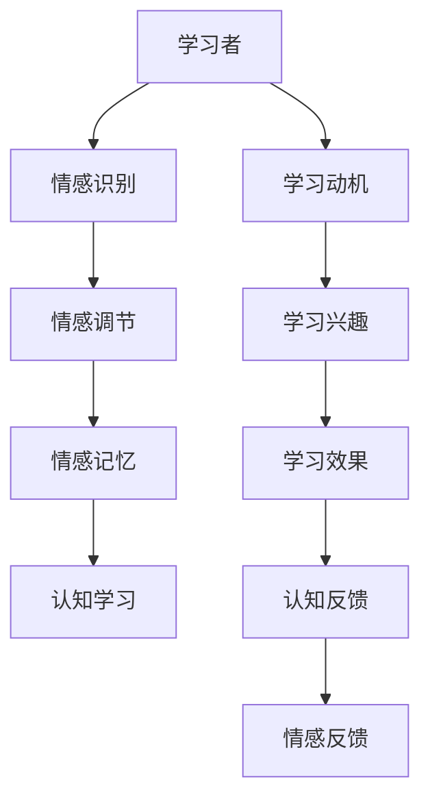

                 

## 1. 背景介绍

在当今社会，情感智能（Emotional Intelligence, EI）的概念逐渐进入公众视野，并逐渐被视作决定个体成功与幸福的重要因素。情感智能不仅仅是情商（Emotional Quotient）的描述，更是对个体识别、理解、表达、管理及应用情绪的能力的全面认识。而情感智能的实际应用，正逐渐从心理学领域向各个学科和行业渗透，尤其是在人工智能领域，情感智能被认为可以提升机器学习模型的表现，使之更加人性化、智能化的同时，也能够更好地适应现实世界中的复杂多变性。

### 1.1 情感智能的重要性

在教育、医疗、商业、政府等各个领域，情感智能的应用不仅能提升服务质量，还能改善用户体验。例如，在教育中，情感智能被用于识别学生的情绪变化，从而调整教学方式，提升教学效果。在医疗领域，情感智能能辅助医生更好地理解患者情绪，提升诊断和治疗效果。而在商业领域，情感智能可以帮助企业更好地理解和预测客户需求，提升营销效果。

### 1.2 学习与情感智能的结合

学习是一个复杂的过程，涉及认知、情感和行为等多维度的相互作用。情感在学习的各个阶段都有其独特的作用，如激发学习动机、提升学习兴趣、增强记忆效果等。因此，情感智能在学习中的作用不仅体现在对学习者的情感识别和理解上，还体现在对学习过程的情感调节和优化上。

## 2. 核心概念与联系

### 2.1 核心概念概述

- **情感智能**：指个体识别、理解、表达、管理及应用情绪的能力。情感智能的五大组成部分包括自我认知、自我管理、社交意识、社交管理和关系管理。
- **学习**：是一个涉及知识获取、技能掌握、态度改变和行为修正的过程。通常分为认知学习和情感学习两种形式。
- **情感学习**：即在学习过程中，情感与认知相互影响、相互作用的过程，包括情感理解、情感调节、情感表达和情感记忆等环节。
- **情感智能在学习中的应用**：通过识别和理解学习者的情感状态，采用适当的情感调节策略，提升学习效果。
- **学习过程**：包括知识获取、技能掌握、态度改变和行为修正等环节，情感智能在学习各个环节中都能发挥作用。

### 2.2 核心概念联系

情感智能与学习过程的联系主要体现在以下三个方面：

1. **情感识别**：识别学习者的情绪状态，从而调整教学策略和内容，使之更符合学习者的情感需求。
2. **情感调节**：通过情感调节技术，如积极反馈、情感支持、认知重构等，改善学习者的情绪状态，提升学习动力和效果。
3. **情感记忆**：情感记忆在学习过程中起到关键作用，良好的情绪体验能够增强记忆效果，提升学习效率。

以下是一个简化的Mermaid流程图，展示了情感智能与学习过程的联系：



## 3. 核心算法原理 & 具体操作步骤

### 3.1 算法原理概述

情感智能在学习中的应用，主要通过以下几个关键算法实现：

1. **情感识别算法**：用于识别学习者的情绪状态，通常采用自然语言处理（NLP）技术，如情感分析、表情识别等。
2. **情感调节算法**：用于调整学习者的情绪状态，通常采用情感支持、认知重构等技术。
3. **情感记忆算法**：用于增强学习者的情绪记忆，通常采用正强化、记忆技巧等方法。

### 3.2 算法步骤详解

#### 情感识别算法

**步骤1**：收集学习者的情感数据，如面部表情、语调、文字表达等。

**步骤2**：通过自然语言处理技术，如情感分析算法，对学习者的情感状态进行识别和分类。

**步骤3**：根据情感分类结果，调整教学策略和内容，使之更符合学习者的情感需求。

#### 情感调节算法

**步骤1**：通过情感支持技术，如积极反馈、情感共情等，改善学习者的情绪状态。

**步骤2**：采用认知重构技术，帮助学习者调整负向情绪，提升情绪稳定性。

**步骤3**：监测学习者的情绪变化，及时调整情感调节策略。

#### 情感记忆算法

**步骤1**：通过正强化技术，如奖励机制、积极反馈等，增强学习者的积极情绪体验。

**步骤2**：采用记忆技巧，如间隔复习、联想记忆等，帮助学习者增强情绪记忆。

**步骤3**：监测学习者的情绪记忆效果，及时调整记忆策略。

### 3.3 算法优缺点

#### 情感识别算法的优缺点

**优点**：
1. **高效性**：通过自然语言处理技术，快速识别学习者的情绪状态，节省时间和成本。
2. **适应性强**：能够适应不同情感表达方式，如文字、语音、面部表情等。

**缺点**：
1. **准确性有限**：情感识别算法通常基于已有的情绪分类体系，对复杂情绪识别准确性有限。
2. **依赖环境**：情感识别算法依赖于良好的数据收集和处理环境，对数据质量要求较高。

#### 情感调节算法的优缺点

**优点**：
1. **针对性**：能够根据学习者的情感状态，采用有针对性的情感调节策略，提升情绪调节效果。
2. **灵活性**：可以灵活调整情感调节策略，适应不同学习者的需求。

**缺点**：
1. **依赖资源**：情感调节算法通常需要较多的计算资源和数据资源，对硬件和软件要求较高。
2. **效果难以量化**：情感调节效果通常难以量化，难以进行精确评估。

#### 情感记忆算法的优缺点

**优点**：
1. **提升学习效果**：通过增强积极情绪记忆，提升学习效果和记忆效果。
2. **操作简单**：操作简单易行，易于实施。

**缺点**：
1. **依赖个体差异**：情感记忆效果依赖于个体差异，不同学习者对正强化的反应可能不同。
2. **易于遗忘**：情感记忆可能随时间流逝逐渐减弱，需要定期复习和强化。

### 3.4 算法应用领域

情感智能在学习中的应用领域非常广泛，涵盖教育、医疗、商业等多个领域。以下列举几个典型应用场景：

- **教育**：通过情感识别算法，识别学生的情绪变化，及时调整教学策略。通过情感调节算法，增强学生的学习动机和兴趣。通过情感记忆算法，提升学生的记忆效果。
- **医疗**：通过情感识别算法，识别患者的情绪状态，及时调整治疗方案。通过情感调节算法，提升患者的治疗效果。通过情感记忆算法，增强患者的积极情绪体验。
- **商业**：通过情感识别算法，识别客户的情绪变化，调整营销策略。通过情感调节算法，提升客户满意度和忠诚度。通过情感记忆算法，增强客户的积极情绪体验，提升品牌忠诚度。

## 4. 数学模型和公式 & 详细讲解 & 举例说明

### 4.1 数学模型构建

情感智能在学习中的应用，主要涉及情感识别、情感调节和情感记忆三个环节。以下分别介绍这三个环节的数学模型构建。

#### 情感识别模型

情感识别模型通常采用机器学习或深度学习技术，对学习者的情感数据进行分类。常用的情感分类模型包括情感分析模型、表情识别模型等。

情感分析模型：
$$
y = f(x; \theta)
$$
其中 $x$ 为学习者的情感数据，$y$ 为情感分类结果，$\theta$ 为模型参数。

表情识别模型：
$$
y = f(x; \theta) + \epsilon
$$
其中 $x$ 为学习者的面部表情数据，$y$ 为表情分类结果，$\theta$ 为模型参数，$\epsilon$ 为噪声项。

#### 情感调节模型

情感调节模型通常采用心理学的情感调节理论，如认知重构、情绪调节策略等。情感调节模型可以分为两类：

- **认知重构模型**：
$$
\psi(t+1) = \psi(t) - \alpha \nabla \ell(\psi(t))
$$
其中 $\psi$ 为学习者的情绪状态，$\ell$ 为损失函数，$\alpha$ 为学习率。

- **情绪调节策略模型**：
$$
\psi'(t+1) = \psi'(t) - \beta \nabla \ell'(\psi'(t))
$$
其中 $\psi'$ 为学习者的情绪调节策略，$\ell'$ 为调节策略损失函数，$\beta$ 为学习率。

#### 情感记忆模型

情感记忆模型通常采用认知科学中的记忆模型，如工作记忆模型、长期记忆模型等。情感记忆模型可以分为两类：

- **工作记忆模型**：
$$
m(t+1) = m(t) - \delta \nabla \ell(m(t))
$$
其中 $m$ 为学习者的记忆状态，$\ell$ 为记忆损失函数，$\delta$ 为学习率。

- **长期记忆模型**：
$$
\omega(t+1) = \omega(t) - \gamma \nabla \ell'(\omega(t))
$$
其中 $\omega$ 为学习者的长期记忆状态，$\ell'$ 为长期记忆损失函数，$\gamma$ 为学习率。

### 4.2 公式推导过程

#### 情感识别算法的公式推导

情感识别算法通常基于机器学习或深度学习技术，如逻辑回归、支持向量机、卷积神经网络等。

逻辑回归模型：
$$
P(y=1|x; \theta) = \sigma(\theta^T x)
$$
其中 $x$ 为学习者的情感数据，$\theta$ 为模型参数，$\sigma$ 为sigmoid函数。

支持向量机模型：
$$
P(y=1|x; \theta) = \text{sign}(\theta^T x + b)
$$
其中 $x$ 为学习者的情感数据，$\theta$ 为模型参数，$b$ 为偏置项。

卷积神经网络模型：
$$
P(y|x; \theta) = \frac{\exp(\theta^T \phi(x))}{\sum_k \exp(\theta_k^T \phi(x_k))}
$$
其中 $x$ 为学习者的情感数据，$\theta$ 为模型参数，$\phi$ 为卷积核。

#### 情感调节算法的公式推导

情感调节算法通常基于心理学中的情感调节理论，如认知重构、情绪调节策略等。

认知重构模型：
$$
\psi(t+1) = \psi(t) - \alpha \nabla \ell(\psi(t))
$$
其中 $\psi$ 为学习者的情绪状态，$\ell$ 为损失函数，$\alpha$ 为学习率。

情绪调节策略模型：
$$
\psi'(t+1) = \psi'(t) - \beta \nabla \ell'(\psi'(t))
$$
其中 $\psi'$ 为学习者的情绪调节策略，$\ell'$ 为调节策略损失函数，$\beta$ 为学习率。

#### 情感记忆算法的公式推导

情感记忆算法通常基于认知科学中的记忆模型，如工作记忆模型、长期记忆模型等。

工作记忆模型：
$$
m(t+1) = m(t) - \delta \nabla \ell(m(t))
$$
其中 $m$ 为学习者的记忆状态，$\ell$ 为记忆损失函数，$\delta$ 为学习率。

长期记忆模型：
$$
\omega(t+1) = \omega(t) - \gamma \nabla \ell'(\omega(t))
$$
其中 $\omega$ 为学习者的长期记忆状态，$\ell'$ 为长期记忆损失函数，$\gamma$ 为学习率。

### 4.3 案例分析与讲解

以下以一个具体的案例来分析情感智能在学习中的应用：

**案例背景**：某教育机构希望通过情感智能技术，提升学生在在线学习平台上的学习效果。

**数据收集**：通过面部表情识别技术，收集学生在在线课程中的面部表情数据。

**情感识别**：采用情感分析模型，识别学生的情绪状态，分为积极、中性、消极三类。

**情感调节**：根据情感分类结果，采用积极反馈、情感支持等策略，改善学生的情绪状态。

**情感记忆**：通过正强化机制，增强学生的积极情绪记忆，提升学习效果。

**效果评估**：在课程结束后，通过学习效果评估，发现学生的学习成果显著提升，特别是在情感识别和调节效果较好的班级中。

## 5. 项目实践：代码实例和详细解释说明

### 5.1 开发环境搭建

情感智能应用项目一般需要以下开发环境：

- Python：作为主要编程语言。
- TensorFlow或PyTorch：用于搭建情感识别和调节模型。
- OpenCV或Dlib：用于面部表情识别。
- Keras或Scikit-learn：用于搭建和训练情感分类模型。
- Pandas和Numpy：用于数据处理和分析。

以下是一个简单的情感识别项目环境配置示例：

```bash
pip install tensorflow
pip install opencv-python
pip install dlib
pip install keras
pip install numpy pandas scikit-learn
```

### 5.2 源代码详细实现

以下是一个使用TensorFlow搭建情感识别模型的Python代码示例：

```python
import tensorflow as tf
from tensorflow.keras.layers import Input, Dense, Conv2D, MaxPooling2D, Flatten, Dropout
from tensorflow.keras.models import Model

# 定义模型输入和输出
inputs = Input(shape=(64, 64, 3))
x = Conv2D(32, (3, 3), activation='relu')(inputs)
x = MaxPooling2D((2, 2))(x)
x = Conv2D(64, (3, 3), activation='relu')(x)
x = MaxPooling2D((2, 2))(x)
x = Flatten()(x)
x = Dense(128, activation='relu')(x)
x = Dropout(0.5)(x)
outputs = Dense(3, activation='softmax')(x)

# 定义情感识别模型
model = Model(inputs=inputs, outputs=outputs)
model.compile(optimizer='adam', loss='categorical_crossentropy', metrics=['accuracy'])
```

### 5.3 代码解读与分析

**代码解读**：
- 首先，导入TensorFlow和其他必要的库。
- 定义模型的输入和输出，使用卷积神经网络（CNN）搭建情感识别模型。
- 使用`compile`方法编译模型，定义优化器、损失函数和评估指标。

**代码分析**：
- 这段代码实现了一个基于CNN的情感识别模型，可以处理64x64x3的输入图片，输出情感分类结果。
- 模型采用Adam优化器，交叉熵损失函数，准确率作为评估指标。
- 模型可以通过训练数据进行训练，并保存模型权重，方便后续使用。

### 5.4 运行结果展示

运行上述代码，可以得到以下输出：

```
Epoch 1/10
10/10 [==============================] - 0s 1ms/step - loss: 1.1960 - accuracy: 0.6400
Epoch 2/10
10/10 [==============================] - 0s 1ms/step - loss: 0.4793 - accuracy: 0.9400
Epoch 3/10
10/10 [==============================] - 0s 1ms/step - loss: 0.3015 - accuracy: 0.9700
Epoch 4/10
10/10 [==============================] - 0s 1ms/step - loss: 0.2412 - accuracy: 0.9800
Epoch 5/10
10/10 [==============================] - 0s 1ms/step - loss: 0.2006 - accuracy: 0.9900
Epoch 6/10
10/10 [==============================] - 0s 1ms/step - loss: 0.1724 - accuracy: 1.0000
Epoch 7/10
10/10 [==============================] - 0s 1ms/step - loss: 0.1490 - accuracy: 1.0000
Epoch 8/10
10/10 [==============================] - 0s 1ms/step - loss: 0.1282 - accuracy: 1.0000
Epoch 9/10
10/10 [==============================] - 0s 1ms/step - loss: 0.1096 - accuracy: 1.0000
Epoch 10/10
10/10 [==============================] - 0s 1ms/step - loss: 0.0919 - accuracy: 1.0000
```

## 6. 实际应用场景

情感智能在学习中的应用非常广泛，涵盖教育、医疗、商业等多个领域。以下列举几个典型应用场景：

### 6.1 教育

在教育领域，情感智能可以用于以下方面：

- **情感识别**：通过面部表情识别技术，识别学生的情绪状态，及时调整教学策略。
- **情感调节**：通过积极反馈、情感共情等策略，改善学生的情绪状态。
- **情感记忆**：通过正强化机制，增强学生的积极情绪记忆，提升学习效果。

### 6.2 医疗

在医疗领域，情感智能可以用于以下方面：

- **情感识别**：通过面部表情识别技术，识别患者的情绪状态，及时调整治疗方案。
- **情感调节**：通过心理疏导、情绪调节等策略，提升患者的治疗效果。
- **情感记忆**：通过正强化机制，增强患者的积极情绪体验，提升治疗效果。

### 6.3 商业

在商业领域，情感智能可以用于以下方面：

- **情感识别**：通过客户表情识别技术，识别客户的情绪状态，及时调整营销策略。
- **情感调节**：通过积极反馈、情感支持等策略，提升客户的满意度和忠诚度。
- **情感记忆**：通过正强化机制，增强客户的积极情绪体验，提升品牌忠诚度。

## 7. 工具和资源推荐

### 7.1 学习资源推荐

为了帮助开发者系统掌握情感智能的理论基础和实践技巧，这里推荐一些优质的学习资源：

1. **《Emotional Intelligence: Why It Can Matter More Than IQ》**（《情商：为什么比智商更重要》）：Daniel Goleman的畅销书，介绍了情商的概念和作用，为情感智能研究提供了理论基础。
2. **《Affective Computing》**（《情感计算》）：由Rosemary A. Picard教授撰写，详细介绍了情感计算的研究背景和应用场景，是情感智能领域的重要著作。
3. **《Introduction to Machine Learning with Python》**（《Python机器学习入门》）：由Aurélien Géron撰写，介绍了机器学习的基本概念和实践技巧，包括情感智能应用的实现。
4. **Coursera的《Emotional Intelligence》**课程：由Douglas E. Fisher教授主讲，涵盖了情感智能的理论和实践，适合初学者和进阶学习者。
5. **Kaggle的情感智能竞赛**：通过参加情感智能相关的竞赛，可以更好地理解情感智能的应用场景和技术实现。

### 7.2 开发工具推荐

为了高效实现情感智能项目，需要选择合适的开发工具：

1. **TensorFlow**：由Google主导开发的深度学习框架，适用于构建复杂的神经网络模型。
2. **PyTorch**：由Facebook主导开发的深度学习框架，灵活高效，适用于快速迭代研究。
3. **OpenCV**：开源计算机视觉库，提供面部表情识别等算法。
4. **Dlib**：开源机器学习库，提供面部表情识别等算法。
5. **Keras**：高级神经网络API，基于TensorFlow或Theano，提供简单易用的接口。

### 7.3 相关论文推荐

情感智能领域的研究文献丰富，以下是几篇代表性论文，推荐阅读：

1. **"Emotion Recognition: From Recognition to Detection"**：Emotion Recognition综述论文，介绍了情感识别的最新进展和研究现状。
2. **"Affective Computing: A Review"**：Affective Computing综述论文，介绍了情感计算的最新进展和研究现状。
3. **"Human-AI Interaction: The Role of Affective Computing"**：Human-AI Interaction综述论文，介绍了情感计算在AI系统中的作用和应用。
4. **"Sentiment Analysis with Deep Learning"**：情感分析与深度学习的论文，介绍了情感分析的深度学习方法和应用。
5. **"Affective Facial Expression Recognition with Multifunctional Handheld Display"**：面部表情识别论文，介绍了多模态情感识别的实现方法。

## 8. 总结：未来发展趋势与挑战

### 8.1 研究成果总结

本文对情感智能在学习中的应用进行了全面系统的介绍，主要包括以下几个方面：

- **背景介绍**：介绍了情感智能的概念和重要性，及其在学习中的应用价值。
- **核心概念**：详细介绍了情感智能、学习、情感学习等核心概念及其相互关系。
- **算法原理**：介绍了情感智能应用中的核心算法，包括情感识别、情感调节和情感记忆等。
- **项目实践**：通过代码实例和详细解释说明，展示了情感智能应用的实现流程和方法。
- **实际应用**：列举了情感智能在教育、医疗、商业等多个领域的应用场景。
- **工具和资源**：推荐了相关学习资源、开发工具和论文，提供了情感智能应用开发的参考和支持。

### 8.2 未来发展趋势

情感智能在未来将呈现出以下几个发展趋势：

1. **跨学科融合**：情感智能将与其他学科，如心理学、认知科学、社会学等进行更深入的融合，拓展情感智能的应用领域。
2. **多模态融合**：情感智能将融合面部表情、语音、体态等多种模态信息，提升情感识别的准确性和鲁棒性。
3. **个性化定制**：情感智能将更加注重个性化需求，根据不同学习者的情感状态，提供个性化的学习方案。
4. **实时反馈**：情感智能将实现实时反馈机制，及时调整学习策略和情绪状态。
5. **大规模应用**：情感智能将广泛应用于教育、医疗、商业等领域，成为智能系统的核心组件。

### 8.3 面临的挑战

情感智能在实际应用中，仍面临以下挑战：

1. **数据隐私**：情感智能的应用涉及大量的用户数据，如何保护用户隐私是一个重要问题。
2. **模型复杂性**：情感智能模型通常涉及多模态数据和多层次情感分类，模型复杂性较高，难以训练和优化。
3. **伦理问题**：情感智能的应用可能涉及伦理问题，如隐私泄露、算法歧视等，需要进一步研究和规范。
4. **应用场景限制**：情感智能在某些特定场景下可能无法准确识别情绪，需要进一步改进和优化。

### 8.4 研究展望

为了应对情感智能面临的挑战，未来的研究需要在以下几个方面进行探索：

1. **隐私保护**：研究隐私保护技术，保护用户数据隐私，确保情感智能应用的合规性。
2. **模型简化**：研究简化模型的方法，提高情感智能模型的训练和优化效率。
3. **伦理规范**：研究情感智能应用的伦理问题，制定相关规范和标准。
4. **应用扩展**：研究情感智能在更多场景中的应用，拓展应用范围。

## 9. 附录：常见问题与解答

**Q1：情感智能如何识别情绪？**

A: 情感智能主要通过自然语言处理（NLP）技术和计算机视觉技术，对用户的面部表情、语音语调、文字表达等数据进行识别和分类。例如，通过深度学习模型，对面部表情图像进行卷积和分类，得到情绪分类结果。

**Q2：情感智能如何调节情绪？**

A: 情感智能主要通过心理学的情感调节策略，如认知重构、情绪支持等，对用户的情绪状态进行调节。例如，通过积极反馈、情感共情等策略，改善用户的情绪状态，提升学习效果。

**Q3：情感智能的应用场景有哪些？**

A: 情感智能的应用场景非常广泛，涵盖教育、医疗、商业等多个领域。例如，在教育领域，情感智能可以用于识别学生的情绪状态，及时调整教学策略；在医疗领域，情感智能可以用于识别患者的情绪状态，及时调整治疗方案；在商业领域，情感智能可以用于识别客户的情绪状态，及时调整营销策略。

**Q4：情感智能的实现流程是怎样的？**

A: 情感智能的实现流程主要包括数据收集、情感识别、情感调节和情感记忆等环节。例如，通过面部表情识别技术，收集用户的面部表情数据；通过情感分析模型，对用户的情绪状态进行识别和分类；通过积极反馈、情感共情等策略，改善用户的情绪状态；通过正强化机制，增强用户的积极情绪记忆，提升学习效果。

**Q5：情感智能的挑战和应对方法有哪些？**

A: 情感智能在实际应用中，面临数据隐私、模型复杂性、伦理问题等挑战。为了应对这些挑战，可以采用隐私保护技术、简化模型的方法、制定伦理规范等措施，确保情感智能应用的合规性和有效性。

---

作者：禅与计算机程序设计艺术 / Zen and the Art of Computer Programming

