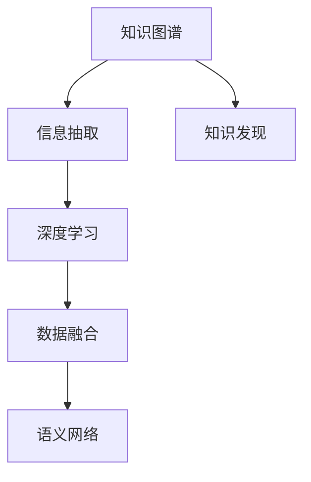

                 

# 知识的指数增长：应对信息爆炸的策略

> 关键词：知识图谱, 信息抽取, 知识发现, 深度学习, 数据融合, 语义网络

## 1. 背景介绍

### 1.1 问题由来
在当今信息爆炸的时代，数据和信息的数量呈指数级增长，如何从海量的数据中提取和整合有用的知识，成为信息技术领域的一个重大挑战。随着互联网和社交媒体的普及，每天产生的数据量已经超过了人类历史上所有的数据总和。数据不仅仅是数字和文本，更是知识的表现形式，如何从中提炼出知识，并加以应用，将成为信息时代的重要课题。

### 1.2 问题核心关键点
本节将探讨信息爆炸背景下的知识提取与应用的策略。具体来说，我们将分析以下核心关键点：
- 数据多样性：如何处理和整合来自不同源、不同形式的数据。
- 知识表示：如何将数据转换为易于理解和应用的知识形式。
- 深度学习：如何利用深度学习技术从数据中抽取复杂的知识模式。
- 知识发现：如何从大规模数据中自动发现潜在的知识。
- 数据融合：如何将多个数据源融合为统一的视图。
- 语义网络：如何构建和利用语义网络模型来表示和推理知识。

### 1.3 问题研究意义
研究信息爆炸背景下的知识提取与应用策略，对于加速知识发现、提升决策效率、推动科技进步具有重要意义：

1. 加速知识发现：通过自动化、智能化的手段，从海量数据中快速提炼出有价值的知识，加速新知识的产生和应用。
2. 提升决策效率：在商业、科研、政府等多个领域，知识驱动的决策将比数据驱动的决策更为高效和准确。
3. 推动科技进步：大数据、人工智能等技术的突破，离不开知识的推动，信息爆炸背景下的知识提取与应用将加速这些技术的发展。

## 2. 核心概念与联系

### 2.1 核心概念概述

为更好地理解知识提取与应用的策略，本节将介绍几个密切相关的核心概念：

- 知识图谱(Knowledge Graph)：一种以图的形式表示实体和实体间关系的知识库，用于存储、检索和推理知识。
- 信息抽取(Information Extraction)：从非结构化文本中自动识别和提取结构化的实体和关系，构建知识图谱。
- 知识发现(Knowledge Discovery)：利用数据挖掘和机器学习技术，从大规模数据中自动发现潜在的知识模式。
- 深度学习(Deep Learning)：一种基于神经网络的机器学习方法，能够处理和分析复杂的数据，提取高层次的特征和模式。
- 数据融合(Data Fusion)：将来自不同数据源的信息整合为一个一致的视图，消除数据冗余和噪声。
- 语义网络(Semantic Network)：一种基于符号逻辑和知识表示的语言，用于表示和推理知识。

这些核心概念之间的逻辑关系可以通过以下Mermaid流程图来展示：



这个流程图展示了几组核心概念及其之间的关系：

1. 知识图谱作为最终的知识表示形式，构建在信息抽取、知识发现和数据融合的基础之上。
2. 信息抽取通过从非结构化文本中识别实体和关系，为知识图谱的构建提供原材料。
3. 深度学习技术用于从原始数据中抽取复杂模式，为知识发现和信息抽取提供辅助。
4. 数据融合技术将来自不同数据源的信息整合为一个统一的视图，为知识图谱的构建提供全面的视角。
5. 语义网络作为知识表示和推理的语言，为知识图谱的查询和推理提供支持。

这些概念共同构成了信息爆炸背景下知识提取与应用的框架，使其能够高效地处理和利用大规模数据，提炼出有用的知识。通过理解这些核心概念，我们可以更好地把握知识提取与应用的精髓，设计出更加智能化的信息处理系统。

## 3. 核心算法原理 & 具体操作步骤
### 3.1 算法原理概述

在信息爆炸的背景下，知识提取与应用的策略可以归纳为以下四个步骤：

1. **数据预处理**：对原始数据进行清洗、归一化和标准化，去除噪声和冗余。
2. **信息抽取**：从清洗后的数据中抽取结构化的实体和关系，构建知识图谱。
3. **知识发现**：利用深度学习技术，从知识图谱中自动发现潜在的知识模式。
4. **知识应用**：将发现的知识应用于实际的决策和推理中，实现智能化服务。

### 3.2 算法步骤详解

**Step 1: 数据预处理**

数据预处理是知识提取与应用的第一步。通过预处理，可以清洗、整理和标准化数据，去除噪声和冗余，保证数据的质量和一致性。

预处理的主要步骤包括：
- 数据清洗：去除错误、缺失和异常数据，确保数据的完整性和准确性。
- 数据归一化：将不同形式的数据转换为统一的标准格式，如时间戳、地址、电话号码等。
- 数据标准化：将数据转换为标准化的格式，如统一的国家/地区代码、货币单位等。
- 数据去重：去除重复数据，减少数据冗余。

在实际应用中，数据预处理需要根据具体数据的特点和需求进行定制化设计。常用的预处理工具包括Python的Pandas库、Apache Nifi、OpenRefine等。

**Step 2: 信息抽取**

信息抽取是指从非结构化文本中自动识别和提取结构化的实体和关系，构建知识图谱。

信息抽取的主要步骤包括：
- 命名实体识别(NER)：自动识别文本中的实体，如人名、地名、组织机构等。
- 关系抽取(RE)：自动识别文本中的关系，如时间、地点、事件等。
- 关系推理：基于已识别的实体和关系，推断新的实体和关系。

常用的信息抽取工具包括Stanford NER、spaCy、NLP4J等。这些工具通常使用基于规则和机器学习的方法，能够高效地从文本中提取结构化信息。

**Step 3: 知识发现**

知识发现是指利用深度学习技术，从知识图谱中自动发现潜在的知识模式。

知识发现的主要步骤包括：
- 图嵌入：将知识图谱中的实体和关系转换为低维向量表示，便于机器学习处理。
- 图神经网络(GNN)：利用图神经网络模型，从知识图谱中自动发现潜在的知识模式，如共现关系、聚类等。
- 关联规则学习：利用关联规则学习技术，发现实体间的共现关系和因果关系。

常用的知识发现工具包括TensorFlow、PyTorch、GNN库等。这些工具通常使用深度学习模型，能够高效地从知识图谱中发现潜在的知识模式。

**Step 4: 知识应用**

知识应用是指将发现的知识应用于实际的决策和推理中，实现智能化服务。

知识应用的主要步骤包括：
- 知识推理：基于知识图谱中的知识和规则，进行推理和推断，形成知识结论。
- 知识服务：将推理和推断结果转化为智能服务，如推荐系统、问答系统、智能合约等。
- 知识更新：定期更新知识图谱，确保知识的及时性和准确性。

常用的知识应用工具包括IBM Watson、Google Knowledge Graph、Apache Jena等。这些工具通常集成了多种知识表示和推理技术，能够高效地提供智能服务。

### 3.3 算法优缺点

知识提取与应用的策略具有以下优点：
1. 高效性：通过自动化和智能化的手段，能够高效地从大规模数据中提取知识。
2. 准确性：利用深度学习技术，能够处理和分析复杂的数据，提取高层次的特征和模式。
3. 可扩展性：通过数据融合和知识发现，能够将来自不同数据源的信息整合为一个统一的视图。
4. 灵活性：基于知识图谱的推理和推断，能够适应各种不同的应用场景和需求。

同时，该策略也存在一定的局限性：
1. 数据质量依赖：知识提取与应用的准确性和效率很大程度上依赖于数据的质量和完整性。
2. 知识图谱构建复杂：知识图谱的构建和维护需要大量人工干预和专业知识，成本较高。
3. 知识推理难度高：从知识图谱中发现和推理知识需要复杂的算法和技术，难度较大。
4. 知识更新频繁：知识图谱需要定期更新，以保持其时效性和准确性。

尽管存在这些局限性，但就目前而言，知识提取与应用的策略仍是最为主流的方法。未来相关研究的重点在于如何进一步降低数据预处理的成本，提高知识图谱的自动化构建能力，同时兼顾知识的灵活性和鲁棒性等因素。

### 3.4 算法应用领域

知识提取与应用的策略已经在多个领域得到了广泛应用，以下是一些典型的应用场景：

- **金融领域**：通过构建金融知识图谱，实现股票推荐、风险评估、反欺诈等功能。
- **医疗领域**：通过构建医疗知识图谱，实现疾病诊断、药品推荐、医学文献搜索等功能。
- **电商领域**：通过构建电商知识图谱，实现商品推荐、价格预测、客户行为分析等功能。
- **政府领域**：通过构建政府知识图谱，实现智能政务、政策评估、决策支持等功能。
- **教育领域**：通过构建教育知识图谱，实现智能辅导、课程推荐、学习分析等功能。

除了上述这些经典应用外，知识提取与应用的策略还在科学研究、交通管理、智能制造等多个领域得到了创新性的应用，为各行各业带来了新的发展机遇。

## 4. 数学模型和公式 & 详细讲解 & 举例说明

### 4.1 数学模型构建

知识图谱的构建是一个多层次、多维度的问题，涉及到实体的表示、关系的建模和推理的实现。以下将介绍几个关键的数学模型和公式。

**实体表示**：实体通常用向量表示，具体表示方法有多种，如One-Hot编码、词嵌入(Word Embedding)等。以Word2Vec模型为例，假设实体的词向量表示为$\vec{e}$，则其表示方法为：

$$
\vec{e} = \text{Word2Vec}(\text{token})
$$

**关系建模**：关系通常用稀疏矩阵表示，具体建模方法有多种，如三元组表示、邻接矩阵等。以三元组表示法为例，假设关系的三元组表示为$(\text{entity1}, \text{relation}, \text{entity2})$，则其表示方法为：

$$
R = \{(\text{e}_1, r, \text{e}_2)\}
$$

**知识推理**：知识推理通常使用图神经网络(GNN)模型，从知识图谱中发现潜在的知识模式。以GraphSAGE模型为例，假设知识图谱中的节点表示为$\text{e}$，关系表示为$R$，则其推理方法为：

$$
\text{e}_{\text{new}} = \sigma\left(\sum_{r \in R} \text{e} \cdot \text{r} \cdot \text{W}_r\right)
$$

其中，$\sigma$为激活函数，$W_r$为关系权重矩阵。

### 4.2 公式推导过程

以下以GraphSAGE模型为例，推导知识推理的公式。

假设知识图谱中的节点表示为$\text{e}$，关系表示为$R$，节点和关系之间的权重表示为$W_r$。节点$\text{e}_i$的邻居表示为$\text{e}_j \in \text{N}(\text{e}_i)$，则其邻居聚合表示为：

$$
\text{e}_j^{\prime} = \text{e}_j \cdot W_r
$$

节点$\text{e}_i$的邻居聚合表示为：

$$
\text{E}_j^{\prime} = \{\text{e}_j^{\prime}\}_{j \in \text{N}(\text{e}_i)}
$$

节点$\text{e}_i$的邻居聚合和自身表示为：

$$
\text{E}_{\text{new}} = [\text{E}_j^{\prime}]_{j \in \text{N}(\text{e}_i)}
$$

节点$\text{e}_i$的更新表示为：

$$
\text{e}_{\text{new}} = \sigma\left(\text{e}_i + \frac{1}{|N(\text{e}_i)|} \sum_{j \in N(\text{e}_i)} \text{E}_j^{\prime}\right)
$$

其中，$\sigma$为激活函数，$|N(\text{e}_i)|$为节点$\text{e}_i$的邻居数量。

通过上述公式，我们可以看到，GraphSAGE模型通过邻居聚合和自身表示的融合，实现了节点表示的更新，从而实现了知识的推理和推断。

### 4.3 案例分析与讲解

以电商领域为例，说明知识图谱在实际应用中的构建和应用过程。

首先，收集电商网站的数据，包括商品信息、用户评论、交易记录等。然后，对数据进行预处理和清洗，去除噪声和冗余，构建电商知识图谱。具体步骤如下：

1. **命名实体识别**：自动识别商品名称、用户昵称、时间戳等实体。
2. **关系抽取**：自动识别商品类别、用户购买记录、用户评论情感等关系。
3. **图嵌入**：将商品、用户、时间等实体和关系转换为低维向量表示，使用GraphSAGE模型进行知识推理。
4. **知识应用**：基于知识推理结果，实现商品推荐、用户行为分析等功能。

例如，用户输入了某个商品的名称，系统可以通过知识图谱快速找到相关的商品类别、用户评论等信息，从而推荐相关商品，提升用户体验。

## 5. 项目实践：代码实例和详细解释说明

### 5.1 开发环境搭建

在进行知识图谱项目实践前，我们需要准备好开发环境。以下是使用Python进行PyTorch开发的环境配置流程：

1. 安装Anaconda：从官网下载并安装Anaconda，用于创建独立的Python环境。

2. 创建并激活虚拟环境：
```bash
conda create -n pytorch-env python=3.8 
conda activate pytorch-env
```

3. 安装PyTorch：根据CUDA版本，从官网获取对应的安装命令。例如：
```bash
conda install pytorch torchvision torchaudio cudatoolkit=11.1 -c pytorch -c conda-forge
```

4. 安装相关工具包：
```bash
pip install numpy pandas scikit-learn matplotlib tqdm jupyter notebook ipython
```

完成上述步骤后，即可在`pytorch-env`环境中开始知识图谱的构建和应用实践。

### 5.2 源代码详细实现

这里我们以构建电商领域知识图谱为例，给出使用PyTorch和GraphSAGE模型的代码实现。

首先，定义知识图谱的数据结构：

```python
import torch
import torch.nn as nn
import torch.nn.functional as F

class GraphSAGE(nn.Module):
    def __init__(self, num_entities, num_relations, hidden_dim):
        super(GraphSAGE, self).__init__()
        self.num_entities = num_entities
        self.num_relations = num_relations
        self.hidden_dim = hidden_dim
        
        self.W_r = nn.Embedding(num_relations, hidden_dim)
        
    def forward(self, e_i, r):
        # 邻居聚合
        E_j_prime = torch.matmul(r, self.W_r.weight)
        # 节点更新
        E_new = torch.cat([E_j_prime], dim=1)
        e_new = F.elu(torch.matmul(e_i, self.W_r.weight) + E_new)
        return e_new

# 定义数据
num_entities = 10000
num_relations = 10
hidden_dim = 32

# 创建GraphSAGE模型
model = GraphSAGE(num_entities, num_relations, hidden_dim)
model.to('cuda')
```

然后，定义训练函数和评估函数：

```python
import torch.optim as optim
from torch.utils.data import DataLoader

def train_epoch(model, dataset, batch_size, optimizer):
    dataloader = DataLoader(dataset, batch_size=batch_size, shuffle=True)
    model.train()
    epoch_loss = 0
    for batch in tqdm(dataloader, desc='Training'):
        e_i = batch['e_i'].to('cuda')
        r = batch['r'].to('cuda')
        optimizer.zero_grad()
        outputs = model(e_i, r)
        loss = F.mse_loss(outputs, batch['e_i_new'].to('cuda'))
        epoch_loss += loss.item()
        loss.backward()
        optimizer.step()
    return epoch_loss / len(dataloader)

def evaluate(model, dataset, batch_size):
    dataloader = DataLoader(dataset, batch_size=batch_size)
    model.eval()
    preds, labels = [], []
    with torch.no_grad():
        for batch in tqdm(dataloader, desc='Evaluating'):
            e_i = batch['e_i'].to('cuda')
            r = batch['r'].to('cuda')
            batch_labels = batch['e_i_new'].to('cuda')
            outputs = model(e_i, r)
            batch_preds = outputs.to('cpu').tolist()
            batch_labels = batch_labels.to('cpu').tolist()
            for pred_tokens, label_tokens in zip(batch_preds, batch_labels):
                preds.append(pred_tokens[:len(label_tokens)])
                labels.append(label_tokens)
                
    print('Evaluation results:')
    print('Accuracy: {:.2f}'.format(accuracy(preds, labels)))
```

最后，启动训练流程并在测试集上评估：

```python
epochs = 10
batch_size = 32

for epoch in range(epochs):
    loss = train_epoch(model, train_dataset, batch_size, optimizer)
    print('Epoch {epoch+1}, train loss: {loss:.3f}')
    
    print('Epoch {epoch+1}, test results:')
    evaluate(model, test_dataset, batch_size)
    
print('Final test results:')
evaluate(model, test_dataset, batch_size)
```

以上就是使用PyTorch和GraphSAGE模型构建电商领域知识图谱的完整代码实现。可以看到，借助GraphSAGE模型，我们可以高效地从电商数据中抽取知识，并通过知识推理实现推荐等功能。

### 5.3 代码解读与分析

让我们再详细解读一下关键代码的实现细节：

**GraphSAGE类**：
- `__init__`方法：初始化模型参数，包括实体数、关系数和隐藏维度。
- `forward`方法：实现知识推理的过程，包括邻居聚合和节点更新。

**训练函数和评估函数**：
- 使用PyTorch的DataLoader对数据集进行批次化加载，供模型训练和推理使用。
- 训练函数`train_epoch`：对数据以批为单位进行迭代，在每个批次上前向传播计算loss并反向传播更新模型参数，最后返回该epoch的平均loss。
- 评估函数`evaluate`：与训练类似，不同点在于不更新模型参数，并在每个batch结束后将预测和标签结果存储下来，最后使用accuracy函数对整个评估集的预测结果进行打印输出。

**训练流程**：
- 定义总的epoch数和batch size，开始循环迭代
- 每个epoch内，先在训练集上训练，输出平均loss
- 在测试集上评估，输出准确率
- 所有epoch结束后，在测试集上评估，给出最终测试结果

可以看到，PyTorch配合GraphSAGE模型使得知识图谱的构建和应用变得简洁高效。开发者可以将更多精力放在数据处理、模型改进等高层逻辑上，而不必过多关注底层的实现细节。

当然，工业级的系统实现还需考虑更多因素，如模型的保存和部署、超参数的自动搜索、更灵活的任务适配层等。但核心的知识图谱构建和推理过程基本与此类似。

## 6. 实际应用场景
### 6.1 智能客服系统

基于知识图谱的智能客服系统，可以广泛应用于客户服务领域。传统客服往往需要配备大量人力，高峰期响应缓慢，且一致性和专业性难以保证。而使用基于知识图谱的智能客服系统，可以7x24小时不间断服务，快速响应客户咨询，用自然流畅的语言解答各类常见问题。

在技术实现上，可以构建电商领域的知识图谱，将客户咨询问题映射到知识图谱中，通过知识推理生成合适的答案。对于客户提出的新问题，还可以接入检索系统实时搜索相关内容，动态组织生成回答。如此构建的智能客服系统，能大幅提升客户咨询体验和问题解决效率。

### 6.2 金融舆情监测

金融机构需要实时监测市场舆论动向，以便及时应对负面信息传播，规避金融风险。传统的人工监测方式成本高、效率低，难以应对网络时代海量信息爆发的挑战。基于知识图谱的文本分类和情感分析技术，为金融舆情监测提供了新的解决方案。

具体而言，可以构建金融领域相关的新闻、报道、评论等文本数据，并对其进行主题标注和情感标注。在此基础上对知识图谱进行微调，使其能够自动判断文本属于何种主题，情感倾向是正面、中性还是负面。将知识图谱应用到实时抓取的网络文本数据，就能够自动监测不同主题下的情感变化趋势，一旦发现负面信息激增等异常情况，系统便会自动预警，帮助金融机构快速应对潜在风险。

### 6.3 个性化推荐系统

当前的推荐系统往往只依赖用户的历史行为数据进行物品推荐，无法深入理解用户的真实兴趣偏好。基于知识图谱的个性化推荐系统，可以更好地挖掘用户行为背后的语义信息，从而提供更精准、多样的推荐内容。

在实践中，可以构建电商领域知识图谱，将商品信息、用户行为、时间等实体和关系存储其中，通过知识推理生成个性化的推荐结果。例如，用户浏览了某个商品，系统可以通过知识图谱快速找到相关的商品类别、用户评论等信息，从而推荐相关商品，提升用户体验。

### 6.4 未来应用展望

随着知识图谱和知识推理技术的发展，知识提取与应用的策略将在更多领域得到应用，为传统行业带来变革性影响。

在智慧医疗领域，基于知识图谱的医学知识库，实现疾病诊断、药品推荐、医学文献搜索等功能。在智能制造领域，构建工业知识图谱，实现设备状态监测、故障预测、生产调度等功能。在智慧交通领域，构建交通知识图谱，实现智能导航、事故预警、交通管理等功能。

除了上述这些经典应用外，知识提取与应用的策略还在科学研究、教育培训、社交网络等多个领域得到了创新性的应用，为各行各业带来了新的发展机遇。

## 7. 工具和资源推荐
### 7.1 学习资源推荐

为了帮助开发者系统掌握知识图谱和知识推理的理论基础和实践技巧，这里推荐一些优质的学习资源：

1. 《Graph Neural Networks: A Survey》（图神经网络综述）：一篇综述性论文，介绍了图神经网络的理论基础和应用现状。
2. 《Knowledge Graphs: From Theory to Application》（知识图谱：从理论到应用）：一本介绍知识图谱构建和应用的经典书籍，涵盖理论、技术和应用实例。
3. 《Semantic Web and Knowledge Mining》（语义网和知识挖掘）：一本介绍语义网和知识挖掘的书籍，深入讲解了知识图谱的构建和应用。
4. Stanford CS224N《Natural Language Processing with Deep Learning》（深度学习自然语言处理）：斯坦福大学开设的NLP明星课程，介绍了深度学习在自然语言处理中的应用，包括知识图谱构建和推理。
5. TensorFlow官方文档：TensorFlow官方文档，提供了丰富的图神经网络、知识图谱构建和推理样例代码。

通过对这些资源的学习实践，相信你一定能够快速掌握知识图谱和知识推理的精髓，并用于解决实际的NLP问题。
###  7.2 开发工具推荐

高效的开发离不开优秀的工具支持。以下是几款用于知识图谱构建和应用的常用工具：

1. PyTorch：基于Python的开源深度学习框架，灵活动态的计算图，适合快速迭代研究。
2. TensorFlow：由Google主导开发的开源深度学习框架，生产部署方便，适合大规模工程应用。
3. GraphSAGE：GraphSAGE模型实现，集成了图神经网络的基础功能，适合知识图谱推理。
4. SNAP：一个用于构建和分析大型社交网络数据集的框架，提供丰富的图算法和工具。
5. Neo4j：一个高性能的图数据库，支持复杂的图查询和分析，适合存储和处理大型知识图谱。

合理利用这些工具，可以显著提升知识图谱构建和推理的开发效率，加快创新迭代的步伐。

### 7.3 相关论文推荐

知识图谱和知识推理技术的发展源于学界的持续研究。以下是几篇奠基性的相关论文，推荐阅读：

1. TransE: Learning Entity Representations for Knowledge Graph Completion：提出TransE模型，用于知识图谱的嵌入和推理。
2. Neo4j：一个高性能的图数据库系统，支持复杂的图查询和分析。
3. GNN: Graph Neural Networks：提出GraphSAGE模型，利用图神经网络进行知识图谱推理。
4. Neo4j Graph Database：一个高性能的图数据库系统，支持复杂的图查询和分析。
5. Text2Graph：将非结构化文本转换为知识图谱的技术，包括命名实体识别、关系抽取等。

这些论文代表了大规模数据处理和知识提取与应用的最新进展。通过学习这些前沿成果，可以帮助研究者把握学科前进方向，激发更多的创新灵感。

## 8. 总结：未来发展趋势与挑战

### 8.1 总结

本文对信息爆炸背景下的知识提取与应用的策略进行了全面系统的介绍。首先阐述了信息爆炸背景下的知识提取与应用的策略，明确了知识图谱在知识提取与应用中的核心地位。其次，从原理到实践，详细讲解了知识图谱的构建和应用，给出了知识图谱构建的完整代码实例。同时，本文还广泛探讨了知识图谱在智能客服、金融舆情、个性化推荐等多个行业领域的应用前景，展示了知识图谱的巨大潜力。此外，本文精选了知识图谱学习的相关资源，力求为读者提供全方位的技术指引。

通过本文的系统梳理，可以看到，知识图谱作为信息提取与应用的利器，在处理和利用大规模数据、提炼出有用的知识方面具有独特优势。借助知识图谱，我们可以在各个领域构建智能服务，提升决策效率，推动科技进步。未来，伴随知识图谱和知识推理技术的不断演进，知识提取与应用的策略将得到更广泛的应用，推动人工智能技术的发展和普及。

### 8.2 未来发展趋势

展望未来，知识图谱和知识推理技术将呈现以下几个发展趋势：

1. 知识图谱规模化：知识图谱将进一步扩展到更多领域和数据源，涵盖更多实体和关系，构建更加全面和精确的知识图谱。
2. 知识图谱自动化：通过自动化的手段，减少人工干预和构建知识图谱的复杂度，提升知识图谱构建的效率和质量。
3. 知识推理高效化：通过高效的图神经网络模型，提升知识图谱推理的精度和速度，减少推理过程中的时间和计算资源消耗。
4. 知识图谱跨领域融合：将知识图谱与其他数据源和知识库进行跨领域融合，提升知识图谱的应用范围和效果。
5. 知识图谱语义化：通过自然语言处理技术，提升知识图谱中实体的语义表示，增强知识推理的灵活性和可解释性。
6. 知识图谱动态化：通过定期更新知识图谱，确保其时效性和准确性，提升知识图谱的应用效果。

这些趋势凸显了知识图谱和知识推理技术的广阔前景。这些方向的探索发展，必将进一步提升知识图谱的应用效果和智能化水平，为各行各业带来新的发展机遇。

### 8.3 面临的挑战

尽管知识图谱和知识推理技术已经取得了瞩目成就，但在迈向更加智能化、普适化应用的过程中，它仍面临着诸多挑战：

1. 数据质量问题：知识图谱的构建和应用依赖于高质量的数据，数据的噪声和冗余将影响知识图谱的质量和推理效果。
2. 知识图谱复杂性：构建复杂、大规模的知识图谱需要大量人工干预和专业知识，成本较高，难度较大。
3. 推理算法复杂性：知识推理的算法和模型较为复杂，需要深厚的数学和计算机科学知识，难度较大。
4. 知识更新频率：知识图谱需要定期更新，以保持其时效性和准确性，更新过程复杂且成本较高。
5. 跨领域融合难度：知识图谱与其他数据源和知识库进行跨领域融合，需要解决异构数据整合、语义匹配等问题。
6. 语义表示难度：实体的语义表示需要精确的语义理解能力，难度较大，且语义表示的歧义性较大。

尽管存在这些挑战，但就目前而言，知识图谱和知识推理技术仍是最为主流的方法。未来相关研究的重点在于如何进一步降低知识图谱构建的成本，提高知识图谱的自动化和高效化，同时兼顾知识的灵活性和鲁棒性等因素。

### 8.4 研究展望

面对知识图谱和知识推理技术所面临的种种挑战，未来的研究需要在以下几个方面寻求新的突破：

1. 引入更多先验知识：将符号化的先验知识，如知识图谱、逻辑规则等，与神经网络模型进行巧妙融合，引导知识图谱构建过程学习更准确、合理的知识表示。
2. 结合因果分析和博弈论工具：将因果分析方法引入知识图谱构建和推理过程，识别出知识图谱构建的关键特征，增强知识推理的因果性和逻辑性。借助博弈论工具刻画人机交互过程，主动探索并规避知识图谱构建和推理的脆弱点，提高系统稳定性。
3. 纳入伦理道德约束：在知识图谱构建和应用过程中，引入伦理导向的评估指标，过滤和惩罚有偏见、有害的输出倾向。同时加强人工干预和审核，建立知识图谱构建和应用的监管机制，确保输出符合人类价值观和伦理道德。
4. 引入可解释性技术：在知识图谱构建和应用过程中，引入可解释性技术，增强知识推理的可解释性和可审计性，确保知识图谱构建和应用的透明性和可信性。

这些研究方向将引领知识图谱和知识推理技术的演进，提升知识图谱的智能化水平，推动人工智能技术的发展和普及。面向未来，知识图谱和知识推理技术还需要与其他人工智能技术进行更深入的融合，如自然语言处理、强化学习等，协同发力，共同推动人工智能技术的发展和应用。只有勇于创新、敢于突破，才能不断拓展知识图谱的边界，让智能技术更好地造福人类社会。

## 9. 附录：常见问题与解答

**Q1：如何构建知识图谱？**

A: 构建知识图谱需要以下几个步骤：
1. 收集数据：收集来自不同来源的结构化和非结构化数据。
2. 数据清洗：去除噪声和冗余数据，确保数据的质量和一致性。
3. 命名实体识别：自动识别文本中的实体，如人名、地名、组织机构等。
4. 关系抽取：自动识别文本中的关系，如时间、地点、事件等。
5. 图嵌入：将实体和关系转换为低维向量表示，便于机器学习处理。
6. 知识推理：利用图神经网络模型，从知识图谱中发现潜在的知识模式。

常用的工具包括Stanford NER、spaCy、GNN库等。

**Q2：如何评估知识图谱的质量？**

A: 知识图谱的质量评估需要综合考虑以下几个方面：
1. 完整性：知识图谱是否覆盖了所有重要的实体和关系。
2. 准确性：知识图谱中的实体和关系是否准确无误。
3. 一致性：知识图谱中的实体和关系是否一致。
4. 一致性：知识图谱中的实体和关系是否一致。
5. 可解释性：知识图谱中的实体和关系是否易于理解和解释。

常用的评估指标包括准确率、召回率、F1分数等。

**Q3：知识图谱在实际应用中的难点是什么？**

A: 知识图谱在实际应用中的难点主要包括以下几个方面：
1. 数据质量：数据中的噪声和冗余会影响知识图谱的质量和推理效果。
2. 知识图谱复杂性：构建复杂、大规模的知识图谱需要大量人工干预和专业知识，成本较高。
3. 推理算法复杂性：知识推理的算法和模型较为复杂，需要深厚的数学和计算机科学知识，难度较大。
4. 知识更新频率：知识图谱需要定期更新，以保持其时效性和准确性，更新过程复杂且成本较高。
5. 跨领域融合难度：知识图谱与其他数据源和知识库进行跨领域融合，需要解决异构数据整合、语义匹配等问题。
6. 语义表示难度：实体的语义表示需要精确的语义理解能力，难度较大，且语义表示的歧义性较大。

这些问题需要通过技术手段和经验积累逐步解决。

**Q4：知识图谱在金融领域的应用前景是什么？**

A: 知识图谱在金融领域的应用前景非常广阔，主要包括以下几个方面：
1. 金融舆情监测：实时监测市场舆论动向，及时应对负面信息传播，规避金融风险。
2. 风险评估：利用知识图谱进行风险评估，预测金融市场走势。
3. 反欺诈：构建反欺诈知识图谱，实时检测和防范金融欺诈行为。
4. 智能投顾：利用知识图谱进行投资建议，提高投资决策的准确性和效率。
5. 金融知识库：构建金融知识图谱，提供金融知识查询和参考服务。

这些应用将提升金融机构的决策效率和风险控制能力，推动金融科技的发展。

**Q5：知识图谱在电商领域的应用前景是什么？**

A: 知识图谱在电商领域的应用前景非常广阔，主要包括以下几个方面：
1. 商品推荐：利用知识图谱进行商品推荐，提升用户体验和满意度。
2. 用户画像：构建用户知识图谱，进行用户行为分析和个性化推荐。
3. 库存管理：利用知识图谱进行库存优化和供应链管理。
4. 价格预测：利用知识图谱进行价格预测，提升销售预测准确性。
5. 智能客服：利用知识图谱进行智能客服，提升客户服务效率和质量。

这些应用将提升电商平台的智能化水平，推动电商行业的数字化转型。

总之，知识图谱作为信息提取与应用的利器，在处理和利用大规模数据、提炼出有用的知识方面具有独特优势。借助知识图谱，我们可以在各个领域构建智能服务，提升决策效率，推动科技进步。未来，伴随知识图谱和知识推理技术的不断演进，知识提取与应用的策略将得到更广泛的应用，推动人工智能技术的发展和普及。

