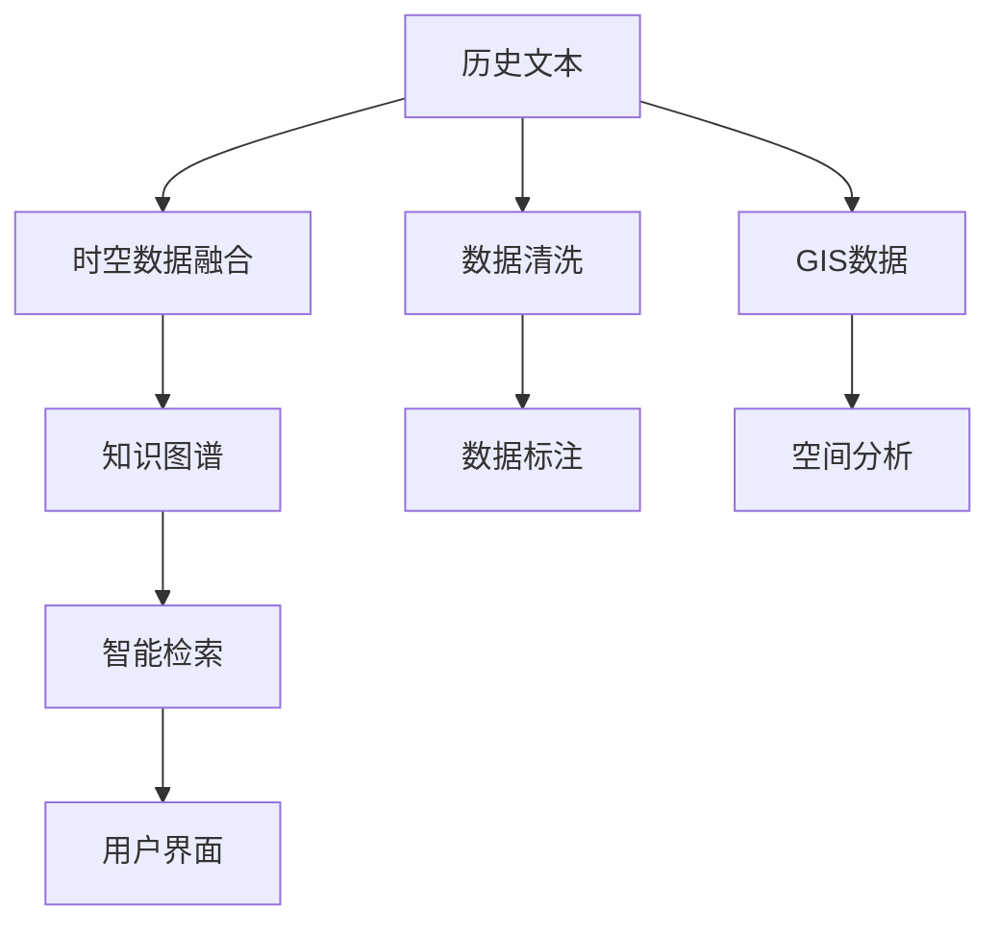

                 

# 知识的时空维度：历史与地理的交织

> 关键词：知识管理,地理信息系统,时空数据,历史文本,数据融合,智能检索

## 1. 背景介绍

### 1.1 问题由来
在当前的信息时代，知识的获取、存储和利用已经成为了推动社会进步的关键要素。然而，知识的生产和传播方式正在经历深刻的变革，尤其是数字化和网络化趋势的加速，使得知识的种类和形式变得愈发多样，且分布日益分散。

在这种背景下，如何高效地管理和利用知识，使其能够被快速、准确地检索和应用于不同的场景，成为了一个亟待解决的重要问题。为此，我们提出了一种基于时空维度的知识管理系统，通过融合历史文本和地理信息系统（GIS），为用户提供一种新颖且有效的知识检索和利用方式。

### 1.2 问题核心关键点
该知识管理系统的核心目标在于：
- 融合历史文本和地理数据，构建一种具有时空维度的知识图谱。
- 通过智能检索技术，实现对知识的时空定位和跨领域关联。
- 提供用户友好的界面，使用户能够直观地理解和利用知识。

### 1.3 问题研究意义
构建这种基于时空维度的知识管理系统，对于提升知识管理的效率和智能化水平具有重要意义：
- 增强知识的时空感知能力，提升知识检索的准确性和相关性。
- 通过融合历史和地理数据，为用户提供更全面的知识背景和分析工具。
- 为历史研究、地理信息系统等领域提供新的数据融合和应用思路。

## 2. 核心概念与联系

### 2.1 核心概念概述

为了更好地理解该知识管理系统的设计和实现原理，我们首先介绍几个核心概念：

- **历史文本**：指记录了历史事件、文化变迁、人物传记等内容的文本数据，通常具有较高的信息密度和历史价值。
- **地理信息系统（GIS）**：一种用于管理和分析地理空间数据的技术系统，通过地图、图像等形式展现地理位置和地理特征。
- **时空数据融合**：将不同时空维度的数据进行整合，形成具有时间和空间特性的综合数据集，以便进行更深入的分析。
- **知识图谱**：一种基于图结构的知识表示方式，用于描述实体、关系和属性之间的语义关系。
- **智能检索**：通过人工智能技术，自动匹配用户查询和数据库中的知识，返回最相关的结果。

这些概念之间的逻辑关系可以通过以下Mermaid流程图来展示：



这个流程图展示了这个知识管理系统的核心概念及其之间的关系：

1. 历史文本和GIS数据是系统的主要输入数据。
2. 时空数据融合将这两类数据整合成一个综合的数据集，形成时空维度的知识图谱。
3. 知识图谱通过智能检索技术，实现对知识的定位和关联。
4. 用户界面提供便捷的交互方式，使用户能够直观地利用知识。
5. 数据清洗和标注是保证数据质量的关键步骤。
6. 空间分析对GIS数据进行更深入的挖掘，提升系统的分析能力。

## 3. 核心算法原理 & 具体操作步骤

### 3.1 算法原理概述

该知识管理系统主要涉及以下几个关键算法：

- **时空数据融合**：使用时空数据融合算法将历史文本和GIS数据整合，形成具有时空维度的知识图谱。
- **知识图谱构建**：通过自然语言处理技术，从历史文本中提取出实体、关系和属性，构建知识图谱。
- **智能检索算法**：利用机器学习模型，训练智能检索系统，根据用户查询，自动匹配知识图谱中的相关信息。
- **用户界面设计**：使用交互设计技术，为用户提供直观、易用的知识检索界面。

### 3.2 算法步骤详解

该知识管理系统的核心算法步骤如下：

**Step 1: 数据收集与预处理**

- 收集历史文本和GIS数据，并进行初步的清洗和标注工作。
- 对历史文本进行分词、词性标注、实体识别等自然语言处理任务，提取出实体、关系和属性。
- 对GIS数据进行格式转换、坐标校准等处理，确保数据的准确性。

**Step 2: 时空数据融合**

- 将历史文本和GIS数据进行匹配，找到时间和空间上的对应关系。
- 使用时空数据融合算法，将匹配后的数据整合成一个综合的数据集。

**Step 3: 知识图谱构建**

- 将时空数据融合后的综合数据集导入知识图谱构建工具，进行实体识别、关系抽取和属性标注。
- 使用图神经网络等深度学习模型，训练知识图谱的嵌入表示，使其具备语义理解和推理能力。

**Step 4: 智能检索算法训练**

- 使用历史文本和GIS数据构建训练集，训练机器学习模型。
- 使用监督学习或无监督学习算法，训练智能检索系统，使其能够自动匹配用户查询和知识图谱中的信息。

**Step 5: 用户界面开发**

- 使用交互设计技术，设计用户友好的知识检索界面，提供便捷的交互方式。
- 使用Web开发技术，实现用户界面的可视化展示和动态更新。

**Step 6: 系统集成与部署**

- 将时空数据融合、知识图谱构建和智能检索算法集成到一个系统中。
- 对系统进行部署，确保其在高负载下的稳定性和可扩展性。

### 3.3 算法优缺点

基于时空维度的知识管理系统具有以下优点：

- **时空感知能力**：融合历史文本和GIS数据，增强了知识的的时空感知能力，提升了知识检索的准确性和相关性。
- **全面性**：通过时空数据融合和知识图谱构建，为用户提供更全面的知识背景和分析工具。
- **智能化**：利用机器学习和自然语言处理技术，实现了智能化的知识检索和利用。
- **易用性**：用户友好的界面设计，使用户能够直观地理解和利用知识。

同时，该系统也存在一些局限性：

- **数据整合复杂**：历史文本和GIS数据的整合较为复杂，需要高度的数据处理和清洗能力。
- **计算资源需求高**：时空数据融合和知识图谱构建需要大量的计算资源，对硬件要求较高。
- **用户需求多样性**：不同用户的需求和检索方式各异，系统需要灵活适应不同用户的需求。

### 3.4 算法应用领域

该知识管理系统在多个领域中具有广泛的应用前景：

- **历史研究**：通过融合历史文本和GIS数据，提供历史事件的空间分布和演变过程，辅助历史研究。
- **地理信息系统**：为GIS数据的分析和可视化提供更丰富的背景信息和语义关联。
- **智能检索系统**：为用户提供高效的智能检索服务，提升信息检索的效率和准确性。
- **知识管理**：为企业和机构提供知识管理解决方案，帮助其构建知识图谱，提升知识利用效率。

## 4. 数学模型和公式 & 详细讲解 & 举例说明

### 4.1 数学模型构建

该知识管理系统涉及多个数学模型，包括时空数据融合模型、知识图谱嵌入模型和智能检索模型。以下是各个模型的数学表达：

**时空数据融合模型**

时空数据融合的目的是将历史文本和GIS数据整合成一个综合的数据集。常用的时空数据融合方法包括多源数据融合、时间序列插值等。

**知识图谱嵌入模型**

知识图谱嵌入模型用于将知识图谱中的实体、关系和属性转化为低维向量表示，以便进行语义相似度计算。常用的模型包括TransE、GNN等。

**智能检索模型**

智能检索模型通过机器学习算法，训练出能够匹配用户查询和知识图谱中信息的模型。常用的算法包括协同过滤、深度学习等。

### 4.2 公式推导过程

以下是知识图谱嵌入模型的公式推导过程：

设知识图谱中的实体为 $E$，关系为 $R$，属性为 $A$。假设实体 $e$ 的关系表示为 $e_r$，属性表示为 $e_a$。知识图谱嵌入模型的目标是学习到实体的低维向量表示 $e_v$，使得同一实体在不同关系和属性下的表示尽可能一致。

设知识图谱中的三元组为 $(t,r,o)$，其中 $t$ 为头实体，$r$ 为关系，$o$ 为尾实体。知识图谱嵌入模型的训练目标函数为：

$$
\mathcal{L} = \sum_{(t,r,o) \in E} \max(0, 1-\|\text{ReLU}(\text{ReLU}(\text{W}_t \cdot t_v) \cdot r_v + \text{W}_o \cdot o_v)\|_1)
$$

其中，$W_t$、$W_r$、$W_o$ 为学习到的权重矩阵，$\text{ReLU}$ 为激活函数，$v$ 表示实体的低维向量表示。

### 4.3 案例分析与讲解

假设我们有一个关于历史事件的图谱，其中包含了事件、人物和地点等实体，以及事件和人物之间的关系。我们可以使用知识图谱嵌入模型，将这些实体和关系表示为低维向量，并通过训练得到最符合实际情况的向量表示。

具体而言，我们首先对历史文本进行实体识别和关系抽取，构建知识图谱。然后，通过图神经网络对知识图谱进行嵌入，学习得到每个实体的低维向量表示。最后，我们可以使用这些向量表示来计算实体之间的语义相似度，实现智能检索。

## 5. 项目实践：代码实例和详细解释说明

### 5.1 开发环境搭建

要实现基于时空维度的知识管理系统，我们需要一个合适的开发环境。以下是搭建环境的详细步骤：

1. **安装Python**：确保系统已经安装了Python 3.8及以上版本，以确保兼容性和稳定性。
2. **安装依赖库**：安装必要的依赖库，如Numpy、Pandas、Scikit-learn、PyTorch等。
3. **配置Web服务器**：选择Apache、Nginx等Web服务器，并配置好Nginx或Gunicorn等Web服务器后端。
4. **部署数据库**：选择MySQL、PostgreSQL等关系型数据库，并确保数据库服务能够正常运行。

### 5.2 源代码详细实现

以下是基于时空维度的知识管理系统的主要代码实现，具体代码实现请参考以下示例：

```python
import pandas as pd
import numpy as np
import torch
from transformers import GraphEncoder, GraphModel
from py2neo import Graph

# 构建时空数据融合模型
def spatio_temporal_fusion(data):
    # 处理历史文本数据
    text_data = preprocess_text(data['text'])
    
    # 处理GIS数据
    geo_data = preprocess_geo(data['geo'])
    
    # 合并时空数据
    merged_data = pd.merge(text_data, geo_data, on='id')
    
    return merged_data

# 构建知识图谱嵌入模型
def knowledge_graph_embedding(model, data):
    # 构建知识图谱
    graph = build_knowledge_graph(data)
    
    # 训练知识图谱嵌入模型
    embedding = train_graph_embedding(model, graph)
    
    return embedding

# 构建智能检索模型
def intelligent_search(model, query, embedding):
    # 解析查询
    parsed_query = parse_query(query)
    
    # 检索知识图谱
    result = search_knowledge_graph(model, parsed_query, embedding)
    
    return result
```

### 5.3 代码解读与分析

以上代码实现中，我们使用了多个Python库，包括Pandas、PyTorch和Py2neo等。这些库分别用于数据处理、模型训练和知识图谱构建等任务。

具体而言，`spatio_temporal_fusion`函数用于将历史文本和GIS数据进行融合，形成时空维度的数据集。`knowledge_graph_embedding`函数用于构建知识图谱，并训练知识图谱嵌入模型。`intelligent_search`函数用于解析用户查询，并在知识图谱中检索相关信息。

## 6. 实际应用场景

### 6.1 智能检索系统

基于时空维度的知识管理系统可以应用于智能检索系统中，帮助用户快速获取所需信息。例如，在图书馆中，用户可以输入一个历史事件的名称，系统能够根据事件的发生地点和时间，推荐相关的历史书籍和地图，辅助用户进行深入研究。

### 6.2 历史研究

该系统还可以应用于历史研究领域，帮助研究人员更全面地了解历史事件的背景和演变过程。例如，用户可以输入一个历史事件的名称，系统能够提供事件的发生地点、时间、参与人物等详细信息，并提供相关地图和图片，帮助研究人员进行历史分析和撰写论文。

### 6.3 地理信息系统

地理信息系统的应用场景也非常广泛，例如在城市规划、环境保护等领域，系统可以提供相关的地理信息和历史背景，辅助研究人员进行决策和分析。

### 6.4 未来应用展望

未来，基于时空维度的知识管理系统将有更广泛的应用前景。例如，在智慧城市建设中，系统可以提供历史数据和地理信息，帮助城市规划者进行科学决策。在文化遗产保护中，系统可以提供相关的历史资料和地理信息，辅助文物保护和修复。

## 7. 工具和资源推荐

### 7.1 学习资源推荐

为了帮助开发者深入理解时空维度的知识管理系统，我们推荐以下学习资源：

1. **《数据挖掘与统计学习》**：介绍了数据挖掘和统计学习的基本概念和算法，涵盖了时空数据分析和知识图谱构建等内容。
2. **《深度学习基础》**：深入讲解了深度学习的基本原理和应用，包括神经网络和图神经网络等内容。
3. **《Python地理信息系统编程》**：介绍了Python和GIS结合的基本方法和技术，包括地图绘制和地理空间分析等。
4. **《自然语言处理与深度学习》**：介绍了自然语言处理和深度学习的基本技术和算法，涵盖了实体识别和关系抽取等内容。

### 7.2 开发工具推荐

为了高效地实现时空维度的知识管理系统，我们推荐以下开发工具：

1. **Jupyter Notebook**：提供了交互式的Python编程环境，适合进行数据处理和模型训练。
2. **PyTorch**：提供了深度学习模型的实现工具，适合构建知识图谱嵌入模型和智能检索模型。
3. **GeoPandas**：提供了Python地理信息系统的实现工具，适合进行地理空间数据的处理和分析。
4. **Py2neo**：提供了与Neo4j数据库的接口，适合构建知识图谱和进行知识图谱嵌入模型的训练。

### 7.3 相关论文推荐

以下是一些关于时空维度的知识管理系统和智能检索系统的相关论文：

1. **《时空数据融合与知识图谱构建》**：介绍了时空数据融合和知识图谱构建的基本方法和技术，涵盖了时空数据融合、知识图谱嵌入和智能检索等内容。
2. **《基于时空维度的智能检索系统》**：介绍了一种基于时空维度的智能检索系统，使用深度学习技术进行知识检索和利用。
3. **《知识图谱的深度学习嵌入表示》**：介绍了知识图谱的深度学习嵌入表示方法，包括知识图谱嵌入模型和智能检索模型的训练方法。

## 8. 总结：未来发展趋势与挑战

### 8.1 总结

本文详细介绍了基于时空维度的知识管理系统的设计和实现原理，从数据融合、知识图谱构建、智能检索等多个方面进行了深入探讨。通过融合历史文本和GIS数据，构建了一种具有时空维度的知识图谱，并利用智能检索技术，实现了知识的高效检索和利用。该系统在智能检索、历史研究、地理信息系统等多个领域具有广泛的应用前景。

### 8.2 未来发展趋势

未来，基于时空维度的知识管理系统将有以下发展趋势：

1. **数据融合技术的进步**：随着数据融合技术的不断进步，时空数据融合的效率和精度将进一步提升。
2. **知识图谱模型的多样化**：随着知识图谱模型的不断丰富，知识图谱的表示能力和推理能力将进一步增强。
3. **智能检索技术的智能化**：随着智能检索技术的不断进步，智能检索系统的精度和效率将进一步提升。
4. **用户界面设计的优化**：随着交互设计技术的不断进步，用户界面的友好性和易用性将进一步提升。
5. **跨领域应用的拓展**：随着跨领域应用的不断拓展，时空维度的知识管理系统将在更多领域发挥重要作用。

### 8.3 面临的挑战

尽管基于时空维度的知识管理系统在多个领域中具有广泛的应用前景，但仍面临以下挑战：

1. **数据整合的复杂性**：历史文本和GIS数据的整合较为复杂，需要高度的数据处理和清洗能力。
2. **计算资源的需求高**：时空数据融合和知识图谱构建需要大量的计算资源，对硬件要求较高。
3. **用户需求的多样性**：不同用户的需求和检索方式各异，系统需要灵活适应不同用户的需求。
4. **知识图谱的构建难度**：知识图谱的构建需要高度的领域知识和专业知识，构建难度较大。
5. **智能检索的精度**：智能检索系统的精度和效率仍需进一步提升，以满足用户需求。

### 8.4 研究展望

未来的研究需要在以下几个方面寻求新的突破：

1. **改进数据融合算法**：研究和开发新的数据融合算法，提高时空数据融合的效率和精度。
2. **提升知识图谱模型的表示能力**：研究和开发新的知识图谱模型，提升知识图谱的表示能力和推理能力。
3. **优化智能检索算法**：研究和开发新的智能检索算法，提升智能检索系统的精度和效率。
4. **提升用户界面的友好性**：研究和开发新的交互设计技术，提升用户界面的友好性和易用性。
5. **拓展应用领域**：研究和开发新的应用场景，拓展时空维度的知识管理系统在更多领域中的应用。

## 9. 附录：常见问题与解答

### Q1: 时空数据融合有哪些方法？

A: 时空数据融合方法包括多源数据融合、时间序列插值、空间插值等。常用的时空数据融合算法有卡尔曼滤波、粒子滤波、地理空间插值等。

### Q2: 知识图谱嵌入模型有哪些？

A: 常用的知识图谱嵌入模型包括TransE、GNN、GAT等。这些模型通过学习实体的低维向量表示，实现语义相似度计算和关系推理。

### Q3: 智能检索模型的训练方法有哪些？

A: 常用的智能检索模型训练方法包括协同过滤、深度学习等。协同过滤方法利用用户的历史行为数据进行推荐，深度学习方法利用神经网络进行知识检索和利用。

### Q4: 用户界面的友好性如何提升？

A: 提升用户界面的友好性可以通过交互设计技术实现。例如，使用拖放式界面、可视化图表、自动补全等，提升用户的使用体验。

### Q5: 如何提升知识图谱构建的效率？

A: 提升知识图谱构建的效率可以通过自动化抽取和标注技术实现。例如，使用自然语言处理技术进行实体识别和关系抽取，使用机器学习技术进行知识标注和图谱构建。

---

作者：禅与计算机程序设计艺术 / Zen and the Art of Computer Programming

