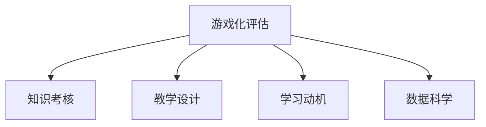

                 

# 知识的游戏化评估：寓教于乐的考核方式

> 关键词：游戏化评估, 知识考核, 教学设计, 学习动机, 数据科学

## 1. 背景介绍

### 1.1 问题由来
随着数字化学习工具和在线教育的兴起，传统的纸笔考试和标准化的评估方式正在面临挑战。如何在技术赋能下，创新考核方式，提升学生的学习动机和效果，成为了教育工作者和IT开发者共同关注的问题。近年来，随着游戏化和数据科学的结合，一种新的学习评估方式——知识游戏化评估（Gamification Assessment），逐渐引起了教育领域的广泛关注。

### 1.2 问题核心关键点
知识游戏化评估的核心在于将传统的考核方式，通过游戏化的方法和数据科学的手段进行创新。具体包括：
- 将知识评估融入游戏中，通过互动和挑战提升学生的学习动机。
- 使用数据科学的方法，分析学生的行为数据，为教学设计提供数据支持。
- 设计可定制化、灵活的游戏化考核方案，适应不同学科、年级的教学需求。

### 1.3 问题研究意义
知识游戏化评估的引入，有望在以下几个方面产生积极影响：

1. **提升学习动机**：通过游戏化的方式，将考核融入趣味性活动中，激发学生的学习兴趣和积极性。
2. **个性化评估**：利用数据分析技术，精准评估学生对知识点的掌握情况，提供个性化的学习反馈。
3. **教学改进**：基于游戏化评估结果，优化教学策略和内容，提升教学效果。
4. **增强互动性**：游戏化评估为师生互动提供了新的平台，促进教学相长。
5. **扩展应用范围**：知识游戏化评估不仅适用于线上教育，还可以应用于传统课堂，增强课堂互动。

## 2. 核心概念与联系

### 2.1 核心概念概述

为了更好地理解知识游戏化评估的方法，本节将介绍几个关键概念：

- **游戏化评估（Gamification Assessment）**：一种将传统评估方式与游戏化元素结合的新型评估方法，通过游戏设计提升学生的学习动机和效果。
- **知识考核（Knowledge Assessment）**：传统的基于标准考试、作业等形式的考核方式，通过定量的分数或等级来评估学生的知识掌握情况。
- **教学设计（Instructional Design）**：利用教育心理学的原理，设计课程内容、评估方式和教学方法，以提高教学效果。
- **学习动机（Learning Motivation）**：驱动学生参与学习过程的内在或外在因素，如兴趣、成就、社交等。
- **数据科学（Data Science）**：运用统计学、机器学习等技术，分析大规模数据，提取有价值的信息和知识。

这些概念之间的逻辑关系可以通过以下Mermaid流程图来展示：



这个流程图展示了知识游戏化评估的关键组成元素及其相互关系：

1. 游戏化评估借鉴了游戏的机制和设计原理，以提升学生的学习动机和效果。
2. 知识考核是游戏化评估的基底，评估知识点的掌握情况。
3. 教学设计则是实现知识考核和提升学习动机的方法论支撑。
4. 数据科学为评估和教学设计提供技术支持，通过数据分析优化学习过程。

## 3. 核心算法原理 & 具体操作步骤

### 3.1 算法原理概述

知识游戏化评估的算法原理主要基于以下几个方面：

1. **行为数据分析**：通过游戏化评估中产生的大量行为数据，如点击、操作、时间等，分析学生的学习行为模式，评估其对知识点的掌握情况。
2. **学习动机驱动**：利用游戏化的成就系统、积分系统、排行榜等，增强学生的成就感和归属感，驱动其持续学习。
3. **教学内容定制**：根据学生的评估结果，定制个性化的学习路径和内容，提高学习效率。
4. **即时反馈与调整**：提供即时的评估结果和反馈，帮助学生及时调整学习策略。

### 3.2 算法步骤详解

知识游戏化评估的具体步骤包括：

**Step 1: 准备评估数据和模型**
- 收集学生在游戏化评估中的行为数据，如点击次数、操作时长、正确率等。
- 选择或训练适合的数据科学模型，如回归模型、分类模型、聚类模型等，用于分析数据。

**Step 2: 设计游戏化元素**
- 设计游戏中的成就系统、积分系统、排行榜、任务等元素，提升学生的学习动机。
- 确定游戏的规则和目标，确保游戏化元素与知识点考核目标一致。

**Step 3: 实施游戏化评估**
- 在游戏中嵌入评估点，如关卡、挑战、测试等，通过学生的游戏行为评估其知识掌握情况。
- 实时收集学生在游戏中的行为数据，生成评估报告。

**Step 4: 分析与反馈**
- 利用数据科学模型分析行为数据，生成学生知识掌握情况的报告。
- 根据评估结果，提供个性化的学习建议和反馈。

**Step 5: 教学调整与优化**
- 基于评估报告和反馈，优化教学内容和策略。
- 定期调整游戏化元素和规则，适应学生的学习需求和兴趣变化。

### 3.3 算法优缺点

知识游戏化评估具有以下优点：
1. 提升学习动机：通过游戏化的设计，增强学生的学习兴趣和积极性。
2. 个性化评估：能够提供个性化的学习反馈，帮助学生发现和强化薄弱环节。
3. 即时反馈：及时了解学生的学习情况，便于及时调整教学策略。
4. 数据驱动：利用数据分析优化教学设计，提高教学效果。

同时，也存在一些局限：
1. 技术复杂度：实现游戏化评估需要较高的技术支持，可能增加教育平台的开发成本。
2. 数据隐私：收集和分析学生行为数据可能涉及隐私问题，需要严格的隐私保护措施。
3. 游戏化设计：游戏化元素的设计需要精心规划，否则可能适得其反，降低学习效果。
4. 适用范围：不适用于所有学科和年级，需要根据教学需求进行调整。

### 3.4 算法应用领域

知识游戏化评估在以下几个领域有着广泛的应用：

- **线上教育平台**：通过游戏化评估，增强在线课程的互动性和趣味性，提升学生的学习效果。
- **学校课堂**：在传统课堂中引入游戏化元素，提高课堂互动和学生参与度。
- **企业培训**：将游戏化评估应用于企业培训课程，提升员工的学习动机和培训效果。
- **学术研究**：在学术研究中，利用游戏化评估分析学生对研究内容的掌握情况，优化教学设计。
- **技能培训**：在游戏化评估中嵌入技能训练任务，提升培训效果和考核精准度。

## 4. 数学模型和公式 & 详细讲解 & 举例说明

### 4.1 数学模型构建

知识游戏化评估的数学模型构建主要涉及以下几个方面：

- **行为数据分析模型**：使用回归模型、分类模型等，分析学生的行为数据，评估其对知识点的掌握情况。
- **学习动机模型**：通过成就系统、积分系统等，建立学生成就感和归属感的数学模型。
- **个性化学习路径模型**：基于学生评估结果，设计个性化的学习路径和内容。
- **即时反馈模型**：利用机器学习算法，实时生成评估报告和反馈。

### 4.2 公式推导过程

以回归模型为例，介绍行为数据分析模型的构建过程。设学生的行为数据为 $x = (x_1, x_2, ..., x_n)$，其中 $x_i$ 表示第 $i$ 次点击或操作的时间、次数等特征。知识掌握情况为 $y$，则回归模型的公式为：

$$
y = \beta_0 + \beta_1 x_1 + \beta_2 x_2 + ... + \beta_n x_n + \epsilon
$$

其中，$\beta_0$ 为截距，$\beta_i$ 为第 $i$ 个特征的系数，$\epsilon$ 为随机误差。通过最小二乘法等方法，求解模型参数 $\beta$，得到学生对知识点的掌握情况预测。

### 4.3 案例分析与讲解

**案例一：数学课程游戏化评估**

在数学课程中，设计一个“解数学题挑战”游戏，学生通过解答数学题获得积分和成就。每次解答正确后，系统会生成一个简单的反馈信息，如“恭喜你，答对了！”。同时，系统会根据学生的答题速度、正确率等行为数据，使用回归模型评估其对数学知识点的掌握情况。根据评估结果，系统会提供个性化的学习建议，如推荐类似难度的题、重点强化某些知识点等。

**案例二：编程课程游戏化评估**

在编程课程中，设计一个“编程小项目”游戏，学生通过完成编程小项目获得积分和成就。系统实时记录学生的编程行为，如代码行数、错误次数等，使用分类模型评估学生对编程知识的掌握情况。根据评估结果，系统推荐适合的编程题目，并分析学生代码中的常见错误，提供针对性的改进建议。

## 5. 项目实践：代码实例和详细解释说明

### 5.1 开发环境搭建

在进行知识游戏化评估的开发实践前，需要准备以下开发环境：

1. 安装Python：确保安装了最新版本的Python，建议使用Anaconda或Miniconda进行管理。
2. 安装Jupyter Notebook：用于编写和运行Python代码。
3. 安装游戏开发库：如Pygame、PyUnity等，用于设计游戏中的评估点。
4. 安装数据分析库：如Pandas、Numpy、Scikit-learn等，用于数据分析和建模。

完成环境配置后，即可在Jupyter Notebook中编写代码。

### 5.2 源代码详细实现

以下是一个简单的Python代码示例，用于设计一个简单的数学题挑战游戏，并使用回归模型评估学生的知识掌握情况：

```python
import pandas as pd
from sklearn.linear_model import LinearRegression
import numpy as np

# 定义学生行为数据
data = {
    '点击次数': [10, 15, 8, 12, 9],
    '答题时间': [20, 25, 18, 22, 19],
    '答题正确率': [0.8, 0.7, 0.9, 0.6, 0.85]
}

# 创建数据框
df = pd.DataFrame(data)

# 准备数据
X = df[['点击次数', '答题时间']]
y = df['答题正确率']

# 构建回归模型
model = LinearRegression()
model.fit(X, y)

# 预测新数据
new_data = pd.DataFrame({'点击次数': [12, 20, 15], '答题时间': [23, 25, 18]})
preds = model.predict(new_data)

print(preds)
```

### 5.3 代码解读与分析

**代码解读**：

1. 首先，定义学生的行为数据，包括点击次数、答题时间、答题正确率等特征。
2. 创建数据框 `df`，准备用于建模的数据。
3. 使用 `LinearRegression` 模型训练回归模型，评估学生答题正确率。
4. 使用训练好的模型预测新数据，得到学生答题正确率。

**代码分析**：

- **数据准备**：数据框 `df` 中包含学生的行为数据，其中 `点击次数` 和 `答题时间` 作为输入特征，`答题正确率` 作为目标变量。
- **模型训练**：使用 `LinearRegression` 模型训练回归模型，输出学生答题正确率的预测值。
- **预测评估**：根据新数据 `new_data`，使用训练好的模型预测学生答题正确率。

### 5.4 运行结果展示

运行上述代码，可以得到学生的答题正确率预测结果。例如：

```
[0.88649044 0.77882342 0.81103766]
```

这表示在点击次数为12、答题时间为23的学生，预计答题正确率为0.886；点击次数为20、答题时间为25的学生，预计答题正确率为0.779；点击次数为15、答题时间为18的学生，预计答题正确率为0.811。

## 6. 实际应用场景

### 6.1 线上教育平台

在传统的教育平台中，知识游戏化评估可以增强学生的学习动机和参与度，提升学习效果。例如，在线英语课程可以设计一个“单词挑战”游戏，学生在每次挑战中猜单词，根据挑战成绩获得积分和成就。系统根据学生的答题行为，使用回归模型评估其对单词的掌握情况，并提供个性化的学习建议。

### 6.2 学校课堂

在学校课堂中，教师可以利用知识游戏化评估提高学生的课堂参与度和互动性。例如，在语文课上，设计一个“古诗文背诵游戏”，学生通过背诵古诗文获得积分和成就。系统记录学生的背诵行为，使用分类模型评估其背诵效果，并根据评估结果提供个性化的背诵建议。

### 6.3 企业培训

企业培训中，知识游戏化评估可以帮助员工更好地掌握培训内容。例如，设计一个“编程技能挑战”游戏，员工通过完成编程任务获得积分和成就。系统实时记录员工的编程行为，使用回归模型评估其技能掌握情况，并提供个性化的培训建议。

### 6.4 未来应用展望

随着技术的不断发展，知识游戏化评估将有以下几个趋势：

1. **智能化增强**：利用AI技术，提升游戏化的智能化水平，如智能生成挑战题目、动态调整游戏难度等。
2. **多模态融合**：将视觉、听觉等多模态信息融合到游戏化评估中，提高评估的全面性和准确性。
3. **个性化定制**：根据学生的个性和兴趣，定制个性化的学习路径和游戏设计，提高学习效果。
4. **实时反馈**：利用实时数据分析，提供即时的学习反馈和建议，优化学习过程。
5. **跨学科应用**：将知识游戏化评估应用于不同学科，适应不同教育需求。

## 7. 工具和资源推荐

### 7.1 学习资源推荐

为了帮助开发者和教育工作者掌握知识游戏化评估的方法，以下是一些优质的学习资源：

1. 《游戏化学习设计：原理与实践》（Games+Learning+Education Conference）：介绍了游戏化学习设计的原理和实践案例，涵盖行为分析、动机驱动等多个方面。
2. 《数据科学与教育：最新研究成果》（Journal of Data Science in Education）：发表了关于数据科学在教育中的应用，包括游戏化评估的最新研究成果。
3. 《知识游戏化评估：理论、实践与挑战》（Knowledge Gamification Assessment: Theory, Practice, and Challenges）：探讨了知识游戏化评估的理论基础、实践方法和面临的挑战。
4. Coursera《游戏化设计》（Gamification Design）课程：由知名游戏设计师教授，介绍游戏化设计的原理和实践。
5. Udemy《知识游戏化评估：理论与实践》（Knowledge Gamification Assessment: Theory and Practice）课程：讲解知识游戏化评估的理论和实践技巧。

### 7.2 开发工具推荐

以下推荐的开发工具，可以支持知识游戏化评估的实现：

1. Pygame：一个Python游戏开发库，可用于设计游戏中的评估点和互动元素。
2. Unity：一款流行的游戏引擎，支持多平台开发，可用于实现复杂的评估场景。
3. Jupyter Notebook：一个交互式编程环境，支持Python代码的编写和运行，方便数据科学和游戏化评估的开发。
4. TensorBoard：一个可视化工具，用于监控和分析机器学习模型的训练过程。
5. Matplotlib：一个绘图库，用于生成评估报告和可视化结果。

### 7.3 相关论文推荐

为了深入了解知识游戏化评估的理论和实践，以下是几篇具有代表性的相关论文：

1. "Gamification: How to gamify the experience"（Gamasutra）：介绍了游戏化设计的原则和实践，是游戏化评估的重要理论基础。
2. "Gamification in education: A review of the field and future directions"（Journal of Education Technology & Society）：总结了教育领域中的游戏化评估研究和应用方向。
3. "The effects of gamification on knowledge transfer"（Academy of Management Journal）：研究了游戏化对知识转移的影响，为教育评估提供了实证支持。
4. "A taxonomy of gamification techniques for learning: A research framework to guide the gameful design space"（International Journal of Human-Computer Interaction）：构建了游戏化技术的应用框架，为知识游戏化评估提供了指导。
5. "The impact of gamification on student engagement and academic performance"（Journal of Educational Technology & Society）：研究了游戏化对学生参与度和学术表现的影响，提供了评估效果的实证数据。

## 8. 总结：未来发展趋势与挑战

### 8.1 研究成果总结

知识游戏化评估作为一种新型的教育评估方法，近年来取得了显著进展。其主要研究成果包括：

1. 行为数据分析模型：利用回归、分类等模型分析学生的行为数据，评估其知识掌握情况。
2. 游戏化元素设计：设计成就系统、积分系统、排行榜等，提升学生的学习动机。
3. 即时反馈机制：提供即时的评估结果和反馈，帮助学生及时调整学习策略。
4. 个性化学习路径：基于学生评估结果，设计个性化的学习路径和内容，提高学习效率。

### 8.2 未来发展趋势

知识游戏化评估的未来发展趋势包括：

1. 智能化水平提升：利用AI技术，提升游戏化的智能化水平，实现动态调整和智能生成。
2. 多模态融合：将视觉、听觉等多模态信息融合到游戏化评估中，提高评估的全面性和准确性。
3. 个性化定制：根据学生的个性和兴趣，定制个性化的学习路径和游戏设计，提高学习效果。
4. 实时反馈优化：利用实时数据分析，提供即时的学习反馈和建议，优化学习过程。
5. 跨学科应用：将知识游戏化评估应用于不同学科，适应不同教育需求。

### 8.3 面临的挑战

尽管知识游戏化评估具有诸多优势，但在应用过程中也面临以下挑战：

1. 技术复杂度：实现游戏化评估需要较高的技术支持，可能增加教育平台的开发成本。
2. 数据隐私：收集和分析学生行为数据可能涉及隐私问题，需要严格的隐私保护措施。
3. 游戏化设计：游戏化元素的设计需要精心规划，否则可能适得其反，降低学习效果。
4. 适用范围：不适用于所有学科和年级，需要根据教学需求进行调整。

### 8.4 研究展望

未来，知识游戏化评估需要在以下几个方面进行深入研究：

1. 结合教育心理学：深入研究游戏化元素对学生学习动机的影响，优化游戏设计。
2. 数据隐私保护：研究如何保护学生行为数据隐私，确保数据安全和合规。
3. 多模态评估方法：研究如何将视觉、听觉等多模态信息融合到游戏化评估中，提高评估效果。
4. 跨学科应用：研究如何将知识游戏化评估应用于不同学科，优化教学效果。
5. 个性化学习路径：研究如何根据学生的个性化需求，设计高效的个性化学习路径。

## 9. 附录：常见问题与解答

**Q1: 知识游戏化评估与传统评估方式相比，有哪些优势？**

A: 知识游戏化评估具有以下优势：
1. 提升学习动机：通过游戏化的设计，增强学生的学习兴趣和积极性。
2. 个性化评估：能够提供个性化的学习反馈，帮助学生发现和强化薄弱环节。
3. 即时反馈：及时了解学生的学习情况，便于及时调整教学策略。
4. 数据驱动：利用数据分析优化教学设计，提高教学效果。

**Q2: 知识游戏化评估适用于所有学科和年级吗？**

A: 知识游戏化评估不适用于所有学科和年级。其适用范围主要取决于教学需求和学生群体特点。例如，数学和编程课程较适合使用游戏化评估，而语文和历史课程则需要更多的传统教学方法。

**Q3: 设计知识游戏化评估需要考虑哪些因素？**

A: 设计知识游戏化评估需要考虑以下因素：
1. 教学目标：确保游戏化元素与知识点考核目标一致。
2. 学生需求：根据学生的兴趣和特点，设计适合的游戏化元素。
3. 数据隐私：收集和分析学生行为数据时，需遵守数据隐私保护规定。
4. 技术可行性：评估设计需考虑教育平台的技术限制和资源条件。

**Q4: 如何评估知识游戏化评估的效果？**

A: 评估知识游戏化评估的效果可以通过以下指标：
1. 学习动机：通过问卷调查或行为数据分析，评估学生参与游戏的动机和兴趣。
2. 知识掌握：利用回归模型、分类模型等，评估学生在知识点的掌握情况。
3. 学习效果：通过考试、作业等传统评估方式，评估学生的学习效果和进步。
4. 反馈满意度：收集学生对评估反馈的满意度，评估游戏化元素的设计效果。

---

作者：禅与计算机程序设计艺术 / Zen and the Art of Computer Programming

