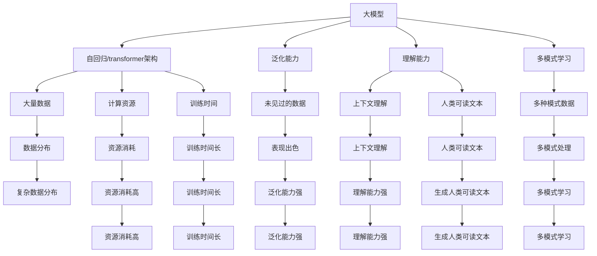

                 

**AI大模型创业：如何应对未来技术挑战？**

**作者：禅与计算机程序设计艺术 / Zen and the Art of Computer Programming**

## 1. 背景介绍

当前，人工智能（AI）技术正在以指数级速度发展，大模型（Large Language Models）已经成为AI领域的关键驱动因素之一。这些模型在自然语言处理（NLP）、计算机视觉、生物信息学等领域取得了显著的成就。然而，创业者面临着如何应对未来技术挑战的问题。本文将探讨大模型创业的关键概念、算法原理、数学模型、项目实践，并提供实际应用场景、工具和资源推荐，最终展望未来发展趋势和挑战。

## 2. 核心概念与联系

### 2.1 大模型的定义

大模型是指具有数十亿甚至数千亿参数的模型，能够处理大量数据并产生人类可理解的输出。它们通过自回归（Autoregressive）或 transformer架构（如DALL-E、CLIP）训练，能够学习复杂的数据分布。

### 2.2 大模型的优势

- **泛化能力**：大模型可以在未见过的数据上表现出色。
- **理解能力**：它们可以理解上下文，生成人类可读的文本，甚至创造新的内容。
- **多模式学习**：大模型可以处理文本、图像、音频等多种模式的数据。

### 2.3 大模型的挑战

- **资源消耗**：大模型需要大量的计算资源和数据。
- **训练时间**：训练大模型需要数天甚至数周的时间。
- **解释性**：大模型的决策过程通常是不透明的，难以解释。

### 2.4 核心概念联系图



## 3. 核心算法原理 & 具体操作步骤

### 3.1 算法原理概述

大模型的核心算法是transformer架构，它由自注意力（Self-Attention）机制和前向传播（Feed-Forward）网络组成。transformer模型可以并行处理输入序列的所有元素，从而提高训练速度。

### 3.2 算法步骤详解

1. **输入表示**：将输入数据（如文本、图像）转换为向量表示。
2. **位置编码**：为输入序列添加位置信息。
3. **自注意力**：计算输入序列中每个元素与其他元素的注意力权重，生成上下文aware的表示。
4. **前向传播**：对自注意力输出进行非线性变换。
5. **输出**：生成输出序列，如下一个单词的预测。

### 3.3 算法优缺点

**优点**：
- **并行化**：transformer模型可以并行处理输入序列的所有元素。
- **理解能力**：transformer模型可以理解上下文，生成人类可读的文本。

**缺点**：
- **计算开销**：自注意力机制的时间复杂度为O(n^2)，限制了模型的规模。
- **训练困难**：大规模transformer模型的训练需要大量的计算资源和时间。

### 3.4 算法应用领域

大模型在NLP、计算机视觉、生物信息学等领域有着广泛的应用。它们可以用于文本生成、机器翻译、图像分类、蛋白质结构预测等任务。

## 4. 数学模型和公式 & 详细讲解 & 举例说明

### 4.1 数学模型构建

大模型的数学模型可以表示为：

$$P(x) = \prod_{i=1}^{n} P(x_i | x_{i-1},..., x_1; \theta)$$

其中，$x$是输入序列，$n$是序列长度，$P(x_i | x_{i-1},..., x_1; \theta)$是条件概率分布，$\theta$是模型参数。

### 4.2 公式推导过程

自注意力机制的数学表达式为：

$$Attention(Q, K, V) = softmax(\frac{QK^T}{\sqrt{d_k}})V$$

其中，$Q$, $K$, $V$是输入序列的查询、键、值表示，$d_k$是键向量的维度。

### 4.3 案例分析与讲解

例如，在文本生成任务中，给定上下文“翻译成法语：我爱你”，大模型需要预测下一个单词。数学模型表示为：

$$P("je" | "traduit en français :")$$

大模型会计算查询、键、值表示，然后使用自注意力机制生成上下文aware的表示，最后通过前向传播网络生成下一个单词的预测概率分布。

## 5. 项目实践：代码实例和详细解释说明

### 5.1 开发环境搭建

大模型的开发需要GPU加速，推荐使用NVIDIA A100或RTX 6000 GPU。此外，还需要安装PyTorch、Transformers库等深度学习框架。

### 5.2 源代码详细实现

以下是transformer模型的简化实现代码：

```python
import torch
import torch.nn as nn

class Transformer(nn.Module):
    def __init__(self, d_model, n_head, ff_dim, dropout=0.1):
        super(Transformer, self).__init__()
        self.att = nn.MultiheadAttention(d_model, n_head)
        self.ff = nn.Sequential(
            nn.Linear(d_model, ff_dim),
            nn.ReLU(),
            nn.Linear(ff_dim, d_model)
        )
        self.dropout = nn.Dropout(dropout)
        self.norm1 = nn.LayerNorm(d_model)
        self.norm2 = nn.LayerNorm(d_model)

    def forward(self, x):
        x = self.norm1(x)
        x = self.att(x, x, x)[0] + x
        x = self.norm2(x)
        x = self.ff(x) + x
        return x
```

### 5.3 代码解读与分析

代码实现了transformer模型的一个层，包括自注意力机制和前向传播网络。模型接受输入$x$, 先进行自注意力机制，然后进行前向传播网络，最后输出结果。

### 5.4 运行结果展示

在合适的数据集上训练模型后，可以使用生成文本任务来展示模型的性能。例如，给定上下文“翻译成法语：我爱你”，模型可以预测下一个单词为“je”。

## 6. 实际应用场景

### 6.1 当前应用

大模型已经在各种领域得到广泛应用，如：

- **文本生成**：生成新闻文章、小说、诗歌等。
- **机器翻译**：将一种语言翻译为另一种语言。
- **图像生成**：生成图像、视频等。

### 6.2 未来应用展望

未来，大模型有望在以下领域取得突破：

- **多模式学习**：大模型可以处理文本、图像、音频等多种模式的数据，未来可以实现更复杂的多模式学习任务。
- **解释性**：大模型的决策过程通常是不透明的，未来可以开发新的技术来解释大模型的决策过程。
- **小数据学习**：大模型需要大量的数据进行训练，未来可以开发新的技术来处理小数据集。

## 7. 工具和资源推荐

### 7.1 学习资源推荐

- **课程**：斯坦福大学的“CS224n：Natural Language Processing with Deep Learning”课程。
- **书籍**：“Attention is All You Need”论文和“Natural Language Processing with Python”书籍。

### 7.2 开发工具推荐

- **框架**：PyTorch、TensorFlow。
- **库**：Transformers、Hugging Face。

### 7.3 相关论文推荐

- “Attention is All You Need”论文。
- “BERT: Pre-training of Deep Bidirectional Transformers for Language Understanding”论文。

## 8. 总结：未来发展趋势与挑战

### 8.1 研究成果总结

大模型在NLP、计算机视觉、生物信息学等领域取得了显著的成就。它们可以理解上下文，生成人类可读的文本，甚至创造新的内容。

### 8.2 未来发展趋势

未来，大模型有望在多模式学习、解释性、小数据学习等领域取得突破。

### 8.3 面临的挑战

大模型面临着资源消耗、训练时间、解释性等挑战。此外，大模型的发展也引发了伦理和隐私等关注。

### 8.4 研究展望

未来的研究可以关注大模型的解释性、小数据学习、多模式学习等领域。此外，还可以研究大模型的伦理和隐私问题。

## 9. 附录：常见问题与解答

**Q：大模型需要多少计算资源？**

**A**：大模型需要大量的计算资源，推荐使用NVIDIA A100或RTX 6000 GPU。

**Q：大模型的训练需要多长时间？**

**A**：大模型的训练需要数天甚至数周的时间。

**Q：大模型的决策过程是否可以解释？**

**A**：大模型的决策过程通常是不透明的，难以解释。未来可以开发新的技术来解释大模型的决策过程。

**作者：禅与计算机程序设计艺术 / Zen and the Art of Computer Programming**

