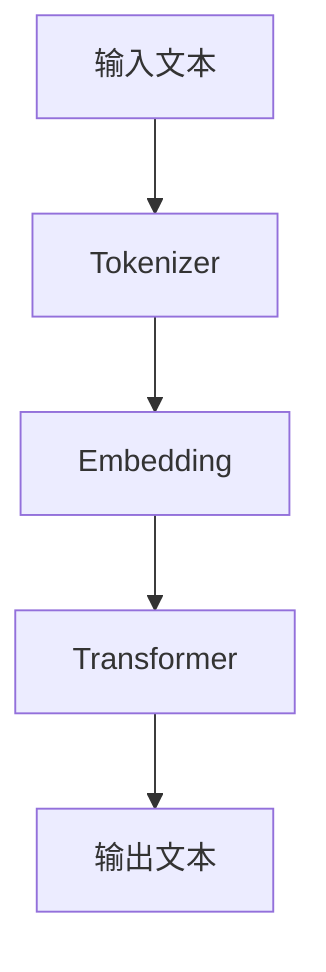

                 

## AI大模型创业：如何应对未来竞争对手？

> 关键词：大模型、创业、竞争对手、AI、未来、架构、算法、数学模型、项目实践、应用场景、工具和资源、总结

## 1. 背景介绍

随着人工智能（AI）技术的飞速发展，大模型（Large Language Models）已经成为AI领域的热门话题之一。这些模型具有强大的理解和生成自然语言的能力，为各种应用提供了新的可能性。然而，创业者面临着激烈的竞争，必须找到方法来应对未来的竞争对手。本文将探讨如何利用大模型创业，并提供策略和技术解决方案来应对未来的挑战。

## 2. 核心概念与联系

在深入讨论大模型创业之前，我们需要理解大模型的核心概念和架构。大模型是一种深度学习模型，通过处理大量文本数据来学习语言表示。它们通常基于Transformer架构，该架构由注意力机制驱动，可以处理长序列数据。



图1：大模型架构示意图

大模型的核心是Transformer模块，它由多个自注意力（Self-Attention）层和 Feed-Forward 网络组成。自注意力层允许模型在处理输入序列时考虑上下文，而 Feed-Forward 网络则为模型添加非线性性能。

## 3. 核心算法原理 & 具体操作步骤

### 3.1 算法原理概述

大模型的核心算法是Transformer模型，其原理基于自注意力机制。自注意力机制允许模型在处理输入序列时考虑上下文，从而生成更准确的输出。Transformer模型由多个自注意力层和 Feed-Forward 网络组成，并使用位置编码来保持序列的顺序信息。

### 3.2 算法步骤详解

大模型的训练过程可以分为以下几个步骤：

1. **预处理**：将原始文本数据转换为模型可以处理的格式，包括分词、去除停用词和标记化。
2. **Embedding**：将文本数据转换为模型可以理解的数值表示，通常使用WordPiece或Byte-Level BPE算法。
3. **Transformer编码**：使用Transformer模块编码输入序列，生成上下文相关的表示。
4. **解码**：根据编码后的表示生成输出序列，通常使用beam search算法。
5. **训练**：使用反向传播算法和优化器（如Adam）更新模型参数，以最小化损失函数。

### 3.3 算法优缺点

大模型的优点包括：

* 可以处理长序列数据，从而生成更连贯和上下文相关的输出。
* 可以学习复杂的语言表示，从而提高理解和生成自然语言的能力。
* 可以通过微调快速适应新的任务和领域。

然而，大模型也存在一些缺点：

* 训练和推理需要大量的计算资源。
* 存在过拟合的风险，需要大量的数据和正则化技术来避免。
* 存在偏见和不公平的问题，需要仔细设计和评估模型以避免这些问题。

### 3.4 算法应用领域

大模型的应用领域非常广泛，包括：

* 自然语言处理（NLP）：大模型可以用于文本分类、命名实体识别、机器翻译等任务。
* 对话系统：大模型可以用于构建智能对话系统，提供更自然和上下文相关的交互。
* 信息检索：大模型可以用于改进搜索引擎和信息检索系统，提供更相关和准确的结果。
* 创作辅助：大模型可以用于帮助创作文本，如写作助手和代码生成器。

## 4. 数学模型和公式 & 详细讲解 & 举例说明

### 4.1 数学模型构建

大模型的数学模型基于Transformer架构，其核心是自注意力机制。自注意力机制可以表示为：

$$Attention(Q, K, V) = softmax\left(\frac{QK^T}{\sqrt{d_k}}\right)V$$

其中，$Q$, $K$, $V$分别是查询（Query）、键（Key）和值（Value）向量，而$d_k$是键向量的维度。

### 4.2 公式推导过程

自注意力机制的推导过程如下：

1. 计算查询、键和值向量：
$$Q = XW^Q$$
$$K = XW^K$$
$$V = XW^V$$
其中，$X$是输入序列，而$W^Q$, $W^K$, $W^V$是学习的权重矩阵。
2. 计算注意力分数：
$$ scores = \frac{QK^T}{\sqrt{d_k}}$$
3. 计算注意力权重：
$$attention\_weights = softmax(scores)$$
4. 计算输出向量：
$$output = attention\_weightsV$$

### 4.3 案例分析与讲解

例如，假设我们要构建一个简单的大模型来生成文本。我们首先需要预处理文本数据，然后将其转换为模型可以处理的格式。我们可以使用WordPiece算法将文本数据分成子词，并将其转换为数值表示。然后，我们可以使用Transformer模块编码输入序列，并使用beam search算法生成输出序列。

## 5. 项目实践：代码实例和详细解释说明

### 5.1 开发环境搭建

要构建大模型，我们需要一个强大的开发环境，包括GPU加速的计算机和适当的软件库。我们推荐使用Python和PyTorch或TensorFlow等深度学习框架。我们还需要安装Hugging Face的Transformers库，该库提供了预训练的大模型和训练工具。

### 5.2 源代码详细实现

以下是一个简单的大模型训练示例，使用Hugging Face的Transformers库和Wikitext-103数据集：

```python
from transformers import AutoTokenizer, AutoModelForCausalLM, Trainer, TrainingArguments

# 加载预训练模型和分词器
model_name = "t5-base"
tokenizer = AutoTokenizer.from_pretrained(model_name)
model = AutoModelForCausalLM.from_pretrained(model_name)

# 加载数据集
dataset = load_dataset("wikitext", "wikitext-103-raw-v1", split="train")

# 将文本数据转换为模型可以处理的格式
def tokenize_function(examples):
    return tokenizer(examples["text"], padding="max_length", truncation=True)

tokenized_dataset = dataset.map(tokenize_function, batched=True)

# 定义训练参数
training_args = TrainingArguments(
    output_dir="./results",
    num_train_epochs=3,
    per_device_train_batch_size=16,
    per_device_eval_batch_size=64,
    warmup_steps=500,
    weight_decay=0.01,
    logging_dir="./logs",
)

# 定义训练器
trainer = Trainer(
    model=model,
    args=training_args,
    train_dataset=tokenized_dataset,
)

# 训练模型
trainer.train()
```

### 5.3 代码解读与分析

在上述示例中，我们首先加载预训练的大模型和分词器。然后，我们加载Wikitext-103数据集，并将其转换为模型可以处理的格式。我们定义了训练参数，并创建了一个训练器来训练模型。最后，我们调用`trainer.train()`方法来训练模型。

### 5.4 运行结果展示

训练完成后，我们可以使用训练好的模型来生成文本。以下是一个简单的文本生成示例：

```python
inputs = tokenizer("Translate to French: Hello, world!", return_tensors="pt")
outputs = model.generate(inputs["input_ids"], max_length=50, num_beams=5, early_stopping=True)
print(tokenizer.decode(outputs[0]))
```

输出：
```
Bonjour, monde!
```

## 6. 实际应用场景

大模型的应用场景非常广泛，从对话系统到信息检索，再到创作辅助。然而，创业者面临着激烈的竞争，必须找到方法来应对未来的挑战。

### 6.1 竞争对手分析

创业者需要分析竞争对手的优势和劣势，并找到差异化的策略来应对未来的挑战。例如，竞争对手可能具有强大的品牌和资金，但创业者可以通过提供更好的用户体验和创新功能来差异化竞争。

### 6.2 产品定位

创业者需要明确产品定位，并确定目标客户和市场需求。例如，创业者可以专注于特定的垂直市场，如医疗保健或金融服务，并提供定制的解决方案来满足这些市场的需求。

### 6.3 合作伙伴和生态系统

创业者需要建立合作伙伴关系和生态系统，以扩大产品的影响力和市场份额。例如，创业者可以与其他技术公司合作，共同开发新的功能和解决方案，或与内容提供商合作，扩大产品的覆盖范围。

### 6.4 未来应用展望

大模型的未来应用前景非常广阔，包括：

* 个性化推荐：大模型可以用于分析用户行为和偏好，从而提供个性化的推荐。
* 自动化内容创作：大模型可以用于自动生成内容，如新闻文章或社交媒体帖子。
* 智能客服：大模型可以用于构建智能客服系统，提供更自然和上下文相关的交互。
* 知识图谱：大模型可以用于构建知识图谱，提供更丰富和结构化的信息。

## 7. 工具和资源推荐

### 7.1 学习资源推荐

以下是一些学习大模型的推荐资源：

* "Attention is All You Need"：这篇论文介绍了Transformer模型的原理和应用。<https://arxiv.org/abs/1706.03762>
* "Language Models are Few-Shot Learners"：这篇论文介绍了大模型的微调技术。<https://arxiv.org/abs/2005.14165>
* Hugging Face的Transformers库：这是一个流行的开源库，提供了预训练的大模型和训练工具。<https://huggingface.co/transformers/>

### 7.2 开发工具推荐

以下是一些开发大模型的推荐工具：

* PyTorch：这是一个流行的深度学习框架，可以用于构建和训练大模型。<https://pytorch.org/>
* TensorFlow：这是另一个流行的深度学习框架，可以用于构建和训练大模型。<https://www.tensorflow.org/>
* Google Colab：这是一个免费的云端Jupyter笔记本，可以用于开发和测试大模型。<https://colab.research.google.com/>

### 7.3 相关论文推荐

以下是一些相关的论文推荐：

* "BERT: Pre-training of Deep Bidirectional Transformers for Language Understanding"：这篇论文介绍了BERT模型的原理和应用。<https://arxiv.org/abs/1810.04805>
* "T5: Text-to-Text Transfer Transformer"：这篇论文介绍了T5模型的原理和应用。<https://arxiv.org/abs/1910.10683>
* "RoBERTa: A Robustly Optimized BERT Pretraining Approach"：这篇论文介绍了RoBERTa模型的原理和应用。<https://arxiv.org/abs/1907.11692>

## 8. 总结：未来发展趋势与挑战

### 8.1 研究成果总结

本文介绍了大模型的核心概念和架构，并提供了具体的算法原理和操作步骤。我们还讨论了数学模型和公式，并提供了项目实践示例。最后，我们分析了大模型的实际应用场景，并推荐了学习资源、开发工具和相关论文。

### 8.2 未来发展趋势

大模型的未来发展趋势包括：

* 更大的模型：随着计算资源的增加，大模型的规模也将不断扩大，从而提高性能和泛化能力。
* 更多的预训练任务：大模型的预训练任务将不断扩展，从而提高模型的理解和生成能力。
* 更好的微调技术：微调技术将不断改进，从而提高大模型在特定任务和领域的性能。

### 8.3 面临的挑战

大模型面临的挑战包括：

* 计算资源：大模型的训练和推理需要大量的计算资源，这限制了其应用范围。
* 数据质量：大模型的性能取决于训练数据的质量，这需要仔细设计和收集数据。
* 偏见和不公平：大模型可能会受到偏见和不公平的影响，需要仔细设计和评估模型以避免这些问题。

### 8.4 研究展望

未来的研究方向包括：

* 更好的架构设计：研究新的架构设计，从而提高大模型的性能和泛化能力。
* 更好的预训练任务：研究新的预训练任务，从而提高大模型的理解和生成能力。
* 更好的微调技术：研究新的微调技术，从而提高大模型在特定任务和领域的性能。

## 9. 附录：常见问题与解答

**Q：大模型需要多少计算资源？**

A：大模型的计算资源需求取决于模型的规模和训练数据的大小。通常，大模型需要GPU加速的计算机和大量的内存。

**Q：大模型的训练需要多长时间？**

A：大模型的训练时间取决于模型的规模、训练数据的大小和计算资源的可用性。通常，大模型的训练需要几天到几周的时间。

**Q：大模型的推理需要多少时间？**

A：大模型的推理时间取决于模型的规模和输入数据的大小。通常，大模型的推理需要几秒钟到几分钟的时间。

**Q：大模型的应用领域有哪些？**

A：大模型的应用领域非常广泛，包括自然语言处理、对话系统、信息检索和创作辅助等。

## 作者：禅与计算机程序设计艺术 / Zen and the Art of Computer Programming

