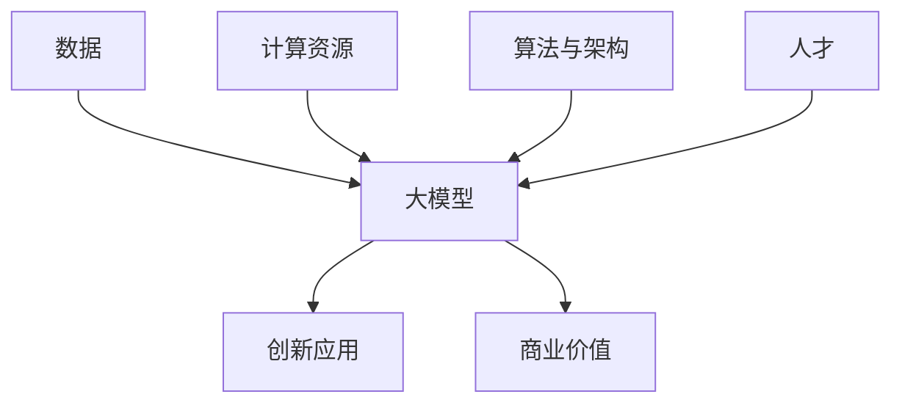

                 

**AI大模型创业：挑战与机遇并存的趋势**

**作者：禅与计算机程序设计艺术 / Zen and the Art of Computer Programming**

## 1. 背景介绍

当前，人工智能（AI）领域正处于大模型创业的风口浪尖。大模型，指的是具有数十亿甚至数千亿参数的模型，能够理解和生成人类语言、图像、视频等复杂数据。这些模型的出现，标志着AI技术的一次飞跃，为各行各业带来了颠覆性的创新机遇。

然而，大模型创业并非一帆风顺。高昂的成本、复杂的技术挑战、伦理和安全问题等，都是创业者必须面对的现实。本文将深入剖析大模型创业的挑战与机遇，帮助读者更好地理解这一领域的发展趋势。

## 2. 核心概念与联系

### 2.1 大模型的定义与特点

大模型是指具有数十亿甚至数千亿参数的模型，能够理解和生成人类语言、图像、视频等复杂数据。大模型的特点包括：

- **规模庞大**：大模型的参数量远超传统模型，这使得它们能够学习到更复杂的特征。
- **泛化能力强**：大模型在未见过的数据上表现出色，这使得它们适合各种应用场景。
- **多模式支持**：大模型能够处理文本、图像、视频等多种模式的数据，这使得它们适合跨模态的应用。

### 2.2 大模型创业的关键要素

大模型创业的关键要素包括：

- **数据**：大量、高质量的数据是大模型的基础。
- **计算资源**：大模型的训练需要大量的计算资源，通常需要GPU集群或云平台。
- **算法与架构**：大模型的算法和架构设计至关重要，直接影响模型的性能和泛化能力。
- **人才**：大模型创业需要一流的AI人才，包括算法工程师、数据科学家和AI架构师。

### 2.3 核心概念联系图

## 3. 核心算法原理 & 具体操作步骤

### 3.1 算法原理概述

大模型的核心算法原理包括：

- **Transformer模型**：大模型的基础是Transformer模型，它使用自注意力机制和位置编码，能够处理序列数据。
- **预训练与微调**：大模型通常先在大量数据上进行预训练，然后在特定任务上进行微调。
- **指数级规模的模型**：大模型的参数量呈指数级增长，这使得它们能够学习到更复杂的特征。

### 3.2 算法步骤详解

大模型的训练步骤包括：

1. **数据预处理**：清洗、标记、切分数据集。
2. **模型构建**：构建Transformer模型，设置参数量、层数等超参数。
3. **预训练**：在大量数据上进行预训练，学习到语言模型。
4. **微调**：在特定任务上进行微调，适应具体应用场景。
5. **评估**：评估模型的性能，调整超参数。

### 3.3 算法优缺点

大模型的优点包括：

- **泛化能力强**：大模型在未见过的数据上表现出色。
- **多模式支持**：大模型能够处理文本、图像、视频等多种模式的数据。
- **创新应用**：大模型开启了新的应用场景，如生成式AI、跨模态理解等。

缺点包括：

- **成本高**：大模型的训练需要大量的计算资源和数据。
- **训练时间长**：大模型的训练需要数天甚至数周的时间。
- **伦理和安全问题**：大模型可能会生成不当或有偏见的内容，需要进行严格的监管。

### 3.4 算法应用领域

大模型的应用领域包括：

- **自然语言处理（NLP）**：大模型能够理解和生成人类语言，适合各种NLP任务，如机器翻译、文本摘要等。
- **计算机视觉（CV）**：大模型能够理解和生成图像，适合各种CV任务，如图像分类、物体检测等。
- **生成式AI**：大模型能够生成音乐、诗歌、绘画等创意内容。

## 4. 数学模型和公式 & 详细讲解 & 举例说明

### 4.1 数学模型构建

大模型的数学模型是基于Transformer的。Transformer模型使用自注意力机制和位置编码，能够处理序列数据。其数学表达式如下：

$$h_i = \text{Attention}(Q_i, K, V) + \text{FFN}(h_i)$$

其中，Attention是自注意力机制，FFN是前馈网络，Q、K、V分别是查询、键、值矩阵，由输入数据线性变换得到。

### 4.2 公式推导过程

自注意力机制的推导过程如下：

1. **查询、键、值的生成**：输入数据线性变换，得到查询、键、值矩阵。
2. **注意力分数的计算**：计算查询和键的注意力分数，公式为：

   $$e_{ij} = \text{score}(Q_i, K_j) = \frac{Q_iK_j^T}{\sqrt{d_k}}$$

   其中，$d_k$是键矩阵的维度。

3. **注意力权重的计算**：计算注意力权重，公式为：

   $$a_{ij} = \frac{e_{ij}}{\sum_{k=1}^{n}e_{ik}}$$

4. **注意力的应用**：计算注意力的结果，公式为：

   $$\text{Attention}(Q, K, V) = \text{softmax}(a)V$$

### 4.3 案例分析与讲解

例如，在机器翻译任务中，大模型需要将源语言翻译成目标语言。输入数据是源语言的句子，输出数据是目标语言的句子。大模型使用自注意力机制理解源语言句子的上下文，然后生成目标语言句子。

## 5. 项目实践：代码实例和详细解释说明

### 5.1 开发环境搭建

大模型的开发需要GPU集群或云平台，如NVIDIA DGX、Google Colab等。此外，还需要安装相关的软件和库，如PyTorch、TensorFlow等。

### 5.2 源代码详细实现

大模型的源代码通常是开源的，可以在GitHub等平台上找到。例如，Transformers库提供了各种预训练的大模型，可以直接用于开发。

### 5.3 代码解读与分析

大模型的代码通常很复杂，需要仔细解读。例如，在Transformer模型的代码中，需要理解自注意力机制的实现，以及前馈网络的实现。

### 5.4 运行结果展示

大模型的运行结果通常是生成的文本、图像或视频。例如，在机器翻译任务中，大模型的运行结果是目标语言的句子。需要评估模型的性能，调整超参数，以提高模型的准确性。

## 6. 实际应用场景

### 6.1 当前应用场景

大模型当前的应用场景包括：

- **搜索引擎**：大模型能够理解用户的查询意图，提供更准确的搜索结果。
- **客服机器人**：大模型能够理解用户的问题，提供更准确的回答。
- **内容生成**：大模型能够生成音乐、诗歌、绘画等创意内容。

### 6.2 未来应用展望

未来，大模型的应用场景将会更加丰富，包括：

- **自动驾驶**：大模型能够理解路况，提供更安全的驾驶决策。
- **医疗诊断**：大模型能够理解病人的症状，提供更准确的诊断结果。
- **虚拟现实**：大模型能够生成更逼真的虚拟环境，提供更好的用户体验。

## 7. 工具和资源推荐

### 7.1 学习资源推荐

学习大模型的资源包括：

- **课程**：Stanford的CS224n、MIT的6.890等课程提供了大模型的系统性学习。
- **文献**：Attention is All You Need、BERT：Pre-training of Deep Bidirectional Transformers for Language Understanding等论文提供了大模型的原始思想。
- **书籍**：Natural Language Processing with Python提供了大模型在NLP领域的应用。

### 7.2 开发工具推荐

开发大模型的工具包括：

- **PyTorch**：提供了丰富的功能，能够方便地构建大模型。
- **TensorFlow**：提供了高效的计算图，能够加速大模型的训练。
- **Transformers库**：提供了各种预训练的大模型，能够方便地用于开发。

### 7.3 相关论文推荐

相关论文包括：

- **Attention is All You Need**：提出了Transformer模型，开创了大模型的新纪元。
- **BERT：Pre-training of Deep Bidirectional Transformers for Language Understanding**：提出了BERT模型，开创了预训练大模型的新纪元。
- **The Illustrated Transformer**：提供了Transformer模型的直观理解。

## 8. 总结：未来发展趋势与挑战

### 8.1 研究成果总结

大模型的研究成果包括：

- **Transformer模型**：开创了大模型的新纪元。
- **预训练大模型**：开创了预训练大模型的新纪元。
- **多模态大模型**：能够处理文本、图像、视频等多种模式的数据。

### 8.2 未来发展趋势

未来，大模型的发展趋势包括：

- **指数级规模的模型**：模型的参数量将会继续增长，学习到更复杂的特征。
- **多模态大模型**：大模型将会更好地理解和生成多模态的数据。
- **生成式AI**：大模型将会更好地生成音乐、诗歌、绘画等创意内容。

### 8.3 面临的挑战

大模型面临的挑战包括：

- **成本高**：大模型的训练需要大量的计算资源和数据。
- **伦理和安全问题**：大模型可能会生成不当或有偏见的内容，需要进行严格的监管。
- **训练时间长**：大模型的训练需要数天甚至数周的时间。

### 8.4 研究展望

未来，大模型的研究展望包括：

- **更好的训练算法**：开发更高效的训练算法，降低大模型的训练成本。
- **更好的评估指标**：开发更好的评估指标，更好地评估大模型的性能。
- **更好的应用场景**：开发更好的应用场景，更好地利用大模型的优势。

## 9. 附录：常见问题与解答

**Q1：大模型的优点是什么？**

A1：大模型的优点包括泛化能力强、多模式支持、创新应用等。

**Q2：大模型的缺点是什么？**

A2：大模型的缺点包括成本高、训练时间长、伦理和安全问题等。

**Q3：大模型的应用领域有哪些？**

A3：大模型的应用领域包括NLP、CV、生成式AI等。

**Q4：大模型的未来发展趋势是什么？**

A4：大模型的未来发展趋势包括指数级规模的模型、多模态大模型、生成式AI等。

**Q5：大模型面临的挑战是什么？**

A5：大模型面临的挑战包括成本高、伦理和安全问题、训练时间长等。

**Q6：大模型的研究展望是什么？**

A6：大模型的研究展望包括更好的训练算法、更好的评估指标、更好的应用场景等。

**Q7：大模型的学习资源有哪些？**

A7：大模型的学习资源包括课程、文献、书籍等。

**Q8：大模型的开发工具有哪些？**

A8：大模型的开发工具包括PyTorch、TensorFlow、Transformers库等。

**Q9：大模型的相关论文有哪些？**

A9：大模型的相关论文包括Attention is All You Need、BERT：Pre-training of Deep Bidirectional Transformers for Language Understanding、The Illustrated Transformer等。

**Q10：大模型的未来应用场景有哪些？**

A10：大模型的未来应用场景包括自动驾驶、医疗诊断、虚拟现实等。

**Q11：大模型的开发环境需要什么？**

A11：大模型的开发环境需要GPU集群或云平台，以及相关的软件和库。

**Q12：大模型的代码解读需要注意什么？**

A12：大模型的代码解读需要注意理解自注意力机制的实现，以及前馈网络的实现。

**Q13：大模型的运行结果展示需要注意什么？**

A13：大模型的运行结果展示需要注意评估模型的性能，调整超参数，以提高模型的准确性。

**Q14：大模型的当前应用场景有哪些？**

A14：大模型的当前应用场景包括搜索引擎、客服机器人、内容生成等。

**Q15：大模型的数学模型是什么？**

A15：大模型的数学模型是基于Transformer的，使用自注意力机制和位置编码，能够处理序列数据。

**Q16：大模型的算法原理是什么？**

A16：大模型的算法原理包括Transformer模型、预训练与微调、指数级规模的模型等。

**Q17：大模型的算法步骤是什么？**

A17：大模型的算法步骤包括数据预处理、模型构建、预训练、微调、评估等。

**Q18：大模型的优缺点是什么？**

A18：大模型的优点包括泛化能力强、多模式支持、创新应用等。缺点包括成本高、训练时间长、伦理和安全问题等。

**Q19：大模型的核心概念是什么？**

A19：大模型的核心概念包括数据、计算资源、算法与架构、人才等。

**Q20：大模型的关键要素是什么？**

A20：大模型的关键要素包括数据、计算资源、算法与架构、人才等。

**Q21：大模型的未来发展趋势是什么？**

A21：大模型的未来发展趋势包括指数级规模的模型、多模态大模型、生成式AI等。

**Q22：大模型的面临的挑战是什么？**

A22：大模型面临的挑战包括成本高、伦理和安全问题、训练时间长等。

**Q23：大模型的研究展望是什么？**

A23：大模型的研究展望包括更好的训练算法、更好的评估指标、更好的应用场景等。

**Q24：大模型的学习资源有哪些？**

A24：大模型的学习资源包括课程、文献、书籍等。

**Q25：大模型的开发工具有哪些？**

A25：大模型的开发工具包括PyTorch、TensorFlow、Transformers库等。

**Q26：大模型的相关论文有哪些？**

A26：大模型的相关论文包括Attention is All You Need、BERT：Pre-training of Deep Bidirectional Transformers for Language Understanding、The Illustrated Transformer等。

**Q27：大模型的未来应用场景有哪些？**

A27：大模型的未来应用场景包括自动驾驶、医疗诊断、虚拟现实等。

**Q28：大模型的开发环境需要什么？**

A28：大模型的开发环境需要GPU集群或云平台，以及相关的软件和库。

**Q29：大模型的代码解读需要注意什么？**

A29：大模型的代码解读需要注意理解自注意力机制的实现，以及前馈网络的实现。

**Q30：大模型的运行结果展示需要注意什么？**

A30：大模型的运行结果展示需要注意评估模型的性能，调整超参数，以提高模型的准确性。

**Q31：大模型的当前应用场景有哪些？**

A31：大模型的当前应用场景包括搜索引擎、客服机器人、内容生成等。

**Q32：大模型的数学模型是什么？**

A32：大模型的数学模型是基于Transformer的，使用自注意力机制和位置编码，能够处理序列数据。

**Q33：大模型的算法原理是什么？**

A33：大模型的算法原理包括Transformer模型、预训练与微调、指数级规模的模型等。

**Q34：大模型的算法步骤是什么？**

A34：大模型的算法步骤包括数据预处理、模型构建、预训练、微调、评估等。

**Q35：大模型的优缺点是什么？**

A35：大模型的优点包括泛化能力强、多模式支持、创新应用等。缺点包括成本高、训练时间长、伦理和安全问题等。

**Q36：大模型的核心概念是什么？**

A36：大模型的核心概念包括数据、计算资源、算法与架构、人才等。

**Q37：大模型的关键要素是什么？**

A37：大模型的关键要素包括数据、计算资源、算法与架构、人才等。

**Q38：大模型的未来发展趋势是什么？**

A38：大模型的未来发展趋势包括指数级规模的模型、多模态大模型、生成式AI等。

**Q39：大模型的面临的挑战是什么？**

A39：大模型面临的挑战包括成本高、伦理和安全问题、训练时间长等。

**Q40：大模型的研究展望是什么？**

A40：大模型的研究展望包括更好的训练算法、更好的评估指标、更好的应用场景等。

**Q41：大模型的学习资源有哪些？**

A41：大模型的学习资源包括课程、文献、书籍等。

**Q42：大模型的开发工具有哪些？**

A42：大模型的开发工具包括PyTorch、TensorFlow、Transformers库等。

**Q43：大模型的相关论文有哪些？**

A43：大模型的相关论文包括Attention is All You Need、BERT：Pre-training of Deep Bidirectional Transformers for Language Understanding、The Illustrated Transformer等。

**Q44：大模型的未来应用场景有哪些？**

A44：大模型的未来应用场景包括自动驾驶、医疗诊断、虚拟现实等。

**Q45：大模型的开发环境需要什么？**

A45：大模型的开发环境需要GPU集群或云平台，以及相关的软件和库。

**Q46：大模型的代码解读需要注意什么？**

A46：大模型的代码解读需要注意理解自注意力机制的实现，以及前馈网络的实现。

**Q47：大模型的运行结果展示需要注意什么？**

A47：大模型的运行结果展示需要注意评估模型的性能，调整超参数，以提高模型的准确性。

**Q48：大模型的当前应用场景有哪些？**

A48：大模型的当前应用场景包括搜索引擎、客服机器人、内容生成等。

**Q49：大模型的数学模型是什么？**

A49：大模型的数学模型是基于Transformer的，使用自注意力机制和位置编码，能够处理序列数据。

**Q50：大模型的算法原理是什么？**

A50：大模型的算法原理包括Transformer模型、预训练与微调、指数级规模的模型等。

**Q51：大模型的算法步骤是什么？**

A51：大模型的算法步骤包括数据预处理、模型构建、预训练、微调、评估等。

**Q52：大模型的优缺点是什么？**

A52：大模型的优点包括泛化能力强、多模式支持、创新应用等。缺点包括成本高、训练时间长、伦理和安全问题等。

**Q53：大模型的核心概念是什么？**

A53：大模型的核心概念包括数据、计算资源、算法与架构、人才等。

**Q54：大模型的关键要素是什么？**

A54：大模型的关键要素包括数据、计算资源、算法与架构、人才等。

**Q55：大模型的未来发展趋势是什么？**

A55：大模型的未来发展趋势包括指数级规模的模型、多模态大模型、生成式AI等。

**Q56：大模型的面临的挑战是什么？**

A56：大模型面临的挑战包括成本高、伦理和安全问题、训练时间长等。

**Q57：大模型的研究展望是什么？**

A57：大模型的研究展望包括更好的训练算法、更好的评估指标、更好的应用场景等。

**Q58：大模型的学习资源有哪些？**

A58：大模型的学习资源包括课程、文献、书籍等。

**Q59：大模型的开发工具有哪些？**

A59：大模型的开发工具包括PyTorch、TensorFlow、Transformers库等。

**Q60：大模型的相关论文有哪些？**

A60：大模型的相关论文包括Attention is All You Need、BERT：Pre-training of Deep Bidirectional Transformers for Language Understanding、The Illustrated Transformer等。

**Q61：大模型的未来应用场景有哪些？**

A61：大模型的未来应用场景包括自动驾驶、医疗诊断、虚拟现实等。

**Q62：大模型的开发环境需要什么？**

A62：大模型的开发环境需要GPU集群或云平台，以及相关的软件和库。

**Q63：大模型的代码解读需要注意什么？**

A63：大模型的代码解读需要注意理解自注意力机制的实现，以及前馈网络的实现。

**Q64：大模型的运行结果展示需要注意什么？**

A64：大模型的运行结果展示需要注意评估模型的性能，调整超参数，以提高模型的准确性。

**Q65：大模型的当前应用场景有哪些？**

A65：大模型的当前应用场景包括搜索引擎、客服机器人、内容生成等。

**Q66：大模型的数学模型是什么？**

A66：大模型的数学模型是基于Transformer的，使用自注意力机制和位置编码，能够处理序列数据。

**Q67：大模型的算法原理是什么？**

A67：大模型的算法原理包括Transformer模型、预训练与微调、指数级规模的模型等。

**Q68：大模型的算法步骤是什么？**

A68：大模型的算法步骤包括数据预处理、模型构建、预训练、微调、评估等。

**Q69：大模型的优缺点是什么？**

A69：大模型的优点包括泛化能力强、多模式支持、创新应用等。缺点包括成本高、训练时间长、伦理和安全问题等。

**Q70：大模型的核心概念是什么？**

A70：大模型的核心概念包括数据、计算资源、算法与架构、人才等。

**Q71：大模型的关键要素是什么？**

A71：大模型的关键要素包括数据、计算资源、算法与架构、人才等。

**Q72：大模型的未来发展趋势是什么？**

A72：大模型的未来发展趋势包括指数级规模的模型、多模态大模型、生成式AI等。

**Q73：大模型的面临的挑战是什么？**

A73：大模型面临的挑战包括成本高、伦理和安全问题、训练时间长等。

**Q74：大模型的研究展望是什么？**

A74：大模型的研究展望包括更好的训练算法、更好的评估指标、更好的应用场景等。

**Q75：大模型的学习资源有哪些？**

A75：大模型的学习资源包括课程、文献、书籍等。

**Q76：大模型的开发工具有哪些？**

A76：大模型的开发工具包括PyTorch、TensorFlow、Transformers库等。

**Q77：大模型的相关论文有哪些？**

A77：大模型的相关论文包括Attention is All You Need、BERT：Pre-training of Deep Bidirectional Transformers for Language Understanding、The Illustrated Transformer等。

**Q78：大模型的未来应用场景有哪些？**

A78：大模型的未来应用场景包括自动驾驶、医疗诊断、虚拟现实等。

**Q79：大模型的开发环境需要什么？**

A79：大模型的开发环境需要GPU集群或云平台，以及相关的软件和库。

**Q80：大模型的代码解读需要注意什么？**

A80：大模型的代码解读需要注意理解自注意力机制的实现，以及前馈网络的实现。

**Q81：大模型的运行结果展示需要注意什么？**

A81：大模型的运行结果展示需要注意评估模型的性能，调整超参数，以提高模型的准确性。

**Q82：大模型的当前应用场景有哪些？**

A82：大模型的当前应用场景包括搜索引擎、客服机器人、内容生成等。

**Q83：大模型的数学模型是什么？**

A83：大模型的数学模型是基于Transformer的，使用自注意力机制和位置编码，能够处理序列数据。

**Q84：大模型的算法原理是什么？**

A84：大模型的算法原理包括Transformer模型、预训练与微调、指数级规模的模型等。

**Q85：大模型的算法步骤是什么？**

A85：大模型的算法步骤包括数据预处理、模型构建、预训练、微调、评估等。

**Q86：大模型的优缺点是什么？**

A86：大模型的优点包括泛化能力强、多模式支持、创新应用等。缺点包括成本高、训练时间长、伦理和安全问题等。

**Q87：大模型的核心概念是什么？**

A87：大模型的核心概念包括数据、计算资源、算法与架构、人才等。

**Q88：大模型的关键要素是什么？**

A88：大模型的关键要素包括数据、计算资源、算法与架构、人才等。

**Q89：大模型的未来发展趋势是什么？**

A89：大模型的未来发展趋势包括指数级规模的模型、多模态大模型、生成式AI等。

**Q90：大模型的面临的挑战是什么？**

A90：大模型面临的挑战包括成本高、伦理和安全问题、训练时间长等。

**Q91：大模型的研究展望是什么？**

A91：大模型的研究展望包括更好的训练算法、更好的评估指标、更好的应用场景等。

**Q92：大模型的学习资源有哪些？**

A92：大模型的学习资源包括课程、文献、书籍等。

**Q93：大模型的开发工具有哪些？**

A93：大模型的开发工具包括PyTorch、TensorFlow、Transformers库等。

**Q94：大模型的相关论文有哪些？**

A94：大模型的相关论文包括Attention is All You Need、BERT：Pre-training of Deep Bidirectional Transformers for Language Understanding、The Illustrated Transformer等。

**Q95：大模型的未来应用场景有哪些？**

A95：大模型的未来应用场景包括自动驾驶、医疗诊断、

