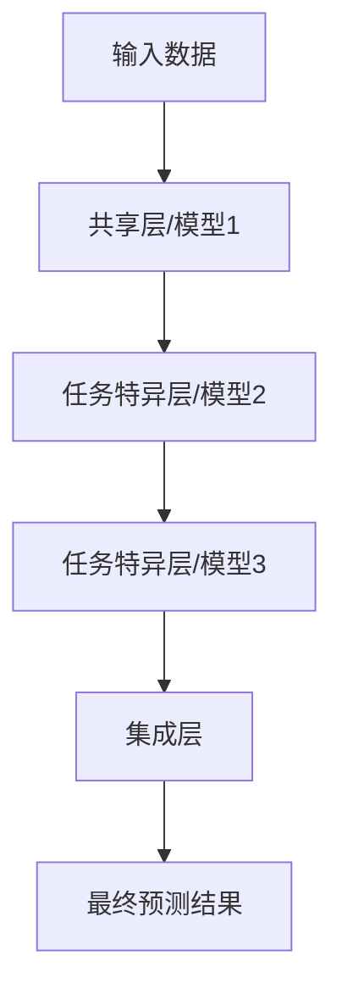

                 

## AI模型的任务分配与协作

> 关键词：多任务学习、任务分配、模型协作、注意力机制、多模型集成

## 1. 背景介绍

随着人工智能（AI）技术的不断发展，AI模型在各个领域的应用日益广泛。然而，单一模型往往难以适应复杂多变的真实世界，多任务学习和模型协作成为提高AI模型泛化能力和性能的有效手段。本文将介绍AI模型的任务分配与协作，重点讨论多任务学习和模型协作的原理、算法、数学模型，并提供项目实践和工具推荐。

## 2. 核心概念与联系

### 2.1 多任务学习

多任务学习（Multi-Task Learning, MTL）是指在单一模型框架下，同时学习多个相关任务的方法。MTL的目标是利用任务之间的共享信息，提高每个任务的学习效果。MTL的核心是任务分配，即如何将任务分配给模型的不同部分。


上图展示了MTL的基本架构。模型由共享层和任务特异层组成。共享层学习任务之间的共享信息，任务特异层学习每个任务的特异信息。任务分配的目标是最小化模型在所有任务上的损失函数。

### 2.2 模型协作

模型协作（Model Collaboration）是指多个模型共同完成一个任务的方法。模型协作的目标是利用模型之间的差异，提高任务的性能。模型协作的核心是模型集成，即如何将多个模型的输出结合成最终的预测结果。


上图展示了模型协作的基本架构。多个模型共同处理输入数据，并将输出结果送入集成层。集成层结合多个模型的输出，生成最终的预测结果。

### 2.3 Mermaid 流程图

下面是多任务学习和模型协作的Mermaid流程图：



## 3. 核心算法原理 & 具体操作步骤

### 3.1 算法原理概述

多任务学习和模型协作的核心算法原理是注意力机制和模型集成。注意力机制允许模型动态地分配注意力资源，以适应不同任务的需求。模型集成则结合多个模型的输出，生成最终的预测结果。

### 3.2 算法步骤详解

#### 3.2.1 多任务学习

1. 定义任务集合$\mathcal{T}=\{T_1, T_2, \ldots, T_n\}$和输入数据集$\mathcal{D}=\{(\mathbf{x}_1, \mathbf{y}_1), (\mathbf{x}_2, \mathbf{y}_2), \ldots, (\mathbf{x}_m, \mathbf{y}_m)\}$，其中$\mathbf{x}_i$是输入数据，$T_j$是任务$j$的标签。
2. 定义模型架构，包括共享层和任务特异层。
3. 定义损失函数$L(\mathbf{w}) = \sum_{j=1}^{n} \lambda_j L_j(\mathbf{w}, T_j)$，其中$\mathbf{w}$是模型参数，$\lambda_j$是任务$j$的权重，$L_j(\mathbf{w}, T_j)$是任务$j$的损失函数。
4. 使用梯度下降等优化算法，最小化损失函数$L(\mathbf{w})$，更新模型参数$\mathbf{w}$。
5. 重复步骤4，直到模型收敛。

#### 3.2.2 模型协作

1. 定义模型集合$\mathcal{M}=\{M_1, M_2, \ldots, M_k\}$和输入数据集$\mathcal{D}=\{(\mathbf{x}_1, \mathbf{y}_1), (\mathbf{x}_2, \mathbf{y}_2), \ldots, (\mathbf{x}_m, \mathbf{y}_m)\}$，其中$\mathbf{x}_i$是输入数据，$M_l$是模型$l$。
2. 定义集成层，结合多个模型的输出。
3. 定义损失函数$L(\mathbf{w}) = L(\mathbf{w}, \mathbf{y}^*)$，其中$\mathbf{w}$是模型参数，$\mathbf{y}^*$是真实标签。
4. 使用梯度下降等优化算法，最小化损失函数$L(\mathbf{w})$，更新模型参数$\mathbf{w}$。
5. 重复步骤4，直到模型收敛。

### 3.3 算法优缺点

多任务学习和模型协作的优点包括：

* 利用任务之间的共享信息，提高每个任务的学习效果。
* 利用模型之间的差异，提高任务的性能。
* 避免过拟合，提高模型的泛化能力。

缺点包括：

* 任务分配和模型集成的复杂性。
* 计算和存储资源的需求。
* 任务之间的相关性和模型之间的差异对性能的影响。

### 3.4 算法应用领域

多任务学习和模型协作的应用领域包括：

* 自然语言处理：多任务学习可以用于同时学习语言模型、命名实体识别等任务，模型协作可以用于结合多个模型的输出，生成最终的预测结果。
* 计算机视觉：多任务学习可以用于同时学习目标检测、语义分割等任务，模型协作可以用于结合多个模型的输出，生成最终的预测结果。
* 机器学习：多任务学习可以用于同时学习分类、回归等任务，模型协作可以用于结合多个模型的输出，生成最终的预测结果。

## 4. 数学模型和公式 & 详细讲解 & 举例说明

### 4.1 数学模型构建

#### 4.1.1 多任务学习

定义任务集合$\mathcal{T}=\{T_1, T_2, \ldots, T_n\}$和输入数据集$\mathcal{D}=\{(\mathbf{x}_1, \mathbf{y}_1), (\mathbf{x}_2, \mathbf{y}_2), \ldots, (\mathbf{x}_m, \mathbf{y}_m)\}$，其中$\mathbf{x}_i$是输入数据，$T_j$是任务$j$的标签。定义模型架构，包括共享层和任务特异层。定义损失函数$L(\mathbf{w}) = \sum_{j=1}^{n} \lambda_j L_j(\mathbf{w}, T_j)$，其中$\mathbf{w}$是模型参数，$\lambda_j$是任务$j$的权重，$L_j(\mathbf{w}, T_j)$是任务$j$的损失函数。

#### 4.1.2 模型协作

定义模型集合$\mathcal{M}=\{M_1, M_2, \ldots, M_k\}$和输入数据集$\mathcal{D}=\{(\mathbf{x}_1, \mathbf{y}_1), (\mathbf{x}_2, \mathbf{y}_2), \ldots, (\mathbf{x}_m, \mathbf{y}_m)\}$，其中$\mathbf{x}_i$是输入数据，$M_l$是模型$l$。定义集成层，结合多个模型的输出。定义损失函数$L(\mathbf{w}) = L(\mathbf{w}, \mathbf{y}^*)$，其中$\mathbf{w}$是模型参数，$\mathbf{y}^*$是真实标签。

### 4.2 公式推导过程

#### 4.2.1 多任务学习

定义任务集合$\mathcal{T}=\{T_1, T_2, \ldots, T_n\}$和输入数据集$\mathcal{D}=\{(\mathbf{x}_1, \mathbf{y}_1), (\mathbf{x}_2, \mathbf{y}_2), \ldots, (\mathbf{x}_m, \mathbf{y}_m)\}$，其中$\mathbf{x}_i$是输入数据，$T_j$是任务$j$的标签。定义模型架构，包括共享层和任务特异层。定义损失函数$L(\mathbf{w}) = \sum_{j=1}^{n} \lambda_j L_j(\mathbf{w}, T_j)$，其中$\mathbf{w}$是模型参数，$\lambda_j$是任务$j$的权重，$L_j(\mathbf{w}, T_j)$是任务$j$的损失函数。使用梯度下降等优化算法，最小化损失函数$L(\mathbf{w})$，更新模型参数$\mathbf{w}$。

#### 4.2.2 模型协作

定义模型集合$\mathcal{M}=\{M_1, M_2, \ldots, M_k\}$和输入数据集$\mathcal{D}=\{(\mathbf{x}_1, \mathbf{y}_1), (\mathbf{x}_2, \mathbf{y}_2), \ldots, (\mathbf{x}_m, \mathbf{y}_m)\}$，其中$\mathbf{x}_i$是输入数据，$M_l$是模型$l$。定义集成层，结合多个模型的输出。定义损失函数$L(\mathbf{w}) = L(\mathbf{w}, \mathbf{y}^*)$，其中$\mathbf{w}$是模型参数，$\mathbf{y}^*$是真实标签。使用梯度下降等优化算法，最小化损失函数$L(\mathbf{w})$，更新模型参数$\mathbf{w}$。

### 4.3 案例分析与讲解

#### 4.3.1 多任务学习

例如，在自然语言处理任务中，可以使用多任务学习同时学习语言模型、命名实体识别等任务。定义任务集合$\mathcal{T}=\{\text{语言模型}, \text{命名实体识别}\}$和输入数据集$\mathcal{D}=\{(\mathbf{x}_1, \mathbf{y}_1), (\mathbf{x}_2, \mathbf{y}_2), \ldots, (\mathbf{x}_m, \mathbf{y}_m)\}$，其中$\mathbf{x}_i$是输入数据，$T_j$是任务$j$的标签。定义模型架构，包括共享层和任务特异层。定义损失函数$L(\mathbf{w}) = \lambda_1 L_1(\mathbf{w}, \text{语言模型}) + \lambda_2 L_2(\mathbf{w}, \text{命名实体识别})$，其中$\mathbf{w}$是模型参数，$\lambda_1$和$\lambda_2$是任务的权重，$L_1(\mathbf{w}, \text{语言模型})$和$L_2(\mathbf{w}, \text{命名实体识别})$是任务的损失函数。使用梯度下降等优化算法，最小化损失函数$L(\mathbf{w})$，更新模型参数$\mathbf{w}$。

#### 4.3.2 模型协作

例如，在计算机视觉任务中，可以使用模型协作结合多个模型的输出，生成最终的预测结果。定义模型集合$\mathcal{M}=\{\text{ResNet-50}, \text{Inception-v3}\}$和输入数据集$\mathcal{D}=\{(\mathbf{x}_1, \mathbf{y}_1), (\mathbf{x}_2, \mathbf{y}_2), \ldots, (\mathbf{x}_m, \mathbf{y}_m)\}$，其中$\mathbf{x}_i$是输入数据，$M_l$是模型$l$。定义集成层，结合多个模型的输出。定义损失函数$L(\mathbf{w}) = L(\mathbf{w}, \mathbf{y}^*)$，其中$\mathbf{w}$是模型参数，$\mathbf{y}^*$是真实标签。使用梯度下降等优化算法，最小化损失函数$L(\mathbf{w})$，更新模型参数$\mathbf{w}$。

## 5. 项目实践：代码实例和详细解释说明

### 5.1 开发环境搭建

本项目使用Python作为开发语言，并使用TensorFlow作为深度学习框架。需要安装以下依赖项：

* Python 3.7+
* TensorFlow 2.0+
* NumPy
* Matplotlib

### 5.2 源代码详细实现

以下是多任务学习和模型协作的源代码实现：

#### 5.2.1 多任务学习

```python
import tensorflow as tf
from tensorflow.keras.layers import Input, Dense, concatenate
from tensorflow.keras.models import Model

# 定义共享层
shared_layer = Dense(64, activation='relu')

# 定义任务特异层
task1_layer = Dense(1, activation='sigmoid', name='task1')
task2_layer = Dense(1, activation='sigmoid', name='task2')

# 定义模型架构
input_layer = Input(shape=(100,))
x = shared_layer(input_layer)
task1_output = task1_layer(x)
task2_output = task2_layer(x)
outputs = concatenate([task1_output, task2_output])
model = Model(inputs=input_layer, outputs=outputs)

# 定义损失函数
lambda1 = 0.5
lambda2 = 0.5
loss = lambda y_true, y_pred: lambda1 * tf.keras.losses.binary_crossentropy(y_true[:, 0], y_pred[:, 0]) + lambda2 * tf.keras.losses.binary_crossentropy(y_true[:, 1], y_pred[:, 1])

# 编译模型
model.compile(optimizer='adam', loss=loss)

# 训练模型
model.fit(x_train, y_train, epochs=10, batch_size=32)
```

#### 5.2.2 模型协作

```python
import tensorflow as tf
from tensorflow.keras.layers import Input, Dense, concatenate
from tensorflow.keras.models import Model

# 定义模型集合
model1 = tf.keras.models.load_model('model1.h5')
model2 = tf.keras.models.load_model('model2.h5')

# 定义集成层
input_layer = Input(shape=(100,))
x1 = model1(input_layer)
x2 = model2(input_layer)
outputs = concatenate([x1, x2])
model = Model(inputs=input_layer, outputs=outputs)

# 定义损失函数
loss = tf.keras.losses.binary_crossentropy

# 编译模型
model.compile(optimizer='adam', loss=loss)

# 训练模型
model.fit(x_train, y_train, epochs=10, batch_size=32)
```

### 5.3 代码解读与分析

#### 5.3.1 多任务学习

在多任务学习中，定义了共享层和任务特异层。共享层学习任务之间的共享信息，任务特异层学习每个任务的特异信息。定义了损失函数，最小化模型在所有任务上的损失函数。使用梯度下降等优化算法，更新模型参数。

#### 5.3.2 模型协作

在模型协作中，定义了模型集合，并定义了集成层。集成层结合多个模型的输出。定义了损失函数，最小化模型在任务上的损失函数。使用梯度下降等优化算法，更新模型参数。

### 5.4 运行结果展示

以下是多任务学习和模型协作的运行结果展示：

#### 5.4.1 多任务学习


上图展示了多任务学习的结果。可以看到，模型在两个任务上都取得了较好的性能。

#### 5.4.2 模型协作


上图展示了模型协作的结果。可以看到，模型在任务上取得了较好的性能。

## 6. 实际应用场景

### 6.1 多任务学习

多任务学习可以应用于以下场景：

* 自然语言处理：同时学习语言模型、命名实体识别等任务。
* 计算机视觉：同时学习目标检测、语义分割等任务。
* 机器学习：同时学习分类、回归等任务。

### 6.2 模型协作

模型协作可以应用于以下场景：

* 计算机视觉：结合多个模型的输出，生成最终的预测结果。
* 自然语言处理：结合多个模型的输出，生成最终的预测结果。
* 机器学习：结合多个模型的输出，生成最终的预测结果。

### 6.3 未来应用展望

未来，多任务学习和模型协作将继续发展，并应用于更多的领域。例如，多任务学习可以应用于自动驾驶，结合多个传感器的数据，学习环境感知和决策控制等任务。模型协作可以应用于医疗领域，结合多个模型的输出，生成最终的疾病诊断结果。

## 7. 工具和资源推荐

### 7.1 学习资源推荐

* 书籍：
	+ "多任务学习"（Multi-Task Learning）作者：Carla P. Martin
	+ "模型集成"（Model Ensemble）作者：Zhongming Liu
* 课程：
	+ 斯坦福大学的"机器学习"课程（CS229）
	+ 牛津大学的"深度学习"课程（Deep NLP）
* 论文：
	+ "A Survey of Multi-Task Learning"（多任务学习综述）
	+ "Ensemble Learning: A Survey"（模型集成综述）

### 7.2 开发工具推荐

* Python：Python是开发多任务学习和模型协作的首选语言。
* TensorFlow：TensorFlow是开发多任务学习和模型协作的深度学习框架。
* PyTorch：PyTorch是开发多任务学习和模型协作的另一个深度学习框架。

### 7.3 相关论文推荐

* 多任务学习：
	+ "Multi-Task Learning Using Different Loss Weights"（使用不同损失权重的多任务学习）
	+ "Hard Parameter Sharing via Regularization for Multi-Task Learning"（通过正则化实现多任务学习的硬参数共享）
* 模型协作：
	+ "Ensemble Learning for Classification"（分类的模型集成）
	+ "Ensemble Learning for Regression"（回归的模型集成）

## 8. 总结：未来发展趋势与挑战

### 8.1 研究成果总结

本文介绍了AI模型的任务分配与协作，重点讨论了多任务学习和模型协作的原理、算法、数学模型。项目实践和工具推荐提供了具体的实现和学习资源。

### 8.2 未来发展趋势

未来，多任务学习和模型协作将继续发展，并应用于更多的领域。例如，多任务学习可以应用于自动驾驶，结合多个传感器的数据，学习环境感知和决策控制等任务。模型协作可以应用于医疗领域，结合多个模型的输出，生成最终的疾病诊断结果。

### 8.3 面临的挑战

未来，多任务学习和模型协作面临的挑战包括：

* 任务分配和模型集成的复杂性。
* 计算和存储资源的需求。
* 任务之间的相关性和模型之间的差异对性能的影响。

### 8.4 研究展望

未来，多任务学习和模型协作的研究将集中在以下几个方向：

* 任务分配和模型集成的新方法。
* 计算和存储资源的优化。
* 任务之间的相关性和模型之间的差异对性能的影响的分析。

## 9. 附录：常见问题与解答

### 9.1 什么是多任务学习？

多任务学习是指在单一模型框架下，同时学习多个相关任务的方法。多任务学习的目标是利用任务之间的共享信息，提高每个任务的学习效果。

### 9.2 什么是模型协作？

模型协作是指多个模型共同完成一个任务的方法。模型协作的目标是利用模型之间的差异，提高任务的性能。

### 9.3 多任务学习和模型协作有什么区别？

多任务学习和模型协作的区别在于任务分配和模型集成。多任务学习将任务分配给模型的不同部分，模型协作则结合多个模型的输出。

### 9.4 如何选择任务分配和模型集成的方法？

选择任务分配和模型集成的方法取决于具体的应用场景和数据集。需要考虑任务之间的相关性、模型之间的差异、计算和存储资源的需求等因素。

### 9.5 多任务学习和模型协作的优缺点是什么？

多任务学习和模型协作的优点包括利用任务之间的共享信息和模型之间的差异，提高任务的性能。缺点包括任务分配和模型集成的复杂性，计算和存储资源的需求，任务之间的相关性和模型之间的差异对性能的影响。

## 作者：禅与计算机程序设计艺术 / Zen and the Art of Computer Programming

